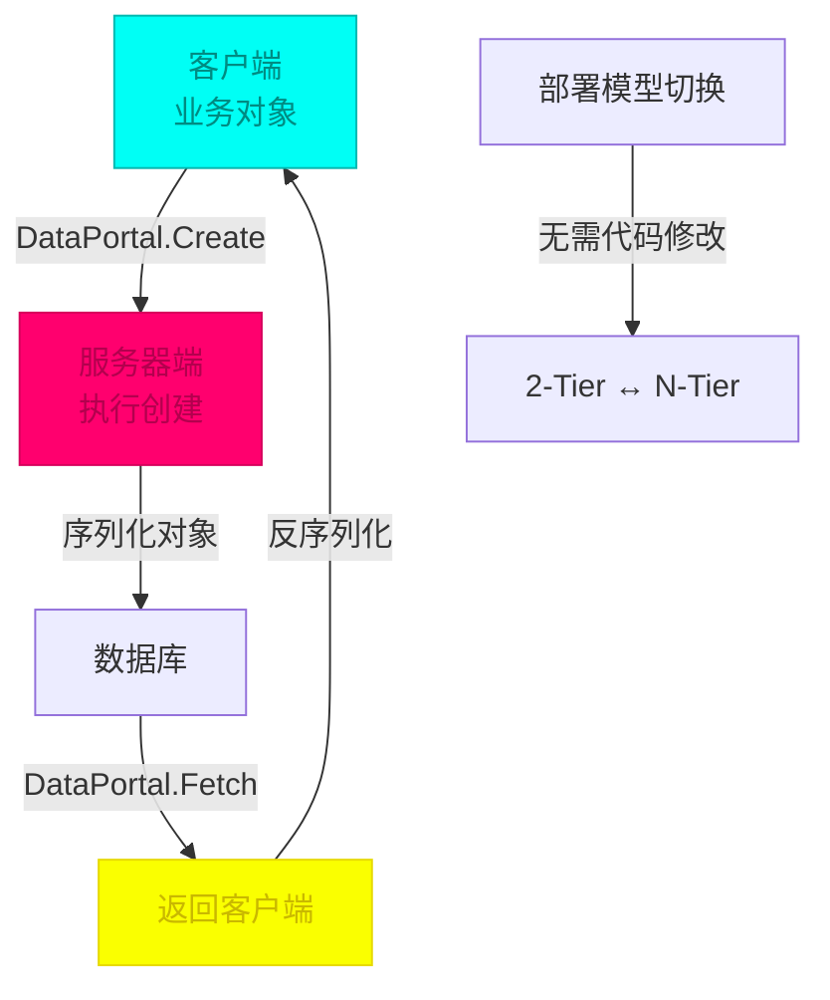
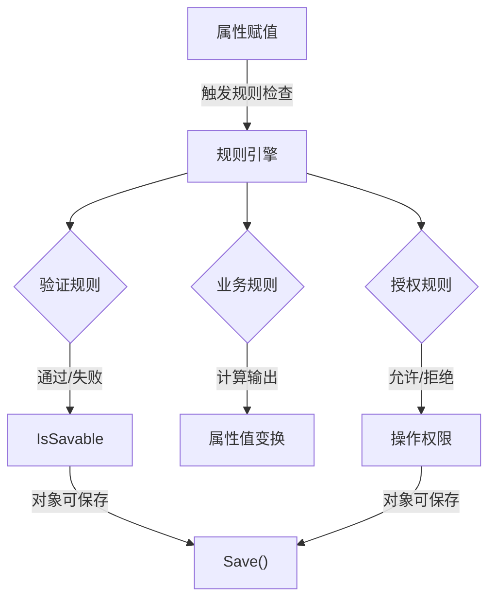
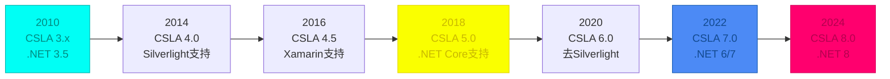

# 引言：我的架构启蒙之路

2010 年，我接触了 CSLA.NET 框架，阅读了《C# 企业应用开发艺术：CSLA.NET 框架开发实战》这本书。这本书让我对企业级应用开发有了新的认识，理解了 N-Tier 分布式架构的设计思路。

## 框架背景

**CSLA** = **C**omponent-based **S**calable **L**ogical **Architecture**（基于组件的可扩展逻辑架构）

| 项目 | 说明 |
|------|------|
| **作者** | Rockford Lhotka |
| **官网** | https://cslanet.com/ |
| **GitHub** | https://github.com/MarimerLLC/csla |

2010 年的技术环境：Windows Forms 仍是桌面主流，Web Forms 主导 Web 开发，WPF 刚刚兴起，Silverlight 被视为未来。CSLA.NET 在这个时期提供了一套完整的业务层解决方案。

---

## CSLA.NET 框架概述

### 什么是 CSLA.NET

**CSLA** = **C**omponent-based **S**calable **L**ogical **Architecture**（基于组件的可扩展逻辑架构）

- **作者**: Rockford Lhotka
- **官网**: https://cslanet.com/
- **Wiki**: https://en.wikipedia.org/wiki/Component-based_Scalable_Logical_Architecture
- **GitHub**: https://github.com/MarimerLLC/csla

CSLA.NET 的核心理念是：业务逻辑不应该散落在 UI 层、数据访问层或其他地方，而应该有一个专门的"家"——业务对象层。

### 核心价值主张

**CSLA.NET 的关键特性**：

| 特性 | 描述 | 应用场景 |
|------|------|----------|
| **N-Level Undo** | 支持多级撤销操作，对象状态可回溯到任意历史状态 | 表单编辑、复杂向导、取消操作 |
| **业务规则跟踪** | 自动跟踪业务规则执行状态，规则可组合、可依赖 | 复杂业务验证、跨字段验证 |
| **元状态维护** | 自动维护对象的元数据状态（IsNew, IsDirty, IsDeleted, IsValid） | 数据绑定、UI状态控制 |
| **数据访问位置透明** | 通过 DataPortal 实现，业务对象无需关心数据访问位置 | 2-Tier ↔ N-Tier 灵活部署 |
| **Web Services 支持** | 原生支持通过 Web Services 进行分布式数据访问 | 跨网络应用服务器部署 |

传统架构的问题：

```
┌─────────────┐    ┌──────────────┐    ┌──────────────┐
│  UI Layer   │    │ Business Layer│    │  Data Layer  │
│ (WinForms)  │    │  (散乱代码)   │    │  (ADO.NET)   │
└─────────────┘    └──────────────┘    └──────────────┘
        ↓                   ↓                   ↓
    业务逻辑散落各处     难以维护和测试       技术债务累积

```

CSLA.NET 的解决方案：

```
┌─────────────────────────────────────────────────────────────┐
│                    CSLA.NET 业务层                         │
│  ┌────────────────────────────────────────────────────────┐ │
│  │ 业务对象 (Business Objects)                            │ │
│  │ ├── 继承 BusinessBase/ReadOnlyBase                     │ │
│  │ ├── 业务规则 (Business Rules)                          │ │
│  │ ├── 验证规则 (Validation Rules)                        │ │
│  │ ├── 授权规则 (Authorization Rules)                     │ │
│  │ └── 状态管理 (State Tracking)                          │ │
│  └────────────────────────────────────────────────────────┘ │
│  ┌────────────────────────────────────────────────────────┐ │
│  │ DataPortal (数据门户 - 移动对象的核心)                 │ │
│  │ ├── Create/Fetch/Update/Delete                        │ │
│  │ ├── 通道适配器 (Channel Adapter)                       │ │
│  │ └── 消息路由 (Message Router)                          │ │
│  └────────────────────────────────────────────────────────┘ │
│  ┌────────────────────────────────────────────────────────┐ │
│  │ 配置驱动的部署模型                                     │ │
│  │ ├── 1-Tier (2层直接访问)                              │ │
│  │ ├── 2-Tier (客户端-服务器)                            │ │
│  │ └── N-Tier (多层应用服务器)                           │ │
│  └────────────────────────────────────────────────────────┘ │
└─────────────────────────────────────────────────────────────┘
              ↓ 可用于任何 UI 技术
┌─────────────┬─────────────┬─────────────┐
│   WPF/WF    │ Blazor/WASM │  WinForms   │
└─────────────┴─────────────┴─────────────┘

```

CSLA.NET 的核心价值在于：
1. **业务逻辑的专门容器**：为验证规则、业务规则、授权规则提供统一的框架
2. **移动对象架构**：对象可在客户端和服务器之间移动，同时保持状态和行为
3. **配置驱动的部署**：无需修改代码即可切换 2-Tier 和 N-Tier 部署
4. **UI 无关的业务层**：同样的业务对象可用于 WinForms、WPF、Blazor 等任何 UI 技术

---

## 移动对象：CSLA.NET 的核心创新

### 什么是移动对象

**移动对象（Mobile Objects）**是 CSLA.NET 的标志性概念，指的是业务对象可以"物理性地"在不同的计算层之间移动，同时保持其状态和行为的完整性。

传统无状态架构的问题：

```
客户端                      服务器
  │                             │
  │ ┌─────────────┐            │
  │ │  业务对象   │            │
  │ │  (无状态)   │            │
  │ └─────────────┘            │
  │                             │
  └───────── 数据请求 ──────────→
  │                             │
  ◄──────── 返回数据 ────────────

```

CSLA.NET 的解决方案：

```
客户端                      服务器
  │                             │
  │ ┌─────────────┐            │
  │ │  业务对象   │            │
  │ │  (有状态)   │            │
  │ └─────────────┘            │
  │                             │
  └─ DataPortal.Create() ──────→  对象移动到服务器
                              │
                           ┌──▼──────────┐
                           │ 业务逻辑执行 │
                           │ 数据库操作   │
                           └─────────────┘
                              │
  ◄─ DataPortal.Fetch() ─────────  对象回到客户端
                              │
  │ ┌─────────────┐            │
  │ │  业务对象   │            │
  │ │ (完整状态)  │            │
  │ └─────────────┘            │

```

### 移动对象的关键特性



**代码示例**：

```csharp
// 业务对象定义
public class Customer : BusinessBase<Customer>
{
    public static readonly PropertyInfo<int> IdProperty =
        RegisterProperty<int>(c => c.Id);

    public static readonly PropertyInfo<string> NameProperty =
        RegisterProperty<string>(c => c.Name);

    public int Id
    {
        get => GetProperty(IdProperty);
        private set => SetProperty(IdProperty, value);
    }

    public string Name
    {
        get => GetProperty(NameProperty);
        set => SetProperty(NameProperty, value);
    }

    // 工厂方法
    public static Customer CreateCustomer()
    {
        return DataPortal.Create<Customer>();
    }

    public static Customer GetCustomer(int id)
    {
        return DataPortal.Fetch<Customer>(id);
    }

    // DataPortal 方法 - 在服务器端执行
    private void DataPortal_Fetch(int id)
    {
        using (var ctx = DbContextManager<DatabaseContext>.GetManager())
        {
            var data = ctx.DataContext.Customers.Single(c => c.Id == id);
            using (BypassPropertyChecks)  // 绕过属性检查
            {
                LoadProperty(IdProperty, data.Id);
                LoadProperty(NameProperty, data.Name);
            }
        }
    }

    protected override void AddBusinessRules()
    {
        base.AddBusinessRules();

        // 验证规则
        BusinessRules.AddRule(new RequiredRule(NameProperty));
        BusinessRules.AddRule(new MaxLengthRule(NameProperty, 100));

        // 业务规则
        BusinessRules.AddRule(new CustomerAgeRule());

        // 授权规则
        BusinessRules.AddRule(
            new AuthorizationRule(
                AuthorizationActions.WriteProperty,
                NameProperty,
                "AdminRole"
            )
        );
    }
}

// 使用示例
var customer = Customer.GetCustomer(1);
customer.Name = "新名称";
customer.Save();  // 自动调用 DataPortal_Update

```

### 配置驱动的部署模型

CSLA.NET 最强大的特性之一是通过配置即可切换部署模型，无需修改任何代码。

**客户端配置 (appsettings.json)**：

```json
{
  "CSLA": {
    "DataPortalProxy": "Local",
    "DataPortalUrl": ""
  }
}

```

**2-Tier 配置**：

```json
{
  "CSLA": {
    "DataPortalProxy": "HttpProxy",
    "DataPortalUrl": "https://api.example.com/api/dataportal"
  }
}

```

**N-Tier 配置**：

```json
{
  "CSLA": {
    "DataPortalProxy": "WcfProxy",
    "DataPortalUrl": "net.tcp://server:8000/WcfPortal"
  }
}

```

---

## DataPortal：分布式数据门户架构

### DataPortal 架构解析

DataPortal 是 CSLA.NET 移动对象架构的核心，它负责在客户端和服务器之间传递业务对象。

```
┌─────────────────────────────────────────────────────┐
│           客户端 DataPortal (Static)                │
│  ┌───────────────────────────────────────────────┐ │
│  │ Create() / Fetch() / Update() / Delete()     │ │
│  └──────────────┬──────────────────────────────┘ │
└─────────────────┼──────────────────────────────────┘
                  │
                  ▼
        ┌─────────────────────┐
        │      代理层         │
        │ ┌─────────────────┐ │
        │ │ LocalProxy      │ │ ← 直接访问
        │ │ HttpProxy       │ │ ← HTTP/HTTPS
        │ │ WcfProxy        │ │ ← WCF
        │ │ RabbitMqProxy   │ │ ← 消息队列
        │ └─────────────────┘ │
        └─────────┬───────────┘
                  │
                  ▼
┌─────────────────────────────────────────────────────┐
│          服务器端 DataPortal                        │
│  ┌───────────────────────────────────────────────┐ │
│  │ 消息路由器 (Message Router)                    │ │
│  │  ├── Create/Fetch (查询条件对象)               │ │
│  │  ├── Update/Delete (业务对象本身)              │ │
│  │  └── Execute (命令对象)                       │ │
│  └──────┬─────────────────────────────────────────┘ │
│          │
│          ▼
│  ┌───────────────────────────────────────────────┐ │
│  │ 业务对象 DataPortal_* 方法实现                │ │
│  │  ┌─────────────────────────────────────────┐ │ │
│  │  │ DataPortal_Create()                     │ │ │
│  │  │ DataPortal_Fetch()                      │ │ │
│  │  │ DataPortal_Insert()                     │ │ │
│  │  │ DataPortal_Update()                     │ │ │
│  │  │ DataPortal_Delete()                     │ │ │
│  │  └─────────────────────────────────────────┘ │ │
│  └─────────────────────────────────────────────┘ │
│                                                  │
│  ┌───────────────────────────────────────────────┐ │
│  │ 数据访问层 (DAL) - 可插拔                     │ │
│  │  ├── ADO.NET                                 │ │
│  │  ├── Entity Framework                        │ │
│  │  ├── NHibernate                              │ │
│  │  └── LINQ to SQL                             │ │
│  └─────────────────────────────────────────────┘ │
└─────────────────────────────────────────────────────┘

```

### 动态层切换能力（运行时代理工厂）

CSLA.NET 4.0 引入了更强大的**动态层切换能力**，通过自定义代理工厂（IDataPortalProxyFactory）实现运行时根据业务对象类型选择不同的数据访问通道。

**配置驱动的代理切换**：

```csharp
// 默认行为：通过配置文件统一切换代理
// app.config/web.config
<configuration>
  <appSettings>
    <!-- 切换到本地代理 -->
    <add key="CslaDataPortalProxy" value="Local" />

    <!-- 或切换到 HTTP 代理 -->
    <add key="CslaDataPortalProxy" value="HttpProxy" />

    <!-- 或切换到 WCF 代理 -->
    <add key="CslaDataPortalProxy" value="WcfProxy" />
  </appSettings>
</configuration>

```

**自定义代理工厂（高级场景）**：

```csharp
// 实现 IDataPortalProxyFactory 接口
public class CustomProxyFactory : IDataPortalProxyFactory
{
    public IDataPortalProxy CreateProxy(Type objectType)
    {
        // 根据业务对象类型动态选择代理
        if (objectType.Namespace.StartsWith("MyApp.LocalOnly"))
        {
            // 本地对象使用直接数据库访问
            return new LocalProxy();
        }

        if (objectType.Namespace.StartsWith("MyApp.Remote"))
        {
            // 远程对象通过 HTTP 调用应用服务器
            return new HttpProxy();
        }

        if (objectType == typeof(SensitiveData))
        {
            // 敏感数据使用专用安全通道
            return new SecureWcfProxy();
        }

        // 默认代理
        return new HttpProxy();
    }
}

// 配置自定义代理工厂
<configuration>
  <appSettings>
    <add key="CslaDataPortalProxyFactory"
         value="MyApp.CustomProxyFactory, MyApp" />
  </appSettings>
</configuration>

```

**应用场景**：

| 场景 | 实现方案 | 优势 |
|------|----------|------|
| **混合部署** | 核心数据用本地代理，报表用远程代理 | 性能与灵活性兼顾 |
| **多租户** | 不同租户使用不同应用服务器 | 租户隔离 |
| **偶尔连接** | 在线时用远程代理，离线时用本地代理 | 支持离线场景 |
| **安全分级** | 敏感操作用加密通道，普通操作用标准通道 | 分级安全 |

### 通道适配器模式（Channel Adapter）

设计意图：允许应用在不同部署模型之间灵活切换。

```
ChannelAdapter
      │
      ├─→ LocalAdapter
      │    (直接数据库访问，2层)
      │
      ├─→ HttpAdapter
      │    (HTTP/HTTPS，3层Web)
      │
      ├─→ WcfAdapter
      │    (WCF协议，3层服务)
      │
      ├─→ RabbitMqAdapter
      │    (消息队列，异步解耦)
      │
      └─→ gRPCAdapter
           (gRPC，高性能RPC)

```

### 消息路由模式（Message Router）

单一入口点设计：

```
客户端请求 → DataPortal → 代理层 → 网络传输
                                           │
                                           ▼
                          ┌────────────────────────┴────────────┐
                          │ 服务器 DataPortal (单一入口)         │
                          │ ┌───────────────────────────────┐ │
                          │ │ 消息路由器                     │ │
                          │ │ ┌────────┬────────┐          │ │
                          │ │ │ Create │ Fetch │ Execute │ │
                          │ │ └───┬────┴───┬────┘          │ │
                          │ │     │       │      │         │ │
                          │ │     ▼       ▼      ▼         │ │
                          │ │ ┌──▼──┐ ┌──▼──┐ ┌──▼────┐  │ │
                          │ │ │ DAL │ │ DAL │ │Command│ │ │
                          │ │ └─────┘ └─────┘ └───────┘ │ │
                          │ └───────────────────────────────┘ │
                          └───────────────────────────────────┘

```

---

## 业务规则引擎：声明式规则管理

CSLA.NET 提供了一套完整的业务规则引擎，支持三种类型的规则：验证规则、业务规则和授权规则。

### 验证规则 (Validation Rules)

验证规则用于确保数据的有效性。

```csharp
public class Customer : BusinessBase<Customer>
{
    protected override void AddBusinessRules()
    {
        // 必填规则
        BusinessRules.AddRule(new RequiredRule(NameProperty));

        // 长度规则
        BusinessRules.AddRule(new MaxLengthRule(NameProperty, 100));

        // 正则表达式规则
        BusinessRules.AddRule(new RegExRule(EmailProperty,
            @"^[^@\w-\.]+@[\w-\.]+$"));

        // 数值范围规则
        BusinessRules.AddRule(new MinValueRule(AgeProperty, 18));

        // 自定义验证规则
        BusinessRules.AddRule(new CustomerEmailUniqueRule());
    }
}

// 自定义规则示例
public class CustomerEmailUniqueRule : BusinessRule
{
    public CustomerEmailUniqueRule()
        : base(Customer.EmailProperty)
    {
        InputProperties = new List<IPropertyInfo>
        {
            Customer.EmailProperty
        };
        AffectedProperties.Add(Customer.EmailProperty);
        PrimaryProperty = Customer.EmailProperty;
    }

    protected override void Execute(IRuleContext context)
    {
        var email = context.InputPropertyValues[Customer.EmailProperty];

        // 检查邮箱是否已存在
        var exists = _customerRepository.EmailExists(email.ToString());

        if (exists)
        {
            context.AddErrorResult("邮箱已被使用");
        }
    }
}

```

### 业务规则 (Business Rules)

业务规则用于实现复杂的业务逻辑。

```csharp
public class Order : BusinessBase<Order>
{
    protected override void AddBusinessRules()
    {
        // 订单金额范围规则
        BusinessRules.AddRule(
            CommonRules.BetweenValue(OrderAmountProperty, 0.01m, 999999m)
        );

        // 折扣规则
        BusinessRules.AddRule(new OrderDiscountRule());

        // 库存检查规则
        BusinessRules.AddRule(new InventoryCheckRule());
    }
}

// 自定义业务规则
public class OrderDiscountRule : BusinessRule
{
    public OrderDiscountRule()
        : base(Order.OrderAmountProperty, Order.OrderDateProperty)
    {
        InputProperties = new List<IPropertyInfo>
        {
            Order.OrderAmountProperty,
            Order.OrderDateProperty
        };
    }

    protected override void Execute(IRuleContext context)
    {
        var amount = context.InputPropertyValues[Order.OrderAmountProperty] as decimal?;
        var date = context.InputPropertyValues[Order.OrderDateProperty] as DateTime?;

        // 周末折扣
        if (date.Value.DayOfWeek == DayOfWeek.Saturday)
        {
            context.AddOutValue(Order.DiscountPercentProperty, 0.9m);
        }

        // 节假日双倍积分
        if (IsHoliday(date.Value))
        {
            context.AddOutValue(Order.PointsProperty, amount * 2);
        }
    }
}

```

### 授权规则 (Authorization Rules)

授权规则用于控制访问权限。

```csharp
public class SensitiveData : BusinessBase<SensitiveData>
{
    protected override void AddBusinessRules()
    {
        // 属性级授权
        BusinessRules.AddRule(
            new AuthorizationRule(
                AuthorizationActions.ReadProperty,
                CreditCardNumberProperty,
                "FinanceRole"
            )
        );

        // 方法级授权
        BusinessRules.AddRule(
            new AuthorizationRule(
                AuthorizationActions.ExecuteMethod,
                DeleteCustomerMethod,
                "AdminRole"
            )
        );

        // 角色继承
        BusinessRules.AddRule(
            new IsInRoleAuthorizationRule(
                "ManagerRole",
                "SupervisorRole"
            )
        );
    }

    public bool CanReadProperty(string propertyName)
    {
        return BusinessRules.CheckRules(
            AuthorizationActions.ReadProperty,
            propertyName
        );
    }
}

```

### 规则执行引擎



规则特性：
- **优先级控制**：规则执行顺序可调整
- **依赖链**：规则可依赖其他规则的结果
- **短路执行**：第一个失败即停止
- **输出值**：业务规则可产生输出值影响其他属性

---

## 技术演进：从 2010 到 2024

### 时间线



### 2010 年的技术背景

**.NET 3.5 时代**：
- Windows Forms 是主流
- WPF 刚刚兴起
- Silverlight 是热门技术
- LINQ 刚发布不久
- Entity Framework 尚未成熟

**CSLA 3.x 特点**：
- 专注 Windows 客户端（WinForms + WPF）
- 2-Tier/3-Tier 部署模型
- 数据绑定支持
- 业务规则引擎

### 技术演进对比

| 特性 | 2010 (CSLA 3.x) | 2024 (CSLA 8.0) |
|------|-------------------|-------------------|
| **.NET 版本** | .NET 3.5 | .NET 8 |
| **UI 支持** | WinForms, WPF | Blazor, MAUI, WPF, WinUI 3 |
| **移动端** | 无 | MAUI, Xamarin |
| **Web 端** | WebForms | Blazor, ASP.NET Core |
| **数据访问** | ADO.NET | EF Core, Dapper, gRPC |
| **验证** | 自定义规则 | Data Annotations + FluentValidation |
| **测试** | NUnit, MSTest | xUnit + built-in test |
| **部署** | WCF + IIS | Docker + Kubernetes |

---

## 设计模式深度解析

CSLA.NET 是各种设计模式的集大成者，理解这些模式对于掌握框架本质至关重要。

### 工厂模式（Factory Pattern）

CSLA.NET 使用静态工厂方法来创建和获取业务对象，这是使用框架的标准方式。

```csharp
public class Customer
{
    // 创建新对象
    public static Customer CreateCustomer()
    {
        return DataPortal.Create<Customer>();
    }

    // 获取现有对象
    public static Customer GetCustomer(int id)
    {
        return DataPortal.Fetch<Customer>(id);
    }

    // 删除对象
    public static void DeleteCustomer(int id)
    {
        DataPortal.Delete<Customer>(id);
    }
}

```

### 单元工作模式（Unit of Work）

CSLA.NET 的业务对象自动参与事务管理，Save() 方法即为单元工作的边界。

```csharp
public void ProcessOrder(Order order)
{
    using (var scope = new UnitOfWorkScope())
    {
        order.Save();      // 保存订单

        // 批量保存订单项
        foreach (var item in order.Items)
        {
            item.Save();
        }

        scope.Complete();  // 提交事务
    }
}

```

### 观察者模式（Observer Pattern）

CSLA.NET 业务对象实现了 INotifyPropertyChanged，自动支持 WPF/WinForms 数据绑定。

```csharp
public class Customer : BusinessBase<Customer>
{
    public static readonly PropertyInfo<string> NameProperty =
        RegisterProperty<string>(c => c.Name);

    public string Name
    {
        get => GetProperty(NameProperty);
        set => SetProperty(NameProperty, value);  // 自动触发 PropertyChanged
    }

    // 属性变更事件（自动继承自 BusinessBase）
    // public event PropertyChangedEventHandler PropertyChanged;
}

```

### 策略模式（Strategy Pattern）

DataPortal 的代理层使用策略模式，不同的代理对应不同的部署策略。

```csharp
public interface IDataPortalProxy
{
    TResult Fetch<T>(Criteria criteria);
}

// 具体策略实现
public class HttpProxy : IDataPortalProxy
{
    public TResult Fetch<T>(Criteria criteria)
    {
        // HTTP 实现
    }
}

public class WcfProxy : IDataPortalProxy
{
    public TResult Fetch<T>(Criteria criteria)
    {
        // WCF 实现
    }
}

// 运行时通过配置选择策略

```

### 数据传输对象（DTO）模式

CSLA.NET 的独特之处在于：业务对象既是实体也是 DTO，无需单独的映射层。

```csharp
public class Customer : BusinessBase<Customer>
{
    // 可序列化状态
    public int Id { get; private set; }
    public string Name { get; set; }

    // 验证和授权规则随对象移动
    // 无需单独的 DTO 层
}

```

---

## 实战应用：企业级应用架构

### 典型架构设计

```
┌─────────────────────────────────────────────────────┐
│                     表现层                          │
│  ┌──────────┬──────────┬──────────┬──────────────┐ │
│  │ WinForms │   WPF    │ Blazor   │    MAUI      │ │
│  └──────────┴──────────┴──────────┴──────────────┘ │
└───────────────────────────┬──────────────────────────┘
                            │
                            ▼
┌─────────────────────────────────────────────────────┐
│                     业务层                          │
│  ┌─────────────────────────────────────────────────┐ │
│  │ 客户对象 (Customer, Order, Product, etc.)      │ │
│  │  ├── 继承 BusinessBase<T>                      │ │
│  │  ├── 业务规则 (Validation, Business, Auth)     │ │
│  │  ├── 工厂方法 (Create, Fetch, Save)            │ │
│  │  └── DataPortal_* 方法 (数据访问)              │ │
│  └─────────────────────────────────────────────────┘ │
└───────────────────────────┬──────────────────────────┘
                            │
                            ▼
┌─────────────────────────────────────────────────────┐
│                     数据层                          │
│  ┌─────────────────────────────────────────────────┐ │
│  │ DAL 接口 + 具体实现                             │ │
│  │ ├── ADO.NET + LINQ to SQL                      │ │
│  │ ├── Entity Framework + Repository              │ │
│  │ ├── NHibernate + HQL                           │ │
│  │ └── MongoDB + NoRM                             │ │
│  └─────────────────────────────────────────────────┘ │
└─────────────────────────────────────────────────────┘

```

### 完整业务对象示例

```csharp
[Serializable]
public class Order : BusinessBase<Order>
{
    public static readonly PropertyInfo<int> IdProperty =
        RegisterProperty<int>(c => c.Id);

    public static readonly PropertyInfo<string> CustomerNameProperty =
        RegisterProperty<string>(c => c.CustomerName);

    public static readonly PropertyInfo<decimal> AmountProperty =
        RegisterProperty<decimal>(c => c.Amount);

    public static readonly PropertyInfo<DateTime> OrderDateProperty =
        RegisterProperty<DateTime>(c => c.OrderDate);

    public static readonly PropertyInfo<List<OrderLine>> LinesProperty =
        RegisterProperty<List<OrderLine>>(c => c.Lines);

    public int Id
    {
        get => GetProperty(IdProperty);
        private set => SetProperty(IdProperty, value);
    }

    public string CustomerName
    {
        get => GetProperty(CustomerNameProperty);
        set => SetProperty(CustomerNameProperty, value);
    }

    public decimal Amount
    {
        get => GetProperty(AmountProperty);
        set => SetProperty(AmountProperty, value);
    }

    public DateTime OrderDate
    {
        get => GetProperty(OrderDateProperty);
        set => SetProperty(OrderDateProperty, value);
    }

    public List<OrderLine> Lines
    {
        get => GetProperty(LinesProperty);
        set => SetProperty(LinesProperty, value);
    }

    // 工厂方法
    public static Order CreateOrder()
    {
        return DataPortal.Create<Order>();
    }

    public static Order GetOrder(int id)
    {
        return DataPortal.Fetch<Order>(id);
    }

    // DataPortal_Insert
    private void DataPortal_Insert()
    {
        using (var ctx = DbContextManager<DatabaseContext>.GetManager())
        {
            var order = new OrderEntity
            {
                CustomerName = this.CustomerName,
                Amount = this.Amount,
                OrderDate = this.OrderDate
            };

            ctx.DataContext.Orders.Add(order);
            ctx.DataContext.SaveChanges();

            // 获取数据库生成的 ID
            using (BypassPropertyChecks)
            {
                IdProperty.LoadValue(order.Id);
            }
        }

        // 插入订单项
        foreach (var line in Lines)
        {
            line.Save();
        }
    }

    // 业务规则
    protected override void AddBusinessRules()
    {
        base.AddBusinessRules();

        // 验证规则
        BusinessRules.AddRule(new RequiredRule(CustomerNameProperty));
        BusinessRules.AddRule(new RequiredRule(AmountProperty));
        BusinessRules.AddRule(new MinValueRule(AmountProperty, 0.01m));

        // 业务规则
        BusinessRules.AddRule(new OrderAmountRule());
        BusinessRules.AddRule(new OrderDateRule());

        // 授权规则
        BusinessRules.AddRule(
            new AuthorizationRule(
                AuthorizationActions.CreateObject,
                typeof(Order),
                "SalesRole"
            )
        );
    }
}

// 订单金额业务规则
public class OrderAmountRule : BusinessRule
{
    public OrderAmountRule()
        : base(Order.AmountProperty)
    {
        InputProperties = new List<IPropertyInfo>
        {
            Order.AmountProperty,
            Order.CustomerNameProperty
        };
    }

    protected override void Execute(IRuleContext context)
    {
        var amount = context.InputPropertyValues[Order.AmountProperty] as decimal?;

        // 白金客户最低订单金额
        if (IsVipCustomer(context))
        {
            context.AddErrorResult("VIP客户最低订单金额为 1000 元");
        }

        // 普通客户限制
        if (amount < 10)
        {
            context.AddErrorResult("订单金额不能小于 10 元");
        }
    }
}

```

---

## CSLA.NET vs 其他架构方案对比

### 2010 年架构对比

| 特性 | CSLA.NET | DataSet | 自定义三层 | DDD |
|------|----------|--------|----------|-----|
| **业务逻辑封装** | ✅ 原生支持 | ❌ 散落 | ❌ 需手动 | ✅ 领域驱动 |
| **验证规则** | ✅ 规则引擎 | ❌ 手动 | ❌ 手动 | ⚠️ 需扩展 |
| **授权控制** | ✅ 声明式 | ❌ 手动 | ❌ 手动 | ⚠️ 需扩展 |
| **N-Tier 支持** | ✅ 配置切换 | ❌ 固定 | ⚠️ 需重构 | ⚠️ 需扩展 |
| **数据绑定** | ✅ WPF/WinForms | ✅ 支持 | ⚠️ 需手动 | ⚠️ 需扩展 |
| **分布式事务** | ✅ 内置 | ❌ 手动 | ⚠️ 需手动 | ⚠️ 需扩展 |

### 适用场景分析

**CSLA.NET 最适合**：
- ✅ 企业级业务应用（ERP、CRM、MES）
- ✅ 需要复杂业务规则和验证逻辑
- ✅ N-Tier 分布式部署需求
- ✅ 多客户端需求（WPF + Web + 移动）
- ✅ 业务逻辑复用（不同客户端共享）

**不适合 CSLA.NET 的场景**：
- ❌ 简单 CRUD 应用
- ❌ 性能极致要求的系统
- ❌ 微服务架构（CSLA 更偏向单体架构）

---

## 技术深度：为什么说它是"敲门砖"

### 对分布式系统的深刻理解

**DataPortal 的巧妙设计**：

1. **透明代理**：客户端代码无需关心对象在哪里执行
2. **位置透明性**：通过配置切换 2-Tier ↔ N-Tier
3. **序列化透明**：对象状态自动在网络间传递

**关键代码模式**：

```csharp
// 客户端代码 - 完全不知道服务器端实现
var customer = Customer.GetCustomer(123);
customer.Name = "新名字";
customer.Save();  // 可能运行在客户端，也可能运行在服务器端

// 部署模型通过配置切换，代码零修改

```

### 设计模式的学习价值

**从 CSLA.NET 学到的设计模式**：

1. **业务对象封装**
   - 将业务规则、验证、授权封装在对象内部
   - 单一职责：每个对象管理自己的状态和行为

2. **规则引擎模式**
   - 声明式规则定义
   - 规则可组合和依赖
   - 规则执行顺序可控

3. **移动对象模式**
   - 对象可在层间移动而保持行为
   - 序列化/反序列化自动化
   - 位置透明性

4. **配置驱动架构**
   - 通过配置而非代码改变行为
   - 提高系统灵活性

5. **工厂方法模式**
   - 标准化的对象创建方式
   - 统一的数据访问入口

### 对后续技术的影响

**CSLA.NET 带来的思考**：
- 业务逻辑应该是领域模型的自然表达
- 架构应该支持灵活的部署模型
- 代码应该关注业务，而非技术细节

**与现代架构的映射**：
- CSLA → 领域驱动设计 (DDD)
- DataPortal → API Gateway + Microservices
- 移动对象 → 分布式对象模式
- 规则引擎 → 模式验证 + 策略模式

---

## 参考资料

- [CSLA .NET 官方网站](https://cslanet.com/)
- [CSLA .NET GitHub 仓库](https://github.com/MarimerLLC/csla)
- 《C# 企业应用开发艺术：CSLA.NET 框架开发实战》
- Expert C# 2008 Business Objects - Rockford Lhotka
