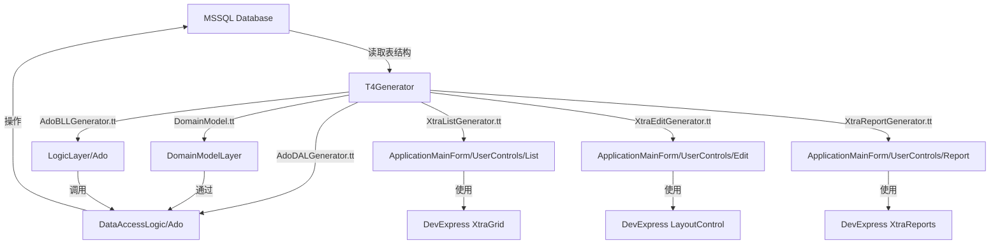

## 项目简介

这是早期实现的一个基于 **T4 模板** 的 WinForm 快速开发脚手架，通过连接数据库，逆向生成完整的数据维护界面。结合 **DevExpress** 强大的 UI 组件和 **Entity Framework** 的数据访问能力，实现 **0 代码** 生成增删改查功能，极大提升团队开发效率。

---

## 核心特性

### 为什么选择这个方案？

| 特性 | 说明 |
|------|------|
| 🚀 **0 代码开发** | 无需手写任何 UI 代码，自动生成完整界面 |
| 🎨 **DevExpress 支持** | 利用强大的第三方组件库，界面专业美观 |
| 🗄️ **EF 数据访问** | 使用 Entity Framework，ORM 映射自动完成 |
| ⚙️ **T4 模板驱动** | 灵活的模板系统，易于定制和扩展 |
| 🔄 **快速迭代** | 数据库变更后重新生成，秒级响应 |

### 能生成什么？

通过选择数据库中的表，自动生成完整的分层架构代码：

```
AutoGenerateWinformUIT4/
├── DomainModelLayer/      # EF 实体模型层
│   ├── DomainModel.edmx   # EF 模型文件
│   ├── DomainModel.tt     # T4 模板生成实体类
│   └── *.cs               # 生成的实体类 (Users, Batch, etc.)
├── DataAccessLogic/       # 数据访问层 (Ado)
│   ├── Ado/               # ADO.NET 数据访问
│   └── Common/            # SQLHelper、分页等通用类
├── LogicLayer/            # 业务逻辑层 (BLL)
│   ├── Ado/               # ADO 业务逻辑
│   └── Entity/            # EF 业务逻辑
├── ApplicationMainForm/   # WinForm 主程序
│   ├── UserControls/
│   │   ├── List/          # DevExpress 列表界面 (XtraUserControl)
│   │   ├── Edit/          # DevExpress 编辑界面 (XtraUserControl)
│   │   ├── Report/        # DevExpress 报表界面
│   │   ├── Map/           # 映射相关界面
│   │   └── Other/         # 其他界面
│   └── Main_RibbonForm.cs # Ribbon 风格主窗体
├── UILogic/               # UI 逻辑层
│   ├── MenuHelper.cs      # 菜单管理
│   ├── XtraControlHelper.cs # DevExpress 控件辅助
│   └── XtraExtension.cs   # DevExpress 扩展方法
├── Infrastructure/        # 基础设施层
│   ├── ReflectionHelper.cs
│   ├── DataTableExtension.cs
│   └── ConfigManagerHelper.cs
└── T4Generator/           # T4 代码生成器
    ├── ModelGenerator.tt      # 实体模型生成
    ├── AdoDALGenerator.tt     # ADO 数据访问层生成
    ├── AdoBLLGenerator.tt     # ADO 业务逻辑层生成
    ├── EntityBLLGenerator.tt  # EF 业务逻辑层生成
    ├── XtraListGenerator.tt   # DevExpress 列表界面生成
    ├── XtraEditGenerator.tt   # DevExpress 编辑界面生成
    ├── XtraReportGenerator.tt # DevExpress 报表生成
    ├── MenuData.xml           # 菜单配置
    └── *.ttinclude            # T4 辅助模板
```

---

## 技术架构

### 技术栈

| 技术 | 版本 | 用途 |
|------|------|------|
| .NET Framework | 4.0+ | 运行时环境 |
| **T4 Template** | - | 代码生成引擎 |
| **Entity Framework** | 4/5 | ORM 数据访问 |
| **DevExpress WinForms** | 12+ | UI 组件库 (XtraEditors, XtraGrid, XtraReports) |
| **ADO.NET** | - | 原生数据访问 |
| WinForms | - | 桌面应用框架 |

### 架构设计



---

## T4 模板详解

### 核心生成模板

| 模板文件 | 生成内容 | 说明 |
|----------|----------|------|
| **ModelGenerator.tt** | 实体模型类 | 根据 EF edmx 生成实体 |
| **AdoDALGenerator.tt** | ADO 数据访问层 | 生成 CRUD 的 AdoDAL 类 |
| **AdoBLLGenerator.tt** | ADO 业务逻辑层 | 生成业务逻辑 BLL 类 |
| **EntityBLLGenerator.tt** | EF 业务逻辑层 | 生成基于 EF 的 BLL 类 |
| **XtraListGenerator.tt** | 列表界面 | 生成 XtraGrid 列表维护界面 |
| **XtraEditGenerator.tt** | 编辑界面 | 生成 LayoutControl 编辑界面 |
| **XtraReportGenerator.tt** | 报表界面 | 生成 XtraReports 报表 |
| **XmlMenuGenerator.tt** | 菜单配置 | 根据 MenuData.xml 生成菜单 |

### T4 辅助模板

| 模板文件 | 用途 |
|----------|------|
| **DevHelper.ttinclude** | DevExpress 相关辅助函数 |
| **AdoHelper.ttinclude** | ADO.NET 相关辅助函数 |
| **Manager.ttinclude** | 代码生成管理器 |

---

## 生成的内容详解

### 1. DomainModelLayer - 实体模型层

自动生成的 EF 实体类：

```csharp
// Users.cs - 自动生成
public partial class Users
{
    public int UserID { get; set; }
    public string UserName { get; set; }
    public string Password { get; set; }
    public string Email { get; set; }
    public DateTime CreateTime { get; set; }
}
```

### 2. DataAccessLogic - 数据访问层

#### Ado 模式 (原生 ADO.NET)

```csharp
// UsersAdoDAL.cs - 自动生成
public class UsersAdoDAL
{
    public int Add(Users model)
    {
        string sql = "INSERT INTO Users (UserName, Password, Email) VALUES (@UserName, @Password, @Email)";
        return SqlHelper.ExecuteNonQuery(sql, model);
    }

    public int Update(Users model)
    {
        string sql = "UPDATE Users SET UserName=@UserName, Password=@Password, Email=@Email WHERE UserID=@UserID";
        return SqlHelper.ExecuteNonQuery(sql, model);
    }

    public int Delete(int userId)
    {
        string sql = "DELETE FROM Users WHERE UserID=@UserID";
        return SqlHelper.ExecuteNonQuery(sql, new { UserID = userId });
    }

    public List<Users> GetList(string where, params SqlParameter[] parameters)
    {
        // 分页查询实现
        return AdoPagingHelper.GetPageList<Users>(where, parameters);
    }
}
```

### 3. LogicLayer - 业务逻辑层

```csharp
// UsersAdoBLL.cs - 自动生成
public class UsersAdoBLL
{
    private UsersAdoDAL dal = new UsersAdoDAL();

    public bool Add(Users model)
    {
        // 业务逻辑校验
        if (string.IsNullOrEmpty(model.UserName))
            throw new Exception("用户名不能为空");

        return dal.Add(model) > 0;
    }

    public bool Update(Users model)
    {
        return dal.Update(model) > 0;
    }

    public bool Delete(int userId)
    {
        return dal.Delete(userId) > 0;
    }

    public List<Users> GetList(string where, params SqlParameter[] parameters)
    {
        return dal.GetList(where, parameters);
    }
}
```

### 4. ApplicationMainForm - 界面层

#### 列表界面 (Users_List_XtraUserControl)

```csharp
// 自动生成的列表界面
public partial class Users_List_XtraUserControl : XtraUserControl
{
    private UsersAdoBLL bll = new UsersAdoBLL();

    public Users_List_XtraUserControl()
    {
        InitializeComponent();
        InitGrid();  // 自动初始化 GridControl 列
        LoadData();
    }

    private void LoadData()
    {
        gridControl1.DataSource = bll.GetList("");
    }

    // 增删改查按钮事件自动生成
}
```

**功能特性：**
- 📊 **XtraGrid 展示**：支持分组、排序、筛选
- 🔍 **高级搜索**：自动生成常用字段搜索条件
- ➕ **新增按钮**：打开编辑窗体
- ✏️ **编辑按钮**：修改选中记录
- 🗑️ **删除按钮**：删除选中记录（带确认）
- 📄 **分页功能**：集成 Paging_XtraUserControl

#### 编辑界面 (Users_Edit_XtraUserControl)

```csharp
// 自动生成的编辑界面
public partial class Users_Edit_XtraUserControl : XtraUserControl
{
    private UsersAdoBLL bll = new UsersAdoBLL();

    public Users_Edit_XtraUserControl()
    {
        InitializeComponent();
        // 自动创建 LayoutControl 和编辑控件
    }

    private void btnSave_Click(object sender, EventArgs e)
    {
        var user = new Users
        {
            UserName = txtUserName.Text,
            Password = txtPassword.Text,
            Email = txtEmail.Text
        };

        bll.Add(user);
    }

    // 数据绑定、验证自动生成
}
```

**功能特性：**
- 📝 **LayoutControl 布局**：自动排列字段
- ✅ **数据验证**：必填、长度、格式验证
- 🔗 **外键下拉**：关联表自动生成 SearchLookupUpEdit
- 💾 **保存按钮**：保存到数据库
- ❌ **取消按钮**：关闭窗体不保存

---

## 界面截图

### 自动生成的数据维护界面


---

## 使用场景

### 适合的项目类型

| 场景 | 说明 |
|------|------|
| 🏢 **企业管理系统** | 进销存、ERP、CRM 等数据维护密集型系统 |
| 📊 **后台管理系统** | 数据字典、配置管理等维护界面 |
| 🔧 **快速原型** | 快速搭建演示系统、MVP 产品 |
| 📋 **数据录入系统** | 以表单录入为主的应用程序 |

### 典型应用案例

- 用户管理模块 (Users)
- 批次管理 (Batch)
- 执行日志 (ExecutionLog)
- 数据源管理 (ExtendedDataSources)
- 报表管理

---

## 快速开始

### 1. 准备工作

```bash
# 1. 安装 DevExpress
# 下载并安装 DevExpress WinForms 组件库

# 2. 配置数据库连接
# 在 DomainModelLayer/App.Config 中配置连接字符串
```

### 2. 更新 EF 模型

```
1. 在 Visual Studio 中打开 DomainModel.edmx
2. 从数据库更新模型
3. 保存后自动运行 DomainModel.tt 生成实体类
```

### 3. 运行 T4 模板生成代码

```
1. 打开 T4Generator 项目
2. 配置 MenuData.xml（选择要生成界面的表）
3. 保存 T4 模板文件，自动生成代码
4. 生成的代码会输出到各项目目录
```

### 4. 编译运行

直接编译运行 ApplicationMainForm 项目，即可看到完整的数据维护界面！

---

## 项目地址

完整源代码已开源，欢迎 Star 和 Fork：

**GitHub**: [https://github.com/FreezeSoul/AutoGenerateWinformUIT4](https://github.com/FreezeSoul/AutoGenerateWinformUIT4)

---

## 核心优势总结

### 传统开发 vs 自动生成

| 对比项 | 传统开发 | 自动生成 |
|--------|----------|----------|
| **单个表开发时间** | 2-4 小时 | 1 分钟 |
| **代码一致性** | 依赖个人水平 | 完全统一 |
| **Bug 率** | 容易出错 | 几乎为 0 |
| **维护成本** | 较高 | 低 |
| **团队协作** | 风格不统一 | 规范统一 |

### 开发效率提升

```
传统方式：10 个表 × 3 小时 = 30 小时
自动生成：10 个表 × 1 分钟 = 10 分钟

效率提升：180 倍！
```

---

## DevExpress 组件的优势

为什么要使用 DevExpress？

| 特性 | 说明 |
|------|------|
| 🎨 **专业的 UI** | 体验媲美 Office，用户友好 |
| 📦 **丰富的组件** | XtraGrid、XtraEditors、XtraReports 全覆盖 |
| ⚡ **高性能** | 虚拟滚动、异步加载支持 |
| 🔧 **高度可定制** | 主题、皮肤、行为都可定制 |
| 📚 **完善文档** | 官方文档和示例丰富 |

### 使用的关键组件

| 组件 | 用途 |
|------|------|
| **XtraGrid** | 列表展示、分组、排序、筛选 |
| **LayoutControl** | 编辑界面自动布局 |
| **XtraEditors** | 各种编辑控件 (TextEdit, ButtonEdit, SearchLookupUpEdit 等) |
| **XtraReports** | 报表打印和导出 |
| **RibbonFormControl** | Ribbon 风格主界面 |
| **XtraUserControl** | 用户控件容器 |

---

## 总结

这个项目是早期团队开发的实用工具，通过 **T4 模板 + Entity Framework + DevExpress** 的组合，实现了 WinForm 数据维护界面的自动化生成，让开发者从重复的 CRUD 开发中解放出来，专注于核心业务逻辑的实现。

> **核心价值**：让枯燥的数据维护界面开发，从天级缩短到分钟级。

---

## 扩展阅读

- [DevExpress WinForms 官方文档](https://docs.devexpress.com/WindowsForms/)
- [Entity Framework 入门教程](https://docs.microsoft.com/en-us/ef/)
- [T4 模板入门指南](https://learn.microsoft.com/en-us/visualstudio/modeling/code-generation-and-t4-text-templates)

---

**欢迎使用和反馈！** 如果你觉得有用，请给个 Star ⭐
