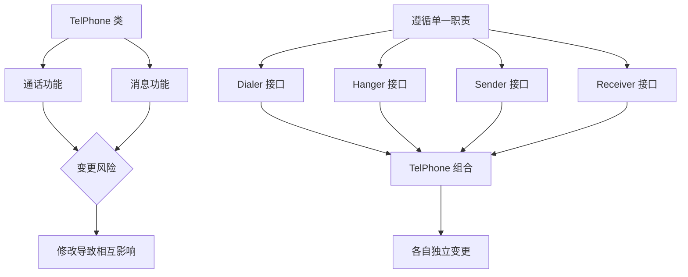
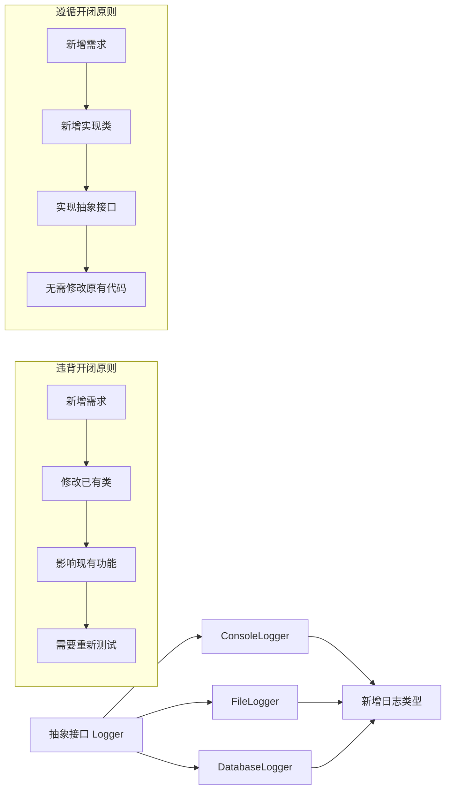
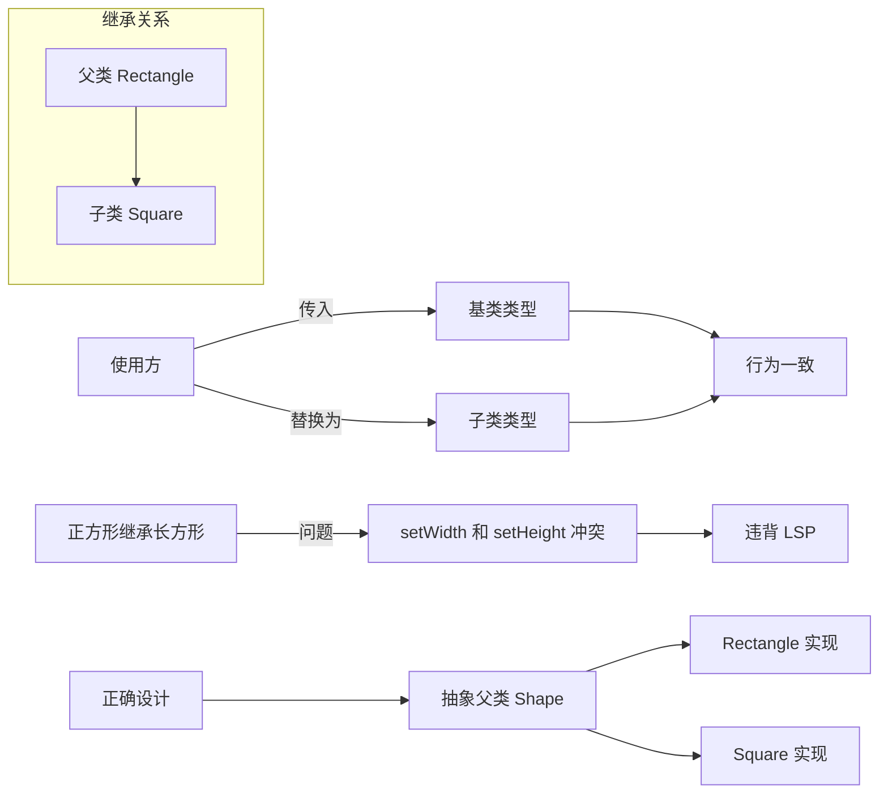
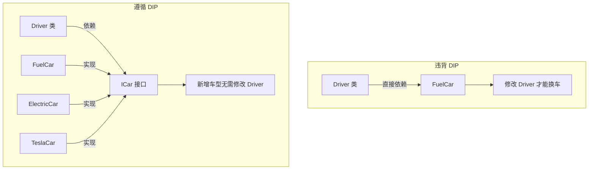
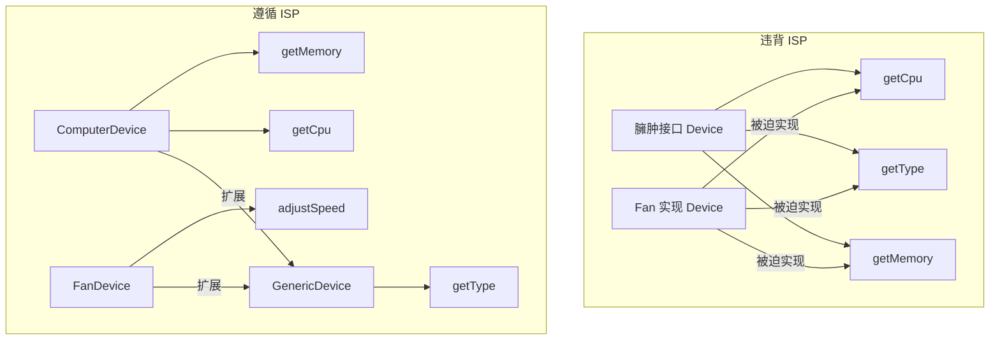
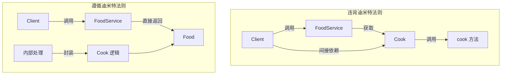
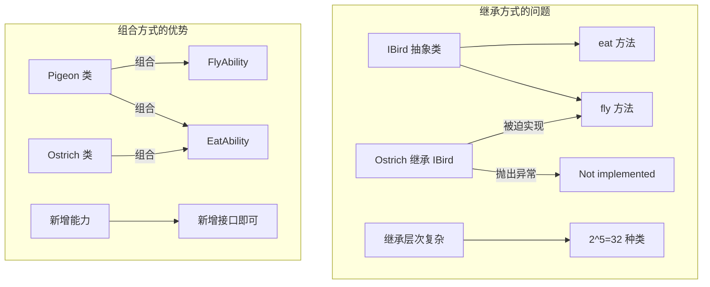

## 引言

在软件开发过程中，代码的可维护性、可扩展性和可复用性是衡量软件质量的重要指标。随着项目规模的扩大，代码的复杂度也会急剧上升，如果没有良好的设计原则作为指导，代码很快就会变得难以理解和修改。

设计模式七大原则是面向对象设计领域经过长期实践总结出的经验准则，它们帮助开发者在设计和实现代码时做出更好的决策。这些原则并不是什么高深的理论，而是实实在在的编程实践指导。

其中，前五个原则的首字母连起来是 SOLID，代表了面向对象设计的五个核心原则。加上迪米特法则和合成复用原则，构成了完整的七大设计原则。接下来我们逐一介绍每个原则的定义、实现方式以及在实际开发中的应用。

## 单一职责原则

单一职责原则（Single Responsibility Principle，SRP）的核心思想是：一个类应该只有一个引起它变化的原因。也就是说，一个类只负责一项职责。



这个原则看似简单，但在实际开发中却最难把握。职责的划分往往因项目而异、因环境而异。如果职责划分得太粗，就会违背单一职责原则；如果划分的太细，又会导致类数量激增，增加维护成本。

来看一个违反单一职责原则的例子：

```java
public class TelPhone {
    public void dial(String phoneNumber) {
        System.out.println("给" + phoneNumber + "打电话");
    }

    public void hangUp() {
        System.out.println("挂断电话");
    }

    public void sendMessage(String message) {
        System.out.println("发送" + message);
    }

    public void receiveMessage(String message) {
        System.out.println("接收" + message);
    }
}
```

这个类承担了多个职责：通话管理、消息管理。当任何一个职责发生变化时，都需要修改这个类，这增加了代码变更的风险。

遵循单一职责原则的设计是将每个职责分离到独立的类中：

```java
interface Dialer {
    void dial(String phoneNumber);
}

interface Hanger {
    void hangUp();
}

interface Sender {
    void sendMessage(String text);
}

interface Receiver {
    void receiveMessage(String text);
}

class TelPhone {
    private Dialer dialer;
    private Hanger hanger;
    private Sender sender;
    private Receiver receiver;

    public TelPhone(Dialer dialer, Hanger hanger, 
                    Sender sender, Receiver receiver) {
        this.dialer = dialer;
        this.hanger = hanger;
        this.sender = sender;
        this.receiver = receiver;
    }
}
```

单一职责原则的好处是明显的：类的复杂性降低、可读性提高、可维护性提高，变更引起的风险也会降低。

## 开闭原则

开闭原则（Open-Closed Principle，OCP）的定义是：软件实体如类、模块和函数应该对扩展开放，对修改关闭。



这个原则的核心思想是：应该通过扩展来实现变化，而不是通过修改已有的代码来实现变化。在实际开发中，需求变化是不可避免的，开闭原则为应对这种变化提供了指导方向。

实现开闭原则的关键是抽象。我们可以使用抽象类或接口来定义稳定的抽象层，而将易变的细节封装在具体的实现类中。

举例来说，一个简单的日志记录功能：

```java
public class Logger {
    public void log(String message) {
        System.out.println(message);
    }
}
```

如果需求变化需要将日志输出到文件，我们需要修改 Logger 类，这违反了开闭原则。更优的设计是：

```java
interface Logger {
    void log(String message);
}

class FileLogger implements Logger {
    public void log(String message) {
        // 写入文件
    }
}

class ConsoleLogger implements Logger {
    public void log(String message) {
        System.out.println(message);
    }
}

class Application {
    private Logger logger;
    
    public void setLogger(Logger logger) {
        this.logger = logger;
    }
}
```

这样，当需要新增日志输出方式时（比如数据库日志、网络日志），只需要创建新的实现类，而不需要修改已有的代码。

开闭原则是其他原则的精神领袖，它是面向对象设计的终极目标。虽然很难做到百分之百遵循，但朝着这个方向努力可以显著改善代码质量。

## 里氏替换原则

里氏替换原则（Liskov Substitution Principle，LSP）有两个核心定义：第一，任何基类可以出现的地方，子类一定可以出现。第二，所有引用基类的地方必须能透明地使用其子类的对象。



通俗地讲，只要父类能出现的地方子类就可以出现，而且替换为子类不会产生任何错误或异常。反过来则不行，有子类出现的地方，父类未必能适应。

里氏替换原则要求子类遵循"前松后紧"的原则：

```java
class Father {
    public void method(HashMap map) {
        System.out.println("父类方法执行");
    }
}

class Son extends Father {
    // 子类方法的前置条件要比父类更宽松
    public void method(Map map) {
        System.out.println("子类方法执行");
    }
}
```

一个常见的违背里氏替换原则的例子是"正方形不是长方形"：

```java
class Rectangle {
    protected int width;
    protected int height;
    
    public void setWidth(int w) { width = w; }
    public void setHeight(int h) { height = h; }
}

class Square extends Rectangle {
    public void setWidth(int w) {
        width = w;
        height = w;
    }
    
    public void setHeight(int h) {
        width = h;
        height = h;
    }
}
```

当代码期望使用 Rectangle 并调用 setWidth 和 setHeight 设置不同值时，Square 的行为会导致意外结果。

## 依赖倒置原则

依赖倒置原则（Dependence Inversion Principle，DIP）的核心是：高层模块不应该依赖低层模块，两者都应该依赖抽象；抽象不应该依赖细节，细节应该依赖抽象。



这个原则的另一个表述是"面向接口编程"。在 Java 中，抽象指的是接口或抽象类，它们不能被直接实例化；细节指的是实现类，它们可以被直接实例化。

违反依赖倒置原则的典型例子：

```java
class FuelCar {
    public void run() {
        System.out.println("燃油车行驶");
    }
}

class Driver {
    public void drive(FuelCar car) {
        car.run();
    }
}
```

更好的设计是引入抽象：

```java
interface ICar {
    void run();
}

class FuelCar implements ICar {
    public void run() {
        System.out.println("燃油车行驶");
    }
}

class ElectricCar implements ICar {
    public void run() {
        System.out.println("电动车行驶");
    }
}

class Driver {
    public void drive(ICar car) {
        car.run();
    }
}
```

依赖倒置原则是实现开闭原则的重要途径。没有依赖倒置原则，就无法实现对扩展开放、对修改关闭。

## 接口隔离原则

接口隔离原则（Interface Segregation Principle，ISP）的定义是：类间的依赖关系应该建立在最小的接口上。



这个原则要求我们不要建立一个庞大臃肿的接口供所有依赖它的类使用，而是应该为各个类建立专用的接口。

来看一个违背接口隔离原则的例子：

```java
interface Device {
    String getCpu();
    String getType();
    String getMemory();
}

class Computer implements Device {
    public String getCpu() { return "i7"; }
    public String getType() { return "笔记本电脑"; }
    public String getMemory() { return "16GB"; }
}

class Fan implements Device {
    public String getCpu() { return null; }
    public String getType() { return "电风扇"; }
    public String getMemory() { return null; }
}
```

正确的设计是将接口细化：

```java
interface GenericDevice {
    String getType();
}

interface ComputerDevice extends GenericDevice {
    String getCpu();
    String getMemory();
}

interface FanDevice extends GenericDevice {
    void adjustSpeed(int speed);
}
```

接口隔离原则和单一职责原则有相似之处，但侧重点不同：单一职责原则关注的是类和接口的职责单一性；接口隔离原则关注的是接口的方法精简程度。

## 迪米特法则

迪米特法则（Law of Demeter，LoD）也称为最少知识原则，定义是：一个对象应该对其他对象有最少的了解。



这个原则的另一个表述是"只与直接的朋友通信"。什么是"朋友"？出现在成员变量、方法参数、方法返回值中的类就是当前对象的"朋友"，而出现在局部变量中的类则是"陌生人"。

来看一个违背迪米特法则的例子：

```java
class CompanyManager {
    public void printAllEmployee(SubCompanyManager sub) {
        List<SubEmployee> list = sub.getAllEmployee();
        for (SubEmployee e : list) {
            System.out.println(e.getId());
        }
        
        List<Employee> list2 = this.getAllEmployee();
        for (Employee e : list2) {
            System.out.println(e.getId());
        }
    }
}
```

这里 CompanyManager 不仅依赖 SubCompanyManager，还直接获取了 SubEmployee 并遍历。遵循迪米特法则的设计是让 SubCompanyManager 自己处理打印逻辑：

```java
class SubCompanyManager {
    public List<SubEmployee> getAllEmployee() { ... }
    
    public void printEmployee() {
        List<SubEmployee> list = this.getAllEmployee();
        for (SubEmployee e : list) {
            System.out.println(e.getId());
        }
    }
}

class CompanyManager {
    public void printAllEmployee(SubCompanyManager sub) {
        sub.printEmployee();
        List<Employee> list = this.getAllEmployee();
        for (Employee e : list) {
            System.out.println(e.getId());
        }
    }
}
```

迪米特法则的核心是降低类之间的耦合度，提高模块的相对独立性。

## 合成复用原则

合成复用原则（Composite Reuse Principle，CRP）又称为组合优于继承原则，核心思想是：尽量使用组合/聚合来实现代码复用，而不是使用继承。



继承虽然是面向对象的特性之一，但过度使用继承会带来问题。近年来流行的新语言如 Go、Rust 都不支持继承，正是出于对这一问题的考量。

使用继承方式的问题：

```typescript
abstract class IBird {
  eat() {
    console.log("Eat food");
  }
  fly(): void {
    console.log("Flying.");
  }
}

class Ostrich extends IBird {
  fly() {
    throw new Error("Not implemented");
  }
}
```

鸵鸟继承了它完全不需要的飞行方法。如果再考虑奔跑、鸣叫等能力，继承关系会变得极其复杂。

使用组合方式的设计：

```typescript
interface IFlyAbility {
  fly(): void;
}

interface IEatAbility {
  eat(): void;
}

class Pigeon {
  flyAbility: IFlyAbility;
  eatAbility: IEatAbility;
  
  fly() {
    this.flyAbility.fly();
  }
  
  eat() {
    this.eatAbility.eat();
  }
}

class Ostrich {
  eatAbility: IEatAbility;
  
  eat() {
    this.eatAbility.eat();
  }
}
```

组合方式的优势：

1. 继承关系简单。如果需要再增加一种能力，也只需要新增一个能力接口和一个能力实现即可。
2. 灵活。继承关系在编译期就已经确定了，而组合关系可以在运行时改变引用的对象，改变行为的实现。

## 总结

七大设计原则并非孤立存在，而是相互关联、相互支撑的。单一职责原则是基础，开闭原则是目标，里氏替换原则是对继承的规范，依赖倒置原则是实现开闭原则的手段，接口隔离原则是对接口的细化，迪米特法则是降低耦合的指导，合成复用原则则是对继承问题的补充。

其中，前五个原则的首字母连起来是 SOLID（稳定的），这并非巧合。同时遵循这些原则，可以建立稳定、灵活、健壮的代码结构。

在实际开发中，不应该机械地套用这些原则，而应该根据具体的业务场景和项目需求灵活运用。原则是死的，人是活的，理解这些原则背后的思想，才能真正写出高质量的代码。

**参考资料**：
- 《设计模式》
- 《面向对象设计原则》
