## 引言

在软件开发的历史中，统一建模语言（Unified Modeling Language，UML）是每个软件工程师必备的技能。最近在看一非常不错的UML相关书籍:《大象：Thinking in UML》，这本书的核心价值在于：它不仅仅教我们如何画 UML 图，更重要的是传达了一种**用例驱动的建模思想**。这种思想帮助我们建立从现实世界到软件设计的映射路径，让复杂系统的分析和设计变得有章可循。

  

> "建模就像写文章，UML 的元素、规则就像文章中的文字和语法。"

本文将围绕这本书的核心内容，系统梳理 UML 建模的基础知识、核心元素、实践方法以及高级思考，帮助读者建立完整的 UML 建模知识体系。

---

## 第一部分：UML 带来了什么

### 面向对象的困难与 UML 的应对

面向对象方法学从诞生之初就面临着认知上的困难。我们习惯于用过程化的思维思考问题，而面向对象要求我们将世界看作一个个相互独立的对象。

**面向对象的本质认识**：

> "面向对象方法将世界看作一个个相互独立的对象，相互之间并无因果关系，它们平时是'鸡犬之声相闻，老死不相往来'的。只有在某个外部力量的驱动下，对象之间才会依据某种规律相互传递信息。"

这种思维方式的转变带来了三个根本问题：

| 问题 | 描述 | UML 的解决方案 |
|------|------|----------------|
| **Why** | 对象是怎么被抽象出来的？为什么要这么抽象而不是那么抽象？ | 用例驱动方法，从参与者目标出发 |
| **How** | 什么样的组合是好的，什么样的组合是差的？ | 设计原则和模式指导 |
| **What** | 如果只给我一个对象组合，我怎么才能理解它表达了怎样的含义？ | 可视化视图和模型组织 |

**抽象是面向对象的精髓所在，同时也是面向对象的困难所在。** UML 通过提供一套标准的建模元素和规则，帮助我们克服这些困难。

### UML 的本质：统一语言与可视化

UML 的本质是什么？书中给出了清晰的定义：

> "UML 是一种建模用的语言，而所有的语言都是由基本词汇和语法两个部分构成的。"

**UML 带来的三个核心价值**：

| 价值 | 说明 | 实践意义 |
|------|------|----------|
| **统一语言** | 构设在团队、角色之间的沟通桥梁 | 需求分析师、架构师、开发者、测试人员使用相同的术语 |
| **可视化** | 把"隐晦"的变成"可视"的 | 通过图形直观表达复杂的业务关系和系统结构 |
| **建模方法** | 从现实世界到软件设计的映射路径 | 提供完整的分析设计流程指导 |

> "UML 通过它的元模型和表示法，把那些通过文字或其他表达方法很难表达清楚的、隐晦的潜台词用简单直观的图形表达和暴露出来，准确而直观地描述复杂的含义。"

在 2012 年的软件开发实践中，UML 的价值主要体现在：

1. **需求分析阶段**：用用例图捕获用户需求
2. **系统设计阶段**：用类图、时序图设计系统架构
3. **团队沟通阶段**：用标准图形替代文字描述，减少歧义
4. **文档归档阶段**：形成可追溯的设计文档

### 从现实世界到设计模型的映射

UML 提供了一条清晰的从现实世界到软件设计的映射路径：

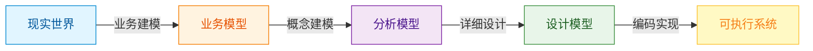

**各阶段的输入输出**：

| 阶段 | 输入 | 核心工作 | 输出 |
|------|------|----------|------|
| **业务建模** | 现实世界业务 | 参与者访谈、用例获取、业务场景 | 业务用例模型、领域模型 |
| **概念建模** | 业务模型 | 分析类提取、用例实现 | 分析模型、软件架构 |
| **设计建模** | 分析模型 | 类设计、接口设计、包设计 | 设计模型、组件模型 |
| **编码实现** | 设计模型 | 代码生成、单元测试 | 可执行系统 |

> "现实世界无论多复杂，无论是哪个行业，无论做什么业务，其本质无非是由人、事、物和规则组成的。"

这条映射路径的关键在于**保持可追溯性**：每一阶段的设计元素都应该能追溯到上一阶段，最终追溯到现实世界的业务需求。

---

## 第二部分：UML 核心元素详解

### 参与者：建模的核心地位

参与者（Actor）是 UML 建模的起点，也是整个系统的驱动力来源。

**定义**：参与者是模型信息来源的提供者，也是第一驱动者。

**参与者的核心特征**：

| 特征 | 说明 | 示例 |
|------|------|------|
| **位于边界之外** | 参与者总是在系统边界之外 | ATM 系统的"存款人" |
| **可以非人** | 参与者不一定是人 | 定时器、传感器、外部系统 |
| **涉众的代表** | 代表与系统有利益关系的一方 | "局长"代表"投资机构" |
| **第一驱动者** | 主动发起与系统的交互 | 用户点击登录按钮 |

> "参与者对系统的要求，对系统的表述完全决定了系统的功能性。"

**参与者 vs 容易混淆的概念**：

| 概念 | 定义 | 位置 | 主动/被动 |
|------|------|------|-----------|
| **业务主角** | 业务系统中的参与者 | 边界之外 | 主动发起动作 |
| **业务工人** | 边界内被动参与者 | 边界之内 | 被动响应 |
| **涉众** | 与系统有利益关系的一切人和事 | - | - |
| **用户** | 参与者的代理或实例 | - | - |
| **角色** | 参与者的职责 | - | - |

**发现参与者的方法**：

1. 回答两个问题：
   - 谁对系统有着明确的目标和要求并且主动发出动作？
   - 系统是为谁服务的？

2. 从业务流程中寻找：
   - 谁启动了业务流程？
   - 谁从系统中获得价值？
   - 系统需要与哪些外部系统交互？

### 用例：从功能到目标的转变

用例（Use Case）是 UML 建模的核心，也是用例驱动方法的基石。

**定义**：与参与者交互的，并且给参与者提供可观测的有意义的结果的一系列活动的集合。

**用例的构成**：

> 一个用例 = <参与者，前置条件，{场景}，后置条件>

**用例的五大特征**：

| 特征 | 说明 | 正例 | 反例 |
|------|------|------|------|
| **相对独立** | 不需要与其他用例交互而独自完成参与者的目的 | 取钱 | 填写取款单 |
| **可观测结果** | 结果对参与者来说是可观测的和有意义的 | 查询余额 | 后台数据备份 |
| **参与者发起** | 必须由一个参与者发起 | 取款 | ATM 自动吐钞 |
| **动宾结构** | 以动宾短语形式出现 | "修改密码" | "密码" |
| **有意义的结果** | 对参与者有明确的意义 | 转账成功 | 输入密码 |

**用例 vs 功能**：这是书中重点强调的误区

| 方面 | 用例 | 功能 |
|------|------|------|
| **视角** | 参与者角度 | 事物角度 |
| **描述** | 人们能够用它做什么 | 它能做什么 |
| **性质** | 使用者观点 | 功能性观点 |
| **示例** | "购买商品" | "商品管理功能" |

> "功能是用事物角度出发的，而用例是从参与者角度出发的。功能是脱离使用者的愿望存在的。功能是孤立的，而用例是一个系统性的工作。"

这个区分看似简单，但在实际建模中经常被混淆。正确理解用例，是用例驱动方法的第一步。

### 边界：决定视界与抽象层次

边界（Boundary）是面向对象方法中一个非常重要但容易被忽视的概念。

**定义**：边界本质上是面向对象方法的一个很重要的概念，与封装的概念师出同源。

**边界的两个核心作用**：

| 作用 | 说明 | 实践意义 |
|------|------|----------|
| **决定视界** | 边界决定了你看到的东西 | 设定系统范围，明确什么在系统内，什么在系统外 |
| **决定抽象层次** | 通过设定边界来控制分析粒度 | 边界越大，粒度越粗；边界越小，粒度越细 |

> "边界和封装概念师出同源，边界决定着抽象的层次，也就是它决定着分析粒度的大小。"

> "能否准确把握边界，能否灵活变换边界，能否控制边界的粒度是做好需求分析和系统设计的关键。"

**边界的相对性**：

边界不是固定不变的，而是可以根据分析需要灵活调整的：

| 边界大小 | 分析粒度 | 适用场景 | 示例 |
|----------|----------|----------|------|
| **大边界** | 粗粒度 | 业务建模、概念建模 | "图书馆借阅系统" |
| **中边界** | 中粒度 | 系统分析 | "借书模块" |
| **小边界** | 细粒度 | 详细设计 | "借书审批流程" |

**边界调整的策略**：

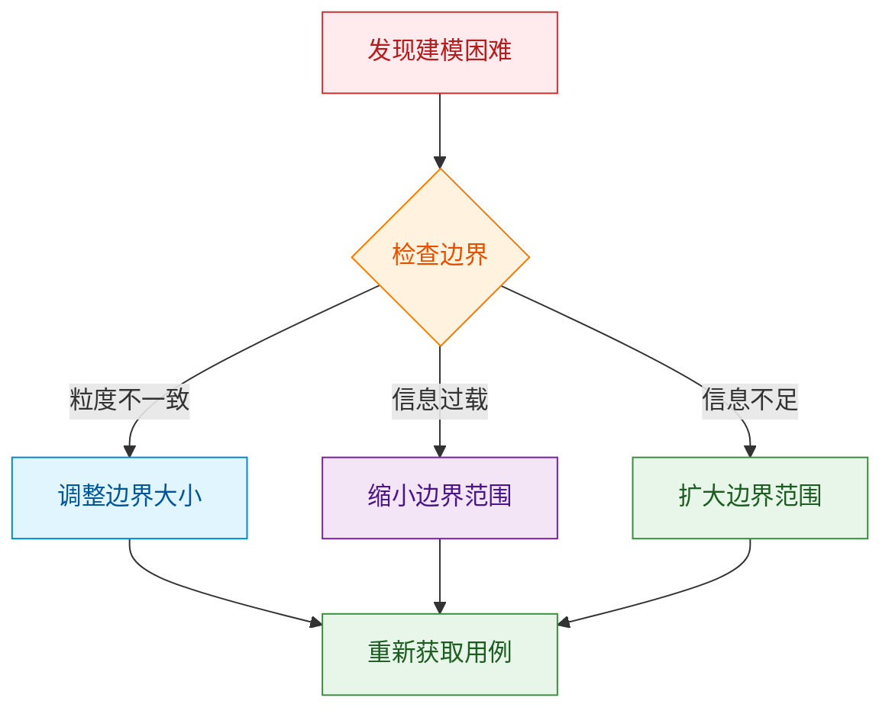

### 业务实体、分析类、设计类

UML 建模中，不同阶段使用不同抽象层次的类概念。

**业务实体（Business Entity）**：

定义：代表业务角色执行业务用例时所处理或使用的"事物"。

获取业务实体的方法：
1. 建立业务用例场景
2. 分析动词后面的名词
3. 筛选对业务目标有贡献的对象
4. 分析关系，决定哪些单独建模，哪些作为属性

**分析类（Analysis Class）**：

分析类是跨越需求到设计实现的桥梁，分为三种：

| 类型 | 图符 | 职责 | 架构层次 | 示例 |
|------|------|------|----------|------|
| **边界类** | ◇︎ | 系统外部环境与其内部运作之间的交互 | 展现层 | 网页、窗口、API |
| **控制类** | ⬭ | 对一个或几个用例所特有的控制行为进行建模 | 业务逻辑层 | 购买、验证、发送 |
| **实体类** | ▱ | 对必须存储的信息和相关行为建模 | 数据持久层 | 订单、商品、客户 |

> "分析类就是跨越需求到设计实现的桥梁。"

分析类的"三高"特征：
- **高于设计实现** - 不理会复杂的设计要求
- **高于编程语言** - 不受特定语言约束
- **高于技术细节** - 专注于逻辑结构

**三种分析类的关系**：

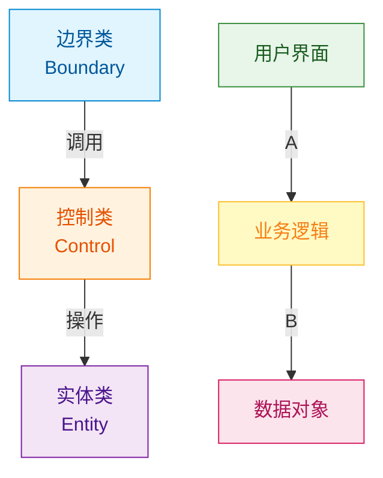

**设计类（Design Class）**：

设计类是分析类的具体化，需要考虑：
- 具体的编程语言特性
- 框架和平台的要求
- 性能、安全等技术约束
- 设计模式的应用

### 九种关系：关联、依赖、扩展、包含、实现、精化、泛化、聚合、组合

UML 定义了丰富的关系类型，理解和正确使用这些关系是建模的关键。

**九种关系分类**：

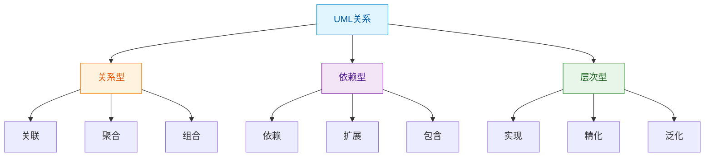

**关系详解**：

| 关系类型 | 符号 | 语义 | 代码含义 | 示例 |
|---------|------|------|----------|------|
| **关联** | 实线 | 类之间的引用关系 | class A { B b; } | 客户关联订单 |
| **依赖** | 虚线箭头 | 临时使用关系 | 函数参数使用 | 订单处理依赖支付服务 |
| **扩展** | 虚线+<<extend>> | 可选的扩展行为 | 条件分支 | 支付扩展退款 |
| **包含** | 虚线+<<include>> | 必须包含的行为 | 方法调用 | 支付包含身份验证 |
| **实现** | 虚线+空心三角 | 接口实现 | implements | 类实现接口 |
| **精化** | 虚线+空心三角 | 抽象层次之间的细化 | 概念→具体 | 分析类精化为设计类 |
| **泛化** | 实线+空心三角 | is-a 关系 | extends | 子类继承父类 |
| **聚合** | 空心菱形+实线 | has-a 关系，弱拥有 | 成员变量，可独立存在 | 部门包含员工 |
| **组合** | 实心菱形+实线 | contains-a 关系，强拥有 | 成员变量，生命周期绑定 | 订单包含订单项 |

**聚合 vs 组合**：这是最容易混淆的一对关系

| 方面 | 聚合 (Aggregation) | 组合 (Composition) |
|------|---------------------|---------------------|
| **关系强度** | 弱拥有 | 强拥有 |
| **生命周期** | 独立 | 绑定 |
| **共享性** | 可被多个父对象共享 | 只能属于一个父对象 |
| **销毁** | 父对象销毁，子对象仍可存在 | 父对象销毁，子对象随之销毁 |
| **代码示例** | `class Car { Engine* engine; }` | `class Car { Wheel wheel; }` |
| **现实类比** | 班级包含学生 | 人包含心脏 |

**选择关系的决策树**：

```
两个类之间存在关系？
    ↓
是"整体-部分"关系吗？
    YES → 部分能独立存在吗？
        YES → 聚合
        NO  → 组合
    NO  → 是"is-a"关系吗？
        YES → 泛化
        NO  → 是临时使用吗？
            YES → 依赖
            NO  → 关联

```

---

## 第三部分：UML 核心视图

### 静态视图：用例图、类图、包图

UML 视图分为静态视图和动态视图两大类。静态视图描述系统的结构特征，动态视图描述系统的行为特征。

**UML 视图分类**：

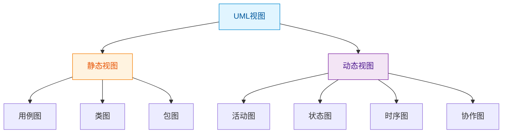

#### 用例图（Use Case Diagram）

用例图是 UML 中最基础的视图，用于描述系统的功能需求。

**用例图的组成元素**：

| 元素 | 符号 | 说明 |
|------|------|------|
| **参与者** | 小人图标 | 系统外部的实体 |
| **用例** | 椭圆 | 系统提供的功能 |
| **系统边界** | 矩形框 | 界定系统范围 |
| **关联** | 实线 | 参与者与用例的关系 |
| **包含** | 虚线+<<include>> | 基础用例必须包含的行为 |
| **扩展** | 虚线+<<extend>> | 可选的扩展行为 |

**ATM 系统用例图示例**：

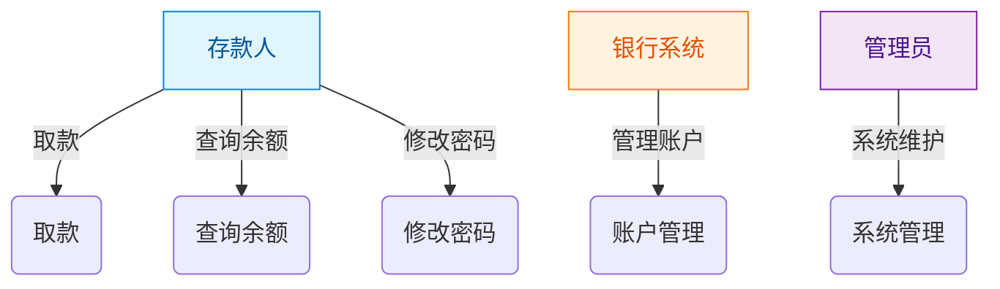

**用例图的实践价值**：
- 需求获取和验证的工具
- 项目估算的依据
- 测试用例设计的基础
- 用户沟通的媒介

#### 类图（Class Diagram）

类图是 UML 中最重要的视图，描述系统的静态结构。

**类图的组成元素**：

一个类由三部分组成：
- 名称：类的名称
- 属性：类的特征
- 方法：类的行为

**用户类图示例**：

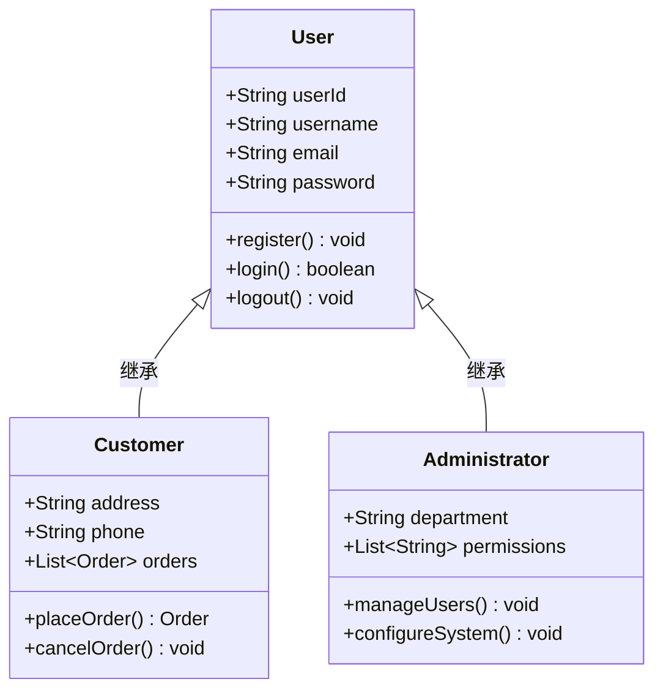

**类图的核心价值**：
- 系统静态结构的完整描述
- 数据库设计的基础
- 代码生成的依据
- 架构评审的工具

#### 包图（Package Diagram）

包图用于组织模型元素，体现了"高内聚、低耦合"的设计原则。

**系统分层包图示例**：

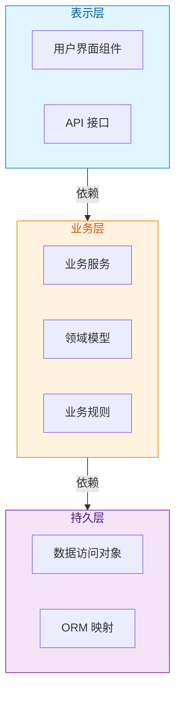

**包图的核心价值**：
- 体现系统的分层架构
- 控制依赖关系
- 指导代码组织结构

### 动态视图：活动图、状态图、时序图

动态视图描述系统的行为特征，展示系统在运行时的状态变化和交互过程。

#### 活动图（Activity Diagram）

活动图用于描述业务流程和工作流。

**网上购物流程活动图示例**：

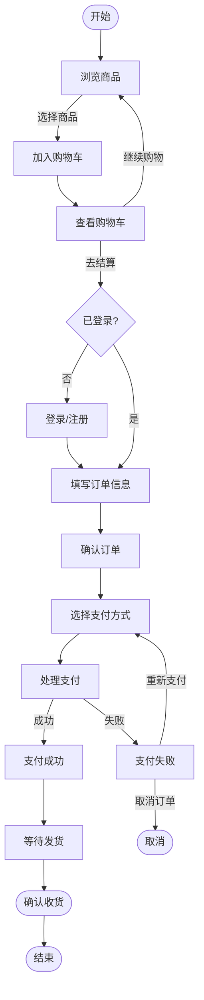

**活动图的核心价值**：
- 业务流程的可视化
- 工作流设计的依据
- 业务规则梳理的工具

#### 状态图（State Diagram）

状态图描述对象的生命周期和状态转换。

**订单状态图示例**：

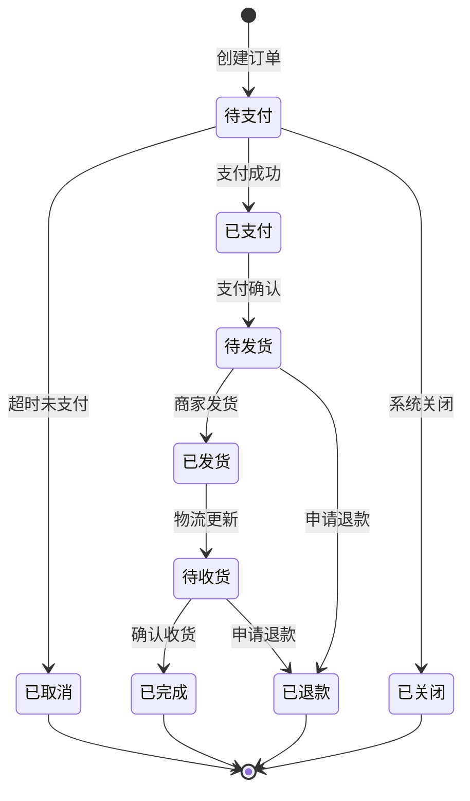

**状态图的核心价值**：
- 明确对象的生命周期
- 定义状态转换规则
- 指导状态机实现

#### 时序图（Sequence Diagram）

时序图描述对象之间交互的时间顺序。

**用户登录时序图示例**：

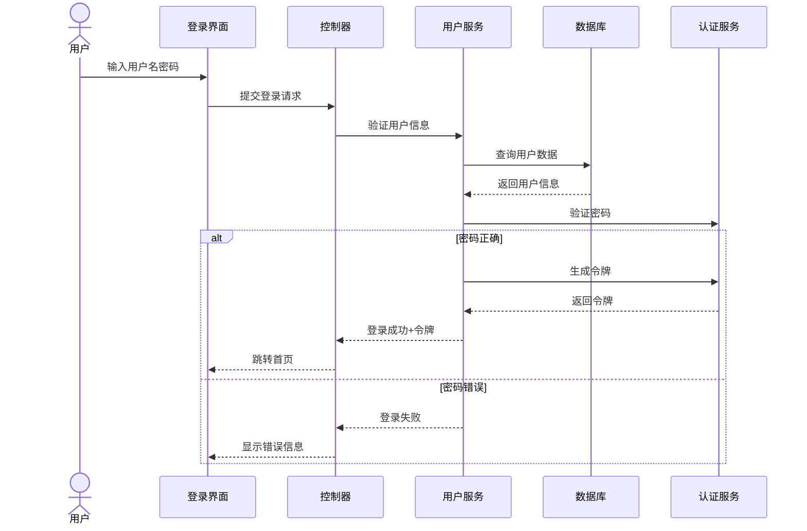

**时序图的核心价值**：
- 清晰展示交互流程
- 验证用例实现
- 指导接口设计

---

## 第四部分：实践流程指南

### 准备工作：涉众分析与边界定义

UML 建模的第一步不是画图，而是准备工作。准备工作的质量决定了后续建模的效果。

**涉众分析**：

涉众（Stakeholder）是与系统有利益关系的所有人和事。识别涉众是建模的起点。

**涉众分类**：

| 类型 | 说明 | 示例 |
|------|------|------|
| **参与者** | 系统外部主动发起动作的实体 | 用户、外部系统 |
| **业务工人** | 边界内被动参与者 | 银行柜台职员 |
| **受益者** | 从系统中获得价值的人 | 企业老板、管理层 |
| **监管者** | 对系统有约束力的人 | 审计部门、监管机构 |

**定义系统边界**：

通过两个问题确定边界：
1. 谁对系统有着明确的目标和要求并且主动发出动作？
2. 系统是为谁服务的？

**边界定义的实践建议**：

| 情况 | 建议 |
|------|------|
| **初次建模** | 从大边界开始，把握整体业务 |
| **需求复杂** | 划分多个子边界，逐个分析 |
| **需求变化** | 灵活调整边界，不拘泥于初始设定 |

### 获取需求：用例获取的实践方法

获取用例是建模过程中最关键的环节，也是最容易出错的环节。

**避免的做法**：

| ❌ 错误做法 | ✅ 正确做法 |
|------------|------------|
| 让客户描述整个业务流程 | 引导客户描述目标和期望 |
| 涉及表单填写等业务细节 | 关注业务目标，忽略实现细节 |
| 让客户理解将来的计算机系统 | 用客户的业务语言交流 |
| 从流程图开始建模 | 从参与者访谈开始 |

**正确的引导问题**：

1. 您对系统有什么期望？
2. 您打算在这个系统里做些什么事情？
3. 您做这件事的目的是什么？
4. 您做完这件事希望有一个什么样的结果？

**用例有效性检查表**：

| 检查项 | 说明 | 正例 | 反例 |
|--------|------|------|------|
| **独立完整性** | 能独立完成参与者的目的 | 取钱 | 填写取款单 |
| **可观测性** | 结果对参与者可观测 | 登录系统 | 后台备份 |
| **主动发起** | 由参与者发起 | 取款 | ATM 自动吐钞 |
| **动宾结构** | 以动宾短语命名 | "修改密码" | "密码" |
| **有意义结果** | 对参与者有明确意义 | 转账成功 | 输入密码 |

**用例获取示例分析**（ATM 取款场景）：

| 客户表达 | 分析结果 | 是否用例 |
|---------|---------|---------|
| "我希望这台 ATM 能支持跨行业务" | 功能描述，不是用户目标 | ✗ |
| "插入卡片" | 操作步骤，不是完整目标 | ✗ |
| "输入密码" | 操作步骤，不是完整目标 | ✗ |
| "选择服务" | 操作步骤，不是完整目标 | ✗ |
| "取钱" | 完整的用户目标 | ✓ |
| "存钱" | 完整的用户目标 | ✓ |
| "挂失卡片" | 完整的用户目标 | ✓ |
| "交纳费用" | 完整的用户目标 | ✓ |
| "警示骗子" | 系统属性，不是功能目标 | ✗ |
| "三次错误吞没卡片" | 业务规则，不是用例 | ✗ |

### 系统分析：分析类与用例实现

获取用例后，下一步是进行系统分析，建立分析模型。

**用例实现的步骤**：

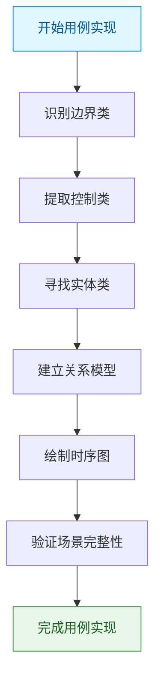

**分析类的获取来源**：

| 分析类 | 来源 | 示例 |
|--------|------|------|
| **边界类** | 参与者与用例的交互点 | 网页、窗口、API、协议 |
| **控制类** | 用例场景中的动词行为 | 购买、计算、验证、发送 |
| **实体类** | 业务实体 | 订单、商品、客户 |

**用例实现的实践建议**：

1. **从场景开始**：先用文字描述用例的场景，再转换为分析类
2. **关注职责**：每个分析类应该有清晰的职责
3. **保持简单**：分析类不应该涉及设计细节
4. **可追溯性**：每个分析类都应该能追溯到需求

### 系统设计：从分析模型到设计模型

分析模型完成后，下一步是转换为设计模型。

**分析模型到设计模型的转换**：

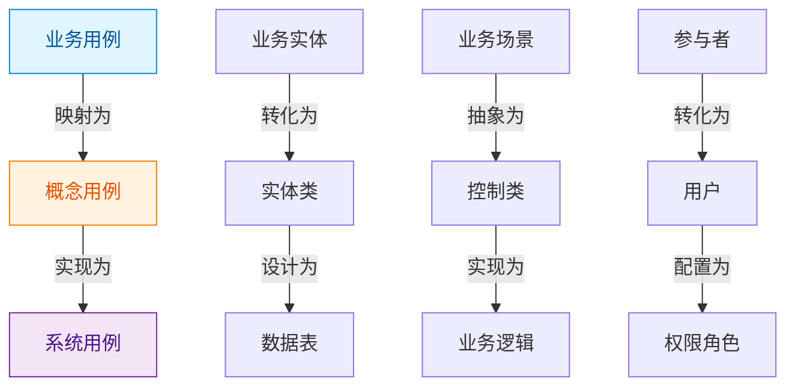

**设计模型需要考虑的问题**：

| 方面 | 分析模型 | 设计模型 |
|------|----------|----------|
| **抽象层次** | 高抽象，关注逻辑结构 | 低抽象，关注实现细节 |
| **技术约束** | 不考虑技术约束 | 考虑框架、平台、性能 |
| **设计模式** | 不涉及 | 应用适当的设计模式 |
| **代码映射** | 不能直接映射 | 可以直接映射到代码 |

**架构设计的基本构成**：

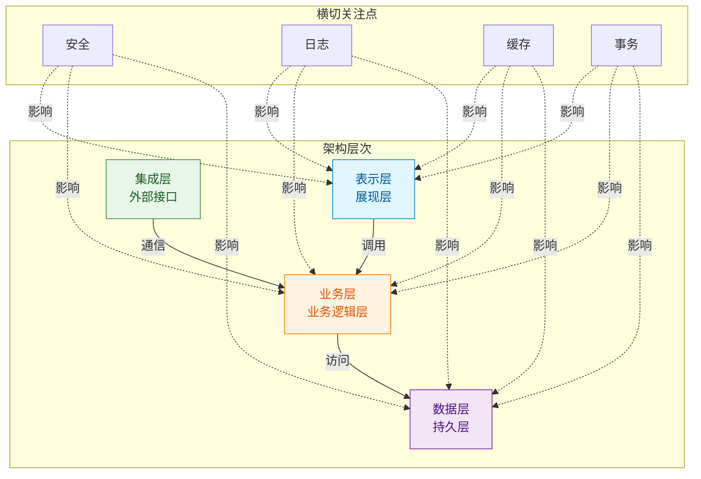

---

## 第五部分：高级思考与最佳实践

### 用例的本质再理解

理解用例的本质，是用例驱动方法成功的关键。

**用例是系统思维**：

> "用例体现了一种系统思维，即把软件看作一个为参与者提供服务的系统，而不是一堆功能的集合。"

**系统思维 vs 功能思维**：

| 维度 | 系统思维（用例） | 功能思维 |
|------|----------------|---------|
| **关注点** | 参与者的目标和价值 | 功能的划分和实现 |
| **视角** | 使用者视角 | 开发者视角 |
| **组织方式** | 以参与者为中心组织 | 以功能模块为中心组织 |
| **验证标准** | 是否满足参与者目标 | 是否完成功能开发 |

**用例是面向服务的**：

> "用例本质上是面向服务的，每个用例都是系统为参与者提供的一项服务。"

服务导向的特征：
1. 服务是可访问的（通过边界）
2. 服务是有价值的（对参与者有意义）
3. 服务是独立的（可完整交付）
4. 服务是可组合的（可构成更大服务）

### 抽象层次的实战应用

抽象层次是 UML 建模中最重要的概念之一，也是最难掌握的。

**抽象层次的原则**：

> "抽象层次越高，信息量越少（多数信息被封装或屏蔽），相对的越容易被理解。但过高又会产生信息量不足的问题，在合适的时候采用适当的抽象层次十分重要。"

**UML 中的抽象层次体现**：

```
业务建模层（高抽象）
├── 业务用例模型
├── 领域模型
└── 业务架构

概念建模层（中抽象）
├── 概念用例模型
├── 分析模型
└── 软件架构

设计建模层（低抽象）
├── 系统用例模型
├── 设计模型
└── 组件模型

实现建模层（最低抽象）
├── 类设计
├── 数据库设计
└── 部署模型

```

**决定抽象层次的因素**：

| 因素 | 高抽象 | 低抽象 |
|------|--------|--------|
| **沟通对象** | 业务人员、项目经理 | 开发人员、测试人员 |
| **文档目的** | 需求理解、范围界定 | 设计指导、代码实现 |
| **项目阶段** | 早期需求分析 | 后期详细设计 |
| **系统复杂度** | 复杂系统（宏观把握）| 简单系统（直接设计）|

**层次不交叉原则**：

同一抽象层次的内容应当放在一起，不要在一个层次中混杂其他层次的内容。

### 系统边界的战略运用

边界是面向对象的保障，也是建模的核心技巧。

**边界是面向对象的保障**：

> "边界是面向对象的保障，没有边界就没有对象。"

**边界的核心作用**：

| 作用 | 说明 |
|------|------|
| **封装隔离** | 将相关内容封装在一起 |
| **职责分离** | 不同边界承担不同职责 |
| **依赖控制** | 控制跨边界的依赖关系 |
| **复杂度管理** | 通过边界控制信息量 |

**边界的艺术**：

> "好的设计如同一筐带壳的鸡蛋，清清爽爽；差的设计如同一堆打碎了壳的鸡蛋，粘粘糊糊。'壳'是好坏的关键。"

**边界意识的表现**：

1. **心中有边界**：时刻意识到边界存在
2. **灵活变换边界**：根据需要调整边界
3. **控制边界粒度**：选择合适的抽象层次
4. **尊重边界约束**：不随意跨越边界

### 接口是系统的灵魂

接口设计是系统设计中最重要的一环。

**从接口认知事物**：

描述一件事物有三种观点：
1. **结构性观点**：这个事物是什么？
2. **功能性观点**：这个事物能做什么？
3. **使用者观点**：人们能够用这个事物做什么？

UML 选择使用者观点：从参与者角度出发，关注交互和价值。

> "接口是系统的灵魂，接口设计的好坏直接决定了系统的可扩展性、可维护性和可测试性。"

**接口的核心价值**：

| 价值 | 说明 |
|------|------|
| **解耦** | 通过接口隔离具体实现 |
| **扩展** | 通过接口支持多种实现 |
| **复用** | 通过接口实现组件复用 |
| **测试** | 通过接口进行 Mock 测试 |

**接口设计的原则**：
- 接口应当是稳定的
- 接口应当是语义化的
- 接口应当是高内聚的
- 接口应当是向前兼容的

---

## 总结

通过《大象：Thinking in UML》这本书，可以系统地学习 UML 建模的核心知识和实践方法。

**核心要点回顾**：

| 要点 | 核心内容 |
|------|----------|
| **用例驱动** | 整个软件生产过程是用例驱动的，用例是需求、分析、设计、开发、测试、部署单元 |
| **边界意识** | 边界决定抽象层次，能否准确把握边界是做好需求分析和系统设计的关键 |
| **抽象层次** | 在合适的时候采用适当的抽象层次，同一抽象层次的内容应当放在一起 |
| **接口优先** | 接口是系统的灵魂，接口设计决定系统的可扩展性、可维护性和可测试性 |

**UML 建模的价值**：

1. **沟通工具**：跨角色、跨团队的标准语言
2. **思维工具**：帮助理清复杂的业务关系
3. **文档工具**：比文字更直观的表达方式
4. **设计工具**：从需求到设计的映射桥梁

> "抽象是面向对象的精髓所在，同时也是面向对象的困难所在。"

掌握 UML 建模，不仅仅是掌握画图技巧，更重要的是掌握一种思维方式——一种从现实世界抽象出软件模型的思维方式。这种思维方式，将帮助我们在复杂的软件开发中保持清晰的思路，设计出高质量的软件系统。

---

## 推荐阅读

- 《大象：Thinking in UML（第2版）》- 谭云杰
- 《UML 用户指南》- Grady Booch, James Rumbaugh, Ivar Jacobson
- 《UML 精粹：标准对象语言简明指南》- Martin Fowler
- 《设计模式：可复用面向对象软件的基础》- GoF

---

**持续学习，持续实践！** 📚
