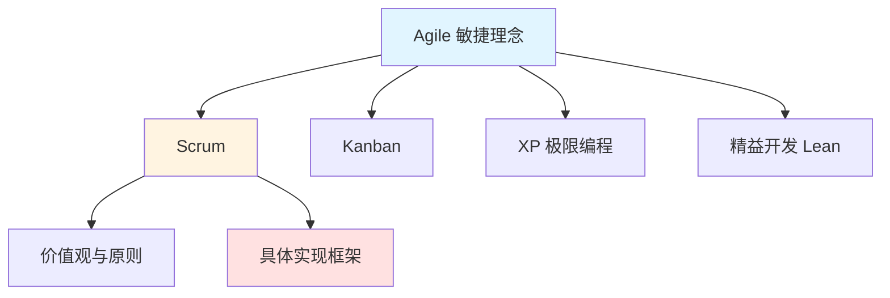
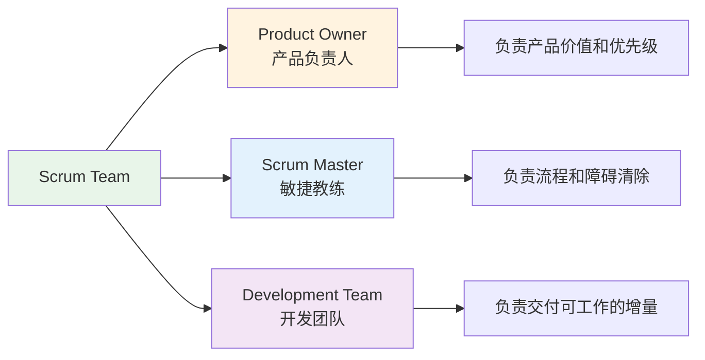
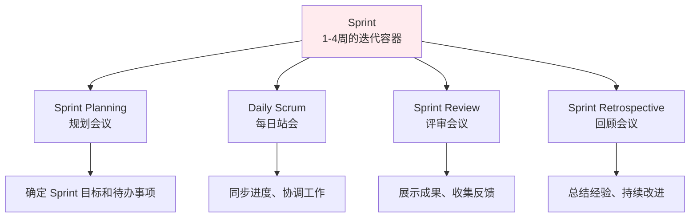
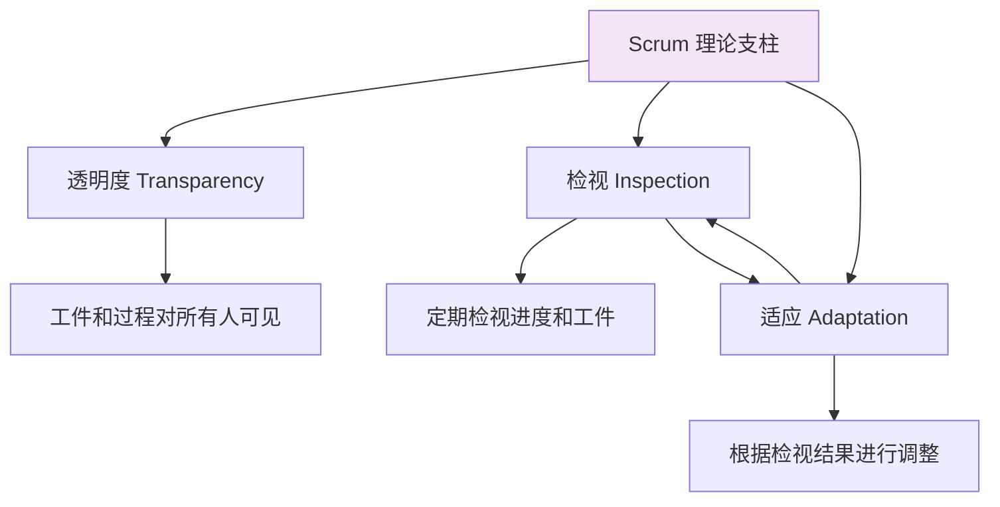

2001 年，17 位软件开发者在雪鸟度假村聚在一起，写下了《敏捷软件开发宣言》。当时他们可能并没有想到，这份简短的共识，会在之后很长一段时间里，持续影响软件团队的工作方式。

如今，敏捷开发已经成了多数国内软件团队的常态配置。但在实践中，敏捷常常被简化为“开会多了”“节奏快了”，而背后的理念却逐渐模糊。本文从敏捷宣言的核心思想出发，结合实际项目中的经验，梳理最常见的落地框架——Scrum，重点放在角色、事件和工件这些具体机制上，看看它们在工程层面到底解决了什么问题。

  

## 敏捷宣言与核心价值观

**《敏捷软件开发宣言》四大核心价值观**：

| 价值观 | 左项（优先） | 右项（次要） |
|--------|-------------|-------------|
| 个体与互动 | 高于 | 流程与工具 |
| 可工作的软件 | 高于 | 全面的文档 |
| 客户合作 | 高于 | 合同谈判 |
| 响应变化 | 高于 | 遵循计划 |

> "也就是说，虽然右边的项目有价值，但我们更看重左边的项目。"

这并非完全否定右项的价值，而是强调在软件开发中，人、可用的软件、协作和适应变化比僵化的流程、文档、合同和计划更为重要。

## 敏捷与 Scrum 的关系

在实践中，很多人对"敏捷"和"Scrum"这两个概念存在混淆。



**关键区别**：

| 对比维度 | Agile（敏捷） | Scrum |
|----------|--------------|-------|
| 本质 | 理念、价值观体系 | 具体的实践框架 |
| 范围 | 包含多种实现方法 | 敏捷的一种实现方式 |
| 结构 | 原则性指导 | 明确的角色、事件、工件 |
| 起源 | 2001 年敏捷宣言 | 1995 年 Schwaber & Sutherland |

简而言之，Agile 是"为什么"和"做什么"，Scrum 是"怎么做"。

## Scrum 框架结构

Scrum 框架可以用 **3-5-3** 来记忆：3 个角色、5 个事件、3 个工件。

### 3 个角色



**产品负责人**：
- 负责管理产品待办事项
- 决定功能的优先级
- 确保团队最大化产品价值
- 必须由单人担任

**Scrum Master**：
- Scrum 流程的守护者和教练
- 清除团队面临的障碍
- 确保 Scrum 理论和实践得到正确应用
- 不是传统意义上的项目经理

**开发团队**：
- 自组织、跨职能的团队
- 通常 5-7 人（双披萨原则）
- 负责 Sprint 期内交付产品增量
- 成员具备多元化技能

### 5 个事件

Scrum 事件为三大支柱（透明度、检视、适应）提供了定期的实践机会。每个事件都有明确的目的、时间限制和参与者。



**时间盒说明**：为了帮助建立约束和聚焦，每个 Scrum 事件都有预定义的时间限制。

| 事件 | 时间盒（1月Sprint） | 时间盒（2周Sprint） |
|------|-------------------|-------------------|
| Sprint Planning | 8 小时 | 4 小时 |
| Daily Scrum | 15 分钟 | 15 分钟 |
| Sprint Review | 4 小时 | 2 小时 |
| Sprint Retrospective | 3 小时 | 1.5 小时 |

#### Sprint（冲刺）

Sprint 是所有其他事件的容器，是 Scrum 的核心心脏。

- 固定长度的迭代周期，通常 1-4 周，最长不超过一个月
- 一旦确定，周期长度在整个项目期间保持一致
- 为团队提供节奏感和可预测性
- 如果 Sprint Goal 不再可行，产品负责人可以取消 Sprint

#### Sprint Planning（规划会议）

每个 Sprint 从 Sprint Planning 开始，Scrum 团队共同确定他们在即将到来的 Sprint 中计划完成的工作。

**会议关注点**：
- 在 Sprint 中能够创造的价值
- 选择将在 Sprint 期间解决的产品待办事项
- 对达成目标所需的工作进行计划
- 计划创建一个满足 Definition of Done 的增量

**产出**：Sprint Backlog，包括 Sprint Goal、选定的产品待办事项和交付工作的计划。

#### Daily Scrum（每日站会）

Daily Scrum 是开发人员每天 15 分钟的会议，用于检视实现 Sprint Goal 的进展。

**三个经典问题**：
- 昨天做了什么？
- 今天计划做什么？
- 有什么阻碍？

**重要提醒**：
- 这不是汇报会议，而是协同会议
- 如果会议在 15 分钟前达成目标，可以提前结束
- 如果在时间盒内无法达成目标，应该寻找提高效率的方法

#### Sprint Review（评审会议）

Sprint Review 是一次工作会议，Scrum 团队向干系人展示已完成的工作，并寻求反馈和指导。

**会议内容**：
- 展示本期完成的产品增量
- 讨论产品目标的进展情况
- 沟通业务或技术环境中的变化
- 共同探讨下一步的行动计划

**产出**：调整后的产品待办事项，为下一个 Sprint 做准备。

#### Sprint Retrospective（回顾会议）

Sprint Retrospective 是 Sprint 的最后一个活动，是 Scrum 团队检视和调整工作实践的机会。

**讨论主题**：
- 团队成员互动和沟通的情况如何
- 团队遇到的任何障碍
- 清除障碍的情况如何
- Definition of Done 是否仍然适用
- 工作方式有哪些可行的改进方法

**产出**：可行的改进计划，将在下一个 Sprint 中实施。

### 3 个工件

Scrum 工件代表工作或价值，旨在最大限度地提高关键信息的透明度。每个工件都包含一项承诺，以确保提供用于度量进展所需的透明度。

| 工件 | 描述 | 承诺 | 责任人 |
|------|------|------|--------|
| **产品待办事项** | 所有想要的工作的有序列表 | Product Goal | 产品负责人 |
| **Sprint 待办事项** | 当前 Sprint 要完成的任务集 | Sprint Goal | 开发团队 |
| **增量** | Sprint 结束时产出的可用产品 | Definition of Done | 开发团队 |

#### 产品待办事项

产品待办事项是一份涌现式的、有序的清单，包含了改进产品所需的工作内容。它是 Scrum 团队开展工作的唯一来源。

**特点**：
- 动态更新的，永远不会"完成"
- 按价值优先级排序
- 包含功能、需求、技术工作、知识获取等
- 多个团队协作时，相关工作仍在同一个产品待办事项中管理

**承诺：Product Goal（产品目标）**

产品目标描述了产品未来的状态，可以作为 Scrum 团队进行计划的目标。产品目标是长期目标，团队必须先实现（或放弃）一个目标，再开始下一个。

#### Sprint 待办事项

Sprint 待办事项由 Sprint Goal（为什么做）、为 Sprint 选择的产品待办事项条目（做什么）以及交付增量的可执行计划（如何做）组成。

**特点**：
- 在整个 Sprint 中会随着了解到更多信息而不断更新
- 应该有足够的细节，以便在 Daily Scrum 中检视进展
- 如果工作与预期不同，可以与产品负责人协商范围——但不影响 Sprint Goal

**承诺：Sprint Goal（Sprint 目标）**

Sprint 目标是 Sprint 的唯一目标，它为开发团队提供了灵活性，创造了连贯性和专注点。当需要做的工作与预期不同时，团队可以在不影响 Sprint Goal 的情况下协商范围。

#### 增量

增量是迈向产品目标的一块坚实垫脚石。每个增量都是之前所有增量的累加，并经过彻底验证，以确保整合在一起的所有增量都能工作。

**承诺：Definition of Done（完成的定义）**

如果你刚刚开始使用 Scrum，会听到很多关于"Done"和"Definition of Done"的说法。Definition of Done 是增量符合产品所需的质量度量标准时对其状态的正式描述。

> 一项工作除非符合 Definition of Done，否则不能将其视为增量的一部分。

Definition of Done 创建了透明度，让每个人都对"什么样的工作算是已完成的工作"有共同理解。如果没有特定的组织标准，Scrum 团队必须创建适合自己产品的 Definition of Done。

## 敏捷开发的十二原则

在敏捷宣言的四大价值观之下，有十二条具体原则指导实践：

1. **我们的最高目标是**，通过及早和持续不断地交付有价值的软件使客户满意。
2. **欣然面对需求变化**，即使在开发后期也一样。敏捷过程掌控变化，利用变化为客户创造竞争优势。
3. **经常地交付可工作的软件**，相隔几星期或一两个月，倾向于采取较短的周期。
4. **业务人员和开发人员必须相互合作**，项目中的每一天都不例外。
5. **激发个体的斗志**，以他们为核心搭建项目。提供所需的环境和支援，辅以信任，从而达成目标。
6. **不论团队内外**，传递信息效果最好效率也最高的方式是面对面的交谈。
7. **可工作的软件是进度的首要度量标准**。
8. **敏捷过程倡导可持续开发**。责任人、开发人员和用户要能够共同维持其步调稳定延续。
9. **坚持不懈地追求技术卓越和良好设计**，敏捷能力由此增强。
10. **以简洁为本**，它是极力减少不必要工作量的艺术。
11. **最好的架构、需求和设计出自自组织团队**。
12. **团队定期地反思如何能提高成效**，并依此调整自身的行为表现。

## Scrum 的理论基础

### 三大支柱

Scrum 基于经验主义理论，建立在三个支柱之上：



**透明度**：工作中的重要方面必须对负责产出结果的人可见。透明度让决策基于相同的信息基础。

**检视**：Scrum 的工件和达成目标的进展必须经常地、勤勉地检视，以便及时发现偏差。

**适应**：如果检视发现过程或材料偏离可接受范围，必须尽快进行调整，使偏差最小化。

### 五大价值观

Scrum 的成功依赖于团队能否践行五种价值观：

| 价值观 | 内涵 | 实践表现 |
|--------|------|----------|
| **承诺** | 致力于实现 Sprint 目标 | 团队对自己承诺的工作负责 |
| **专注** | 专注于 Sprint 期间的工作 | 避免多任务，集中精力完成目标 |
| **开放** | 对工作和挑战持开放态度 | 坦诚面对问题，不隐瞒阻碍 |
| **尊重** | 尊重彼此是有能力且独立的人 | 相信团队成员的专业能力 |
| **勇气** | 勇于做正确的事，挑战棘手问题 | 敢于指出问题，敢于说"不" |

这些价值观为 Scrum 团队的工作、行动和行为指明了方向。当这些价值观得到体现时，透明度、检视和适应就会自然实现，并在团队之间建立信任。

## 实践中的 Scrum

### Sprint 的节奏

一个典型的 2 周 Sprint 流程：

```
第 1 天（周一）    Sprint Planning（4小时）
  ↓
每天 15 分钟      Daily Scrum
  ↓
第 10 天（周五）   Sprint Review（2小时）+ Sprint Retrospective（1.5小时）
  ↓
第 11 天（周一）   下一个 Sprint 开始
```

### Scrum 指标

"无法衡量，就无法改进。"——Peter Drucker

Scrum 指标帮助团队调整方向并提升效能。以下是关键指标：

| 指标 | 用途 | 使用场景 |
|------|------|----------|
| **速度** | 预测团队能力 | Sprint Planning |
| **燃尽图** | 跟踪进度 | Daily Scrum |
| **Sprint 目标完成率** | 评估交付质量 | Sprint Review |
| **团队满意度** | 关注团队健康 | Sprint Retrospective |

**速度**：
- 显示 Sprint 期间传递的价值量
- 帮助预测未来 Sprint 可以执行的工作量
- 只有作为团队一起完成几次 Sprint 后才能了解
- 用于团队内部规划，不应作为团队间比较的 KPI

**燃尽图**：
- 追踪整个 Sprint 期间的工作完成进度
- 对比剩余时间与待完成工作量
- 如果燃尽图出现急剧下降，可能与工作估算不准确有关
- 帮助预测团队在指定时间内完成工作的能力

**重要提醒**：Scrum 指标不应该成为管理层的武器，而应该帮助团队确保 Scrum 为他们工作。团队应该协作选择相关指标，用于指导回顾和决策制定。

### 与其他方法的对比

理解 Scrum 与其他方法的关系，有助于选择适合的实践框架。

#### Scrum vs 瀑布模型

| 对比维度 | 瀑布模型 | Scrum |
|----------|---------|-------|
| 工作方式 | 顺序阶段，按部就班 | 迭代增量，持续交付 |
| 变化应对 | 难以适应变化 | 拥抱变化 |
| 客户参与 | 主要是需求阶段 | 持续参与 |
| 交付节奏 | 项目结束时交付 | 每个 Sprint 交付 |
| 风险管理 | 后期发现风险 | 早期暴露风险 |

**何时使用瀑布**：
- 需求明确且稳定
- 有严格的合规要求
- 团队习惯传统开发模式

**何时使用 Scrum**：
- 需求不明确或可能变化
- 需要快速获得反馈
- 团队愿意适应敏捷方式

#### Scrum vs 看板

| 对比维度 | Scrum | 看板 |
|----------|-------|------|
| 时间限制 | 固定长度的 Sprint | 持续流动，无时间盒 |
| 角色定义 | 明确的角色分工 | 角色较为灵活 |
| 工作限制 | Sprint 背景下的范围限制 | WIP（在制品）限制 |
| 变化时机 | Sprint 期间尽量避免变化 | 可以随时调整 |
| 测量重点 | 速度、Sprint 目标 | 周期时间、流动效率 |

**何时使用 Scrum**：
- 工程、产品、软件开发团队
- 需要较严格的结构
- 有大量积压工作需要处理
- 团队受到快速期限和交付成果的激励

**何时使用看板**：
- 需要可视化的项目管理系统
- 运行持续流程型项目（如支持团队）
- 工作不是短时间内完成的
- 优先级频繁变动

**混合实践**：许多团队采用 Scrumban，保留 Scrum 的待办事项和规划机制，同时融入看板的 WIP 限制和流动思维。

### 常见问题与解决方案

**问题 1：Daily Scrum 变成了汇报会议**

现象：团队成员向 Scrum Master 或管理者汇报工作进度，而不是协同解决问题。

解决方案：
- Scrum Master 应该引导会议，确保这是团队内部的协同会议
- 强调 Daily Scrum 是为开发人员服务的，不是给管理层看的
- 如果管理者需要了解进度，应该通过其他渠道，而不是占用 Daily Scrum

**问题 2：Sprint 目标不清晰**

现象：Sprint 只是一堆任务列表，没有统一的目标，团队各自为战。

解决方案：
- 每个 Sprint 应该有明确的、可衡量的目标
- Sprint Goal 应该写在显眼位置，Daily Scrum 时回顾
- 如果工作与预期不同，可以在不影响 Sprint Goal 的情况下协商范围

**问题 3：产品待办事项维护不当**

现象：待办事项项描述模糊、优先级混乱、长期不更新。

解决方案：
- 产品负责人需要持续投入，定期梳理待办事项
- 每个待办事项应该有清晰的验收标准
- 定期（如每个 Sprint）回顾和调整优先级
- 考虑引入 Backlog Refinement 专项活动

**问题 4：团队过度承诺**

现象：每个 Sprint 都承诺了很多工作，但经常无法完成。

解决方案：
- 参考历史速度数据，而非凭感觉估算
- 规划时留出 10-20% 的缓冲区应对意外
- 如果团队中有人休假或不可用，相应调整承诺
- 技术债务和缺陷修复要计入容量

**问题 5：回顾会流于形式**

现象：每次回顾都是"沟通不够"或"文档不完善"，没有实质改进。

解决方案：
- 回顾会应该聚焦具体可行的改进措施
- 每个改进事项应该有负责人和跟进计划
- 在下一个 Sprint 回顾时检查上次的改进是否落实
- 尝试不同的回顾形式，避免陷入套路

## 总结

回到开头的问题：为什么敏捷常常被简化为"开会多了""节奏快了"？

这可能是因为很多团队只看到了 Scrum 的形式——会议多了、节奏快了，却忽略了背后的理念。Scrum 不是目的，而是手段。它的角色、事件、工件，都是为了让透明度、检视和适应成为可能，最终实现持续改进。

如果只是机械地开会、走流程，而不去真正践行承诺、专注、开放、尊重、勇气这些价值观，那么敏捷确实会沦为形式主义。

**核心要点回顾**：

- Agile 是理念和价值观，Scrum 是实现框架
- Scrum 框架：3 个角色、5 个事件、3 个工件
- 理论支柱：透明度、检视、适应
- 五大价值观：承诺、专注、开放、尊重、勇气
- 持续改进是关键，回顾会是重要载体

在实践中，团队应该：
1. 理解敏捷的核心价值观，而不只是记住规则
2. 根据自身情况灵活应用 Scrum 框架
3. 用指标来指导改进，而不是作为 KPI 考核工具
4. 避免"敏捷"变味——微观管理、透支团队、固守流程而非原则

最后，正如敏捷宣言所强调的：个体与互动高于流程与工具。Scrum 提供了工具，但真正让敏捷发挥作用的是团队本身。

**参考资料**：
- [敏捷软件开发宣言](https://agilemanifesto.org/)
- [Scrum 指南](https://www.scrum.org/resources/scrum-guide)
- [Scrum Alliance](https://www.scrumalliance.org/)
