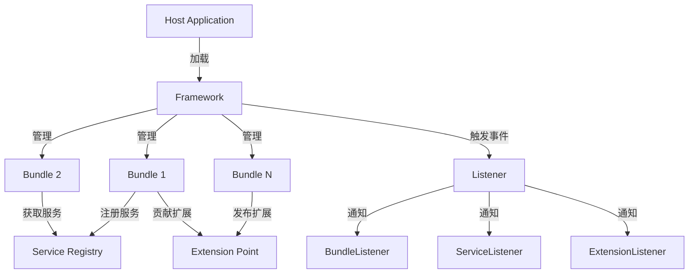

## 项目简介

**OSGi.NET** 是一套遵循 OSGi 规范的 .NET 框架实现，提供了完整的插件化开发能力。通过动态加载、热插拔、服务注册等机制，解决了多人协作开发中的规范问题，实现了真正意义上的模块化架构。

---

## 什么是 OSGi？

**OSGi (Open Services Gateway initiative)** 是一个基于 Java 的模块化系统和服务平台规范。OSGi.NET 将这一成熟的模块化理念引入 .NET 平台，为 .NET 应用程序提供了：

| 能力 | 说明 |
|------|------|
| 🔌 **动态加载** | 运行时加载/卸载插件，无需重启应用 |
| 🔗 **依赖管理** | 自动解析和管理插件间的依赖关系 |
| 📦 **服务注册** | 插件间松耦合的服务调用机制 |
| 🎯 **扩展点** | 标准化的扩展机制 |
| 🔄 **生命周期** | 完整的插件生命周期管理 |

---

## 核心架构

### 项目结构

```
OSGi.NET Client/
├── OSGi.NET/                    # 核心框架
│   ├── Core/                    # 核心接口和实现
│   │   ├── Bundle.cs           # Bundle 实现
│   │   ├── BundleContext.cs    # Bundle 上下文
│   │   ├── IBundle.cs          # Bundle 接口
│   │   ├── IBundleActivator.cs # Bundle 激活器接口
│   │   └── Root/               # Framework 核心启动类
│   ├── Service/                 # 服务层
│   │   ├── IServiceRegistration.cs  # 服务注册接口
│   │   ├── IServiceReference.cs     # 服务引用接口
│   │   ├── ServiceRegistration.cs   # 服务注册实现
│   │   └── ServiceReference.cs      # 服务引用实现
│   ├── Extension/              # 扩展点机制
│   │   ├── ExtensionPoint.cs   # 扩展点
│   │   └── ExtensionData.cs    # 扩展数据
│   ├── Event/                  # 事件系统
│   │   ├── BundleEventArgs.cs      # Bundle 事件参数
│   │   ├── ServiceEventArgs.cs     # 服务事件参数
│   │   └── ExtensionEventArgs.cs   # 扩展事件参数
│   ├── Listener/               # 监听器接口
│   │   ├── IBundleListener.cs      # Bundle 监听器
│   │   ├── IServiceListener.cs     # 服务监听器
│   │   └── IExtensionListener.cs   # 扩展监听器
│   ├── Provider/               # 数据提供者
│   │   ├── BundleAssemblyProvider.cs   # Bundle 程序集提供者
│   │   └── BundleConfigProvider.cs    # Bundle 配置提供者
│   └── Utils/                  # 工具类
├── OSGi.NET.ConsoleSample/     # 控制台示例
├── OSGi.NET.TEST/              # 单元测试
├── Sample/                     # 示例项目
├── Tool/                       # 工具集
├── Help/                       # 帮助文档
└── Config/                     # 配置文件

```

### 架构设计



---

## 核心概念

### 1. Bundle（插件）

**Bundle** 是 OSGi.NET 中的基本模块单元，每个 Bundle 都是一个独立的 .NET 程序集。

#### IBundle 接口

```csharp
public interface IBundle
{
    // 生命周期
    void Start();                          // 启动 Bundle
    void Stop();                           // 停止 Bundle
    void Update(string zipFile);           // 更新 Bundle
    void UnInstall();                      // 卸载 Bundle

    // 状态查询
    int GetState();                        // 获取状态
    Version GetVersion();                  // 获取版本
    string GetSymbolicName();              // 获取符号名称
    int GetBundleStartLevel();             // 获取启动级别

    // 上下文和扩展
    IBundleContext GetBundleContext();     // 获取上下文
    IList<ExtensionPoint> GetExtensionPoints();     // 获取扩展点
    IList<ExtensionData> GetExtensionDatas();       // 获取扩展数据

    // 元数据
    IDictionary<string, string> GetManifest();      // 获取清单
    XmlNode GetBundleManifestData();               // 获取清单节点
}

```

#### Bundle 状态机

```
INSTALLED → RESOLVED → STARTING → ACTIVE ←→ STOPPING → RESOLVED
                            ↓
                         UNINSTALLED

```

### 2. BundleContext（Bundle 上下文）

**BundleContext** 是 Bundle 与 Framework 交互的桥梁。

```csharp
public interface IBundleContext
{
    // Bundle 管理
    IBundle GetBundle();                    // 获取当前 Bundle
    IBundle GetBundleById(long id);         // 根据 ID 获取 Bundle
    IBundle[] GetBundles();                  // 获取所有 Bundle

    // 服务注册
    IServiceRegistration RegisterService(string[] clazz, object service);

    // 服务获取
    object GetService(string clazz);
    IServiceReference[] GetServiceReferences(string clazz, string filter);

    // 扩展点
    ExtensionPoint GetExtensionPoint(string id);
    ExtensionData[] GetExtensionDatas(string extensionPointId);
}

```

### 3. BundleActivator（Bundle 激活器）

**BundleActivator** 定义了 Bundle 的启动和停止逻辑。

```csharp
public interface IBundleActivator
{
    void Start(IBundleContext context);     // Bundle 启动时调用
    void Stop(IBundleContext context);      // Bundle 停止时调用
}

```

**实现示例**：

```csharp
public class MyBundleActivator : IBundleActivator
{
    public void Start(IBundleContext context)
    {
        // 注册服务
        context.RegisterService(
            new string[] { "com.example.MyService" },
            new MyService()
        );

        // 获取其他服务
        var otherService = context.GetService("com.example.OtherService");
    }

    public void Stop(IBundleContext context)
    {
        // 清理资源
    }
}

```

### 4. 服务机制

OSGi.NET 提供了动态的服务注册和发现机制。

```csharp
// 服务注册
public interface IServiceRegistration
{
    IServiceReference GetReference();
    void Unregister();
}

// 服务引用
public interface IServiceReference
{
    object GetService();
    bool IsAssignableTo(string className);
}

```

**使用场景**：

| 场景 | 说明 |
|------|------|
| 📝 **日志服务** | 统一日志接口，各 Bundle 按需实现 |
| 💾 **数据访问** | DAO 层服务，业务层动态获取 |
| 🔧 **配置服务** | 集中配置管理 |
| 📊 **监控服务** | 性能监控、健康检查 |

### 5. 扩展点机制

**扩展点** 是 OSGi.NET 提供的标准化扩展机制。

```csharp
public class ExtensionPoint
{
    public string Id { get; set; }           // 扩展点 ID
    public string Name { get; set; }         // 扩展点名称
    public string Schema { get; set; }       // 扩展点 Schema
}

public class ExtensionData
{
    public string ExtensionPointId { get; set; }  // 所属扩展点
    public string BundleSymbolicName { get; set; } // 所属 Bundle
    public XmlNode Content { get; set; }          // 扩展内容
}

```

**典型应用**：

- 菜单项扩展
- 工具栏按钮扩展
- 视图扩展
- 编辑器扩展

### 6. 监听器机制

OSGi.NET 提供了三种监听器：

| 监听器 | 接口 | 用途 |
|--------|------|------|
| **BundleListener** | IBundleListener | 监听 Bundle 生命周期变化 |
| **ServiceListener** | IServiceListener | 监听服务注册/注销 |
| **ExtensionListener** | IExtensionListener | 监听扩展变化 |

---

## 插件仓库

### 后台服务

使用 **Go 语言** 实现的插件仓库后台服务，提供：

| 功能 | 说明 |
|------|------|
| 📦 **插件托管** | 存储和管理插件包 |
| 🔍 **插件搜索** | 按名称、标签搜索插件 |
| 📊 **版本管理** | 多版本管理 |
| 📝 **文档管理** | 在线文档和示例 |
| 🔐 **权限控制** | 访问权限控制 |

---

## 应用场景

### 典型应用案例

| 场景 | 说明 |
|------|------|
| 🏢 **企业应用** | 多人协作、模块化开发 |
| 🔌 **插件平台** | 第三方扩展开发 |
| 🎨 **IDE 插件** | 编辑器扩展 |
| 📊 **报表系统** | 动态报表插件 |
| 🔧 **工具集** | 可扩展工具平台 |

### 解决的问题

| 问题 | 解决方案 |
|------|----------|
| 👥 **多人协作混乱** | 明确的模块边界和接口约定 |
| 🔄 **部署需重启** | 热插拔，无需重启应用 |
| 🔗 **模块耦合严重** | 服务注册机制实现松耦合 |
| 📦 **依赖管理困难** | 自动依赖解析和管理 |
| 🧩 **扩展能力不足** | 标准化的扩展点机制 |

---

## 截图展示

### 架构概览


### Bundle 管理


### 服务注册


### 扩展点配置


---

## 功能演示

<script src="/js/jquery.bxslider.min.js"></script>
<link href="/css/jquery.bxslider.css" rel="stylesheet" />

<ul class="bxslider">
  <li></li>
  <li></li>
  <li></li>
  <li></li>
  <li></li>
  <li></li>
  <li></li>
  <li></li>
  <li></li>
  <li></li>
  <li></li>
  <li></li>
  <li></li>
</ul>

<script type="text/javascript">
	$(document).ready(function(){
  		$('.bxslider').bxSlider({
               maxSlides: 1,
  			slideWidth: 800,
  			infiniteLoop: false,
  			hideControlOnEnd: true,
  			responsive: true,
  			touchEnabled: true
          });
	});
</script>

---

## 快速开始

### 1. 创建 Bundle

```csharp
using OSGi.NET.Core;

public class MyActivator : IBundleActivator
{
    public void Start(IBundleContext context)
    {
        Console.WriteLine("MyBundle Started!");
    }

    public void Stop(IBundleContext context)
    {
        Console.WriteLine("MyBundle Stopped!");
    }
}

```

### 2. 配置 Manifest

```xml
<Bundle>
    <SymbolicName>MyBundle</SymbolicName>
    <Version>1.0.0</Version>
    <Activator>MyNamespace.MyActivator</Activator>
    <StartLevel>2</StartLevel>
</Bundle>

```

### 3. 启动 Framework

```csharp
using OSGi.NET.Core.Root;

IFramework framework = FrameworkFactory.NewFramework();
framework.Start();

```

---

## 项目地址

完整源代码已开源，欢迎 Star 和 Fork：

**GitHub**: [https://github.com/FreezeSoul/OSGi.NET](https://github.com/FreezeSoul/OSGi.NET)

### 下载资源

| 资源类型 | 链接 |
|----------|------|
| 📘 **开发文档** | [Documentation.chm](/files/Documentation.chm) |
| 💻 **源代码** | [GitHub Repository](https://github.com/FreezeSoul/OSGi.NET) |

---

## 技术特点

### 与其他方案对比

| 特性 | OSGi.NET | MEF | 插件框架(反射) |
|------|----------|-----|----------------|
| **热插拔** | ✅ 支持 | ❌ 不支持 | ⚠️ 需自己实现 |
| **生命周期管理** | ✅ 完整 | ⚠️ 简单 | ❌ 无 |
| **服务注册** | ✅ 动态 | ✅ 支持 | ❌ 无 |
| **扩展点** | ✅ 标准化 | ❌ 无 | ❌ 无 |
| **依赖管理** | ✅ 自动 | ⚠️ 手动 | ❌ 无 |
| **规范标准** | ✅ OSGi | ❌ 微软私有 | ❌ 无 |

### 核心优势

| 优势 | 说明 |
|------|------|
| 🎯 **标准化** | 遵循 OSGi 规范，概念成熟 |
| 🔥 **热插拔** | 运行时动态加载/卸载，无需重启 |
| 🔗 **松耦合** | 服务机制实现模块间松耦合 |
| 📦 **模块化** | 清晰的模块边界和依赖关系 |
| 🛠️ **可扩展** | 标准化的扩展点机制 |

---

## 总结

OSGi.NET 将成熟的 OSGi 模块化理念引入 .NET 平台，为大型应用提供了完善的模块化解决方案。通过 Bundle、服务、扩展点等机制，实现了真正的松耦合、可扩展架构。

> **核心价值**：让复杂应用能够模块化开发、动态部署、灵活扩展。

---

## 推荐阅读

- [OSGi 官方规范](https://www.osgi.org/)
- [OSGi.NET 系列文章](/)
- 《OSGi 实战》- 书籍推荐

---

**欢迎使用和反馈！** 如果你觉得有用，请给个 Star ⭐
