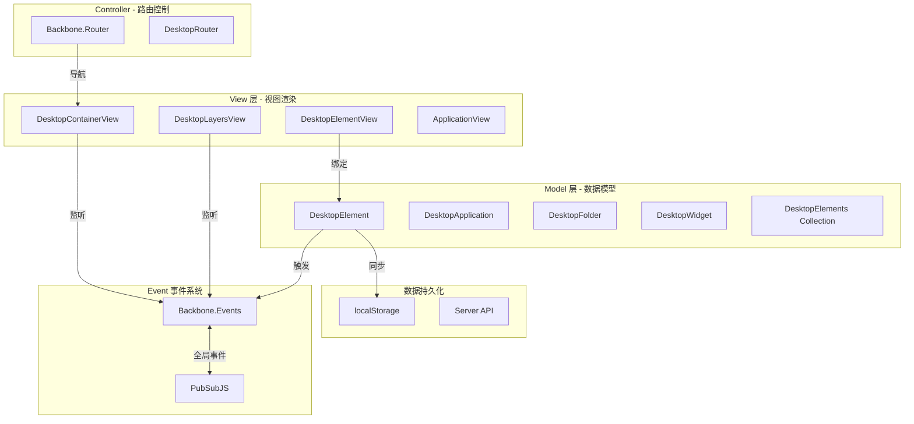
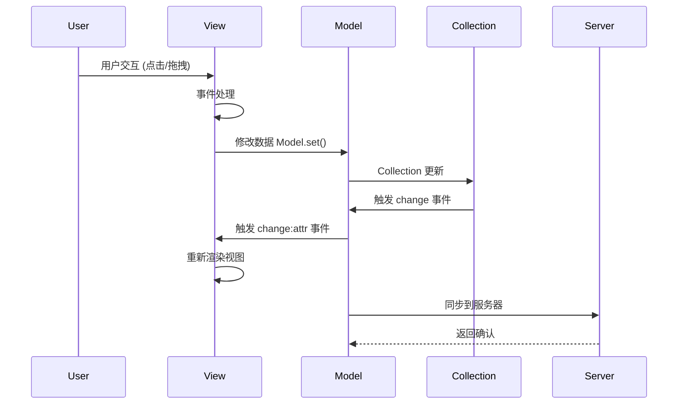
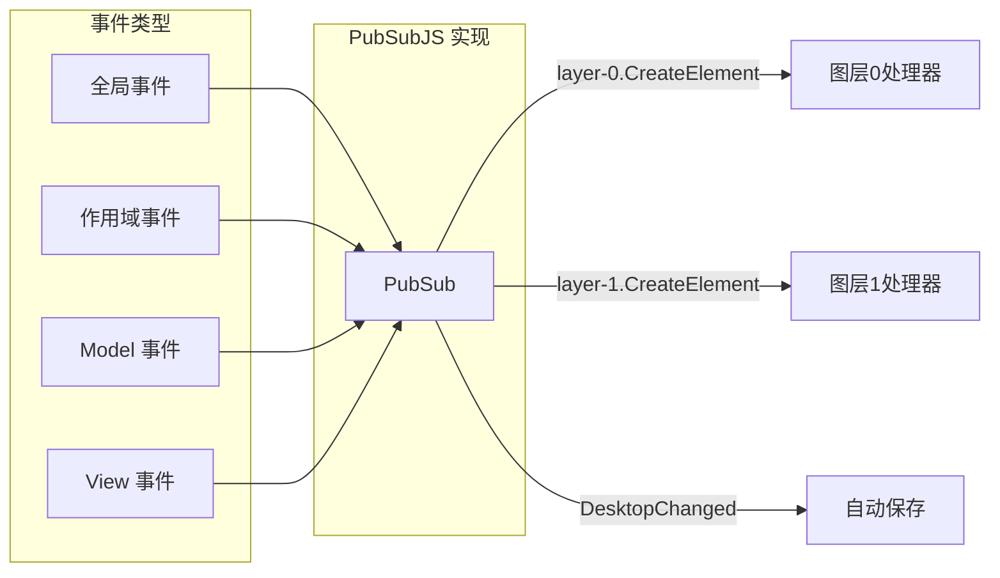
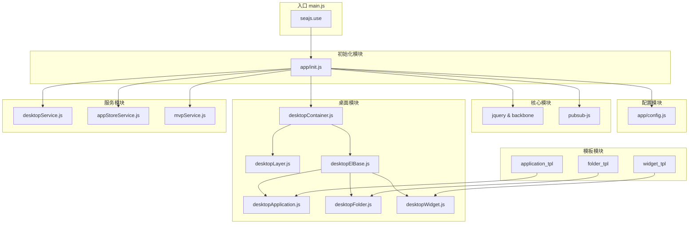
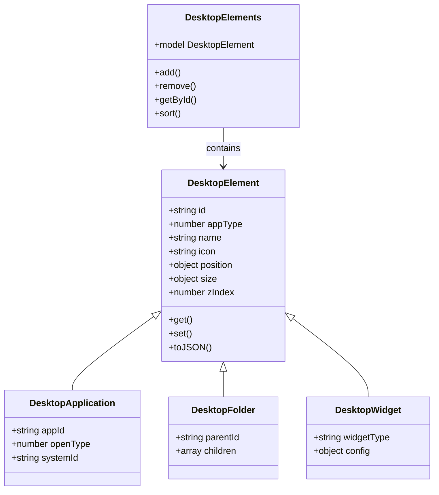
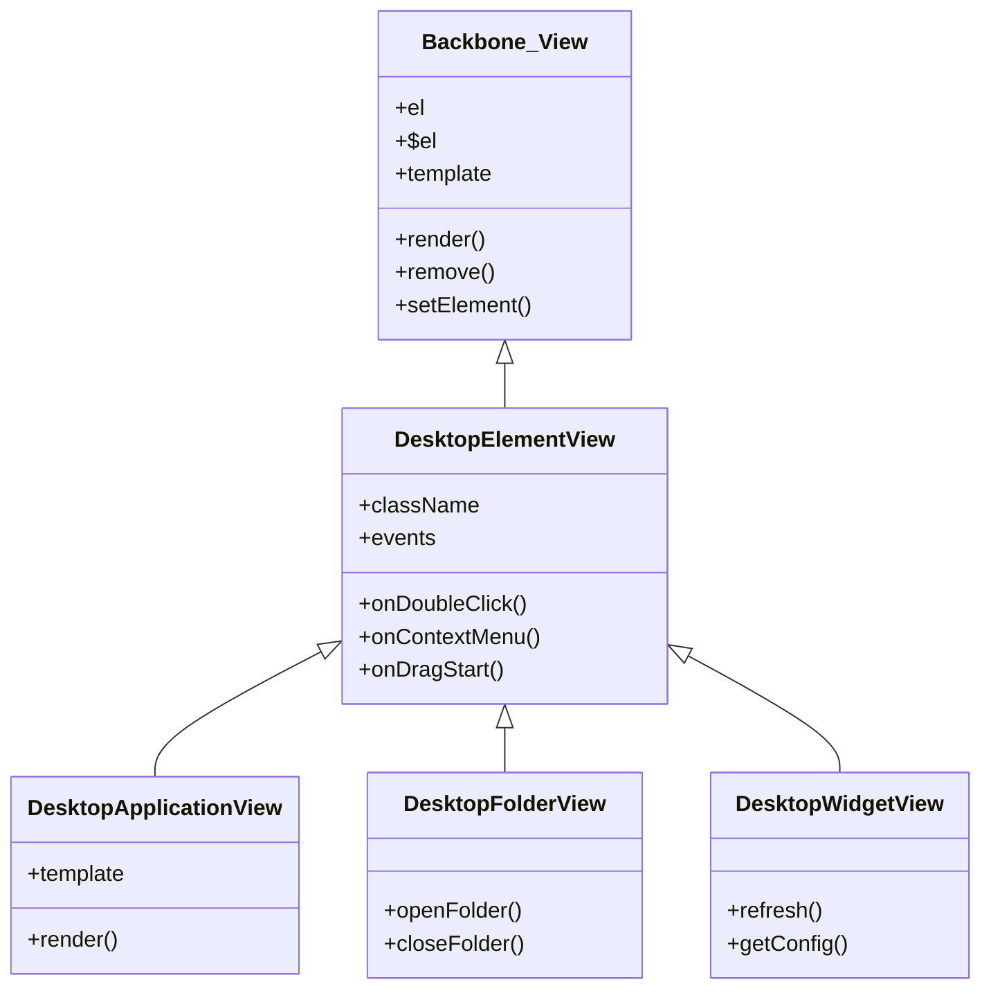
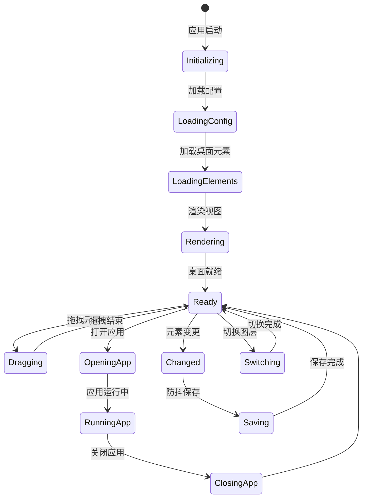
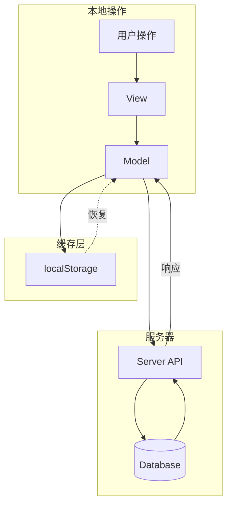

本项目实现了一套Web桌面功能，整个项目采用B+C的架构，Shell部分采用了Awesomium，用户操作接口采用HTML5 SPA技术开发，涵盖了桌面的基本操作功能及文件夹管理、应用中心、复合应用、桌面组件等功能。

效果截图：


SHELL封装: <a href="http://www.awesomium.com/">Awesomium</a>
演示程序：<a href="/files/NoDownload">NoPublic</a>

---

## 技术架构：Backbone + Sea.js 的模块化 SPA

在项目开发中，选择 **Backbone.js** 作为 MVC 框架、**Sea.js** 作为模块加载器，是一个兼顾开发效率和代码组织的方案。
具体使用的技术有Backbone，Seajs，PubSubJS，Webkit等。

### 架构概览

```
┌─────────────────────────────────────────┐
│         Web Desktop Application          │
├─────────────────────────────────────────┤
│  UI Layer (Backbone Views)              │
│  ├── DesktopContainerView               │
│  ├── DesktopLayersView                  │
│  ├── DesktopElementView                 │
│  └── Application/Folder/Widget Views    │
├─────────────────────────────────────────┤
│  Data Layer (Backbone Models)           │
│  ├── DesktopElement (Base)              │
│  ├── DesktopApplication                 │
│  ├── DesktopFolder                      │
│  └── DesktopWidget                      │
├─────────────────────────────────────────┤
│  Event System (PubSubJS)                │
│  ├── Scoped Events [layerId.eventType]  │
│  └── Global Events                      │
├─────────────────────────────────────────┤
│  Module Loader (Sea.js CMD)             │
│  ├── Synchronous require()              │
│  ├── Async seajs.use()                  │
│  └── Template Modules                   │
├─────────────────────────────────────────┤
│  Native Bridge (MVP Platform)           │
│  └── Bidirectional Message Passing      │
└─────────────────────────────────────────┘

```

### Sea.js 模块系统

**CMD（Common Module Definition）模块定义**：

```javascript
define(function(require, exports, module) {
    // 同步依赖
    var $ = require('jquery');
    var Backbone = require('backbone');
    var application_tpl = require('application_tpl');

    // 定义模块内容
    var DesktopApplicationView = Backbone.View.extend({
        template: _.template(application_tpl),
        // ...
    });

    // 导出模块
    module.exports = DesktopApplicationView;
});

```

**模块配置** (`app/main.js`)：

```javascript
seajs.config({
    base: './base/',
    alias: {
        'jquery': 'jquery-module.js',
        'backbone': 'backbone-module.js',
        'underscore': 'underscore-module.js',
        'pubsub': 'pubsub-js-module.js'
    },
    map: [
        [/.js$/, '.js?v=' + version]  // 版本号防缓存
    ]
});

// 入口模块
seajs.use(['app/init'], function(init) {
    init.bootstrap();
});

```

**优势**：
- **按需加载**：只加载当前页面需要的模块
- **依赖管理**：自动处理模块依赖关系
- **版本控制**：通过 map 配置实现缓存更新
- **开发友好**：支持调试模式，便于开发定位

### Backbone.js MVC 架构

#### Model 层：桌面元素的数据模型

```javascript
// 基础元素模型
var DesktopElement = Backbone.Model.extend({
    defaults: {
        id: '',
        appType: 0,        // 0:应用, 1:组件, 5:文件夹, 6:复合应用
        name: '',
        icon: '',
        position: { top: 0, left: 0 },
        size: { width: 100, height: 100 },
        zIndex: 1,
        isLock: false,
        cellInfo: { row: -1, column: -1 }
    }
});

// 应用模型继承
var DesktopApplication = DesktopElement.extend({
    defaults: _.extend({}, DesktopElement.prototype.defaults, {
        appId: '',
        openType: 0,       // 0:BS, 1:CS, 2:单机, 3:内部, 99:IE
        systemId: '',
        appCommand: ''
    });
});

// Collection 管理
var DesktopElements = Backbone.Collection.extend({
    model: DesktopElement,
    comparator: function(item) {
        return item.get('index');
    }
});

```

#### View 层：桌面元素的视图渲染

```javascript
// 基础视图
var DesktopElementView = Backbone.View.extend({
    className: 'desktop-element',

    events: {
        'dblclick': 'onDoubleClick',
        'contextmenu': 'onContextMenu',
        'dragstart': 'onDragStart'
    },

    render: function() {
        var html = this.template(this.model.toJSON());
        this.$el.html(html);
        this.$el.css(this.model.get('position'));
        return this;
    },

    onDoubleClick: function() {
        PubSub.publishSync(config.OpenAppEvent, this.model);
    }
});

// 应用视图继承
var DesktopApplicationView = DesktopElementView.extend({
    template: _.template(application_tpl),

    render: function() {
        DesktopElementView.prototype.render.call(this);
        this.$el.find('.icon').css({
            'background-image': 'url(' + this.model.get('icon') + ')'
        });
        return this;
    }
});

```

#### 虚拟桌面系统

```javascript
var DesktopLayersView = Backbone.View.extend({
    el: '#desktop-layers',

    initialize: function() {
        this.currentLayer = 0;
        this.layers = [];
        this.initLayers(4);  // 4个虚拟桌面
        this.bindEvents();
    },

    initLayers: function(count) {
        for (var i = 0; i < count; i++) {
            this.layers.push(new DesktopLayer({
                id: 'layer-' + i,
                index: i
            }));
        }
    },

    switchToLayer: function(layerIndex) {
        var direction = layerIndex > this.currentLayer ? 'left' : 'right';
        this.$el.find('.layer')
            .removeClass('active')
            .eq(layerIndex)
            .addClass('active')
            .addClass('slide-' + direction);

        this.currentLayer = layerIndex;
        PubSub.publishSync(config.LayerChangedEvent, layerIndex);
    }
});

```

### 事件驱动架构 (PubSub)

**分层事件系统**：

```javascript
// 作用域事件：格式为 [layerId, eventType].join(".")
PubSub.publishSync(
    [layerId, config.CreateDesktopElementEvent].join("."),
    appElement
);

// 示例：订阅指定图层的事件
PubSub.subscribe(
    ['layer-0', config.CreateDesktopElementEvent].join("."),
    function(msg, element) {
        // 处理图层 0 的元素创建
        addElementToLayer(element);
    }
);

// 全局事件
PubSub.subscribe(config.DesktopIsChangedEvent, function() {
    // 桌面变更时触发自动保存（防抖 500ms）
    debounce(saveDesktopConfig, 500)();
});

```

**常用事件定义**：

```javascript
var config = {
    // 桌面元素事件
    CreateDesktopElementEvent: 'CreateDesktopElement',
    RemoveDesktopElementEvent: 'RemoveDesktopElement',
    MoveDesktopElementEvent: 'MoveDesktopElement',

    // 系统事件
    DesktopIsChangedEvent: 'DesktopIsChanged',
    DesktopConfigSaveEvent: 'DesktopConfigSave',
    LayerChangedEvent: 'LayerChanged',

    // UI 事件
    ShowWarnMessageEvent: 'ShowWarnMessage',
    HideDesktopPopThings: 'HideDesktopPopThings',
    OpenAppStoreEvent: 'OpenAppStore'
};

```

### MVP 平台桥接（原生集成）

**双向通信机制**：

```javascript
// Web 调用原生方法
var MvpService = {
    openApp: function(appData) {
        PubSub.publishSync(config.CallNativeMethod, {
            method: 'OpenApp',
            params: [appData]
        });
    },

    selectFile: function(callback) {
        PubSub.subscribe(config.FileSelectedEvent, function(msg, filePath) {
            callback(filePath);
        });
        PubSub.publishSync(config.CallNativeMethod, {
            method: 'ShowFileDialog',
            params: []
        });
    }
};

// 接收原生回调
PubSub.subscribe(config.NativeCallbackEvent, function(msg, data) {
    switch(data.method) {
        case 'OpenApp':
            handleAppOpenResult(data.result);
            break;
        case 'GetConfig':
            loadDesktopConfig(data.result);
            break;
    }
});

```

### 模块化模板

**模板作为模块导出**：

```javascript
// static/templates/application.js
define(function() {
    return `
<div class="desktop-element application" id="<%= id %>">
    <div class="icon" style="background-image: url(<%= icon %>)"></div>
    <div class="name"><%= name %></div>
</div>`;
});

```

**在 View 中使用**：

```javascript
define(function(require, exports, module) {
    var Backbone = require('backbone');
    var application_tpl = require('application_tpl');

    var DesktopApplicationView = Backbone.View.extend({
        template: _.template(application_tpl),
        // ...
    });

    module.exports = DesktopApplicationView;
});

```

### 项目结构

```
WebDesktop/
├── index.htm                    # 入口页面
├── app/
│   ├── main.js                  # Sea.js 配置
│   ├── init.js                  # 应用初始化
│   ├── config.js                # 配置常量
│   ├── util.js                  # 工具函数
│   ├── service/                 # 业务服务层
│   │   ├── desktopService.js
│   │   ├── appStoreService.js
│   │   └── mvpService.js
│   └── desktop/                 # 桌面组件
│       ├── desktopContainer.js  # 桌面容器
│       ├── desktopLayer.js      # 虚拟桌面
│       ├── desktopElBase.js     # 基础元素
│       ├── desktopApplication.js
│       ├── desktopFolder.js
│       └── desktopWidget.js
├── static/
│   ├── templates/               # Underscore 模板
│   └── style/                   # 样式文件
└── base/                        # 第三方库
    ├── jquery.js
    ├── backbone.js
    └── sea.js

```

### 技术要点总结

| 特性 | 实现方案 |
|------|----------|
| **模块化** | Sea.js CMD 规范 |
| **MVC 架构** | Backbone.js Models/Collections/Views |
| **事件通信** | PubSubJS 事件总线 |
| **模板引擎** | Underscore.js Templates |
| **拖拽交互** | jQuery UI Draggable/Droppable |
| **原生桥接** | PubSub 双向通信 |
| **状态持久化** | JSON 序列化 + 防抖保存 |
| **虚拟桌面** | 多图层容器 + CSS 动画 |

这套架构在 2014 年是一个相对成熟的 SPA 解决方案，通过 Backbone.js 的 MVC 模式和 Sea.js 的模块化能力，实现了代码的可维护性和可扩展性，同时也很好地支持了与原生客户端的集成。

深入理解 Backbone.js 的架构设计理念，有助于更好地掌握前端工程化的核心思想，下面结合项目实践详细介绍其架构体系。

---

## Backbone.js 架构体系详解

### 整体架构



### MVC 数据流向



### 事件驱动架构



### 模块依赖关系



### Model 与 Collection 的关系



### View 继承体系



### 状态管理流程



### 数据同步机制



Backbone.js 的这种架构设计，使得应用在保持轻量的同时，具备了良好的代码组织能力和扩展性。通过 Model-View-Presenter 的变体配合 PubSubJS，实现了复杂的前端交互逻辑。  
