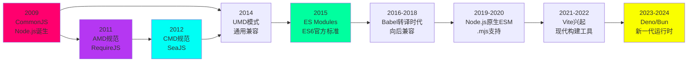
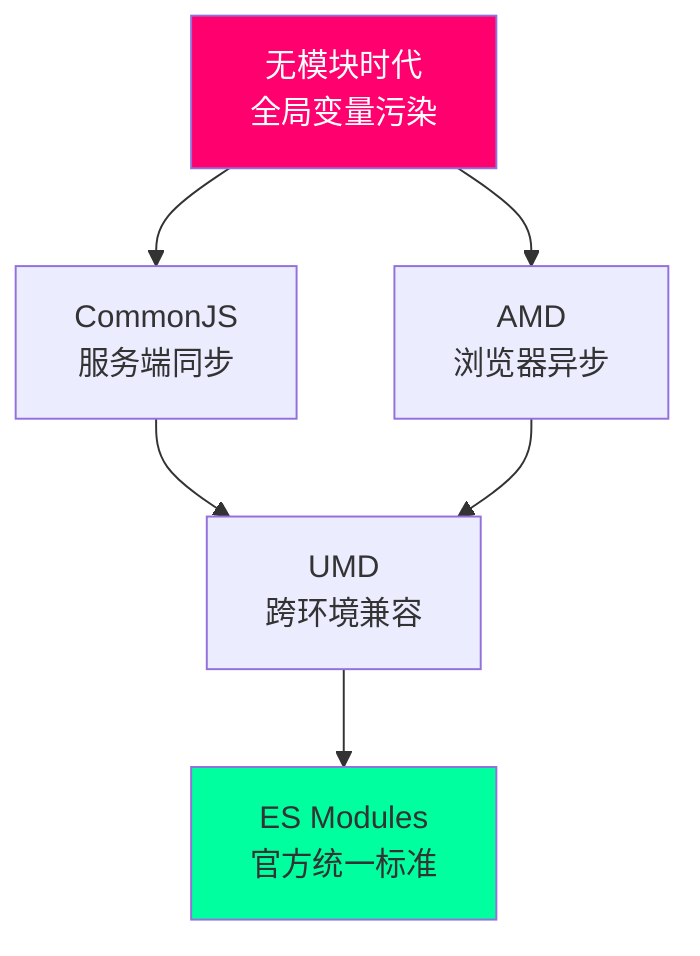

## 引言：模块化的必要性

在 JavaScript 早期发展阶段，语言本身并没有内置的模块系统。这导致开发者在构建大型应用时面临着诸多挑战：

### 全局命名空间污染

```javascript
// script1.js
var utils = {
  formatDate: function(date) { /* ... */ }
};

// script2.js - 意外覆盖了同名变量
var utils = {
  formatDate: function(date) { /* 不同实现 */ }
};

// script3.js - 使用时出现意外行为
utils.formatDate(new Date()); // 调用的是哪个实现？
```

这种命名冲突在引入多个第三方库时尤为严重。著名的例子是早期的 Prototype.js 与 jQuery 之间的 `$` 符号冲突。

### 依赖管理混乱

在模块化之前，开发者必须通过 HTML `<script>` 标签手动管理加载顺序：

```html
<!-- 必须严格按照依赖顺序加载 -->
<script src="jquery.js"></script>
<script src="underscore.js"></script>
<script src="backbone.js"></script>
<script src="app.js"></script>

<!-- 如果顺序错误，就会报错 -->
<script src="app.js"></script>  <!-- Uncaught Error: Backbone is not defined -->
<script src="backbone.js"></script>
```

### 作用域问题

```javascript
// 所有变量都在全局作用域
var dbPassword = "secret123";  // 任何脚本都能访问

// 通过 IIFE 创建私有作用域（当时的解决方案）
var MyModule = (function() {
  var privateVar = "private";

  return {
    getPrivate: function() {
      return privateVar;
    }
  };
})();
```

虽然 IIFE（立即执行函数表达式）提供了一定的封装能力，但这种方式无法解决模块间的依赖管理问题。

### 可维护性挑战

随着项目规模的增长，缺乏模块化导致：

- **代码定位困难**：无法快速找到功能定义位置
- **重构风险高**：修改一处可能影响多处
- **测试困难**：无法独立测试单个模块
- **团队协作效率低**：多人开发时容易产生冲突

## CommonJS (CJS) - 服务端模块化的先驱

**时间**: 2009年1月

**提出者**: Kevin Dangoor（ServerJS 项目，后更名为 CommonJS）

**背景**: CommonJS 的诞生源于 JavaScript 在服务器端应用的需求。当时 Node.js 刚刚发布（2009年），Ryan Dahl 选择了 CommonJS 规范作为 Node.js 的模块系统基础。

### 历史背景

2009年之前，JavaScript 主要用于浏览器端的小脚本。当 Node.js 出现后，JavaScript 开始进入服务器开发领域，但面临一个核心问题：如何组织和管理服务器端的 JavaScript 代码？

CommonJS 项目的目标是创建一个标准的 JavaScript 库生态系统，让 JavaScript 代码能够在不同 JavaScript 运行时之间共享。

### 核心规范

CommonJS Modules/1.0 规范定义了三个核心概念：

1. **require()** - 导入模块的函数
2. **exports** - 导出模块内容的对象
3. **module** - 表示当前模块的对象

### 详细语法

```javascript
// ===== 基本导出 =====

// 方式1：直接赋值给 module.exports
module.exports = function Calculator() {
  this.add = function(a, b) {
    return a + b;
  };
};

// 方式2：使用 exports 添加属性（注意：不能直接赋值）
exports.PI = 3.14159;
exports.calculateArea = function(radius) {
  return this.PI * radius * radius;
};

// 错误示例：直接赋值会断开引用
exports = function() {}; // ❌ 无效

// ===== 基本导入 =====

// 导入核心模块
const fs = require('fs');
const path = require('path');

// 导入文件模块（相对路径必须以 ./ 或 ../ 开头）
const myUtils = require('./utils');
const parentModule = require('../parent');

// 导入 node_modules 中的模块
const lodash = require('lodash');
const express = require('express');

// ===== 导入时的解构 =====

// utils.js
exports.add = function(a, b) { return a + b; };
exports.subtract = function(a, b) { return a - b; };

// app.js
const { add, subtract } = require('./utils');
console.log(add(5, 3)); // 8

// ===== 模块缓存机制 =====

// 第一次 require 会执行并缓存
const mod1 = require('./myModule'); // 执行模块代码
const mod2 = require('./myModule'); // 从缓存返回
console.log(mod1 === mod2); // true - 同一个实例
```

### 模块加载流程

```javascript
// Node.js 的模块加载流程（简化版）

function require(modulePath) {
  // 1. 解析模块路径
  const resolvedPath = Module._resolveFilename(modulePath);

  // 2. 检查缓存
  if (Module._cache[resolvedPath]) {
    return Module._cache[resolvedPath].exports;
  }

  // 3. 创建新模块
  const module = new Module(resolvedPath);

  // 4. 缓存模块
  Module._cache[resolvedPath] = module;

  // 5. 加载模块文件
  module.load(resolvedPath);

  // 6. 返回导出内容
  return module.exports;
}
```

### 模块解析算法

Node.js 按照以下顺序查找模块：

```javascript
// require('./myModule') 的查找顺序

// 1. 精确文件名
./myModule.js
./myModule.json
./myModule.node

// 2. 目录形式
./myModule/package.json (查找 main 字段)
./myModule/index.js
./myModule/index.json
./myModule/index.node

// 3. node_modules 查找（向上递归）
./node_modules/myModule
../node_modules/myModule
../../node_modules/myModule
// ... 直到根目录
```

### 循环依赖处理

CommonJS 通过值拷贝和执行顺序处理循环依赖：

```javascript
// a.js
console.log('a 开始');
exports.loaded = false;
const b = require('./b');
console.log('a 中，b.loaded =', b.loaded);
exports.loaded = true;
console.log('a 结束');

// b.js
console.log('b 开始');
exports.loaded = false;
const a = require('./a');
console.log('b 中，a.loaded =', a.loaded);
exports.loaded = true;
console.log('b 结束');

// main.js
const a = require('./a');
const b = require('./b');

// 输出：
// a 开始
// b 开始
// b 中，a.loaded = false  ← a 还未完全加载
// b 结束
// a 中，b.loaded = true   ← b 已完全加载
// a 结束
```

### 同步加载的原理

```javascript
// 文件系统读取是同步的
const fs = require('fs');
const content = fs.readFileSync('config.json', 'utf8');

// 在服务器端，I/O 操作虽然快，但仍然是同步阻塞的
// 这在浏览器中会导致界面卡死
const module = require('./heavy-computation'); // 阻塞直到加载完成
```

### 优缺点分析

**优点**:

1. **简洁直观**：语法简单，易于理解
2. **服务端性能好**：本地文件系统访问速度快
3. **成熟的生态系统**：npm 基于 CommonJS
4. **明确的依赖关系**：通过 require() 清晰表达依赖

**缺点**:

1. **同步加载不适合浏览器**：网络请求会导致阻塞
2. **不支持静态分析**：无法在编译时确定依赖
3. **无法 Tree-shaking**：打包工具难以消除未使用代码
4. **运行时加载**：性能低于静态加载

### 实际应用示例

```javascript
// config/config.js - 配置模块
module.exports = {
  database: {
    host: process.env.DB_HOST || 'localhost',
    port: process.env.DB_PORT || 5432,
    name: process.env.DB_NAME || 'myapp'
  },
  redis: {
    host: process.env.REDIS_HOST || 'localhost',
    port: process.env.REDIS_PORT || 6379
  }
};

// services/database.js - 数据库服务
const config = require('../config');

class Database {
  constructor() {
    this.connection = null;
  }

  connect() {
    console.log(`Connecting to ${config.database.host}:${config.database.port}`);
    // 连接逻辑
  }
}

module.exports = new Database();

// app.js - 应用入口
const db = require('./services/database');
const http = require('http');

db.connect();

const server = http.createServer((req, res) => {
  res.end('Hello World');
});

server.listen(3000);
```

## AMD (Asynchronous Module Definition) - 浏览器端的探索

**时间**: 2011年

**提出者**: James Burke（RequireJS 作者）

**背景**: AMD 规范的出现直接针对浏览器环境的特殊性。在浏览器中，模块需要通过网络加载，同步加载会导致页面阻塞和糟糕的用户体验。

### 历史背景

2010年前后，Web 应用开始变得复杂，需要加载大量 JavaScript 文件。传统的 `<script>` 标签方式存在以下问题：

1. **阻塞渲染**：脚本执行期间页面无法响应用户交互
2. **加载顺序依赖**：必须手动管理复杂的依赖关系
3. **性能问题**：无法并行加载和执行
4. **难以调试**：全局命名空间混乱

James Burke 在开发 Dojo Toolkit 时遇到了这些问题，于是创建了 RequireJS 和 AMD 规范。

### 核心规范

AMD 规范定义了一个简单的 API：

```javascript
define(id?, dependencies?, factory);
```

- **id**（可选）：模块标识符
- **dependencies**（可选）：依赖模块数组
- **factory**：模块工厂函数

### 详细语法

```javascript
// ===== 基本模块定义 =====

// 无依赖的模块
define(function() {
  return {
    getVersion: function() {
      return '1.0.0';
    }
  };
});

// 有依赖的模块
define(['jquery', 'underscore'], function($, _) {
  function processData(data) {
    // 使用依赖
    var sorted = _.sortBy(data, 'id');
    return $('#result').html(sorted);
  }

  return {
    process: processData
  };
});

// 具名模块（不推荐，仅用于特殊情况）
define 'app/utils', ['lodash'], function(_) {
  return {
    clone: _.clone
  };
});

// ===== 模块导入 =====

// 全局 require
require(['myModule', 'anotherModule'], function(myMod, anotherMod) {
  myMod.doSomething();
  anotherMod.doOtherThing();
});

// 局部 require（在模块内动态加载）
define(function(require) {
  var button = document.getElementById('loadButton');

  button.addEventListener('click', function() {
    // 点击时才加载模块
    require(['heavyModule'], function(heavy) {
      heavy.process();
    });
  });
});

// ===== CommonJS 兼容写法 =====

// AMD 支持类似 CommonJS 的写法（通过简化 CommonJS 包装）
define(function(require, exports, module) {
  var dep = require('dependency');
  exports.value = dep.transform();
});
```

### RequireJS 配置

```javascript
// main.js - RequireJS 入口配置

requirejs.config({
  // 基础路径，所有模块查找的起点
  baseUrl: './js',

  // 路径映射（简化模块名）
  paths: {
    'jquery': 'libs/jquery-2.1.4.min',
    'underscore': 'libs/underscore-min',
    'backbone': 'libs/backbone-min'
  },

  // 模块配置（用于非 AMD 模块）
  shim: {
    'underscore': {
      exports: '_'
    },
    'backbone': {
      deps: ['jquery', 'underscore'],
      exports: 'Backbone'
    },
    'jqueryScroll': {
      deps: ['jquery'],
      exports: 'jQuery.fn.scroll'
    }
  },

  // 等待超时时间
  waitSeconds: 15,

  // 调试模式
  enforceDefine: true,

  // URL 参数（避免缓存）
  urlArgs: "bust=" + (new Date()).getTime()
});

// 启动应用
require(['app/main'], function(App) {
  App.initialize();
});
```

### 异步加载机制

```javascript
// AMD 使用回调处理异步加载

define(['module1', 'module2', 'module3'], function(mod1, mod2, mod3) {
  // 三个模块并行加载，全部完成后执行回调
  // 即使 module3 加载最快，也会等待其他模块

  mod1.init();
  mod2.setup();
  mod3.run();
});

// 加载时序
// [并行开始]
//   ├── module1.js ────────┐
//   ├── module2.js ────┐   │
//   └── module3.js ─┐ │   │
//                    ↓ ↓   ↓
//                  [全部完成] → 执行回调
```

### 依赖前置 vs 就近依赖

```javascript
// AMD：依赖前置（所有依赖在开头声明）
define(['jquery', './utils', './config'], function($, utils, config) {

  function initFeatureA() {
    // jQuery 在这里使用
    $('#featureA').show();
  }

  function initFeatureB() {
    // utils 在这里使用
    utils.process();
  }

  // config 在这里使用
  var api = config.apiUrl;

  return {
    initA: initFeatureA,
    initB: initFeatureB
  };
});
```

### 优缺点分析

**优点**:

1. **异步加载**：不阻塞页面渲染，用户体验好
2. **并行加载**：多个模块可以同时下载
3. **成熟的实现**：RequireJS 功能完善，文档齐全
4. **循环依赖检测**：可以检测并处理循环依赖
5. **插件支持**：支持文本、CSS 等资源的加载

**缺点**:

1. **语法复杂**：define 回调嵌套，代码可读性差
2. **依赖前置**：可能加载不需要的模块
3. **开发体验不佳**：配置相对复杂
4. **调试困难**：多层回调增加调试难度

### 实际应用示例

```html
<!DOCTYPE html>
<html>
<head>
  <title>My App</title>
  <!-- 引入 RequireJS -->
  <script data-main="js/main" src="js/require.js"></script>
</head>
<body>
  <div id="app"></div>
</body>
</html>
```

```javascript
// js/main.js
requirejs.config({
  paths: {
    jquery: 'lib/jquery.min',
    underscore: 'lib/underscore.min',
    backbone: 'lib/backbone.min'
  },
  shim: {
    underscore: {
      exports: '_'
    },
    backbone: {
      deps: ['jquery', 'underscore'],
      exports: 'Backbone'
    }
  }
});

require(['app'], function(App) {
  App.start();
});
```

```javascript
// js/app.js
define(['jquery', 'backbone', 'views/appView'], function($, Backbone, AppView) {
  var App = {
    start: function() {
      new AppView({el: $('#app')});
      Backbone.history.start();
    }
  };

  return App;
});
```

```javascript
// js/views/appView.js
define(['backbone', 'collections/todos'], function(Backbone, TodoList) {
  var AppView = Backbone.View.extend({
    initialize: function() {
      this.todos = new TodoList();
      this.todos.fetch();
      this.render();
    },

    render: function() {
      this.$el.html('<h1>Todo App</h1>');
      return this;
    }
  });

  return AppView;
});
```

## CMD (Common Module Definition) - 国内探索

**时间**: 2012年

**提出者**: 玉伯（淘宝前端架构师）

**背景**: CMD 是在中国互联网快速发展的背景下诞生的。当时国内开发者在使用 AMD 规范时遇到一些问题，玉伯在开发 SeaJS 时提出了 CMD 规范。

### 历史背景

2011-2012年，中国互联网迎来爆发式增长，淘宝等大型电商网站的前端复杂度急剧提升。国内开发者在实践中发现：

1. AMD 的依赖前置在某些场景下不够灵活
2. 开发体验与 CommonJS 差异较大
3. 需要一个更符合国内开发习惯的规范

玉伯受到 CommonJS 的启发，设计了 CMD 规范，强调"依赖就近"和"延迟执行"。

### 核心规范

CMD 规范的特点：

```javascript
define(function(require, exports, module) {
  // 模块代码
});
```

- **require**：导入函数（同步）
- **exports**：导出对象
- **module**：模块对象

### 详细语法

```javascript
// ===== 基本模块定义 =====

// 简单模块
define(function(require, exports, module) {
  var $ = require('jquery');

  function init() {
    $('#app').show();
  }

  exports.init = init;
});

// ===== 依赖就近（核心特性）=====

define(function(require, exports, module) {
  // 依赖可以就近书写

  function featureA() {
    // 在需要时才引入依赖
    var moduleA = require('./moduleA');
    moduleA.run();
  }

  function featureB() {
    // 延迟加载，使用时才引入
    var moduleB = require('./moduleB');
    moduleB.process();
  }

  exports.featureA = featureA;
  exports.featureB = featureB;
});
```

### 与 AMD 的核心区别

```javascript
// ===== AMD：依赖前置 =====

define(['jquery', './utils', './config'], function($, utils, config) {
  // 所有依赖在开头声明并加载
  // 即使某些依赖在后面才用到

  function init() {
    $('#app').show();
  }

  function process() {
    // utils 和 config 在这里才使用
    // 但在模块加载时就已经被加载了
    utils.format(config.data);
  }

  return { init: init, process: process };
});

// ===== CMD：依赖就近 =====

define(function(require, exports, module) {
  function init() {
    // 需要时才引入
    var $ = require('jquery');
    $('#app').show();
  }

  function process() {
    // 使用时才引入
    var utils = require('./utils');
    var config = require('./config');
    utils.format(config.data);
  }

  exports.init = init;
  exports.process = process;
});
```

### 延迟执行机制

```javascript
// AMD：立即执行
define(['moduleA', 'moduleB'], function(A, B) {
  // A 和 B 的模块代码已经执行
  console.log(A.initialized); // true
  console.log(B.initialized); // true
});

// CMD：延迟执行
define(function(require, exports, module) {
  // 此时模块A和模块B还没有加载

  function later() {
    var A = require('moduleA'); // 此时才加载和执行模块A
    console.log(A.initialized); // true

    var B = require('moduleB'); // 此时才加载和执行模块B
  }

  exports.later = later;
});
```

### SeaJS 配置

```javascript
// seajs.config
seajs.config({
  // 别名配置
  alias: {
    'jquery': 'jquery/jquery/1.10.1/jquery',
    'app': 'src/app'
  },

  // 路径配置
  paths: {
    'gallery': 'https://a.alipayobjects.com/gallery'
  },

  // 变量配置
  vars: {
    'locale': 'zh-cn'
  },

  // 映射配置
  map: [
    ['http://example.com/js/app/', 'http://localhost/js/app/']
  ],

  // 预加载项
  preload: [
    Function.prototype.bind ? '' : 'es5-safe',
    'seajs-debug'
  ],

  // 调试模式
  debug: true,

  // 基础路径
  base: 'http://example.com/js/',

  // 文件编码
  charset: 'utf-8'
});

// 加载主模块
seajs.use('./main');
```

### 优缺点分析

**优点**:

1. **依赖就近**：更符合直觉，代码可读性好
2. **延迟执行**：按需加载，性能更好
3. **语法简洁**：接近 CommonJS，学习成本低
4. **国内生态**：文档和社区支持好（国内）

**缺点**:

1. **生态局限**：主要在国内使用，国际影响力有限
2. **工具支持**：相比 AMD，工具链支持较少
3. **逐步淘汰**：随着 ESM 的普及，使用减少

### 实际应用示例

```javascript
// modules/dialog.js - 对话框模块
define(function(require, exports, module) {
  var $ = require('jquery');
  var template = require('./dialog-template');

  function Dialog(options) {
    this.options = options;
    this.el = $(template);
  }

  Dialog.prototype.show = function() {
    var self = this;

    // 延迟加载动画库
    require('./animate', function(animate) {
      self.el.appendTo('body');
      animate.fadeIn(self.el);
    });
  };

  Dialog.prototype.hide = function() {
    this.el.remove();
  };

  module.exports = Dialog;
});
```

```javascript
// modules/app.js - 应用模块
define(function(require, exports, module) {
  var $ = require('jquery');
  var Dialog = require('./dialog');

  function init() {
    $('#showDialog').on('click', function() {
      var dialog = new Dialog({
        title: '提示',
        content: 'Hello CMD!'
      });
      dialog.show();
    });
  }

  exports.init = init;
});
```

```javascript
// main.js - 入口文件
define(function(require) {
  var app = require('./modules/app');

  $(document).ready(function() {
    app.init();
  });
});
```

### AMD vs CMD 对比表

| 特性 | AMD | CMD |
|------|-----|-----|
| **依赖声明** | 前置（定义时） | 就近（使用时） |
| **执行时机** | 加载后立即执行 | 延迟到需要时 |
| **API 风格** | 回调函数 | 更接近 CommonJS |
| **代表实现** | RequireJS | SeaJS |
| **主要影响区域** | 国际 | 国内 |
| **学习曲线** | 较陡 | 平缓 |
| **适用场景** | 依赖关系明确的模块 | 复杂条件依赖 |
| **性能特点** | 可能提前加载不需要的模块 | 按需加载，更灵活 |

## UMD (Universal Module Definition) - 通用方案

**时间**: 2014年左右

**背景**: UMD 不是一种新的模块规范，而是一种模式，让代码能够同时运行在 CommonJS、AMD 和全局变量环境中。

### 设计理念

UMD 的核心思想是通过运行时环境检测，使用适当的模块系统：

```javascript
// UMD 的基本模式
(function (root, factory) {
  if (typeof define === 'function' && define.amd) {
    // AMD 环境
    define([], factory);
  } else if (typeof exports === 'object') {
    // CommonJS 环境
    module.exports = factory();
  } else {
    // 浏览器全局变量环境
    root.MyLibrary = factory();
  }
}(this, function() {
  // 模块实现
  return {};
}));
```

### 详细实现模式

#### 模式1：无依赖的 UMD

```javascript
(function (root, factory) {
  if (typeof define === 'function' && define.amd) {
    // AMD
    define([], factory);
  } else if (typeof exports === 'object') {
    // CommonJS
    module.exports = factory();
  } else {
    // Browser globals
    root.MyLibrary = factory();
  }
}(typeof self !== 'undefined' ? self : this, function() {

  function MyLibrary() {
    this.version = '1.0.0';
  }

  MyLibrary.prototype.doSomething = function() {
    console.log('Doing something...');
  };

  return MyLibrary;
}));
```

#### 模式2：带依赖的 UMD

```javascript
(function (root, factory) {
  if (typeof define === 'function' && define.amd) {
    // AMD: 注册为匿名模块
    define(['dependency1', 'dependency2'], factory);
  } else if (typeof exports === 'object') {
    // CommonJS-like
    module.exports = factory(require('dependency1'), require('dependency2'));
  } else {
    // Browser globals
    root.MyLibrary = factory(root.Dependency1, root.Dependency2);
  }
}(typeof self !== 'undefined' ? self : this, function(dep1, dep2) {

  function MyLibrary(options) {
    this.dep1 = dep1;
    this.dep2 = dep2;
  }

  MyLibrary.prototype.process = function(data) {
    return this.dep1.transform(data) + this.dep2.format(data);
  };

  return MyLibrary;
}));
```

#### 模式3：jQuery 插件风格

```javascript
(function (factory) {
  if (typeof define === 'function' && define.amd) {
    // AMD: 注册为匿名模块
    define(['jquery'], factory);
  } else if (typeof exports === 'object') {
    // CommonJS
    module.exports = function(root, jQuery) {
      if (jQuery === undefined) {
        if (typeof window !== 'undefined') {
          jQuery = require('jquery');
        } else {
          jQuery = require('jquery')(root);
        }
      }
      factory(jQuery);
      return jQuery;
    };
  } else {
    // Browser globals
    factory(jQuery);
  }
}(function($) {

  $.fn.myPlugin = function(options) {
    var settings = $.extend({
      color: 'red',
      backgroundColor: 'yellow'
    }, options);

    return this.each(function() {
      $(this).css({
        color: settings.color,
        backgroundColor: settings.backgroundColor
      });
    });
  };

}));
```

### 使用工具生成 UMD

手动编写 UMD 包装代码比较繁琐，可以使用工具自动生成：

```bash
# 使用 rollup-plugin-commonjs
npm install --save-dev rollup-plugin-commonjs

# rollup.config.js
import commonjs from 'rollup-plugin-commonjs';

export default {
  input: 'src/index.js',
  output: {
    file: 'dist/my-library.js',
    format: 'umd',
    name: 'MyLibrary'
  },
  plugins: [
    commonjs()
  ]
};
```

```javascript
// webpack 配置
module.exports = {
  entry: './src/index.js',
  output: {
    library: 'MyLibrary',
    libraryTarget: 'umd',
    filename: 'my-library.js'
  }
};
```

### UMD 模板

使用 UMD 模板简化代码：

```javascript
// 使用 umd 模板
var umd = (function(factory) {
  if (typeof module === "object" && typeof module.exports === "object") {
    var v = factory(require, exports);
    if (v !== undefined) module.exports = v;
  } else if (typeof define === "function" && define.amd) {
    define(["require", "exports", "./dependency"], factory);
  }
})(function(require, exports) {
  // 模块代码
  exports.value = "something";
});
```

### 优缺点分析

**优点**:

1. **兼容性好**：一份代码，到处运行
2. **适合库作者**：无需为不同环境维护多个版本
3. **渐进增强**：在支持模块系统的环境中使用模块

**缺点**:

1. **代码冗长**：包装代码占较大篇幅
2. **维护成本高**：需要处理多种环境的差异
3. **调试困难**：多层包装增加调试复杂度
4. **逐步淘汰**：ESM + 打包工具成为主流

### 实际应用示例

```javascript
// utils.js - 纯函数库
(function(root, factory) {
  if (typeof define === 'function' && define.amd) {
    define([], factory);
  } else if (typeof exports === 'object') {
    module.exports = factory();
  } else {
    root.Utils = factory();
  }
}(this, function() {

  function Utils() {}

  Utils.formatDate = function(date) {
    var year = date.getFullYear();
    var month = String(date.getMonth() + 1).padStart(2, '0');
    var day = String(date.getDate()).padStart(2, '0');
    return year + '-' + month + '-' + day;
  };

  Utils.formatCurrency = function(amount) {
    return '$' + amount.toFixed(2);
  };

  Utils.debounce = function(func, wait) {
    var timeout;
    return function() {
      var context = this, args = arguments;
      clearTimeout(timeout);
      timeout = setTimeout(function() {
        func.apply(context, args);
      }, wait);
    };
  };

  return Utils;
}));
```

```javascript
// 使用方式

// Node.js (CommonJS)
const Utils = require('./utils');
Utils.formatDate(new Date());

// Browser (RequireJS/AMD)
require(['utils'], function(Utils) {
  Utils.formatDate(new Date());
});

// Browser (Script tag global)
<script src="utils.js"></script>
<script>
  Utils.formatDate(new Date());
</script>
```

## ES Modules (ESM) - 官方标准

**时间**: 2015年6月（ES6/ES2015）

**提出者**: ECMAScript 标准委员会（TC39）

**背景**: ES Modules 是 JavaScript 官方标准化的模块系统，标志着 JavaScript 模块化进入统一时代。

### 历史背景

在 ES6 之前，JavaScript 没有官方的模块系统。社区发展出了 CommonJS、AMD、CMD 等多种规范，导致：

1. **规范不统一**：不同环境使用不同的模块系统
2. **互操作困难**：CommonJS 模块难以在浏览器直接使用
3. **工具链复杂**：需要转译工具才能在不同环境使用

TC39 从 2010 年开始着手设计官方模块系统，历经多年讨论，最终在 2015 年随 ES6 一起发布。

### 核心语法

```javascript
// ===== 命名导出 =====

// 方式1：导出声明
export const PI = 3.14159;
export let count = 0;
export function calculateArea(radius) {
  return PI * radius * radius;
}
export class Calculator {
  add(a, b) {
    return a + b;
  }
}

// 方式2：导出列表
const PI = 3.14159;
function calculateArea(radius) {
  return PI * radius * radius;
}
class Calculator {
  add(a, b) {
    return a + b;
  }
}
export { PI, calculateArea, Calculator };

// 方式3：重命名导出
export { calculateArea as area, Calculator as Calc };

// ===== 默认导出 =====

export default function() {
  console.log('Default export');
}

// 或
export default class {
  constructor() {
    this.name = 'Default';
  }
}

// 或
const value = 42;
export default value;

// ===== 混合导出 =====

export default function main() {
  // 主要功能
}

export const helper1 = () => {};
export const helper2 = () => {};
export const API_KEY = 'abc123';

// ===== 导入 =====

// 命名导入
import { calculateArea, Calculator } from './math.js';

// 重命名导入
import { calculateArea as area } from './math.js';

// 默认导入
import Calculator from './calculator.js';

// 混合导入
import Calculator, { calculateArea as area } from './math.js';

// 导入所有为命名空间
import * as Math from './math.js';
Math.calculateArea(5);

// 副作用导入（只执行，不导入）
import './polyfills.js';

// ===== 动态导入 =====

// ES2020 引入
button.addEventListener('click', async () => {
  const module = await import('./heavy-module.js');
  module.doSomething();
});

// 条件导入
if (condition) {
  const module = await import('./moduleA.js');
  module.run();
}

// ===== 重新导出 =====

// 导出再导出（聚合模块）
export { calculateArea, Calculator } from './math.js';
export { default as Utils } from './utils.js';
export * from './helpers.js';

// 默认导出重新导出
export { default } from './main.js';
```

### 静态模块结构

ES Modules 在编译时（而非运行时）确定模块依赖关系：

```javascript
// 编译时分析
import { add } from './math.js';  // ← 静态分析
import { subtract } from './math.js';

// 运行时不能动态导入路径
let moduleName = 'math';
import { multiply } from './' + moduleName; // ❌ 错误

// 必须使用静态字符串字面量
import { multiply } from './math.js';  // ✅ 正确
```

### 导入导出详解

#### 导出的是引用

```javascript
// counter.js
export let count = 0;
export function increment() {
  count++;
}

// main.js
import { count, increment } from './counter.js';
console.log(count);  // 0
increment();
console.log(count);  // 1 ← 实时更新，不是值拷贝
```

#### 循环依赖处理

```javascript
// a.js
import { b } from './b.js';
export const a = 'a';
console.log('a.js:', b);

// b.js
import { a } from './b.js';
export const b = 'b';
console.log('b.js:', a);

// main.js
import './a.js';

// 输出：
// b.js: undefined  ← a 还未初始化
// a.js: b
```

### Tree-shaking 支持

ES Modules 的静态结构使得打包工具可以安全地消除未使用的代码：

```javascript
// utils.js
export function used() {
  console.log('Used function');
}

export function unused() {
  console.log('This will be removed');
}

export function alsoUnused() {
  console.log('This will also be removed');
}

// main.js
import { used } from './utils.js';
used();

// 打包后，unused 和 alsoUnused 会被移除
```

### 浏览器原生支持

```html
<!-- index.html -->
<script type="module">
  import { add } from './math.js';
  console.log(add(5, 3));
</script>

<!-- 动态导入 -->
<script>
  button.addEventListener('click', async () => {
    const module = await import('./math.js');
    console.log(module.add(5, 3));
  });
</script>
```

### Node.js 中的 ESM

```javascript
// 方式1：使用 .mjs 扩展名
// math.mjs
export const add = (a, b) => a + b;

// 方式2：在 package.json 中设置 type
// package.json
{
  "type": "module"
}

// 此时 .js 文件被视为 ESM
// math.js
export const add = (a, b) => a + b;

// 导入
import { add } from './math.js';
```

### 导入.meta 对象

ES2021 引入了 `import.meta`，提供模块的元信息：

```javascript
// 当前模块的 URL
console.log(import.meta.url);

// 使用场景：动态加载相对资源
const response = await fetch(new URL('data.json', import.meta.url));
const data = await response.json();
```

### 顶级 await（ES2022）

```javascript
// config.js
const response = await fetch('./config.json');
export const config = await response.json();

// main.js
import { config } from './config.js';
console.log(config.apiKey);
```

### 优缺点分析

**优点**:

1. **官方标准**：长期有保障，生态统一
2. **语法简洁**：比 CommonJS 和 AMD 更优雅
3. **静态分析**：支持 Tree-shaking，优化打包体积
4. **原生支持**：现代浏览器和 Node.js 原生支持
5. **动态导入**：按需加载，性能优化
6. **顶级 await**：简化异步初始化

**缺点**:

1. **兼容性问题**：老版本浏览器需要转译
2. **与 CommonJS 互操作**：存在一些边界情况
3. **学习曲线**：对于习惯了 CommonJS 的开发者需要适应

### 实际应用示例

```javascript
// lib/math.js
const PI = 3.14159;

export function calculateArea(radius) {
  return PI * radius * radius;
}

export function calculateCircumference(radius) {
  return 2 * PI * radius;
}

export default {
  area: calculateArea,
  circumference: calculateCircumference
};
```

```javascript
// lib/utils.js
export function formatDate(date) {
  const year = date.getFullYear();
  const month = String(date.getMonth() + 1).padStart(2, '0');
  const day = String(date.getDate()).padStart(2, '0');
  return `${year}-${month}-${day}`;
}

export function debounce(func, wait) {
  let timeout;
  return function executedFunction(...args) {
    const later = () => {
      clearTimeout(timeout);
      func(...args);
    };
    clearTimeout(timeout);
    timeout = setTimeout(later, wait);
  };
}
```

```javascript
// app.js
import math, { calculateArea } from './lib/math.js';
import { formatDate, debounce } from './lib/utils.js';

class App {
  constructor() {
    this.api = 'https://api.example.com';
  }

  async init() {
    console.log('App initialized');
    console.log('Area:', calculateArea(5));
    console.log('Today:', formatDate(new Date()));
  }

  setupSearch() {
    const search = document.getElementById('search');
    const debouncedSearch = debounce(this.performSearch.bind(this), 300);
    search.addEventListener('input', debouncedSearch);
  }

  async performSearch(event) {
    const query = event.target.value;
    const response = await fetch(`${this.api}/search?q=${query}`);
    const results = await response.json();
    this.renderResults(results);
  }

  renderResults(results) {
    // 渲染逻辑
  }
}

export default App;
```

```javascript
// main.js
import App from './app.js';

const app = new App();
app.init();
app.setupSearch();
```

## 方案对比总结

### 详细对比表

| 特性 | CommonJS | AMD | CMD | UMD | ES Modules |
|------|----------|-----|-----|-----|-------------|
| **出现时间** | 2009 | 2011 | 2012 | 2014 | 2015 |
| **主要代表** | Node.js | RequireJS | SeaJS | 多种 | 原生支持 |
| **加载方式** | 同步 | 异步 | 延迟 | 兼容 | 静态/异步 |
| **主要场景** | 服务端 | 浏览器 | 浏览器 | 通用 | 通用 |
| **语法简洁度** | ⭐⭐⭐ | ⭐⭐ | ⭐⭐⭐⭐ | ⭐ | ⭐⭐⭐⭐⭐ |
| **Tree-shaking** | ❌ | ❌ | ❌ | ❌ | ✅ |
| **官方标准** | Node.js规范 | 社区 | 社区 | 社区 | ✅ ES6+ |
| **浏览器支持** | 需转译 | 需RequireJS | 需SeaJS | 需工具 | 原生支持 |
| **Node.js支持** | ✅ | 需工具 | 需工具 | 需工具 | ✅ v12+ |
| **静态分析** | ❌ | ⚠️ | ⚠️ | ❌ | ✅ |
| **循环依赖** | 运行时处理 | 支持 | 支持 | 兼容 | 较好支持 |
| **动态导入** | ✅ require() | ✅ require() | ✅ require() | 兼容 | ✅ import() |
| **代码风格** | 简洁 | 回调嵌套 | 简洁 | 包装冗长 | 简洁优雅 |
| **学习曲线** | 平缓 | 中等 | 平缓 | 陡峭 | 平缓 |
| **生态成熟度** | ⭐⭐⭐⭐⭐ | ⭐⭐⭐ | ⭐⭐⭐ | ⭐⭐ | ⭐⭐⭐⭐⭐ |

### 导入导出语法对比

| 操作 | CommonJS | AMD | ES Modules |
|------|----------|-----|-------------|
| **导入** | `const mod = require('./mod')` | `require(['mod'], function(mod){})` | `import mod from './mod.js'` |
| **命名导入** | `const { fn } = require('./mod')` | 需解构 | `import { fn } from './mod.js'` |
| **导出** | `module.exports = {}` | `return {}` | `export default {}` |
| **命名导出** | `exports.fn = function(){}` | - | `export function fn(){}` |
| **动态导入** | `const mod = require(path)` | `require([path], fn)` | `import(path)` |

### 运行时 vs 编译时

```javascript
// CommonJS - 运行时加载
if (condition) {
  const mod = require('./module'); // 可以在条件语句中
}

// AMD - 运行时加载
require(['module'], function(mod) {
  if (condition) {
    mod.doSomething();
  }
});

// ES Modules - 编译时分析
import { mod } from './module.js'; // 必须在顶层
if (condition) {
  // 动态导入需要 import()
  const mod = await import('./module.js');
}
```

### 模块化演进时间线



## 未来展望（2015年视角）

在 2015 年，ES6 发布带来了 ES Modules 官方标准，这标志着 JavaScript 模块化进入了新纪元：

### 短期挑战（2015-2017）

1. **浏览器兼容性**：主流浏览器需要逐步实现 ESM 规范
2. **转译需求**：Babel 等工具将 ESM 转换为 ES5 以支持老浏览器
3. **Node.js 支持**：需要协调 CommonJS 和 ESM 的关系

### 中期发展（2017-2020）

1. **原生支持普及**：现代浏览器普遍支持 ESM
2. **工具链成熟**：Webpack、Rollup 等打包工具完善 ESM 支持
3. **性能优化**：Tree-shaking 成为标准优化手段

### 长期趋势（2020+）

1. **统一标准**：ESM 成为前后端通用的模块标准
2. **工具简化**：零配置构建工具（Vite）的兴起
3. **新运行时**：Deno、Bun 等新一代运行时优先采用 ESM

## 后续发展（2015年后更新）

### 2016-2018: Babel 与转译时代

Babel 的出现让开发者可以在生产环境中提前使用 ES Modules：

```bash
# 安装 Babel
npm install --save-dev @babel/core @babel/preset-env

# .babelrc
{
  "presets": [
    ["@babel/preset-env", {
      "targets": {
        "browsers": ["> 1%", "last 2 versions"]
      }
    }]
  ]
}
```

```javascript
// 源代码
import { add } from './math.js';

// Babel 转译后
'use strict';

var _math = require('./math.js');

// 或转为 UMD 格式
```

### 2019-2020: Node.js ESM 原生支持

Node.js 逐步完善了对 ES Modules 的支持：

#### .mjs 和 .cjs 扩展名

```javascript
// math.mjs - ES Module
export const add = (a, b) => a + b;

// math.cjs - CommonJS
const add = (a, b) => a + b;
module.exports = { add };
```

#### package.json 的 type 字段

```json
{
  "name": "my-project",
  "version": "1.0.0",
  "type": "module",
  "exports": {
    ".": "./src/index.js",
    "./legacy": "./dist/legacy.cjs"
  }
}
```

#### 条件导出

```json
{
  "exports": {
    "import": "./index.mjs",
    "require": "./index.cjs",
    "default": "./index.js"
  }
}
```

### 2021-2022: 打包工具演进

#### Vite 的出现

Vite 利用浏览器原生 ESM 支持，实现了极快的开发体验：

```javascript
// vite.config.js
import { defineConfig } from 'vite';

export default defineConfig({
  build: {
    lib: {
      entry: 'src/index.js',
      name: 'MyLib',
      formats: ['es', 'cjs', 'umd']
    }
  },
  optimizeDeps: {
    include: ['lodash-es']
  }
});
```

#### 现代打包配置

```javascript
// rollup.config.js
export default {
  input: 'src/index.js',
  output: [
    {
      file: 'dist/bundle.esm.js',
      format: 'es'
    },
    {
      file: 'dist/bundle.cjs.js',
      format: 'cjs'
    },
    {
      file: 'dist/bundle.umd.js',
      format: 'umd',
      name: 'MyLibrary'
    }
  ]
};
```

### 2023-2024: 新一代方案

#### Deno - 默认 ESM

```typescript
// main.ts
import { serve } from "https://deno.land/std@0.140.0/http/server.ts";

async function handler(req: Request): Promise<Response> {
  return new Response("Hello Deno!");
}

await serve(handler, { port: 8000 });
```

#### Bun - 高性能运行时

```javascript
// Bun 优先使用 ESM
import { serve } from 'bun';

Bun.serve({
  port: 3000,
  fetch(req) {
    return new Response("Hello Bun!");
  },
});
```

#### TypeScript 类型集成

```typescript
// math.ts
export interface Point {
  x: number;
  y: number;
}

export function distance(p1: Point, p2: Point): number {
  return Math.sqrt((p2.x - p1.x) ** 2 + (p2.y - p1.y) ** 2);
}

// main.ts
import { distance, Point } from './math.js';

const p1: Point = { x: 0, y: 0 };
const p2: Point = { x: 3, y: 4 };
console.log(distance(p1, p2)); // 5
```

### 模块化最佳实践（2024）

1. **新项目使用 ESM**：除非有特殊需求，否则优先使用 ES Modules
2. **库的双重发布**：同时发布 ESM 和 CJS 版本
3. **package.json exports**：使用条件导出优化兼容性
4. **Tree-shaking 友好**：避免 sideEffects，导出纯函数
5. **完整类型支持**：使用 TypeScript 或 JSDoc

## 总结

JavaScript 模块化经历了从社区探索到官方标准化的完整演进过程：

### 发展脉络

1. **CommonJS（2009）**：为服务器端 JavaScript 带来模块化能力，npm 生态的基石
2. **AMD（2011）**：解决浏览器异步加载问题，RequireJS 成为主流
3. **CMD（2012）**：国内探索，提供更灵活的依赖就近方式
4. **UMD（2014）**：跨环境兼容方案，支持库的统一发布
5. **ES Modules（2015）**：官方标准，统一前后端模块系统

### 技术演进



### 选择建议（2024）

| 场景 | 推荐方案 |
|------|----------|
| **新浏览器项目** | ES Modules + Vite |
| **新 Node.js 项目** | ES Modules（type: "module"） |
| **库开发** | ESM + CJS 双重发布 |
| **遗留项目** | 保持现有方案，逐步迁移 |
| **Deno/Bun 项目** | ES Modules |

JavaScript 模块化的演进史，是一部前端工程化发展的缩影。从混乱到有序，从社区探索到官方标准，JavaScript 终于拥有了原生、高效、优雅的模块系统。

---

**参考资源**:

- [CommonJS Specification](https://wiki.commonjs.org/wiki/Modules/1.1)
- [AMD Specification](https://github.com/amdjs/amdjs-api/wiki/AMD)
- [SeaJS Documentation](https://seajs.github.io/seajs/docs/)
- [ES Modules MDN](https://developer.mozilla.org/en-US/docs/Web/JavaScript/Guide/Modules)
- [Node.js ESM Documentation](https://nodejs.org/api/esm.html)
- [TC39 Proposals](https://github.com/tc39/proposals)
