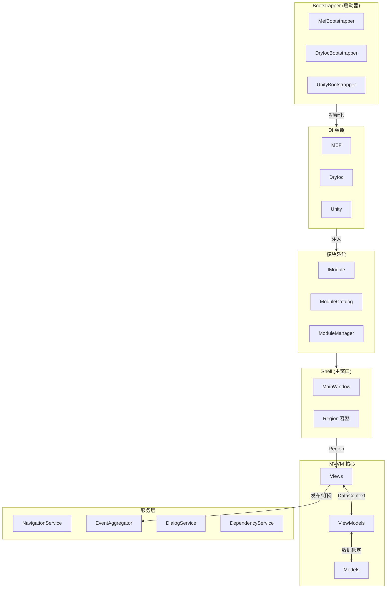
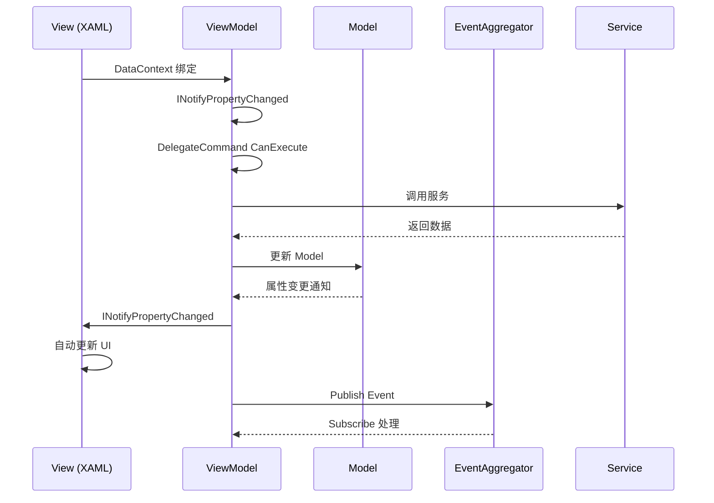
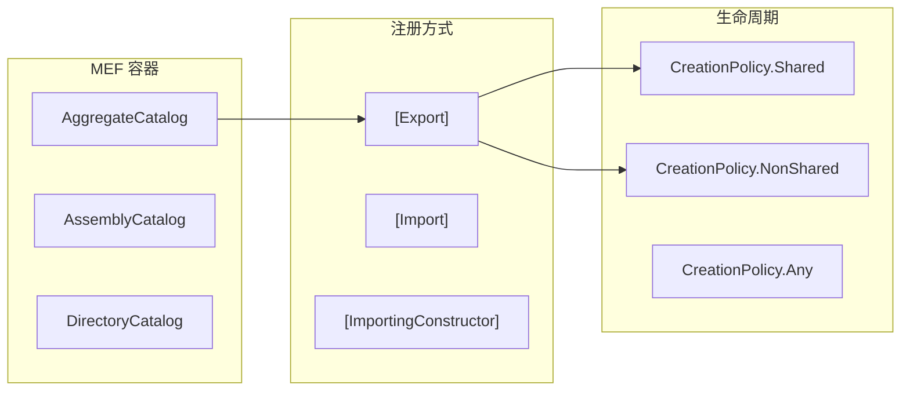
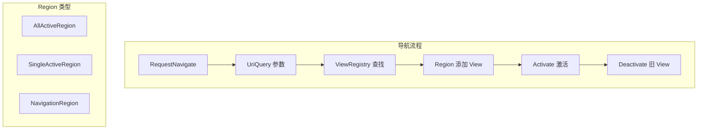
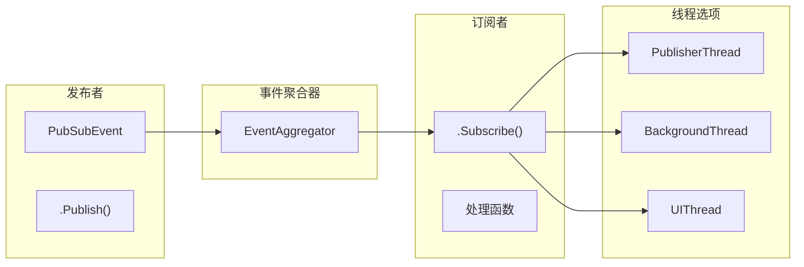
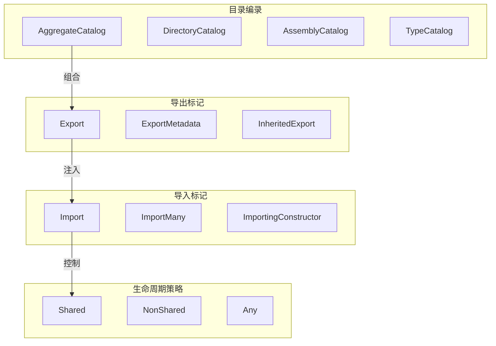
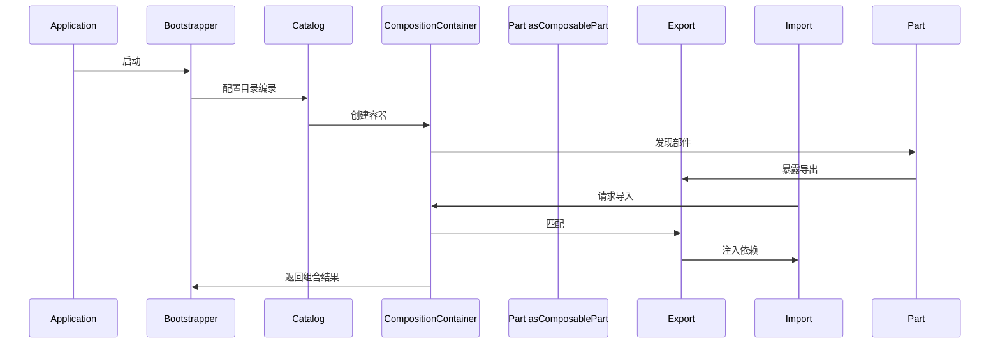
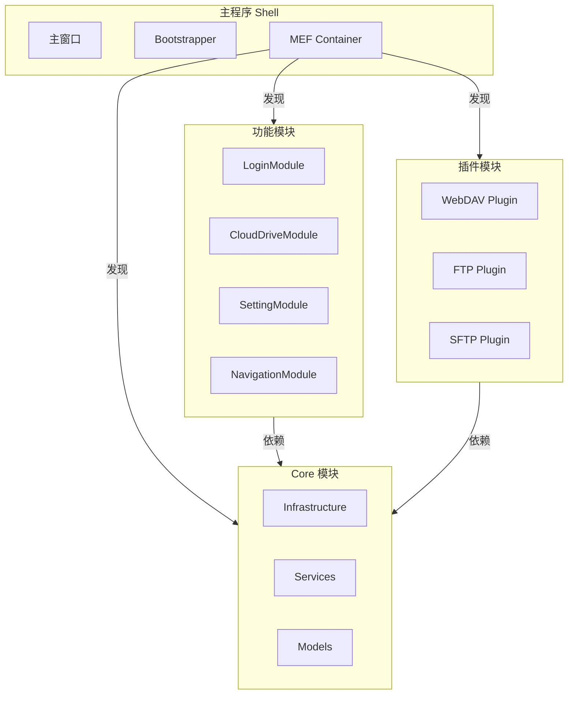
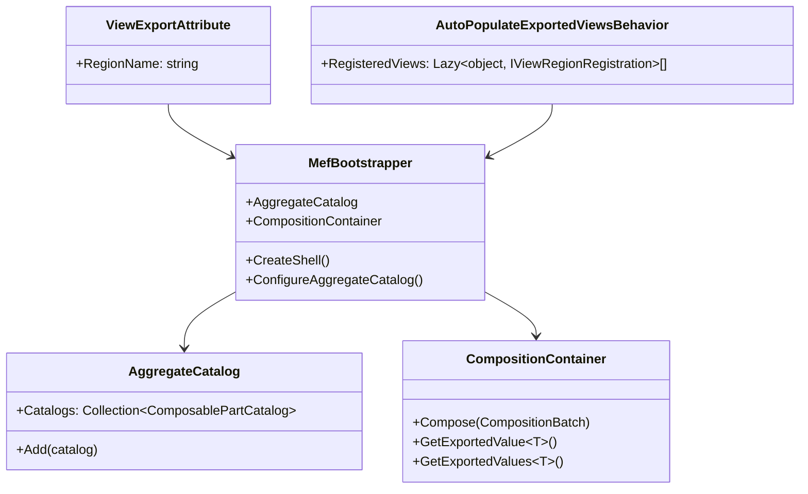

## WebDav 云盘客户端

基于 **WPF + Prism 6.2.0** 实现的 WebDAV 云存储客户端，采用 MVVM 架构模式，通过 MEF 实现模块化设计。

实现了完整的 WebDAV 操作（HTTP + HTTPS），包括对于大文件的断点续传上传与下载。

没有 WebDAV 环境的，可以连接 dav.box.com 服务进行尝试，也可以连接自己搭建的云存储，如 ownCloud。

<!-- more -->


源码地址：<a href="https://github.com/FreezeSoul/CloudDriveShell">CloudDriveShell</a>

---

## 技术架构：Prism + MEF + MVVM

在 WPF 桌面应用开发中，选择 **Prism** 作为应用框架、**MEF** 作为依赖注入容器，是一个成熟的企业级方案。

### 架构概览

```
┌─────────────────────────────────────────┐
│         CloudDriveShell                 │
│         (Main Application)              │
├─────────────────────────────────────────┤
│  Shell (Root Window)                    │
│  ├── LoginContentRegion                │
│  ├── TopNavigationRegion               │
│  └── ActionContentRegion               │
├─────────────────────────────────────────┤
│  Modules (功能模块)                     │
│  ├── LoginViewModule                   │
│  ├── TopNavigationModule               │
│  ├── CloudDriveContentModule           │
│  ├── CloudSettingContentModule         │
│  └── CloudOtherContentModule           │
├─────────────────────────────────────────┤
│  Infrastructure (基础设施)              │
│  ├── Services (IWebDavClientService)   │
│  ├── Models (ResourceItem, Account)    │
│  ├── Behaviors (Region, ViewExport)    │
│  └── Converters                        │
├─────────────────────────────────────────┤
│  DI Container (MEF)                    │
│  ├── [Import] / [Export]               │
│  ├── [ImportingConstructor]            │
│  └── ServiceLocator                    │
├─────────────────────────────────────────┤
│  Communication (EventAggregator)       │
│  ├── RefreshEvent                     │
│  ├── TransferStatusEvent               │
│  └── LoginStatusEvent                  │
└─────────────────────────────────────────┘

```

### 项目结构

```
CloudDriveShell/
├── CloudDriveShell/              # 主程序 Shell
│   ├── Bootstrapper.cs           # Prism 启动器
│   └── Shell.xaml                # 主窗口
├── CloudDriveShell.Infrastructure/  # 基础设施层
│   ├── Services/                 # 服务接口与实现
│   ├── Models/                   # 数据模型
│   ├── Behaviors/                # Region 行为
│   ├── Extension/                # Region Adapter
│   └── RegionNames.cs            # Region 名称常量
├── CloudDriveShell.LoginView/    # 登录模块
├── CloudDriveShell.TopNavigation/ # 顶部导航模块
├── CloudDriveShell.CloudDriveContent/   # 云盘内容模块
├── CloudDriveShell.CloudSettingContent/ # 设置模块
├── CloudDriveShell.CloudOtherContent/   # 其他功能模块
└── WebDAVClient/                 # WebDAV 协议实现

```

### Prism Bootstrapper 启动流程

```csharp
public class CloudDriveShellBootstrapper : MefBootstrapper
{
    protected override void ConfigureAggregateCatalog()
    {
        base.ConfigureAggregateCatalog();

        // 注册程序集到 MEF 目录
        this.AggregateCatalog.Catalogs.Add(
            new AssemblyCatalog(Assembly.GetExecutingAssembly()));
        this.AggregateCatalog.Catalogs.Add(
            new AssemblyCatalog(typeof(InfrastructureModule).Assembly));

        // 注册各功能模块
        this.AggregateCatalog.Catalogs.Add(
            new AssemblyCatalog(typeof(LoginViewModule).Assembly));
        this.AggregateCatalog.Catalogs.Add(
            new AssemblyCatalog(typeof(TopNavigationModule).Assembly));
        // ... 其他模块
    }

    protected override RegionAdapterMappings ConfigureRegionAdapterMappings()
    {
        RegionAdapterMappings mappings = base.ConfigureRegionAdapterMappings();
        // 注册自定义 Region Adapter（支持第三方控件 TransitionElement）
        mappings.RegisterMapping(typeof(TransitionElement),
            ServiceLocator.Current.GetInstance<TransitionElementAdaptor>());
        return mappings;
    }

    protected override IBehaviorFactory ConfigureDefaultRegionBehaviors()
    {
        var factory = base.ConfigureDefaultRegionBehaviors();
        // 添加自定义行为：自动发现并注册带 [Export] 标记的 View
        factory.AddIfMissing(
            typeof(AutoPopulateExportedViewsBehavior),
            "AutoPopulateExportedViewsBehavior");
        return factory;
    }

    protected override DependencyObject CreateShell()
    {
        return this.Container.GetExportedValue<Shell>();
    }

    protected override void InitializeShell()
    {
        // 先显示登录对话框
        var loginView = ServiceLocator.Current.GetInstance<IContentView>(
            RegionNames.LoginContentView);
        var loginWindow = loginView as Window;

        if (loginWindow.ShowDialog() != true)
        {
            Environment.Exit(1);
        }

        // 登录成功后显示主窗口
        Application.Current.MainWindow = this.Shell;
        this.Shell.Show();
    }
}

```

### MVVM 实现

#### ViewModel - View 连接

**View-First 模式 + MEF 属性注入**：

```csharp
[Export(RegionNames.CloudDriveContentView, typeof(IContentView))]
[PartCreationPolicy(CreationPolicy.Shared)]
public partial class CloudDriveContent : UserControl, IContentView
{
    [Import]
    private CloudDriveContentViewModel ViewModel
    {
        set
        {
            this.DataContext = value;
            this.Loaded += (sender, args) =>
            {
                value.ViewLoadedAction?.Invoke();
            };
        }
    }
}

```

**ViewModel 基类继承**：

```csharp
[Export]
[PartCreationPolicy(CreationPolicy.Shared)]
public class CloudDriveExplorerViewModel : BindableBase
{
    private readonly IEventAggregator _eventAggregator;
    private readonly IWebDavClientService _webDavClientService;
    private readonly ISwitchContentService _switchContentService;

    [ImportingConstructor]
    public CloudDriveExplorerViewModel(
        IEventAggregator eventAggregator,
        IWebDavClientService webDavClientService,
        ISwitchContentService switchContentService)
    {
        this._eventAggregator = eventAggregator;
        this._webDavClientService = webDavClientService;
        this._switchContentService = switchContentService;

        // 初始化命令
        this.RefreshCommand = new DelegateCommand(this.Refresh, this.CanRefresh);
        this.UploadCommand = new DelegateCommand(this.Upload, this.CanUpload);

        // 订阅事件
        this._eventAggregator.GetEvent<RefreshEvent>().Subscribe(this.OnRefresh);
    }

    private ObservableCollection<ResourceItem> _resourceItems;
    public ObservableCollection<ResourceItem> ResourceItems
    {
        get { return this._resourceItems; }
        set { this.SetProperty(ref this._resourceItems, value); }
    }

    public DelegateCommand RefreshCommand { get; private set; }
    public DelegateCommand UploadCommand { get; private set; }
}

```

### Region 与导航

#### Region 定义

```csharp
public static class RegionNames
{
    // 登录区域
    public const string LoginContentRegion = "LoginContentRegion";

    // 顶部导航区域
    public const string TopNavigationRegion = "TopNavigationRegion";

    // 主内容区域（使用 TransitionElement 实现过渡动画）
    public const string ActionContentRegion = "ActionContentRegion";

    // 云盘模块嵌套区域
    public const string ActionCloudDriveRightRegion = "ActionCloudDriveRightRegion";

    // 设置模块嵌套区域
    public const string ActionCloudSettingRightRegion = "ActionCloudSettingRightRegion";
}

```

#### Shell XAML 定义 Region

```xml
<Window x:Class="CloudDriveShell.Shell">
    <Grid>
        <!-- 顶部导航栏 -->
        <ContentControl prism:RegionManager.RegionName=
            "{x:Static inf:RegionNames.TopNavigationRegion}" />

        <!-- 主内容区域（支持过渡动画）-->
        <controls:TransitionElement prism:RegionManager.RegionName=
            "{x:Static inf:RegionNames.ActionContentRegion}" />
    </Grid>
</Window>

```

#### 导航服务实现

```csharp
[Export(typeof(ISwitchContentService))]
[PartCreationPolicy(CreationPolicy.Shared)]
public class SwitchContentService : ISwitchContentService
{
    [Import]
    public IRegionManager RegionManager { get; set; }

    public void SwitchContentView(string regionName, string viewKey)
    {
        IRegion region = this.RegionManager.Regions[regionName];

        // 从容器中获取指定 View
        var view = ServiceLocator.Current.GetInstance<IContentView>(viewKey);

        // 清空并激活新 View
        region.RemoveAll();
        region.Add(view);
        region.Activate(view);
    }
}

```

### 事件驱动通信 (EventAggregator)

#### 自定义事件定义

```csharp
// 全局事件
public class WindowClosingEvent : PubSubEvent<CancelEventArgs> { }
public class PasteFileEvent : PubSubEvent<string[]> { }
public class GlobalExceptionEvent : PubSubEvent<string> { }
public class SwitchuserEvent : PubSubEvent { }

// 模块间事件
public class RefreshEvent : PubSubEvent<string> { }
public class TransferStatusEvent : PubSubEvent<TransferActionInfo> { }
public class LoginStatusEvent : PubSubEvent<bool> { }
public class CreateFolderStatusEvent : PubSubEvent<bool> { }

```

#### 事件订阅

```csharp
public CloudDriveExplorerViewModel(
    IEventAggregator eventAggregator,
    /* 其他依赖 */)
{
    // 订阅刷新事件
    eventAggregator.GetEvent<RefreshEvent>().Subscribe(path =>
    {
        if (string.IsNullOrEmpty(path))
        {
            path = this.CurrentNavigateResourceItem?.ItemHref
                ?? WebDavConstant.RootPath;
        }
        this.RefreshCurrentResource(path);
    }, ThreadOption.PublisherThread, false, (path) =>
    {
        // 过滤器：只处理当前路径的刷新
        return string.IsNullOrEmpty(path) ||
               path == this.CurrentNavigateResourceItem?.ItemHref;
    });

    // 订阅传输状态事件
    eventAggregator.GetEvent<TransferStatusEvent>().Subscribe(info =>
    {
        this.ShowTransferMessage(info);
    });
}

```

#### 事件发布

```csharp
// 发布刷新事件
this._eventAggregator.GetEvent<RefreshEvent>().Publish(currentPath);

// 发布文件粘贴事件
string[] files = (string[])e.Data.GetData(DataFormats.FileDrop);
this._eventAggregator.GetEvent<PasteFileEvent>().Publish(files);

// 发布登录状态事件
this._eventAggregator.GetEvent<LoginStatusEvent>().Publish(isSuccess);

```

### 模块自动发现机制

#### ViewExportAttribute 标记

```csharp
[AttributeUsage(AttributeTargets.Class, AllowMultiple = false)]
[MetadataAttribute]
public sealed class ViewExportAttribute : ExportAttribute, IViewRegionRegistration
{
    public ViewExportAttribute(string regionName, Type contractType)
        : base(contractType)
    {
        this.RegionName = regionName;
    }

    public string RegionName { get; set; }
}

```

#### 使用示例

```csharp
[ViewExport(RegionNames.CloudDriveContentView, typeof(IContentView))]
[PartCreationPolicy(CreationPolicy.Shared)]
public partial class CloudDriveContent : UserControl, IContentView
{
    // View 实现...
}

```

#### AutoPopulateExportedViewsBehavior

```csharp
[Export(typeof(AutoPopulateExportedViewsBehavior))]
[PartCreationPolicy(CreationPolicy.NonShared)]
public class AutoPopulateExportedViewsBehavior : RegionBehavior
{
    [ImportMany(AllowRecomposition = true)]
    public Lazy<object, IViewRegionRegistration>[] RegisteredViews { get; set; }

    protected override void OnAttach()
    {
        this.AddRegisteredViews();
    }

    private void AddRegisteredViews()
    {
        foreach (var viewEntry in this.RegisteredViews)
        {
            // 匹配 RegionName 并自动注册
            if (viewEntry.Metadata.RegionName == this.Region.Name)
            {
                var view = viewEntry.Value;
                if (!this.Region.Views.Contains(view))
                {
                    this.Region.Add(view);
                }
            }
        }
    }
}

```

### 依赖注入模式

#### 构造函数注入

```csharp
[ImportingConstructor]
public CloudDriveExplorerViewModel(
    IEventAggregator eventAggregator,
    IWebDavClientService webDavClientService,
    ISwitchContentService switchContentService)
{
    // 依赖通过 MEF 自动注入
}

```

#### 属性注入

```csharp
[Import]
public IRegionManager RegionManager { get; set; }

```

#### ImportMany 集合注入

```csharp
// 导航菜单自动发现所有 INavigateMeta 实现
[ImportMany(typeof(INavigateMeta))]
private IEnumerable<Lazy<INavigateMeta>> _navigateMetaLazies;

private void LoadNavigationMenus()
{
    foreach (var navigateMeta in this._navigateMetaLazies)
    {
        var menu = navigateMeta.Value.LoadNavigateMenu();
        this.LeftMenus.Add(menu);
    }
}

```

### 自定义 Region Adapter

#### TransitionElementAdaptor

```csharp
public class TransitionElementAdaptor : RegionAdapterBase<TransitionElement>
{
    protected override void Adapt(IRegion region, TransitionElement regionTarget)
    {
        // 监听 View 变化，实现过渡动画
        region.Views.CollectionChanged += (s, e) =>
        {
            if (e.Action == NotifyCollectionChangedAction.Add)
            {
                foreach (FrameworkElement element in e.NewItems)
                {
                    regionTarget.Content = element;
                }
            }
            else if (e.Action == NotifyCollectionChangedAction.Remove)
            {
                foreach (FrameworkElement element in e.OldItems)
                {
                    regionTarget.Content = null;
                    GC.Collect(); // 显式内存回收
                }
            }
        };

        region.ActiveViews.CollectionChanged += (s, e) =>
        {
            this.Transition(regionTarget, e);
        };
    }

    protected override IRegion CreateRegion()
    {
        return new SingleActiveRegion();
    }
}

```

### 异步操作与 MVVM

#### async/await 集成

```csharp
private async void RefreshCurrentResource(string itemHref)
{
    this.NotifyMessageInfo("正在刷新文件夹，请稍后...");

    try
    {
        // 异步获取文件列表
        var resourceItems = await this._webDavClientService.GetList(itemHref);

        // 在 UI 线程更新
        this.ResourceItems.Clear();
        resourceItems.ForEach(this.ResourceItems.Add);

        this.NotifyMessageSuccess("刷新完成");
    }
    catch (Exception ex)
    {
        this._eventAggregator.GetEvent<GlobalExceptionEvent>()
            .Publish(ex.Message);
    }
}

```

### 技术要点总结

| 特性 | 实现方案 |
|------|----------|
| **MVVM 框架** | Prism 6.2.0 |
| **DI 容器** | MEF (Managed Extensibility Framework) |
| **ViewModel 基类** | Prism `BindableBase` |
| **命令** | Prism `DelegateCommand` |
| **模块化** | MEF 目录 + 自动发现 |
| **Region 导航** | 自定义 `SwitchContentService` |
| **模块通信** | Prism `EventAggregator` |
| **视图过渡** | 自定义 `TransitionElementAdaptor` |
| **异步操作** | async/await |
| **日志** | Enterprise Library |

### 架构优势

1. **松耦合**：模块间通过接口和事件通信，互不依赖
2. **可扩展**：新增模块只需添加 `[Export]` 标记，无需修改核心代码
3. **可测试**：依赖注入便于单元测试
4. **动态发现**：导航菜单自动发现所有 `INavigateMeta` 实现
5. **内存管理**：显式视图生命周期控制和 GC 调用

这套架构在WPF中算是一个比较成熟的企业级应用解决方案，通过 Prism 的 MVVM 模式和 MEF 的组合能力，实现了代码的可维护性和可扩展性。

深入理解 Prism 框架的设计理念和 MEF 依赖注入机制，有助于更好地掌握桌面应用开发的最佳实践，下面结合项目实践详细介绍其架构体系。

---

## Prism MVVM 框架架构体系

### 整体架构



### MVVM 交互模式



### Prism 依赖注入



### Region 导航流程



### EventAggregator 事件机制



---

## MEF 依赖注入容器

MEF（Managed Extensibility Framework）是 .NET 平台的依赖注入和插件系统，天然支持模块化应用开发。上述项目正是基于 MEF 实现依赖注入和模块自动发现，下面结合项目实践详细介绍其核心概念。

### MEF 核心概念



### MEF 组合流程



### 模块化架构



### MEF + Prism 集成



Prism 与 MEF 的结合为 WPF 应用提供了强大的模块化能力，通过声明式的 `[Export]` 和 `[Import]` 标记，配合 Prism 的 Region 导航和 EventAggregator 事件机制，可以构建出高内聚、低耦合的企业级桌面应用。
