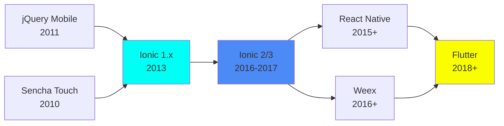

## 引言：一个前端开发者的移动应用之路

作为熟知前端技术的开发者，我的跨平台移动应用开发始于 2013 年左右。回顾这段技术演进历程，不仅是工具链的变化，更是整个混合应用技术生态发展的缩影。

```
2012: Sencha Touch (大屏控制端)
       ↓
2016: Ionic (游戏类 App)
       ↓
接着: 多个 Ionic 项目上架 iOS
       ↓
后续: Flutter DataColour 可视化 App

当然过程中也尝试过一些原生应用的开发，不过本文重点还是以混合应用为主。
```

**Sencha Touch 时代 (2012)**：当时开发了一个大屏控制端 H5 应用，通过渲染截屏传送 + WebSocket 通信控制大屏交互，实现命令传递的双向控制。那时的 H5 App 技术还处于早期探索阶段，也踩过很多坑。

**Ionic 时代 (2016)**：我开始接手游戏类混合应用项目，面对多设备快速发布的需求，Ionic 成为了理想的选择。项目成功上架 iOS App Store，后续也实践了多个 Ionic 项目。

**Flutter 探索**：技术迭代出新，后来又开发了 DataColour 可视化 App，采用了Flutter的技术方案，探索移动端跨设备的新方向。

---

## 混合应用技术演进史

### 早期 H5 App 技术

**PhoneGap / Cordova 起源**：PhoneGap 由 Nitobi 创建，后捐赠给 Apache。2011 年成为 Apache 顶级项目，更名为 Cordova。其核心思想是：Web 技术 + Native 容器，让前端开发者能够用熟悉的技术开发移动应用。

**早期框架对比**：
- **jQuery Mobile** (2011): 简单易用，但性能一般，适合简单应用
- **Sencha Touch** (2010): 类似 ExtJS 的组件化开发，功能强大但过于重量级
- **Ionic 1.x** (2013-2014): 基于 AngularJS，CSS 动画出色，UI 设计美观



### 2017 年的技术格局

2017 年时，跨平台移动开发领域已经形成了多足鼎立的格局：

| 框架 | 技术栈 | 特点 | 适用场景 |
|------|--------|------|----------|
| **Ionic 2/3** | Angular 2/4 + TypeScript | Web 技术栈，UI 美观 | 企业应用、内容展示 |
| **React Native** | React + JavaScript | 原生组件，性能好 | 高性能应用 |
| **Weex** | Vue.js | 阿里开源，国内活跃 | 电商类应用 |
| **Sencha Touch** | ExtJS | 组件丰富，但过重 | 老项目维护 |

每种技术都有其独特的优势和适用场景。作为前端开发者，Ionic 的 Web 技术栈亲和性使其成为我的首选。

---

## Ionic 技术栈深度解析

### Ionic 3.0 新特性（2017年4月）

2017年4月，Ionic 3.0 正式发布，带来了一系列重要改进：

**Angular 4 兼容**：Ionic 3.0 全面支持 Angular 4，带来更小的应用体积、更快的渲染性能和改进的变更检测机制。

**Lazy Loading（懒加载）**：这是 Ionic 3.0 最重要的性能优化特性：

```typescript
// 3.0 之前：全量加载
@NgModule({
  declarations: [MyPage, OtherPage, AnotherPage]
})

// 3.0 之后：按需加载
@IonicPage({
  segment: 'my-page',
  name: 'MyPage'
})
@Component({
  template: '...'
})
export class MyPage {}
```

懒加载策略使初始加载时间从 6-30 秒降至 1-3 秒，通过分块加载显著提升了用户体验。

**RTL（从右到左）支持**：新增对阿拉伯语、希伯来语等从右到左书写语言的支持，扩大了应用的国际化能力。

### Ionic 核心架构

Ionic 的分层架构设计是其成功的关键：

```
┌─────────────────────────────────────────┐
│          Ionic Application               │
├─────────────────────────────────────────┤
│  UI Components (Buttons, Cards, Lists)  │
│  ├── ion-header                          │
│  ├── ion-content                         │
│  ├── ion-footer                          │
│  └── ... (100+ 组件)                     │
├─────────────────────────────────────────┤
│  Angular / TypeScript                    │
│  ├── Modules (懒加载模块)                │
│  ├── Services                            │
│  └── Pipes                               │
├─────────────────────────────────────────┤
│  Ionic Native                           │
│  └── Cordova Plugin Wrappers            │
├─────────────────────────────────────────┤
│  Apache Cordova                          │
│  └── Native Plugin Bridge               │
├─────────────────────────────────────────┤
│  Native Platform                        │
│  Android | iOS | Windows                │
└─────────────────────────────────────────┘
```

这种分层设计使得开发者可以专注于应用逻辑，而由框架处理平台差异。

### 开发工具链

Ionic 提供了完善的 CLI 工具，简化开发流程：

```bash
# 安装 Ionic CLI
npm install -g ionic@3.20.0 cordova

# 创建项目
ionic start myApp blank --type=ionic-angular

# 添加平台
ionic cordova platform add android
ionic cordova platform add ios

# 开发调试
ionic lab         # 浏览器调试
ionic cordova run android --device
```

---

## Cordova 插件系统深度剖析

### 插件生态系统

**Ionic Native** 是对 Cordova 插件的 TypeScript 封装层，提供了 Promise 风格的 API 和类型安全保障。

**2017 年常用插件**：

| 插件 | 功能 | 使用场景 |
|------|------|----------|
| **Camera** | 相机/相册 | 头像上传、拍照功能 |
| **Geolocation** | 定位 | LBS 应用 |
| **Barcode Scanner** | 扫码 | 二维码扫描 |
| **Push** | 推送通知 | 消息推送 |
| **Splash Screen** | 启动屏 | 应用启动体验 |
| **Status Bar** | 状态栏 | UI 定制 |
| **Network** | 网络状态 | 离线检测 |
| **File** | 文件操作 | 文件上传/下载 |
| **SQLite** | 本地数据库 | 离线存储 |
| **WeChat/Alipay** | 第三方支付/分享 | 社交功能 |

### 自定义插件开发

当现有插件无法满足需求时，开发者可以创建自定义插件。

**插件结构**：

```
my-plugin/
├── plugin.xml           # 插件配置
├── src/
│   ├── android/         # Android 原生代码
│   │   └── MyPlugin.java
│   └── ios/             # iOS 原生代码
│       └── MyPlugin.m
└── www/
    └── MyPlugin.js      # JS 接口
```

**创建自定义插件**：

```bash
# 使用 plugman 创建
npm install -g plugman
plugman create --name MyPlugin --plugin_id com.example.myplugin --plugin_version 1.0.0
```

**plugin.xml 配置**：

```xml
<?xml version="1.0" encoding="UTF-8"?>
<plugin xmlns="http://apache.org/cordova/ns/plugins/1.0"
        id="com.example.myplugin" version="1.0.0">
  <name>MyPlugin</name>
  <description>自定义插件示例</description>

  <js-module src="www/MyPlugin.js" name="MyPlugin">
    <clobbers target="cordova.plugins.MyPlugin" />
  </js-module>

  <platform name="android">
    <config-file target="res/xml/config.xml" parent="/*">
      <feature name="MyPlugin">
        <param name="android-package" value="com.example.MyPlugin"/>
      </feature>
    </config-file>
    <source-file src="src/android/MyPlugin.java" target-dir="src/com/example/" />
  </platform>
</plugin>
```

**Android 实现**：

```java
package com.example;

import org.apache.cordova.CordovaPlugin;
import org.apache.cordova.CallbackContext;
import org.json.JSONArray;
import org.json.JSONException;

public class MyPlugin extends CordovaPlugin {
  @Override
  public boolean execute(String action, JSONArray args, CallbackContext callbackContext)
      throws JSONException {
    if (action.equals("coolMethod")) {
      String message = args.getString(0);
      this.coolMethod(message, callbackContext);
      return true;
    }
    return false;
  }

  private void coolMethod(String message, CallbackContext callbackContext) {
    if (message != null && message.length() > 0) {
      callbackContext.success("返回: " + message);
    } else {
      callbackContext.error("参数为空");
    }
  }
}
```

**iOS 实现**：

```objectivec
#import <Cordova/CDV.h>
#import "MyPlugin.h"

@implementation MyPlugin

- (void)coolMethod:(CDVInvokedUrlCommand*)command {
  CDVPluginResult* pluginResult = nil;
  NSString* message = [command.arguments objectAtIndex:0];

  if (message != nil && [message length] > 0) {
    pluginResult = [CDVPluginResult resultWithStatus:CDVCommandStatus_OK
                                     messageAsString:[NSString stringWithFormat:@"返回: %@", message]];
  } else {
    pluginResult = [CDVPluginResult resultWithStatus:CDVCommandStatus_ERROR
                                     messageAsString:@"参数为空"];
  }

  [self.commandDelegate sendPluginResult:pluginResult callbackId:command.callbackId];
}

@end
```

### 使用 Ionic Native 封装

创建 Ionic Native 封装可以让插件更好地融入 Ionic 生态：

```typescript
// 创建 Ionic Native 封装
import { Plugin, Cordova, IonicNativePlugin } from '@ionic-native/core';

@Plugin({
  pluginName: 'MyPlugin',
  plugin: 'com.example.myplugin',
  pluginRef: 'cordova.plugins.MyPlugin'
})
export class MyPlugin extends IonicNativePlugin {
  @Cordova()
  coolMethod(message: string): Promise<string> {
    return;
  }
}

// 在模块中提供
@NgModule({
  providers: [MyPlugin]
})
export class AppModule {}

// 在页面中使用
constructor(private myPlugin: MyPlugin) {}

async testPlugin() {
  try {
    const result = await this.myPlugin.coolMethod('Hello Plugin');
    console.log(result);
  } catch (error) {
    console.error(error);
  }
}
```

---

## 多渠道打包与发布

### Android 多渠道打包

**配置 build.json**：

```json
{
  "android": {
    "debug": {
      "keystore": "debug.keystore",
      "storePassword": "android",
      "alias": "androiddebugkey",
      "password": "android",
      "keystoreType": ""
    },
    "release": {
      "keystore": "release.keystore",
      "storePassword": "********",
      "alias": "release",
      "password": "********",
      "keystoreType": ""
    }
  }
}
```

**使用 Android Studio 打包**：

```bash
# 生成 gradle 文件
ionic cordova build android --release

# 在 Android Studio 中：
# 1. 打开 platforms/android
# 2. Build -> Generate Signed APK
# 3. 选择 keystore 和构建变体
```

**友盟多渠道配置**：

```xml
<!-- AndroidManifest.xml -->
<meta-data
    android:name="UMENG_CHANNEL"
    android:value="${CHANNEL_VALUE}" />
```

```groovy
// build.gradle
android {
    productFlavors {
        xiaomi {}
        baidu {}
        yingyongbao {}
    }

    productFlavors.all { flavor ->
        flavor.manifestPlaceholders = [CHANNEL_VALUE: name]
    }
}
```

### iOS 打包发布

**证书配置**：

```bash
# 添加 iOS 平台
ionic cordova platform add ios

# 配置签名
# 1. 登录 Apple Developer 账号
# 2. 创建 App ID
# 3. 创建 Provisioning Profile
# 4. 配置 Xcode 签名
```

**使用 Xcode 打包**：

1. 打开 `platforms/ios/MyApp.xcworkspace`
2. 选择 Generic iOS Device
3. Product -> Archive
4. 在 Organizer 中发布到 App Store

**Application Loader 发布**：

1. 构建 Archive
2. 导出 IPA 文件
3. 使用 Application Loader 上传

### 版本更新策略

**Code Push 热更新**：

```typescript
import { CodePush } from '@ionic-native/code-push';

@NgModule({
  declarations: [AppComponent],
  imports: [IonicModule.forRoot(AppComponent)],
  bootstrap: [IonicApp],
  entryComponents: [AppComponent],
  providers: [
    { provide: ErrorHandler, useClass: IonicErrorHandler },
    CodePush
  ]
})
export class AppModule {}

// 检查更新
constructor(private codePush: CodePush) {}

ionViewDidLoad() {
  this.codePush.sync().subscribe((status) => {
    console.log('更新状态', status);
  });
}
```

---

## 技术对比：Ionic vs React Native vs Weex

### 架构对比

| 特性 | Ionic | React Native | Weex |
|------|-------|--------------|------|
| **渲染方式** | WebView | 原生组件 | 原生组件 |
| **技术栈** | Angular + TS | React + JS | Vue + JS |
| **学习曲线** | 前端友好 | 需要了解原生 | 前端友好 |
| **性能** | 中等 | 接近原生 | 接近原生 |
| **UI 一致性** | 完全一致 | 需适配 | 需适配 |
| **插件生态** | Cordova 丰富 | 较少 | 阿里系 |
| **热更新** | 支持 | 困难 | 支持 |

### 适用场景

**Ionic 适合**：
- ✅ 企业应用/内容展示
- ✅ 快速原型开发
- ✅ 前端团队转型
- ✅ 预算有限的项目

**React Native 适合**：
- ✅ 高性能要求
- ✅ 已有 React 技术栈
- ✅ 复杂交互应用

**Weex 适合**：
- ✅ 电商类应用
- ✅ 阿里生态项目
- ✅ Vue 技术栈团队

---

## Ionic 2 游戏应用开发实践

### 动画组件设计

游戏类应用通常需要丰富的动画效果。Ionic 2 中可以使用 CSS 动画和组件组合实现：

**动画元素组件**：

```typescript
@Component({
    selector: 'animation-elements',
    template: `
    <div class="animation-container">
        <city-sky-wheel></city-sky-wheel>
        <blue-fly-balloon></blue-fly-balloon>
        <city-building></city-building>
        <red-fly-balloon></red-fly-balloon>
        <city-flight></city-flight>
        <city-trees></city-trees>
        <city-cloud></city-cloud>
        <map-cloud></map-cloud>
        <city-train></city-train>
        <city-bus></city-bus>
        <city-car></city-car>
    </div>`,
    changeDetection: ChangeDetectionStrategy.OnPush
})
export class AnimationElementsComponent {
    constructor() {}
}
```

**使用 OnPush 变更检测策略**：

```typescript
@Component({
  selector: 'page-home',
  templateUrl: 'home.html',
  changeDetection: ChangeDetectionStrategy.OnPush
})
export class HomePage {
  // OnPush 策略减少不必要的变更检测，提升性能
}
```

### 音频服务

游戏应用需要频繁的音效播放：

```typescript
@Injectable()
export class AudioPlayerService {
    constructor(
        private _nativeAudio: NativeAudio,
        private _appGlobalsService: AppGlobalsService,
    ) {}

    init() {
        // 预加载所有音效资源
        _.each(this._appGlobalsService.AUDIO_RESOURCES, obj => {
            this._nativeAudio.preloadComplex(obj.KEY, obj.PATH, 1, 1, 0);
        });
    }

    play(key: string) {
        if (!this._appGlobalsService.SESSION.soundEffectDisable) {
            this._nativeAudio.play(key);
        }
    }

    loop(key: string) {
        if (!this._appGlobalsService.SESSION.soundEffectDisable) {
            this._nativeAudio.loop(key);
        }
    }

    stop(key: string) {
        this._nativeAudio.stop(key);
    }
}
```

### 事件总线通信

使用 Ionic Events 实现跨组件通信：

```typescript
// 发布事件
this._events.publish('Notice_Main_Add', {
    chattype: NoticeCountType.WaBao,
    message: 'New message'
});

// 订阅事件
this._events.subscribe('Notice_Main_Add', (res) => {
    switch (res.chattype) {
        case NoticeCountType.WaBao:
            this.waBaoMsgCount += 1;
            break;
        case NoticeCountType.MaiBao:
            this.maiBaoMsgCount += 1;
            break;
    }
});
```

### 原生地图集成

```typescript
@Injectable()
export class BaiduMapService {
    private map: any;

    initMap(mapElement: HTMLElement) {
        this.map = new BMap.Map(mapElement);
        this.map.centerAndZoom(new BMap.Point(116.404, 39.915), 12);

        // 添加地图控件
        this.map.addControl(new BMap.NavigationControl());
        this.map.addControl(new BMap.ScaleControl());
    }

    addMarker(point: BMap.Point, options: any) {
        const marker = new BMap.Marker(point);
        this.map.addOverlay(marker);
        return marker;
    }
}
```

---

## Ionic 3 技术栈详解

### 项目结构

```
ionic-app/
├── src/
│   ├── app/
│   │   ├── app.component.ts       # 根组件
│   │   ├── app.module.ts          # 根模块
│   │   ├── app.html               # 根模板
│   │   └── main.ts                # 应用入口
│   ├── assets/                    # 静态资源
│   ├── pages/                     # 页面组件
│   │   ├── home/
│   │   ├── list/
│   │   └── detail/
│   └── providers/                 # 服务层
├── config.xml                     # Cordova 配置
├── ionic.config.json              # Ionic 配置
└── package.json                   # npm 依赖
```

### 核心依赖

```json
{
  "dependencies": {
    "@angular/common": "5.0.3",
    "@angular/compiler": "5.0.3",
    "@angular/core": "5.0.3",
    "@angular/forms": "5.0.3",
    "@angular/http": "5.0.3",
    "@angular/platform-browser": "5.0.3",
    "ionic-angular": "3.9.2",
    "rxjs": "5.5.11",
    "zone.js": "0.8.26"
  }
}
```

### 生命周期钩子

```typescript
import { Component, OnInit } from '@angular/core';

@Component({
  selector: 'page-home',
  templateUrl: 'home.html'
})
export class HomePage implements OnInit {

  constructor() { }

  ngOnInit() {
    console.log('组件初始化完成');
  }

  ionViewDidLoad() {
    console.log('页面加载完成');
  }

  ionViewWillEnter() {
    console.log('页面即将进入');
  }

  ionViewDidEnter() {
    console.log('页面已进入');
  }

  ionViewWillLeave() {
    console.log('页面即将离开');
  }

  ionViewDidLeave() {
    console.log('页面已离开');
  }

  ionViewWillUnload() {
    console.log('页面即将销毁');
  }
}
```

### 导航控制

```typescript
import { NavController } from 'ionic-angular';

export class HomePage {
  constructor(public navCtrl: NavController) { }

  // 推入新页面
  goToDetail() {
    this.navCtrl.push(DetailPage, {
      id: 1,
      name: 'Item'
    });
  }

  // 返回上一页
  goBack() {
    this.navCtrl.pop();
  }

  // 设置根页面
  setRoot() {
    this.navCtrl.setRoot(HomePage);
  }
}
```

### 原生插件使用

**安装插件**：
```bash
ionic cordova plugin add cordova-plugin-camera
npm install --save @ionic-native/camera
```

**使用示例**：
```typescript
import { Camera, CameraOptions } from '@ionic-native/camera';

export class PhotoPage {
  constructor(private camera: Camera) { }

  takePicture() {
    const options: CameraOptions = {
      quality: 100,
      destinationType: this.camera.DestinationType.FILE_URI,
      encodingType: this.camera.EncodingType.JPEG,
      mediaType: this.camera.MediaType.PICTURE
    };

    this.camera.getPicture(options).then(
      (imageData) => {
        let base64Image = 'data:image/jpeg;base64,' + imageData;
      },
      (err) => {
        console.error('拍照失败', err);
      }
    );
  }
}
```

---

## 混合应用开发实践

### 常见问题与解决方案

**1. 白屏问题**

```typescript
// main.ts - 启用生产模式
import { enableProdMode } from '@angular/core';

enableProdMode();
```

**2. 跨域问题**

```xml
<!-- config.xml -->
<allow-navigation href="*" />
<allow-intent href="*" />
```

**3. 性能优化**

```typescript
// 使用虚拟滚动
<ion-virtual-scroll [items]="items">
  <div *ngFor="let item of items">
    {{ item.name }}
  </div>
</ion-virtual-scroll>
```

### 打包与发布

**Android 打包**：
```bash
ionic cordova build android --release

# 签名
jarsigner -verbose -sigalg SHA1withRSA -digestalg SHA1 \
  -keystore my-release-key.keystore \
  platforms/android/app/build/outputs/apk/release/app-release-unsigned.apk \
  alias_name

# 优化
zipalign -v 4 \
  platforms/android/app/build/outputs/apk/release/app-release-unsigned.apk \
  app-release.apk
```

**iOS 打包**：
```bash
ionic cordova build ios
# 在 Xcode 中打开项目进行签名和发布
```

---

## 新兴技术：Flutter（2017）

2017 年，Google 推出了 Flutter 框架，这是一个基于 Dart 语言的跨平台 UI 框架，采用自绘引擎模式。

### Flutter 的技术特点

**自绘引擎**：

```dart
import 'package:flutter/material.dart';

void main() {
  runApp(MyApp());
}

class MyApp extends StatelessWidget {
  @override
  Widget build(BuildContext context) {
    return MaterialApp(
      title: 'Flutter Demo',
      theme: ThemeData(
        primarySwatch: Colors.blue,
      ),
      home: MyHomePage(),
    );
  }
}
```

**热重载开发体验**：

```dart
class MyHomePage extends StatelessWidget {
  @override
  Widget build(BuildContext context) {
    return Scaffold(
      appBar: AppBar(
        title: Text('Flutter Demo'),
      ),
      body: Center(
        child: Text('Hello Flutter'),
      ),
    );
  }
}
```

**渐变色卡片设计**：

```dart
Container(
  decoration: BoxDecoration(
    gradient: LinearGradient(
      colors: [HexColor('#4facfe'), HexColor('#00f2fe').withAlpha(200)],
      begin: Alignment.topLeft,
      end: Alignment.bottomRight
    ),
    borderRadius: BorderRadius.circular(8.0),
    boxShadow: [
      BoxShadow(
        color: Colors.grey.withOpacity(0.6),
        offset: Offset(1.1, 1.1),
        blurRadius: 10.0,
      ),
    ],
  ),
  child: Padding(
    padding: EdgeInsets.all(16.0),
    child: Column(
      children: [
        Text('Project Name'),
        Text('Project Description'),
      ],
    ),
  ),
)
```

**WebView 集成**：

```dart
import 'package:webview_flutter/webview_flutter.dart';

class DashboardView extends StatefulWidget {
  final String url;
  final String title;

  @override
  Widget build(BuildContext context) {
    return Scaffold(
      appBar: AppBar(
        title: Text(widget.title),
      ),
      body: WebView(
        initialUrl: widget.url,
        javascriptMode: JavascriptMode.unrestricted,
        onWebViewCreated: (controller) {
          // WebView 创建完成
        },
      ),
    );
  }
}
```

### 状态管理

```dart
class ProjectModel {
  final String name;
  final String intro;
  final String createTime;
  final String createUser;
  final String icon;

  ProjectModel({
    required this.name,
    required this.intro,
    required this.createTime,
    required this.createUser,
    required this.icon,
  });

  factory ProjectModel.fromJson(Map<String, dynamic> json) {
    return ProjectModel(
      name: json['name'],
      intro: json['intro'],
      createTime: json['createTime'],
      createUser: json['createUser'],
      icon: json['icon'],
    );
  }
}
```

### 技术对比（2017年视角）

| 特性 | Ionic / Cordova | Flutter (Beta) |
|------|-------------------|----------------|
| **渲染方式** | WebView | 自绘引擎 |
| **语言** | TypeScript / JavaScript | Dart |
| **性能** | 受限于 WebView | 接近原生 |
| **UI 一致性** | 依赖平台差异 | 完全一致 |
| **热重载** | 支持 | 支持 |
| **成熟度** | 成熟稳定 | Beta 阶段 |
| **学习曲线** | 前端友好 | 需学习 Dart |
| **生态** | 丰富的插件库 | 快速发展中 |

---

**参考资料**：
- [Ionic Framework Documentation](https://ionicframework.com/docs/)
- [Apache Cordova Documentation](https://cordova.apache.org/docs/)
- [Ionic 3.0 发布公告](https://ionic.io/blog/ionic-3-0-has-arrived)
- [Angular 5 文档](https://angular.io/docs)
- [Flutter 官方网站](https://flutter.dev/)
