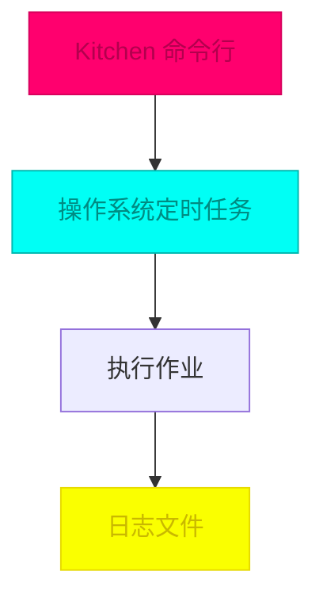

## 引言：Kettle 与企业数据集成

**Kettle**（Kettle Extraction Transportation Transformation Load），现称为 **Pentaho Data Integration**，是开源领域最著名的 ETL（Extract-Transform-Load）工具之一。作为数据处理引擎，它在企业数据仓库、数据集成、数据清洗等场景中扮演着重要角色。

### Kettle 的核心组件

Kettle 提供了一套完整的数据集成解决方案：

| 组件 | 功能 | 使用场景 |
|------|------|----------|
| **Spoon** | 图形化设计器 | 设计转换（Transformation）和作业（Job） |
| **Kitchen** | 作业执行引擎 | 命令行方式执行作业 |
| **Pan** | 转换执行引擎 | 命令行方式执行转换 |
| **Carte** | Web 服务容器 | 提供远程执行能力 |
| **Encr** | 密码加密工具 | 保护敏感信息 |

### 传统使用方式

```
┌─────────────────────────────────────────────────────┐
│              Kettle 传统使用模式                     │
├─────────────────────────────────────────────────────┤
│                                                     │
│  1. 设计阶段                                        │
│  ┌──────────────┐                                  │
│  │   Spoon      │ ──→ 设计转换/作业                 │
│  │  (GUI客户端) │                                  │
│  └──────────────┘                                  │
│         │                                           │
│         ▼                                           │
│  ┌──────────────┐                                  │
│  │  资源库      │ ──→ 存储到 DB 或文件             │
│  │ (Repository) │                                  │
│  └──────────────┘                                  │
│                                                     │
│  2. 执行阶段                                        │
│  ┌──────────────┐     ┌──────────────┐            │
│  │   Kitchen    │     │    Pan       │            │
│  │  (作业执行)   │     │  (转换执行)   │            │
│  └──────────────┘     └──────────────┘            │
│         │                     │                     │
│         └─────────┬───────────┘                     │
│                   ▼                                 │
│            从资源库读取并执行                        │
│                                                     │
└─────────────────────────────────────────────────────┘
```

---

## 桌面客户端的痛点

在实际的企业应用中，传统的 Kettle 桌面客户端模式存在以下局限性：

### 1. 部署和访问限制

| 问题 | 描述 | 影响 |
|------|------|------|
| **本地安装依赖** | Spoon 是 Java 桌面应用，需要本地安装 Java 运行环境 | 运维成本高，跨平台兼容性问题 |
| **资源库访问限制** | 需要配置数据库连接，网络环境要求高 | 远程协作困难 |
| **版本一致性** | 不同客户端版本可能存在兼容性问题 | 团队协作效率降低 |

### 2. 调度和监控能力不足



**传统调度方式的问题**：
- 依赖操作系统定时任务（crontab、Windows Task Scheduler）
- 执行状态分散在各个节点
- 缺乏统一的监控界面
- 失败重试机制需要手动实现
- 多节点调度协调困难

### 3. 企业级集成挑战

```
┌─────────────────────────────────────────────────────┐
│            企业级应用集成挑战                        │
├─────────────────────────────────────────────────────┤
│                                                     │
│  ❌ 无法与现有权限系统集成                          │
│  ❌ 缺乏审计日志和操作追踪                          │
│  ❌ 难以实现细粒度的权限控制                        │
│  ❌ 多租户场景支持不足                              │
│  ❌ API 集成能力有限                                │
│  ❌ 无法嵌入现有管理系统                            │
│                                                     │
└─────────────────────────────────────────────────────┘
```

---

## Web 化解决方案：数据集成平台

为解决上述问题，基于 Kettle 的 Java API 构建了一套 Web 版本的数据集成平台，实现了以下核心能力：

### 系统架构

```
┌─────────────────────────────────────────────────────────────────┐
│                      数据集成平台架构                            │
├─────────────────────────────────────────────────────────────────┤
│                                                                 │
│  ┌─────────────────────────────────────────────────────────┐   │
│  │                 前端层 (Angular 5)                     │   │
│  │  ┌────────────┬────────────┬──────────────────────┐   │   │
│  │  │ 作业设计器   │  调度管理   │    监控面板          │   │   │
│  │  └────────────┴────────────┴──────────────────────┘   │   │
│  └────────────────────┬────────────────────────────────┘   │
│                       │ HTTP/JSON                            │
│  ┌────────────────────▼────────────────────────────────┐   │
│  │                  API 网关层                          │   │
│  └────────────────────┬────────────────────────────────┘   │
│                       │ Dubbo RPC                           │
│  ┌────────────────────▼────────────────────────────────┐   │
│  │              服务注册中心 (ZooKeeper)               │   │
│  │  ┌──────────────────────────────────────────────┐   │   │
│  │  │  服务发现 & 负载均衡                          │   │   │
│  │  │  • di-job-service (作业管理服务)             │   │   │
│  │  │  • di-kettle-service (Kettle 执行服务)       │   │   │
│  │  └──────────────────────────────────────────────┘   │   │
│  └────────────────────┬────────────────────────────────┘   │
│                       │                                     │
│  ┌────────────────────▼────────────────────────────────┐   │
│  │                 微服务层 (Spring Boot)              │   │
│  │  ┌──────────────────┐  ┌──────────────────┐        │   │
│  │  │  Job Service     │  │ Kettle Service   │        │   │
│  │  │  • 作业 CRUD      │  │  • 作业执行       │        │   │
│  │  │  • 调度配置       │  │  • 进度监控       │        │   │
│  │  │  • Quartz 调度   │  │  • 日志收集       │        │   │
│  │  └──────────────────┘  └──────────────────┘        │   │
│  └────────────────────┬────────────────────────────────┘   │
│                       │                                     │
│  ┌────────────────────▼────────────────────────────────┐   │
│  │                  数据层                             │   │
│  │  ┌──────────────────┐  ┌──────────────────┐        │   │
│  │  │  MySQL           │  │ Kettle 资源库     │        │   │
│  │  │  (元数据)         │  │  (作业定义)       │        │   │
│  │  └──────────────────┘  └──────────────────┘        │   │
│  └───────────────────────────────────────────────────┘   │
│                                                             │
└─────────────────────────────────────────────────────────────┘
```

---

## 核心技术实现

### 1. 作业管理服务（Job Service）

基于 Spring Boot + MyBatis Plus 实现作业的元数据管理和调度配置。

#### 作业实体定义

```java
/**
 * 数据集成作业实体
 */
@Data
@TableName("di_job")
public class DiJob {
    /**
     * 作业主键ID
     */
    @TableId(value = "id", type = IdType.AUTO)
    private Long id;

    /**
     * 作业名称
     */
    @NotBlank(message = "作业名称不能为空")
    private String jobName;

    /**
     * 作业类型：TRANSFORMATION(转换) / JOB(作业)
     */
    private String jobType;

    /**
     * Kettle 资源库中的路径
     */
    private String repositoryPath;

    /**
     * 调度表达式 (Cron)
     */
    private String cronExpression;

    /**
     * 作业状态：0-禁用, 1-启用, 2-运行中
     */
    private Integer status;

    /**
     * 创建时间
     */
    private Date createTime;

    /**
     * 更新时间
     */
    private Date updateTime;
}
```

#### REST API 设计

```java
/**
 * 数据集成作业控制器
 */
@RestController
@RequestMapping("/api/di/job")
public class DiJobController {

    @Autowired
    private DiJobService diJobService;

    /**
     * 分页查询作业列表
     */
    @GetMapping("/page")
    public Result<Page<DiJob>> page(
            @RequestParam(defaultValue = "1") Integer current,
            @RequestParam(defaultValue = "10") Integer size,
            DiJob query) {
        Page<DiJob> page = diJobService.page(
            new Page<>(current, size),
            new QueryWrapper<DiJob>()
                .like(StringUtils.isNotBlank(query.getJobName()),
                      "job_name", query.getJobName())
                .eq(query.getStatus() != null, "status", query.getStatus())
                .orderByDesc("create_time")
        );
        return Result.success(page);
    }

    /**
     * 创建作业
     */
    @PostMapping
    public Result<DiJob> create(@Valid @RequestBody DiJob diJob) {
        diJob.setCreateTime(new Date());
        diJob.setStatus(0); // 默认禁用状态
        diJobService.save(diJob);
        return Result.success(diJob);
    }

    /**
     * 启动作业调度
     */
    @PostMapping("/{id}/start")
    public Result<Void> startJob(@PathVariable Long id) {
        diJobService.startSchedule(id);
        return Result.success();
    }

    /**
     * 停止作业调度
     */
    @PostMapping("/{id}/stop")
    public Result<Void> stopJob(@PathVariable Long id) {
        diJobService.stopSchedule(id);
        return Result.success();
    }

    /**
     * 立即执行作业
     */
    @PostMapping("/{id}/execute")
    public Result<Void> execute(@PathVariable Long id) {
        diJobService.executeOnce(id);
        return Result.success();
    }
}
```

---

### 2. Quartz 调度集成

使用 Quartz 实现作业的定时调度，支持 Cron 表达式配置。

#### Quartz 管理器

```java
/**
 * Quartz 调度管理器
 */
@Component
public class QuartzManager {

    @Autowired
    private Scheduler scheduler;

    /**
     * 创建调度任务
     */
    public void createSchedule(Long jobId, String cronExpression) {
        try {
            // 构建任务详情
            JobDetail jobDetail = JobBuilder.newJob(KettleJob.class)
                .withIdentity("JOB_" + jobId, "KETTLE_GROUP")
                .usingJobData("jobId", jobId)
                .build();

            // 构建触发器
            CronTrigger trigger = TriggerBuilder.newTrigger()
                .withIdentity("TRIGGER_" + jobId, "KETTLE_GROUP")
                .withSchedule(CronScheduleBuilder.cronSchedule(cronExpression))
                .build();

            // 注册到调度器
            scheduler.scheduleJob(jobDetail, trigger);

            // 启动调度器（如果未启动）
            if (!scheduler.isStarted()) {
                scheduler.start();
            }
        } catch (SchedulerException e) {
            throw new RuntimeException("创建调度任务失败", e);
        }
    }

    /**
     * 删除调度任务
     */
    public void deleteSchedule(Long jobId) {
        try {
            JobKey jobKey = new JobKey("JOB_" + jobId, "KETTLE_GROUP");
            scheduler.deleteJob(jobKey);
        } catch (SchedulerException e) {
            throw new RuntimeException("删除调度任务失败", e);
        }
    }

    /**
     * 暂停调度任务
     */
    public void pauseSchedule(Long jobId) {
        try {
            JobKey jobKey = new JobKey("JOB_" + jobId, "KETTLE_GROUP");
            scheduler.pauseJob(jobKey);
        } catch (SchedulerException e) {
            throw new RuntimeException("暂停调度任务失败", e);
        }
    }

    /**
     * 恢复调度任务
     */
    public void resumeSchedule(Long jobId) {
        try {
            JobKey jobKey = new JobKey("JOB_" + jobId, "KETTLE_GROUP");
            scheduler.resumeJob(jobKey);
        } catch (SchedulerException e) {
            throw new RuntimeException("恢复调度任务失败", e);
        }
    }
}
```

#### Quartz 任务执行

```java
/**
 * Kettle 作业执行任务
 */
public class KettleJob implements Job {

    @Override
    public void execute(JobExecutionContext context) {
        // 从 JobDataMap 获取作业ID
        Long jobId = context.getJobDetail().getJobDataMap().getLong("jobId");

        // 执行 Kettle 作业
        executeKettleJob(jobId);
    }

    private void executeKettleJob(Long jobId) {
        // 实现细节：调用 Kettle API 执行作业
        // 包括：资源库连接、作业加载、执行、日志记录等
    }
}
```

---

### 3. Kettle 执行服务

封装 Kettle API，提供作业和转换的执行能力。

#### 作业执行核心逻辑

```java
/**
 * Kettle 执行服务
 */
@Service
public class DiKettleService {

    /**
     * 执行作业
     */
    public void executeJob(String jobPath, Map<String, Object> params) {
        try {
            // 初始化 Kettle 环境
            KettleEnvironment.init();

            // 连接资源库
            Repository repository = connectRepository();

            // 加载作业
            JobMeta jobMeta = repository.loadJob(
                jobPath,
                null
            );

            // 创建作业实例
            Job job = new Job(repository, jobMeta);

            // 设置参数
            if (params != null) {
                params.forEach(job::setVariable);
            }

            // 执行作业
            job.start();

            // 等待执行完成
            job.waitUntilFinished();

            // 记录执行日志
            logExecution(job);

        } catch (Exception e) {
            throw new RuntimeException("执行 Kettle 作业失败", e);
        }
    }

    /**
     * 连接 Kettle 资源库
     */
    private Repository connectRepository() throws KettleException {
        // 根据 DB 配置连接资源库
        // 返回 Repository 实例
    }
}
```

#### 执行状态监控

```java
/**
 * 作业执行状态监听器
 */
public class JobExecutionListener {

    /**
     * 开始执行
     */
    public void onJobStart(Long jobId, String executionId) {
        // 更新执行状态为运行中
        // 记录开始时间
    }

    /**
     * 执行完成
     */
    public void onJobComplete(Long jobId, String executionId, boolean success) {
        // 更新执行状态
        // 记录结束时间
        // 计算执行时长
        // 保存执行日志
    }

    /**
     * 执行失败
     */
    public void onJobError(Long jobId, String executionId, Exception e) {
        // 更新执行状态为失败
        // 记录错误信息
        // 触发告警
    }
}
```

---

### 4. Dubbo 服务治理

通过 Dubbo 实现服务的分布式部署和治理。

#### 服务提供者配置

```xml
<!-- dubbo-provider.xml -->
<dubbo:application name="di-kettle-provider" />

<dubbo:registry
    address="zookeeper://localhost:2181"
    client="curator" />

<dubbo:protocol
    name="dubbo"
    port="20880" />

<dubbo:service
    interface="com.datacolour.di.api.DiKettleService"
    ref="diKettleServiceImpl"
    timeout="300000"
    retries="0" />
```

#### 服务消费者配置

```xml
<!-- dubbo-consumer.xml -->
<dubbo:application name="di-kettle-consumer" />

<dubbo:registry
    address="zookeeper://localhost:2181" />

<dubbo:reference
    id="diKettleService"
    interface="com.datacolour.di.api.DiKettleService"
    timeout="300000"
    check="false" />
```

---

### 5. 多节点调度与负载均衡

基于 ZooKeeper 实现多节点的协调和负载分发。

```
┌───────────────────────────────────────────────────────────┐
│              多节点调度架构                               │
├───────────────────────────────────────────────────────────┤
│                                                           │
│   ┌──────────────┐                                       │
│   │  ZooKeeper   │                                       │
│   │  /election   │ ──→ Leader 选举 (调度节点)            │
│   │  /services   │ ──→ 服务注册列表                      │
│   └──────────────┘                                       │
│           │                                               │
│           ├───────────────────────────────────────┐       │
│           │                                       │       │
│      ┌────▼────┐                             ┌───▼────┐  │
│      │ Node 1  │                             │ Node 2 │  │
│      │ Leader  │                             │Follower│  │
│      │         │                             │        │  │
│      │ Quartz  │                             │ Quartz │  │
│      │ Scheduler│                            │Scheduler│ │
│      └────┬────┘                             └───┬────┘  │
│           │                                      │       │
│           └──────────────┬───────────────────────┘       │
│                          ▼                               │
│                   ┌──────────────┐                       │
│                   │ 执行节点池    │                       │
│                   │ (负载均衡)    │                       │
│                   └──────────────┘                       │
│                          │                               │
│         ┌────────────────┼────────────────┐              │
│         │                │                │              │
│    ┌────▼───┐       ┌────▼───┐       ┌───▼────┐         │
│    │Worker 1│       │Worker 2│       │Worker 3│         │
│    │执行作业 │       │执行作业 │       │执行作业 │         │
│    └────────┘       └────────┘       └────────┘         │
│                                                           │
└───────────────────────────────────────────────────────────┘
```

#### 服务注册与发现

```java
/**
 * 服务注册组件
 */
@Component
public class ServiceRegistry {

    @Value("${dubbo.application.name}")
    private String serviceName;

    @Value("${server.port}")
    private int serverPort;

    @PostConstruct
    public void registerService() {
        // 获取本地 IP
        String localIp = getLocalIp();

        // 构建服务地址
        String serviceAddress = localIp + ":" + serverPort;

        // 注册到 ZooKeeper
        zkClient.createEphemeral(
            "/services/" + serviceName + "/" + serviceAddress
        );
    }
}
```

---

## 技术要点总结

| 特性 | 实现方案 |
|------|----------|
| **微服务架构** | Spring Boot + Dubbo 实现服务拆分 |
| **服务治理** | ZooKeeper 实现服务注册与发现 |
| **任务调度** | Quartz 框架实现 Cron 调度 |
| **负载均衡** | 多节点部署，Leader 选举机制 |
| **数据访问** | MyBatis Plus 简化 CRUD 操作 |
| **API 设计** | RESTful 风格的 HTTP 接口 |
| **前端框架** | Angular 5 (现在应称为 Angular) |
| **状态管理** | 数据库存储作业执行状态 |

---

## 系统界面  

<script src="/js/jquery.bxslider.min.js"></script>
<link href="/css/jquery.bxslider.css" rel="stylesheet" />


<ul class="bxsliderData">
  <li></li>
  <li></li>
  <li></li>
  <li></li>
  <li></li>
</ul>

<script type="text/javascript">
	$(document).ready(function(){
  		$('.bxsliderData').bxSlider({
  			maxSlides: 1,
  			slideWidth: 800,
  			infiniteLoop: false,
  			hideControlOnEnd: true,
  			responsive: true,
  			touchEnabled: true
  		});
	});
</script>

演示程序：<a href="/files/NoDownload">NoPublic</a>  