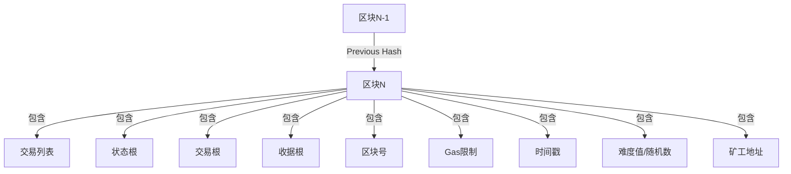

## 引言

最近抽出时间来梳理了一下区块链的相关内容:

以太坊作为智能合约平台的代表，提供了完整的开发工具链，让开发者能够构建去中心化应用（DApp）。本文将从开发人员的视角，系统介绍以太坊开发的核心概念、技术栈和实践路径。

---

## Web2 vs Web3：范式转变

理解 Web3 需要先对比 Web2 的架构差异：

### Web2 架构（传统中心化应用）

```
┌─────────────────────────────────────────────────────┐
│                    用户端                          │
│  ┌──────────┬──────────┬──────────┬─────────────┐ │
│  │  浏览器   │  iOS App │ Android App│   桌面端   │ │
│  └──────────┴──────────┴──────────┴─────────────┘ │
└──────────────────────────┬──────────────────────────────┘
                           │ HTTPS
                           ▼
┌─────────────────────────────────────────────────────┐
│                  中心化服务器                        │
│  ┌─────────────────────────────────────────────────┐  │
│  │ API 服务器 + 业务逻辑                           │  │
│  │ 数据库（MySQL/PostgreSQL/MongoDB）              │  │
│  │ 文件存储（AWS S3/阿里云OSS）                   │  │
│  └─────────────────────────────────────────────────┘  │
│                                                     │
│  问题：                                             │
│  • 单点故障                                         │
│  • 数据所有权归平台                                 │
│  • 可被审查、封禁                                   │
│  • 信任第三方                                       │
└─────────────────────────────────────────────────────┘
```

### Web3 架构（去中心化应用）

```
┌─────────────────────────────────────────────────────┐
│                    用户端                          │
│  ┌──────────┬──────────┬──────────┬─────────────┐ │
│  │  浏览器   │  iOS App │ Android App│   桌面端   │ │
│  │ + MetaMask│  + Wallet│  + Wallet │   + Wallet │ │
│  └──────────┴──────────┴──────────┴─────────────┘ │
└──────────────────────────┬──────────────────────────────┘
                           │ Web3.js / Ethers.js
                           ▼
┌─────────────────────────────────────────────────────┐
│                以太坊区块链网络                      │
│  ┌─────────────────────────────────────────────────┐  │
│  │ 智能合约（业务逻辑）                           │  │
│  │ 世界状态（数据存储）                           │  │
│  │ EVM（执行环境）                                │  │
│  └─────────────────────────────────────────────────┘  │
│                                                     │
│  优势：                                             │
│  • 无单点故障                                       │
│  • 数据用户自管                                     │
│  • 抗审查、不可篡改                                 │
│  • 代码即法律                                       │
└─────────────────────────────────────────────────────┘
                           │
                           ▼
┌─────────────────────────────────────────────────────┐
│              去中心化存储（可选）                    │
│  ┌─────────────┬─────────────────────────────────┐  │
│  │    IPFS     │           Swarm                │  │
│  │（文件存储）  │       （以太坊原生存储）        │  │
│  └─────────────┴─────────────────────────────────┘  │
└─────────────────────────────────────────────────────┘
```

### 核心差异对比

| 维度 | Web2 | Web3 |
|------|------|------|
| **数据存储** | 中心化数据库 | 区块链状态 |
| **身份认证** | 用户名/密码 | 私钥/钱包地址 |
| **执行逻辑** | 服务器代码 | 智能合约 |
| **信任模型** | 信任中介 | 信任代码 |
| **数据所有权** | 平台所有 | 用户所有 |
| **可用性** | 依赖服务器 | 依赖网络 |
| **成本** | 免费使用 | 需支付Gas费 |

---

## 以太坊核心概念

### 账户系统

以太坊采用账户模型（而非比特币的UTXO）：

```
账户类型
├── 外部拥有账户（EOA）
│   ├── 由私钥控制
│   ├── 有以太币余额
│   ├── 可以发送交易
│   └── 没有关联代码
│
└── 合约账户
    ├── 由智能合约代码控制
    ├── 有以太币余额
    ├── 不能主动发起交易
    └── 有关联的合约代码
```

**账户结构**：
- **Nonce**: 交易计数器，防止重放攻击
- **Balance**: 账户余额（以Wei为单位）
- **StorageRoot**: 存储树的根哈希
- **CodeHash**: 账户关联的合约代码哈希

### 交易（Transaction）

交易是以太坊状态改变的唯一方式：

```
交易结构
│
├── from（发送者地址）
├── to（接收者地址或合约地址）
├── value（转账金额，单位：Wei）
├── gasPrice（Gas单价，Gwei）
├── gasLimit（Gas使用上限）
├── data（调用数据）
│   ├── 函数签名
│   └── 函数参数
├── nonce（发送者交易序号）
└── v, r, s（签名值）
```

**Gas 机制**：
- 每个操作都有固定的Gas消耗
- `实际费用 = gasUsed × gasPrice`
- 防止无限循环攻击
- 未使用的Gas会退还

### 区块（Block）



### 以太坊虚拟机（EVM）

EVM 是以太坊智能合约的执行环境：

**特点**：
- **图灵完备**：支持循环、复杂逻辑
- **沙箱隔离**：合约无法访问外部资源
- **确定性执行**：相同输入必然产生相同输出
- **Gas 计费**：每个操作都有成本
- **256位字长**：适合密码学运算

**操作码示例**：
| 操作码 | 堆栈输入 | 堆栈输出 | Gas消耗 | 说明 |
|--------|----------|----------|---------|------|
| ADD | a, b | a + b | 3 | 加法 |
| MUL | a, b | a × b | 5 | 乘法 |
| SSTORE | key, value | - | 20000 | 存储写入 |
| SLOAD | key | value | 200 | 存储读取 |
| CALL | addr, value, args | - | 700+ | 调用合约 |

---

## 开发环境搭建

### 工具链概览

```
┌─────────────────────────────────────────────────────┐
│              以太坊开发工具链                        │
├─────────────────────────────────────────────────────┤
│  智能合约开发                                       │
│  ├── Solidity（合约编程语言）                      │
│  ├── Remix（在线IDE）                              │
│  ├── Truffle（开发框架）                           │
│  └── OpenZeppelin（安全合约库）                    │
├─────────────────────────────────────────────────────┤
│  网络与节点                                         │
│  ├── Geth（Go客户端）                              │
│  ├── Parity（Rust客户端）                          │
│  ├── TestRPC（本地测试网络）                       │
│  └── Infura（托管节点服务）                        │
├─────────────────────────────────────────────────────┤
│  前端交互                                           │
│  ├── Web3.js（JavaScript库）                       │
│  ├── Ethers.js（现代替代方案）                     │
│  └── MetaMask（浏览器钱包插件）                    │
├─────────────────────────────────────────────────────┤
│  测试与部署                                         │
│  ├── Ganache（本地测试链）                         │
│  ├── Mocha/Chai（测试框架）                        │
│  └── Ropsten/Rinkeby（测试网络）                  │
└─────────────────────────────────────────────────────┘
```

### 安装步骤

**1. 安装 Node.js 和 npm**

```bash
# 安装 nvm（版本管理器）
curl -o- https://raw.githubusercontent.com/nvm-sh/nvm/v0.35.3/install.sh | bash

# 安装最新 LTS 版本的 Node.js
nvm install --lts
```

**2. 安装 Truffle 套件**

```bash
# 全局安装 Truffle
npm install -g truffle

# 验证安装
truffle version
```

**3. 安装 Ganache（本地测试链）**

```bash
# 下载安装
# https://trufflesuite.com/ganache/

# 或使用命令行版本
npm install -g ganache-cli
```

**4. 安装 MetaMask 浏览器插件**

```
Chrome/Firefox: https://metamask.io/
```

---

## 智能合约开发

### Solidity 语言基础

Solidity 是以太坊官方的智能合约编程语言，语法类似 JavaScript。

**Hello World 示例**：

```solidity
// SPDX-License-Identifier: MIT
pragma solidity ^0.4.24;

contract HelloWorld {
    string public greeting = "Hello, World!";
    address public owner;

    // 构造函数
    constructor() public {
        owner = msg.sender;
    }

    // 修改问候语
    function setGreeting(string _newGreeting) public {
        greeting = _newGreeting;
    }

    // 读取问候语
    function sayHello() public view returns (string) {
        return greeting;
    }
}
```

**数据类型**：

```solidity
contract DataTypes {
    // 值类型
    bool public isActive = true;
    uint256 public amount = 100;
    int256 public temperature = -10;
    address public owner = msg.sender;
    bytes32 public hash = keccak256("hello");

    // 引用类型
    string public name = "Ethereum";
    bytes public data = "0x1234";

    // 数组
    uint256[] public numbers;
    uint256[10] public fixedArray;

    // 映射（哈希表）
    mapping(address => uint256) public balances;

    // 结构体
    struct User {
        string name;
        uint256 age;
    }
    User public user;

    // 枚举
    enum State { Created, Locked, Inactive }
    State public state;
}
```

### 常见设计模式

**1. 权限控制**：

```solidity
contract Ownable {
    address public owner;

    constructor() public {
        owner = msg.sender;
    }

    modifier onlyOwner() {
        require(msg.sender == owner, "Not owner");
        _;
    }

    function criticalFunction() public onlyOwner {
        // 只有所有者可以调用
    }
}
```

**2. 状态机**：

```solidity
contract StateMachine {
    enum State { Created, Locked, Inactive }
    State public state;

    function lock() public {
        require(state == State.Created, "Invalid state");
        state = State.Locked;
    }

    function deactivate() public {
        require(state == State.Locked, "Invalid state");
        state = State.Inactive;
    }
}
```

**3. 保险库模式（防止重入攻击）**：

```solidity
contract ReentrancyGuard {
    bool private locked = false;

    modifier noReentrant() {
        require(!locked, "Reentrant call");
        locked = true;
        _;
        locked = false;
    }

    function withdraw() public noReentrant {
        // 提款逻辑
    }
}
```

### ERC20 代币标准

ERC20 是以太坊上最流行的代币标准：

```solidity
contract ERC20Token {
    string public name = "My Token";
    string public symbol = "MTK";
    uint8 public decimals = 18;
    uint256 public totalSupply;

    mapping(address => uint256) public balanceOf;
    mapping(address => mapping(address => uint256)) public allowance;

    event Transfer(address indexed from, address indexed to, uint256 value);
    event Approval(address indexed owner, address indexed spender, uint256 value);

    constructor(uint256 initialSupply) public {
        totalSupply = initialSupply;
        balanceOf[msg.sender] = initialSupply;
    }

    function transfer(address to, uint256 value) public returns (bool) {
        require(balanceOf[msg.sender] >= value, "Insufficient balance");
        balanceOf[msg.sender] -= value;
        balanceOf[to] += value;
        emit Transfer(msg.sender, to, value);
        return true;
    }

    function approve(address spender, uint256 value) public returns (bool) {
        allowance[msg.sender][spender] = value;
        emit Approval(msg.sender, spender, value);
        return true;
    }

    function transferFrom(address from, address to, uint256 value) public returns (bool) {
        require(balanceOf[from] >= value, "Insufficient balance");
        require(allowance[from][msg.sender] >= value, "Insufficient allowance");
        balanceOf[from] -= value;
        balanceOf[to] += value;
        allowance[from][msg.sender] -= value;
        emit Transfer(from, to, value);
        return true;
    }
}
```

---

## DApp 开发实战

### 项目结构

使用 Truffle 框架的标准项目结构：

```
my-dapp/
├── contracts/           # 智能合约源码
│   ├── Migrations.sol
│   └── MyToken.sol
├── migrations/         # 部署脚本
│   ├── 1_initial_migration.js
│   └── 2_deploy_contracts.js
├── test/              # 测试文件
│   ├── MyToken.test.js
│   └── MyToken.test.sol
├── build/             # 编译输出（自动生成）
├── src/               # 前端应用
│   ├── index.html
│   ├── app.js
│   └── style.css
├── truffle-config.js  # Truffle 配置
└── package.json       # npm 依赖
```

### 完整开发流程

**1. 初始化项目**：

```bash
# 创建项目目录
mkdir my-token-dapp
cd my-token-dapp

# 初始化 Truffle 项目
truffle init

# 安装依赖
npm install --save-dev @truffle/hdwallet-provider
npm install web3
```

**2. 编写智能合约**（`contracts/SimpleToken.sol`）：

```solidity
// SPDX-License-Identifier: MIT
pragma solidity ^0.4.24;

import "./Ownable.sol";
import "./SafeMath.sol";

contract SimpleToken is Ownable {
    using SafeMath for uint256;

    string public name = "Simple Token";
    string public symbol = "STK";
    uint8 public decimals = 18;
    uint256 public totalSupply;

    mapping(address => uint256) public balanceOf;
    mapping(address => mapping(address => uint256)) public allowance;

    event Transfer(address indexed from, address indexed to, uint256 value);
    event Approval(address indexed owner, address indexed spender, uint256 value);
    event Mint(address indexed to, uint256 amount);

    constructor(uint256 initialSupply) public {
        totalSupply = initialSupply;
        balanceOf[msg.sender] = initialSupply;
        emit Mint(msg.sender, initialSupply);
    }

    function transfer(address to, uint256 value) public returns (bool) {
        require(to != address(0), "Invalid address");
        require(balanceOf[msg.sender] >= value, "Insufficient balance");

        balanceOf[msg.sender] = balanceOf[msg.sender].sub(value);
        balanceOf[to] = balanceOf[to].add(value);

        emit Transfer(msg.sender, to, value);
        return true;
    }

    function approve(address spender, uint256 value) public returns (bool) {
        require(spender != address(0), "Invalid address");
        allowance[msg.sender][spender] = value;
        emit Approval(msg.sender, spender, value);
        return true;
    }

    function transferFrom(address from, address to, uint256 value) public returns (bool) {
        require(from != address(0), "Invalid address");
        require(to != address(0), "Invalid address");
        require(balanceOf[from] >= value, "Insufficient balance");
        require(allowance[from][msg.sender] >= value, "Insufficient allowance");

        balanceOf[from] = balanceOf[from].sub(value);
        balanceOf[to] = balanceOf[to].add(value);
        allowance[from][msg.sender] = allowance[from][msg.sender].sub(value);

        emit Transfer(from, to, value);
        return true;
    }

    function mint(address to, uint256 amount) public onlyOwner {
        require(to != address(0), "Invalid address");
        totalSupply = totalSupply.add(amount);
        balanceOf[to] = balanceOf[to].add(amount);
        emit Mint(to, amount);
    }
}
```

**3. 编写测试**（`test/SimpleToken.test.js`）：

```javascript
const SimpleToken = artifacts.require("SimpleToken");

contract("SimpleToken", (accounts) => {
    const [owner, user1, user2] = accounts;
    const initialSupply = web3.utils.toWei("1000000", "ether");

    let token;

    beforeEach(async () => {
        token = await SimpleToken.new(initialSupply, { from: owner });
    });

    it("should have correct initial supply", async () => {
        const supply = await token.totalSupply();
        assert.equal(supply.toString(), initialSupply);
    });

    it("should allocate initial supply to owner", async () => {
        const balance = await token.balanceOf(owner);
        assert.equal(balance.toString(), initialSupply);
    });

    it("should transfer tokens correctly", async () => {
        const amount = web3.utils.toWei("100", "ether");

        await token.transfer(user1, amount, { from: owner });

        const balance1 = await token.balanceOf(user1);
        const balanceOwner = await token.balanceOf(owner);

        assert.equal(balance1.toString(), amount);
        assert.equal(balanceOwner.toString(),
            web3.utils.toWei("999900", "ether"));
    });

    it("should approve and transferFrom correctly", async () => {
        const amount = web3.utils.toWei("100", "ether");

        await token.approve(user2, amount, { from: owner });
        await token.transferFrom(owner, user1, amount, { from: user2 });

        const balance1 = await token.balanceOf(user1);
        assert.equal(balance1.toString(), amount);
    });

    it("should allow owner to mint tokens", async () => {
        const mintAmount = web3.utils.toWei("1000", "ether");

        await token.mint(user1, mintAmount, { from: owner });

        const balance1 = await token.balanceOf(user1);
        const totalSupply = await token.totalSupply();

        assert.equal(balance1.toString(), mintAmount);
        assert.equal(totalSupply.toString(),
            web3.utils.toWei("1001000", "ether"));
    });
});
```

**4. 配置部署网络**（`truffle-config.js`）：

```javascript
const HDWalletProvider = require("@truffle/hdwallet-provider");
const mnemonic = "your twelve word mnemonic phrase here";

module.exports = {
    networks: {
        development: {
            host: "127.0.0.1",
            port: 7545,
            network_id: "*"
        },
        ropsten: {
            provider: () => new HDWalletProvider(
                mnemonic,
                "https://ropsten.infura.io/v3/YOUR_INFURA_KEY"
            ),
            network_id: 3,
            gas: 5500000,
            confirmations: 2,
            timeoutBlocks: 200,
            skipDryRun: true
        }
    },
    compilers: {
        solc: {
            version: "0.4.24"
        }
    }
};
```

**5. 前端集成**（`src/app.js`）：

```javascript
import Web3 from "web3";
import SimpleTokenArtifact from "../../build/contracts/SimpleToken.json";

const App = {
    web3: null,
    account: null,
    token: null,

    start: async function() {
        const { web3 } = this;

        try {
            // 获取网络ID和账户
            const networkId = await web3.eth.net.getId();
            const accounts = await web3.eth.getAccounts();
            this.account = accounts[0];

            // 部署的合约地址
            const deployedNetwork = SimpleTokenArtifact.networks[networkId];
            this.token = new web3.eth.Contract(
                SimpleTokenArtifact.abi,
                deployedNetwork.address
            );

            // 刷新UI
            this.refreshUI();

            // 绑定事件
            this.bindEvents();
        } catch (error) {
            console.error(error);
        }
    },

    refreshUI: async function() {
        const { token, account } = this;

        const name = await token.methods.name().call();
        const symbol = await token.methods.symbol().call();
        const totalSupply = await token.methods.totalSupply().call();
        const balance = await token.methods.balanceOf(account).call();

        document.getElementById("token-name").textContent = name;
        document.getElementById("token-symbol").textContent = symbol;
        document.getElementById("total-supply").textContent =
            Web3.utils.fromWei(totalSupply, "ether");
        document.getElementById("user-balance").textContent =
            Web3.utils.fromWei(balance, "ether");
    },

    bindEvents: function() {
        const { token, account } = this;

        document.getElementById("transfer-btn").addEventListener("click", async () => {
            const to = document.getElementById("transfer-to").value;
            const amount = document.getElementById("transfer-amount").value;
            const amountWei = Web3.utils.toWei(amount, "ether");

            try {
                await token.methods.transfer(to, amountWei)
                    .send({ from: account });
                alert("转账成功！");
                this.refreshUI();
            } catch (error) {
                alert("转账失败：" + error.message);
            }
        });
    }
};

window.addEventListener("load", async function() {
    if (typeof web3 !== "undefined") {
        App.web3 = new Web3(web3.currentProvider);
    } else {
        App.web3 = new Web3(new Web3.providers.HttpProvider("http://localhost:7545"));
    }

    await App.start();
});
```

---

## 常见应用场景

### 1. 去中心化交易所（DEX）

**核心逻辑**：

```solidity
contract SimpleExchange {
    mapping(address => mapping(address => uint256)) public liquidity;
    mapping(address => mapping(address => uint256)) public tokenBalances;

    event Deposit(address indexed user, address indexed token, uint256 amount);
    event Trade(address indexed trader, address tokenGive, uint256 amountGive, address tokenGet, uint256 amountGet);

    // 存入流动性
    function depositToken(address token, uint256 amount) public {
        IERC20(token).transferFrom(msg.sender, address(this), amount);
        liquidity[msg.sender][token] += amount;
        emit Deposit(msg.sender, token, amount);
    }

    // 交易函数
    function trade(address tokenGive, uint256 amountGive, address tokenGet, uint256 amountGet) public {
        require(liquidity[msg.sender][tokenGive] >= amountGive, "Insufficient balance");

        liquidity[msg.sender][tokenGive] -= amountGive;
        liquidity[msg.sender][tokenGet] += amountGet;

        emit Trade(msg.sender, tokenGive, amountGive, tokenGet, amountGet);
    }
}
```

### 2. 投票系统

```solidity
contract Voting {
    struct Voter {
        uint256 weight;
        bool voted;
        address delegate;
        uint256 vote;
    }

    struct Proposal {
        string name;
        uint256 voteCount;
    }

    address public chairperson;
    mapping(address => Voter) public voters;
    Proposal[] public proposals;

    constructor(string[] proposalNames) public {
        chairperson = msg.sender;
        voters[chairperson].weight = 1;

        for (uint256 i = 0; i < proposalNames.length; i++) {
            proposals.push(Proposal({
                name: proposalNames[i],
                voteCount: 0
            }));
        }
    }

    function delegate(address to) public {
        Voter storage sender = voters[msg.sender];

        require(!sender.voted, "Already voted");
        require(to != msg.sender, "Self-delegation");

        while (voters[to].delegate != address(0)) {
            to = voters[to].delegate;
            require(to != msg.sender, "Found loop in delegation");
        }

        Voter storage delegate_ = voters[to];

        if (delegate_.voted) {
            proposals[delegate_.vote].voteCount += sender.weight;
        } else {
            delegate_.weight += sender.weight;
        }

        sender.voted = true;
        sender.delegate = to;
    }

    function vote(uint256 proposal) public {
        Voter storage sender = voters[msg.sender];

        require(sender.weight != 0, "Has no right to vote");
        require(!sender.voted, "Already voted");
        sender.voted = true;
        sender.vote = proposal;

        proposals[proposal].voteCount += sender.weight;
    }

    function winningProposal() public view returns (uint256 winningProposal_) {
        uint256 highestVoteCount = 0;

        for (uint256 p = 0; p < proposals.length; p++) {
            if (proposals[p].voteCount > highestVoteCount) {
                highestVoteCount = proposals[p].voteCount;
                winningProposal_ = p;
            }
        }
    }

    function winnerName() public view returns (string winnerName_) {
        winnerName_ = proposals[winningProposal()].name;
    }
}
```

### 3. 众筹合约

```solidity
contract Crowdfunding {
    struct Project {
        address payable creator;
        uint256 goal;
        uint256 pledged;
        uint256 deadline;
        bool claimed;
        mapping(address => uint256) pledges;
        address[] pledgers;
    }

    mapping(uint256 => Project) public projects;
    uint256 public projectCount;
    uint256 public constant FUNDING_DURATION = 30 days;

    event ProjectCreated(uint256 indexed projectId, address creator, uint256 goal, uint256 deadline);
    event Pledge(uint256 indexed projectId, address pledger, uint256 amount);
    event Claimed(uint256 indexed projectId, uint256 amount);
    event Refund(uint256 indexed projectId, address pledger, uint256 amount);

    function createProject(uint256 goal) public returns (uint256) {
        uint256 projectId = projectCount++;
        Project storage project = projects[projectId];

        project.creator = msg.sender;
        project.goal = goal;
        project.deadline = block.timestamp + FUNDING_DURATION;

        emit ProjectCreated(projectId, msg.sender, goal, project.deadline);
        return projectId;
    }

    function pledge(uint256 projectId) public payable {
        Project storage project = projects[projectId];

        require(block.timestamp < project.deadline, "Funding ended");
        require(msg.value > 0, "Must send ETH");

        if (project.pledges[msg.sender] == 0) {
            project.pledgers.push(msg.sender);
        }

        project.pledges[msg.sender] += msg.value;
        project.pledged += msg.value;

        emit Pledge(projectId, msg.sender, msg.value);
    }

    function claimFunds(uint256 projectId) public {
        Project storage project = projects[projectId];

        require(msg.sender == project.creator, "Not creator");
        require(block.timestamp >= project.deadline, "Funding not ended");
        require(project.pledged >= project.goal, "Goal not reached");
        require(!project.claimed, "Already claimed");

        project.claimed = true;
        project.creator.transfer(project.pledged);

        emit Claimed(projectId, project.pledged);
    }

    function refund(uint256 projectId) public {
        Project storage project = projects[projectId];

        require(block.timestamp >= project.deadline, "Funding not ended");
        require(project.pledged < project.goal, "Goal reached");

        uint256 pledged = project.pledges[msg.sender];
        require(pledged > 0, "No pledges to refund");

        project.pledges[msg.sender] = 0;
        msg.sender.transfer(pledged);

        emit Refund(projectId, msg.sender, pledged);
    }
}
```

---

## 安全最佳实践

### 常见安全漏洞

**1. 重入攻击（Reentrancy）**

```solidity
// 错误示例
contract Vulnerable {
    mapping(address => uint256) public balances;

    function withdraw() public {
        uint256 amount = balances[msg.sender];
        require(amount > 0);

        // 危险：在外部调用之前更新状态
        (bool success, ) = msg.sender.call.value(amount)("");
        require(success);

        balances[msg.sender] = 0; // 太晚了！
    }
}

// 正确示例
contract Secure {
    mapping(address => uint256) public balances;

    function withdraw() public {
        uint256 amount = balances[msg.sender];
        require(amount > 0);

        // 先更新状态
        balances[msg.sender] = 0;

        (bool success, ) = msg.sender.call.value(amount)("");
        require(success);
    }
}
```

**2. 整数溢出**

```solidity
// 使用 SafeMath 库
library SafeMath {
    function add(uint256 a, uint256 b) internal pure returns (uint256) {
        uint256 c = a + b;
        require(c >= a, "SafeMath: addition overflow");
        return c;
    }

    function sub(uint256 a, uint256 b) internal pure returns (uint256) {
        require(b <= a, "SafeMath: subtraction overflow");
        return a - b;
    }

    function mul(uint256 a, uint256 b) internal pure returns (uint256) {
        if (a == 0) return 0;
        uint256 c = a * b;
        require(c / a == b, "SafeMath: multiplication overflow");
        return c;
    }
}
```

**3. 访问控制**

```solidity
contract AccessControl {
    address public admin;
    mapping(address => bool) public authorized;

    constructor() public {
        admin = msg.sender;
        authorized[msg.sender] = true;
    }

    modifier onlyAdmin() {
        require(msg.sender == admin, "Not admin");
        _;
    }

    modifier onlyAuthorized() {
        require(authorized[msg.sender], "Not authorized");
        _;
    }

    function addAuthorized(address user) public onlyAdmin {
        authorized[user] = true;
    }
}
```

---

## 学习路径建议

### 第一阶段：基础认知（1-2周）

1. **理解核心概念**
   - 区块、交易、Gas、账户
   - Web2 vs Web3 架构差异
   - 智能合约的执行机制

2. **搭建开发环境**
   - 安装 Node.js、Truffle、Ganache
   - 配置 MetaMask
   - 熟悉 Remix IDE

3. **学习 Solidity 基础**
   - 数据类型、控制结构
   - 函数、修饰符、事件
   - 合约交互模式

**推荐资源**：
- CryptoZombies（游戏化学习）
- Solidity 官方文档
- Remix 在线编辑器

### 第二阶段：实践开发（2-4周）

1. **完成 Truffle Pet Shop 教程**
   - 项目初始化
   - 编写智能合约
   - 前端集成

2. **开发 ERC20 代币**
   - 实现标准接口
   - 添加增发功能
   - 编写单元测试

3. **构建简单 DApp**
   - 投票系统
   - 众筹合约
   - 简单交易所

**推荐资源**：
- Truffle 官方文档
- OpenZeppelin 合约库
- 30个以太坊开发示例

### 第三阶段：深入学习（持续）

1. **安全与审计**
   - 常见漏洞分析
   - 安全编码规范
   - 代码审计工具

2. **Layer 2 扩展**
   - 状态通道
   - Plasma
   - Rollup 技术

3. **DeFi 协议研究**
   - Uniswap（AMM）
   - Compound（借贷）
   - MakerDAO（稳定币）

**推荐资源**：
- Mastering Ethereum（电子书）
- 以太坊开发者文档
- awesome-blockchain-cn

---

## 参考资源

### 官方文档
- [Ethereum.org 开发者文档](https://ethereum.org/zh/developers/docs/)
- [Solidity 语言文档](https://docs.soliditylang.org/)
- [Truffle 框架文档](https://trufflesuite.com/docs/)

### 学习资源
- [CryptoZombies - Solidity 游戏化教程](https://cryptozombies.io/)
- [以太坊开发示例30例](https://learnblockchain.cn/2018/09/25/f5d557c62a66)
- [区块链技术指南 - yeasy](https://yeasy.gitbook.io/blockchain_guide/)
- [awesome-blockchain-cn](https://github.com/chaozh/awesome-blockchain-cn)

### 开发工具
- [Remix - 在线IDE](https://remix.ethereum.org/)
- [OpenZeppelin - 安全合约库](https://openzeppelin.com/)
- [Ganache - 本地测试链](https://trufflesuite.com/ganache/)
- [MetaMask - 钱包插件](https://metamask.io/)

### 浏览器与工具
- [Etherscan - 以太坊浏览器](https://etherscan.io/)
- [Eth Gas Station - Gas 价格查询](https://ethgasstation.info/)
- [Infura - 节点服务](https://infura.io/)

---

## 总结

以太坊开发已经形成了相对完整的工具链和生态：

1. **技术成熟度**：Solidity 语言稳定，Truffle/Ganache 开发工具完善
2. **标准规范**：ERC20/ERC721 等标准被广泛采用
3. **应用场景**：DeFi、NFT、DAO 等应用开始涌现
4. **安全意识**：经过 DAO、Parity 等事件，社区更加重视安全
