## 从单体到微服务

软件架构的演进从来不是一蹴而就的。2011 年，Netflix 开始将单体应用迁移到微服务架构；2012 年，"Microservice"这个词汇开始出现在技术社区的讨论中；2014 年，Martin Fowler 和 James Lewis 发表了著名的《Microservices》文章，系统阐述了这一架构模式的核心特征。

短短几年间，微服务从一种边缘实践演变成主流的架构风格。但正如任何技术浪潮一样，盲目跟风往往会带来灾难。Netflix 的首席云架构师 Adrian Cockcroft 曾说过："你不需要微服务，你只需要更好的架构。"

本文试图从工程实践的角度，系统梳理微服务架构的演进路径、设计模式和实践方法，帮助你在是否采用微服务这件事上做出更理性的判断。

  

## 单体架构的困境

在讨论微服务之前，先来看看我们最熟悉的单体架构。

**典型的单体架构**：所有功能打包在一个 WAR 包或目录结构中，包含 DO/DAO、Service、UI 等所有逻辑，部署在同一个应用服务器上。

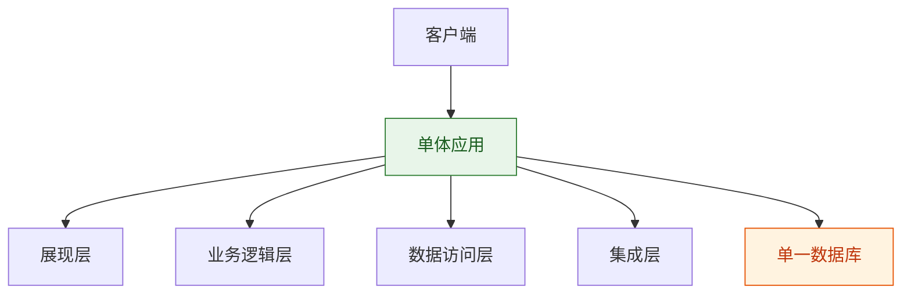

### 单体架构的优势

在项目早期，单体架构有明显的优势：

| 优势 | 说明 |
|------|------|
| **开发简单** | 工具和 IDE 都是为单体应用设计的，开发体验好 |
| **部署简单** | 只需要部署一个 WAR 包或目录 |
| **测试简单** | 集成测试可以直接在本地运行 |
| **扩展容易** | 通过负载均衡器运行多个副本即可 |

### 单体架构的困境

但随着应用变大、团队扩大，单体架构的问题会逐渐暴露：

**代码库变得庞大**：新成员难以理解整个系统，模块边界模糊，代码质量下滑，陷入恶性循环。一个典型的中型单体应用可能有几十万行代码，包含上百个业务模块，新人需要数周甚至数月才能基本理解系统结构。

**开发效率下降**：团队在同一个代码库中工作，修改冲突不断，相互等待，发布协调成本高。一个看似简单的 UI 改动，可能需要协调多个团队，修改完成后又要等待漫长的发布流程。

**部署风险增加**：任何小修改都要重新部署整个应用，可能导致与更改无关的后台任务中断，或某些组件无法正常启动。更糟糕的是，整个应用的启动时间可能长达十几分钟，部署一次需要经历漫长的等待。

**扩展受限**：只能通过运行多个应用副本进行 X 轴扩展，无法单独扩展某个资源密集型的组件。比如，订单处理是 CPU 密集型，而报表生成是内存密集型，单体架构只能同时扩展两者，造成资源浪费。

**技术栈锁定**：一旦选择了某个技术栈，很难引入新技术。如果要更换框架，可能需要重写整个应用。这意味着，即使有更好的技术出现，团队也很难尝试，技术债务不断累积。

**具体的困境场景**：

假设一个电商平台的单体应用，包含模块：用户管理、商品管理、订单处理、库存管理、支付集成、物流配送、数据报表

当订单处理模块需要扩容应对大促流量时，只能整体扩容整个应用，包括几乎不使用的报表模块。当团队想要尝试新的前端框架时，发现整个应用都绑定在旧的技术栈上，迁移成本高得让人望而却步。

## 微服务架构的核心概念

微服务架构是单体架构的"对立面"，它将应用按功能拆分为一组独立部署、自主开发的服务集合。

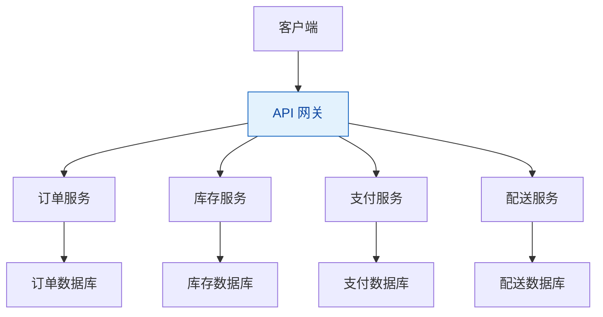

### 微服务的定义

微服务架构是这样一种架构模式：

- 将应用按功能垂直拆分为一组松散耦合的服务
- 每个服务运行在自己的进程中
- 服务间通过轻量级机制（HTTP/REST 或消息）通信
- 每个服务都有自己的数据库
- 服务可以独立开发、部署和扩展

### 微服务架构的核心特征

根据 Martin Fowler 的定义，微服务架构具有以下核心特征：

**组件化服务**：服务作为组件被独立部署和替换。与传统的库组件不同，服务是进程外的组件，通过 HTTP 或消息机制通信。

**围绕业务能力组织**：与按技术层划分的单体应用不同，微服务按业务能力拆分。这意味着服务是跨职能的，包含用户界面、业务逻辑和数据访问的全部功能。

**产品而非项目**：团队负责整个产品的生命周期，而不是将代码"扔过墙"给另一个团队。这种责任制带来了更好的产品质量和更快的反馈循环。

**智能端点与哑管道**：服务包含业务逻辑，通信通道尽可能简单。这与传统的 ESB（企业服务总线）形成对比，后者将大量智能放入通信基础设施中。

**去中心化治理**：服务可以使用不同的技术栈，包括编程语言、数据库、框架等。这允许团队为每个服务选择最合适的工具。

**去中心化数据管理**：每个服务独享自己的数据库，通过 API 进行数据访问。这与传统单体应用共享单一数据库的方式形成对比。

**基础设施自动化**：持续集成、持续部署、自动化测试是微服务架构的基础。没有自动化，微服务的部署成本将不可接受。

**容错设计**：服务必须能够应对其他服务的故障，通过熔断、降级、重试等机制保证系统的可用性。

**演进式设计**：服务的设计应该能够随时间演进，而不是一开始就设计完美。小步快跑、持续迭代是关键。

### 微服务 vs 单体：深度对比

| 对比维度 | 单体架构 | 微服务架构 |
|----------|----------|------------|
| **代码组织** | 单一代码库 | 每个服务独立代码库 |
| **部署单元** | 单一部署单元 | 多个独立部署单元 |
| **开发团队** | 大型团队，需要协调 | 小型团队，独立工作 |
| **技术栈** | 统一技术栈 | 服务可自由选择技术 |
| **扩展性** | 只能整体扩展 | 可独立扩展每个服务 |
| **故障隔离** | 一个组件故障影响全局 | 故障隔离在服务内部 |
| **数据管理** | 共享单一数据库 | 每个服务独享数据库 |
| **测试复杂度** | 相对简单 | 需要处理服务间依赖 |

## Scale Cube：三维扩展模型

在讨论如何拆分服务之前，先了解 Scale Cube 这个扩展模型：

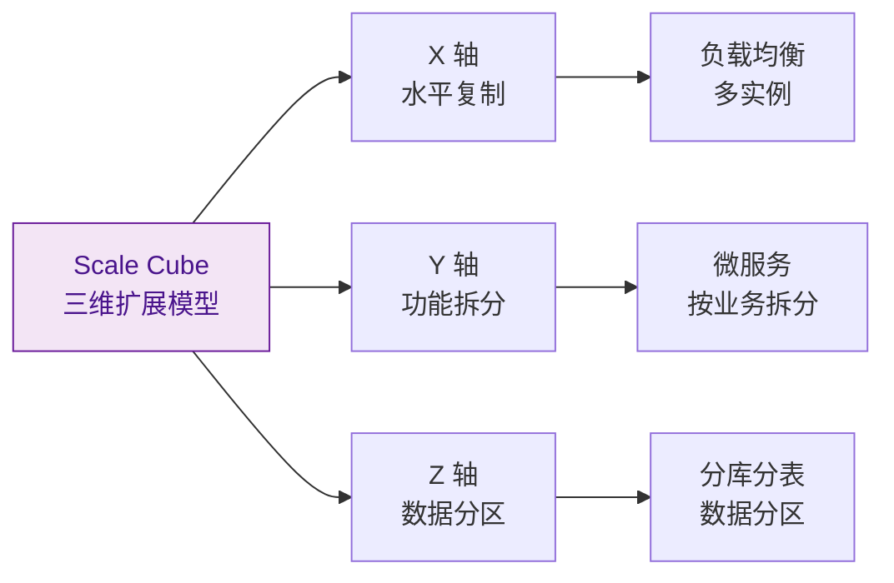

- **X 轴**：运行多个应用副本，通过负载均衡器分发请求
- **Y 轴**：将应用按功能拆分为服务
- **Z 轴**：按数据属性（如用户 ID、地区）进行分区

微服务架构的核心就是 Y 轴扩展——按业务能力进行功能拆分。

## 微服务架构的实践模式

### 服务拆分策略

如何将单体应用拆分为微服务？这是最困难也最关键的问题。拆分不当会导致服务间依赖复杂、数据难以管理、性能下降等问题。

**按业务能力拆分**

根据业务能力界定服务的范围，每个服务负责一个特定的业务领域。这种方式与组织结构相匹配，符合康威定律（Conway's Law）：设计系统的组织，其产生的设计等同于组织间的沟通结构。

| 服务 | 业务能力 | 典型功能 |
|------|----------|----------|
| 订单服务 | 订单生命周期管理 | 订单创建、查询、状态管理、取消 |
| 库存服务 | 库存实时管理 | 库存查询、预留、扣减、同步 |
| 支付服务 | 支付处理与结算 | 支付处理、退款、对账、结算 |
| 配送服务 | 物流与配送 | 发货、物流跟踪、签收确认 |
| 用户服务 | 用户账户管理 | 注册、登录、个人信息、权限 |

**按领域驱动设计（DDD）拆分**

使用 DDD 中的限界上下文（Bounded Context）概念来界定服务边界。每个限界上下文对应一个微服务，这有助于确保服务的高内聚、低耦合。

DDD 的核心概念：
- **限界上下文**：明确系统边界，边界内的概念有特定含义
- **聚合**：一组作为整体修改的领域对象
- **领域事件**：表示领域中发生的事件

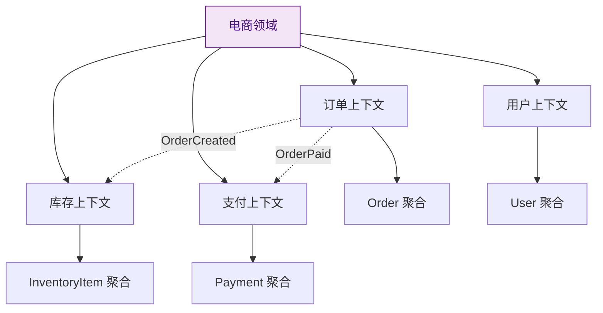

**其他拆分策略**

- **按"动词"或用例拆分**：如发货服务处理已完成的订单
- **按"名词"或资源拆分**：如库存服务跟踪货物库存
- **按扩展性需求拆分**：选择对扩展性要求最高的模块优先进行微服务化

> **设计原则**：每个服务应该只面向一小部分职责。可以用单一责任原则（SRP）来指导服务设计——一个服务应该只有一个变更理由。
>
> **Unix 哲学**：做好一件事，与其他服务协作完成复杂任务。这与 Unix 工具的设计思路一致——grep、cat、find 每个工具只做一件事，但可以通过 Shell 脚本组合完成复杂任务。

**拆分的实践建议**

从经验来看，服务拆分应该遵循以下原则：

1. **从耦合度最低的模块开始**：选择与其他模块交互最少的模块先拆分
2. **按业务价值优先**：优先拆分能为业务带来直接价值的模块
3. **保持服务独立性**：确保服务可以独立开发、部署和扩展
4. **避免服务碎片化**：服务太小会导致管理成本增加，一般一个 2-3 人的小团队负责一个服务比较合适
5. **逐步演进**：不要指望一次性拆分完美，服务边界应该随业务发展持续调整

### 服务间通信

微服务之间需要通过网络进行通信，这是微服务架构的核心挑战之一。通信方式的选择直接影响系统的性能、可靠性和复杂度。

**同步通信**

同步通信指调用方等待被调用方返回结果后再继续执行。最常见的形式是 HTTP/REST API。

**REST API**：
- 基于 HTTP 协议，使用 JSON 或 XML 格式
- 易于实现和调试，跨语言支持好
- 无状态设计，易于扩展
- 但可能产生多次网络往返（N+1 问题）

**RPC（远程过程调用）**：
- 如 gRPC（基于 Protocol Buffers）、Thrift、Dubbo
- 使用二进制协议，传输效率更高
- 支持双向流和流式处理
- 通常用于内部服务间的高性能通信

**REST vs RPC 对比**：

| 对比维度 | REST | RPC |
|----------|------|-----|
| 协议 | HTTP/1.x 或 HTTP/2 | 通常是 TCP + 自定义协议 |
| 数据格式 | JSON、XML、Protobuf | Protobuf、Thrift 等 |
| 性能 | 相对较低，有序列化开销 | 较高，二进制协议 |
| 调试友好 | 优秀，可用浏览器直接测试 | 较差，需要特定工具 |
| 耦合度 | 较低，基于标准 HTTP | 较高，需要代码生成 |
| 跨语言 | 优秀，所有语言都支持 | 依赖于代码生成工具 |

**异步通信**

异步通信指调用方不等待被调用方返回结果，而是通过消息队列或事件总线进行通信。

**消息队列**：
- Kafka：高吞吐量的分布式消息系统，适合事件流处理
- RabbitMQ：功能丰富的消息代理，支持多种协议
- RocketMQ：阿里开源的消息中间件，适合电商场景

**异步通信的优势**：
- 降低服务间耦合：服务不需要知道谁在消费消息
- 提供缓冲：消息队列可以平滑流量峰值，避免下游服务被冲垮
- 提高弹性：服务宕机时，消息可以暂存在队列中
- 调用方无需等待：可以立即返回，提高用户体验

**异步通信的挑战**：
- 最终一致性：数据不是立即一致的，需要处理数据延迟
- 幂等性：消息可能重复发送，消费端需要实现幂等性
- 调试困难：异步流程的问题追踪更复杂
- 消息顺序：需要处理消息的顺序问题

| 对比维度 | 同步通信 | 异步通信 |
|----------|----------|----------|
| 实现复杂度 | 相对简单 | 需要处理消息重复 |
| 一致性 | 强一致性 | 最终一致性 |
| 耦合度 | 较高耦合 | 松耦合 |
| 性能体验 | 可能阻塞调用方 | 调用方无需等待 |
| 可靠性 | 服务故障导致失败 | 消息队列提供缓冲 |

### 数据管理

**独享数据库（Database per Service）**

每个微服务拥有自己的数据存储，在数据库层实现解耦。这是微服务架构的关键原则，也是与传统单体应用最大的区别之一。

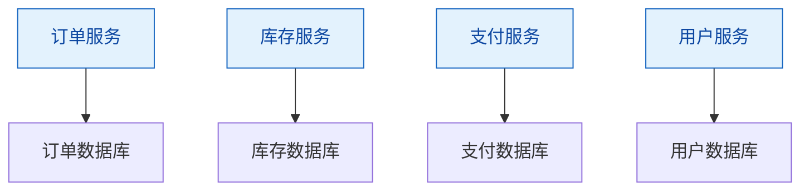

**为什么需要独享数据库**？

如果多个服务共享同一个数据库，会产生以下问题：
- **数据耦合**：服务通过数据库表结构强耦合，一个服务的表结构变更会影响其他服务
- **开发冲突**：多个团队需要协调数据库变更，难以独立开发
- **技术锁定**：所有服务被锁定在同一个数据库技术上
- **扩展困难**：无法根据服务的特性选择最合适的数据库

**独享数据库的优势**：
- 服务在数据库层完全解耦
- 服务可以选择最适合的数据库技术
- 团队可以独立开发和部署
- 数据访问性能更好（没有跨服务的 JOIN 查询）

**数据一致性挑战**

每个服务独享数据库后，跨服务的数据一致性成为挑战。传统的两阶段提交（2PC）分布式事务在微服务架构中不再可行，原因如下：
- 2PC 在网络延迟和故障场景下性能很差
- 锁定资源的时间过长，影响系统吞吐量
- 不适合 NoSQL 数据库（大多数不支持 2PC）

**Saga 模式：维护数据一致性**

Saga 是 1987 年提出的一种古老模式，但在微服务架构中找到了新的用场。Saga 将一个业务事务拆分为一系列本地事务，每个本地事务在单个服务内执行并更新数据存储。

**Saga 的两种协调方式**：

**1. 编排式（Orchestration）**
由一个中心协调器告诉参与的微服务哪个本地事务需要执行。

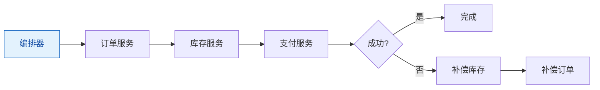

**2. 协同式（Choreography）**
没有中心协调器，每个服务监听其他服务的事件，并决定是否执行某个动作。

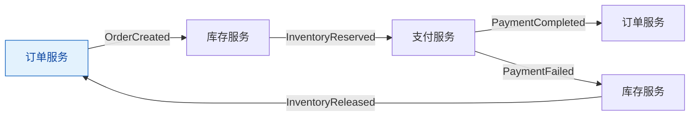

**对比**：
| 对比维度 | 编排式 | 协同式 |
|----------|--------|----------|
| 复杂度 | 集中管理逻辑较简单 | 分布式协调较复杂 |
| 耦合度 | 服务依赖编排器 | 服务相对独立 |
| 可观测性 | 容易追踪事务状态 | 难以理解整体流程 |
| 故障处理 | 编排器负责补偿 | 每个服务负责补偿 |

**事件溯源（Event Sourcing）**

事件溯源是一种不存储实体的当前状态，而是存储导致状态变化的事件序列的模式。

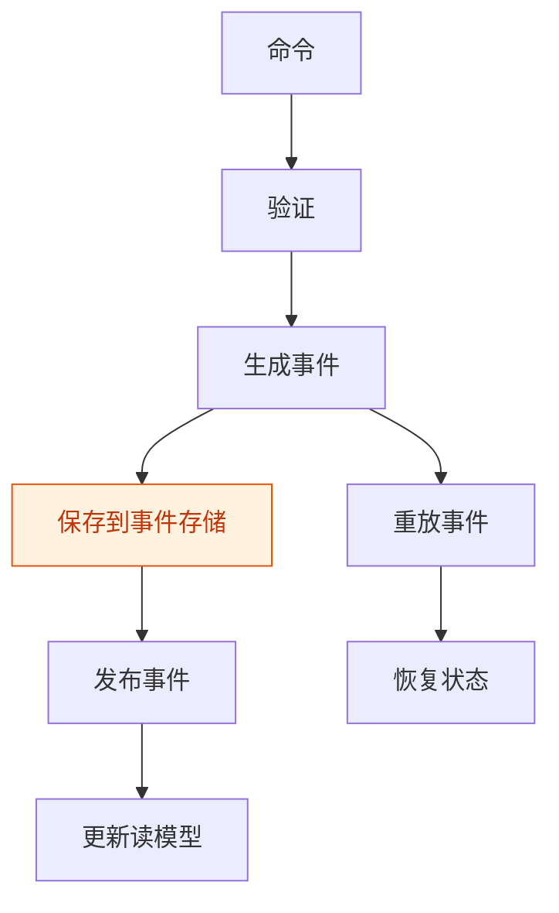

**事件溯源的优势**：
- 自动记录实体变更历史，包括时序回溯功能
- 为高可伸缩系统提供原子性操作
- 松耦合和事件驱动的微服务

**事件溯源的挑战**：
- 从事件存储中读取实体成为新的挑战
- 系统整体复杂性增加，需要领域驱动设计基础
- 需要处理事件重复（幂等）或丢失
- 变更事件结构成为新的挑战

**CQRS（命令查询职责分离）**

CQRS 将系统的数据修改部分（命令）与数据读取部分（查询）分离。

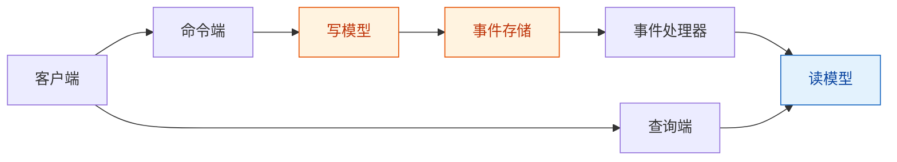

**CQRS 的优势**：
- 读写系统可独立扩展
- 读操作可以针对特定场景优化
- 数据的高可用性（读存储故障不影响写操作）

**CQRS 的挑战**：
- 读数据存储是弱一致性的（最终一致性）
- 整个系统的复杂性增加
- 需要处理事件同步延迟

**何时使用这些模式**：

| 模式 | 适用场景 |
|------|----------|
| **Saga** | 跨服务的长事务流程，需要保持最终一致性 |
| **事件溯源** | 高并发的业务实体，需要完整的变更历史，支持审计 |
| **CQRS** | 读负载远高于写负载，查询涉及多个服务，需要高性能读取 |

### 服务发现与容错

**服务发现**

在微服务架构中，服务实例的数量和位置是动态变化的。服务发现机制让服务能够相互找到对方。

**客户端发现模式**：

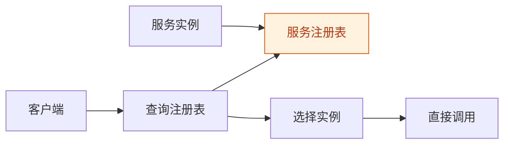

服务实例启动时，将自己的网络位置注册到服务注册表。客户端从注册表查询可用实例，并使用负载均衡算法选择一个实例直接调用。

- **优点**：架构简单，扩展灵活，只依赖服务注册表
- **缺点**：客户端需要实现服务发现逻辑，处理实例故障时较为复杂
- **实现**：Eureka、Consul、Zookeeper

**服务端发现模式**：

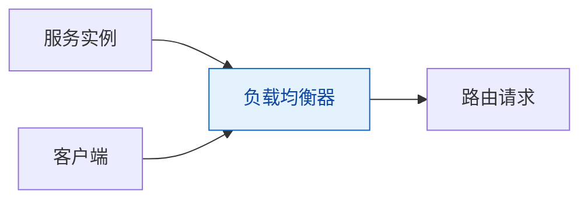

客户端通过负载均衡器向服务发送请求，负载均衡器查询服务注册表并将请求路由到可用的实例。

- **优点**：客户端逻辑简单，无需处理服务发现
- **缺点**：需要额外的负载均衡器基础设施
- **实现**：Nginx、HAProxy、AWS ALB

**容错机制**

分布式系统中网络是不可靠的，服务可能随时出现故障。需要建立多层容错机制：

**1. 超时与重试**

- **超时**：设置合理的超时时间，避免无限等待
- **重试**：对于瞬时故障（如网络抖动），重试往往能成功
- **注意**：重试需要考虑幂等性，避免重复执行业务操作

**2. 熔断器（Circuit Breaker）**

当依赖的服务出现故障或响应时间过长时，熔断器会打开，快速失败，避免资源耗尽和级联故障。

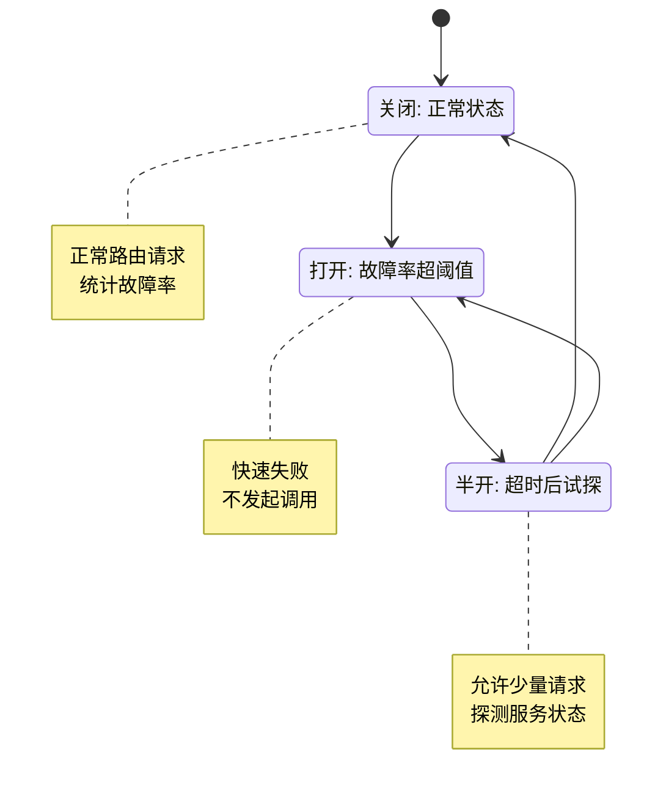

- **关闭**：正常路由请求，统计故障率
- **打开**：快速失败，直接返回异常，不发起实际调用
- **半开**：允许少量请求通过，探测服务是否恢复

**3. 限流**

保护服务不被过载请求击垮。常见的限流算法：

- **固定窗口**：在固定时间窗口内限制请求数
- **滑动窗口**：更平滑的限流效果
- **令牌桶**：恒定的速率，可以应对突发流量
- **漏桶**：恒定的速率，无法应对突发流量

**4. 降级**

当服务不可用或响应时间过长时，提供备用的响应策略：

- **默认值**：返回缓存的默认值
- **本地缓存**：使用本地缓存的数据
- **空响应**：返回部分数据或空响应
- **友好提示**：告诉用户服务暂时不可用

**容错的综合实践**

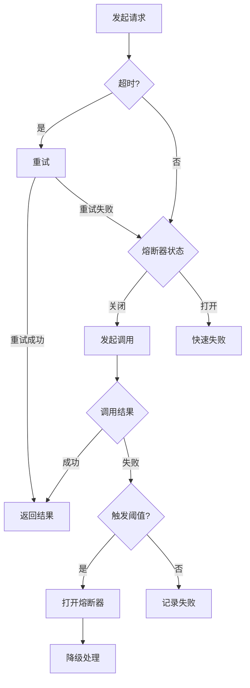

> **实践建议**：容错机制应该在服务设计阶段就考虑进去，而不是事后补救。Netflix 的 Hystrix（虽已停止维护，但理念仍值得借鉴）提供了完整的容错实现，包括熔断器、隔离、降级等功能。

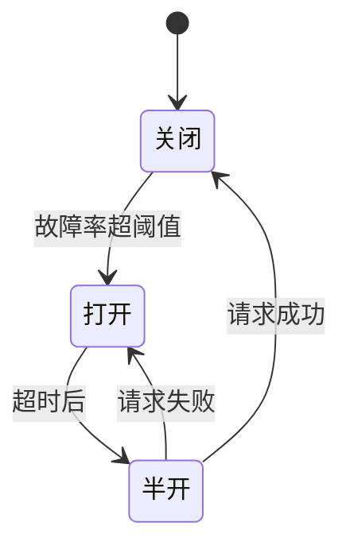

**熔断器的三种状态**：
- **关闭**：正常路由请求，统计故障率
- **打开**：快速失败，直接返回异常
- **半开**：允许少量请求通过，探测服务是否恢复

## 微服务架构的设计模式

微服务架构中有众多经过实战验证的设计模式，每个模式都解决特定的架构问题。以下是核心设计模式的深入解析。

### API 网关模式

在微服务架构中，客户端可能需要调用多个服务。直接让客户端调用多个微服务会带来诸多问题：客户端需要知道每个服务的地址、需要处理服务间的调用关系、需要实现认证授权等横切关注点。

API 网关位于客户端和微服务之间，充当 Facade 角色。

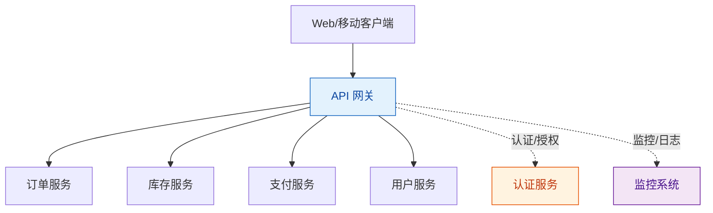

**API 网关的核心职责**：

**1. 请求路由**：根据请求的 URL 或其他规则，将请求路由到适当的后端服务。

**2. 协议转换**：将外部协议（如 HTTP、WebSocket）转换为内部服务使用的协议。

**3. 数据聚合**：一个客户端请求可能需要调用多个服务，API 网关可以聚合多个服务的响应，减少客户端的网络往返。

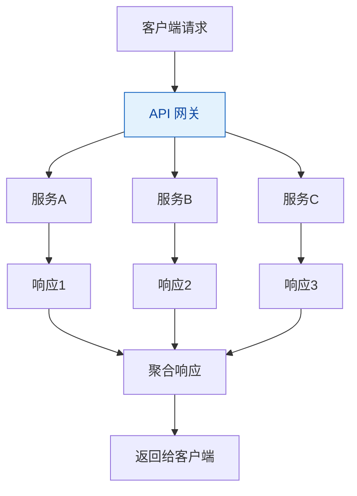

**4. 横切关注点**：
- **认证与授权**：验证客户端身份，控制访问权限
- **限流**：防止滥用，保护后端服务
- **监控与日志**：记录请求日志，监控 API 使用情况
- **SSL 终止**：在网关处终止 SSL，简化后端服务

**API 网关的实现选择**：

| 实现 | 适用场景 | 特点 |
|------|----------|------|
| **Zuul** | Spring Cloud 生态 | 功能丰富，与 Spring Boot 集成好 |
| **Spring Cloud Gateway** | 响应式编程 | 基于 WebFlux，性能更好 |
| **Kong / Nginx** | 高性能场景 | 基于高性能的 Nginx |
| **AWS API Gateway** | AWS 环境 | 托管服务，无需运维 |

### Strangler 模式：渐进式迁移

将遗留单体应用迁移到微服务架构是一项高风险的工作。Strangler（绞杀）模式提供了一种安全的渐进式迁移策略。

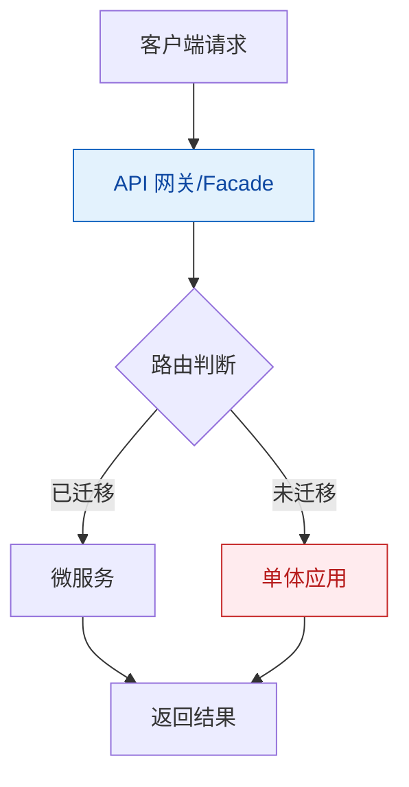

**Strangler 模式的步骤**：

1. **识别候选功能**：选择耦合度低、对扩展性要求高的功能优先迁移
2. **创建 Facade**：在客户端和单体应用之间创建一个 Facade（API 网关）
3. **实现新功能为服务**：新功能只在微服务中实现，不再添加到单体应用
4. **逐步迁移现有功能**：将现有功能从单体迁移到微服务
5. **更新路由规则**：更新 Facade 的路由规则，将请求导向新的微服务
6. **退役单体应用**：当所有功能都迁移完成后，退役单体应用

**优势**：
- 安全的迁移路径，不会一次性破坏系统
- 可以并行开发和迁移，新功能不受遗留系统影响
- 更好地把控迁移节奏，遇到问题可以回退

### 断路器模式：防止级联故障

前面已经介绍了断路器的状态机，这里补充一些实践细节。

**断路器的配置参数**：

```java
// Hystrix 风格的伪代码
CircuitBreaker breaker = CircuitBreaker.builder()
    .failureThreshold(5)      // 失败阈值：连续失败5次触发熔断
    .successThreshold(2)      // 成功阈值：半开状态下连续成功2次恢复
    .timeout(3000)            // 超时时间：3秒
    .halfOpenAfter(60000)     // 半开等待时间：60秒后进入半开状态
    .build();
```

**断路器的实践建议**：

1. **为每个依赖服务配置独立的断路器**：一个服务的故障不应影响其他服务的断路器状态
2. **合理设置超时时间**：超时时间应该基于 P99 或 P99.5 的响应时间，而不是平均值
3. **监控断路器状态**：断路器打开应该触发告警，让运维人员及时介入
4. **配合降级使用**：断路器打开时，应该有明确的降级策略

### 面向前端的后端（BFF）

为不同类型的客户端（Web、移动端、IoT）提供定制的后端服务。

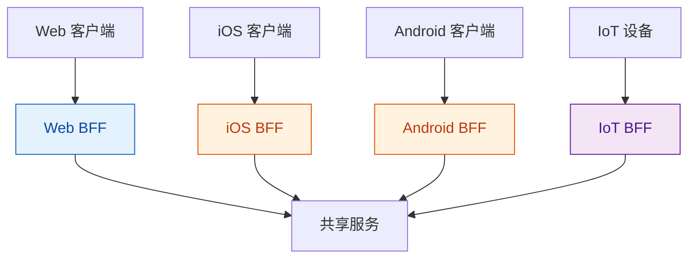

**为什么需要 BFF**：

1. **不同客户端有不同的需求**：Web 端和移动端的屏幕尺寸、性能、网络条件不同
2. **减少网络往返**：BFF 可以聚合多个服务的响应，减少客户端的网络调用
3. **团队自治**：前端团队可以独立开发和部署 BFF，不需要等待后端团队
4. **安全隔离**：BFF 可以部署在 DMZ 网络，保护后端服务

**BFF 的设计原则**：

- **不包含业务逻辑**：BFF 只负责数据组装和格式转换，不应包含复杂的业务逻辑
- **轻量级实现**：使用 Node.js、Go 等轻量级技术栈，便于前端团队掌握
- **独立部署**：每个 BFF 独立部署，互不影响

## 实战案例：从单体到微服务的演进之路

理论需要实践的检验。让我们看看几个经典案例，了解这些公司是如何从单体架构演进到微服务架构的，以及他们在这个过程中遇到的挑战和解决方案。

### Netflix：微服务的标杆

Netflix 的微服务转型是业界最著名的案例之一。在 2008 年之前，Netflix 的应用是一个单体架构，部署在数据中心的服务器上。一次数据库故障导致 Netflix 服务中断了三天，这次事件成为他们转型的催化剂。

**转型背景**：
- 单体应用难以扩展，无法应对快速增长的用户量
- 数据中心故障导致服务中断
- 发布周期长，任何小问题都需要重新部署整个应用

**转型策略**：

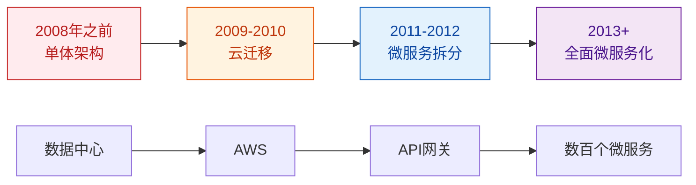

**关键技术决策**：

1. **全面上云**：放弃自建数据中心，全面迁移到 AWS
2. **API 网关**：使用 Zuul 作为 API 网关，统一处理认证、路由、限流
3. **服务发现**：自研 Eureka 实现服务注册与发现
4. **容错机制**：自研 Hystrix 实现熔断器模式
5. **配置管理**：自研 Archaius 实现动态配置管理
6. **分布式追踪**：自研 Zuul 和 Ribbon 实现请求追踪

**Netflix 的经验总结**：

| 成功因素 | 说明 |
|----------|------|
| **渐进式迁移** | 不是一次性重写，而是逐步将功能从单体迁移到微服务 |
| **自研核心组件** | 当开源方案不满足需求时，果断自研并开源 |
| **混沌工程** | 通过 Simian Army 主动注入故障，测试系统容错能力 |
| **文化转型** | 从传统瀑布开发转向敏捷和 DevOps 文化 |

**挑战与教训**：

- **服务粒度问题**：早期服务拆分过细，导致服务数量爆炸，管理成本上升
- **分布式复杂性**：网络问题、部分故障、数据一致性等问题需要大量工程投入
- **运维复杂度**：需要建设完整的监控、追踪、告警系统

### Amazon：两个披萨团队

Amazon 的微服务转型更早，大约在 2001-2002 年就开始了。著名的"两个披萨团队"理念就是在这次转型中产生的。

**转型背景**：

- 单体应用的发布周期长达数月
- 任何小的修改都需要重新部署整个应用
- 团队规模扩大，协调成本激增

**"两个披萨团队"理念**：

> 一个团队的规模应该小到可以用两个披萨喂饱。通常意味着 6-10 人。

**Amazon 的微服务原则**：

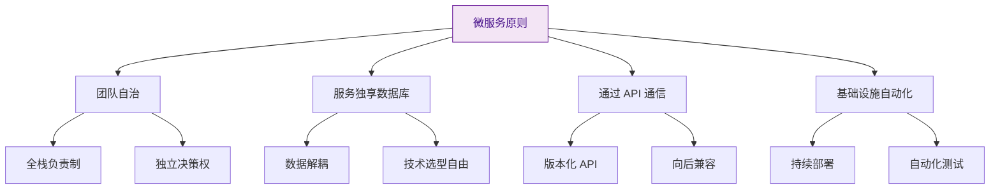

**Amazon 的实践**：

1. **服务拆分标准**：按业务能力拆分，每个服务对应一个业务能力
2. **数据所有权**：每个服务拥有自己的数据，通过 API 访问
3. **版本化 API**：所有 API 都有版本号，确保向后兼容
4. **持续部署**：每个服务都可以独立部署，部署频率极高

### eBay：渐进式演进的典范

eBay 的架构演进是一个很好的渐进式演进案例，展示了如何在保持业务运行的同时完成架构转型。

**演进路径**：

```mermaid
graph TD
    A[第一阶段<br/>单体应用<br/>1995-2002] --> B[第二阶段<br/>搜索服务拆分<br/>2002-2004]
    B --> C[第三阶段<br/>垂直拆分<br/>2004-2006]
    C --> D[第四阶段<br/>SOA 架构<br/>2006-2010]
    D --> E[第五阶段<br/>微服务架构<br/>2010+]

    A1[单一数据库] --> B1[搜索独立数据库]
    B1 --> C1[按业务拆分数据库]
    C1 --> D1[服务化改造]
    D1 --> E1[全面微服务化]

    style A fill:#ffebee,stroke:#c62828,color:#b71c1c
    style B fill:#fff3e0,stroke:#e65100,color:#bf360c
    style C fill:#e3f2fd,stroke:#1565c0,color:#0d47a1
    style D fill:#e3f5f5,stroke:#00838f,color:#006064
    style E fill:#f3e5f5,stroke:#6a1b9a,color:#4a148c
```

**eBay 的关键经验**：

1. **从痛点出发**：优先拆分性能瓶颈最严重的模块（搜索服务）
2. **数据库拆分先行**：先完成数据库的拆分，再进行服务拆分
3. **渐进式演进**：不是一次性重写，而是逐步演进，每个阶段都为下一个阶段做准备

### 实战经验的共性总结

从这些经典案例中，我们可以总结出一些共性经验：

**1. 渐进式演进，而非一次性重写**

```
❌ 错误做法：停止新功能开发，全力重写整个系统
✅ 正确做法：在维护现有系统的同时，逐步将功能迁移到新架构
```

**2. 技术转型需要组织转型配合**

| 技术层面 | 组织层面 |
|----------|----------|
| 微服务拆分 | 团队按服务组织 |
| 独立部署 | 团队独立负责部署 |
| 服务间通信 | 团队间明确接口 |
| 去中心化治理 | 去中心化决策 |

**3. 工具和文化同样重要**

- **工具**：容器、服务发现、API 网关、监控追踪
- **文化**：DevOps、自动化、容错意识、快速试错

**4. 监控和可观测性是基础**

没有完善的监控和可观测性，微服务架构就像在黑暗中开车。必须投入足够的资源建设：

- 指标监控
- 日志聚合
- 分布式追踪

### 什么时候开始微服务转型？

基于这些案例的经验，以下情况可能意味着需要考虑微服务转型：

| 信号 | 说明 |
|------|------|
| **部署频率低** | 修改一行代码需要数周才能上线 |
| **扩展困难** | 无法单独扩展某个模块，只能整体扩容 |
| **团队协调成本高** | 任何修改都需要协调多个团队 |
| **技术栈陈旧** | 想要引入新技术，但被现有架构锁定 |
| **发布风险高** | 每次发布都像打仗，容易出问题 |

## 微服务架构的挑战

微服务架构不是银弹，它将复杂性从代码转移到了基础设施。在享受微服务带来的好处之前，必须先理解并准备好应对这些挑战。

### 分布式系统的复杂性

微服务架构本质上是一个分布式系统，分布式系统的八大谬误都会在这里体现：

**网络不可靠**：网络可能延迟、丢包、抖动，甚至完全不可用。服务调用必须考虑这些情况。

**部分故障**：服务可能出现部分故障（如某些实例宕机，其他实例正常），需要能够优雅降级。

**时钟同步**：分布式系统中的时钟不同步，不能依赖系统时间来判断事件顺序。

**调试困难**：一个请求可能经过多个服务，问题追踪变得复杂。传统的调试工具和方法不再适用。

### 更多的活动组件

微服务架构中活动组件的数量成倍增加：

**服务数量**：可能有几十甚至上百个服务
**数据库数量**：每个服务独享数据库，数据库数量也成倍增加
**实例数量**：每个服务可能有多个实例
**配置项数量**：需要管理的配置项数量爆炸

**复杂性的转移**：
```
单体应用：代码复杂度高，运维复杂度低
微服务：代码复杂度降低，运维复杂度暴增
```

### 与 SOA 的区别

很多人会混淆微服务和 SOA（Service-Oriented Architecture），了解它们的区别有助于更好地理解微服务：

| 对比维度 | SOA | 微服务 |
|----------|-----|--------|
| **核心理念** | 喜欢重用 | 喜欢重写 |
| **服务粒度** | 较粗粒度的水平服务 | 细粒度的垂直服务 |
| **数据库** | 通常共享数据库 | 每个服务独享数据库 |
| **通信方式** | ESB 集中管理，复杂协议 | 轻量级协议，智能端点 |
| **设计方式** | 自上而下，预先定义 | 自下而上，逐步演进 |
| **团队组织** | 按技术层组织 | 按业务能力组织 |

**SOA 的核心问题**：
- ESB 成为单点故障和性能瓶颈
- 复杂的中间件导致系统难以理解和调试
- 过度强调重用导致服务边界模糊

**微服务的改进**：
- 去中心化，避免单点故障
- 智能端点，哑管道
- 按业务能力拆分，服务边界清晰

### 测试复杂度

微服务架构的测试比单体应用复杂得多：

**单元测试**：相对简单，可以 mock 依赖
**集成测试**：需要启动服务及其依赖，测试环境搭建复杂
**端到端测试**：需要启动整个系统，测试脆弱且缓慢
**契约测试**：需要验证服务间接口的一致性

**测试金字塔**：

```mermaid
graph TD
    A[端到端测试<br/>少量]
    A --> B[集成测试<br/>适量]
    B --> C[服务测试<br/>大量]
    C --> D[单元测试<br/>最多]

    style A fill:#ffebee,stroke:#c62828,color:#b71c1c
    style B fill:#fff3e0,stroke:#e65100,color:#bf360c
    style C fill:#e3f2fd,stroke:#1565c0,color:#0d47a1
    style D fill:#f3e5f5,stroke:#6a1b9a,color:#4a148c
```

**解决方案**：

**消费者驱动的契约测试**：
- 消费费者定义与提供者服务的接口契约
- 契约测试在提供者的 CI/CD 中运行
- 确保任何接口变更都会被及时发现

**隔离测试环境**：
- 为每个服务提供独立的测试环境
- 使用 Docker Compose 或 Kubernetes 搭建测试环境
- 使用 TestContainers 等工具进行集成测试

### 部署复杂度

微服务应用的部署更复杂：

**配置管理**：
- 需要管理数百甚至数千个配置项
- 不同环境（开发、测试、生产）的配置不同
- 配置变更需要能够动态生效

**部署流水线**：
- 每个服务都有独立的部署流水线
- 需要协调多个服务的部署顺序
- 回滚策略更加复杂

**服务编排**：
- 需要管理服务间的启动顺序
- 需要处理服务依赖关系
- 需要确保整个系统的可用性

#### **解决方案**：

**容器化部署**：

- 使用 Docker 将服务及其依赖打包在一起
- 确保开发、测试、生产环境的一致性
- 简化部署和回滚流程

**自动化部署流水线**：
- 使用 Jenkins、GitLab CI、GitHub Actions 等工具
- 实现构建、测试、部署的自动化
- 支持蓝绿部署、金丝雀发布等部署策略

**基础设施即代码**：
- 使用 Terraform、Ansible 等工具管理基础设施
- 将基础设施配置纳入版本控制
- 实现基础设施的可重复、可审计

### 运维挑战

微服务架构对运维提出了更高要求，传统的运维方法和工具不再适用。

**监控的挑战**：

传统的监控主要关注服务器的 CPU、内存、磁盘等指标。但在微服务架构中，这些指标远远不够。需要监控：

- **服务级别的指标**：请求量、响应时间、错误率、饱和度
- **业务级别的指标**：订单量、支付成功率、用户活跃度
- **分布式追踪**：跟踪请求在多个服务间的调用链

**日志聚合的挑战**：

日志分散在多个服务和多个实例中，无法直接使用 `grep` 查找日志。需要：

- **日志收集**：使用 Filebeat、Fluentd 等工具收集日志
- **日志存储**：使用 Elasticsearch、ClickHouse 等存储日志
- **日志分析**：使用 Kibana、Grafana Loki 等分析日志

**分布式追踪**：

一个用户请求可能经过多个服务，如果没有分布式追踪，很难定位问题。

```mermaid
gantt
    title 订单创建的分布式追踪
    dateFormat HH:mm:ss
    axisFormat %H:%M:%S

    section 客户端
    发起请求 :00:00:01, 2ms
    等待响应 :00:00:03, 450ms

    section API 网关
    路由到订单服务 :00:00:01, 5ms
    聚合响应 :00:00:45, 10ms

    section 订单服务
    创建订单 :00:00:06, 50ms
    调用库存服务 :00:00:56, 15ms
    调用支付服务 :00:01:12, 20ms
    更新订单 :00:01:33, 30ms
```

**分布式追踪的价值**：
- 快速定位性能瓶颈
- 理解服务间的依赖关系
- 分析请求的完整路径

**可观测性的三大支柱**：

1. **指标**：
   - **Prometheus**：收集和存储指标
   - **Grafana**：可视化监控仪表板
   - **告警**：基于指标的告警规则

2. **日志**：
   - **ELK Stack**：Elasticsearch、Logstash、Kibana
   - **Fluentd**：日志收集和转发
   - **Loki**：Grafana 的日志聚合系统

3. **追踪**：
   - **Jaeger**：Uber 开源的分布式追踪系统
   - **Zipkin**：Twitter 开源的分布式追踪系统
   - **SkyWalking**：国内开源的 APM 工具

**健康检查**：

每个服务都应该提供健康检查接口，让监控系统和服务发现机制能够判断服务的健康状态。

```java
// 健康检查接口示例
@GetMapping("/health")
public Health health() {
    // 检查数据库连接
    if (database.isDown()) {
        return Health.down().withDetail("database", "down").build();
    }

    // 检查外部服务依赖
    if (externalService.isDown()) {
        return Health.down().withDetail("externalService", "down").build();
    }

    return Health.up().build();
}
```

> **实践建议**：在微服务架构中，可观测性不是可有可无的，而是必需品。在设计微服务时，就应该把监控、日志、追踪纳入设计范围，而不是事后补充。

## 何时应该使用微服务

微服务架构有其适用场景，不是所有项目都适合。

### 适合微服务的场景

**大规模应用**：需要支持高并发、大流量的场景。

**跨团队协作**：多个团队需要独立开发和部署。

**长期收益优先**：能够接受初期的投入成本，追求长期的开发效率和系统可维护性。

**有经验的团队**：团队具备设计微服务架构的软件架构师或高级工程师。

**快速迭代需求**：业务需求变化频繁，需要快速响应。

### 不适合微服务的场景

**小规模应用**：应用规模较小，团队人数不多。

**初创企业**：面临的最大挑战是快速验证商业模式，微服务可能拖慢开发速度。

**单一团队**：如果只有一个团队负责所有微服务，失去了微服务的一个主要优势。

### 迁移策略

如果决定采用微服务，建议采用渐进式的迁移策略：

1. **从耦合度最低的模块开始**：选择对扩展性要求最高的模块进行微服务化
2. **新功能实现为服务**：新功能不再添加到单体应用中
3. **逐步提取服务**：将现有功能从单体中剥离出来
4. **使用 Strangler 模式**：通过 API 网关逐步替换单体功能

## 总结

微服务架构是应对复杂软件系统的一种现代化方式，它通过分而治之的思想，将大型应用拆分为一组独立、自治的服务。

**核心价值**：
- 提高开发规模和速度
- 支持独立部署和扩展
- 提高系统的容错性和可用性
- 允许技术栈的灵活选择

**核心挑战**：
- 分布式系统的复杂性
- 数据一致性的处理
- 服务间通信和容错
- 测试和部署的复杂度
- 运维监控的要求

**关键思考**：

微服务架构不是目的，而是手段。它适用于大规模、多团队、需要长期演进的复杂应用。对于小规模项目或初创企业，单体架构可能更合适。

技术很重要，但意识更重要。微服务需要的不仅是技术工具，更需要组织架构、开发流程、团队文化的配套变革。正如 Martin Fowler 所说："微服务这个词虽然强调了服务的微，但真正的目标是充分分解应用，以便于敏捷开发和部署。"

**参考资料**：
- [Microservices Pattern Language](https://microservices.io/patterns/)
- [Building Microservices](http://shop.oreilly.com/product/0636920033152.do) - Sam Newman
- [Release It!](http://shop.oreilly.com/product/0636920039837.do) - Michael Nygard
