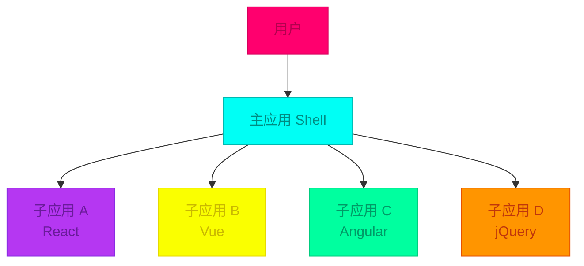
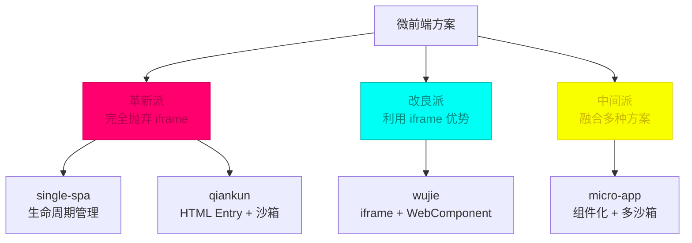
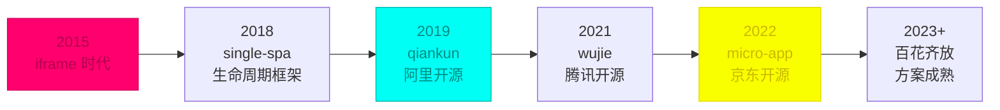
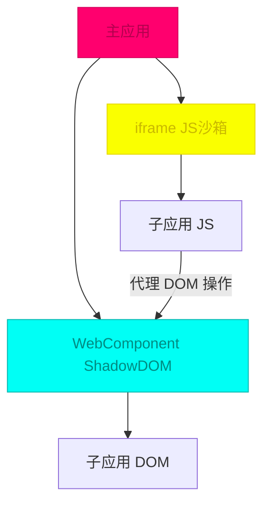
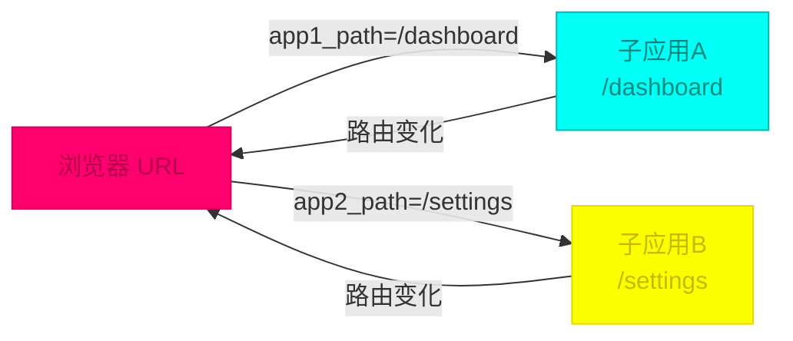
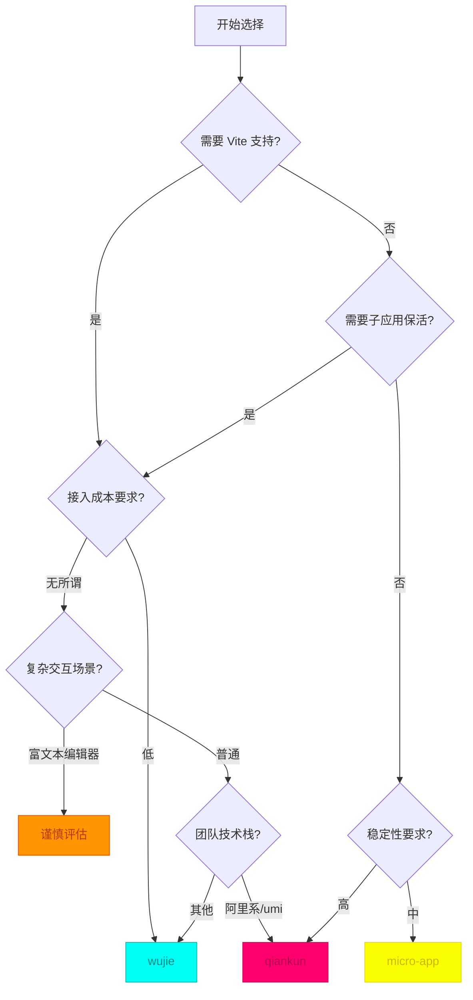

## 引言：巨石应用的困境

在前端开发的演进历程中，我们见证了从简单的多页应用到复杂的单页应用（SPA）的转变。然而，随着业务规模的不断扩大，单一的前端应用逐渐演变成难以维护的"巨石应用"（Frontend Monolith）：

- **代码库爆炸**：几个 GB 的前端代码库
- **团队协作困难**：数百号前端开发人员在一个仓库中协作
- **构建时间漫长**：数 MB 的 Bundle Size，构建动辄数十分钟
- **技术栈僵化**：一旦选定技术栈，升级和迁移成本极高
- **部署耦合**：任何小改动都需要重新部署整个应用

微前端架构正是在这样的背景下应运而生，它借鉴了微服务的理念，将单体前端应用拆分为多个可独立开发、独立部署的小型前端应用。

## 一、微前端的概念与价值

### 什么是微前端？

微前端是一种架构风格，它将微服务的理念应用于浏览器端，即将单页面前端应用由单一的单体应用转变为多个小型前端应用聚合为一的应用。



### 核心价值主张

| 维度 | 巨石应用 | 微前端 |
|------|----------|--------|
| **技术栈** | 统一技术栈 | 技术栈无关，各应用可选 |
| **开发团队** | 大团队协作 | 小团队独立开发 |
| **部署方式** | 整体部署 | 独立部署 |
| **构建速度** | 随代码量增加而变慢 | 各应用独立构建 |
| **故障隔离** | 一处问题影响全局 | 故障隔离，影响范围可控 |
| **升级成本** | 全量升级风险高 | 渐进式升级 |

### 微前端的核心要求

一个合格的微前端解决方案应该满足以下核心要求：

1. **技术栈无关**：主应用不限制接入应用的技术栈
2. **独立开发部署**：微应用仓库独立，前后端可独立开发
3. **应用隔离**：JS/CSS 互不影响，运行时环境隔离
4. **状态管理**：支持应用间通信和状态共享
5. **路由管理**：浏览器的前进、后退、刷新都能正常工作
6. **性能优化**：支持按需加载、预加载、缓存策略

## 二、从 iframe 说起

### iframe：浏览器原生的微前端方案

在微前端概念出现之前，iframe 是实现应用隔离的唯一原生方案：

```html
<!DOCTYPE html>
<html>
<head>
  <title>主应用</title>
</head>
<body>
  <header>主应用导航</header>
  <main>
    <iframe
      id="microApp1"
      src="https://app1.example.com"
      sandbox="allow-scripts allow-same-origin"
    ></iframe>
    <iframe
      id="microApp2"
      src="https://app2.example.com"
      sandbox="allow-scripts allow-same-origin"
    ></iframe>
  </main>
</body>
</html>

```

### iframe 的优势

| 优势 | 说明 |
|------|------|
| **原生隔离** | 浏览器提供的硬隔离，JS、CSS 完全隔离 |
| **安全沙箱** | sandbox 属性提供细粒度的权限控制 |
| **简单直接** | 无需复杂的框架，开箱即用 |
| **浏览器兼容** | 所有现代浏览器都支持 |

### iframe 的核心问题

尽管 iframe 提供了完美的隔离能力，但在实际应用中存在难以克服的问题：

#### 1. URL 不同步

```javascript
// iframe 内部路由变化不会同步到主应用 URL
iframe.contentWindow.history.pushState({}, '', '/iframe-route');
// 主应用 URL 没有变化，刷新后状态丢失

```

#### 2. 全局上下文隔离

```javascript
// 主应用
window.mainAppData = { user: 'alice' };

// iframe 内部无法直接访问
console.log(window.parent.mainAppData); // 可能因为跨域被阻止

```

#### 3. 弹窗和遮罩问题

```css
/* iframe 内的弹窗无法覆盖整个页面 */
.modal {
  position: fixed;
  top: 0;
  left: 0;
  /* 实际上只能在 iframe 范围内显示 */
}

```

#### 4. 性能问题

- 每次 iframe 加载都是完整的浏览器上下文重建
- 资源重复加载，无法共享缓存
- 内存占用高，多个 iframe 同时运行会显著增加内存消耗

```javascript
// iframe 加载时序
1. 创建新的浏览器上下文
2. 加载 HTML 文档
3. 解析 DOM
4. 加载 CSS 资源
5. 加载 JS 资源
6. 执行 JS 初始化
// 每一步都阻塞，用户体验差

```

### iframe vs 微前端

| 特性 | iframe | 微前端框架 |
|------|--------|------------|
| **URL 同步** | ❌ | ✅ |
| **弹窗全局化** | ❌ | ✅ |
| **上下文共享** | ❌ | ✅ |
| **性能优化** | ❌ | ✅ |
| **样式隔离** | ✅ | ✅ |
| **JS 隔离** | ✅ | ✅ |
| **开发体验** | 简单 | 需要学习成本 |

## 三、微前端技术方案演进

### 方案分类图谱

微前端方案按照技术实现方式可以分为三大派系：



### 演进时间线



## 四、主流微前端框架深度解析

### 4.1 single-spa：微前端的基石

**发布时间**：2018年
**GitHub**：single-spa/single-spa
**Star**：13k+
**定位**：最早的微前端框架，提供生命周期管理

#### 核心原理

single-spa 实现了一套生命周期机制，负责：
1. 注册子应用
2. 监听 URL 变化
3. 匹配路由规则
4. 加载对应子应用
5. 执行生命周期流程

#### 基本用法

```javascript
// 主应用 main.js
import { registerApplication, start } from 'single-spa';

// 加载函数：返回 Promise
function loadApp(url, globalVar) {
  return async () => {
    // 动态创建 script 标签加载子应用
    await createScript(url + '/js/chunk-vendors.js');
    await createScript(url + '/js/app.js');
    // 返回子应用暴露的生命周期函数
    return window[globalVar];
  };
}

// 注册子应用
registerApplication({
  name: 'app1',
  app: loadApp('http://localhost:8081', 'app1'),
  activeWhen: location => location.pathname.startsWith('/app1'),
  customProps: {}
});

registerApplication({
  name: 'app2',
  app: loadApp('http://localhost:8082', 'app2'),
  activeWhen: location => location.pathname.startsWith('/app2'),
  customProps: { domElement: document.getElementById('microApp') }
});

// 启动
start();

```

```javascript
// React 子应用入口
import React from 'react';
import ReactDOM from 'react-dom';
import rootComponent from './App';

// 独立运行时的渲染
if (!window.singleSpaNavigate) {
  ReactDOM.render(rootComponent(), document.getElementById('root'));
}

// 导出生命周期函数
export async function bootstrap(props) {
  console.log('app bootstrap');
}

export async function mount(props) {
  console.log('app mount');
  ReactDOM.render(rootComponent(), props.domElement || document.getElementById('root'));
}

export async function unmount(props) {
  console.log('app unmount');
  ReactDOM.unmountComponentAtNode(props.domElement || document.getElementById('root'));
}

```

#### 子应用打包配置

```javascript
// webpack.config.js
const package = require('./package.json');

module.exports = {
  output: {
    library: package.name,
    libraryTarget: 'umd',
    // webpack 5 需要
    chunkLoadingGlobal: `webpackJsonp_${package.name}`,
    globalObject: 'window'
  },
  devServer: {
    port: 8081,
    headers: {
      'Access-Control-Allow-Origin': '*'
    }
  }
};

```

#### 生命周期详解

single-spa 定义了以下生命周期：

```javascript
// 生命周期时序
Load → Bootstrap → Mount → Unmount

// 详细说明
bootstrap: 应用初始化，只执行一次
mount: 应用激活，每次进入时执行
unmount: 应用卸载，每次离开时执行
update: 可选，应用更新时执行

```

#### 优缺点分析

**优点**：
- 框架无关，支持 Vue、React、Angular 等任意技术栈
- 社区成熟，文档完善
- 轻量级，核心代码简洁

**缺点**：
- **需要手动加载子应用**：开发者需要自己实现 JS Entry 的加载逻辑
- **无 JS 沙箱**：需要额外集成 `single-spa-leaked-globals` 等库
- **无 CSS 隔离**：需要自己处理样式冲突
- **无法预加载**：不支持子应用的预加载机制
- **路由适配复杂**：子应用需要适配主应用的路由模式

---

### 4.2 qiankun：开箱即用的微前端框架

**发布时间**：2019年
**GitHub**：umijs/qiankun
**Star**：15k+
**定位**：基于 single-spa 的增强版，提供 HTML Entry 和沙箱机制

#### 核心改进

qiankun 在 single-spa 的基础上做了以下增强：

1. **HTML Entry**：无需手动梳理资源链接，自动解析 HTML
2. **JS 沙箱**：提供三套渐进增强的沙箱方案
3. **CSS 隔离**：支持 Shadow DOM 和样式前缀两种模式
4. **资源预加载**：在浏览器空闲时间预加载子应用资源
5. **全局状态管理**：提供应用间通信机制

#### 基本用法

```javascript
// 主应用 main.js
import { registerMicroApps, start, initGlobalState } from 'qiankun';

// 注册子应用
registerMicroApps([
  {
    name: 'react-app',
    entry: '//localhost:7100',
    container: '#subapp-container',
    activeRule: '/react-app',
    props: {
      routerBase: '/react-app'
    }
  },
  {
    name: 'vue-app',
    entry: '//localhost:7200',
    container: '#subapp-container',
    activeRule: '/vue-app'
  }
]);

// 初始化全局状态
const { onGlobalStateChange, setGlobalState } = initGlobalState({
  user: 'qiankun',
  token: ''
});

// 监听状态变化
onGlobalStateChange((value, prev) => {
  console.log('[主应用] state change:', value, prev);
});

// 启动
start({
  prefetch: true,  // 预加载
  sandbox: {
    strictStyleIsolation: true,  // 严格样式隔离
    // experimentalStyleIsolation: true  // 实验性样式隔离
  }
});

```

```javascript
// React 子应用入口 src/public-path.js
if (window.__POWERED_BY_QIANKUN__) {
  __webpack_public_path__ = window.__INJECTED_PUBLIC_PATH_BY_QIANKUN__;
}

```

```javascript
// React 子应用入口 src/index.js
import React from 'react';
import ReactDOM from 'react-dom';
import App from './App';

function render(props) {
  const { container } = props;
  ReactDOM.render(
    <App />,
    container ? container.querySelector('#root') : document.querySelector('#root')
  );
}

// 独立运行
if (!window.__POWERED_BY_QIANKUN__) {
  render({});
}

// 生命周期
export async function bootstrap() {
  console.log('[React App] bootstraped');
}

export async function mount(props) {
  console.log('[React App] mount, props:', props);
  render(props);

  // 监听全局状态
  props.onGlobalStateChange((state, prev) => {
    console.log('[React App] state change:', state, prev);
  });
}

export async function unmount(props) {
  const { container } = props;
  ReactDOM.unmountComponentAtNode(
    container ? container.querySelector('#root') : document.querySelector('#root')
  );
}

```

#### 子应用打包配置

```javascript
// React 子应用 .rescriptsrc.js 或 config-overrides.js
const { name } = require('./package.json');

module.exports = {
  webpack: (config) => {
    config.output.library = `${name}-[name]`;
    config.output.libraryTarget = 'umd';
    config.output.jsonpFunction = `webpackJsonp_${name}`;
    config.output.globalObject = 'window';
    return config;
  },
  devServer: (_) => {
    const config = _;
    config.headers = {
      'Access-Control-Allow-Origin': '*',
    };
    config.historyApiFallback = true;
    config.hot = false;
    config.watchContentBase = false;
    config.liveReload = false;
    return config;
  },
};

```

#### JS 沙箱机制详解

qiankun 提供了三套渐进增强的 JS 沙箱方案：

##### 1. 快照沙箱（SnapshotSandbox）

```javascript
class SnapshotSandbox {
  constructor() {
    this.windowSnapshot = {};
    this.modifyPropsMap = {};
  }

  // 激活沙箱
  active() {
    // 保存当前 window 快照
    this.windowSnapshot = {};
    for (const prop in window) {
      if (window.hasOwnProperty(prop)) {
        this.windowSnapshot[prop] = window[prop];
      }
    }

    // 恢复上次的修改
    Object.keys(this.modifyPropsMap).forEach(p => {
      window[p] = this.modifyPropsMap[p];
    });
  }

  // 失活沙箱
  inactive() {
    const modifyPropsMap = {};
    // 对比差异，记录修改
    for (const prop in window) {
      if (window[prop] !== this.windowSnapshot[prop]) {
        modifyPropsMap[prop] = window[prop];
        // 恢复环境
        window[prop] = this.windowSnapshot[prop];
      }
    }
    this.modifyPropsMap = modifyPropsMap;
  }
}

```

**特点**：
- 兼容性最好，支持 IE
- 只支持单实例模式
- 性能较差，需要遍历 window 对象

##### 2. 单例代理沙箱（LegacySandbox）

```javascript
class LegacySandbox {
  constructor() {
    this.addedPropsMapInSandbox = {};
    this.modifiedPropsOriginalValueMapInSandbox = {};
    this.currentUpdatedPropsValueMap = {};

    const fakeWindow = Object.create(null);

    this.proxyWindow = new Proxy(fakeWindow, {
      set(target, p, value) {
        if (!window.hasOwnProperty(p)) {
          this.addedPropsMapInSandbox[p] = value;
        } else if (!this.modifiedPropsOriginalValueMapInSandbox.hasOwnProperty(p)) {
          this.modifiedPropsOriginalValueMapInSandbox[p] = window[p];
        }
        this.currentUpdatedPropsValueMap[p] = value;
        window[p] = value;
        return true;
      },
      get(target, p) {
        return window[p];
      }
    });
  }
}

```

**特点**：
- 使用 Proxy 代理，性能优于快照沙箱
- 仍只支持单实例模式
- 不兼容 IE

##### 3. 多实例代理沙箱（ProxySandbox）

```javascript
class ProxySandbox {
  constructor() {
    const rawWindow = window;
    const fakeWindow = {};

    this.proxy = new Proxy(fakeWindow, {
      set(target, p, value) {
        target[p] = value;
        return true;
      },
      get(target, p) {
        return target[p] || rawWindow[p];
      },
      has(target, p) {
        return p in target || p in rawWindow;
      }
    });
  }

  active() {
    this.sandboxRunning = true;
  }

  inactive() {
    this.sandboxRunning = false;
  }
}

// 使用示例
const sandbox1 = new ProxySandbox();
const sandbox2 = new ProxySandbox();

((window) => {
  window.a = 'sandbox1';
  console.log(window.a); // sandbox1
})(sandbox1.proxy);

((window) => {
  window.a = 'sandbox2';
  console.log(window.a); // sandbox2
})(sandbox2.proxy);

console.log(window.a); // undefined - 真实的 window 没有被污染

```

**特点**：
- 支持多实例模式
- 完全隔离，不污染全局 window
- 需要浏览器支持 Proxy

#### CSS 隔离机制详解

qiankun 提供了两种 CSS 隔离模式：

##### 1. 严格模式（strictStyleIsolation）

```javascript
start({
  sandbox: {
    strictStyleIsolation: true
  }
});

```

实现原理：使用 WebComponent 的 Shadow DOM

```javascript
function strictStyleIsolation(container) {
  if (!container.shadowRoot) {
    const shadow = container.attachShadow({ mode: 'open' });
    // 将子应用内容移到 Shadow DOM 中
    while (container.firstChild) {
      shadow.appendChild(container.firstChild);
    }
  }
}

```

**优点**：
- 完全隔离 CSS
- 浏览器原生支持

**缺点**：
- 弹窗组件样式丢失（如 antd 的 Modal）
- React 17 之前的事件冒泡问题
- 某些依赖全局样式的方法失效

##### 2. 实验模式（experimentalStyleIsolation）

```javascript
start({
  sandbox: {
    experimentalStyleIsolation: true
  }
});

```

实现原理：给子应用的所有样式规则添加特殊选择器

```css
/* 原始样式 */
.title {
  font-size: 20px;
}

/* 转换后 */
div[data-qiankun="subapp"] .title {
  font-size: 20px;
}

```

```javascript
function scopedCSS(css, appName) {
  const prefix = `div[data-qiankun="${appName}"]`;

  return css.replace(/^([\s\S]*){/gm, (match) => {
    return match.replace(/^([^{]+){/, (selectors) => {
      return selectors.replace(/([^,]+)(,|$)/g, (item, selector, comma) => {
        // 处理各种选择器
        if (selector.includes(':root') || selector.includes('body')) {
          return `${prefix} ${selector.replace(/:root|body/g, '')}${comma}`;
        }
        return `${prefix} ${selector.trim()}${comma}`;
      });
    });
  });
}

```

**优点**：
- 不影响弹窗样式
- 可以继承主应用的部分样式

**缺点**：
- 运行时处理，有性能损耗
- 隔离不够彻底，可能被某些高优先级样式覆盖

#### HTML Entry 实现原理

qiankun 的 HTML Entry 是其核心特性之一：

```javascript
// 1. 获取子应用 HTML
const html = await fetch(entry).then(res => res.text());

// 2. 解析 HTML，提取资源
const { template, scripts, styles, entry } = importHTML(html);

// 3. 处理 CSS - 内联化
const embedHTML = await getEmbedHTML(template, styles);

// 4. 执行 JS - 沙箱化执行
const execScripts = () => {
  return getExternalScripts(scripts).then(scriptTexts => {
    return scriptTexts.map((scriptText, index) => {
      return execScripts(scriptText, proxy);
    });
  });
};

// 5. 获取生命周期
const lifecycle = await execScripts();

```

#### 优缺点分析

**优点**：
- **开箱即用**：HTML Entry 简化了子应用接入
- **完善的沙箱**：三套渐进增强的 JS 沙箱
- **样式隔离**：多种隔离模式可选
- **资源预加载**：支持空闲时预加载
- **生态成熟**：阿里内外大量应用验证
- **umi 插件**：`@umijs/plugin-qiankun` 一键接入

**缺点**：
- **子应用改造成本高**：webpack、路由、生命周期都需要适配
- **不支持 Vite**：eval 无法执行 ESM 代码，需要特殊插件
- **多实例不支持**：无法同时激活多个子应用
- **子应用保活不支持**：切换后状态会丢失
- **沙箱性能问题**：with + Proxy 有性能损耗

---

### 4.3 wujie：基于 WebComponent + iframe 的改良派

**发布时间**：2021年
**GitHub**：Tencent/wujie
**Star**：4k+
**定位**：利用 iframe 天然隔离能力，结合 WebComponent 实现渲染

#### 核心设计理念

wujie 认为：iframe 作为 JS 沙箱是非常可靠的，但其 DOM 渲染的限制可以通过 WebComponent 来解决。

**架构设计**：
- **JS**：在 iframe 中执行，利用原生隔离
- **DOM**：在 WebComponent 的 Shadow DOM 中渲染
- **连接**：通过代理 DOM 操作连接两者



#### 基本用法

```javascript
// 主应用 main.js
import WujieVue from 'wujie-vue';

// 设置子应用默认配置
WujieVue.setupApp({
  name: 'vue3-app',
  url: 'http://localhost:7300/',
  exec: true,        // 预执行
  alive: true,       // 子应用保活
  props: {
    data: '主应用传入的数据'
  }
});

// 启动
WujieVue.start();

```

```vue
<!-- 主应用组件 -->
<template>
  <div>
    <WujieVue
      width="100%"
      height="100%"
      name="vue3-app"
      :props="{ user: userInfo }"
      :alive="true"
      :sync="true"
      :fiber="true"
      @mounted="handleMounted"
    />
  </div>
</template>

<script>
import { WujieVue } from 'wujie-vue';

export default {
  components: { WujieVue },
  data() {
    return {
      userInfo: { name: 'Alice' }
    };
  },
  methods: {
    handleMounted() {
      console.log('子应用已挂载');
    }
  }
};
</script>

```

```javascript
// Vue3 子应用入口 main.js
let instance;

// 独立运行
if (!window.__WUJIE) {
  createApp(App).use(router).mount('#app');
}

// 导出生命周期（可选，保活模式需要）
export async function bootstrap(app) {
  console.log('子应用 bootstrap');
}

export async function mount(app) {
  instance = createApp(App);
  instance.use(router);
  instance.mount('#app');
}

export async function unmount(app) {
  instance?.unmount();
}

```

#### 核心实现原理

##### 1. JS 在 iframe 中执行

```javascript
// 创建纯净的 iframe
function createIframe() {
  const iframe = document.createElement('iframe');
  iframe.setAttribute('style', 'display: none');
  // 关键：设置为同域，便于通信
  iframe.src = 'about:blank';
  document.body.appendChild(iframe);

  const iframeWindow = iframe.contentWindow;
  const iframeDocument = iframeWindow.document;

  // 写入空文档
  iframeDocument.open();
  iframeDocument.write('<!DOCTYPE html><html><head></head><body></body></html>');
  iframeDocument.close();

  return { iframe, iframeWindow, iframeDocument };
}

```

##### 2. DOM 在 Shadow DOM 中渲染

```javascript
// 创建 WebComponent 容器
function createShadowRoot(host) {
  const shadowRoot = host.attachShadow({ mode: 'open' });
  return shadowRoot;
}

// 将子应用 DOM 插入 Shadow DOM
function renderApp(shadowRoot, html) {
  shadowRoot.innerHTML = html;
}

```

##### 3. 代理 DOM 操作

```javascript
// 代理 iframe 中的 document 操作指向 Shadow DOM
function patchDocument(iframeWindow, shadowRoot) {
  const proxyDocument = new Proxy(iframeWindow.document, {
    get(target, prop) {
      // 代理 DOM 查询方法
      if (['querySelector', 'querySelectorAll', 'getElementById'].includes(prop)) {
        return function(...args) {
          return shadowRoot[prop](...args);
        };
      }
      // 代理 body 和 head
      if (prop === 'body' || prop === 'head') {
        return shadowRoot.querySelector(prop);
      }
      return target[prop];
    }
  });

  iframeWindow.document = proxyDocument;
}

```

##### 4. 路由同步机制

```javascript
// 劫持 iframe 的 history.pushState
function syncPath(iframeWindow, appName) {
  const originalPushState = iframeWindow.history.pushState;
  const originalReplaceState = iframeWindow.history.replaceState;

  iframeWindow.history.pushState = function(...args) {
    const [state, title, path] = args;
    // 将子应用路径同步到主应用 URL 参数
    const mainAppUrl = new URL(window.location.href);
    mainAppUrl.searchParams.set(`${appName}_path`, path);
    window.history.replaceState(state, title, mainAppUrl.toString());

    return originalPushState.apply(this, args);
  };

  // 初始化时恢复路由
  const mainAppUrl = new URL(window.location.href);
  const subAppPath = mainAppUrl.searchParams.get(`${appName}_path`);
  if (subAppPath) {
    iframeWindow.history.replaceState(null, '', subAppPath);
  }
}

```

#### 运行模式

wujie 支持三种运行模式：

| 模式 | 条件 | 特点 |
|------|------|------|
| **重建模式** | 子应用无生命周期改造 | 切换时完全重建，状态丢失 |
| **单例模式** | 子应用导出生命周期函数 | 切换时卸载，状态保留在内存 |
| **保活模式** | 设置 `alive: true` | 子应用永不卸载，完全保留状态 |

#### 优缺点分析

**优点**：
- **接入成本低**：子应用几乎无需改造
- **Vite 原生支持**：ESM 代码可直接在 iframe 中执行
- **JS 隔离完善**：利用 iframe 原生能力
- **支持多实例**：可同时激活多个子应用
- **支持子应用保活**：状态和路由不丢失
- **兼容性好**：自动降级支持 IE9+

**缺点**：
- **富文本编辑器问题**：复杂的 DOM 代理可能影响富文本库
- **iframe 同域要求**：JS 沙箱 iframe 需要同域
- **内存开销**：保活模式下 iframe 常驻内存
- **相对较新**：社区和生态还在发展中

---

### 4.4 micro-app：功能最丰富的中间派

**发布时间**：2022年
**GitHub**：micro-zoe/micro-app
**Star**：5k+
**定位**：组件化使用体验，融合多种方案优势

#### 核心特点

micro-app 采用了一种"现实主义"的设计理念，融合了各家之长：

- **组件化 API**：类似 WebComponent 的使用方式
- **双沙箱支持**：with 沙箱 + iframe 沙箱
- **路由同步**：类似 wujie 的 URL 参数方案
- **样式隔离**：运行时添加前缀

#### 基本用法

```javascript
// 主应用 main.js
import microApp from '@micro-zoe/micro-app';

// 启动
microApp.start({
  // 全局配置
  'shadowDOM': true,          // 使用 shadow DOM
  'destroy': false,           // 不销毁子应用（保活）
  'inline': true,             // 使用 inline 模式
  'iframe': true,             // 使用 iframe 沙箱（兼容 vite）
});

```

```vue
<!-- 主应用组件 -->
<template>
  <div>
    <micro-app
      name="vue-app"
      url="http://localhost:7300/"
      iframe
      keep-alive
      :data="appData"
      @created="handleCreated"
      @mounted="handleMounted"
      @unmount="handleUnmount"
    />
  </div>
</template>

<script>
export default {
  data() {
    return {
      appData: { user: 'Alice' }
    };
  },
  methods: {
    handleCreated() {
      console.log('子应用创建');
    },
    handleMounted() {
      console.log('子应用挂载');
    },
    handleUnmount() {
      console.log('子应用卸载');
    }
  }
};
</script>

```

#### 优缺点分析

**优点**：
- **功能最丰富**：集成了各家之长
- **文档完善**：中文文档详细
- **接入成本低**：组件化使用方式
- **支持 Vite**：iframe 沙箱模式

**缺点**：
- **配置复杂**：功能丰富导致配置项繁多
- **静态资源补全**：基于父应用，可能需要手动调整
- **生态相对较小**：社区规模不如 qiankun

## 五、微前端核心技术深度解析

### 5.1 应用隔离机制详解

应用隔离是微前端的核心技术挑战，主要包括 JS 隔离和 CSS 隔离。

#### JS 隔离方案对比

| 方案 | 原理 | 优点 | 缺点 | 使用场景 |
|------|------|------|------|----------|
| **快照沙箱** | 记录 window 快照，恢复时还原 | 兼容性好 | 性能差，只支持单例 | 老旧浏览器 |
| **with 代理** | 使用 with 改变执行上下文 | 性能较好 | 严格模式不支持，性能损耗 | 简单应用 |
| **Proxy 代理** | 创建虚拟 window 对象 | 完全隔离，支持多例 | 不支持 IE | 现代浏览器 |
| **iframe 隔离** | 利用浏览器原生隔离 | 天然隔离，无性能问题 | 通信复杂，DOM 操作受限 | 复杂应用 |

#### CSS 隔离方案对比

| 方案 | 原理 | 优点 | 缺点 | 使用场景 |
|------|------|------|------|----------|
| **Shadow DOM** | 浏览器原生隔离 | 完全隔离 | 弹窗样式丢失 | 简单应用 |
| **样式前缀** | 运行时添加前缀 | 兼容性好 | 性能损耗，隔离不彻底 | 通用场景 |
| **CSS Modules** | 编译时生成唯一类名 | 编译时处理 | 需要改造子应用 | 新项目 |
| **工程化约定** | BEM 命名规范 | 简单 | 依赖团队规范 | 小团队 |

### 5.2 应用通信机制

微前端中的通信机制主要包括以下几种方式：

#### 1. 全局状态管理（qiankun）

```javascript
// 主应用
import { initGlobalState } from 'qiankun';

const { onGlobalStateChange, setGlobalState } = initGlobalState({
  user: { name: 'Alice', role: 'admin' },
  token: 'xxx'
});

// 监听变化
onGlobalStateChange((state, prev) => {
  console.log('State changed:', state, prev);
});

// 子应用
export async function mount(props) {
  // 获取状态
  console.log(props.getGlobalState());

  // 监听状态变化
  props.onGlobalStateChange((state, prev) => {
    console.log('[子应用] state changed:', state);
  });

  // 更新状态
  props.setGlobalState({ user: { name: 'Bob' } });
}

```

#### 2. EventBus 通信（wujie）

```javascript
// 主应用
import { bus } from 'wujie';

// 监听事件
bus.$on('data-change', (data) => {
  console.log('收到数据:', data);
});

// 发送事件
bus.$emit('data-change', { message: 'Hello from main' });

// 子应用
window.$wujie.bus.$on('data-change', (data) => {
  console.log('子应用收到:', data);
});

window.$wujie.bus.$emit('data-change', { from: 'subapp' });

```

#### 3. window.parent 直接通信

```javascript
// 子应用
const mainApp = window.parent;

// 发送消息
mainApp.postMessage({
  type: 'subapp-message',
  data: { message: 'Hello' }
}, '*');

// 主应用
window.addEventListener('message', (event) => {
  if (event.data.type === 'subapp-message') {
    console.log('收到子应用消息:', event.data);
  }
});

```

#### 4. Props 数据注入

```javascript
// 主应用
<WujieVue
  name="subapp"
  :props="{ user: userInfo, actions: mainActions }"
/>

// 子应用
const props = window.$wujie.props;
console.log(props.user);  // { name: 'Alice', ... }
props.actions.someMethod();  // 调用主应用方法

```

### 5.3 路由同步方案

微前端的路由同步主要解决以下问题：
1. 子应用路由变化如何同步到主应用 URL
2. 浏览器前进、后退如何正确处理
3. 刷新页面如何恢复子应用路由状态

#### 方案一：主应用路由劫持（qiankun、single-spa）

```javascript
// 主应用劫持路由变化
function routeChange() {
  const currentPath = window.location.pathname;

  // 匹配子应用路由规则
  if (currentPath.startsWith('/app1')) {
    // 激活 app1
    loadApp('app1', currentPath);
  } else if (currentPath.startsWith('/app2')) {
    // 激活 app2
    loadApp('app2', currentPath);
  }
}

// 监听路由变化
window.addEventListener('popstate', routeChange);
window.addEventListener('hashchange', routeChange);

```

#### 方案二：URL 参数同步（wujie、micro-app）

```javascript
// 将子应用路径存储在 URL 参数中
function syncSubAppPath(appName, path) {
  const url = new URL(window.location.href);
  url.searchParams.set(`${appName}_path`, path);
  window.history.replaceState(null, '', url.toString());
}

// 恢复子应用路径
function restoreSubAppPath(appName) {
  const url = new URL(window.location.href);
  const path = url.searchParams.get(`${appName}_path`);
  return path || '/';
}

// 示例：
// 主应用 URL: https://main.com/?app1_path=/dashboard&app2_path=/settings

```



### 5.4 资源加载优化

#### 静态资源预加载

```javascript
// qiankun 预加载
start({
  prefetch: 'all',  // 预加载所有子应用
  // prefetch: ['app1', 'app2'],  // 预加载指定子应用
  // prefetch: true,  // 预加载剩余子应用
});

// wujie 预加载
WujieVue.preloadApp({
  name: 'vue-app',
  url: 'http://localhost:7300/'
});

```

#### 子应用预执行（wujie）

```javascript
// 预执行可以在浏览器空闲时执行子应用 JS
WujieVue.setupApp({
  name: 'vue-app',
  url: 'http://localhost:7300/',
  exec: true  // 启用预执行
});

// Fiber 模式：分段执行，避免阻塞主线程
WujieVue.setupApp({
  name: 'vue-app',
  url: 'http://localhost:7300/',
  fiber: true  // 使用 requestIdleCallback 分段执行
});

```

#### 公共依赖共享

```javascript
// 主应用：导出公共依赖
import antd from 'antd';
import lodash from 'lodash';

window.sharedLibs = {
  antd,
  lodash
};

// 子应用：webpack 配置 external
module.exports = {
  externals: {
    'antd': 'root.sharedLibs.antd',
    'lodash': 'root.sharedLibs.lodash'
  }
};

```

## 六、微前端方案对比总结

### 综合对比表

| 特性 | single-spa | qiankun | wujie | micro-app |
|------|------------|---------|-------|-----------|
| **发布时间** | 2018 | 2019 | 2021 | 2022 |
| **核心方案** | 生命周期管理 | HTML Entry + 沙箱 | iframe + WebComponent | 组件化 + 双沙箱 |
| **JS 隔离** | ❌ 需额外库 | ✅ 三套沙箱 | ✅ iframe 原生 | ✅ with + iframe |
| **CSS 隔离** | ❌ 需额外库 | ✅ Shadow DOM + 前缀 | ✅ Shadow DOM | ✅ 前缀 |
| **子应用保活** | ❌ | ❌ | ✅ | ✅ |
| **多实例** | ❌ | ❌ | ✅ | ✅ |
| **Vite 支持** | ⚠️ 需改造 | ❌ 需插件 | ✅ 原生 | ✅ iframe 模式 |
| **接入成本** | 高 | 高 | 低 | 中 |
| **学习成本** | 中 | 中 | 低 | 中 |
| **社区规模** | 大 | 最大 | 中 | 中 |
| **文档质量** | 好 | 优秀 | 好 | 优秀 |
| **GitHub Star** | 13k+ | 15k+ | 4k+ | 5k+ |
| **维护团队** | 社区 | 阿里 | 腾讯 | 京东 |

### 选型决策树



### 选型建议

#### 选择 qiankun 的场景

✅ 团队使用 umi 技术栈
✅ 需要成熟稳定的解决方案
✅ 不需要子应用保活
✅ 不需要 Vite 子应用
✅ 有充足的改造和调试时间

#### 选择 wujie 的场景

✅ 需要快速接入，低改造成本
✅ 使用 Vite 构建子应用
✅ 需要子应用保活功能
✅ 需要同时激活多个子应用
✅ 有富文本编辑器需充分测试

#### 选择 micro-app 的场景

✅ 需要组件化的使用体验
✅ 需要丰富的配置选项
✅ 对文档质量要求高
✅ 需要灵活的沙箱选择

#### 选择 single-spa 的场景

✅ 需要完全自定义的控制
✅ 团队有充足的前端能力
✅ 对包体积有严格要求
✅ 技术栈统一且可控

## 七、微前端实施最佳实践

### 7.1 子应用改造清单

#### 必要改造

```javascript
// 1. 导出生命周期函数
export async function bootstrap() {}
export async function mount(props) {}
export async function unmount(props) {}

// 2. 配置 public-path
if (window.__POWERED_BY_QIANKUN__) {
  __webpack_public_path__ = window.__INJECTED_PUBLIC_PATH_BY_QIANKUN__;
}

// 3. 配置 CORS
devServer: {
  headers: {
    'Access-Control-Allow-Origin': '*'
  }
}

// 4. 配置 webpack output
output: {
  library: `${name}-[name]`,
  libraryTarget: 'umd',
  globalObject: 'window'
}

```

#### 可选改造

```javascript
// 1. 路由适配
function render(props = {}) {
  const { container } = props;
  router = createRouter({
    base: window.__POWERED_BY_QIANKUN__ ? '/app/' : '/',
    mode: 'history'
  });
}

// 2. 请求适配
axios.defaults.baseURL = window.__POWERED_BY_QIANKUN__
  ? '/api/proxy'
  : '/api';

// 3. 全局样式适配
// 避免使用全局 body、html 选择器
// 使用 scoped 或 CSS Modules

```

### 7.2 性能优化策略

#### 1. 代码分割

```javascript
// webpack 配置
module.exports = {
  optimization: {
    splitChunks: {
      chunks: 'all',
      cacheGroups: {
        vendor: {
          test: /[\\/]node_modules[\\/]/,
          name: 'vendors',
          priority: 10
        }
      }
    }
  }
};

```

#### 2. 预加载策略

```javascript
// 策略1：预加载所有子应用
start({ prefetch: 'all' });

// 策略2：预加载剩余子应用
start({ prefetch: true });

// 策略3：手动指定预加载
start({ prefetch: ['app1', 'app3'] });

// 策略4：智能预加载（根据用户行为）
const userBehavior = analyzeUserBehavior();
const likelyApps = predictNextApps(userBehavior);
start({ prefetch: likelyApps });

```

#### 3. 缓存策略

```javascript
// Service Worker 缓存
self.addEventListener('fetch', (event) => {
  const url = new URL(event.request.url);

  // 缓存子应用资源
  if (url.pathname.startsWith('/micro-app/')) {
    event.respondWith(
      caches.match(event.request).then((response) => {
        return response || fetch(event.request).then((fetchResponse) => {
          return caches.open('micro-app-cache').then((cache) => {
            cache.put(event.request, fetchResponse.clone());
            return fetchResponse;
          });
        });
      })
    );
  }
});

```

### 7.3 错误处理与监控

```javascript
// 全局错误捕获
window.addEventListener('error', (event) => {
  console.error('全局错误:', event.error);
  // 上报错误
  reportError({
    type: 'global-error',
    message: event.error?.message,
    stack: event.error?.stack,
    app: currentApp
  });
});

// Promise 错误捕获
window.addEventListener('unhandledrejection', (event) => {
  console.error('Promise 错误:', event.reason);
  reportError({
    type: 'promise-error',
    reason: event.reason,
    app: currentApp
  });
});

// qiankun 生命周期错误处理
registerMicroApps([
  {
    name: 'app1',
    entry: '...',
    container: '#container',
    activeRule: '/app1',
    errorBoundary(err) {
      console.error('子应用错误:', err);
      // 渲染错误页面
      renderErrorPage(err);
    }
  }
]);

```

### 7.4 开发调试技巧

#### 1. 本地开发联调

```javascript
// 开发环境配置
const isDev = process.env.NODE_ENV === 'development';

registerMicroApps([
  {
    name: 'app1',
    entry: isDev
      ? 'http://localhost:7100'  // 本地开发地址
      : 'https://app1.example.com',  // 生产地址
    container: '#container',
    activeRule: '/app1'
  }
]);

```

#### 2. 热更新支持

```javascript
// qiankun 开发模式
start({
  sandbox: {
    strictStyleIsolation: false  // 开发时关闭严格隔离，便于调试
  }
});

```

#### 3. Chrome DevTools 调试

```javascript
// 在子应用中添加调试标记
if (process.env.NODE_ENV === 'development') {
  window.__SUB_APP_NAME__ = 'app1';
  window.__SUB_APP_VERSION__ = '1.0.0';
}

// 在控制台中快速定位
console.log(
  '%c%s',
  'background: #ff006e; color: white; padding: 4px;',
  `[${window.__SUB_APP_NAME__}] 子应用日志`
);

```

## 八、微前端架构的未来展望

### 当前趋势

1. **技术方案趋于成熟**：主流框架都有大量生产实践
2. **工具链不断完善**：配套的构建、调试、监控工具逐步完善
3. **标准化探索**：WebComponents 的浏览器支持越来越好

### 潜在挑战

1. **性能优化**：多个子应用的加载、执行、渲染性能
2. **开发体验**：调试、测试、部署的复杂度
3. **长期维护**：跨团队协作、版本管理、技术债务

### 未来方向

1. **模块联邦（Module Federation）**：Webpack 5 的原生模块共享方案
2. **ESM 原生支持**：利用浏览器的 ES Module 能力
3. **边缘计算集成**：与 Serverless、边缘渲染结合

## 总结

微前端架构通过将单一应用拆分为多个小型前端应用，实现了技术栈无关、独立开发部署、团队自治等价值。本文从概念、原理、框架对比、最佳实践等多个维度全面解析了微前端技术：

- **qiankun**：成熟稳定，适合 umi 技术栈，但改造成本较高
- **wujie**：接入成本低，原生支持 Vite，适合快速集成
- **micro-app**：功能丰富，文档完善，适合需要灵活配置的场景

选择微前端方案时，需要综合考虑团队技术栈、业务需求、改造成本、长期维护等因素。没有银弹，只有最适合自己团队的方案。

---

**参考资源**：

- [qiankun 官方文档](https://qiankun.umijs.org/zh)
- [single-spa GitHub](https://github.com/single-spa/single-spa)
- [wujie 官方文档](https://wujie-micro.github.io/doc/)
- [micro-app 官方文档](https://micro-zoe.github.io/micro-app/)
- [Micro Frontends](https://micro-frontends.org/)
