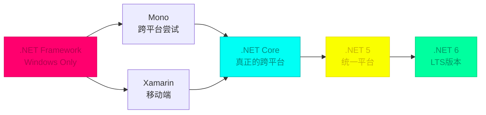
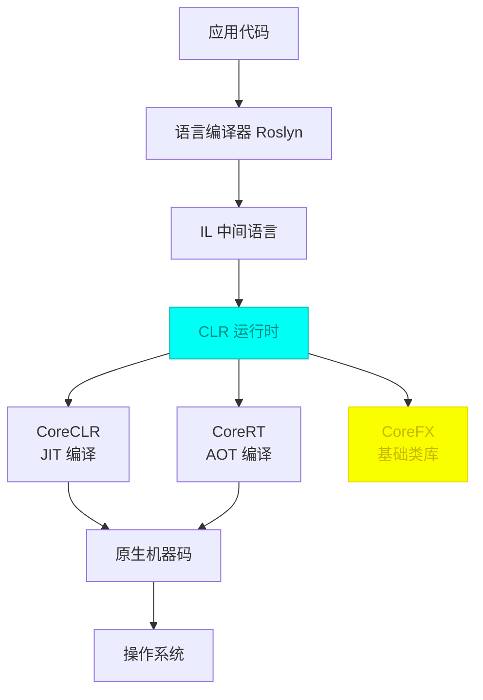
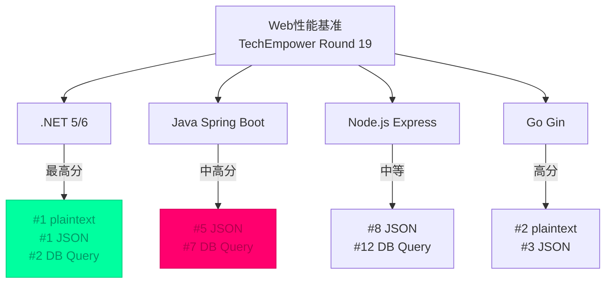

## 引言：一个 .NET 开发者的技术旅程

### 个人技术栈演进回顾

回顾微软的技术开发历程，就像一部浓缩的微软技术发展史：

```
ASP → VB → VB.NET → ASP.NET WebForms → WinForms → ASP.NET MVC → Silverlight → WPF → .NET Core MVC + Avalonia UI
```

**早期时代**：从 ASP 的服务器端脚本起步，经历了 VB.NET 、WebForms、WinForms 的事件驱动与控件化抽象，虽然它屏蔽了底层细节，但开发效率是顶级的。

**MVC 时代**：ASP.NET MVC 的发布让开发体验有了质的飞跃，分离关注点、可测试性，路由、中间件、过滤器、配置化这些概念至今仍在指导着我的架构设计。

**桌面端**：WPF 带来的 XAML 和 MVVM 模式，让我对声明式 UI 和数据绑定有了深刻理解。Silverlight 的遗憾退出，让我第一次意识到跨平台的重要性。

**跨时代**：.NET Core 的出现，加上其跨平台的能力，让我可以在 Linux 上使用熟悉的 C# 和 MVC等技术 开发BS/CS应用（《[Avalonia UI：WPF 开发者的跨平台首选](/avalonia-ui)》）。

**转向 Java**：2011年，因项目需求，技术重心逐步转向 Java 开发，并系统性深入研究 Spring、Dubbo 以及 Spring Cloud 生态体系。在这个过程中，我以一个"外来者"的视角，重新审视 .NET 的跨平台发展历程。

### 文章背景

写下这篇文章的原因，是希望系统性梳理自己在 .NET 平台上的开发经历。从 .NET Core 1.0时期就尝试过其BS的跨平台能力，后探索其CS跨平台特性，再又持续关注社区与生态体系的演进。

之前在 Linux 环境下使用 JetBrains Rider 进行 .NET 开发，整体开发体验与 Windows 基本保持一致，发布的应用跨平台能力也很出色，让我切身体会到：.NET Core 的跨平台能力，已经在工程层面得到了充分实现。相比早期阶段，这一能力在稳定性、开发体验与社区建设上均在成长。

同时，在转向 Java 微服务技术栈后，我发现 .NET 和 Java 两个生态在云原生时代呈现出了有趣的互补关系。希望通过这篇文章，以一个 .NET 开发者的视角，全面回顾 .NET 的跨平台之路，对比 Java 企业级生态，探讨 2021 年 .NET 的现状与未来。

---

## 一、.NET 的跨平台之路

### 历史回顾



### .NET Framework 时代：Windows 的特权

早期的 .NET Framework 是微软 Windows 平台的专属框架，虽然在开发体验上非常优秀，但也因此被贴上了"闭源"、"非跨平台"的标签。

**优点**：
- Visual Studio 强大的开发体验
- 完善的基础类库（BCL）
- Windows 平台的深度集成

**局限**：
- 仅支持 Windows 系统
- 闭源，社区参与度低
- 版本更新受制于 Windows 发布周期

### Mono：跨平台的先行者

[Xamarin](https://dotnet.microsoft.com/apps/xamarin) 公司（后被微软收购）开发的 Mono 项目，是 .NET 跨平台的第一次重要尝试。

**Mono 的贡献**：
- 首次实现 .NET 在 Linux 和 macOS 上的运行
- 支持 Unity 游戏引擎的脚本开发
- 为后来的 Xamarin 移动开发奠定基础

**问题**：
- 与 .NET Framework 存在兼容性问题
- 社区维护，功能更新滞后
- 性能和稳定性不及原生 .NET Framework

### .NET Core：真正的跨平台

**2016年**，微软发布了 .NET Core 1.0，这是 .NET 历史上的一个重要里程碑：

> .NET Core 是一个开源、跨平台的 .NET 实现，支持 Windows、Linux 和 macOS。

**关键特性**：
- 完全开源，托管在 GitHub 上
- 模块化设计，可以按需引用
- 高性能，启动速度快
- 真正的跨平台支持

### .NET 5：统一的开端

**2020年**，.NET 5 的发布标志着平台战略的重大转变：

- 命名上跳过了 .NET 4.x，避免与 .NET Framework 混淆
- 统一了 .NET Core、Mono、Xamarin 的 Runtime
- 建立了单一的基础类库（BCL）
- 为 .NET 的未来发展奠定了统一的基础

### .NET 6：LTS 版本的成熟

**2021年**，.NET 6 作为 LTS（长期支持）版本发布：

- 支持 C# 10
- 性能进一步提升
- 云原生特性增强
- MAUI（跨平台移动/桌面框架）正式版
- 热重载功能改进

---

## 二、.NET Core 跨平台架构解析

### 核心组件一览

| 组件 | 说明 | 跨平台支持 |
|------|------|------------|
| **ASP.NET Core** | 高性能 Web 框架 | ✅ 全平台 |
| **Entity Framework Core** | 轻量级 ORM | ✅ 全平台 |
| **Blazor** | WebAssembly 前端框架 | ✅ 浏览器 |
| **Xamarin** | 移动开发框架 | ✅ iOS/Android |
| **Avalonia UI** | 跨平台桌面框架 | ✅ Win/Linux/macOS |
| **.NET MAUI** | 统一 UI 框架 | ✅ 2021 发布 |

### 运行时架构



**CoreCLR**：跨平台的通用语言运行时，负责 JIT 编译和内存管理。

**CoreFX**：基础类库，提供集合、IO、线程等基础功能。

**Roslyn**：编译器平台，支持 C# 和 Visual Basic。

**CLI**：统一的命令行工具（`dotnet`），支持所有开发工作流。

### 开发模型

```bash
# 创建项目
dotnet new webapi -n MyApi

# 还原依赖
dotnet restore

# 运行项目
dotnet run

# 发布项目
dotnet publish -c Release -r linux-x64
```

---

## 三、Entity Framework Core：跨平台的 ORM 选择

### EF Core 的演进

Entity Framework Core 是 .NET 的官方 ORM 框架，与 .NET Core 同步发展：

| 版本 | 发布时间 | 重要特性 |
|------|----------|----------|
| **EF6** | 2012 | .NET Framework 时代，Windows Only |
| **EF Core 1.0** | 2016 | 首个跨平台版本，功能精简 |
| **EF Core 2.0** | 2017 | 查询改进、LINQ 增强 |
| **EF Core 3.1** | 2019 | 稳定版本，与 .NET Core 3.1 同步 |
| **EF Core 6.0** | 2021 | LTS 版本，性能大幅提升 |

### EF Core 6.0 新特性（2021）

```csharp
// 1. 编译模型 - 启动性能提升
public class MyDbContext : DbContext
{
    protected override void OnConfiguring(DbContextOptionsBuilder options)
        => options.UseSqlServer("连接字符串")
                  .EnableSensitiveDataLogging()
                  .EnableDetailedErrors();

    public DbSet<User> Users { get; set; }
    public DbSet<Order> Orders { get; set; }
}

// 2. 临时表 - SQL Server 支持
await context.Database.ExecuteSqlRawAsync(
    "CREATE TABLE #TempUsers (Id INT, Name NVARCHAR(50))");

// 3. 迁移包 - 部署优化
dotnet ef migrations add InitialCreate
dotnet ef migrations bundle --self-contained

// 4. JSON 列 - 更好的文档数据库支持
protected override void OnModelCreating(ModelBuilder modelBuilder)
{
    modelBuilder.Entity<User>()
        .Property(e => e.Metadata)
        .HasJsonConversion();
}
```

**性能优化**：
- 查询编译缓存改进
- 批量操作性能提升
- 内存占用优化

### 数据库提供程序

EF Core 的跨平台能力，很大程度上得益于丰富的数据库提供程序：

```csharp
// SQL Server - Windows/Linux
options.UseSqlServer("连接字符串");

// PostgreSQL - 全平台
options.UseNpgsql("连接字符串");

// MySQL - 全平台
options.UseMySQL("连接字符串");

// SQLite - 嵌入式，全平台
options.UseSqlite("Data Source=app.db");

// Cosmos DB - 云原生
options.UseCosmos("endpoint", "key", "database");
```

### 代码示例：完整的 CRUD 操作

```csharp
public class UserService
{
    private readonly MyDbContext _context;

    public UserService(MyDbContext context)
    {
        _context = context;
    }

    // 创建
    public async Task<User> CreateUserAsync(string name, string email)
    {
        var user = new User { Name = name, Email = email };
        _context.Users.Add(user);
        await _context.SaveChangesAsync();
        return user;
    }

    // 查询
    public async Task<User> GetUserAsync(int id)
    {
        return await _context.Users
            .Include(u => u.Orders)
            .FirstOrDefaultAsync(u => u.Id == id);
    }

    // 更新
    public async Task UpdateUserAsync(User user)
    {
        _context.Users.Update(user);
        await _context.SaveChangesAsync();
    }

    // 删除
    public async Task DeleteUserAsync(int id)
    {
        var user = await _context.Users.FindAsync(id);
        if (user != null)
        {
            _context.Users.Remove(user);
            await _context.SaveChangesAsync();
        }
    }

    // 复杂查询
    public async Task<List<User>> GetActiveUsersWithOrdersAsync()
    {
        return await _context.Users
            .Where(u => u.IsActive)
            .Include(u => u.Orders)
            .Where(u => u.Orders.Any(o => o.Status == "Completed"))
            .OrderByDescending(u => u.CreatedAt)
            .Take(100)
            .ToListAsync();
    }
}
```

---

## 四、.NET 微服务生态 vs Java Spring Cloud

### 服务注册与发现

#### Java 生态

**Eureka**（Netflix）：
```yaml
# application.yml
eureka:
  client:
    serviceUrl:
      defaultZone: http://localhost:8761/eureka/
  instance:
    preferIpAddress: true
```

**Consul**（HashiCorp）：
```yaml
cloud:
  consul:
    discovery:
      serviceName: user-service
      hostname: localhost
```

**Nacos**（阿里）：
```yaml
spring:
  cloud:
    nacos:
      discovery:
        server-addr: localhost:8848
```

#### .NET 生态

**Steeltoe**（Spring Cloud 的 .NET 移植）：
```csharp
// Startup.cs
public void ConfigureServices(IServiceCollection services)
{
    services.AddDiscoveryClient(Configuration);
    services.AddMvc();
}

public void Configure(IApplicationBuilder app)
{
    app.UseMvc();
    app.UseDiscoveryClient();
}

// appsettings.json
{
  "spring": {
    "application": {
      "name": "order-service"
    }
  },
  "eureka": {
    "client": {
      "serviceUrl": "http://localhost:8761/eureka/",
      "shouldRegisterWithEureka": true
    },
    "instance": {
      "port": 8010
    }
  }
}
```

**Consul 原生支持**：
```csharp
services.AddConsulClient(options =>
{
    options.Address = new Uri("http://localhost:8500");
});

services.AddConsulServiceRegistration(options =>
{
    options.ID = "order-service-1";
    options.Name = "order-service";
    options.Address = "localhost";
    options.Port = 8010;
});
```

### API 网关对比

| 特性 | Spring Cloud Gateway | .NET YARP | Ocelot |
|------|----------------------|-----------|--------|
| **性能** | 中等 | 高（基于 Kestrel） | 中等 |
| **配置** | Java YAML | .NET JSON/代码 | .NET JSON |
| **扩展性** | Filter 机制 | Middleware 管道 | Middleware |
| **社区** | 成熟 | 微软官方 | 社区维护 |
| **路由** | 声明式 | 编程式 | 声明式 |

**YARP（Yet Another Reverse Proxy）** 是微软官方开源的 reverse proxy 库：

```csharp
// Program.cs
builder.Services.AddReverseProxy()
    .LoadFromConfig(builder.Configuration.GetSection("ReverseProxy"));

builder.Services.AddCors(options =>
{
    options.AddDefaultPolicy(policy =>
    {
        policy.AllowAnyOrigin()
              .AllowAnyMethod()
              .AllowAnyHeader();
    });
});

var app = builder.Build();

app.MapReverseProxy();

app.Run();
```

```json
// appsettings.json
{
  "ReverseProxy": {
    "Routes": {
      "user-service-route": {
        "ClusterId": "user-service",
        "Match": {
          "Path": "/api/users/{**catch-all}"
        },
        "Transforms": [
          { "PathPattern": "/api/users/{**catch-all}" }
        ]
      }
    },
    "Clusters": {
      "user-service": {
        "Destinations": {
          "destination1": {
            "Address": "https://localhost:5001"
          }
        }
      }
    }
  }
}
```

### 配置中心

#### Java
- **Spring Cloud Config**：Git/ SVN 后端
- **Apollo**：携程开源
- **Nacos**：阿里开源

#### .NET
- **Steeltoe Config**：与 Spring Cloud Config 兼容
- **Azure App Configuration**：云原生方案
- **Consul KV**：简单可靠

```csharp
// Consul 配置读取
services.AddConsulConfig(options =>
{
    options.Options =
    {
        Address = new Uri("http://localhost:8500"),
        Token = "consul-token"
    };
});

services.Configure<MyOptions>(
    Configuration.GetSection("MyOptions")
);
```

### 链路追踪与监控

#### Java
- **Sleuth + Zipkin**：Spring Cloud 全家桶
- **SkyWalking**：国产 APM
- **Micrometer**：指标门面

#### .NET
- **Application Insights**：Azure 原生
- **OpenTelemetry**：跨平台标准
- **Steeltoe Management**：与 Java 生态互通

```csharp
// OpenTelemetry 集成
builder.Services.AddOpenTelemetryTracing(tracing =>
{
    tracing.AddAspNetCoreInstrumentation()
           .AddHttpClientInstrumentation()
           .AddSource("MyService")
           .SetResourceBuilder(
               ResourceBuilder.CreateDefault()
                   .AddService("my-service"))
           .AddZipkinExporter(options =>
           {
               options.Endpoint = new Uri("http://localhost:9411/api/v2/spans");
           });
});
```

### 服务间通信

#### gRPC 在 .NET 中的实现

```protobuf
// protos/greeter.proto
syntax = "proto3";

service Greeter {
  rpc SayHello (HelloRequest) returns (HelloReply) {}
}

message HelloRequest {
  string name = 1;
}

message HelloReply {
  string message = 1;
}
```

```csharp
// Server 端
public class GreeterService : Greeter.GreeterBase
{
    public override Task<HelloReply> SayHello(
        HelloRequest request,
        ServerCallContext context)
    {
        return Task.FromResult(new HelloReply
        {
            Message = $"Hello {request.Name}"
        });
    }
}

// Program.cs
app.MapGrpcService<GreeterService>();
```

```csharp
// Client 端
using var channel = GrpcChannel.ForAddress("https://localhost:5001");
var client = new Greeter.GreeterClient(channel);

var reply = await client.SayHelloAsync(
    new HelloRequest { Name = "World" });
```

**gRPC vs REST API**：

| 特性 | gRPC | REST API |
|------|------|----------|
| **协议** | HTTP/2 | HTTP/1.1/2 |
| **序列化** | Protocol Buffers | JSON |
| **性能** | 高 | 中等 |
| **代码生成** | 自动 | 手动 |
| **浏览器支持** | 需要代理 | 原生 |

---

## 五、容器化与云原生

### Docker 支持

#### 多阶段构建示例

```dockerfile
# .NET 5 多阶段构建
FROM mcr.microsoft.com/dotnet/sdk:5.0 AS build
WORKDIR /src

# 复制项目文件
COPY ["MyApp.csproj", "./"]
RUN dotnet restore

# 复制源代码并发布
COPY . .
RUN dotnet publish -c Release -o /app

# 运行时镜像
FROM mcr.microsoft.com/dotnet/aspnet:5.0
WORKDIR /app
COPY --from=build /app .
ENTRYPOINT ["dotnet", "MyApp.dll"]
```

#### Docker Compose 编排

```yaml
version: '3.8'

services:
  user-service:
    build: ./services/user-service
    environment:
      - ASPNETCORE_ENVIRONMENT=Development
      - ConnectionStrings__DefaultConnection=Server=sql-server;Database=UserDb;...
    depends_on:
      - sql-server
    ports:
      - "5001:80"

  order-service:
    build: ./services/order-service
    environment:
      - ASPNETCORE_ENVIRONMENT=Development
      - UserServiceUrl=http://user-service
    depends_on:
      - user-service
    ports:
      - "5002:80"

  sql-server:
    image: mcr.microsoft.com/mssql/server:2019-latest
    environment:
      - ACCEPT_EULA=Y
      - SA_PASSWORD=YourPassword123
    ports:
      - "1433:1433"
```

### Kubernetes 支持

#### Deployment 示例

```yaml
apiVersion: apps/v1
kind: Deployment
metadata:
  name: user-service
spec:
  replicas: 3
  selector:
    matchLabels:
      app: user-service
  template:
    metadata:
      labels:
        app: user-service
    spec:
      containers:
      - name: user-service
        image: myregistry/user-service:1.0.0
        ports:
        - containerPort: 80
        env:
        - name: ASPNETCORE_ENVIRONMENT
          value: "Production"
        - name: ConnectionStrings__DefaultConnection
          valueFrom:
            secretKeyRef:
              name: db-secrets
              key: connection-string
        livenessProbe:
          httpGet:
            path: /health
            port: 80
          initialDelaySeconds: 30
          periodSeconds: 10
        readinessProbe:
          httpGet:
            path: /health/ready
            port: 80
          initialDelaySeconds: 5
          periodSeconds: 5
---
apiVersion: v1
kind: Service
metadata:
  name: user-service
spec:
  selector:
    app: user-service
  ports:
  - port: 80
    targetPort: 80
  type: LoadBalancer
```

#### Health Checks 实现

```csharp
// Program.cs
builder.Services.AddHealthChecks()
    .AddDbContextCheck<MyDbContext>()
    .AddSqlServer(connectionString)
    .AddUrlGroup(new Uri("https://api.external.com"), "external-api")
    .AddCheck("memory", new MemoryHealthCheck(1024));

var app = builder.Build();

app.MapHealthChecks("/health", new HealthCheckOptions
{
    ResponseWriter = UIResponseWriter.WriteHealthCheckUIResponse
});

app.MapHealthChecks("/health/ready", new HealthCheckOptions
{
    Predicate = check => check.Tags.Contains("ready")
});

app.MapHealthChecks("/health/live", new HealthCheckOptions
{
    Predicate = _ => false
});
```

### Helm Charts

```bash
# 官方 Helm Chart
helm repo add bitnami https://charts.bitnami.com/bitnami
helm install my-app bitnami/aspnet-core

# 自定义 Chart
helm install user-service ./charts/user-service \
  --set image.tag=1.0.0 \
  --set replicaCount=3 \
  --set env.ASPNETCORE_ENVIRONMENT=Production
```

### 云服务集成对比

| 平台 | Java 支持 | .NET 支持 | 备注 |
|------|-----------|-----------|------|
| **AWS** | Lambda/EKS | Lambda/EKS | .NET Core 支持良好 |
| **Azure** | App Service | App Service | .NET 原生，最佳支持 |
| **GCP** | Cloud Run | Cloud Run | 容器化部署 |
| **阿里云** | ECS/ACK | ECS/ACK | 容器化部署 |
| **腾讯云** | CVM/TKE | CVM/TKE | 容器化部署 |

---

## 六、开发生态对比

### IDE 与工具

#### .NET 生态

| 工具 | 平台 | 特点 |
|------|------|------|
| **Visual Studio 2022** | Windows | 最强大的 .NET IDE |
| **JetBrains Rider** | Win/Lin/mac | 跨平台，性能优秀 |
| **VS Code** | 全平台 | 轻量级，插件丰富 |
| **Visual Studio for Mac** | macOS | 轻量版 VS |

#### Java 生态

| 工具 | 平台 | 特点 |
|------|------|------|
| **IntelliJ IDEA** | 全平台 | Java 开发首选 |
| **Eclipse** | 全平台 | 老牌 IDE |
| **VS Code** | 全平台 | 轻量级 |

### 性能基准测试

根据 [TechEmpower Web Framework Benchmarks](https://www.tepemwerformance.org/) 的数据：



**关键数据**：
- **.NET 5** 在 plaintext 测试中排名第一（~7M req/s）
- **.NET 5** 在 JSON 序列化测试中排名第一（~1.5M req/s）
- **Spring Boot** 表现稳定，但性能低于 .NET
- **Go** 在简单场景下性能接近 .NET

### 社区与生态规模

#### Java 优势

| 方面 | 说明 |
|------|------|
| **历史** | 25+ 年历史，生态极其丰富 |
| **开源框架** | Spring 全家桶、Apache 系列 |
| **企业案例** | 阿里、京东等大厂深度实践 |
| **国内社区** | Spring Cloud Alibaba、Dubbo |

#### .NET 优势

| 方面 | 说明 |
|------|------|
| **官方支持** | Microsoft 全力投入 |
| **性能** | 多项基准测试领先 |
| **开发体验** | C# 语言特性、IDE 工具 |
| **跨平台** | .NET Core 后社区快速增长 |

### 编程语言对比：C# vs Java

java与c#，从语言层面上c#一直是更先进的代表

| 特性 | C# | Java |
|------|-----|------|
| **属性** | ✅ 自动属性 | ❌ 需要 getter/setter |
| **LINQ** | ✅ 语言集成查询 | ❌ Stream API |
| **异步** | ✅ async/await | ✅ CompletableFuture |
| **泛型** | ✅ 协变/逆变 | ⚠️ 有限支持 |
| **模式匹配** | ✅ 强大 | ⚠️ Java 17 引入 |
| **记录类型** | ✅ record | ✅ Java 17 record |
| **默认方法** | ✅ 扩展方法 | ✅ 默认方法 |

```csharp
// C# 示例：现代语言特性
public record User(int Id, string Name, string Email);

public async Task<Result<User>> GetUserAsync(int id)
{
    return await _context.Users
        .Where(u => u.Id == id)
        .Select(u => new User(u.Id, u.Name, u.Email))
        .FirstOrDefaultAsync()
        is User user
            ? Result.Success(user)
            : Result.NotFound<User>();
}
```

```java
// Java 示例
public record User(int id, String name, String email) {}

public CompletableFuture<Result<User>> getUserAsync(int id) {
    return users.stream()
        .filter(u -> u.id() == id)
        .findFirst()
        .map(user -> Result.success(user))
        .orElse(Result.notFound());
}
```

---

## 七、实战案例：Spring Cloud + .NET Core 混合架构

### 架构设计

在实际项目中，我见过很多 Spring Cloud 与 .NET Core 混合部署的架构。参考龙向辉的系列文章，典型的混合架构如下：

```
┌─────────────────────────────────────────────────────────────┐
│                         客户端层                              │
│                    Web / Mobile / Desktop                    │
└─────────────────────────────────────────────────────────────┘
                              ↓
┌─────────────────────────────────────────────────────────────┐
│                      API 网关层                               │
│              Java Zuul / Spring Cloud Gateway                │
└─────────────────────────────────────────────────────────────┘
                              ↓
┌─────────────────────────────────────────────────────────────┐
│                     服务注册与发现                            │
│                  Java Eureka / Consul                        │
└─────────────────────────────────────────────────────────────┘
                              ↓
┌─────────────────────────────────────────────────────────────┐
│                      微服务层                                 │
├───────────────────────────┬─────────────────────────────────┤
│   .NET Core Services      │   Java Spring Services          │
│                           │                                 │
│  • Order Service          │  • User Service                 │
│  • Payment Service        │  • Product Service              │
│  • Inventory Service      │  • Notification Service         │
│                           │                                 │
│   Steeltoe Integration    │   Spring Cloud Integration      │
└───────────────────────────┴─────────────────────────────────┘
                              ↓
┌─────────────────────────────────────────────────────────────┐
│                   认证与授权层                                │
│              IdentityServer4 / Keycloak                      │
└─────────────────────────────────────────────────────────────┘
                              ↓
┌─────────────────────────────────────────────────────────────┐
│                      数据层                                   │
│     SQL Server / PostgreSQL / MongoDB / Redis               │
└─────────────────────────────────────────────────────────────┘
```

### .NET Core 服务接入 Eureka

#### 1. 安装 Steeltoe 包

```bash
dotnet add package Steeltoe.Discovery.ClientCore
dotnet add package Steeltoe.Extensions.Configuration.ConfigServerCore
```

#### 2. 配置服务注册

```csharp
// Startup.cs
public class Startup
{
    public void ConfigureServices(IServiceCollection services)
    {
        // 添加服务发现客户端
        services.AddDiscoveryClient(Configuration);
        services.AddControllers();

        // 添加 HttpClient 工厂
        services.AddHttpClient("UserService")
            .AddServiceDiscovery();
    }

    public void Configure(IApplicationBuilder app, IWebHostEnvironment env)
    {
        if (env.IsDevelopment())
        {
            app.UseDeveloperExceptionPage();
        }

        app.UseRouting();
        app.UseEndpoints(endpoints =>
        {
            endpoints.MapControllers();
        });

        // 启动服务发现客户端
        app.UseDiscoveryClient();
    }
}
```

#### 3. 配置文件

```json
// appsettings.json
{
  "spring": {
    "application": {
      "name": "order-service"
    }
  },
  "eureka": {
    "client": {
      "serviceUrl": "http://localhost:8761/eureka/",
      "shouldRegisterWithEureka": true,
      "shouldFetchRegistry": true,
      "registryFetchIntervalSeconds": 30
    },
    "instance": {
      "port": 8010,
      "ipAddress": "localhost",
      "preferIpAddress": true,
      "healthCheckUrlPath": "/health",
      "statusPageUrlPath": "/status"
    }
  }
}
```

#### 4. 健康检查端点

```csharp
[ApiController]
[Route("/")]
public class HealthController : ControllerBase
{
    [HttpGet("health")]
    public IActionResult Health()
    {
        return Ok(new { status = "UP" });
    }

    [HttpGet("status")]
    public IActionResult Status()
    {
        return Ok(new
        {
            app = "order-service",
            status = "UP",
            version = "1.0.0"
        });
    }
}
```

### 服务间调用示例

#### 使用 DiscoveryHttpClientHandler

```csharp
public class OrderController : ControllerBase
{
    private readonly DiscoveryHttpClientHandler _handler;
    private readonly ILogger<OrderController> _logger;

    public OrderController(IDiscoveryClient client, ILogger<OrderController> logger)
    {
        _handler = new DiscoveryHttpClientHandler(client);
        _logger = logger;
    }

    [HttpGet("{id}/user")]
    public async Task<ActionResult<UserDto>> GetUserForOrder(int id)
    {
        // 创建使用服务发现的 HttpClient
        var client = new HttpClient(_handler);

        try
        {
            // 通过服务名调用，自动负载均衡
            var response = await client.GetStringAsync("http://user-service/api/users/current");
            var user = JsonSerializer.Deserialize<UserDto>(response);

            return Ok(user);
        }
        catch (Exception ex)
        {
            _logger.LogError(ex, "调用 user-service 失败");
            return StatusCode(503, "服务暂时不可用");
        }
    }
}
```

#### 使用 HttpClientFactory（推荐）

```csharp
// Startup.cs
services.AddHttpClient("UserService", client =>
{
    client.BaseAddress = new Uri("http://user-service/");
})
.AddServiceDiscovery()
.AddRoundRobinLoadBalancer()
.AddPolicyHandler(GetRetryPolicy());

static IAsyncPolicy<HttpResponseMessage> GetRetryPolicy()
{
    return HttpPolicyExtensions
        .HandleTransientHttpError()
        .OrResult(msg => msg.StatusCode == System.Net.HttpStatusCode.ServiceUnavailable)
        .WaitAndRetryAsync(3, retryAttempt => TimeSpan.FromSeconds(Math.Pow(2, retryAttempt)));
}

// Controller
public class OrderController : ControllerBase
{
    private readonly IHttpClientFactory _httpClientFactory;

    public OrderController(IHttpClientFactory httpClientFactory)
    {
        _httpClientFactory = httpClientFactory;
    }

    [HttpGet("{id}/user")]
    public async Task<ActionResult<UserDto>> GetUserForOrder(int id)
    {
        var client = _httpClientFactory.CreateClient("UserService");

        var response = await client.GetAsync("api/users/current");
        response.EnsureSuccessStatusCode();

        var user = await response.Content.ReadFromJsonAsync<UserDto>();
        return Ok(user);
    }
}
```

### 配置中心集成

```csharp
// Program.cs
builder.Configuration.AddConfigServer(options =>
{
    options.Environment = "Development";
    options.Name = "order-service";
    options.Label = "master";
    options.Uri = "http://localhost:8888";
});

var app = builder.Build();
```

### 混合架构的最佳实践

1. **统一服务注册**：使用 Consul 或 Eureka 作为统一的服务注册中心
2. **统一配置管理**：使用 Spring Cloud Config Server 或 Consul KV
3. **统一认证授权**：使用 IdentityServer4 或 Keycloak
4. **统一链路追踪**：使用 Zipkin 或 SkyWalking
5. **服务边界清晰**：.NET 和 Java 服务之间通过明确的 API 通信
6. **基础设施即代码**：使用 Docker Compose / Kubernetes 编排

---

## 八、企业级应用框架

除了基础的 .NET Core 和 Spring Cloud，两个生态都有成熟的企业级应用框架：

| 框架 | 生态 | 特点 |
|------|------|------|
| **ABP Framework** | .NET | DDD 实践、多租户、模块化 |
| **Orchard Core** | .NET | CMS 模块化框架 |
| **Spring Boot** | Java | 约定优于配置、开箱即用 |
| **JHipster** | Java | 代码生成器、微服务脚手架 |

**ABP Framework** 是 .NET 生态中值得关注的框架，提供了 DDD 架构的最佳实践，包括模块化、多租户、权限管理、审计日志等企业级特性。

相比之下，**Spring Boot** 的生态更为成熟，有更多开箱即用的集成方案。

---

## 九、2021年的技术选择建议

### 选择 .NET Core 的场景

| 场景 | 原因 |
|------|------|
| ✅ 需要高性能的 Web API | .NET 在 TechEmpower 基准测试中领先 |
| ✅ Windows 团队转向跨平台 | C# 和 Visual Studio 熟悉度高 |
| ✅ 微服务架构中的高性能服务 | gRPC 原生支持，性能优异 |
| ✅ 需要优秀的开发体验 | C# 语言特性、IDE 工具完善 |
| ✅ Azure 云环境部署 | .NET 在 Azure 上有最佳支持 |
| ✅ 跨平台桌面应用 | Avalonia UI / MAUI |
| ✅ 企业级应用开发 | 有成熟的框架支持（如 ABP） |

### 选择 Java Spring Cloud 的场景

| 场景 | 原因 |
|------|------|
| ✅ 已有 Java 技术栈 | 避免技术栈分裂 |
| ✅ 需要丰富的开源组件 | Spring 生态极其丰富 |
| ✅ 团队熟悉 Java 生态 | 降低学习成本 |
| ✅ 需要成熟的微服务解决方案 | Spring Cloud 全家桶 |
| ✅ 国内企业级应用 | Spring Cloud Alibaba 完善 |
| ✅ 大数据处理 | Java 大数据生态成熟 |

### 混合架构的建议

```
推荐架构模式：

服务注册/发现 → Consul（统一）
API 网关        → 根据团队选择（Zuul / YARP）
认证授权        → IdentityServer4 / Keycloak
配置中心        → Consul KV / Nacos
链路追踪        → Zipkin / SkyWalking

业务服务        → 各语言优势发挥
                • 高性能服务 → .NET Core
                • 业务复杂服务 → Java Spring
                • 数据处理服务 → Java / Go
```

### 技术决策框架

```
                技术选型决策
                    |
          ┌─────────┴─────────┐
          |                   |
    团队技能              项目需求
          |                   |
    .NET 经验丰富 → .NET Core
    Java 经验丰富 → Java
    混合团队        → 混合架构
```

---

## 十、总结与展望

### .NET 的成熟度

站在 2021 年的视角，.NET 已经完成了从 Windows Only 到真正跨平台的蜕变：

| 方面 | 2016 (.NET Core 1.0) | 2021 (.NET 6) |
|------|---------------------|---------------|
| **跨平台** | 实验性 | 生产级 |
| **性能** | 中等 | 行业领先 |
| **生态** | 贫乏 | 快速增长 |
| **工具** | 基础 | 完善 |
| **云原生** | 有限 | 全面支持 |

### 未来展望

#### .NET 7/8+

- **持续创新**：C# 语言特性增强
- **性能提升**：持续优化运行时
- **云原生**：更好的 Azure 集成

#### MAUI

- 统一移动和桌面开发
- 真正的跨平台 UI

#### Blazor

- WebAssembly 成熟
- 服务端渲染增强
- 与 JavaScript 互操作

#### AI/ML

- ML.NET 持续发展
- 与 Azure AI 集成

### 个人感悟

回顾这段技术旅程，我有几点感悟：

1. **技术选择无绝对优劣**
   .NET 和 Java 都在各自领域发光发热。关键是选择适合团队和项目的方案。

2. **生态多样性是好事**
   多种技术并存，促进了技术进步。开发者也应该拥抱多样性，而不是固守一隅。

3. **.NET 的进步显著**
   从闭源的 .NET Framework 到开源跨平台的 .NET Core，微软的转变值得肯定。2021 年的 .NET 已经是成熟的跨平台解决方案。

4. **Java 微服务生态仍领先，但差距在缩小**
   Spring Cloud 的生态深度仍然是 .NET 难以比拟的，但 .NET 社区发展迅速，Steeltoe、YARP 等项目正在缩小差距。

5. **混合架构是现实选择**
   在大型企业中，技术栈往往是多样的。关键是要有统一的治理策略，而不是强制技术栈统一。

---

## 参考资料

### 官方文档
- [.NET Documentation](https://docs.microsoft.com/dotnet/)
- [ASP.NET Core Documentation](https://docs.microsoft.com/aspnet/core/)
- [Entity Framework Core](https://docs.microsoft.com/ef/core/)

### 社区资源
- [Steeltoe Documentation](https://steeltoe.io/)
- [Avalonia UI](https://avaloniaui.net/)
- [TechEmpower Benchmarks](https://www.techempower.com/benchmarks/)

### 相关文章
- [Avalonia UI：WPF 开发者的跨平台首选](/avalonia-ui)

---

*写于 2021 年 6 月，一个正在探索微服务与云原生的 .NET 开发者*
