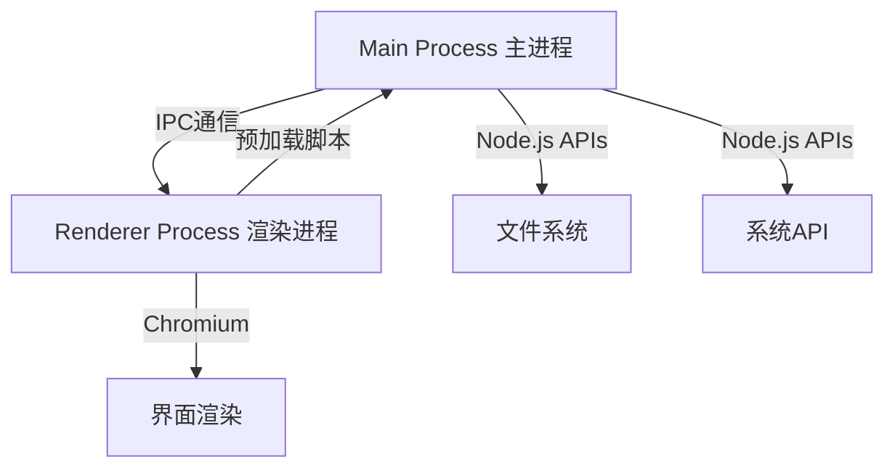
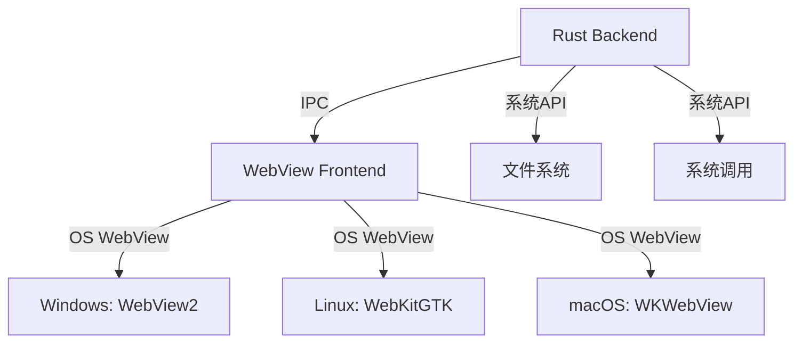
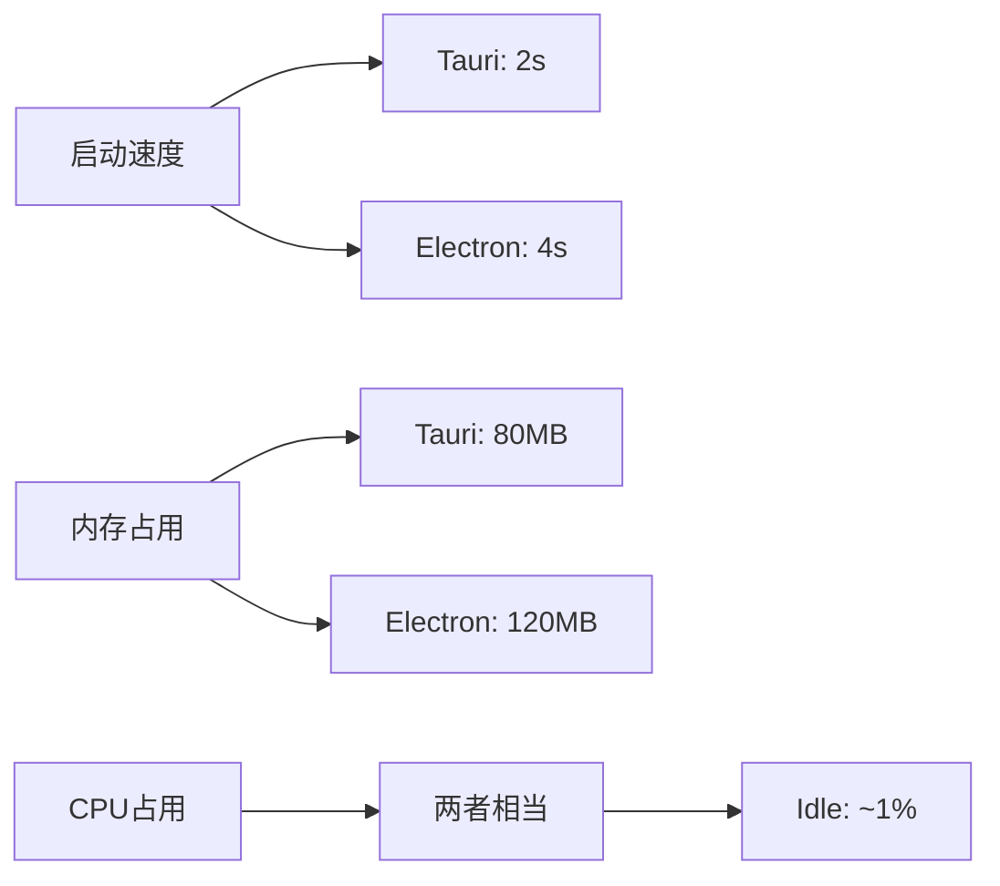
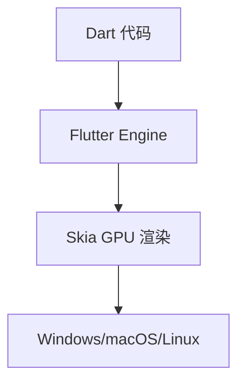
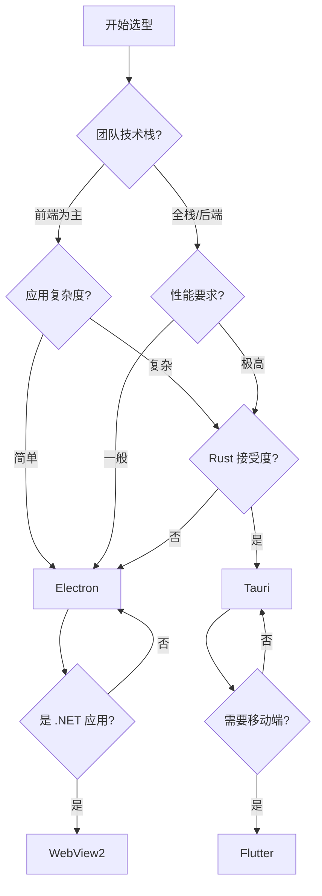
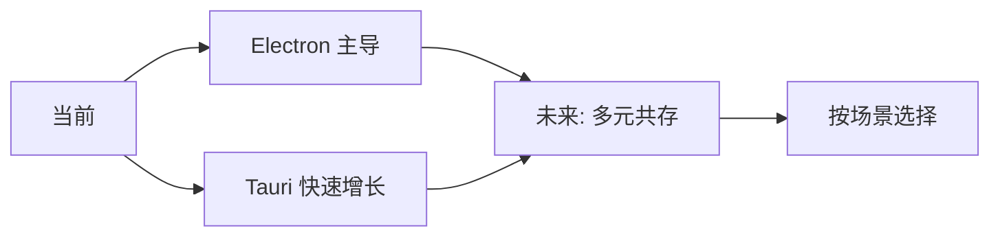

在当今的软件开发领域，跨平台桌面应用开发已成为一个热门话题。随着 Web 技术的成熟，使用 HTML、CSS 和 JavaScript 构建桌面应用已成为主流选择。本文将深入对比当前最流行的两大框架——Electron 和 Tauri，同时探讨 NW.js、Flutter、Microsoft Edge WebView2 等其他技术方案。

## 一、跨平台桌面应用开发生态

### 1.1 技术演进

```
早期 → NW.js (node-webkit) → Electron → Tauri
     ↓ 2013    ↓ 2013        ↓ 2014     ↓ 2021
     Intel    GitHub         GitHub    Tauri Apps
```

### 1.2 主要技术方案对比

| **方案** | **底层技术** | **前端渲染** | **后端逻辑** | **发布年份** |
|---------|-------------|-------------|-------------|-------------|
| **NW.js** | Chromium + Node.js | Chromium | Node.js | 2013 |
| **Electron** | Chromium + Node.js | Chromium | Node.js | 2014 |
| **Tauri** | OS WebView + Rust | 系统WebView | Rust | 2021 |
| **WebView2** | Edge WebView2 | Edge WebView2 | .NET/JS | 2020 |
| **Flutter** | Skia + Dart | 自绘引擎 | Dart | 2017 |

## 二、Electron：成熟的霸主

### 2.1 核心架构

Electron 采用**双进程架构**：



**主进程职责**：
- 创建和管理应用窗口
- 控制应用生命周期
- 使用 Node.js API 与系统交互

**渲染进程职责**：
- 负责界面渲染
- 运行前端代码
- 通过 IPC 与主进程通信

### 2.2 技术特点

| **优势** | **劣势** |
|---------|---------|
| ✅ 成熟生态系统 | ❌ 应用体积大（150MB+） |
| ✅ 丰富的 API | ❌ 内存占用高 |
| ✅ 跨平台一致性 | ❌ 启动速度慢 |
| ✅ Node.js 完整支持 | ❌ 安全性配置复杂 |
| ✅ 大量成功案例（VS Code、Slack） | ❌ 资源消耗显著 |

### 2.3 典型应用

- **VS Code** - 微软开发的神器
- **Slack** - 团队协作平台
- **Discord** - 游戏社区应用
- **Notion** - 笔记与协作工具
- **Figma** - 设计协作工具（桌面版）

## 三、Tauri：轻量级的挑战者

### 3.1 核心架构

Tauri 采用**现代化架构**：



**关键技术决策**：
- **前端**：使用系统原生 WebView（不捆绑 Chromium）
- **后端**：使用 Rust 替代 Node.js
- **IPC**：基于 tauri-glue 的类型安全通信
- **安全**：默认最小权限原则

### 3.2 技术特点

| **优势** | **劣势** |
|---------|---------|
| ✅ 应用体积小（~2-5MB） | ❌ 生态系统较新 |
| ✅ 内存占用低 | ❌ 学习曲线陡峭（需要 Rust） |
| ✅ 启动速度快 | ❌ WebView 兼容性差异 |
| ✅ 内置安全机制 | ❌ 社区资源较少 |
| ✅ 性能优秀 | ❌ 部分高级功能待完善 |

### 3.3 真实数据对比

基于 Authme（双因素认证应用）的实测数据：

| **指标** | **Tauri** | **Electron** | **优势** |
|---------|----------|-------------|---------|
| **安装包大小** | ~2.5MB | ~85MB | **Tauri 34x 更小** |
| **启动时间** | ~2秒 | ~4秒 | **Tauri 快 2x** |
| **内存占用** | ~80MB (Windows) | ~120MB (Windows) | **Tauri 省 33%** |
| **Linux 内存** | ~50MB | ~200MB | **Tauri 省 75%** |

## 四、深度对比分析

### 4.1 打包体积

**为什么 Electron 这么大？**

```
Electron 应用组成：
┌─────────────────────────┐
│ Chromium (~150MB)       │ ← 完整浏览器引擎
├─────────────────────────┤
│ Node.js Runtime (~30MB) │ ← JavaScript 运行时
├─────────────────────────┤
│ 你的应用代码             │
└─────────────────────────┘

Tauri 应用组成：
┌─────────────────────────┐
│ 你的应用代码             │
├─────────────────────────┤
│ Rust 后端 (~5MB)        │
└─────────────────────────┘
WebView 由系统提供 ✓
```

### 4.2 开发体验

**Electron**：

```javascript
// 主进程 (main.js)
const { app, BrowserWindow } = require('electron')
const path = require('path')

function createWindow() {
  const win = new BrowserWindow({
    width: 800,
    height: 600,
    webPreferences: {
      preload: path.join(__dirname, 'preload.js')
    }
  })
  win.loadFile('index.html')
}

app.whenReady().then(createWindow)
```

**Tauri**：

```rust
// src-tauri/src/main.rs
#![cfg_attr(
    all(not(debug_assertions), target_os = "windows"),
    windows_subsystem = "windows"
)]

fn main() {
    tauri::Builder::default()
        .run(tauri::generate_context!())
        .expect("error while running tauri application");
}
```

```typescript
// 前端调用 Rust API
import { invoke } from '@tauri-apps/api/tauri'

// 调用 Rust 命令
const result = await invoke('greet', { name: 'World' })
```

### 4.3 性能对比



### 4.4 渲染机制

| **特性** | **Electron** | **Tauri** |
|---------|-------------|----------|
| **渲染引擎** | 内置 Chromium | 系统 WebView |
| **Windows** | Chromium | Edge WebView2 |
| **Linux** | Chromium | WebKitGTK |
| **macOS** | Chromium | WKWebView |
| **一致性** | ✅ 完全一致 | ⚠️ 轻微差异 |
| **CSS 前缀** | -webkit- | 需手动添加 |

**WebView 兼容性问题**：

Tauri 使用系统 WebView，这意味着：
- **优点**：更小的体积，利用系统更新
- **缺点**：不同系统的 WebView 版本可能不同
- **解决方案**：使用 Autoprefixer 或 PostCSS 添加浏览器前缀

```bash
# 安装 Autoprefixer
npm install -D autoprefixer postcss postcss-cli

# 配置 postcss.config.js
module.exports = {
  plugins: [
    require('autoprefixer')({
      overrideBrowserslist: ['> 0.5%', 'last 2 versions']
    })
  ]
}
```

### 4.5 安全性

**Electron 安全挑战**：

```javascript
// ⚠️ 危险配置（不推荐）
webPreferences: {
  nodeIntegration: true,        // 允许渲染进程直接使用 Node
  contextIsolation: false,       // 禁用上下文隔离
  enableRemoteModule: true       // 允许远程模块
}

// ✅ 安全配置（推荐）
webPreferences: {
  nodeIntegration: false,        // 禁用 Node 集成
  contextIsolation: true,         // 启用上下文隔离
  sandbox: true,                  // 启用沙箱
  preload: path.join(__dirname, 'preload.js') // 使用预加载脚本
}
```

**Tauri 默认安全**：

```rust
// Tauri 采用"默认安全"原则
#[tauri::command]
fn greet(name: &str) -> String {
    format!("Hello, {}!", name)
}

// 只有显式暴露的命令才能被前端调用
```

### 4.6 后端技术栈

| **需求** | **Electron** | **Tauri** | **推荐** |
|---------|-------------|----------|---------|
| **快速开发** | ✅ Node.js / JavaScript | ⚠️ 需要 Rust 学习 | Electron |
| **性能优先** | ⚠️ V8 限制 | ✅ Rust 性能 | Tauri |
| **类型安全** | ⚠️ TypeScript 可选 | ✅ Rust 原生 | Tauri |
| **现有 JS 代码** | ✅ 直接复用 | ⚠️ 需重写后端 | Electron |

## 五、其他技术方案

### 5.1 NW.js

NW.js（原名 node-webkit）是 Electron 的前辈：

```javascript
// NW.js 配置 (package.json)
{
  "main": "index.html",
  "window": {
    "toolbar": false,
    "width": 800,
    "height": 600
  }
}
```

**特点**：
- ✅ 更简单的进程模型
- ✅ 可以直接在 HTML 中使用 Node API
- ❌ 社区活跃度不如 Electron
- ❌ 文档和工具链较老

### 5.2 Flutter Desktop

Flutter 使用自绘引擎：



**优势**：
- ✅ 真正的跨平台（包括移动端）
- ✅ 性能接近原生
- ✅ UI 一致性最好
- ❌ 学习 Dart 语言
- ❌ 包体积仍然较大
- ❌ Web 技术无法复用

### 5.3 Microsoft Edge WebView2

WebView2 是微软提供的现代 Web 嵌入方案：

```csharp
// .NET 集成 WebView2
await webView.EnsureCoreWebView2Async();

string runtimePath = @"C:\Program Files\Microsoft\EdgeWebView\Application";
await webView.EnsureCoreWebView2AsyncWithOptions(
    new CoreWebView2EnvironmentOptions(
        RuntimePath: runtimePath
    )
);
```

**分发模式**：

| **模式** | **优点** | **缺点** | **适用场景** |
|---------|---------|---------|-------------|
| **Evergreen** | 自动更新 | 依赖系统环境 | 大多数应用 |
| **Fixed** | 版本可控 | 需手动更新 | 受控环境 |
| **Bootstrapper** | 在线安装 | 首次需联网 | 新部署 |

## 六、技术选型建议

### 6.1 决策树



### 6.2 场景推荐

| **场景** | **推荐方案** | **理由** |
|---------|-------------|---------|
| **快速原型** | Electron | 生态成熟，上手快 |
| **企业内部工具** | Tauri | 体积小，分发简单 |
| **已有 Web 应用** | Electron | 代码复用率高 |
| **性能敏感** | Tauri / Flutter | 资源占用低 |
| **需要移动端** | Flutter | 一套代码多端运行 |
| **.NET 技术栈** | WebView2 | 与现有系统集成 |
| **学习型项目** | Tauri | 学习 Rust，现代化工具链 |

### 6.3 迁移建议

**从 Electron 迁移到 Tauri**：

1. **保持前端不变**：Tauri 兼容所有前端框架
2. **重写后端逻辑**：Node.js → Rust
3. **使用 Sidecar 模式**：如果无法重写，可将 Node 应用作为 Sidecar

```toml
# src-tauri/tauri.conf.json
{
  "tauri": {
    "bundle": {
      "externalBin": [
        {
          "src": "https://github.com/your/repo/releases/download/v1.0.0/server",
          "dest": "server"
        }
      ]
    }
  }
}
```

## 七、最佳实践

### 7.1 Electron 优化

```javascript
// 1. 按需加载窗口
const windows = new Map()

function getWindow(id) {
  if (!windows.has(id)) {
    const win = new BrowserWindow({ /* ... */ })
    windows.set(id, win)
    win.on('closed', () => windows.delete(id))
  }
  return windows.get(id)
}

// 2. 延迟加载非关键资源
app.on('ready', async () => {
  // 先加载核心界面
  createMainWindow()

  // 后台加载其他模块
  setTimeout(() => {
    loadBackgroundServices()
  }, 2000)
})

// 3. 使用 preload 替代 nodeIntegration
// preload.js
const { contextBridge, ipcRenderer } = require('electron')

contextBridge.exposeInMainWorld('api', {
  readFile: (path) => ipcRenderer.invoke('read-file', path)
})
```

### 7.2 Tauri 最佳实践

```rust
// 1. 命令返回 Result 类型
#[tauri::command]
fn read_file(path: String) -> Result<String, String> {
    std::fs::read_to_string(&path)
        .map_err(|e| e.to_string())
}

// 2. 使用 Serde 处理复杂数据
use serde::{Deserialize, Serialize};

#[derive(Serialize, Deserialize)]
struct User {
    id: u32,
    name: String,
}

#[tauri::command]
fn get_user(id: u32) -> Result<User, String> {
    // ...
}

// 3. 异步命令
#[tauri::command]
async fn fetch_data(url: String) -> Result<String, String> {
    let resp = reqwest::get(&url).await.map_err(|e| e.to_string())?;
    resp.text().await.map_err(|e| e.to_string())
}
```

### 7.3 通用建议

```yaml
开发前检查:
  ✓ 确定目标平台（Windows/macOS/Linux）
  ✓ 评估团队技术栈
  ✓ 考虑应用复杂度
  ✓ 规划更新策略

开发中注意:
  ✓ 使用版本控制
  ✓ 编写自动化测试
  ✓ 监控性能指标
  ✓ 做好安全配置

发布前准备:
  ✓ 代码签名（Windows/macOS）
  ✓ 打包体积优化
  ✓ 启动速度优化
  ✓ 更新服务器配置
```

## 八、未来展望

### 8.1 Tauri 发展路线

- ✅ **Deno 后端支持**：可以使用 JavaScript/TypeScript 编写后端
- ✅ **iOS/Android 支持**：真正的全平台框架
- ✅ **更好的插件生态**：社区驱动的插件系统
- ✅ **WASM 支持**：WebAssembly 集成

### 8.2 行业趋势



## 九、总结

在跨平台桌面应用开发领域，**没有银弹**。

**Electron** 仍然是：
- ✅ 最成熟的选择
- ✅ 生态系统最完善
- ✅ 上手最简单
- ✅ 适合快速开发和原型验证

**Tauri** 代表着：
- ✅ 更现代化的架构
- ✅ 更优秀的性能
- ✅ 更小的体积
- ✅ 更好的安全性
- ⚠️ 需要投入学习成本

**我的建议**：

1. **新项目**：优先考虑 Tauri，除非有明确的 Electron 依赖需求
2. **现有 Electron 项目**：评估迁移成本，可能不值得
3. **团队有 Rust 经验**：Tauri 是更好的选择
4. **团队纯 Web 背景**：Electron 或等待 Tauri 的 Deno 后端

**关键问题**：问自己，应用的核心价值是什么？如果是 Web 界面，Electron 已经够好；如果追求极致性能和用户体验，Tauri 值得学习。

---

> *推荐延伸阅读：*
> *- [Tauri 官方文档](https://tauri.app/)*
> *- [Electron 安全最佳实践](https://www.electronjs.org/docs/latest/tutorial/security)*
> *- [WebView2 开发指南](https://learn.microsoft.com/en-us/microsoft-edge/webview2/)*
