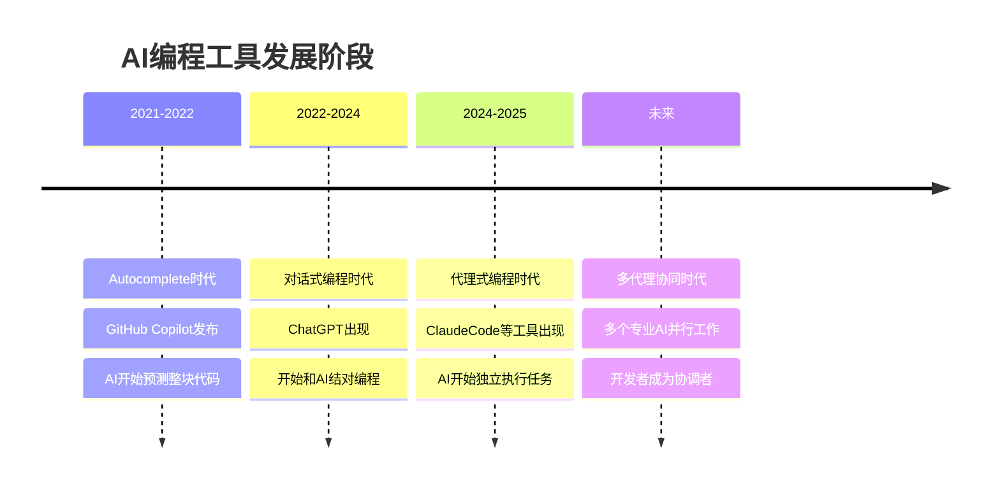
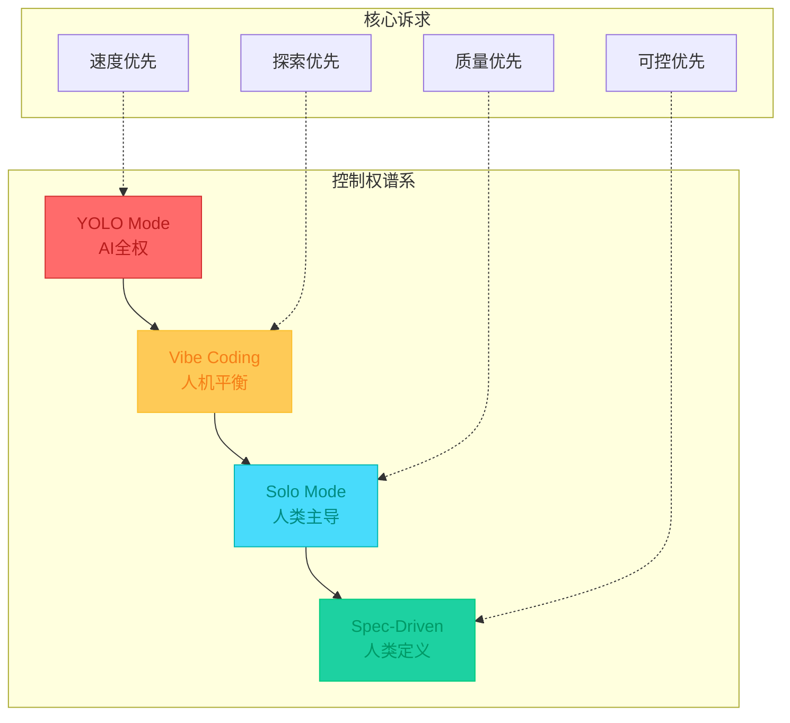
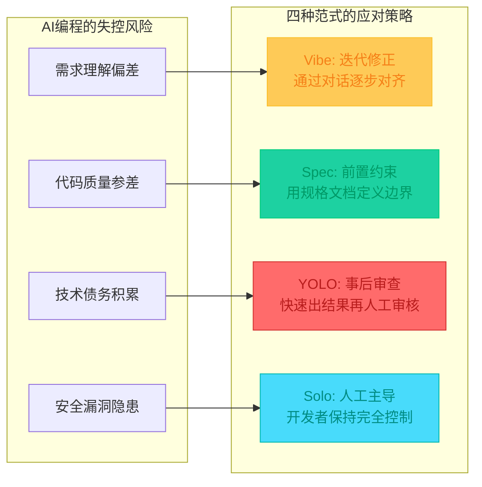
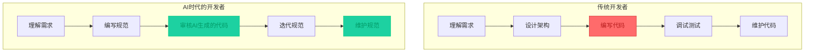
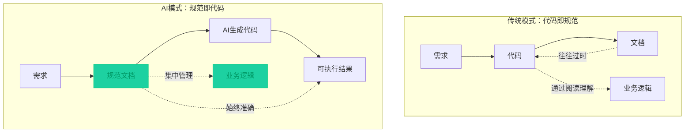
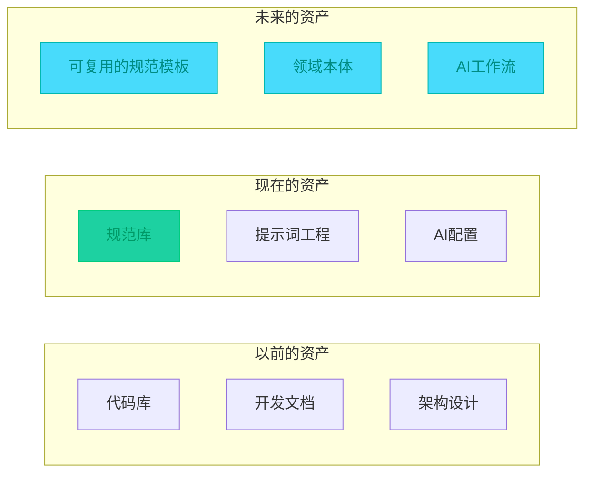
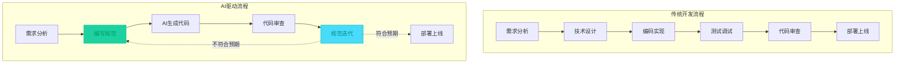
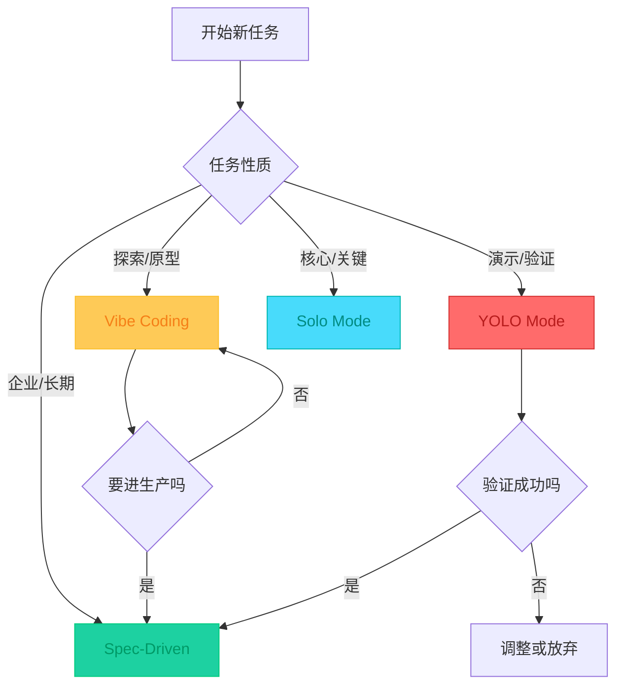
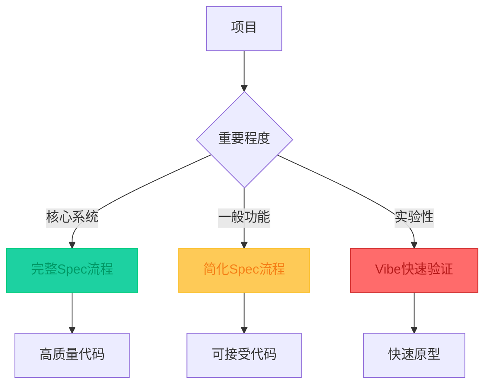

## 引言

2021年GitHub Copilot发布后，AI编程逐渐从实验性工具走向主流。在这LLM大火的这几年，AI Coding的出现，在软件开发领域又掀起了一场AI编程的进化，在这过程中我们从最初的Vibe coding，到后面的Spec Coding，再到各工具厂商提出的YOLO、SOLO等模式，开发者在软件工程中的作用产生了微妙又巨大的变化。

这些"范式"并不是学术界严格定义的标准，而是实践中总结出来的称呼。比如Andrej Karpathy的"Vibe Coding"，GitHub的"Spec-Driven Development"，Cursor的"YOLO Mode"，还有字节跳动的"Solo Mode"——本质上都是各家对"怎么用好AI写代码"这个问题的不同答案。

但如果我们仔细观察，会发现这些模式背后有一个共同的核心问题：**如何在享受AI带来的效率提升的同时，保持对代码的控制？**

## AI编程的几个发展阶段

先简单回顾一下这几年AI编程工具的演变过程：



### 第一阶段：智能补全（2021-2022）

GitHub Copilot是这个阶段的代表。AI不再只是补全变量名，而是能根据上下文生成整段代码。开发者写注释或函数签名，AI帮你填实现。

这个阶段AI还是"被动"的，你不动它就不动。

### 第二阶段：对话式编程（2022-2024）

ChatGPT火了之后，大家开始在IDE里和AI聊天。你描述需求，AI给代码，你再看结果，然后继续聊。

Cursor是这阶段的代表工具。开发体验确实提升明显，但问题也来了：聊着聊着，项目就"漂"了——代码跑起来了，但没人知道为啥能跑。

### 第三阶段：代理式编程（2024-现在）

这是现在最前沿的方向。AI不只是回答你问题，而是能自己做事：读文件、跑命令、写测试、修bug。

Claude Code是典型代表。你给个任务，AI自己规划、执行、验证，你主要做审核和决策。

### 第四阶段：多代理协同（未来方向）

更进一步，不是单个AI，而是多个专业AI并行工作：一个写前端，一个写后端，一个写测试，互相协调。人从"写代码"变成"指挥AI写代码"。

## 四种常见的AI编程范式

在实践中，大家用AI写代码的方式大致可以分成四种。虽然名字不同，但本质上都是在回答一个问题：**人和AI之间，控制权怎么分配？**



### Vibe Coding：跟着感觉走

这个概念是Andrej Karpathy在2025年2月提出的。简单说就是：你大概说个想法，AI生成代码，你觉得差不多就直接用了，不怎么细看代码。

**典型做法**：
- 用自然语言描述模糊的需求："做一个个人博客，简约风格"
- AI生成代码和界面
- 你看效果，不满意就说"换个颜色"、"再加个导航"
- 反复调整，直到看着顺眼

**为什么会这样**：
- 前期探索阶段，需求本来就不明确
- 追求速度，想快速看到效果
- 有些开发者不熟悉某个技术栈，AI写总比自己查快

**问题在哪**：
- 代码可能有问题，但只要能跑就算了
- 项目慢慢"漂"离原来的目标
- 后期维护时发现没人理解代码怎么写的
- 安全漏洞、性能问题被忽略

**控制权分配**：人机平衡，但更偏向"差不多就行"

### Spec-Driven：先说清楚再写

为了解决"Vibe Coding"带来的问题，一些团队开始强调"规格驱动"——写代码前先写清楚要做什么。

**典型做法**：
```
1. 写规格文档（Specify）
   - 用户是谁，要解决什么问题
   - 功能需求是什么
   - 成功的标准是什么

2. 做技术计划（Plan）
   - 用什么技术栈
   - 架构怎么设计
   - 有什么约束条件

3. 分解任务（Tasks）
   - 把大功能拆成小任务
   - 每个任务能独立实现和测试

4. 逐个实现（Implement）
   - AI按照规格和计划写代码
   - 你主要做审核和调整
```

**优点**：
- 目标清晰，不容易走偏
- 代码结构相对规范
- 团队协作有共同语言
- 后期维护成本较低

**控制权分配**：人类定义边界，AI在边界内执行

### YOLO Mode：先跑起来再说

YOLO是"You Only Live Once"的缩写，在这里指的是"让AI完全自主地做"。

**典型做法**：
- 给AI一个任务："做一个待办清单应用"
- 开启YOLO模式，AI自己生成、运行、测试、修复
- 你最后看一眼，觉得能接受就直接用

Cursor的YOLO Mode就是典型：AI可以自己读写文件、运行命令、修复错误，完全不用你确认。

**为什么有人用**：
- 真的很快，几分钟就能出个原型
- 黑客松、演示、验证想法的时候很实用
- 某些一次性脚本，能用就行

**风险在哪**：
- 安全漏洞可能被忽略
- 代码质量没法保证
- 出问题时很难排查
- **千万别直接用进生产环境**

**控制权分配**：AI几乎全权，人类只做最终审核

### Solo Mode：你来负全责

Solo模式是字节跳动的Trae提出来的。核心思想是：你对项目负100%责任，AI只是帮你提高效率的工具。

**典型做法**：
- 核心逻辑、架构设计你自己来
- AI帮你查资料、补样板代码、写文档
- 关键决策你做，AI执行

**和其他模式有什么区别**：
- Vibe：你差不多就行，AI帮你猜
- Spec：先说清楚，让AI照着做
- YOLO：AI全权代理，你最后看一眼
- Solo：你全责，AI是助手

**控制权分配**：人类完全掌控，AI作为效率工具

## 核心洞察：规范化AI开发

把上面四种范式放在一起看，你会发现一个有趣的现象：**它们的核心诉求都是"规范化AI开发，提高可控性"**。

只是每种范式的"规范化"方式不同：



**为什么"可控性"如此重要？**

因为AI编程面临一个根本矛盾：**效率 vs 控制**

| 方面 | 效率优先 | 控制优先 |
|------|----------|----------|
| 开发速度 | Vibe/YOLO更快 | Spec/Solo更慢 |
| 代码质量 | 质量不稳定 | 质量相对可控 |
| 维护成本 | 后期成本高 | 前期投入大 |
| 适用场景 | 原型、验证 | 生产、长期 |

不同的范式就是在效率和控制之间做不同的取舍。

## Spec模式：从代码到规范的转变

在所有范式之中，Spec-Driven Development之所以引起越来越多关注，是因为它代表了一个深刻的转变：**程序员的资产正在从"代码+设计"变成"规范+文档"**。

### 为什么是规范？


**传统开发中**：
- 代码是核心资产
- 文档往往过时或缺失
- 逻辑分散在代码的各个角落
- 维护依赖开发者的记忆和代码阅读能力

**Spec驱动开发中**：
- 规范是核心资产
- 代码是规范的输出结果
- 业务逻辑集中在规范文档中
- 维护依赖规范的更新和演进

这个转变之所以重要，是因为AI改变了代码的"价值"：

| 时代 | 稀缺资源 | 核心资产 | 开发者的价值 |
|------|----------|----------|--------------|
| 以前 | 编码能力 | 代码 | 能写复杂代码 |
| 现在 | 需求理解 | 规范 | 能说清楚要做什么 |

### GitHub Spec Kit：让规范可执行

GitHub在2025年推出的Spec Kit，是Spec驱动开发的一个重要里程碑。它的核心思想是：**让规范成为"意图的唯一真实来源"**。

**Spec Kit的工作流程**：

```bash
# 1. 初始化项目
uvx --from git+https://github.com/github/spec-kit.git specify init my-project

# 2. 生成规格文档
/specify "做一个任务管理应用，支持团队协作"

# 3. 制定技术计划
/plan "用React+Node.js，数据库用PostgreSQL"

# 4. 分解任务
/tasks "把上面说的拆成可执行的任务"

# 5. AI逐个实现
```

**这个流程的价值在哪？**

```
传统AI编程的困境：
模糊需求 → AI猜测 → 代码偏差 → 迭代修正 → ...
                     ↑
                   不知道哪里出了问题

Spec Kit的解决方案：
清晰规格 → AI执行 → 可预测结果 → 规格迭代 → ...
                ↑
            偏差可以被追溯
```

**具体来说**：

1. **意图明确化**：
   - 不是"做一个任务应用"
   - 而是"支持团队协作的任务应用，有权限管理、任务分配、进度追踪"

2. **决策前置**：
   - 在写代码前确定技术栈、架构、约束
   - 避免AI做出不合适的选择

3. **可追溯性**：
   - 代码不符合预期时，回到规格文档找问题
   - 而不是在代码里盲目调试

4. **团队协作**：
   - 规格文档是团队的共同语言
   - 新人加入时看规范就能理解项目

### 规范作为资产的价值

当规范成为核心资产时，一些有趣的事情发生了：

**1. 规范是可复用的**
```
通用规范库：
├── 用户认证规范
├── 权限管理规范
├── 数据持久化规范
└── API设计规范

新项目：
选择合适的规范组合
→ AI自动生成符合规范的代码
→ 大幅提升开发效率
```

**2. 规范是可演进的**
```
v1.0 规范：简单任务管理
    ↓ 业务需求变化
v1.1 规范：增加团队协作
    ↓ AI理解变更
v1.1 代码：自动生成新功能
```

**3. 规范是可验证的**
```yaml
# 规格示例
spec:
  feature: "任务管理"
  requirements:
    - 用户可以创建任务
    - 任务有标题、描述、截止日期
    - 任务可以标记完成

# 验证
验收标准：
✓ 创建任务的API存在
✓ 任务包含必需字段
✓ 完成状态可以切换
```

## 开发者角色的转变

当规范成为核心资产，开发者的角色也在发生变化。

### 从"写代码"到"定义规范"



**核心能力的迁移**：

| 传统核心能力 | 新核心能力 | 为什么变化 |
|-------------|-----------|-----------|
| 编程语言熟练度 | 需求分析能力 | AI能写代码，但不能理解需求 |
| 算法与数据结构 | 规范编写能力 | 规范质量决定代码质量 |
| 调试技能 | 代码审查能力 | AI生成的代码需要审查 |
| 框架使用经验 | 架构设计能力 | 需要为AI设定架构约束 |

### 价值创造的新方式

当AI能写代码时，开发者的价值从"实现"转向"定义"：

**以前的价值创造**：
```
这个功能怎么实现？
→ 选择合适的算法
→ 编写高效的代码
→ 优化性能
→ 价值 = 实现能力
```

**现在的价值创造**：
```
这个功能是什么？
→ 理解业务需求
→ 定义成功标准
→ 设定技术约束
→ 价值 = 定义能力
```

## 工具概览：各家的实现

不同的工具对"怎么用好AI写代码"有不同的理解，也提供了不同的工作方式。

### AI原生IDE

| 工具 | 核心理念 | 特点 |
|------|----------|------|
| Cursor | 对话+Agent双模式 | 日常开发体验最好 |
| Windsurf | 补全优先 | Codeium出品，补全质量高 |
| Replit Agent | 快速部署 | 从想法到上线最快 |

### 命令行工具

| 工具 | 核心理念 | 特点 |
|------|----------|------|
| Claude Code | Agent能力强 | 复杂任务的自动化 |
| Gemini CLI | 价格便宜 | 成本敏感的场景 |
| Codex CLI | OpenAI技术栈 | GPT生态用户 |

### 传统IDE的AI功能

| 工具 | 核心理念 | 特点 |
|------|----------|------|
| GitHub Copilot | 补全+聊天 | 最成熟的AI助手 |
| JetBrains Junie | JetBrains官方 | JetBrains IDE深度集成 |
| Firebender | Cursor式体验 | 给现有IDE加AI能力 |

### 浏览器工具

| 工具 | 核心理念 | 特点 |
|------|----------|------|
| Bolt.new | 一键部署 | 快速原型到生产 |
| v0.dev | UI生成 | React项目的UI专家 |

## 软件工程的深层变革

AI编程带来的不仅是工具的变化，更是软件工程范式的根本转变。

### 从"代码即规范"到"规范即代码"



**传统模式的困境**：
- 业务逻辑分散在代码中
- 文档更新不及时或缺失
- 新人理解项目需要大量阅读代码
- 需求变更成本高

**AI模式的优势**：
- 业务逻辑集中在规范中
- 规范是唯一的真实来源
- 新人看规范就能理解项目
- 需求变更成本相对可控

### 资产形式的转变



**这个转变意味着什么？**

1. **代码变成"消费品"而非"资产"**
   - 代码可以被AI重新生成
   - 规范才是需要长期维护的资产

2. **开发者的知识表达更重要**
   - 如何把需求说清楚变得关键
   - 自然语言表达能力成为核心竞争力

3. **团队协作的基础变化**
   - 代码审查 → 规范审查
   - 代码评审 → 意图对齐
   - 技术讨论 → 业务讨论

### 开发流程的重构



**关键变化**：

1. **迭代对象变了**
   - 以前：迭代代码
   - 现在：迭代规范

2. **质量保证前置**
   - 以前：代码审查发现问题
   - 现在：规范审查预防问题

3. **反馈循环缩短**
   - 以前：改代码 → 测试 → 发现问题
   - 现在：改规范 → AI重新生成 → 验证

## 实践建议：怎么选择和使用

没有"最好"的范式，只有"最合适"的。下面是一些实用建议。

### 简单决策指南



### 组合使用策略

**"Vibe探索，Spec生产"**：

```
探索期：Vibe Coding
├── 快速出原型
├── 尝试不同方案
└── 确定方向

↓ 方向确定了

生产期：Spec-Driven
├── 把探索结果写成规范
├── 制定技术计划
└── 稳步实现
```

**"YOLO验证，规范重构"**：

```
验证期：YOLO Mode
├── 极速出MVP
├── 验证想法/技术
└── 确认可行

↓ 验证通过

重构期：Spec-Driven
├── 人工介入重构
├── 补充规范文档
└── 重新生成代码
```

### 使用Spec Kit的最佳实践

**1. 从小做起**
```bash
# 不要一开始就写大规范
# 先从小功能开始

/specify "添加用户注册功能"
/plan "使用Email+密码，需要验证"
/tasks "拆成3个小任务"
```

**2. 迭代式改进**
```
第一版规范：基本功能
↓ 运行后发现不足
第二版规范：补充边界情况
↓ 继续完善
第三版规范：加入异常处理
```

**3. 保持规范的简洁**
```yaml
# 好的规范
spec:
  feature: "用户注册"
  requirements:
    - Email唯一性验证
    - 密码强度检查
    - 发送验证邮件

# 不好的规范
spec:
  feature: "用户注册"
  requirements:
    - （100行详细说明）
```

## 实践中的挑战与建议

Spec-driven development在实践中虽然效果明显，但也面临一些现实挑战。基于社区实践，这里总结一些常见问题和应对建议。

### 上下文保持问题

**问题**：LLM在长对话中容易"遗忘"之前的规范内容，导致后续实现偏离初始规范。

**常见场景**：
- 迭代多次后，AI开始"走偏"
- 新生成的代码与之前的规范不一致
- 需要反复提醒AI之前的约束

**应对建议**：

1. **每次迭代重新加载完整规范**
```
新会话开始：
├── 加载完整规范文档
├── 明确当前迭代目标
└── 要求AI确认理解
```

2. **保持规范的模块化**
```
将大规范拆分成：
├── 核心规范（很少变动）
├── 功能规范（按功能模块）
└── 技术规范（技术栈相关）

每次只加载需要的部分
```

3. **使用多模型交叉验证**
```
 Claude生成代码
      ↓
 ChatGPT审查一致性
      ↓
 发现偏差及时修正
```

### 人工审查的必要性

**问题**：AI生成的代码即使符合规范，也可能存在意想不到的问题。

**需要人工审查的场景**：
- 安全相关代码（认证、授权、数据处理）
- 性能关键路径
- 复杂的业务逻辑
- 第三方API集成

**审查建议**：

```
审查层次：
├── 一级审查：规范一致性
│   └── AI自动检查是否符合规范
├── 二级审查：代码质量
│   └── AI或人工检查代码结构
└── 三级审查：关键代码
    └── 人工深入审查安全和逻辑
```

**实践中的一种做法**：
```
1. 让AI审查自己的代码（第一道防线）
2. 让另一个AI模型交叉审查（第二道防线）
3. 人工审查关键部分（最终保障）
```

### 规范的迭代与演进

**问题**：规范不是一成不变的，但频繁变动会导致混乱。

**迭代建议**：

1. **版本化管理**
```yaml
# spec-v1.0.md
spec_version: "1.0"
status: "stable"
description: "基础功能"

# spec-v1.1.md
spec_version: "1.1"
based_on: "1.0"
status: "draft"
changes:
  - "增加团队协作功能"
  - "优化权限模型"
```

2. **变更影响分析**
```
规范变更前：
├── AI分析影响范围
├── 评估需要重新生成的代码
└── 决定是增量更新还是全量重新生成
```

3. **记录决策理由**
```
每次规范变更：
├── 记录变更原因
├── 记录考虑的替代方案
└── 记录为什么选择当前方案
```

### 效率与质量的平衡

**问题**：Spec-driven前期投入大，如何在效率和质量之间找平衡？

**分层策略**：



**具体建议**：

| 项目类型 | 推荐方式 | 理由 |
|----------|----------|------|
| 核心业务系统 | 完整Spec-Driven | 质量要求高，前期投入值得 |
| 内部工具 | 简化规范 + 人工审查 | 效率优先，质量要求相对宽松 |
| 实验性功能 | Vibe验证 + 规范重构 | 快速探索，成功后再规范化 |
| 一次性脚本 | YOLO或直接手工 | 规范化收益不大 |

### 团队协作中的规范

**问题**：团队成员对规范的理解可能不一致，导致协作问题。

**协作建议**：

1. **建立规范模板**
```
团队统一模板：
├── 必需部分
│   ├── 功能描述
│   ├── 验收标准
│   └── 技术约束
└── 可选部分
    ├── 性能要求
    ├── 安全要求
    └── 兼容性说明
```

2. **定期对齐会议**
```
每周或每迭代：
├── 审查新规范的变更
├── 讨论规范理解的偏差
└── 更新团队的最佳实践
```

3. **规范的" lessons learned"**
```
每个项目结束后：
├── 总结哪些规范写得好
├── 总结哪些规范需要改进
└── 更新团队的规范指南
```

### 工具选择的现实考虑

**问题**：工具很多，但各自都有局限性，怎么选择？

**现状**：
- GitHub Spec Kit：功能完善，但需要适应其工作流
- Kiro：专注于Spec-driven，但还在发展中
- OpenSpec：更灵活，但需要自己组织流程
- 自建方案：可以定制，但需要维护成本

**选择建议**：

```
选择工具时考虑：
├── 团队规模和协作方式
├── 现有开发流程的兼容性
├── 学习和迁移成本
└── 工具的成熟度和稳定性

小团队：
→ 简单工具或自建方案

大团队：
→ 成熟的规范驱动工具

特殊需求：
→ 定制化解决方案
```

**现实是**：很多团队在使用混合方案——用Markdown写规范，用现有AI工具生成代码，用Git管理版本。这种"轻量级Spec-driven"在实践中也很常见。

## 总结

AI编程的各种范式，本质上都是在回答同一个问题：**如何在享受AI效率的同时保持控制？**

从Vibe的"差不多就行"到Spec的"先说清楚"，从YOLO的"让它跑"到Solo的"我来负责"，每种范式都在探索人和AI之间控制权的最优分配。

但如果我们看得更深一点，会发现一个更大的转变正在发生：**程序员的资产正在从"代码"变成"规范"**。

这个转变意味着：
- 开发者的核心能力从"实现"转向"定义"
- 团队的协作基础从"代码审查"转向"规范对齐"
- 软件的质量保证从"测试代码"转向"验证规范"

Spec Kit等工具的出现，标志着这个转变的开始。未来可能会出现更多工具，帮助开发者更好地编写、管理和复用规范。

但无论工具如何变化，核心是不变的：**把需求说清楚的能力，正在成为程序员最重要的能力。**

---

> *参考资源：*
> *- [GitHub Spec Kit](https://github.com/github/spec-kit)*
> *- [OpenSpec](https://github.com/Fission-AI/OpenSpec)*
> *- Spec-driven development with AI*
> *- AI Programming Paradigms: A Timeline*
