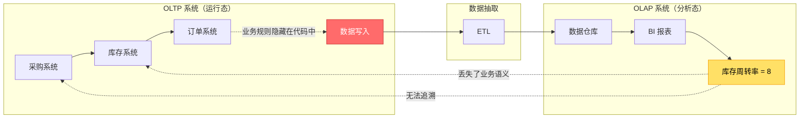
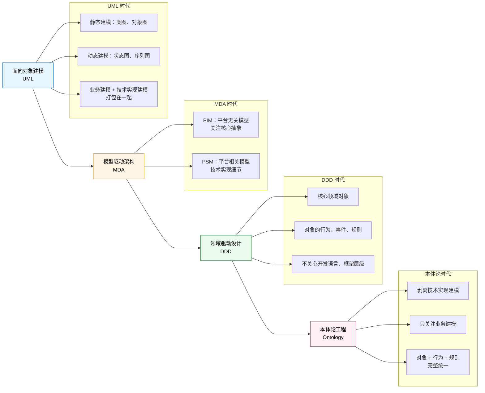
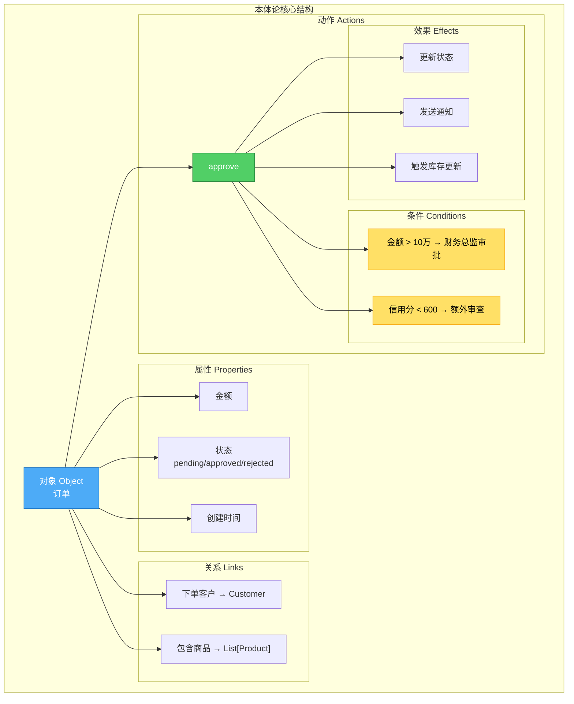
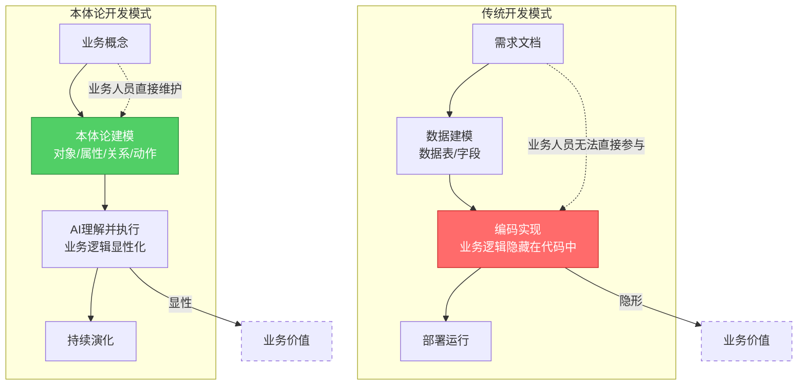
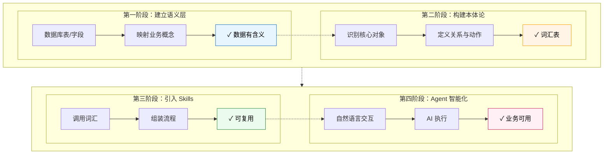

Palantir 在 2024 年股价翻了三倍，市值突破千亿美元。很多人归因于 AI 浪潮，但真正的秘密藏在一个概念背后——**本体论（Ontology）**。

这不是哲学课上的"存在的本质"，而是软件开发范式的一次根本性转移。

## 核心问题：知其然，不知其所以然

我们的系统能告诉我们库存周转率是 8 次/年，但无法告诉我们为什么不是 12 次。

我们能看到订单被拒绝了，但无法追溯是哪条业务规则导致的拒绝。

我们能知道数据的结果，但无法追溯数据形成的业务流转过程。

**这个困境的根源，在于传统 IT 架构中 OLTP（交易处理）和 OLAP（分析处理）的分离，导致数据模型和行为规则模型的分离。**

Palantir 的本体论，正是为了解决这个问题而诞生的。

## 传统系统的结构性困境

### 一个真实的场景

```
BI 系统显示：库存周转率 = 8 次/年
目标值：12 次/年

问题：库存周转率下降了，但为什么？

- 是采购周期延长了？
- 是交付周期延长了？
- 是客户大量取消了订单？

传统 BI 无法回答这个问题。

```

### 问题的根源：OLTP 与 OLAP 的分离

核心问题：传统 IT 架构中 **OLTP（交易处理）** 和 **OLAP（分析处理）** 的分离： 



**关键问题**：当数据从 OLTP 系统流向 OLAP 系统时，**业务语义和行为规则丢失了**。

- 数据模型（表、字段、关系）被保留下来
- 但**行为和规则模型**隐藏在各业务系统的代码中，编译后不可见

结果就是：我们能看到指标的结果，却无法追溯数据形成的**业务流转过程**。

### 设计态 vs 运行态的分离

从软件建模的角度来看，问题更加清晰：

```
设计态（建模阶段）：
├── 静态建模：类图、对象关系图
│   └── 最终落地到：数据模型（数据库表）
└── 动态建模：状态图、序列图、活动图
    └── 最终落地到：行为规则模型（源代码）

运行态（部署上线后）：
├── 数据模型：可见，可查询
│   └── 数据库表、字段、关系清晰可见
└── 行为规则模型：不可见，隐藏在编译后的代码中
    └── 业务语义丢失，无法追溯

```

**关键洞察**：传统软件建模中，数据模型和行为规则模型在运行态**完全分离**。

- 数据模型落地到数据库，相对容易理解和可见
- 行为规则模型打包在部署包/镜像中，大部分时候是看不到的

这就是为什么当我们分析一个指标异常时，必须**回到各个业务系统**去查业务活动、业务订单，才能找到根本原因。

### 传统开发方式

```python
# 传统代码：业务逻辑被代码淹没
class OrderController:
    def approve_order(self, order_id):
        order = Order.objects.get(id=order_id)

        # 业务规则1：金额限制
        if order.amount > 100000:
            # 业务规则2：需要财务总监审批
            if order.customer.credit_score < 600:
                raise ValidationError("需要财务总监审批")
            # 业务规则3：新客户额外审查
            if order.customer.created_at < datetime.now() - timedelta(days=90):
                raise ValidationError("新客户需要额外审查")

        # 业务规则4：库存检查
        for item in order.items:
            if item.product.stock < item.quantity:
                raise ValidationError(f"{item.product.name} 库存不足")

        # 执行审批
        order.status = 'approved'
        order.save()

        # 触发后续流程
        self.send_notification(order)
        self.update_inventory(order)

```

**问题在哪里？**

1. **业务逻辑隐形**：审批规则分散在 if-else 代码中
2. **业务人员无法理解**：需求变更需要找开发人员
3. **规则难以复用**：同样的规则在其他系统要重新实现
4. **演进成本高**：修改规则需要改代码、测试、部署

### 本体论开发方式

```python
# 本体论方式：业务逻辑显性化
class Order(Object):
    properties = {
        "amount": Decimal,
        "status": Enum(["pending", "approved", "rejected"])
    }

    links = {
        "customer": Customer,
        "items": List[OrderItem]
    }

    # 业务规则作为一等公民
    actions = {
        "approve": Action(
            conditions=[
                "如果金额 > 10万，需要财务总监审批",
                "如果客户信用分 < 600，需要额外审查",
                "如果是新客户（<90天），需要额外审查"
            ],
            effects=["更新状态", "发送通知", "更新库存"]
        )
    }

# 业务人员可以直接理解和修改
ontology.execute_action("Order.approve", order_id)

```

**差异是什么？**

| 维度 | 传统开发 | 本体论开发 |
|------|---------|-----------|
| 业务逻辑 | 隐藏在代码中 | 显性化、可读 |
| 规则修改 | 改代码 → 测试 → 部署 | 修改本体定义 |
| 业务参与 | 通过需求文档 | 直接操作规则 |
| 复用性 | 难以跨系统复用 | 本体即共享语言 |

## 软件建模的演进：从 UML 到本体论

理解本体论的价值，需要放在软件建模方法演进的历史脉络中：



### 演进的核心脉络

**UML 时代**：
- 优点：形式化语言符号，完整描述静态和动态逻辑
- 局限：业务建模和技术实现建模打包在一起

**MDA 时代**：
- 核心思想：分离 PIM（平台无关模型）和 PSM（平台相关模型）
- 进步：更加关注核心抽象的模型内核
- 局限：仍然关注技术实现的分层

**DDD 时代**：
- 核心思想：只关心核心领域对象及其行为、事件、规则
- 进步：不关心开发语言、框架层级，控制模型复杂度
- 局限：最终还是用代码表达，业务人员无法直接参与

**本体论时代**：
- 核心突破：**完全剥离技术实现建模，只关注业务建模**
- 关键变化：AI 大模型让技术实现变得不重要，业务建模成为核心
- 最终形态：**对象 + 行为 + 规则** 的完整统一模型

### 为什么现在是本体论的时代？

20 年前尝试过规则引擎、业务建模，但失败了。为什么现在成了？

**过去为什么失败**：
- 规则如何从业务文档中提取？—— 人工编写，成本高
- 规则如何维护？—— 业务变更频繁，跟不上
- 规则如何执行？—— 需要专门的引擎，集成复杂
- **最终还是要转换成代码**，技术实现的复杂性从未消失

**现在为什么可行**：AI 大模型的能力提升改变了游戏规则。

```
过去：业务建模 → 代码转换 → 程序实现
      ↓           ↓           ↓
   难以维护    转换工具复杂   需要开发人员

现在：业务建模（本体论）→ AI 理解并直接执行
      ↓                  ↓
   业务人员可维护      无需代码转换

```

**根本原因**：AI 大模型让**"模型即程序"** 成为可能。

| 时代 | 核心技术 | 模型的作用 |
|------|----------|-----------|
| MDA 时代 | 模型转换工具 | 模型 → 代码的中间产物 |
| DDD 时代 | 面向对象语言 | 设计思路，最终落地为代码 |
| 本体论时代 | AI 大模型 | **模型本身是可执行的** |

这就是为什么本体论在 AI 时代成为可能——**我们终于可以只关注"业务是什么"，而让 AI 处理"怎么做"**。

## 三种建模的本质差异

要理解本体论的价值，我们需要对比三种建模方式。

### 数据建模：关注"存什么"

```sql
-- 数据建模的典型产物
CREATE TABLE orders (
    id SERIAL PRIMARY KEY,
    customer_id INTEGER REFERENCES customers(id),
    amount DECIMAL(10,2),
    status VARCHAR(20),
    created_at TIMESTAMP
);

-- 问题：这些字段代表什么业务含义？
-- - status = 'approved' 意味着什么？
-- - 什么条件下可以变为 'approved'？
-- - 审批通过后应该触发什么流程？

```

**本质局限**：只记录数据状态，不记录业务规则。

### 领域建模（DDD）：关注"怎么表达"

```
DDD 领域模型的核心构造块：
├── 领域边界
│   └── 限界上下文：划分问题边界
├── 实体/聚合根
│   ├── Order：订单聚合根
│   ├── Customer：客户实体
│   └── Product：商品实体
├── 值对象
│   ├── Money：金额值对象
│   ├── Address：地址值对象
│   └── OrderStatus：订单状态枚举
├── 领域服务
│   └── OrderService：复杂业务逻辑
├── 仓储
│   └── OrderRepository：持久化抽象
└── 领域事件
    └── OrderApprovedEvent：订单批准事件

# 这些概念通过代码（类、接口）实现

```

```python
# DDD 方式的代码示意
class Order(AggregateRoot):
    """订单聚合根"""
    customer_id: CustomerId
    items: List[OrderItem]
    status: OrderStatus  # 值对象
    _events: List[DomainEvent]  # 领域事件

    def approve(self):
        """领域方法"""
        self.status = OrderStatus.APPROVED
        self._events.append(OrderApprovedEvent(self.id))

class OrderRepository(Repository):
    """仓储接口"""
    def save(self, order: Order): ...
    def find_by_id(self, id: OrderId) -> Order: ...

```

**本质局限**：虽然将业务概念从技术细节中分离出来，但**最终仍是代码表达，业务人员无法直接参与**。

### 本体论建模：关注"是什么+能做什么"

```python
# 本体论方式：用业务语言描述业务
# 可视化界面中：

对象：订单
├── 属性
│   ├── 金额：Decimal
│   ├── 状态：枚举[待审批, 已批准, 已拒绝]
│   └── 创建时间：DateTime
├── 关系
│   ├── 下单客户 → 客户
│   └── 包含商品 → List[商品]
└── 动作
    └── 批准
        ├── 条件：
        │   ├── 如果 金额 > 10万 且 客户.信用分 < 600 → 需要财务总监审批
        │   └── 如果 客户.注册时长 < 90天 → 需要额外审查
        └── 效果：
            ├── 更新 状态 = 已批准
            ├── 发送 审批通知
            └── 触发 库存更新

# 这些描述可以直接用自然语言维护

```

**本体论的核心洞察：围绕对象建模**

传统建模往往围绕"业务场景"或"业务流程"，但本体论的建模核心是**对象**：

```
业务场景 / 流程：千变万化
    ↓ 难以复用

对象：相对稳定
    ↓ 可复用
    ↓ 对象的行为可复用
    ↓ 业务流程 = 对象行为的灵活组装和编排

```

**为什么对象是核心？**

- 对象可以产生行为
- 行为需要调用或依赖规则
- 对象、行为、规则是**相互制约、相互依赖的整体**

只要把核心对象及其暴露的行为、规则搞清楚，就得到了一个高度抽象化的本体——**这就是做任何事情的底层抽象模型**。

**本体论的本质突破**：

1. **业务逻辑显性化**：规则从代码中"提取"出来，成为一等公民
2. **业务人员可直接操作**：不需要开发人员介入
3. **系统可理解**：AI 大模型可以直接理解这些业务语义
4. **知其然知其所以然**：不仅看到数据结果，还能追溯业务流转过程

---

### DDD vs 本体论：本质区别在哪？

表面上看，本体论和 DDD 的建模元素非常相似：

| DDD 概念 | 本体论概念 | 区别在哪？ |
|----------|-----------|-----------|
| 实体/聚合根 | 对象 Object | DDD 是代码类，本体论是语义定义 |
| 字段 | 属性 Properties | DDD 是类字段，本体论是业务属性 |
| 关联 | 关系 Links | DDD 是对象引用，本体论是语义关系 |
| 领域方法 | 动作 Actions | DDD 是代码方法，本体论是可执行的业务操作 |
| 规约/领域规则 | 规则 Rules | DDD 是代码断言，本体论是 AI 可理解的规则 |

**本质区别**：

| 维度 | DDD | 本体论 |
|------|-----|--------|
| **建模语言** | 编程语言（Java/C#/Python） | 业务语义语言 |
| **最终产物** | 源代码 | 可执行的语义模型 |
| **执行方式** | 编译 → 运行时 | AI 直接理解并执行 |
| **业务参与** | 通过需求文档间接参与 | 可直接维护模型 |
| **依赖 AI** | 不依赖 | **强依赖** |

**关键洞察**：本体论不是 DDD 的替代，而是 DDD 思想在 AI 时代的自然演进。

```
DDD：业务概念 → 代码模式 → 程序运行
      ↓         ↓           ↓
   开发者   编译器/解释器   服务器

本体论：业务概念 → 语义模型 → AI 执行
        ↓           ↓          ↓
    业务人员    可视化工具    AI 引擎

```

**没有 AI 大模型，本体论就只是 DDD 的另一种说法。有了 AI，模型才真正成为可执行的资产。**



## Palantir 本体论解决的核心问题

Palantir 最初是一家做数据服务、数据中台的公司。他们的发现是：

**传统数据中台的局限**：

```
当看到数据指标时：
├── 可以看到：指标的结果
├── 可以看到：指标的计算公式
└── 无法看到：形成指标的业务语义和业务流转规则

```

**Palantir 的解决方案**：

在传统的数据模型之上，**增加行为建模和规则建模**：

```
传统数据中台：
└── 数据模型（表、字段、关系）
    └── 只能看到"是什么"

Palantir 本体论：
├── 数据模型（对象、属性、关系）
├── 行为模型（动作、流程）
└── 规则模型（条件、约束）
    └── 既能看到"是什么"，又能追溯"为什么"

```

这样构建的完整本体，才真正解决了**"知其然又知其所以然"**的问题。

---

### 本体论与 OLAP：如何处理海量数据分析？

一个关键问题：**OLAP 聚合需要预计算，本体论如何处理海量数据的性能问题？**

**传统 OLAP 的做法**：

```
预聚合（成本高，一次性）
├── 构建 Cube
├── 物化视图
└── 索引优化
    ↓
查询（毫秒级）
└── 读取预聚合结果

```
代价：构建时间长、存储空间大、灵活性差。

**本体论的做法：业务语义定义，底层智能选择**

```
本体论层（业务定义）
├── 指标：库存周转率
├── 计算规则：销售成本 / 平均库存
└── 时间窗口：12个月
    ↓
执行引擎（智能路由）
├── 小数据/热数据 → 实时计算
├── 大数据/高频查询 → 预聚合
└── 历史数据 → 批处理 + 增量更新

```

**关键洞察**：
- 本体论定义**业务语义**，不规定**技术实现**
- 预聚合、缓存、增量计算都是底层可用的技术手段
- 对用户透明，统一的本体论接口

**OLAP 在本体论中的定位**：

| 传统观点 | 本体论观点 |
|----------|-----------|
| OLTP vs OLAP 是两个系统 | 都是**业务动作**，只是类型不同 |
| OLAP 需要预先建模 | OLAP 可以**即时定义**，AI 选择执行策略 |
| OLAP 是技术聚合 | OLAP 是**分析型动作**，纳入本体论 |

在本体论中，OLAP 聚合可以定义为：
- **派生属性**：对象上的计算属性（如"客户的终身价值"）
- **分析动作**：专门的分析方法（如"计算库存周转率"）
- **Skills 封装**：完整的分析流程（如"销售趋势分析"）

**这不是反本体论，而是本体论工程化的必经之路：业务语义与技术实现的分离。**

---

## 从 DDD 的 DSL 到真正的业务语言

DDD 鼓励设计**领域特定语言（DSL）**来捕捉业务概念。但现实是：

```python
# DDD 设计的 DSL（还是代码）
class OrderDSL:
    def "新客户的订单"(self, customer):
        if customer.is_new():
            return Order(customer, requires_review=True)

# 业务人员还是看不懂，或无法自行定义

# 真正的业务语言应该是这样的
"新客户"的定义：
  - 注册时间 < 90天
  - 历史订单数 < 3
  - 累计金额 < 10000

"新客户订单"的规则：
  - 需要额外审查
  - 金额限制：单笔不超过5万
  - 需要客服回访确认

```

**AI 代码生成的范式转移**：

```
过去：业务概念 → 代码抽象 → 程序实现
      （业务人员和开发者之间有鸿沟）

现在：业务概念 → 本体论定义 → AI 理解并执行
      （业务概念直接可执行）

```

## 开发者角色的转移：从代码编写者到本体论设计师

### 传统开发者的一天

```
产品经理："我们要加一个新功能：VIP 客户的审批优先级提升"

开发者：
1. 理解需求（反复确认）
2. 设计数据表结构
3. 编写业务逻辑代码
4. 编写单元测试
5. 部署到测试环境
6. 联调调试
7. 部署到生产环境

时间：2周

```

### 本体论开发者的一天

```
业务专家："VIP 客户的审批优先级要提升"

本体论设计师：
1. 在本体论编辑器中修改 "VIP 客户" 的定义
2. 调整审批规则的优先级参数
3. 在测试环境中验证规则
4. 一键发布到生产环境

时间：2小时

```

**开发者关注点的转移**：

| 传统开发 | 本体论开发 |
|---------|-----------|
| 怎么实现这个功能？ | 这个业务概念是什么？ |
| 用什么设计模式？ | 对象之间什么关系？ |
| 代码怎么复用？ | 规则怎么抽象？ |
| 性能如何优化？ | 业务流程如何建模？ |

**代码？让 AI 来写**：

```python
# 开发者只需要描述业务意图
intention = "审批通过后，更新库存，如果库存不足则自动触发补货"

# AI 自动生成代码
generated_code = ai.generate_code(
    intention=intention,
    context=ontology.get_context()  # 从本体论获取业务语义
)

# 输出：
# def approve_order(order):
#     order.status = 'approved'
#     for item in order.items:
#         item.product.stock -= item.quantity
#         if item.product.stock < item.product.safety_stock:
#             trigger_replenishment(item.product)

```

## Agentic AI 基础设施：支撑本体论工程

本体论不是空中楼阁，它需要相应的技术支撑。基于当前 Agent 技术的发展，一个合理的基础设施架构应该是：

### 四层架构

```
┌─────────────────────────────────────────────────────────┐
│  业务交互层：自然语言 / 可视化界面                            │
├─────────────────────────────────────────────────────────┤
│  本体论层：对象、属性、关系、动作                             │
├─────────────────────────────────────────────────────────┤
│  Agent 编排层：Skills + Tools + MCP + RAG                │
├─────────────────────────────────────────────────────────┤
│  执行层：API 调用、数据库操作、外部系统                       │
└─────────────────────────────────────────────────────────┘

```

### 多范式智能化的商业解决方案

```python
# 一个典型的企业级方案设计

class EnterpriseOntologyAgent:
    """
    基于本体论的企业智能 Agent
    """

    def __init__(self):
        # 1. Skills：业务能力包
        self.skills = SkillRegistry([
            "procurement-approval",    # 采购审批
            "inventory-management",    # 库存管理
            "financial-risk-analysis"  # 财务风险分析
        ])

        # 2. Tools：执行工具（通过 MCP 协议）
        self.tools = MCPGateway([
            "sap://erp",              # SAP ERP 系统
            "salesforce://crm",       # Salesforce CRM
            "postgresql://data_warehouse"  # 数据仓库
        ])

        # 3. Ontology：业务本体论
        self.ontology = OntologyModel([
            Object("Customer", properties=[...], actions=[...]),
            Object("Order", properties=[...], actions=[...]),
            Object("Product", properties=[...], actions=[...])
        ])

        # 4. Agent：智能编排
        self.agent = Agent(
            llm=GPT4(),
            skills=self.skills,
            tools=self.tools,
            ontology=self.ontology
        )

    # 核心方法：用业务语言直接调用
    def execute_business_intent(self, intent: str):
        """
        执行业务意图

        示例：
        - "审批客户A的订单，如果库存不足则自动补货"
        - "找出所有高风险客户，并生成风险报告"
        """
        return self.agent.execute(intent)

```

### 架构设计的核心原则

**1. 关注点分离**

```
本体论层：定义"业务是什么"
    ↓ 独立于技术实现

Skills 层：定义"怎么做"
    ↓ 业务流程的封装

Tools 层：定义"用什么"
    ↓ 技术实现的抽象

```

**2. 业务价值显性化**

```python
# 传统方式：业务价值隐藏在代码中
def process_order(order):
    # 200行代码...
    # 业务价值是什么？难以说清

# 本体论方式：业务价值一目了然
class Order(Object):
    """
    业务价值：缩短订单处理时间，提高客户满意度
    关键指标：平均处理时长、客户满意度评分
    """
    business_value = {
        "primary": "提高订单处理效率",
        "metrics": ["processing_time", "customer_satisfaction"]
    }

    actions = {
        "process": Action(
            purpose="快速准确地处理订单",
            expected_outcome="订单在2小时内完成处理"
        )
    }

```

**3. 可演化的设计**

```python
# 业务规则变更不需要改代码
ontology.update_rule("Order.approve", """
新的规则：
- 金额阈值从10万调整为5万
- 增加部门预算检查
- 自动记录审批理由
""")

# Agent 自动理解新规则
# 自动调整执行逻辑
# 自动记录变更历史

```

## 范式转移：从代码为中心到业务为中心

### 软件工程的历史演进

```
第一代：面向过程
  关注点：函数、算法
  业务参与度：几乎为零

第二代：面向对象
  关注点：类、封装、继承
  业务参与度：通过需求文档间接参与

第三代：DDD（领域驱动设计）
  关注点：领域模型、通用语言
  业务参与度：参与建模过程，但结果仍是代码

第四代：本体论工程
  关注点：业务概念、规则、价值
  业务参与度：直接维护业务模型

```

### 转移的本质

| 维度 | 代码中心 | 业务中心 |
|------|---------|---------|
| 核心资产 | 源代码 | 本体论模型 |
| 变更成本 | 高（编码、测试、部署） | 低（修改模型） |
| 业务参与 | 通过需求文档 | 直接操作 |
| AI 参与度 | 辅助编程 | 核心引擎 |
| 价值体现 | 隐形 | 显性 |

## 核心差异总结

下图展示了两种开发模式的完整对比：



## 实践路径

对于想要转向本体论工程的团队，建议的演进路径：

### 第一阶段：建立语义层

从现有系统提取业务语义，建立数据与业务的映射。

```python
# 从现有系统提取业务语义
class SemanticLayer:
    """
    将数据库字段映射为业务概念
    """
    def map_field_to_concept(self, table, column):
        # orders.customer_id → "下单客户"
        # orders.amount → "订单金额"
        # orders.status → "订单状态"
        pass

```

**价值**：让数据有"含义"，而不只是"值"。

---

### 第二阶段：构建本体论

基于语义层，定义完整的业务模型——对象、属性、关系、动作、规则。

```
本体论 = 业务的"词汇表"
├── 对象：Customer, Order, Product
├── 属性：amount, status, created_at
├── 动作：approve, reject, cancel
└── 规则：如果金额>10万，需要...

```

```python
# 定义完整的业务模型
ontology = Ontology(
    objects=[Customer, Order, Product, Supplier],
    relationships=[...],
    actions=[...],
    rules=[...]
)

```

**价值**：业务模型显性化、可操作。

---

### 第三阶段：引入 Skills

基于本体论定义，将业务流程封装为 Skills 能力包。

```
Skills = 业务的"句子"
└── 用本体论的词汇组装成完整流程
    ├── 调用 Order.approve()
    ├── 发送通知
    └── 更新库存

```

**与本体论的关联**：Skill 通过引用本体论中定义的对象、属性、动作和规则，组合成完整的业务流程。

```yaml
# Skill 中调用本体论的对象和动作
skills/
  └── order-processing/
      └── SKILL.md
          ├── 引用本体论：Order.approve
          ├── 引用本体论：Customer.get_credit_score
          └── 封装完整流程

```

**价值**：业务逻辑模块化、可复用。

---

### 第四阶段：Agent 智能化

AI 直接理解并执行业务意图，实现自然语言交互。

```python
# AI 直接理解并执行业务意图
agent = BusinessAgent(ontology=ontology)
agent.execute("审批高风险订单，需要财务总监确认")

```

**价值**：自然语言交互，降低使用门槛。

---



---

Palantir 的本体论不是一项技术，而是一种**思维方式**的转变。

从"如何用代码实现业务"到"如何让业务概念可计算"，从"技术驱动"到"业务驱动"，从"开发者主导"到"业务人员参与"。

这不是要取代开发者，而是让开发者从"代码编写者"升级为"业务建模师"。

AI 大模型提供了能力，Skills 提供了载体，MCP 提供了连接，Agent 提供了编排——而本体论，是这一切的核心。

---

> *本文参考资料：*
> *- [Palantir Foundry Ontology](https://www.palantir.com/explore/platforms/foundry/ontology/)*
> *- [Why Ontology Matters for Agentic AI in 2026](https://kenhuangus.substack.com/p/why-ontology-matters-for-agentic)*