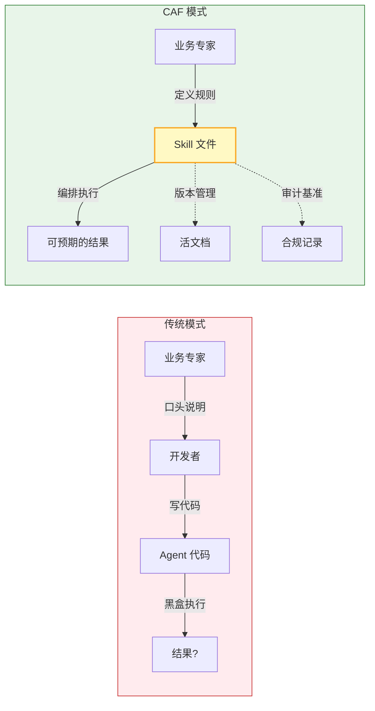
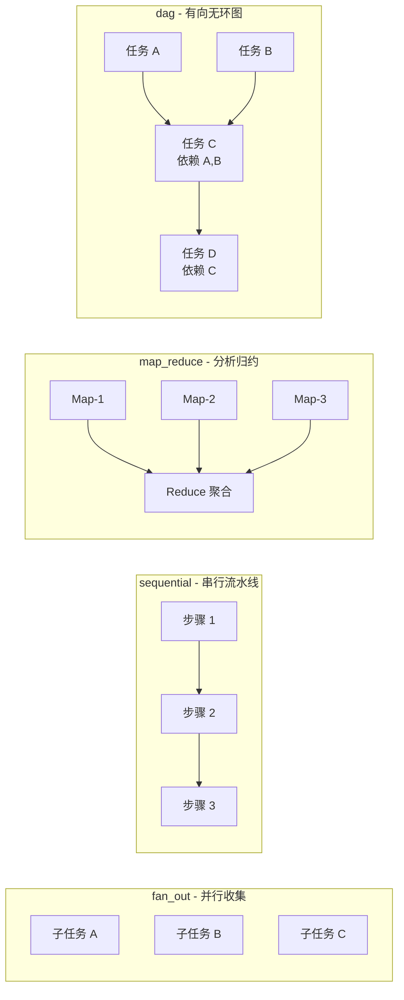
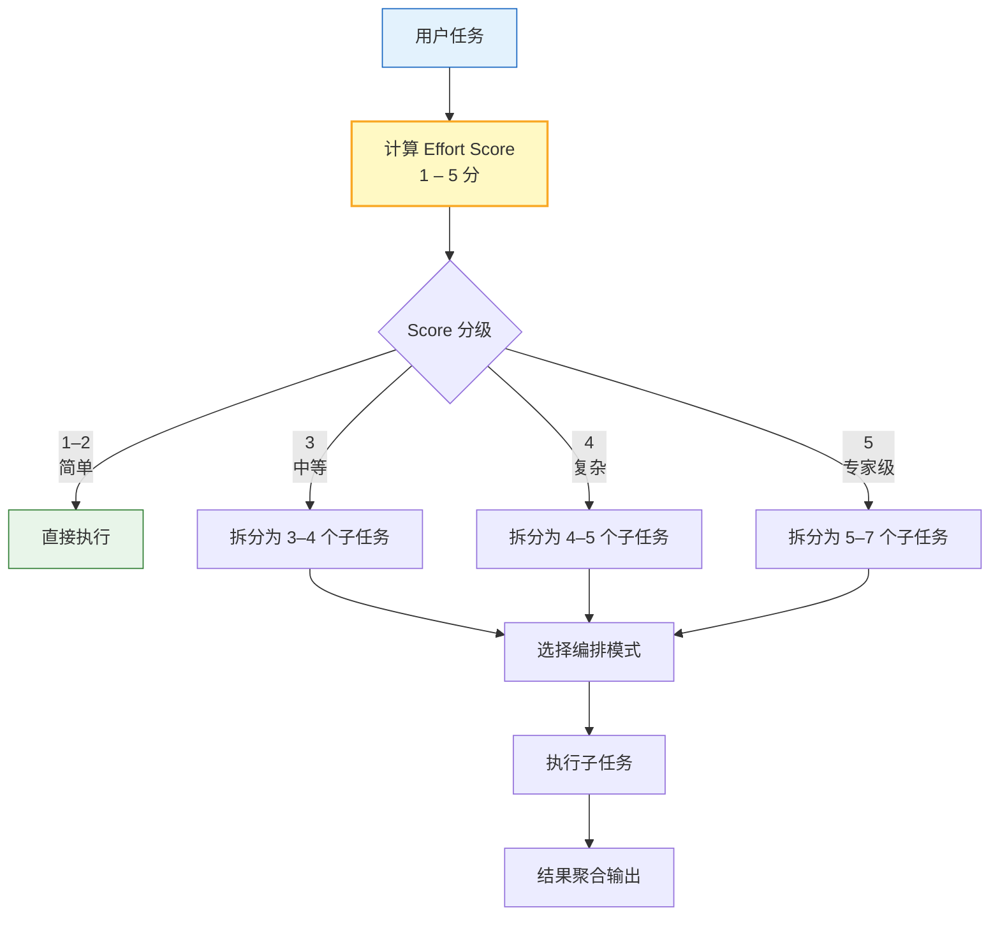
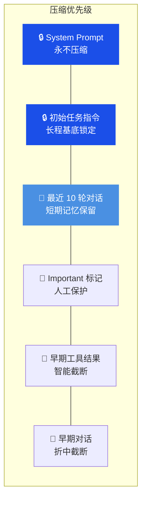
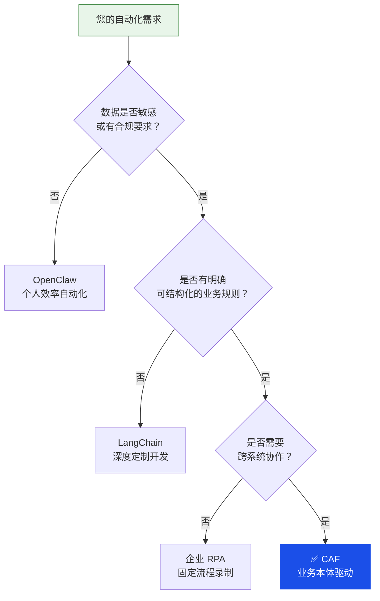
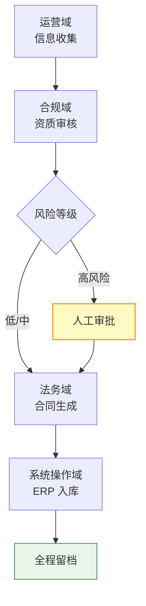

## 引言

2026 年初，多智能体系统从「个人玩具」走向「企业工具」。这个过程中有个问题没解决：**Agent 怎么知道自己该做什么、不该做什么？**

OpenClaw 证明了「本地 Agent + Skill 文件」的威力，但更适合 C 端个人用户。企业需要同样的范式，建立在不同的信任模型上。

我们一直在做类似的事情：**[Common Agent Framework (CAF)](https://github.com/FreezeSoul/common-agent-framework)**，一个面向 B 端的多智能体框架。核心主张：

> **B 端需要的不是更强的 Agent，而是知道边界的 Agent。**


## 一、CAF 解决的核心问题

企业上 AI Agent，障碍是信任。一个 Agent 要跑起来，必须回答三个问题：

| 问题 | 传统方案的困境 | CAF 的解决方式 |
|------|---------------|---------------|
| **它知道什么？** | Prompt 靠经验堆砌，规则散落各处 | 业务本体结构化定义 |
| **它能做什么？** | 代码硬编码，边界不清晰 | Skill 白名单 + 黑名单双控 |
| **它做了什么？** | 日志散乱，难以追溯 | 本体层面的执行对账 |

CAF 把**业务本体编译成 Skill 子集**。



这种模式带来三个关键特性：

| 特性 | 价值 |
|------|------|
| **可预期性** | Agent 的行为空间由 Skill 白名单限定，不会出现「我也不知道它会做什么」 |
| **可演化性** | 业务规则变了，只改本体定义即可 |
| **可审计性** | 每次执行都对照本体定义，偏差即是异常 |

## 二、核心特性概览

### 2.1 Markdown 驱动的技能系统

CAF 的 Skill 是**业务本体的结构化表达**：

```markdown
---
name: compliance-review
domain: legal-compliance
paradigm: plan
allowed-tools:
  - file_read
  - internal_compliance_db
tools_forbidden:
  - file_delete
  - external_api_call
approval_required:
  - condition: "风险等级 == 高"
    approvers: ["compliance_manager"]
uncertainty_policy: suspend
orchestration:
  mode: sequential
  steps:
    - id: extract_clauses
      description: "提取合同条款"
    - id: rule_matching
      description: "对照规则库匹配"
      depends_on: [extract_clauses]
    - id: generate_report
      description: "生成审核报告"
      depends_on: [rule_matching]
      role: reduce
---
```

这个文件是：业务文档、执行规范、权限边界、编排声明、审计基准。

### 2.2 智能编排系统

CAF 支持四种编排拓扑，自动适配不同的业务流程：



**拓扑选择指南**：

| 拓扑 | 典型场景 |
|------|----------|
| FanOut | 多源数据收集、批量处理 |
| Sequential | 流水线、前后依赖 |
| MapReduce | 数据分析、统计汇总 |
| DAG | 条件分支、多路汇聚、复杂业务流程 |

### 2.3 两阶段任务分析

CAF 实现了 Effort Score 机制，防止 Agent 把简单任务过度拆解：



### 2.4 Token 防爆护栏

CAF 的分级压缩策略保护关键信息不被遗忘：



### 2.5 MCP 深度集成

CAF 的工具层基于 MCP 协议：

- 现有 500+ MCP 工具可直接复用
- 企业内部系统包装成 MCP Server 即可接入
- 工具的使用权限在 Skill 层声明，不在代码里硬编码

```json
{
  "mcpServers": {
    "erp-readonly": {
      "command": "python",
      "args": ["./mcp_servers/erp_server.py"],
      "env": { "ACCESS_LEVEL": "readonly" }
    }
  }
}
```

### 2.6 可插拔执行范式

CAF 支持 7 种可插拔范式：

| 范式 | 适用场景 |
|------|----------|
| Direct | 简单问答 |
| ReAct | 需要工具解决问题的任务 |
| Plan | 复杂的多步骤长程任务 |
| Reflection | 创意写作、翻译、代码编写 |
| Tree of Thought | 需要深度探索的任务 |
| Auto | 复杂、长程且需要极高鲁棒性 |
| InlineLoop | 直接进入执行状态，适合大多数工具流 |

## 三、与竞品的差异

| | CAF | OpenClaw | LangChain |
|---|:---:|:---:|:---:|
| **设计对象** | B 端业务团队 | C 端开发者 | 开发者 |
| **知识载体** | 业务本体 → Skill | 个人习惯 → Skill | 代码 |
| **边界管理** | 白名单 + 黑名单 | 无系统性边界 | 代码控制 |
| **不确定处理** | 挂起等待人工确认 | AI 自行推测 | 取决于代码 |
| **审计粒度** | 本体合规层追踪 | 基本无 | 部分日志 |

**选型决策树**：



## 四、典型应用场景

### 场景一：合规 / 法务

规则明确，适合本体化：

| 环节 | 传统做法 | CAF 做法 |
|------|---------|---------|
| 知识来源 | 律师人工逐条审阅 | 合规规则库编译为本体 |
| 不确定处理 | 模糊处理或漏掉 | 命中 uncertainty_policy，自动挂起 |
| 审计 | 邮件 / 纸质留档 | 每条规则匹配记录可查 |

### 场景二：财务

数据溯源，准确性要求最高：

- 使用 python_exec 执行确定性代码，不依赖 LLM 推断
- 每个数字附带来源引用
- 与上期自动对比，标注异常项

### 场景三：运营

跨系统流程，追溯价值最大：



## 五、快速开始

### 5.1 安装

```bash
git clone https://github.com/FreezeSoul/common-agent-framework.git
cd common-agent-framework
pip install -r requirements.txt
```

### 5.2 配置

```bash
cp .env.example .env
# 编辑 .env 文件，添加你的 API_KEY
```

### 5.3 定义第一个 Skill

创建 `backend/skills/markdown/my_agent/SKILL.md`：

```markdown
---
name: my-first-agent
display_name: 我的第一个智能体
category: demo
paradigm: loop
allowed-tools:
  - web_search
  - file_read
---

这是我的第一个智能体助手。
```

### 5.4 运行

```bash
# 后端 API 服务
cd backend
python server.py

# 前端 Web 界面
cd frontend
streamlit run app.py
```

## 六、项目状态

### 已具备（可演示）

| 能力模块 | 状态 |
|---------|------|
| Skill 文件系统（含 tools 白名单） | ✅ 已实现 |
| 两阶段任务分析 + Effort Score | ✅ 已实现 |
| 四种编排拓扑 | ✅ 已实现 |
| EventBus 全链路追踪 | ✅ 已实现 |
| Token 防爆护栏 | ✅ 已实现 |
| MCP 原生支持 | ✅ 已实现 |
| 多模型接入 | ✅ 已实现 |

### 未来规划

- DAG 高级调度引擎
- 企业知识库 RAG 集成
- 沙箱安全执行
- 人机协同增强
- 多租户隔离

## 七、适合谁使用

**符合 3 项以上，可以试试 CAF**：

- 业务流程跨 2+ 个系统
- 有明确的业务规则可以结构化表达
- 高风险操作需要人工审批节点
- 每次操作需要留痕以备审计
- 数据有合规要求

**项目地址**：[https://github.com/FreezeSoul/common-agent-framework](https://github.com/FreezeSoul/common-agent-framework)

欢迎 Star、Issue 和 PR。

---

**参考资料**：
- [项目文档](https://github.com/FreezeSoul/common-agent-framework/tree/main/docs)
