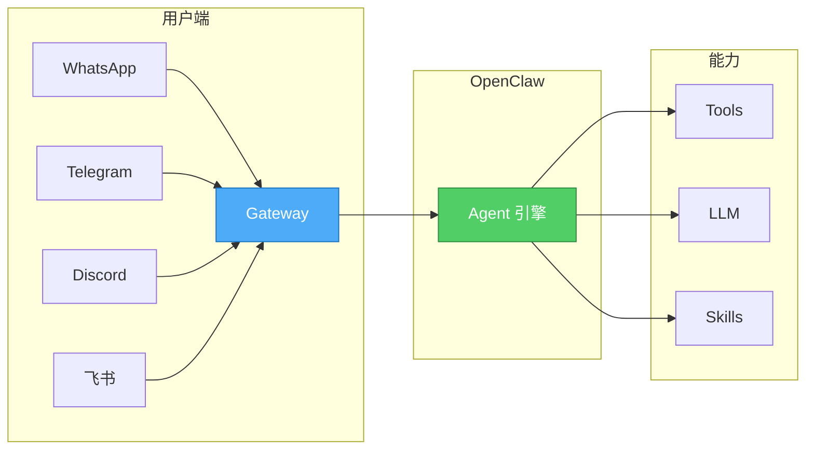
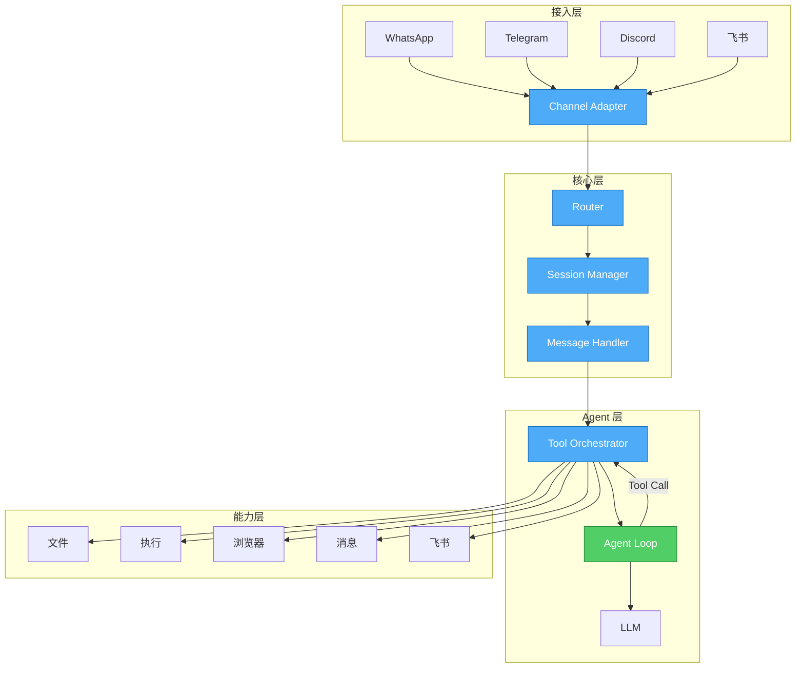
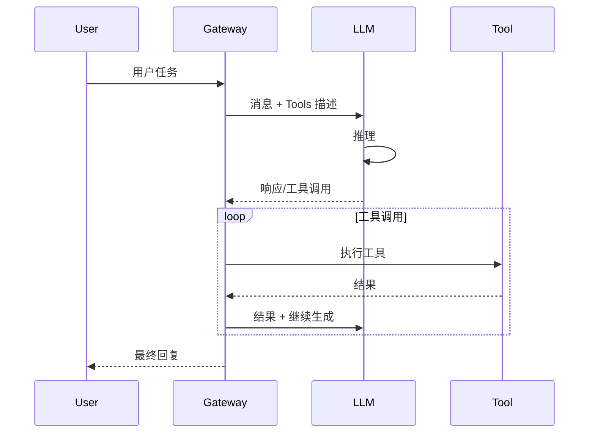
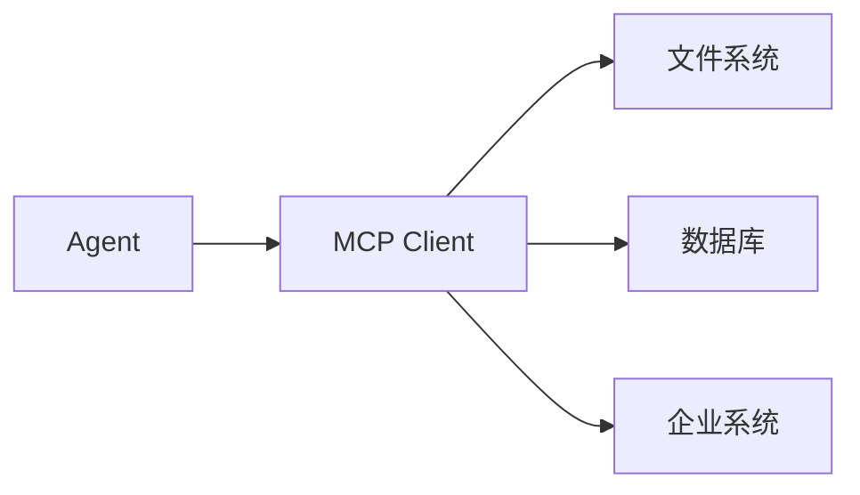
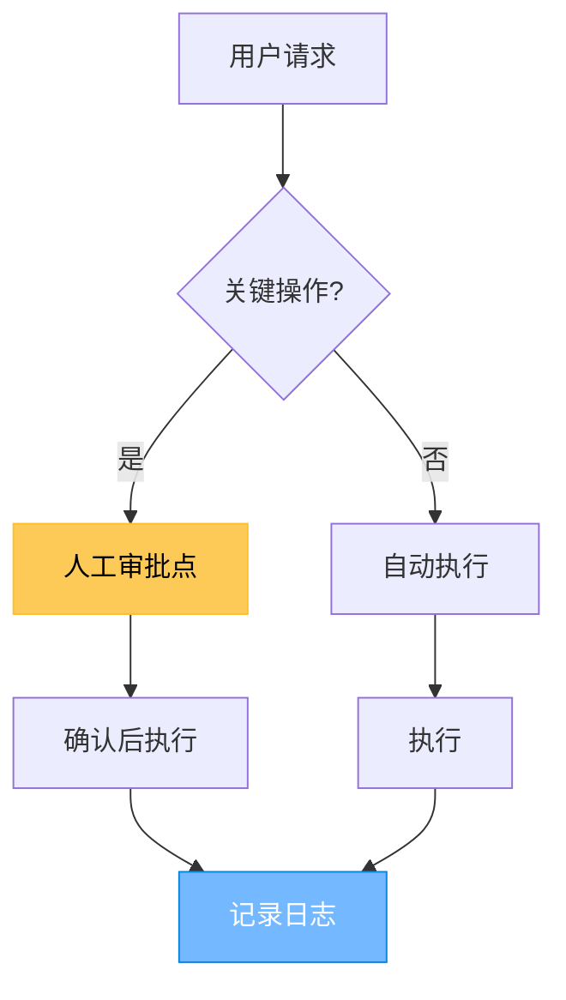
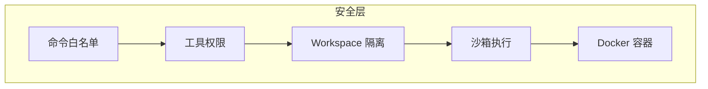

## 引言

当我们谈论 AI Agent 时，通常关注的是 Agent 本身的能力——如何推理、如何使用工具、如何完成复杂任务。但有一个关键问题经常被忽视：**用户如何触达这个 Agent？**

**OpenClaw** 是一个支持多通道的 AI Gateway，Agent 是它的核心能力。它让 AI Agent 能够通过任意渠道（WhatsApp、Telegram、Discord、飞书等）与用户交互。

本文深入分析 OpenClaw 的架构设计，探讨它在 Agent 实现、速度优化等方面的设计思考，以及通用型 Agent 进入 B 端市场后带来的新变化。

## 问题的本质：多通道 Gateway 面临的挑战

### 复杂性来源

构建一个多通道 Gateway 面临的核心挑战：

| 挑战 | 具体问题 |
|------|----------|
| **协议差异** | 每个平台的 API、认证、webhook 机制都不同 |
| **消息格式** | 文字、语音、图片、文件、表情的表示方式各异 |
| **会话管理** | 每个平台的会话 ID 体系不同 |
| **消息路由** | 如何区分私聊和群聊、如何处理 @提及 |
| **通道特性** | 有些平台不支持某些消息类型 |

## OpenClaw 的本质：Agent 优先的多通道 Gateway

### 核心理念

```
传统 Bot：接收命令 → 回复消息（被动）
OpenClaw：接收任务 → 自主执行 → 返回结果（主动 Agent）
```

OpenClaw 是一个支持多通道的 **AI Gateway**，Agent 是它的核心能力：



### 整体架构



## Agent 核心机制

### 单层循环 vs 多层编排

**OpenClaw 的 Agent Loop**：



**核心特点**：
1. **单层循环** - 不预分析，收到任务直接执行
2. **按需 Spawn** - 只在需要时才启动子 Agent
3. **Function Calling 原生** - 直接调用工具，不走 ReAct

### Function Calling vs ReAct

| 模式 | 原理 | 输出 |
|------|------|------|
| **ReAct** | Thought → Action → Observation 循环 | 长文本 |
| **Function Calling** | 模型直接输出工具调用 | 结构化 JSON |

```python
# ReAct 模式（OpenClaw 不推荐）
thought: "我需要查天气"
action: search("北京天气")
observation: "晴，25度"
thought: "现在可以回答用户"
final: "北京今天天气晴朗，25度"

# Function Calling（OpenClaw 原生）
{
  "tool_calls": [
    {"name": "weather", "args": {"city": "北京"}}
  ]
}
# → 执行后直接返回结果
```

### 工具系统设计

**工具定义示例**：

```json
{
  "name": "read",
  "description": "读取文件内容，支持文本和图片",
  "parameters": {
    "type": "object",
    "properties": {
      "path": {"type": "string", "description": "文件路径"},
      "lines": {"type": "number", "description": "读取行数"}
    },
    "required": ["path"]
  }
}
```

## 速度优化：OpenClaw 为什么响应快

### 优化策略

| 策略 | 说明 | 效果 |
|------|------|------|
| **跳过预分析** | 不先判断是否编排，直接执行 | -1 次 LLM 调用 |
| **Direct 模式** | 简单任务不用 ReAct | 减少 token 输出 |
| **流式输出** | 逐字返回而非等全部 | 用户感知更快 |
| **缓存** | LLM 响应缓存 | 重复请求秒回 |

### 两阶段分析的问题

**传统方案的通病**：

```
用户任务 → 分析要不要拆 → 拆分任务 → 执行 → 汇总
              ↑            ↑
           1次LLM      1次LLM
```

OpenClaw 的做法：

```
用户任务 → 直接执行（有需要才 spawn）
           ↑
         0 次额外分析
```

## 复杂任务处理

### Skills 封装

Skills 将多个工具组合成可复用的能力：

```
skills/
├── feishu-doc/      # 飞书文档
├── feishu-task/     # 飞书任务
└── weather/         # 天气查询
```

**SKILL.md 示例**：

```markdown
# feishu-doc

## 描述
飞书文档操作技能

## 工具
- feishu_doc: 读取/写入/创建文档
- feishu_wiki: 操作知识库

## 使用场景
- 读取团队文档
- 创建新文档
```

### Subagent 并行

当任务需要并行处理或隔离执行时：

```python
# 按需 Spawn
if task.needs_isolation:
    spawn_subagent(task, workspace=isolated_workspace)
elif task.can_parallel:
    spawn_subagent(task_a)
    spawn_subagent(task_b)
    await all_results()
else:
    execute_in_loop(task)
```

### MCP 扩展



## B 端市场的新变化：从工作流到通用 Agent

### 以前的 B 端主流：Dify 类工作流方案

在 OpenClaw 这样的大火之前，B 端的 AI 方案主要是 **Dify** 这类工作流（Workflow）产品：

**Dify 的特点**：
- 预设流程：拖拽节点，固定执行路径
- 每一步都配置好，LLM 只负责其中特定环节
- 适合：审批流、查询流、固定流程
- 优势：可控、可预测、可调试

```
┌─────┐   ┌─────┐   ┌─────┐   ┌─────┐
│开始 │ → │LLM  │ → │API  │ → │结束 │
└─────┘   └─────┘   └─────┘   └─────┘
   ↓
┌─────┐   ┌─────┐
│判断 │ → │分支 │
└─────┘   └─────┘
```

### 市场正在发生变化

但随着通用型 Agent（如 OpenClaw 这类）的出现，B 端市场正在发生变化：

**通用 Agent 的特点**：
- 不预设流程：描述目标，Agent 自主判断步骤
- 灵活：能处理非结构化、复杂、多变的任务
- 适合：客服助手、业务查询、多轮对话

```
用户：帮我处理客户投诉
      ↓
Agent 理解意图 → 判断需要几步 → 动态执行 → 返回结果
```

### C 端 vs B 端：关注点的本质差异

| C 端关注 | B 端关注 | 本质 |
|----------|----------|------|
| 能力上限 | 质量保障 | 能否规模化交付 |
| 好玩、快速 | 准确、可追溯 | 能否用于生产 |
| 个人助手 | 企业服务 | 能否多人/多部门使用 |
| 低延迟 | 高并发 | 能否承载大流量 |
| 低成本 | 安全合规 | 能否通过审计 |

**核心区别**：
- **C 端**：关心 Agent "能做什么"
- **B 端**：关心 Agent "能否稳定、准确、可控地完成任务"

## B 端需要什么能力：问题与解决思路

### 1. 准确性问题

**B 端核心问题**：结果能否用于生产环境？

| 问题 | 解决思路 |
|------|----------|
| 幻觉 | 工具约束 + 结果验证 + 知识库增强 |
| 随机性 | 降低温度 + 输出格式约束 |
| 边界模糊 | 明确工具权限 + 审核机制 |

**解决思路**：



- **工具精确描述**：每个工具的 description 要清晰定义输入输出
- **知识库增强**：RAG 接入企业知识，确保回答有据可查
- **审核机制**：敏感操作需要人工确认

### 2. 可追溯性问题

**B 端核心问题**：出了问题，能否定位原因？

| 问题 | 解决思路 |
|------|----------|
| 过程黑盒 | 完整日志 + Tool 调用链 |
| 结果难复现 | 输入输出留存 |
| 责任不清 | 审计日志 |

**解决思路**：

- **完整日志**：每步操作、每个 Tool 调用都记录
- **执行轨迹**：User → LLM → Tool → Result 全链路追踪
- **审计日志**：谁在什么时候做了什么，完整留存

### 3. 安全问题

**B 端核心问题**：数据能否保障？操作是否合规？

| 问题 | 解决思路 |
|------|----------|
| 数据泄露 | 本地部署 + 沙箱隔离 |
| 越权操作 | 命令白名单 + 工具权限 |
| 内容风险 | 敏感词过滤 + 审核机制 |

**安全机制体系**：



**命令白名单**：

```json
{
  "commands": {
    "deny": ["rm", "dd", "mkfs", "format"]
  }
}
```

**工具权限控制**：

```json
{
  "tools": {
    "allow": ["read", "write", "exec"],
    "deny": ["browser", "canvas", "nodes"]
  }
}
```

**Docker 沙箱**：

```json
{
  "agents": {
    "defaults": {
      "sandbox": {
        "mode": "all",
        "scope": "session",
        "workspaceAccess": "none"
      }
    }
  }
}
```

| 参数 | 选项 | 说明 |
|------|------|------|
| mode | off / non-main / all | 沙箱启用模式 |
| scope | session / agent / shared | 容器复用策略 |
| workspaceAccess | none / ro / rw | 工作目录访问权限 |

### 4. 稳定性问题

**B 端核心问题**：能否承载大流量？能否 7×24 小时稳定运行？

| 问题 | 解决思路 |
|------|----------|
| 大流量 | 限流 + 排队机制 |
| 响应慢 | 超时控制 + 分级处理 |
| 崩溃 | 重试 + 熔断 |

**稳定性保障**：

```yaml
gateway:
  rate_limit:
    requests_per_minute: 60
  timeout:
    default: 120s
    tool_execution: 60s
  retry:
    max_attempts: 3
    backoff: exponential
  circuit_breaker:
    enabled: true
    threshold: 10 failures
```

### 5. 企业集成问题

**B 端核心问题**：能否接入现有系统？

| 问题 | 解决思路 |
|------|----------|
| 系统隔离 | MCP 协议 + API 网关 |
| 权限对接 | 企业身份集成 |
| 流程对接 | Webhook + 事件机制 |

**MCP 集成企业系统**：

```
Agent → MCP → 企业系统
              ↓
         CRM / ERP / 工单
```

## 通用 Agent 进入 B 端的新思路

### 工作流 vs 通用 Agent

| 维度 | Dify Workflow | 通用 Agent |
|------|---------------|------------|
| 流程 | 预设固定 | 动态生成 |
| 灵活性 | 低 | 高 |
| 适用场景 | 标准化流程 | 非标、复杂任务 |
| 维护方式 | 拖拽配置 | 描述规范 |
| 调试 | 节点可视化 | 过程追踪 |
| 规模化 | 适合小规模 | 可规模化 |

### 如何选择

| 场景 | 推荐方案 |
|------|----------|
| 固定审批流 | Dify Workflow |
| 客服多轮对话 | 通用 Agent |
| 数据查询报表 | Dify Workflow |
| 复杂业务处理 | 通用 Agent |
| 简单问答 | 都可以 |

### 混合方案

未来 B 端的主流可能是 **工作流 + 通用 Agent 的混合**：

```
用户请求
    ↓
[判断类型] → 固定流程 → Dify Workflow
    ↓
    → 复杂处理 → 通用 Agent
```

- **简单标准化任务**：走 Dify 工作流
- **复杂非标任务**：走通用 Agent
- **Agent 无法处理**：转人工 + 记录工单

## 总结

OpenClaw 是一个支持多通道的 **AI Gateway**，Agent 是它的核心能力。它的设计思考：

1. **Agent 优先** - 不是 Bot，是能执行任务的 Agent
2. **速度优化** - 单层循环、Function Calling、按需 Spawn
3. **复杂任务** - Skills 编排、Subagent 并行、MCP 扩展

**B 端市场的新变化**：
- 以前：Dify 类工作流是主流
- 现在：通用 Agent 正在进入 B 端

**B 端核心关注**：
- 准确性：结果能否用于生产
- 可追溯：出了问题能否定位
- 安全：数据保障和合规
- 稳定：能否规模化承载
- 集成：能否接入企业系统

**通用 Agent 的价值**：
- 不是替代工作流，而是补充工作流无法覆盖的场景
- 适合复杂、非标、多变的业务需求
- 灵活性高，但需要配套的质量保障机制

**把 Agent 能力通过任意渠道触达用户，同时保障质量和稳定性——这是 B 端部署的关键挑战。**

---

> *参考资源：*
> *- [OpenClaw GitHub](https://github.com/openclaw/openclaw)*
> *- [OpenClaw 文档](https://docs.openclaw.ai)*
> *- [Function Calling vs ReAct](https://docs.openclaw.ai/concepts/paradigms)*
> *- [Sandboxing](https://docs.openclaw.ai/gateway/sandboxing)*
