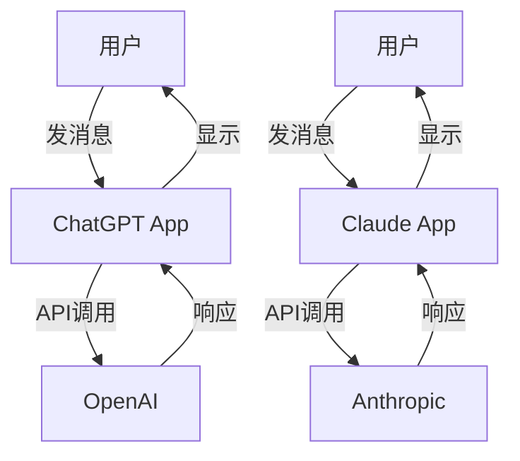
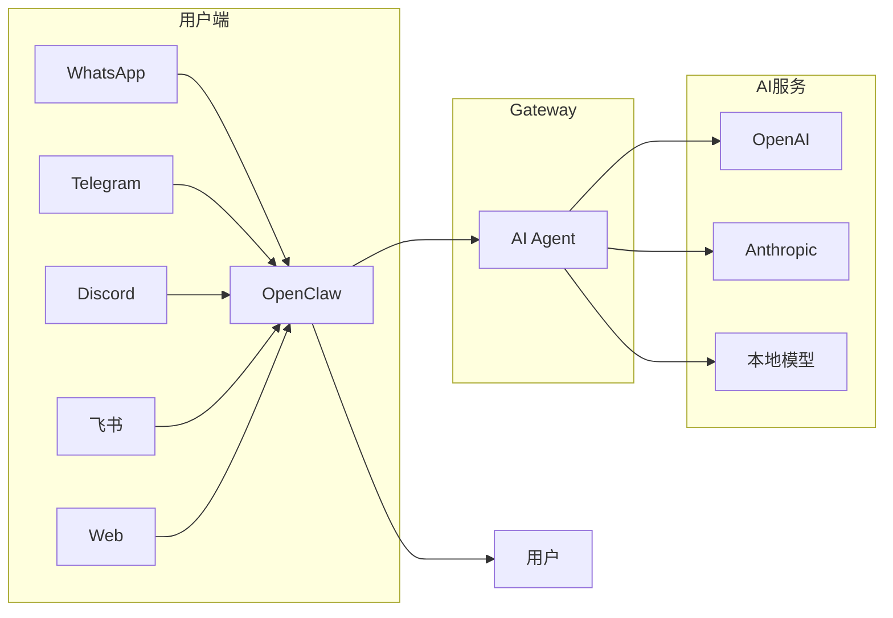
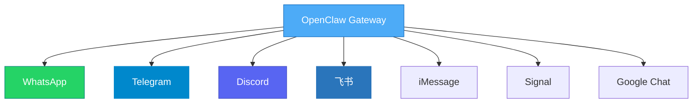
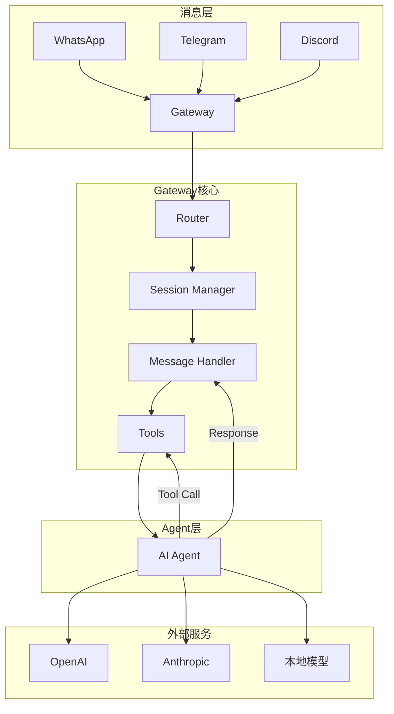
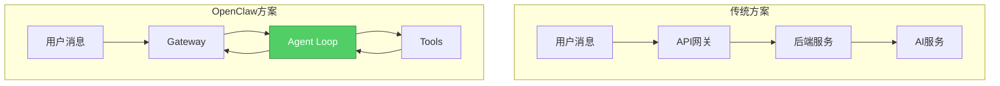
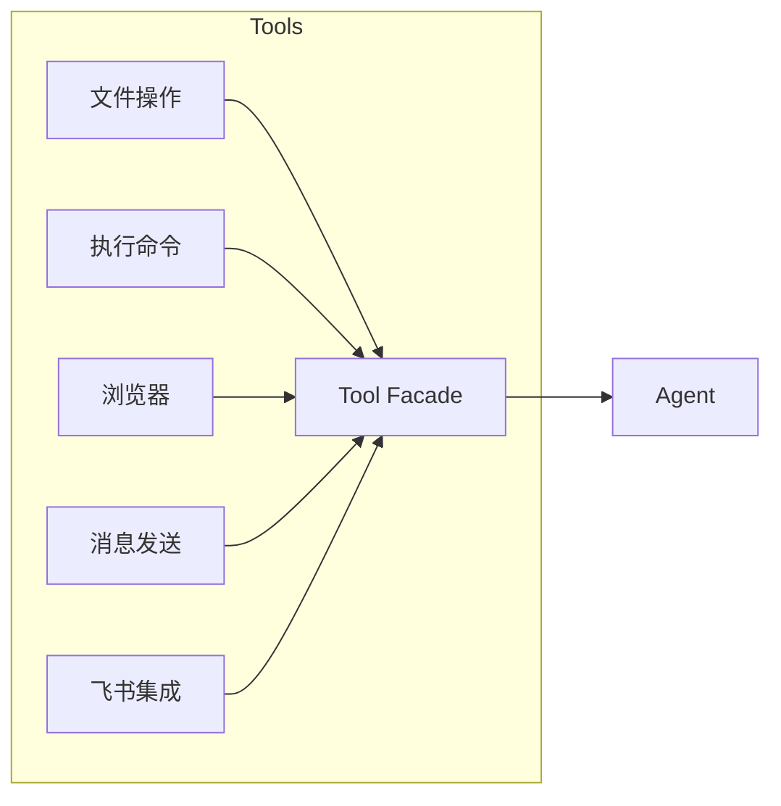
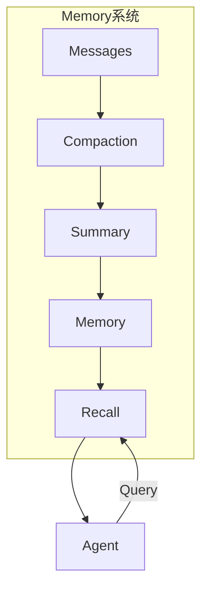
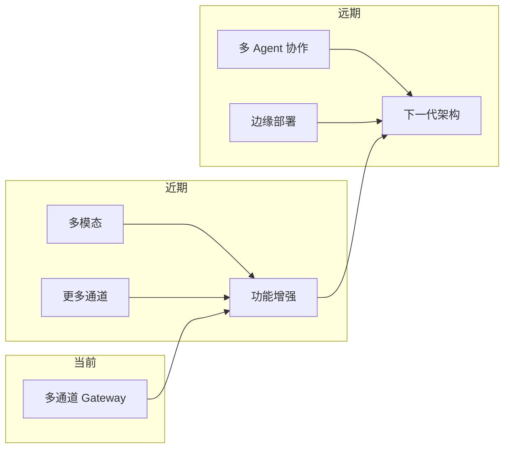

## 引言

在 AI Agent 蓬勃发展的今天，如何让 AI 助手便捷地触达用户成为了一个核心问题。闭源方案如 ChatGPT、Claude 有自己的 App 和 Web 界面，但如果我们想构建自己的 AI 助手，并将其接入多个消息平台（WhatsApp、Telegram、Discord、飞书等），该怎么做？

**OpenClaw** 正是为解决这一问题而生的开源项目——一个支持多通道的 AI Agent 网关。

## 背景：为什么需要 Agent 网关

### 传统的 AI 对话方案



**问题**：
- 每个 AI 服务都有独立的 App
- 用户需要在多个 App 之间切换
- 无法自定义 AI 的行为和能力
- 数据存储在服务商那里

### Agent 网关的解决方案



一个统一的网关：
- 接收来自各个平台的消息
- 路由到同一个 AI Agent
- 返回统一的响应
- 支持自定义工具和能力

## OpenClaw 是什么

**OpenClaw** 是一个开源的多通道 AI Agent 网关，基于 Node.js 开发，支持同时连接多个消息平台。

### 核心理念

| 理念 | 含义 |
|------|------|
| **自托管** | 数据存在本地，不依赖第三方 |
| **多通道** | 一个 Gateway 服务多个平台 |
| **Agent 原生** | 为 AI Coding Agent 专门设计 |
| **可扩展** | 支持插件和自定义工具 |

### 支持的通道



## 架构设计

### 整体架构



### 核心组件

**1. Gateway（网关核心）**
- 管理所有通道连接
- 消息路由和分发
- Session 管理

**2. Session（会话管理）**
- 每个用户/群聊独立会话
- 支持上下文记忆
- 会话压缩和摘要

**3. Tools（工具系统）**
- 文件读写、执行命令
- 浏览器自动化
- 消息发送
- 自定义技能（Skills）

**4. Skills（技能系统）**
- 将多个工具组合成技能
- 支持 Markdown 定义
- 可共享和复用

## 核心特性

### 1. 多通道消息统一管理

```python
# 一次开发，多平台运行
# 用户从任何平台发的消息都会路由到同一个 Agent
user_from_whatsapp  --> Gateway --> Agent
user_from_telegram   --> Gateway --> Agent  
user_from_discord   --> Gateway --> Agent
# 响应会返回到对应的平台
```

### 2. Agent 原生设计



OpenClaw 是为 **Coding Agent** 设计的：
- 原生支持 Tool Calling
- 支持多 Agent 路由
- 支持 Subagent Spawn
- 支持 Memory 和上下文管理

### 3. 工具系统



**内置工具**：
- `read` / `write` / `edit` - 文件操作
- `exec` - 执行 shell 命令
- `browser` - 浏览器自动化
- `message` - 发送消息
- `feishu_*` - 飞书相关操作
- `sessions_spawn` - 启动子 Agent

### 4. 技能系统（Skills）

Skills 是 OpenClaw 的扩展机制，将多个工具组合成可复用的能力：

```
skills/
├── feishu-doc/      # 飞书文档操作
├── feishu-task/     # 飞书任务管理
├── feishu-wiki/     # 飞书知识库
└── weather/         # 天气查询
```

每个 Skill 包含：
- `SKILL.md` - 技能定义
- 工具实现
- 配置文件

### 5. 内存与记忆



- **Session** - 当前对话上下文
- **Memory** - 长期记忆（可配置）
- **Compaction** - 自动压缩长对话
- **Search** - 记忆检索

## 使用场景

### 场景一：个人 AI 助手

```
你 --> WhatsApp --> Gateway --> Agent --> AI服务
                 <-- Gateway <-- 响应 <--
```

- 在手机上发消息给 AI
- 支持语音和图片输入
- AI 可以调用工具完成实际任务

### 场景二：团队协作 AI

```
群聊 --> Gateway --> Agent --> 工具集
                    <-- 响应 <--
```

- 团队共享一个 AI 助手
- 可以接入内部系统
- 支持权限控制

### 场景三：多租户 SaaS

```
用户A --> Gateway --> Agent A
用户B --> Gateway --> Agent B
用户C --> Gateway --> Agent C
```

- 每个用户/团队独立 Agent
- 独立的 Workspace
- 独立的认证

## 快速开始

### 安装

```bash
npm install -g openclaw@latest
```

### 配置

```json
{
  "channels": {
    "feishu": {
      "enabled": true,
      "appId": "your-app-id",
      "appSecret": "your-app-secret"
    }
  },
  "models": {
    "providers": {
      "anthropic": {
        "apiKey": "your-api-key"
      }
    }
  }
}
```

### 启动

```bash
# 启动 Gateway
openclaw gateway

# 打开 Web 控制台
openclaw web
```

### 添加通道

```bash
# 登录 WhatsApp
openclaw channels login --channel whatsapp

# 登录 Telegram
openclaw channels login --channel telegram
```

## 与其他方案的对比

| 特性 | OpenClaw | ChatGPT | Slack AI | Botpress |
|------|----------|---------|----------|----------|
| 部署方式 | 自托管 | SaaS | SaaS | 自托管 |
| 通道数量 | 8+ | 1 | 有限 | 10+ |
| Agent 能力 | 完整 | 基础 | 基础 | 中等 |
| 工具扩展 | ✅ | ❌ | ❌ | ✅ |
| 开源 | ✅ | ❌ | ❌ | ✅ |

## 实践建议

### 1. 通道选择

| 推荐场景 | 推荐通道 |
|----------|----------|
| 个人使用 | WhatsApp / Telegram |
| 团队协作 | 飞书 / Discord |
| 企业集成 | 飞书 / Slack |

### 2. 模型选择

| 场景 | 推荐模型 |
|------|----------|
| 日常对话 | GPT-4o / Claude 3.5 |
| 代码任务 | Claude 3.7 / GPT-4 |
| 成本敏感 | MiniMax / 本地模型 |

### 3. 安全建议

```json
{
  "channels": {
    "whatsapp": {
      "allowFrom": ["+1555xxxxxxx"]
    }
  },
  "gateway": {
    "auth": {
      "mode": "token"
    }
  }
}
```

- 限制可以访问的用户
- 使用 Token 认证
- 敏感操作需要确认

### 4. 扩展开发

创建自定义 Skill：

```
my-skill/
├── SKILL.md
├── index.js
└── tools/
    └── mytool.js
```

## 未来展望



- **多模态增强** - 更好的语音和视频支持
- **更多通道** - LINE、微信等
- **多 Agent 编排** - 复杂任务分工
- **边缘部署** - 更低的延迟

## 总结

OpenClaw 提供了一个**自托管、多通道、可扩展**的 AI Agent 网关解决方案。它的核心价值在于：

1. **统一入口** - 一个 Gateway 服务多个平台
2. **Agent 原生** - 为 AI Coding 专门优化
3. **完全可控** - 数据本地，能力自定义
4. **开源免费** - 社区驱动，持续演进

如果你想构建自己的 AI 助手，或者为企业搭建 AI 对话系统，OpenClaw 是一个值得考虑的选择。

**把 AI 能力接入你熟悉的渠道，让它成为真正的助手。**

---

> *参考资源：*
> *- [OpenClaw 官网](https://openclaw.ai)*
> *- [GitHub 仓库](https://github.com/openclaw/openclaw)*
> *- [文档](https://docs.openclaw.ai)*
> *- [Discord 社区](https://discord.com/invite/clawd)*
