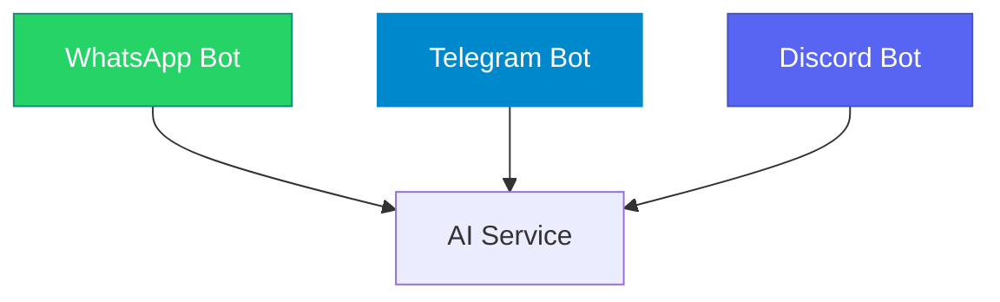
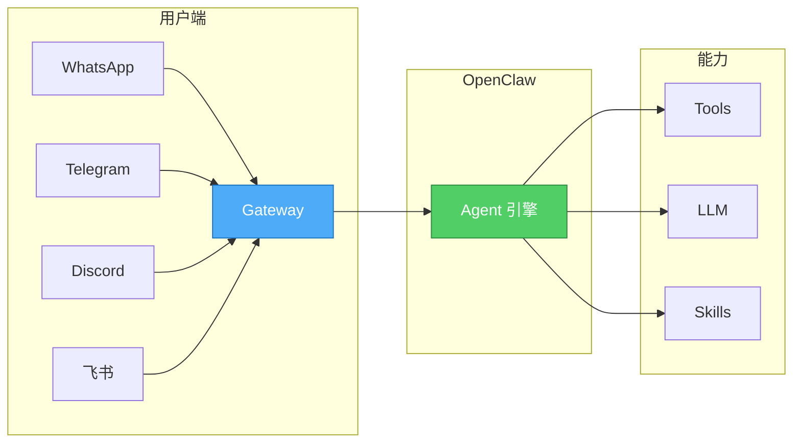
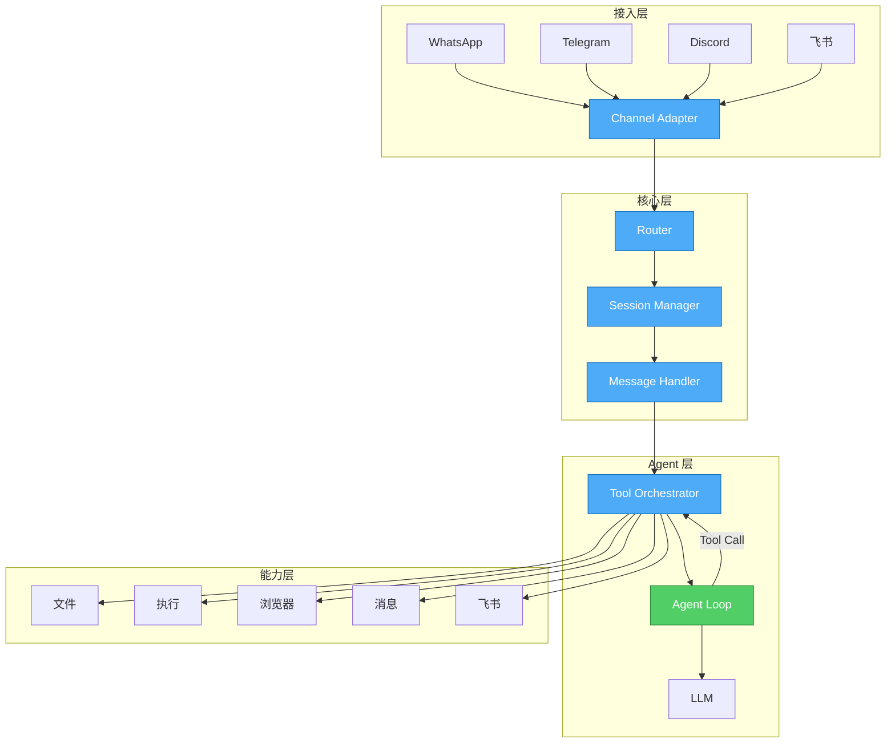
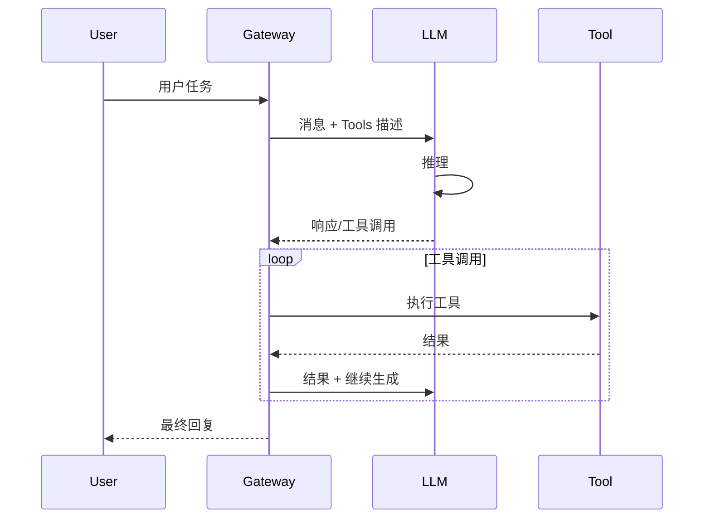
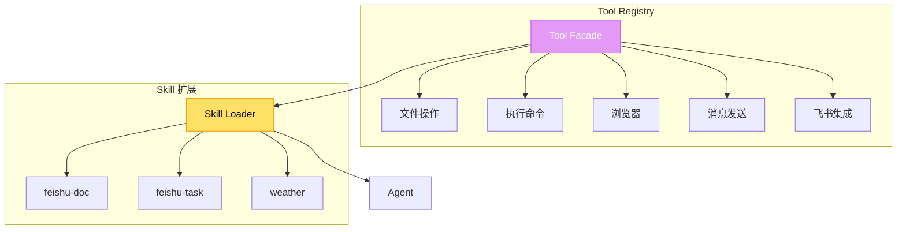
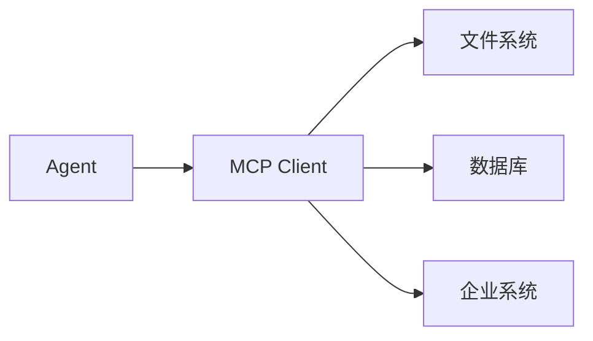
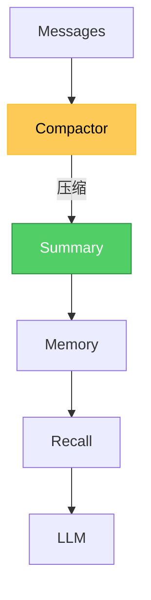
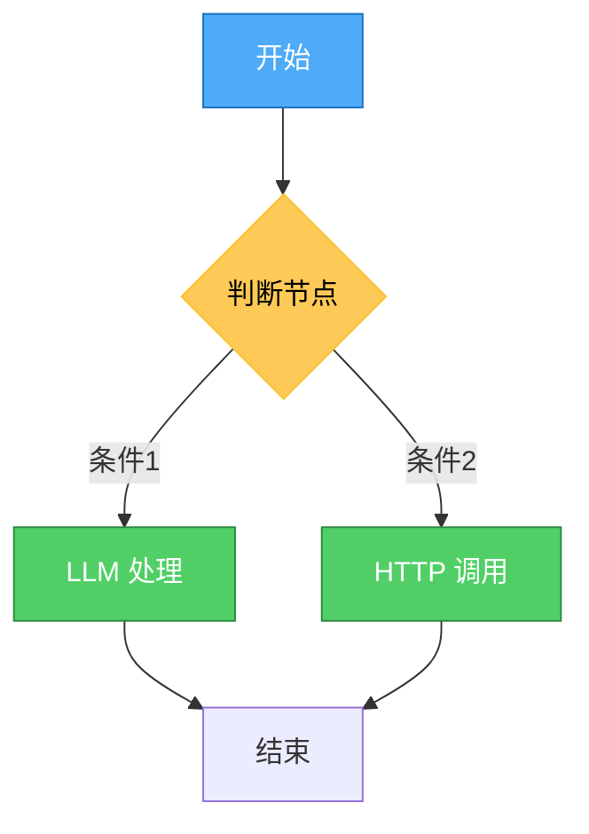
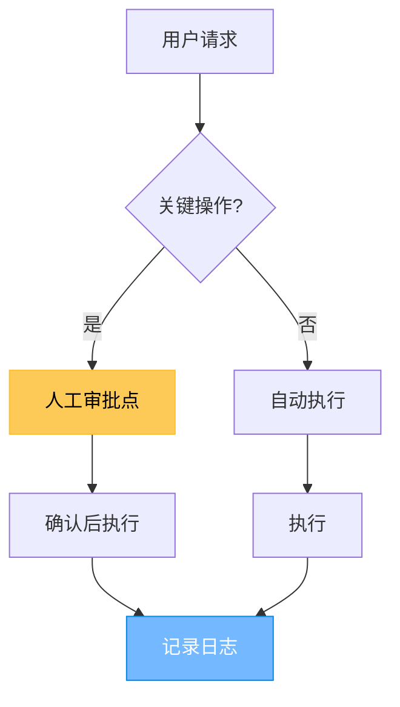

## 引言

当我们谈论 AI Agent 时，通常关注的是 Agent 本身的能力——如何推理、如何使用工具、如何完成复杂任务。但有一个关键问题经常被忽视：**用户如何触达这个 Agent？**

**OpenClaw** 是一个支持多通道的 AI Gateway，Agent 是它的核心能力。它不是传统意义上的 Bot 框架，而是让 AI Agent 能够通过任意渠道（WhatsApp、Telegram、Discord、飞书等）与用户交互的统一入口。

本文深入分析 OpenClaw 的架构设计，探讨它在 Agent 实现、速度优化、复杂任务处理等方面的设计思考，以及从 C 端到 B 端场景的演进。

## 问题的本质：多通道 Gateway 面临的挑战

### 复杂性来源

构建一个多通道 Gateway 面临的核心挑战：

| 挑战 | 具体问题 |
|------|----------|
| **协议差异** | 每个平台的 API、认证、webhook 机制都不同 |
| **消息格式** | 文字、语音、图片、文件、表情的表示方式各异 |
| **会话管理** | 每个平台的会话 ID 体系不同 |
| **消息路由** | 如何区分私聊和群聊、如何处理 @提及 |
| **通道特性** | 有些平台不支持某些消息类型 |

### 传统 Bot 框架的局限

**方案一：每个平台独立部署**



**问题**：
- 代码重复：每个平台都要写一套
- 状态不同步：用户在不同平台看到的状态不一致
- 维护困难：一个功能要改多次

**方案二：使用现有 Bot 框架**

| 框架 | 优点 | 缺点 |
|------|------|------|
| Botpress | 功能完善 | 重量级，AI 能力弱 |
| Microsoft Bot Framework | 微软生态好 | 过于复杂 |
| Dialogflow | NLP 强 | Google 生态绑定 |

**核心问题**：这些框架都不是为 **AI Agent** 设计的，它们擅长的是对话流程管理，而非 Agent 能力。

## OpenClaw 的本质：Agent 优先的多通道 Gateway

### 核心理念

```
传统 Bot：接收命令 → 回复消息（被动）
OpenClaw：接收任务 → 自主执行 → 返回结果（主动 Agent）
```

OpenClaw 是一个支持多通道的 **AI Gateway**，Agent 是它的核心能力：



### 整体架构



## Agent 核心机制

### 单层循环 vs 多层编排

**OpenClaw 的 Agent Loop**：



**核心特点**：
1. **单层循环** - 不预分析，收到任务直接执行
2. **按需 Spawn** - 只在需要时才启动子 Agent
3. **Function Calling 原生** - 直接调用工具，不走 ReAct

### Function Calling vs ReAct

| 模式 | 原理 | 输出 |
|------|------|------|
| **ReAct** | Thought → Action → Observation 循环 | 长文本 |
| **Function Calling** | 模型直接输出工具调用 | 结构化 JSON |

```python
# ReAct 模式（OpenClaw 不推荐）
thought: "我需要查天气"
action: search("北京天气")
observation: "晴，25度"
thought: "现在可以回答用户"
final: "北京今天天气晴朗，25度"

# Function Calling（OpenClaw 原生）
{
  "tool_calls": [
    {"name": "weather", "args": {"city": "北京"}}
  ]
}
# → 执行后直接返回结果
```

### 工具系统设计



**工具定义示例**：

```json
{
  "name": "read",
  "description": "读取文件内容，支持文本和图片",
  "parameters": {
    "type": "object",
    "properties": {
      "path": {"type": "string", "description": "文件路径"},
      "lines": {"type": "number", "description": "读取行数"}
    },
    "required": ["path"]
  }
}
```

## 速度优化：OpenClaw 为什么响应快

### 优化策略

| 策略 | 说明 | 效果 |
|------|------|------|
| **跳过预分析** | 不先判断是否编排，直接执行 | -1 次 LLM 调用 |
| **Direct 模式** | 简单任务不用 ReAct | 减少 token 输出 |
| **流式输出** | 逐字返回而非等全部 | 用户感知更快 |
| **缓存** | LLM 响应缓存 | 重复请求秒回 |
| **轻量 IPC** | 子进程通信优化 | 减少延迟 |

### 两阶段分析的问题

**传统方案的通病**：

```
用户任务 → 分析要不要拆 → 拆分任务 → 执行 → 汇总
              ↑            ↑
           1次LLM      1次LLM
```

OpenClaw 的做法：

```
用户任务 → 直接执行（有需要才 spawn）
           ↑
         0 次额外分析
```

### 缓存策略

```python
# LLM 缓存
cache_config = {
    "enable": True,
    "ttl": 300,           # 5 分钟
    "max_entries": 5000,
    "key": "semantic"     # 语义匹配
}
```

## 复杂任务处理

### Skills 封装

Skills 将多个工具组合成可复用的能力：

```
skills/
├── feishu-doc/      # 飞书文档
├── feishu-task/     # 飞书任务
├── feishu-wiki/    # 飞书知识库
└── weather/        # 天气查询
```

**SKILL.md 示例**：

```markdown
# feishu-doc

## 描述
飞书文档操作技能

## 工具
- feishu_doc: 读取/写入/创建文档
- feishu_wiki: 操作知识库

## 使用场景
- 读取团队文档
- 创建新文档
- 查询知识库
```

### Subagent 并行

当任务需要并行处理或隔离执行时：

```python
# 按需 Spawn
if task.needs_isolation:
    spawn_subagent(task, workspace=isolated_workspace)
elif task.can_parallel:
    spawn_subagent(task_a)
    spawn_subagent(task_b)
    await all_results()
else:
    # 主 Agent 直接处理
    execute_in_loop(task)
```

### MCP 扩展



## 准确性保障

### 工具描述精确化

```json
{
  "name": "execute_sql",
  "description": "执行 SQL 查询，仅用于只读操作",
  "parameters": {
    "properties": {
      "sql": {
        "type": "string",
        "description": "SELECT 语句，仅支持查询"
      }
    }
  }
}
```

### 上下文管理



**压缩策略**：
- 保留最近 N 条完整消息
- 旧消息 → 摘要
- 关键信息 → Memory

### 验证机制

| 机制 | 说明 |
|------|------|
| **工具白名单** | 只允许特定工具 |
| **命令审批** | 危险操作需确认 |
| **结果校验** | 返回结果格式验证 |

## 企业 SOP 实现路径

### Dify vs OpenClaw：两种范式

| 维度 | Dify Workflow | OpenClaw Agent |
|------|---------------|----------------|
| **流程** | 预设固定 | 动态生成 |
| **灵活性** | 低 | 高 |
| **适用场景** | 标准化流程 | 非标、复杂任务 |
| **维护方式** | 拖拽配置 | 描述规范 |
| **调试** | 节点可视化 | 过程追踪 |

### Dify 的流程编排



### Agent 的意图驱动

```
用户：帮我处理客户投诉
      ↓
Agent 理解意图 → 判断需要几步 → 动态执行 → 返回结果

可能的步骤（Agent 自主决定）：
1. 查客户历史
2. 分析投诉内容
3. 生成解决方案
4. 发送回复
```

### Skills 封装企业 SOP

```yaml
# customer-complaint-skill
skill: 客户投诉处理 SOP

流程:
  1. 获取客户历史订单
  2. 分析投诉内容（LLM）
  3. 匹配解决方案库
  4. 生成回复
  5. 记录工单

工具:
  - get_customer_history
  - analyze_with_llm
  - search_solution_kb
  - generate_response
  - create_ticket
```

### MCP 集成企业系统

```
Agent → MCP → 企业系统
              ↓
         CRM / ERP / 工单
```

## C 端为什么强

### 核心优势

| 优势 | 说明 |
|------|------|
| **多通道** | 一个 Gateway 服务 WhatsApp/Telegram/飞书 |
| **低成本** | 自部署，不用买服务 |
| **可定制** | 自己写 Skill，接自己系统 |
| **数据自主** | 存在本地，不依赖第三方 |
| **Agent 能力** | 不是简单 Bot，是能执行任务的 Agent |

### 典型场景

```
个人助手：
  微信/Telegram → Agent → 查天气/搜资料/写代码
  
团队协作：
  飞书群聊 → Agent → 查文档/建任务/做分析
```

## B 端挑战与应对

### C 端 vs B 端关注点

| C 端关注 | B 端关注 |
|----------|----------|
| 好玩、快速 | 准确、可追溯 |
| 个人助手 | 企业服务 |
| 单一任务 | 复杂工作流 |
| 低延迟 | 高并发 |
| 低成本 | 安全合规 |

### 准确性保障



### 可追溯性

| 机制 | 说明 |
|------|------|
| **完整日志** | 每步操作记录 |
| **执行轨迹** | Tool 调用链可视化 |
| **结果留存** | 输出可复查 |
| **审计日志** | 谁在什么时候做了什么 |

### 安全合规

| 问题 | 应对 |
|------|------|
| **数据不出网** | 本地部署 |
| **敏感操作** | 审批 + 白名单 |
| **权限控制** | Workspace 隔离 |
| **内容过滤** | 敏感词检测 |
| **合规审计** | 操作日志留存 |

### 稳定性保障

```yaml
# 生产配置示例
gateway:
  rate_limit:
    requests_per_minute: 60
  timeout:
    default: 120s
    tool_execution: 60s
  retry:
    max_attempts: 3
    backoff: exponential
  circuit_breaker:
    enabled: true
    threshold: 10 failures
```

## 总结

OpenClaw 是一个支持多通道的 **AI Gateway**，Agent 是它的核心能力。它的设计思考：

1. **Agent 优先** - 不是 Bot，是能执行任务的 Agent
2. **速度优化** - 单层循环、Function Calling、按需 Spawn
3. **复杂任务** - Skills 编排、Subagent 并行、MCP 扩展
4. **准确性** - 工具精确描述、上下文管理、验证机制
5. **C 端强** - 多通道、低成本、可定制、数据自主
6. **B 端应对** - 准确性、可追溯、安全合规、稳定性

与 Dify 等 Workflow 方案相比，OpenClaw 更适合**非标、复杂、需要 Agent 自主决策**的场景。

**把 Agent 能力通过任意渠道触达用户——这就是 OpenClaw 的价值。**

---

> *参考资源：*
> *- [OpenClaw GitHub](https://github.com/openclaw/openclaw)*
> *- [OpenClaw 文档](https://docs.openclaw.ai)*
> *- [Function Calling vs ReAct](https://docs.openclaw.ai/concepts/paradigms)*
