## 引言

当我们谈论 AI Agent 时，通常关注的是 Agent 本身的能力——如何推理、如何使用工具、如何完成复杂任务。但有一个关键问题经常被忽视：**用户如何触达这个 Agent？**

ChatGPT 有 Web 和 App，Claude 有独立的客户端，但如果你想构建自己的 AI 助手，并将其接入多个消息平台（WhatsApp、Telegram、Discord、飞书等），会发现这个"网关层"意外地复杂。

本文深入分析 **OpenClaw** 的架构设计，看看它是如何解决这个问题的。

## 问题的本质：多通道 Agent 网关面临的挑战

### 复杂性来源

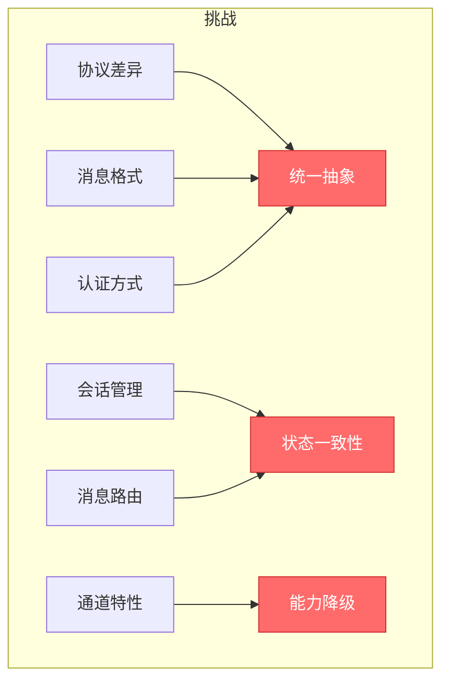

构建一个多通道网关面临的核心挑战：

| 挑战 | 具体问题 |
|------|----------|
| **协议差异** | 每个平台的 API、认证、webhook 机制都不同 |
| **消息格式** | 文字、语音、图片、文件、表情的表示方式各异 |
| **会话管理** | 每个平台的会话 ID 体系不同 |
| **消息路由** | 如何区分私聊和群聊、如何处理 @提及 |
| **通道特性** | 有些平台不支持某些消息类型 |

### 传统方案的局限

**方案一：每个平台独立部署**

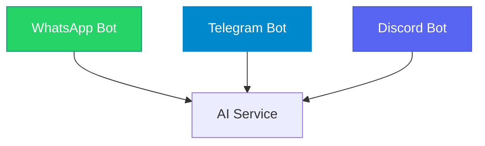

**问题**：
- 代码重复：每个平台都要写一套
- 状态不同步：用户在不同平台看到的状态不一致
- 维护困难：一个功能要改多次

**方案二：使用现有 Bot 框架**

| 框架 | 优点 | 缺点 |
|------|------|------|
| Botpress | 功能完善 | 重量级，AI 能力弱 |
| Microsoft Bot Framework | 微软生态好 | 过于复杂 |
| Dialogflow | NLP 强 | Google 生态绑定 |

**问题**：
- 不是为 AI Agent 设计的
- 工具调用能力弱
- 定制困难

## OpenClaw 的架构设计

### 整体架构

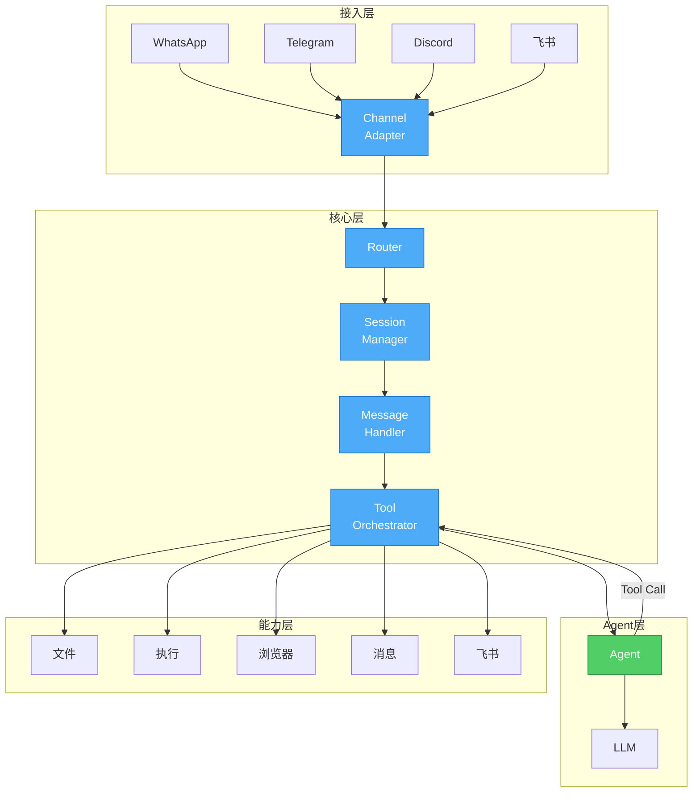

**分层设计**：

1. **接入层** - Channel Adapter
2. **核心层** - Router / Session Manager / Message Handler
3. **Agent 层** - Agent Loop + LLM
4. **能力层** - Tools / Skills

### 核心设计原则

**原则一：通道适配与业务逻辑分离**

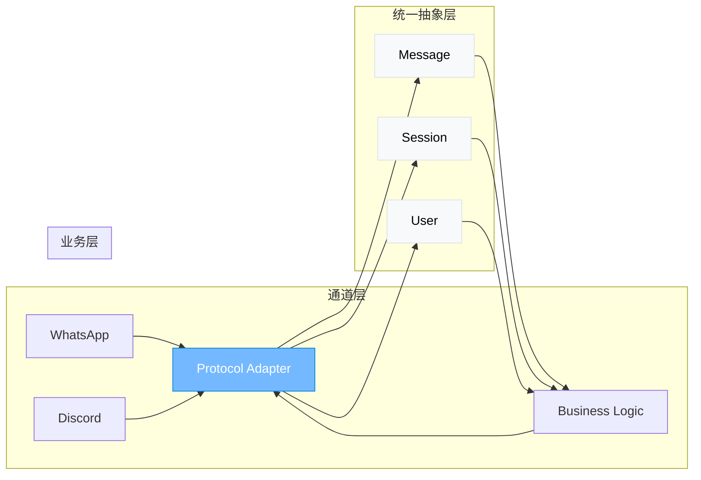

每个通道只需实现适配器，将平台特定格式转换为统一抽象：

```typescript
// 统一消息格式
interface Message {
  id: string;
  channel: string;
  sender: User;
  content: Content;  // 文字/语音/图片/文件
  thread?: string;   // 话题/回复链
  timestamp: number;
}

// 统一用户格式
interface User {
  id: string;        // 平台用户 ID
  name: string;
  avatar?: string;
  isGroup: boolean;
}
```

**原则二：会话隔离与状态管理**

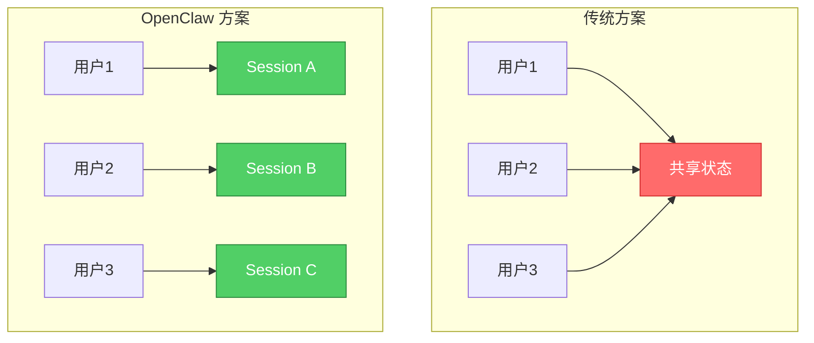

OpenClaw 的会话模型：

```
Session = agentId + channel + peer + mainKey

示例：
- agent:main + whatsapp + user:1234567890     → 私聊会话
- agent:main + telegram + chat:-1001234567890 → 群聊会话
```

每个会话独立：
- 独立的上下文历史
- 独立的内存
- 独立的工具调用结果

**原则三：Tool Calling 原生支持**

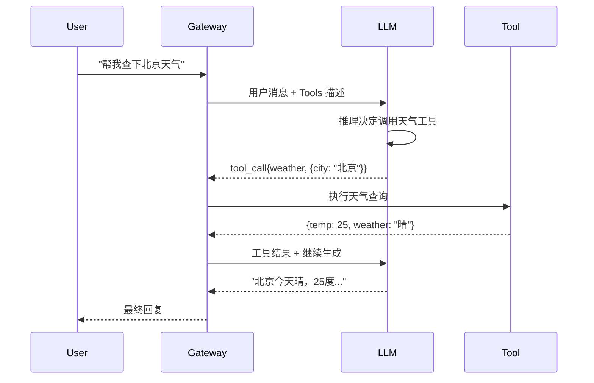

OpenClaw 的 Agent Loop：

```python
# Agent 核心循环
async def agent_loop(session, message):
    # 1. 构建上下文
    context = await session.build_context()
    
    # 2. 获取可用工具
    tools = await get_tools(session)
    
    # 3. LLM 调用
    response = await llm.chat(context + message, tools)
    
    # 4. 处理工具调用
    while response.tool_calls:
        for call in response.tool_calls:
            result = await execute_tool(call)
            context += result
        
        # 5. 继续生成
        response = await llm.continue(context)
    
    # 6. 返回最终回复
    return response.text
```

### 消息处理流程

```mermaid
flowchart TD
    A[收到消息] --> B{解析消息}
    B -->|文字| C[直接处理]
    B -->|图片| D[下载+OCR]
    B -->|语音| E[转存+转录]
    B -->|文件| F[保存]
    
    C --> G[路由决策]
    D --> G
    E --> G
    F --> G
    
    G --> H{匹配规则}
    H -->|私聊| I[主 Agent]
    H -->|群聊@提及| J[指定 Agent]
    H -->|群聊无需提及| K[忽略]
    
    I --> L[Agent Loop]
    J --> L
    L --> M{工具调用}
    M -->|有| N[执行工具]
    M -->|无| O[生成回复]
    
    N --> L
    O --> P[发送消息]
```

### Session 管理与上下文压缩

**问题**：LLM 有上下文窗口限制，对话太长会溢出。

**OpenClaw 的解决方案**：

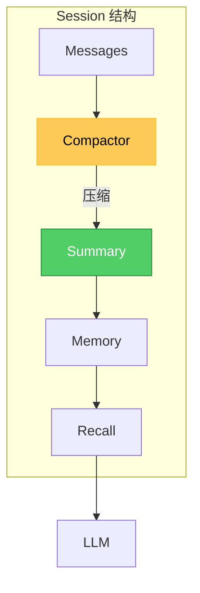

**压缩策略**：

| 阶段 | 策略 | 阈值 |
|------|------|------|
| 保留 | 完整消息 | 最近 N 条 |
| 摘要 | 旧消息 → 摘要 | 超过阈值 |
| 检索 | 关键信息 → Memory | 可配置 |

### 工具系统设计

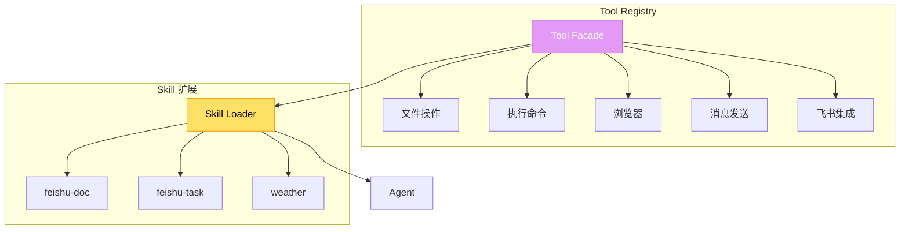

**Tool 定义**：

```json
{
  "name": "read",
  "description": "读取文件内容",
  "parameters": {
    "type": "object",
    "properties": {
      "path": {
        "type": "string",
        "description": "文件路径"
      }
    },
    "required": ["path"]
  }
}
```

**Skill 定义**（SKILL.md）：

```markdown
# feishu-doc

## 描述
飞书文档操作技能

## 工具
- feishu_doc: 读取/写入飞书文档
- feishu_wiki: 操作知识库

## 使用场景
- 读取团队文档
- 创建新文档
- 查询知识库
```

## 多通道实现细节

### Channel Adapter 模式

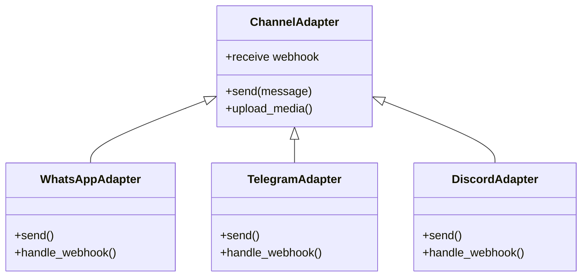

### 消息格式统一

```typescript
// 通道特定格式 → 统一格式
class MessageNormalizer {
  normalizeWhatsApp(message): Message {
    return {
      id: message.id,
      channel: 'whatsapp',
      sender: {
        id: message.from,
        name: message联系人名称
      },
      content: {
        type: this.detectType(message),
        text: message.text?.body || message.image?.caption
      }
    }
  }
  
  normalizeTelegram(message): Message {
    return {
      id: message.message_id,
      channel: 'telegram',
      sender: {
        id: String(message.from.id),
        name: message.from.username
      },
      content: {
        type: this.detectType(message),
        text: message.text || message.caption
      }
    }
  }
}
```

### 会话 ID 映射

```
原始平台会话 ID                    统一会话 Key
─────────────────────────────────────────────────
WhatsApp: +15551234567    →    whatsapp:user:+15551234567
Telegram: 123456789       →    telegram:user:123456789
Discord: 987654321        →    discord:user:987654321
群聊 Discord: -100123456  →    discord:chat:-100123456
```

## 与其他方案的架构对比

### 方案对比

| 维度 | OpenClaw | Botpress | Microsoft Bot Framework |
|------|----------|----------|------------------------|
| **架构模式** | 轻量网关 | 重量级平台 | 企业级框架 |
| **AI 集成** | 原生 Agent Loop | API 调用 | API 调用 |
| **工具调用** | 原生支持 | 插件 | 复杂配置 |
| **多租户** | Workspace 隔离 | 多 Bot | 多 Bot |
| **扩展方式** | Skills + MCP | 插件市场 | Azure 生态 |
| **部署** | 独立进程 | Docker | 云服务 |

### 数据流对比

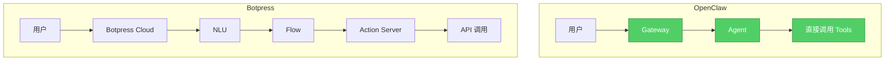

**OpenClaw 的优势**：
- 更直接的 Agent 控制
- 更灵活的 Tool 扩展
- 更低的延迟
- 完全的数据控制

## 关键实现代码

### Router 核心逻辑

```typescript
class MessageRouter {
  async route(message: Message): Promise<RouteResult> {
    // 1. 确定目标 Agent
    const agentId = await this.resolveAgent(message);
    
    // 2. 确定会话
    const sessionKey = this.buildSessionKey(message, agentId);
    
    // 3. 检查是否需要忽略
    if (await this.shouldIgnore(message)) {
      return { action: 'ignore' };
    }
    
    // 4. 返回路由结果
    return {
      action: 'delegate',
      agentId,
      sessionKey,
      metadata: {
        thread: message.thread,
        mention: message.mentions
      }
    };
  }
  
  private buildSessionKey(message: Message, agentId: string): string {
    const channel = message.channel;
    const peer = message.isGroup 
      ? `chat:${message.chatId}` 
      : `user:${message.senderId}`;
    
    const mainKey = message.isGroup 
      ? `group:${message.chatId}` 
      : 'dm';
    
    return `agent:${agentId}:${channel}:${peer}:${mainKey}`;
  }
}
```

### Session Manager

```typescript
class SessionManager {
  private sessions = new Map<string, Session>();
  
  async getOrCreate(key: string): Promise<Session> {
    if (!this.sessions.has(key)) {
      this.sessions.set(key, new Session(key));
    }
    return this.sessions.get(key);
  }
  
  async buildContext(session: Session): Promise<LLMMessage[]> {
    const messages = await session.getMessages();
    
    // 压缩如果太长
    if (messages.length > MAX_HISTORY) {
      const summary = await this.compact(messages);
      return [summary, ...messages.slice(-KEEP_LAST)];
    }
    
    return messages;
  }
}
```

## 扩展与定制

### 自定义 Channel

```typescript
class MyChannelAdapter implements ChannelAdapter {
  async send(message: Message): Promise<void> {
    // 调用平台 API
    await this.myChannelApi.sendMessage({
      to: message.recipient,
      content: message.content
    });
  }
  
  async handleWebhook(payload: any): Promise<Message> {
    return this.normalizer.normalize(payload);
  }
}

// 注册通道
gateway.registerChannel('mychannel', new MyChannelAdapter());
```

### 自定义 Skill

```
my-skill/
├── SKILL.md
│   # My Custom Skill
│   ## 工具
│   - my_tool: 自定义工具
│   
└── index.ts
    import { Skill } from 'openclaw';
    
    export const mySkill: Skill = {
      name: 'my-skill',
      tools: [myTool]
    };
```

## 实践建议

### 部署架构

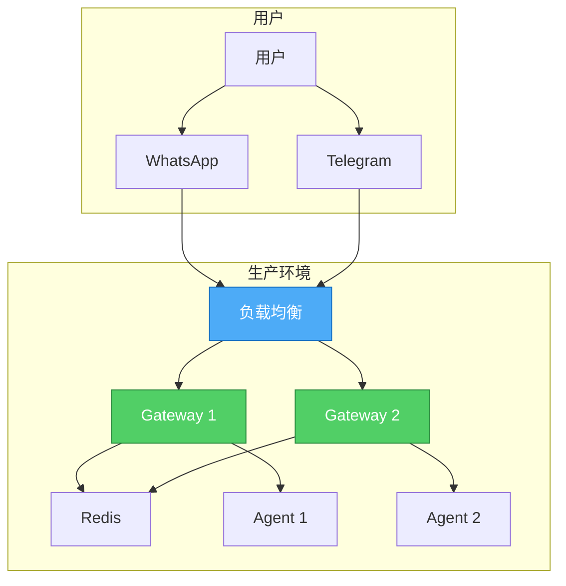

### 安全配置

```json
{
  "channels": {
    "whatsapp": {
      "allowFrom": ["+1555xxxxxxx", "+86139xxxxxxx"]
    },
    "telegram": {
      "allowUsers": ["user_id_1", "user_id_2"]
    }
  },
  "gateway": {
    "auth": {
      "mode": "token",
      "token": "your-secure-token"
    }
  },
  "commands": {
    "deny": ["rm", "dd", "mkfs"]
  }
}
```

## 总结

OpenClaw 的架构设计体现了几个核心原则：

1. **通道适配与业务分离** - 通过 Channel Adapter 抽象协议差异
2. **会话隔离** - 每个用户/群聊独立会话，状态不污染
3. **Agent 原生** - 直接支持 Tool Calling，不做额外抽象
4. **可扩展** - Skills + MCP 机制支持灵活扩展

这种设计让它成为一个轻量、灵活、易扩展的多通道 AI Agent 网关，特别适合：

- 构建个人 AI 助手
- 企业内部 AI 对话系统
- 多租户 SaaS AI 服务

**如果你正在设计类似系统，OpenClaw 的架构值得参考。**

---

> *参考资源：*
> *- [OpenClaw GitHub](https://github.com/openclaw/openclaw)*
> *- [OpenClaw 文档](https://docs.openclaw.ai)*
> *- [Channel Adapter Pattern](https://docs.openclaw.ai/channels)*
