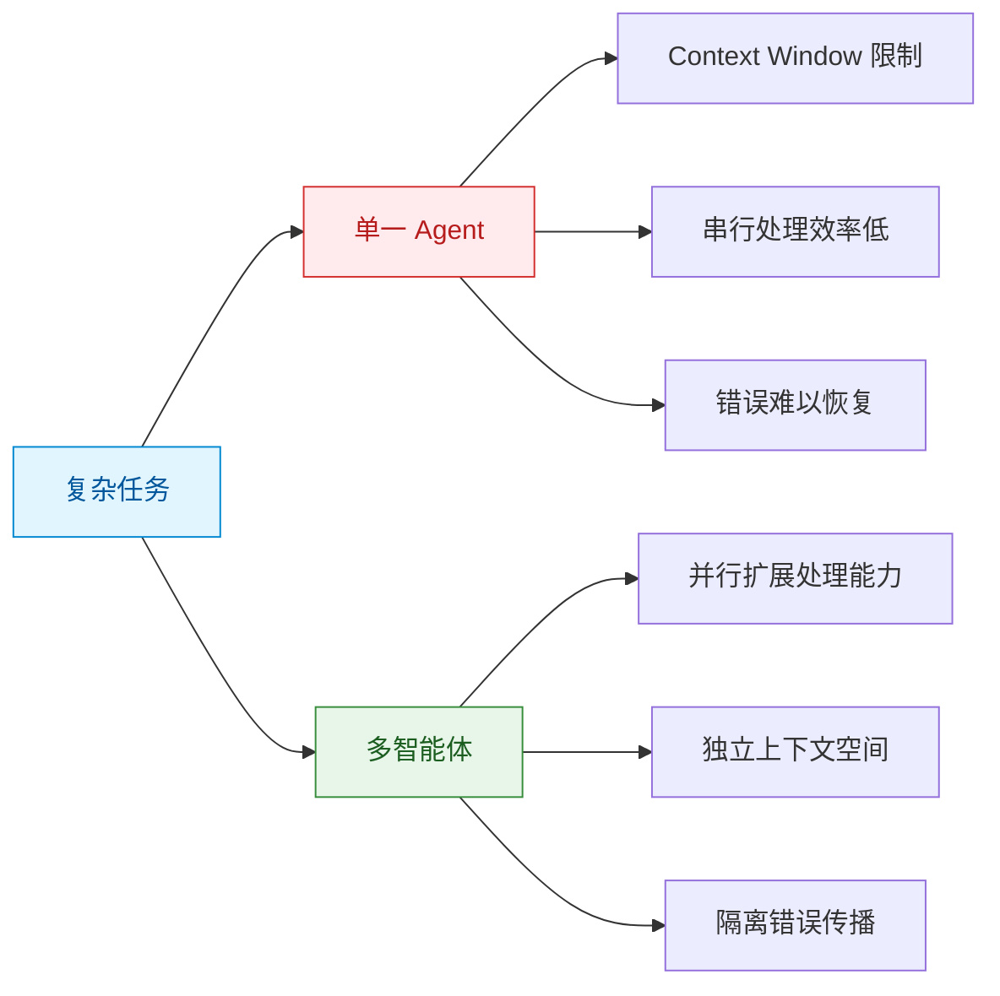
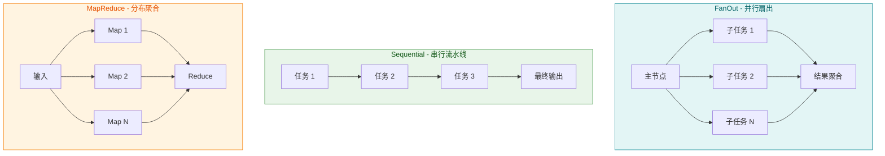
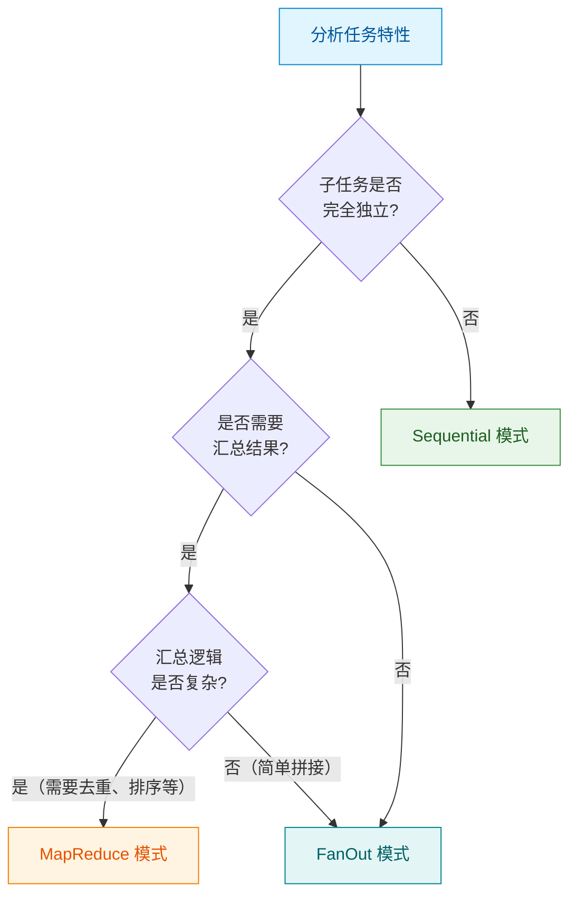
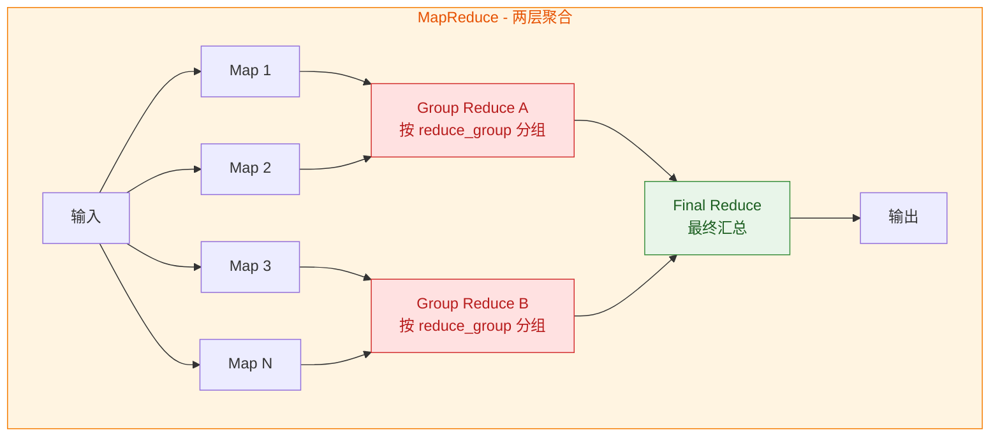
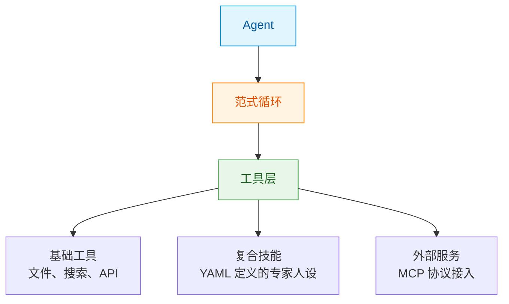
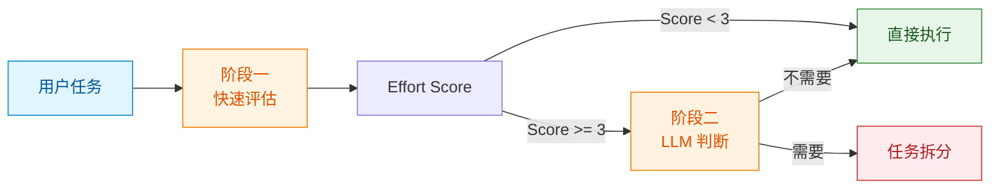
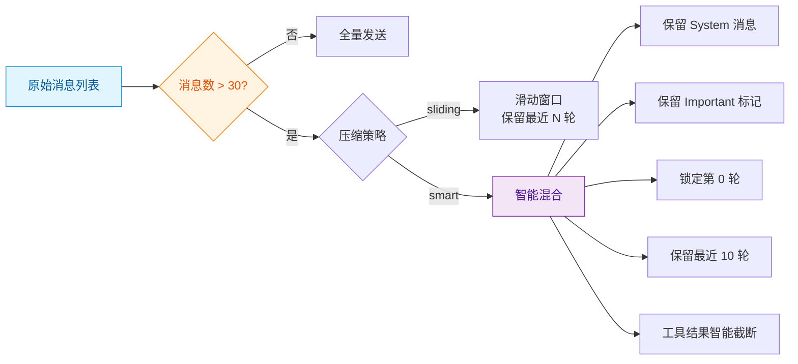
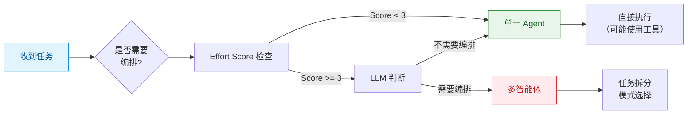

## 引言

在构建多智能体系统的实践中，都会面临一个核心问题：**如何让多个 Agent 有效协同工作，而不是互相干扰？**

这个问题比表面上看起来更加复杂。当 Agent 数量增加时，协调成本呈非线性增长——简单的任务被过度拆解，独立的 Agent 重复工作，错误在多轮交互中累积放大。Anthropic 在《Multi-Agent Research System》中提到，他们早期的原型系统存在两类典型问题：为简单查询生成 50 个子 Agent，或持续搜索不存在的信息来源导致循环不止。

本文基于我们在开发多智能体框架过程中的实践，探讨如何系统性地解决这些问题。我们不会介绍某个特定框架的功能，而是分享在设计过程中形成的思考模式和实践经验。

## 从单一 Agent 到多 Agent

### 为什么需要多智能体？

单一 Agent 在面对复杂任务时会遇到固有的限制：



从上图看，多智能体系统带来了三个优势：**并行扩展、独立上下文、错误隔离**。但结合 Anthropic 的研究发现，**这些优势的本质都是"扩展计算"的不同表现形式**——通过增加 Agent 数量，系统获得了更多的 Token 预算（更多思考空间、更多验证机会），从而提升了性能。

这个发现帮助我们理解：多智能体架构的价值不在于"协作"本身有多神奇，而在于它是一种**高效的扩展计算资源的组织方式**。精心设计的编排模式，可以让增加的计算资源发挥最大效用。

Anthropic 在其内部研究评估（BrowseComp 基准）中发现，使用多智能体系统相比单一 Agent 性能提升了 90.2%。但更重要的是他们发现的另一个事实：**Token 使用解释了 80% 的性能方差**。

这个结论的含义需要仔细理解：在多智能体系统与单一 Agent 的性能差异中，**Token 消耗量（即模型的推理长度或交互频次）可以解释 80% 的差异**，而智能体协作策略、架构设计等因素只解释剩余的 20%。

换句话说，多智能体系统的性能提升，大部分来自于"用了更多计算资源"——更多轮次的对话、更长的推理链路、更多的验证尝试。多智能体架构只是实现这种"扩展计算"的一种方式，而非魔弹。

这一发现对实践有重要启示：

| 启示 | 说明 |
|------|------|
| **计算即性能** | 性能提升很大程度上来自更多 Token，而非架构巧思 |
| **优先级排序** | 先考虑如何增加有效计算，再考虑架构优化 |
| **成本意识** | 既然 Token 消耗主导性能，成本控制成为关键考量 |
| **架构定位** | 多智能体是"扩展计算"的手段之一，而非万能方案 |

### 多智能体面临的挑战

然而，引入多智能体后，新的问题随之出现：

| 挑战 | 描述 | 后果 |
|------|------|------|
| **协调开销** | 多个 Agent 需要通信和同步 | 延迟增加、成本上升 |
| **任务拆解** | 如何合理分解复杂任务 | 过度拆解或拆解不足 |
| **结果聚合** | 多个输出如何综合 | 信息丢失或冲突 |
| **错误传播** | 一个 Agent 的错误影响下游 | 级联失败 |

在实践中，我们发现许多系统在引入多智能体后，性能提升不明显，反而增加了复杂度和成本。问题的根源在于：**多智能体系统的设计需要系统性的方法，而非简单的"拆分-执行-汇总"模式。**

## 设计思考：编排与范式的分离

在开发过程中，我们意识到一个关键洞察：**多智能体系统涉及两个正交的维度**。

1. **编排（Orchestration）**：控制多个 Agent 如何协作
2. **范式（Paradigm）**：控制单个 Agent 如何思考

混淆这两个维度会导致设计混乱。例如，一个常见的错误是将"并行执行"（编排问题）和"ReAct 循环"（范式问题）混为一谈。

### 编排：协作的拓扑结构

编排关注的是多个 Agent 之间的连接方式。在前文中我们提到，Token 消耗解释了 80% 的性能方差——那么编排模式的价值何在？

**编排模式的作用是：让增加的计算资源发挥最大效用**。同样的 Token 预算，不同的编排方式会产生不同的效果。精心选择的模式可以让计算资源用在更关键的地方，而混乱的编排则可能导致资源浪费。

在实践中，我们发现三种基本模式可以覆盖大部分场景：



这三种模式并非我们独创，而是分布式系统中经典模式的映射。在实际应用中，选择合适的编排模式需要考虑任务特性、性能要求和容错需求。

#### 模式对比与选择标准

| 模式 | 子任务关系 | 并行度 | 容错性 | 适用场景 | 不适用场景 |
|------|-----------|-------|-------|---------|-----------|
| **FanOut** | 完全独立 | 高 | 高 | 独立数据源、批量处理 | 有依赖关系的任务 |
| **Sequential** | 严格串行 | 低 | 低 | 流程化任务、依赖明确 | 可并行化的独立任务 |
| **MapReduce** | Map 独立，Reduce 依赖 | 中 | 中 | 多源信息汇总、数据聚合 | 单一数据源任务 |

#### 编排模式选择决策树



#### FanOut 模式：并行独立执行

**核心特点**：主节点将任务拆分为 N 个完全独立的子任务，并行执行后聚合结果。

**适用场景**：
- 从多个独立数据源获取信息（如查询多个公司的财务数据）
- 批量处理相似任务（如分析多个文档的情感）
- A/B 测试或验证场景（如用不同策略解决同一问题）

**实践要点**：
- 子任务之间不应有数据依赖
- 聚合逻辑通常较简单（拼接、排序、去重）
- 单个子任务失败不影响其他子任务

**典型流程**：
```
用户任务：分析三家公司（A、B、C）的财务状况
    │
    ├─→ Subtask 1: 分析公司 A ──────┐
    ├─→ Subtask 2: 分析公司 B ──────┤──→ 聚合：生成对比报告
    └─→ Subtask 3: 分析公司 C ──────┘
```

#### Sequential 模式：串行流水线

**核心特点**：子任务按顺序执行，每个子任务的输出是下一个的输入。

**适用场景**：
- 有明确依赖关系的多步骤任务
- 流程化操作（如数据清洗 → 分析 → 可视化）
- 需要前序结果才能继续的场景

**实践要点**：
- 依赖关系应该明确且必要
- 单点故障会影响整个流程
- 总耗时为所有子任务之和

**典型流程**：
```
用户任务：分析某公司财务并生成报告
    │
    ├─→ 步骤1: 收集原始数据
    │       ↓
    ├─→ 步骤2: 清洗和预处理数据
    │       ↓
    ├─→ 步骤3: 财务指标计算
    │       ↓
    └─→ 步骤4: 生成分析报告
```

#### MapReduce 模式：分布式聚合

**核心特点**：Map 阶段并行处理，两层 Reduce 递进聚合（Group Reduce + Final Reduce）。



**两层 Reduce 设计**：

| 阶段 | 说明 | 配置方式 | 执行方式 |
|------|------|---------|---------|
| **Map** | 并行处理子任务 | `role: map`（默认） | 完全并行 |
| **Group Reduce** | 分组聚合（可选） | `role: reduce` + `reduce_group: "组名"` | 各组并行 |
| **Final Reduce** | 最终汇总 | `role: reduce`（无 group） | 单独执行 |

**适用场景**：
- 需要从多个角度分析同一问题（如不同专家对同一事件的评论）
- 数据聚合和统计（如从多个源汇总数据）
- 需要先分组再综合的场景（如按部门分组分析，再跨部门对比）

**实践要点**：
- Map 阶段可以高度并行
- Group Reduce 各组独立并行，避免信息污染
- Final Reduce 汇总所有分组结果
- 无 Group Reduce 时退化为单层 Reduce（向后兼容）

**典型流程**：
```
用户任务：综合多方观点生成分析
    │
    ├─→ Map 1: 财务角度 ─┐
    ├─→ Map 2: 技术角度 ─┤
    ├─→ Map 3: 市场角度 ─┼→ Group Reduce A: 综合财/技/市观点 ─┐
    ├─→ Map 4: 法律角度 ─┤                                ├─→ Final Reduce: 生成最终报告
    ├─→ Map 5: 运营角度 ─┤                                │
    └─→ Map 6: 人力角度 ─┘                                │
                                                        │
    另一分组（如按风险类别）────────────────────────────────┘
```

#### 混合模式与模式切换

在实际应用中，复杂任务可能需要混合使用多种模式。例如：

```
总体任务：行业深度研究报告
    │
    ├─→ Phase 1 (FanOut): 并行收集多个来源的数据
    │       ├─→ 数据源 A
    │       ├─→ 数据源 B
    │       └─→ 数据源 C
    │           ↓
    ├─→ Phase 2 (MapReduce with 2-Layer Reduce): 多角度分析
    │       ├─→ Map: 财务/技术/市场/法律分析
    │       ├─→ Group Reduce A: 综合财/技/市观点
    │       ├─→ Group Reduce B: 综合法/合规/风险观点
    │       └─→ Final Reduce: 跨组对比，生成完整分析
    │           ↓
    └─→ Phase 3 (Sequential): 生成最终报告
            ├─→ 草稿
            ├─→ 审阅
            └─→ 定稿
```

这种嵌套或串行的模式组合，在框架中通过**嵌套编排**机制实现。默认最大嵌套深度为 2，超过后自动降级为普通 Worker，防止无限递归。

**MapReduce 两层 Reduce 的实际价值**：

两层 Reduce 设计使得复杂聚合场景更加清晰：

| 场景 | Group Reduce（第一层） | Final Reduce（第二层） |
|------|----------------------|----------------------|
| 多维度分析 | 按维度分组聚合（如技术/市场/财务） | 跨维度综合对比 |
| 多源数据 | 按来源分组聚合（如新闻/研报/财报） | 去重、交叉验证 |
| 层级汇总 | 按层级分组聚合（如部门/分公司） | 生成公司级报告 |
| 分类处理 | 按类别分组聚合（如正面/负面） | 生成综合判断 |

### 范式：思考的模式

范式关注的是单个 Agent 内部的思维循环。不同的任务适合不同的思考模式：

| 范式 | 思维模式 | 适用场景 | 不适用场景 |
|------|---------|---------|-----------|
| Direct | 一次性生成 | 简单问答、摘要 | 需要工具调用的任务 |
| ReAct | 观察-思考-行动循环 | 探索性任务、工具密集 | 长程规划 |
| Plan | 规划-执行-整合 | 复杂多步骤任务 | 简单任务（过度工程） |
| Reflection | 初稿-反思-修订 | 追求质量的创作 | 时延敏感场景 |
| ToT | 多路径探索 | 深度推理、多解问题 | 成本敏感场景 |
| Auto | 规划-执行-反思闭环 | 动态复杂环境 | 简单重复任务 |

在实践中，我们发现一个有趣的现象：**不同的"专家"适合不同的范式**。例如，网络研究员适合 ReAct（边搜边看），而 Python 开发者更适合 Plan（先规划再执行）。这提示我们：范式的选择应该与任务特性匹配，而非使用统一的"最佳范式"。

## 设计思考："一切皆为工具"的哲学

在框架开发的早期，我们尝试了多种 Agent 能力的扩展方式。最终，我们形成了一个简洁的设计原则：**除了最底层的范式循环，一切能力都应该是可插拔的工具**。



这种设计带来几个好处：

1. **可测试性**：每个工具可以独立测试
2. **可组合性**：不同工具可以自由组合
3. **可替换性**：升级工具不影响 Agent 核心
4. **非开发者友好**：通过 YAML 定义技能，无需编码

### 配置驱动的 Agent 定义

在实践中的一个重要发现是：**Agent 的行为应该由配置定义，而非代码硬编码**。

例如，一个"数据分析专家"技能可以通过 YAML 完整定义：

```yaml
---
name: data-analysis
display_name: 数据分析专家
paradigm: plan
orchestration:
  mode: sequential
  steps:
    - id: clean
      description: "清理原始数据"
    - id: analyze
      description: "执行统计分析"
---
```

这种配置驱动的方式使得非开发者也能通过修改配置文件来调整 Agent 行为，降低了定制化门槛。

## 实践探索：关键问题的解决

在明确了架构分层和工具化哲学后，我们仍然面临若干具体的工程问题。以下是我们在实践中形成的解决方案。

### 问题一：何时需要多智能体编排？

并非所有任务都需要多智能体。在实践中，我们发现一个两阶段判断机制效果较好：



**Effort Score 机制**基于任务复杂度给出一个初始评估：

| Score | 复杂度 | 是否编排 | 目标子任务数 | 典型场景 |
|-------|--------|---------|-------------|---------|
| 1 | Trivial | 否 | 0（直接执行） | 简单问答 |
| 2 | Simple | 否 | 0（直接执行） | 单一工具调用 |
| 3 | Moderate | 是 | 3-4 | 多步骤但路径清晰 |
| 4 | Complex | 是 | 4-5 | 需要探索和判断 |
| 5 | Expert | 是 | 5-7 | 开放性复杂问题 |

注：当 Score 小于阈值（默认 3）时，系统跳过编排，任务由 Principal 直接执行。只有 Score 达到或超过阈值时，才会生成子任务进行编排。

这个机制避免了简单任务被过度拆解（浪费 Token）和复杂任务拆解不足（性能不足）。

### 问题二：如何动态调整子任务数量？

固定的子任务数量无法适应不同复杂度的任务。在实践中，我们采用了**动态伸缩机制**：

- 根据 Effort Score 调整目标子任务数范围
- LLM 在目标范围内根据实际任务情况灵活决定
- 不同 Score 对应不同的子任务数范围

例如，一个 Effort Score 为 3 的任务，目标范围是 3-4 个子任务；而 Score 为 4 的复杂任务，目标范围会扩展到 4-5 个。这种设计避免了过度拆解或拆解不足。

### 问题三：如何管理长程任务的上下文？

LLM Context Window 限制是长程任务的核心挑战。Anthropic 提到他们使用外部 Memory 来保存研究计划，当 Context 超过 200,000 Token 时避免丢失计划。

在实践中，我们实现了一个**智能上下文压缩系统**：



Smart 策略的核心是：**保留关键的，压缩冗余的**。特别重要的是"锁定第 0 轮"——确保 Agent 永远不会忘记初始任务。

### 问题四：如何控制 Agent 的"寿命"？

Agent 的无限循环是实际部署中的严重问题。在实践中，我们采用**三层预算控制**：

| 层级 | 参数 | 含义 | 推荐值 |
|------|------|------|--------|
| 最外层 | max_loops | 总步数预算 | 8 |
| 最内层 | max_react_loops | 单步执行预算 | 10 |
| 控制层 | max_replans | 重试预算 | 3 |

在引入 Think Tool 和更强的推理模型后，我们推荐 "8-10-3" 配置而非传统的 "5-3-2"——更强的推理能力需要更多的尝试空间。

### 问题五：如何管理温度参数？

温度参数的选择对 Agent 行为有显著影响。在实践中，我们发现使用**语义化的常量**而非魔法数字更易维护：

| 常量 | 值 | 用途场景 |
|------|-----|---------|
| TEMP_PRECISION | 0.1 | 工具调用、验证、格式化 |
| TEMP_STRUCTURED | 0.3 | 规划、分析、评估 |
| TEMP_INTEGRATION | 0.5 | 整合、综合、翻译 |
| TEMP_CREATIVE | 0.8 | 创造、多样性生成 |

这种设计使得修改一处即可影响所有同类场景，降低了维护成本。

## 编排的边界：何时不用多智能体

前面的讨论主要集中在"如何用好多智能体"，但同样重要的是"知道何时不用多智能体"。在实践中，我们发现以下场景更适合单一 Agent：

### 适用单一 Agent 的场景

| 场景特征 | 说明 | 示例 |
|---------|------|------|
| **简单问答** | 单轮或少量轮次的对话 | "今天天气如何？" |
| **单工具调用** | 只需要一个工具即可完成任务 | "发送这封邮件" |
| **强依赖串行** | 步骤之间有强依赖，难以并行 | 某些需要前序结果的代码生成 |
| **实时性要求高** | 多 Agent 的协调延迟不可接受 | 实时交互场景 |
| **成本敏感** | Token 成本需要严格控制 | 大量简单请求 |

### 决策框架



### 过度编排的代价

Anthropic 的数据显示，多智能体系统的 Token 消耗是单一 Agent 聊天的 15 倍。过度编排会带来：

1. **成本浪费**：简单任务被拆解，产生不必要的子任务
2. **延迟增加**：协调开销使得响应变慢
3. **复杂度上升**：调试和维护变得更加困难
4. **性能下降**：拆解不当反而降低效果

在实践中，我们遵循"渐进增强"原则：从单一 Agent 开始，只在明显需要时才引入编排。

## 反思与讨论

在实践中，我们发现多智能体系统的设计需要关注以下几个方面：

### 复杂度与性能的权衡

Anthropic 的研究揭示了一个关键事实：**Token 使用解释了 80% 的性能方差**。这意味着多智能体系统的性能提升，大部分来自于"用了更多计算资源"，而非架构设计的精妙。

进一步的数据显示，多智能体系统的 Token 消耗是普通聊天的 15 倍。这带来了几个重要启示：

1. **计算即性能**：性能提升主要来自更多 Token（更长推理、更多验证），而非协作策略
2. **成本效益**：15 倍的 Token 消耗需要匹配相应的价值提升
3. **架构定位**：多智能体是"扩展计算"的手段之一，但不是唯一手段
4. **优先级**：在投入复杂架构前，先考虑简单方案增加有效计算

在实践中，我们遵循以下原则：

| 原则 | 说明 | 示例 |
|------|------|------|
| **渐进增强** | 从简单方案开始，只在必要时增加复杂度 | 先用长上下文，不够再考虑多智能体 |
| **计算优先** | 优先考虑增加有效计算，再考虑架构优化 | 增加推理步骤比设计复杂编排更有效 |
| **成本阈值** | 只为高价值任务使用多智能体 | 简单问答不值得 15 倍成本 |
| **效果验证** | 评估性能提升是否值得成本增加 | 需要量化评估，而非感觉判断 |

### 状态管理的挑战

Agent 是有状态的，错误会累积。在实践中，我们发现以下策略有助于缓解：

1. **定期检查点**：保存中间状态，便于恢复
2. **错误隔离**：一个 Agent 的错误不应影响其他 Agent
3. **Rainbow 部署**：避免中断运行中的 Agent

### 调试与可观测性

Agent 的非确定性使得调试更加困难。在实践中，完整的执行追踪系统是必要的：

| 追踪内容 | 说明 |
|---------|------|
| LLM 调用 | 包含缓存命中标记 |
| 工具调用 | 包含参数和返回值 |
| 编排决策 | 包含判断理由 |
| 子任务状态 | 包含开始和结束时间 |

### 工具设计的重要性

Anthropic 提出了一个有趣的观点：**像设计 HCI 一样设计 ACI（Agent-Computer Interface）**。在实践中，我们发现：

1. **工具自描述**：每个工具应该有清晰的描述和使用示例
2. **边界明确**：工具之间的边界应该清晰，避免功能重叠
3. **Poka-yoke**：设计应该让 Agent 难以犯错

## 结论

在构建多智能体系统的过程中，我们形成了几个核心认知：

1. **编排与范式分离**：多 Agent 协作是编排问题，单 Agent 思考是范式问题，两者应该正交
2. **工具化哲学**：除范式循环外，一切能力都应该可插拔
3. **智能而非固定**：何时编排、拆解多少、使用什么范式，都应该根据任务动态决定
4. **工程支撑重要**：上下文压缩、缓存、追踪等工程能力是可靠性的基础
5. **成本意识**：多智能体消耗更多资源，需要评估投入产出比
6. **知道边界**：理解何时不用多智能体，与知道如何用同样重要

这些认知并非理论推导，而是在实践中的经验总结。随着 LLM 能力的持续演进，多智能体系统的设计模式也会继续发展。

重要的是保持思考的开放性：没有放之四海而皆准的最佳方案，只有适合特定场景的权衡选择。

---

**智能体设计思考系列**，下一篇将继续探讨 Agent 系统的其他核心主题。

**参考资料**：

- [Building Effective Agents - Anthropic](https://www.anthropic.com/engineering/building-effective-agents)
- [How we built our multi-agent research system - Anthropic](https://www.anthropic.com/engineering/multi-agent-research-system)
- [Common Agent Framework - GitHub](https://github.com/freezesoul/common-agent-framework)

本文内容基于我在开发和维护 common-agent-framework 过程中的实践思考与经验总结。
