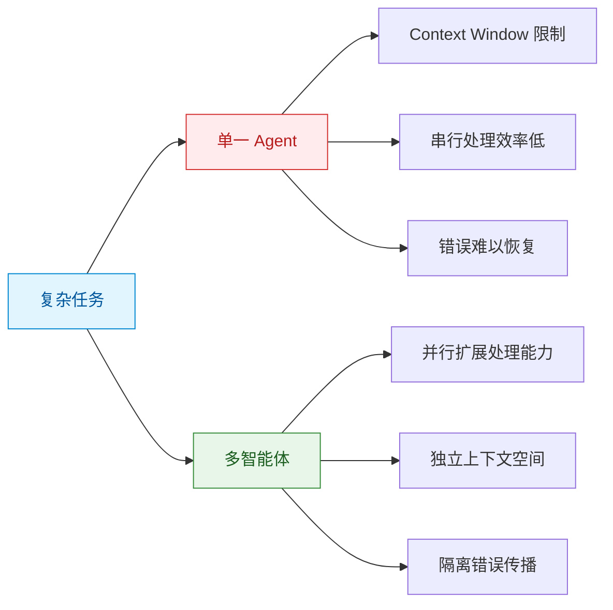
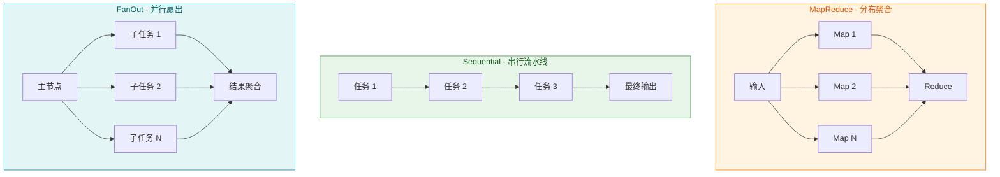
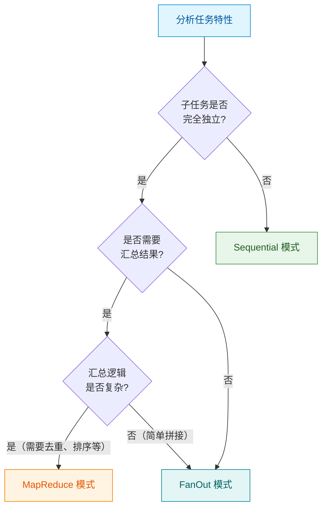
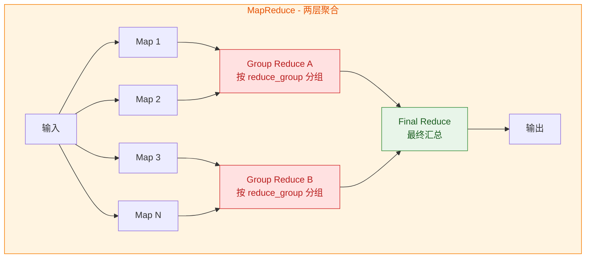
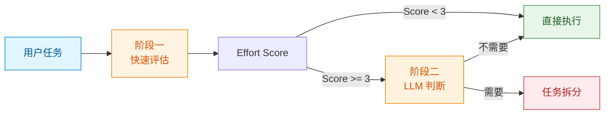
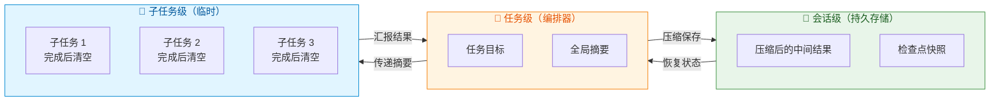
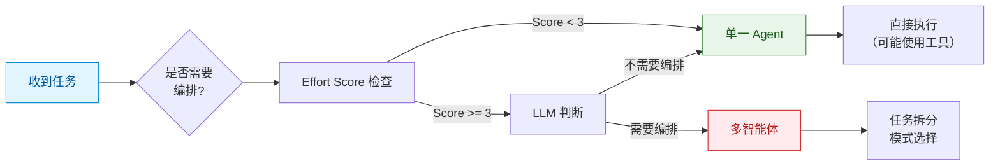

## 引言

在构建多智能体系统的实践中，都会面临一个核心问题：**如何让多个 Agent 有效协同工作，而不是互相干扰？**

这个问题比表面上看起来更加复杂。当 Agent 数量增加时，协调成本呈非线性增长——简单的任务被过度拆解，独立的 Agent 重复工作，错误在多轮交互中累积放大。Anthropic 在《Multi-Agent Research System》中提到，他们早期的原型系统存在两类典型问题：为简单查询生成 50 个子 Agent，或持续搜索不存在的信息来源导致循环不止。

通过对多个开源项目的深入分析，我们发现优秀的智能体框架在架构设计上存在显著的差异：有的采用消息总线实现解耦，有的使用事件驱动模型提升响应性，有的通过双层队列隔离保证状态一致性，有的则依赖 WASM 沙箱确保安全性。这些不同的技术选型背后，是对"如何组织多智能体协作"这一核心问题的不同回答。

本文旨在探讨多智能体系统架构设计的共性模式，而非介绍某个特定框架的功能。我们希望分享在设计过程中形成的思考模式和实践经验。

## 从单一 Agent 到多 Agent

### 为什么需要多智能体？

单一 Agent 在面对复杂任务时会遇到固有的限制：



从上图看，多智能体系统带来了三个优势：**并行扩展、独立上下文、错误隔离**。但结合 Anthropic 的研究发现，**这些优势的本质都是"扩展计算"的不同表现形式**——通过增加 Agent 数量，系统获得了更多的 Token 预算（更多思考空间、更多验证机会），从而提升了性能。

这个发现帮助我们理解：多智能体架构的价值不在于"协作"本身有多神奇，而在于它是一种**高效的扩展计算资源的组织方式**。精心设计的编排模式，可以让增加的计算资源发挥最大效用。

Anthropic 在其内部研究评估（BrowseComp 基准）中发现了两个关键数据：

1. 使用多智能体系统相比单一 Agent 性能提升了 **90.2%**
2. **Token 使用解释了 80% 的性能方差**

第二个结论的含义需要仔细理解：在多智能体系统与单一 Agent 的性能差异中，Token 消耗量（即模型的推理长度或交互频次）可以解释 80% 的差异，而智能体协作策略、架构设计等因素只解释剩余的 20%。

换句话说，**多智能体系统的性能提升，大部分来自于"用了更多计算资源"**——更多轮次的对话、更长的推理链路、更多的验证尝试。多智能体架构只是实现这种"扩展计算"的一种方式，而非魔弹。

这一发现揭示了编排模式的价值所在：**既然性能提升主要来自增加的计算资源，那么编排模式的作用就是让这些资源发挥最大效用**。同样的 Token 预算，不同的编排方式会产生不同的效果。

### 多智能体面临的挑战

引入多智能体后，新的问题随之出现：

| 挑战 | 描述 | 后果 |
|------|------|------|
| **协调开销** | 多个 Agent 需要通信和同步 | 延迟增加、成本上升 |
| **任务拆解** | 如何合理分解复杂任务 | 过度拆解或拆解不足 |
| **结果聚合** | 多个输出如何综合 | 信息丢失或冲突 |
| **错误传播** | 一个 Agent 的错误影响下游 | 级联失败 |
| **并发控制** | 多个 Agent 同时访问资源 | 竞态条件、数据不一致 |

许多系统在引入多智能体后，性能提升不明显，反而增加了复杂度和成本。问题的根源在于：**多智能体系统的设计需要系统性的方法，而非简单的"拆分-执行-汇总"模式。**

这个系统性方法需要回答三个核心问题：**何时需要编排**、**如何选择编排模式**、**如何管理执行过程**。接下来我们分别讨论。

## 架构视角：并发模型与容错机制

在深入编排模式之前，有必要先讨论多智能体系统的两个基础架构维度：**并发模型**和**容错机制**。这两个维度决定了系统的基本运行特性。

### 并发模型对比

不同的并发模型适合不同的场景：

| 并发模型 | 特点 | 适用场景 | 代表性技术 |
|---------|------|---------|-----------|
| **串行执行** | 简单可靠，无并发问题 | 轻量级应用、单线程环境 | sync.WaitGroup |
| **事件驱动** | 响应式，高吞吐 | 高并发场景、实时响应 | 事件循环、消息队列 |
| **协程池** | 平衡并发与资源控制 | 中等规模应用 | asyncio.Queue、Job Pool |
| **双层队列** | 会话隔离 + 全局控制 | 需要状态一致性的场景 | Session Lane + Global Lane |
| **Actor 模型** | 消息传递，无共享 | 分布式系统 | Actor 邮箱 |

**双层队列隔离**是一种值得关注的架构模式。它将并发控制分为两层：Session Lane 按 sessionKey 隔离，保证同一会话内串行执行；Global Lane 提供全局并发控制。这种设计既保证了状态一致性，又允许跨会话的并发执行。

### 容错机制设计

多智能体系统的容错机制直接影响系统的可靠性：

| 容错机制 | 原理 | 适用场景 | 局限性 |
|---------|------|---------|--------|
| **Fallback Chain** | 失败时自动切换备用方案 | API 调用、服务依赖 | 需要配置多个备选 |
| **认证轮换** | API Key 失效时自动轮换 | 高频调用、限流场景 | 需要管理多个凭证 |
| **错误隔离** | 限制错误在单个 Agent 内 | 防止级联失败 | 无法处理共享资源错误 |
| **沙箱隔离** | 工具在隔离环境中执行 | 不可信工具、安全敏感 | 性能开销较大 |
| **Cost Guard** | 监控和限制 Token 消耗 | 成本敏感场景 | 需要准确预估成本 |

在实践中，多种容错机制往往组合使用。例如，商业级系统可能同时采用认证轮换、错误隔离和 Cost Guard，而轻量级系统可能只依赖简单的 Fallback Chain。

## 设计思考：编排与范式的分离

在开发过程中，我们意识到一个关键洞察：**多智能体系统涉及两个正交的维度**。

1. **编排（Orchestration）**：控制多个 Agent 如何协作
2. **范式（Paradigm）**：控制单个 Agent 如何思考

混淆这两个维度会导致设计混乱。例如，一个常见的错误是将"并行执行"（编排问题）和"ReAct 循环"（范式问题）混为一谈。

### 编排：协作的拓扑结构

编排关注的是多个 Agent 之间的连接方式。在前文中我们提到，Token 消耗解释了 80% 的性能方差——那么编排模式的价值何在？

**编排模式的作用是：让增加的计算资源发挥最大效用**。同样的 Token 预算，不同的编排方式会产生不同的效果。精心选择的模式可以让计算资源用在更关键的地方，而混乱的编排则可能导致资源浪费。

在实践中，我们发现三种基本模式可以覆盖大部分场景：



这三种模式并非我们独创，而是分布式系统中经典模式的映射。在实际应用中，选择合适的编排模式需要考虑任务特性、性能要求和容错需求。

#### 模式对比与选择标准

| 模式 | 子任务关系 | 并行度 | 容错性 | 适用场景 | 不适用场景 |
|------|-----------|-------|-------|---------|-----------|
| **FanOut** | 完全独立 | 高 | 高 | 独立数据源、批量处理 | 有依赖关系的任务 |
| **Sequential** | 严格串行 | 低 | 低 | 流程化任务、依赖明确 | 可并行化的独立任务 |
| **MapReduce** | Map 独立，Reduce 依赖 | 中 | 中 | 多源信息汇总、数据聚合 | 单一数据源任务 |

#### 编排模式选择决策树



#### FanOut 模式：并行独立执行

**核心特点**：主节点将任务拆分为 N 个完全独立的子任务，并行执行后聚合结果。

**适用场景**：
- 从多个独立数据源获取信息（如查询多个公司的财务数据）
- 批量处理相似任务（如分析多个文档的情感）
- A/B 测试或验证场景（如用不同策略解决同一问题）

**实践要点**：
- 子任务之间不应有数据依赖
- 聚合逻辑通常较简单（拼接、排序、去重）
- 单个子任务失败不影响其他子任务

**典型流程**：

```
用户任务：分析三家公司（A、B、C）的财务状况
    │
    ├─→ Subtask 1: 分析公司 A ──────┐
    ├─→ Subtask 2: 分析公司 B ──────┤──→ 聚合：生成对比报告
    └─→ Subtask 3: 分析公司 C ──────┘
```

#### Sequential 模式：串行流水线

**核心特点**：子任务按顺序执行，每个子任务的输出是下一个的输入。

**适用场景**：
- 有明确依赖关系的多步骤任务
- 流程化操作（如数据清洗 → 分析 → 可视化）
- 需要前序结果才能继续的场景

**实践要点**：
- 依赖关系应该明确且必要
- 单点故障会影响整个流程
- 总耗时为所有子任务之和

**典型流程**：

```
用户任务：分析某公司财务并生成报告
    │
    ├─→ 步骤1: 收集原始数据
    │       ↓
    ├─→ 步骤2: 清洗和预处理数据
    │       ↓
    ├─→ 步骤3: 财务指标计算
    │       ↓
    └─→ 步骤4: 生成分析报告
```

#### MapReduce 模式：分布式聚合

**核心特点**：Map 阶段并行处理，两层 Reduce 递进聚合（Group Reduce + Final Reduce）。



**两层 Reduce 设计**：

| 阶段 | 说明 | 配置方式 | 执行方式 |
|------|------|---------|---------|
| **Map** | 并行处理子任务 | `role: map`（默认） | 完全并行 |
| **Group Reduce** | 分组聚合（可选） | `role: reduce` + `reduce_group: "组名"` | 各组并行 |
| **Final Reduce** | 最终汇总 | `role: reduce`（无 group） | 单独执行 |

**适用场景**：
- 需要从多个角度分析同一问题（如不同专家对同一事件的评论）
- 数据聚合和统计（如从多个源汇总数据）
- 需要先分组再综合的场景（如按部门分组分析，再跨部门对比）

**实践要点**：
- Map 阶段可以高度并行
- Group Reduce 各组独立并行，避免信息污染
- Final Reduce 汇总所有分组结果
- 无 Group Reduce 时退化为单层 Reduce（向后兼容）

**典型流程**：

```
用户任务：综合多方观点生成分析
    │
    ├─→ Map 1: 财务角度 ─┐
    ├─→ Map 2: 技术角度 ─┤
    ├─→ Map 3: 市场角度 ─┼→ Group Reduce A: 综合财/技/市观点 ─┐
    ├─→ Map 4: 法律角度 ─┤                                ├─→ Final Reduce: 生成最终报告
    ├─→ Map 5: 运营角度 ─┤                                │
    └─→ Map 6: 人力角度 ─┘                                │
                                                        │
    另一分组（如按风险类别）────────────────────────────────┘
```

#### 混合模式与模式切换

在实际应用中，复杂任务可能需要混合使用多种模式。例如：

```
总体任务：行业深度研究报告
    │
    ├─→ Phase 1 (FanOut): 并行收集多个来源的数据
    │       ├─→ 数据源 A
    │       ├─→ 数据源 B
    │       └─→ 数据源 C
    │           ↓
    ├─→ Phase 2 (MapReduce with 2-Layer Reduce): 多角度分析
    │       ├─→ Map: 财务/技术/市场/法律分析
    │       ├─→ Group Reduce A: 综合财/技/市观点
    │       ├─→ Group Reduce B: 综合法/合规/风险观点
    │       └─→ Final Reduce: 跨组对比，生成完整分析
    │           ↓
    └─→ Phase 3 (Sequential): 生成最终报告
            ├─→ 草稿
            ├─→ 审阅
            └─→ 定稿
```

这种嵌套或串行的模式组合，在框架中通过**嵌套编排**机制实现。默认最大嵌套深度为 2，超过后自动降级为普通 Worker，防止无限递归。

### 范式：思考的模式

范式关注的是单个 Agent 内部的思维循环。不同的任务适合不同的思考模式：

| 范式 | 思维模式 | 适用场景 | 不适用场景 |
|------|---------|---------|-----------|
| Direct | 一次性生成 | 简单问答、摘要 | 需要工具调用的任务 |
| ReAct | 观察-思考-行动循环 | 探索性任务、工具密集 | 长程规划 |
| Plan | 规划-执行-整合 | 复杂多步骤任务 | 简单任务（过度工程） |
| Reflection | 初稿-反思-修订 | 追求质量的创作 | 时延敏感场景 |
| ToT | 多路径探索 | 深度推理、多解问题 | 成本敏感场景 |
| Auto | 规划-执行-反思闭环 | 动态复杂环境 | 简单重复任务 |

在实践中，我们发现一个有趣的现象：**不同的"专家"适合不同的范式**。例如，网络研究员适合 ReAct（边搜边看），而 Python 开发者更适合 Plan（先规划再执行）。这提示我们：范式的选择应该与任务特性匹配，而非使用统一的"最佳范式"。

## 存储架构：上下文管理的底层设计

多智能体系统的另一个关键维度是存储架构。不同的框架采用了截然不同的存储策略，这些选择直接影响系统的性能和可靠性。

### 存储架构对比

| 存储架构 | 特点 | 适用场景 | 代表性技术 |
|---------|------|---------|-----------|
| **文件系统优先** | 简单直观，易于调试 | 轻量级应用、本地部署 | JSONL、Markdown |
| **双层分离** | 内容与索引分离 | 大规模数据、语义检索 | AGFS + Vector Index |
| **关系数据库** | 结构化存储，事务支持 | 需要强一致性的场景 | PostgreSQL + pgvector |
| **混合搜索** | 全文 + 向量融合 | 需要多模态检索的场景 | Reciprocal Rank Fusion |

**双层存储架构**是一种值得关注的模式。它将文件内容（AGFS）和向量索引分离存储：AGFS 负责存储完整的文件内容和多媒体，Vector Index 只存储 URI、向量和元数据。这种设计既保证了检索效率，又避免了向量数据库存储大文件的性能问题。

### 上下文压缩与内存管理

随着任务推进，上下文会持续增长。不同的框架采用了不同的压缩策略：

| 压缩策略 | 原理 | 适用场景 | 局限性 |
|---------|------|---------|--------|
| **摘要压缩** | 对中间结果进行摘要 | 信息密集型任务 | 可能丢失细节 |
| **分类提取** | 按类别提取关键信息 | 结构化信息 | 需要预定义类别 |
| **渐进式加载** | 按需加载详细内容 | 大文档处理 | 增加延迟 |
| **去重合并** | 合并重复或相似内容 | 多源信息聚合 | 计算开销大 |

在实践中，多种压缩策略往往组合使用。例如，一些框架采用"六类记忆提取"策略，将信息分类为决策、事实、需求、代码、问题和其他类别，然后使用 LLM 进行去重决策。

## 实践探索：关键问题的解决

在明确了架构分层和工具化哲学后，我们仍然面临若干具体的工程问题。以下是我们在实践中形成的解决方案，按关注程度排序。

### 问题一：何时需要多智能体编排？

并非所有任务都需要多智能体。在实践中，我们发现一个两阶段判断机制效果较好：



**Effort Score 机制**基于任务复杂度给出一个初始评估（*以下数值为示例，可根据实际场景调整*）：

| Score | 复杂度 | 是否编排 | 目标子任务数 | 典型场景 |
|-------|--------|---------|-------------|---------|
| 1 | Trivial | 否 | 0（直接执行） | 简单问答 |
| 2 | Simple | 否 | 0（直接执行） | 单一工具调用 |
| 3 | Moderate | 是 | 3-4 | 多步骤但路径清晰 |
| 4 | Complex | 是 | 4-5 | 需要探索和判断 |
| 5 | Expert | 是 | 5-7 | 开放性复杂问题 |

注：当 Score 小于阈值（默认 3）时，系统跳过编排，任务由 Principal 直接执行。只有 Score 达到或超过阈值时，才会生成子任务进行编排。

这个机制避免了简单任务被过度拆解（浪费 Token）和复杂任务拆解不足（性能不足）。

### 问题二：如何管理长程任务的上下文？

这是复杂任务的核心挑战。随着任务推进，上下文会持续增长：子任务产生的中间结果需要保存，多轮交互的历史需要追踪，任务目标需要在整个执行过程中保持。

实践中我们采用了**分层上下文管理策略**。先看问题：


**分层解决方案**：



| 层级 | 管理者 | 内容 | 生命周期 | 作用 |
|------|--------|------|---------|------|
| **任务级** | 编排器 | 任务目标、全局摘要、子任务列表 | 任务全程 | 保持方向，传递摘要而非全文 |
| **子任务级** | 子 Agent | 子任务输入输出、工具调用结果 | 子任务生命周期 | 隔离执行，完成后清空 |
| **会话级** | 会话管理器 | 压缩后的结果、检查点快照 | 可配置保留时长 | 压缩存储，按需恢复 |

**关键设计**：

1. **上下文压缩**：中间结果经过摘要后再传递，避免原始数据累积
2. **检查点机制**：关键节点保存状态，支持任务恢复
3. **选择性传递**：只将相关子任务的结果传递给下游，避免信息过载

### 问题三：如何动态调整子任务数量？

固定的子任务数量无法适应不同复杂度的任务。在实践中，我们采用了**动态伸缩机制**（*以下映射为示例*）：

| Score | 复杂度 | 目标子任务数 | 允许范围 |
|-------|--------|-------------|---------|
| 3 | Moderate | 3-4 | 2-5 |
| 4 | Complex | 4-5 | 3-6 |
| 5 | Expert | 5-7 | 4-8 |

LLM 在目标范围内根据实际任务情况灵活决定具体数量。这种设计避免了过度拆解（浪费 Token）或拆解不足（性能下降）。

### 问题四：如何控制 Agent 的"寿命"？

Agent 不应该无限期存在。实践中我们发现需要根据场景控制 Agent 的生命周期：

| 类型 | 适用场景 | 销毁时机 | 资源占用 |
|------|---------|---------|---------|
| **Ephemeral** | 简单子任务（如单次搜索） | 任务完成后立即 | 低 |
| **Session** | 中等复杂度任务（如文档分析） | 会话结束或超时 | 中 |
| **Persistent** | 长期任务（如持续监控） | 显式终止或系统关闭 | 高 |

**销毁触发条件**：自然结束、超时机制、错误阈值、资源释放。

### 问题五：温度参数与成本控制

不同场景需要不同的温度设置。温度参数控制模型输出的随机性：值越低输出越确定，值越高输出越多样。

| 场景 | 温度 | 说明 |
|------|------|------|
| 代码生成 | 0.2 | 确定性优先，减少语法错误 |
| 问题回答 | 0.3 | 准确为主，保持一致性 |
| 创意写作 | 0.7 | 平衡创造性和准确性 |
| 头脑风暴 | 0.8 | 创造、多样性生成 |

对于成本敏感的场景，一些框架引入了 **Cost Guard** 机制：在执行前预估 Token 消耗，超过阈值时拒绝执行或降级处理。

## 编排的边界：何时不用多智能体

前面的讨论主要集中在"如何用好多智能体"，但同样重要的是"知道何时不用多智能体"。在实践中，我们发现以下场景更适合单一 Agent：

### 适用单一 Agent 的场景

| 场景特征 | 说明 | 示例 |
|---------|------|------|
| **简单问答** | 单轮或少量轮次的对话 | "今天天气如何？" |
| **单工具调用** | 只需要一个工具即可完成任务 | "发送这封邮件" |
| **强依赖串行** | 步骤之间有强依赖，难以并行 | 某些需要前序结果的代码生成 |
| **实时性要求高** | 多 Agent 的协调延迟不可接受 | 实时交互场景 |
| **成本敏感** | Token 成本需要严格控制 | 大量简单请求 |

### 决策框架



**性能优化**：Effort Score 检查是一个简单的分类任务（判断任务属于 1-5 哪一档），完全可以使用低参数的极速模型来完成，而不需要调用完整的大模型。

| 优化方式 | 说明 | 效果 |
|---------|------|------|
| **小模型分类** | 使用 1B-3B 参数模型做分类 | 成本降低 10-20 倍，延迟降低 5-10 倍 |
| **规则预筛选** | 先用规则快速过滤明显简单任务 | 跳过 60-80% 的模型调用 |
| **缓存机制** | 相似任务直接返回缓存的 Score | 重复任务零成本 |

在实践中，我们采用"规则预筛选 + 小模型分类"的两阶段策略：首先用规则（如任务长度、是否包含关键词）快速过滤，对不确定的任务再用小模型分类。这样可以将 Effort Score 检查的成本控制在极低水平。

### 过度编排的代价

Anthropic 的数据显示，多智能体系统的 Token 消耗是单一 Agent 聊天的 15 倍。过度编排会带来：

1. **成本浪费**：简单任务被拆解，产生不必要的子任务
2. **延迟增加**：协调开销使得响应变慢
3. **复杂度上升**：调试和维护变得更加困难
4. **性能下降**：拆解不当反而降低效果

在实践中，我们遵循"渐进增强"原则：从单一 Agent 开始，只在明显需要时才引入编排。

## 反思与讨论

在实践中，我们发现多智能体系统的设计需要关注以下几个方面：

### 复杂任务需要怎样的细粒度管理？

当一个大任务被拆分成多个子任务后，一个更深层的问题浮现出来：**这些子任务应该由谁来执行？**

这不是简单的"路由"问题，而是**技能拆分**的问题。

**两种拆分策略**：

- **纵向拆分（按能力）**：每个 Agent 负责一个特定技能领域（代码编写、代码审查、测试生成...）
- **横向拆分（按阶段）**：每个 Agent 负责一个任务阶段（需求分析、架构设计、编码实现...）

**核心洞察**：技能拆分的本质是"让专业的人做专业的事"。但要注意：
- 拆分边界决定系统复杂度
- 过早拆分会增加路由成本
- 拆分过晚会导致单一 Agent 过于复杂

前文提到的"渐进增强"原则同样适用于技能拆分：从一个通用 Agent 开始，只在特定技能需要独立优化时才进行拆分。

### 状态管理的挑战

Agent 是有状态的，错误会累积。在实践中，我们发现以下策略有助于缓解：

1. **定期检查点**：保存中间状态，便于恢复
2. **错误隔离**：一个 Agent 的错误不应影响其他 Agent
3. **Rainbow 部署**：避免中断运行中的 Agent

### 调试与可观测性

Agent 的非确定性使得调试更加困难。在实践中，完整的执行追踪系统是必要的：

| 追踪内容 | 说明 |
|---------|------|
| LLM 调用 | 包含缓存命中标记 |
| 工具调用 | 包含参数和返回值 |
| 编排决策 | 包含判断理由 |
| 子任务状态 | 包含开始和结束时间 |

### 工具设计的重要性

Anthropic 提出了一个有趣的观点：**像设计 HCI (Human–Computer Interaction) 一样设计 ACI（Agent-Computer Interface）**。在实践中，我们发现：

1. **工具自描述**：每个工具应该有清晰的描述和使用示例
2. **边界明确**：工具之间的边界应该清晰，避免功能重叠
3. **Poka-yoke**：设计应该让 Agent 难以犯错

## 结论

在构建多智能体系统的过程中，我们形成了几个核心认知：

1. **编排与范式分离**：多 Agent 协作是编排问题，单 Agent 思考是范式问题，两者应该正交
2. **并发与容错并重**：并发模型和容错机制是架构的基础，需要在设计早期确定
3. **存储架构影响深远**：不同的存储策略直接影响系统的性能和可扩展性
4. **智能而非固定**：何时编排、拆解多少、使用什么范式，都应该根据任务动态决定
5. **成本意识**：多智能体消耗更多资源，需要评估投入产出比
6. **知道边界**：理解何时不用多智能体，与知道如何用同样重要

这些认知并非理论推导，而是通过分析多个优秀项目后形成的经验总结。随着 LLM 能力的持续演进，多智能体系统的设计模式也会继续发展。

重要的是保持思考的开放性：没有放之四海而皆准的最佳方案，只有适合特定场景的权衡选择。

---

**智能体设计思考系列**，下一篇将继续探讨 Agent 系统的其他核心主题。

**参考资料**：

- [Building Effective Agents - Anthropic](https://www.anthropic.com/engineering/building-effective-agents)
- [How we built our multi-agent research system - Anthropic](https://www.anthropic.com/engineering/multi-agent-research-system)

本文内容基于对多个开源 Agent 项目的分析和实践思考总结而成。
