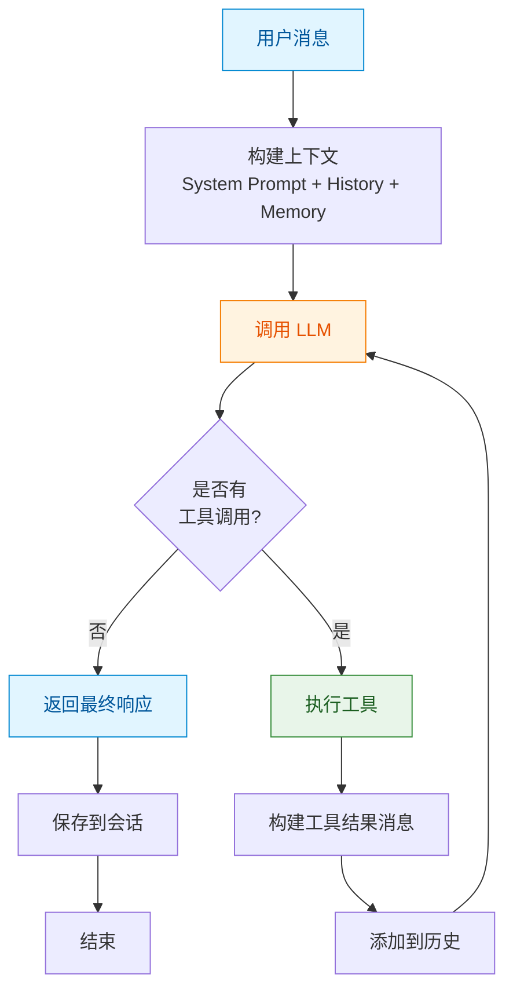
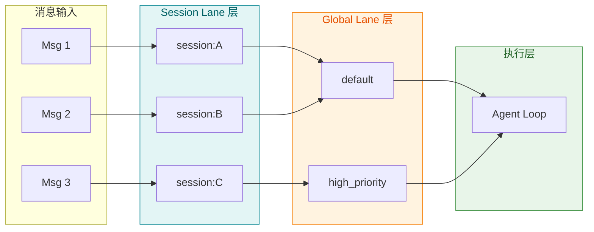
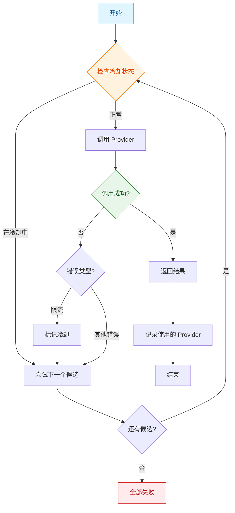
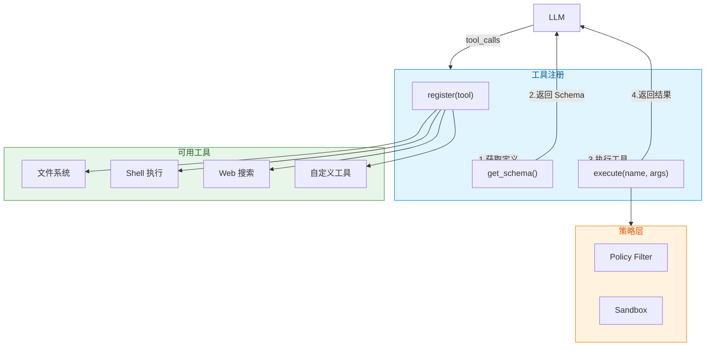
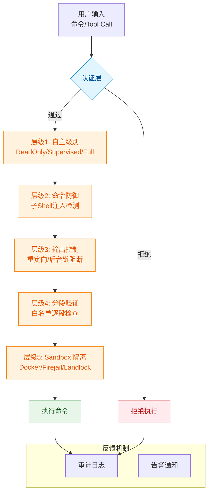
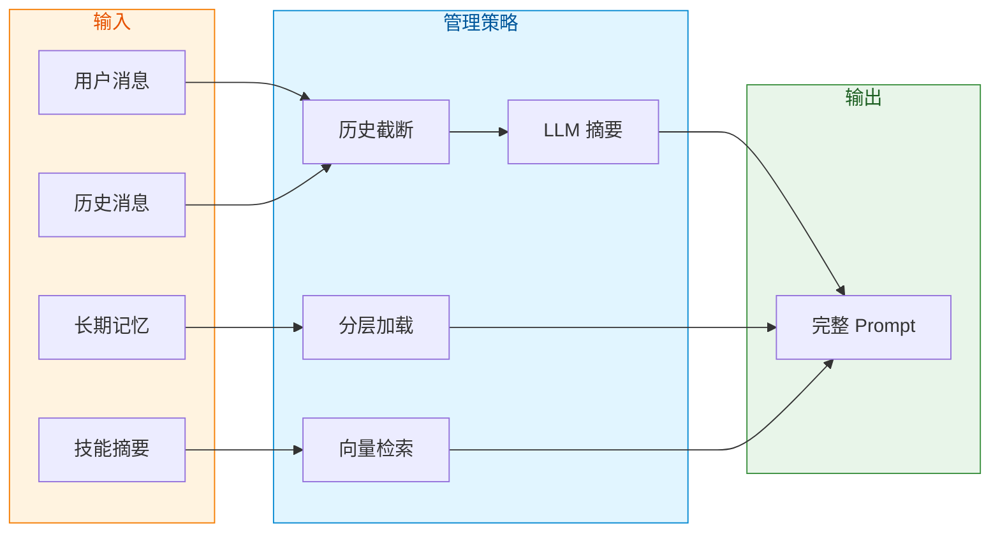
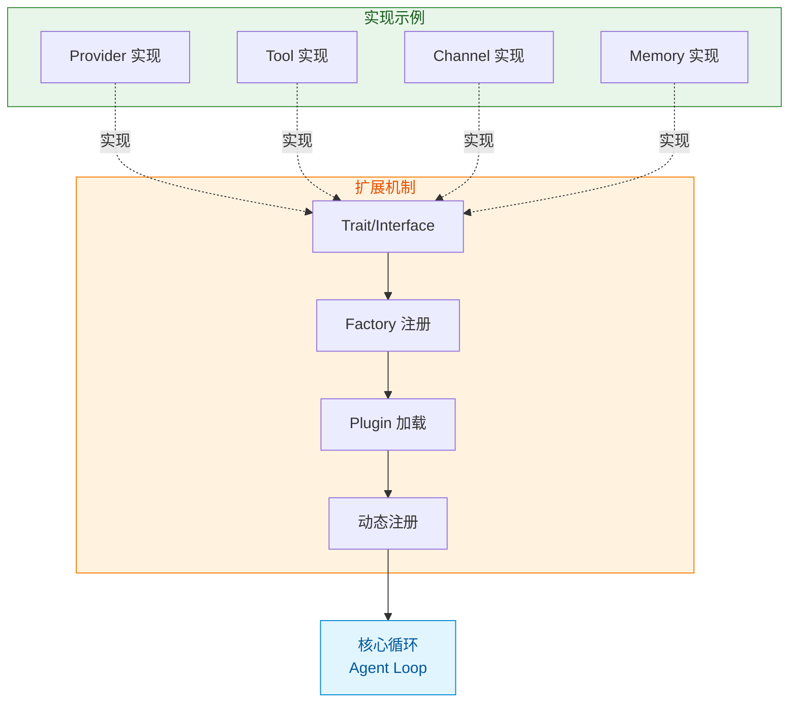

## 引言

在上一篇文章中，我们探讨了智能体架构与编排的基本模式：FanOut、Sequential、MapReduce 三种编排范式，以及 ReAct、Plan、Reflection 等单 Agent 思考模式。这些框架为我们理解多智能体系统提供了理论基础。

然而，理论需要实践的检验。本文选取了六个具有代表性的开源 Agent 项目进行深度分析，每个项目都代表了不同的技术选型和设计理念。通过深入剖析这些项目的核心源码，我们希望提炼出可复用的设计模式，为智能体架构设计提供实践参考。

## 参评项目概览

| 项目 | 技术栈 | 核心定位 | 代码规模 |
|------|--------|---------|---------|
| **OpenClaw** | TypeScript | 商业级多通道 Agent 平台 | ~430K 行 |
| **PicoClaw** | Go | 超轻量级嵌入式 Agent | ~50K 行 |
| **Nanobot** | Python | 超轻量级个人 AI 助手 | ~4K 行 |
| **ZeroClaw** | Rust | 高性能安全 Agent 运行时 | ~50K 行 |
| **MimiClaw** | C / FreeRTOS | 嵌入式 ESP32-S3 Agent | ~8K 行 |
| **LobsterAI** | Electron / React | 桌面端 AI 助手 + 沙箱 | ~50K 行 |
| **TinyClaw** | TypeScript | 多通道 Agent 服务器 + 团队协作 | ~30K 行 |
| **NanoClaw** | TypeScript | 容器化 Agent + Skills 引擎 | ~20K 行 |
| **IronClaw** | Rust | 企业级 Agent + WASM 工具 | ~100K 行 |

## 一、Agent 核心循环深度解析

Agent 循环是智能体的核心引擎，决定了单 Agent 如何与 LLM 交互、如何执行工具调用。六个项目采用了不同的实现策略，本节将深入分析每种实现的技术细节。

首先，通过一个概览表格对比各项目的核心设计：

| 项目 | 循环类型 | 最大迭代 | 并发模型 | 容错机制 |
|------|---------|---------|---------|---------|
| OpenClaw | ReAct + 流式 | 可配置 | 双层队列隔离 | 认证轮换 |
| PicoClaw | ReAct | 可配置 | sync.WaitGroup | Fallback Chain |
| Nanobot | ReAct | 20 | asyncio.Queue | 消息总线 |
| ZeroClaw | ReAct | 可配置 | 串行 | Provider 能力声明 |
| MimiClaw | ReAct | 10 | FreeRTOS 双核 | 编译时配置 |
| LobsterAI | Claude SDK | SDK 控制 | MCP 协议 | 权限审批 |
| TinyClaw | ReAct | 可配置 | 事件驱动 | 团队路由 |
| NanoClaw | ReAct | 可配置 | 容器隔离 | 消息队列 |
| IronClaw | ReAct | 可配置 | Job 并发池 | Cost Guard |

**ReAct 循环的通用流程**：



### 1.1 OpenClaw：双层队列隔离与认证轮换

OpenClaw 的 Agent 循环实现是其架构的核心亮点，展示了商业级系统应有的复杂性。

**核心入口分析**（`src/agents/pi-embedded-runner/run.ts`）：

```typescript
export async function runEmbeddedPiAgent(
  params: RunEmbeddedPiAgentParams,
): Promise<EmbeddedPiRunResult> {
  // 关键设计1：双层队列隔离
  const sessionLane = resolveSessionLane(params.sessionKey?.trim() || params.sessionId);
  const globalLane = resolveGlobalLane(params.lane);
  
  // 关键设计2：认证配置轮换
  const profileOrder = resolveAuthProfileOrder({
    cfg: params.config,
    store: authStore,
    provider,
    preferredProfile: preferredProfileId,
  });
  
  return enqueueSession(() =>
    enqueueGlobal(async () => {
      // 主循环逻辑
    })
  );
}
```

**双层队列设计**（`src/agents/pi-embedded-runner/lanes.ts`）：

| 队列类型 | 作用 | 隔离策略 |
|---------|------|---------|
| Session Lane | 按 sessionKey 隔离 | 同一会话内串行执行，保证状态一致性 |
| Global Lane | 全局可选队列 | 跨会话并发控制，防止资源竞争 |

**双层队列架构**：



**认证轮换机制**是 OpenClaw 的核心容错设计：

```typescript
const advanceAuthProfile = async (): Promise<boolean> => {
  if (lockedProfileId) return false;  // 用户锁定的 profile 不轮换
  
  let nextIndex = profileIndex + 1;
  while (nextIndex < profileCandidates.length) {
    const candidate = profileCandidates[nextIndex];
    // 检查冷却状态
    if (candidate && isProfileInCooldown(authStore, candidate)) {
      nextIndex += 1;
      continue;
    }
    try {
      await applyApiKeyInfo(candidate);
      profileIndex = nextIndex;
      thinkLevel = initialThinkLevel;  // 重置思考级别
      attemptedThinking.clear();
      return true;
    } catch (err) {
      nextIndex += 1;
    }
  }
  return false;
};
```

这种设计的精妙之处在于：
- **冷却机制**：当某个 API Key 触发限流时，自动进入冷却状态
- **透明切换**：Agent 循环无需感知认证失败，框架自动处理
- **多 Key 容错**：支持配置多个 API Key，轮换使用

### 1.2 PicoClaw：Go 语言超轻量级实现

PicoClaw 是用 Go 语言重写的超轻量级 Agent，目标是运行在 10 美元硬件上，内存占用 <10MB。其设计理念与 Nanobot 一脉相承，但在 Go 语言中实现了更高的性能。

**核心循环实现**（`pkg/agent/loop.go:790-940`）：

```go
func (al *AgentLoop) runLLMIteration(
    ctx context.Context,
    agent *AgentInstance,
    messages []providers.Message,
    opts processOptions,
) (string, int, error) {
    iteration := 0
    
    for iteration < agent.MaxIterations {
        iteration++
        
        // 1. 构建工具定义
        providerToolDefs := agent.Tools.ToProviderDefs()
        
        // 2. 调用 LLM（支持 fallback 链）
        var response *providers.LLMResponse
        if len(agent.Candidates) > 1 && al.fallback != nil {
            fbResult, fbErr := al.fallback.Execute(ctx, agent.Candidates, 
                func(ctx context.Context, provider, model string) (*providers.LLMResponse, error) {
                    return agent.Provider.Chat(ctx, messages, providerToolDefs, model, 
                        map[string]any{"max_tokens": agent.MaxTokens, "temperature": agent.Temperature})
                })
            // 处理 fallback 结果
        }
        
        // 3. 处理工具调用
        if len(response.ToolCalls) > 0 {
            // 并行执行工具
            var wg sync.WaitGroup
            for i, tc := range normalizedToolCalls {
                wg.Add(1)
                go func(idx int, tc providers.ToolCall) {
                    defer wg.Done()
                    results[idx].result = config.Tools.ExecuteWithContext(ctx, tc.Name, tc.Arguments, channel, chatID, nil)
                }(i, tc)
            }
            wg.Wait()
        } else {
            // 无工具调用，结束循环
            finalContent = response.Content
            break
        }
    }
}
```

**Fallback Chain 机制**是 PicoClaw 的核心容错设计：

```go
// FallbackChain 支持多 Provider 配置
type FallbackChain struct {
    cooldown *CooldownTracker
}

func (fc *FallbackChain) Execute(
    ctx context.Context,
    candidates []Candidate,
    callFunc func(ctx context.Context, provider, model string) (*LLMResponse, error),
) (*FallbackResult, error) {
    for i, candidate := range candidates {
        // 检查冷却状态
        if fc.cooldown.IsInCooldown(candidate.Provider) {
            continue
        }
        
        resp, err := callFunc(ctx, candidate.Provider, candidate.Model)
        if err != nil {
            // 检查是否是限流错误
            if isRateLimitError(err) {
                fc.cooldown.MarkFailed(candidate.Provider)
            }
            continue  // 尝试下一个候选
        }
        return &FallbackResult{Response: resp, Provider: candidate.Provider, Attempts: i + 1}, nil
    }
    return nil, ErrAllCandidatesFailed
}
```

**Fallback Chain 流程**：



**上下文压缩触发机制**（`pkg/agent/loop.go:876-939`）：

```go
// 自动检测上下文溢出并触发压缩
for retry := 0; retry <= maxRetries; retry++ {
    response, err = callLLM()
    
    isContextError := strings.Contains(errMsg, "context_length_exceeded") ||
        strings.Contains(errMsg, "context window") ||
        strings.Contains(errMsg, "token limit")
    
    if isContextError && retry < maxRetries {
        // 触发强制压缩
        al.forceCompression(agent, opts.SessionKey)
        
        // 重新构建消息
        newHistory := agent.Sessions.GetHistory(opts.SessionKey)
        messages = agent.ContextBuilder.BuildMessages(newHistory, newSummary, ...)
    }
}
```

**技术指标对比**：

| 指标 | OpenClaw | PicoClaw | Nanobot |
|------|----------|----------|---------|
| 语言 | TypeScript | Go | Python |
| 内存 | >1GB | <10MB | >100MB |
| 启动 | >500s | <1s | >30s |
| 成本 | Mac Mini 599$ | $10 硬件 | ~50$ |

### 1.3 Nanobot：极简主义的 4000 行实现

Nanobot 用约 4000 行代码实现了完整的 Agent 功能，其核心在于极简的核心循环设计。

**ReAct 循环实现**（`nanobot/agent/loop.py:186-229`）：

```python
# 核心循环：最多 20 次迭代
while iteration < self.max_iterations:
    iteration += 1
    
    # 1. 调用 LLM
    response = await self.provider.chat(
        messages=messages,
        tools=self.tools.get_definitions(),
        model=self.model
    )
    
    # 2. 处理工具调用
    if response.has_tool_calls:
        # 将 assistant 消息（含 tool_calls）添加到历史
        tool_call_dicts = [
            {
                "id": tc.id,
                "type": "function",
                "function": {
                    "name": tc.name,
                    "arguments": json.dumps(tc.arguments)  # 必须 JSON 字符串
                }
            }
            for tc in response.tool_calls
        ]
        messages = self.context.add_assistant_message(
            messages, response.content, tool_call_dicts
        )
        
        # 执行工具并添加结果
        for tool_call in response.tool_calls:
            result = await self.tools.execute(tool_call.name, tool_call.arguments)
            messages = self.context.add_tool_result(
                messages, tool_call.id, tool_call.name, result
            )
    else:
        # 无工具调用，结束循环
        final_content = response.content
        break
```

**消息总线解耦**（`nanobot/bus/queue.py`）：

Nanobot 使用 asyncio.Queue 实现消息总线，将通道层与 Agent 核心解耦：

```python
class MessageBus:
    def __init__(self):
        self._inbound = asyncio.Queue()
        self._outbound = asyncio.Queue()
    
    async def consume_inbound(self):
        return await self._inbound.get()
    
    def publish_outbound(self, msg: OutboundMessage):
        asyncio.create_task(self._outbound.put(msg))
```

这种设计的优势：
- **通道无关**：新增通道只需实现消息格式，无需修改 Agent 核心
- **异步处理**：生产者消费者模式，避免阻塞

### 1.4 ZeroClaw：Rust Trait 架构与六种工具格式解析

ZeroClaw 展示了如何用 Rust 实现类型安全的 Agent 系统。

**Provider Trait 定义**（`src/providers/traits.rs:200-260`）：

```rust
pub trait Provider: Send + Sync {
    /// 返回 Provider 支持的能力
    fn capabilities(&self) -> ProviderCapabilities;
    
    /// 将工具转换为 Provider 所需的格式
    fn convert_tools(&self, tools: &[ToolSpec]) -> ToolsPayload;
    
    /// 统一的聊天接口
    async fn chat(&self, request: ChatRequest<'_>) -> Result<ChatResponse>;
}
```

**ToolsPayload 枚举**展示了多格式支持的精妙设计：

```rust
pub enum ToolsPayload {
    /// OpenAI 格式 (JSON)
    OpenAI(Vec<OpenAITool>),
    /// Anthropic 格式 (JSON)
    Anthropic(Vec<AnthropicTool>),
    /// Gemini 格式 (JSON)
    Gemini(Vec<GeminiTool>),
    /// Prompt-Guided 格式（当 Provider 不支持原生工具时）
    PromptGuided(String),
}
```

**六种工具调用格式解析**是 ZeroClaw 的核心安全特性：

| 优先级 | 格式类型 | 示例 |
|--------|---------|------|
| 1 | OpenAI 风格 JSON | `{"tool_calls": [{"function": {"name": "shell", "arguments": {...}}}]}` |
| 2 | MiniMax XML 风格 | `<invoke name="shell">...</invoke>` |
| 3 | XML 标签风格 | `<tool_call>{"name": "shell"...}</tool_call>` |
| 4 | Markdown 代码块 | ` ```tool_call {...} ``` ` |
| 5 | XML 属性风格 | `<invoke name="shell"><parameter name="command">ls</parameter></invoke>` |
| 6 | GLM 行格式 | `shell/command>ls` |

**关键安全设计**：代码明确拒绝"任意 JSON 降级解析"，只有明确标记的格式才会被解析，防止提示词注入攻击。

### 1.5 MimiClaw：嵌入式 FreeRTOS 双核分工

MimiClaw 在资源受限的 ESP32-S3 上实现了 Agent 功能，展示了嵌入式场景的特殊设计。

**FreeRTOS 任务分配**：

| 任务 | 核心 | 优先级 | 栈大小 | 职责 |
|------|------|--------|--------|------|
| `tg_poll` | Core 0 | 5 | 12KB | Telegram 长轮询 |
| `agent_loop` | Core 1 | 6 | 12KB | 推理循环 + Claude API |
| `outbound` | Core 0 | 5 | 8KB | 响应分发 |
| `serial_cli` | Core 0 | 3 | 4KB | 串口调试 |

**核心设计原则**：Core 0 处理 I/O 密集任务，Core 1 处理 CPU 密集任务。

**ReAct 循环实现**（`main/agent/agent_loop.c:171-324`）：

```c
// C 语言实现的 ReAct 循环
while (iteration < MIMI_AGENT_MAX_TOOL_ITER) {  // 最大 10 次
    // 1. 调用 LLM（带工具）
    err = llm_chat_tools(system_prompt, messages, tools_json, &resp);
    
    // 2. 判断停止原因
    if (!resp.tool_use) {
        // 正常完成
        final_text = strdup(resp.text);
        break;
    }
    
    // 3. 执行工具并构建结果
    build_tool_results(&resp, &msg, tool_output, TOOL_OUTPUT_SIZE);
    // 4. 追加到消息历史，继续循环
}
```

### 1.6 LobsterAI：Claude Agent SDK 与 MCP 协议

LobsterAI 采用了不同于其他项目的策略：直接使用 Anthropic 的 Claude Agent SDK 作为核心引擎，而非自研循环。这种设计将底层循环交给专业团队维护，专注于上层的工程体验。

**核心架构**（`coworkRunner.ts`）：

```typescript
// 启动会话
async startSession(sessionId, prompt, options) {
    // 1. 构建增强 System Prompt
    const systemPrompt = await buildSystemPrompt({
        workspaceSafety: buildWorkspaceSafetyPrompt(),
        localTime: buildLocalTimeContextPrompt(),
        userMemories: await buildUserMemoriesXml(),
        skills: buildAutoRoutingPrompt(),
    });
    
    // 2. 使用 Claude Agent SDK
    return await claudesdk.run({
        system: systemPrompt,
        tools: availableTools,
        canUseTool: async (toolName, toolInput, { signal }) => {
            // 权限审批
            return await requestPermission(toolName, toolInput);
        },
    });
}
```

**MCP 协议集成**：

LobsterAI 通过 MCP（Model Context Protocol）与外部工具和服务集成，实现了标准化的工具调用：

```typescript
// MCP 工具定义
const mcpTools = [
    {
        name: "filesystem_read",
        description: "Read files from the filesystem",
        inputSchema: {
            type: "object",
            properties: {
                path: { type: "string" },
                offset: { type: "number" },
                limit: { type: "number" },
            },
        },
    },
];

// 通过 MCP 协议执行
async function executeMcpTool(toolName: string, args: any) {
    const result = await mcpClient.callTool({
        name: toolName,
        arguments: args,
    });
    return result;
}
```

**权限审批实现**：

```typescript
// 权限审批回调
canUseTool: async (toolName, toolInput, { signal }) => {
    // 1. 检查是否为危险操作
    if (isDangerousOperation(toolName)) {
        // 2. 阻塞等待用户确认
        const approval = await showApprovalModal(toolName, toolInput);
        if (!approval.approved) {
            throw new Error("Permission denied");
        }
    }
    
    // 3. 返回批准
    return { approved: true };
}
```

**可借鉴点**：

- **SDK 复用**：将核心循环交给专业 SDK，专注上层工程
- **MCP 标准化**：通过 MCP 协议实现工具定义的标准化
- **权限审批**：完善的权限审批机制保障安全

### 1.7 TinyClaw：团队协作路由与技能系统

TinyClaw 是一个 TypeScript 实现的多通道 Agent 服务器，其核心特点是**团队协作路由**和**技能系统**。

**核心架构**（`src/lib/agent.ts`）：

```typescript
// Agent 目录结构管理
export function ensureAgentDirectory(agentDir: string): void {
    // 复制 .claude 目录
    const sourceClaudeDir = path.join(SCRIPT_DIR, '.claude');
    copyDirSync(sourceClaudeDir, path.join(agentDir, '.claude'));
    
    // 复制技能到 .agents/skills
    const sourceSkills = path.join(SCRIPT_DIR, '.agents', 'skills');
    copyDirSync(sourceSkills, path.join(agentDir, '.agents', 'skills'));
    
    // 镜像到 .claude/skills（兼容 Claude Code）
    copyDirSync(targetAgentsSkills, path.join(agentDir, '.claude', 'skills'));
}
```

**团队路由机制**（`src/lib/routing.ts`）：

```typescript
// 解析 @agent_id 或 @team_id 前缀
export function parseAgentRouting(
    rawMessage: string,
    agents: Record<string, AgentConfig>,
    teams: Record<string, TeamConfig> = {}
): { agentId: string; message: string; isTeam?: boolean } {
    const match = rawMessage.match(/^@(\S+)\s+([\s\S]*)$/);
    if (match) {
        const candidateId = match[1].toLowerCase();
        
        // 检查 agent IDs
        if (agents[candidateId]) {
            return { agentId: candidateId, message: match[2] };
        }
        
        // 检查 team IDs — 解析到 leader agent
        if (teams[candidateId]) {
            return { agentId: teams[candidateId].leader_agent, message: match[2], isTeam: true };
        }
    }
    return { agentId: 'default', message: rawMessage };
}
```

**可借鉴点**：

- **团队路由**：通过 @mention 实现 Agent 间协作
- **技能镜像**：同时支持 .claude/skills 和 .agents/skills 两套系统
- **目录结构**：标准化的 Agent 工作目录结构

### 1.8 NanoClaw：容器化 Agent 与 Skills 引擎

NanoClaw 是一个基于容器的 Agent 系统，其核心特点是**隔离执行环境**和**Skills 引擎**。

**核心循环**（`src/index.ts`）：

```typescript
// 消息处理主循环
async function startMessageLoop(): Promise<void> {
    while (true) {
        const { messages, newTimestamp } = getNewMessages(
            jids, lastTimestamp, ASSISTANT_NAME
        );
        
        if (messages.length > 0) {
            // 按群组去重
            const messagesByGroup = new Map<string, NewMessage[]>();
            for (const msg of messages) {
                messagesByGroup.get(msg.chat_jid)?.push(msg) 
                    || messagesByGroup.set(msg.chat_jid, [msg]);
            }
            
            // 发送到队列或启动容器
            for (const [chatJid, groupMessages] of messagesByGroup) {
                if (queue.sendMessage(chatJid, formatted)) {
                    // 管道消息到活跃容器
                } else {
                    // 无活跃容器 — 入队等待新容器
                    queue.enqueueMessageCheck(chatJid);
                }
            }
        }
    }
}
```

**Skills 引擎**（`skills-engine/index.ts`）：

```typescript
// Skills 核心能力
export {
    applySkill,           // 应用技能
    uninstallSkill,       // 卸载技能
    createBackup,         // 创建备份
    restoreBackup,        // 恢复备份
    acquireLock,          // 获取锁
    mergeNpmDependencies, // 合并依赖
    checkDependencies,    // 检查依赖兼容性
    compareSemver,       // 版本比较
};
```

**容器运行器**（`src/container-runner.ts`）：

```typescript
// 在容器中运行 Agent
await runContainerAgent(
    group,
    {
        prompt,
        sessionId,
        groupFolder: group.folder,
        chatJid,
        isMain,
        assistantName: ASSISTANT_NAME,
    },
    (proc, containerName) =>
        queue.registerProcess(chatJid, proc, containerName, group.folder),
    onOutput,
);
```

**可借鉴点**：

- **容器隔离**：每个 Agent 在独立容器中运行，安全隔离
- **消息队列**：GroupQueue 管理并发，支持空闲超时
- **Skills 引擎**：完整的技能安装、卸载、迁移、回滚机制

### 1.9 IronClaw：Rust 企业级 Agent 运行时

IronClaw 是用 Rust 实现的企业级 Agent 运行时，其核心特点是**高性能**、**WASM 工具**和**成本控制**。

**App 构建器**（`src/app.rs`）：

```rust
pub struct AppComponents {
    pub config: Config,
    pub db: Option<Arc<dyn Database>>,
    pub llm: Arc<dyn LlmProvider>,
    pub cheap_llm: Option<Arc<dyn LlmProvider>>,
    pub safety: Arc<SafetyLayer>,
    pub tools: Arc<ToolRegistry>,
    pub embeddings: Option<Arc<dyn EmbeddingProvider>>,
    pub workspace: Option<Arc<Workspace>>,
    pub context_manager: Arc<ContextManager>,
    pub cost_guard: Arc<CostGuard>,
    // ...
}
```

**初始化阶段**：

```rust
pub async fn build_all(mut self) -> Result<AppComponents, anyhow::Error> {
    // Phase 1: 数据库初始化
    self.init_database().await?;
    
    // Phase 2: 密钥存储
    self.init_secrets().await?;
    
    // Phase 3: LLM 提供商链
    let (llm, cheap_llm) = self.init_llm()?;
    
    // Phase 4: 工具、嵌入、工作空间
    let (safety, tools, embeddings, workspace) = self.init_tools(&llm).await?;
    
    // Phase 5: WASM 工具、MCP 服务器、扩展
    let (_, wasm_tool_runtime, extension_manager, _) = 
        self.init_extensions(&tools, &hooks).await?;
    
    // 创建成本守卫
    let cost_guard = Arc::new(CostGuard::new(CostGuardConfig {
        max_cost_per_day_cents: self.config.agent.max_cost_per_day_cents,
        max_actions_per_hour: self.config.agent.max_actions_per_hour,
    }));
    
    Ok(AppComponents { ... })
}
```

**工具系统**（`src/tools/tool.rs`）：

```rust
// 工具域：编排器进程 vs 容器
pub enum ToolDomain {
    // 可在编排器运行（纯函数、内存访问）
    Orchestrator,
    // 必须在沙箱容器运行（文件系统、shell）
    Container,
}

// 审批要求级别
pub enum ApprovalRequirement {
    Never,                    // 无需审批
    UnlessAutoApproved,       // 除非自动批准
    Always,                   // 始终需要审批
}

// 速率限制配置
pub struct ToolRateLimitConfig {
    pub requests_per_minute: u32,
    pub requests_per_hour: u32,
}
```

**可借鉴点**：

- **Rust 性能**：编译型语言保证运行时性能
- **WASM 工具**：安全的沙箱化工具执行
- **成本守卫**：每日/每小时操作成本限制
- **多后端支持**：PostgreSQL / libSQL 数据库

## 二、工具系统设计深度对比

工具系统是 Agent 能力的延伸，设计好坏直接影响 Agent 的可用性和安全性。

**工具系统通用架构**：



### 2.1 OpenClaw：TypeBox Schema 与策略过滤器

**工具定义模式**（`src/agents/pi-tools.ts`）：

```typescript
export function createOpenClawCodingTools(options?: {...}) {
  return {
    name: "tool_name",
    description: "工具说明",
    parameters: Type.Object({  // TypeBox 定义
      filename: Type.String(),
      content: Type.String(),
    }),
    execute: async (toolCallId, args) => {
      return { content: [...] };
    }
  };
}
```

**策略过滤器实现**（`src/agents/pi-tools.policy.ts`）：

```typescript
// 三层策略过滤
function makeToolPolicyMatcher(policy: SandboxToolPolicy) {
  const deny = compilePatterns(policy.deny);
  const allow = compilePatterns(policy.allow);
  
  return (name: string) => {
    // 先检查拒绝列表
    if (matchesAny(name, deny)) return false;
    // 空允许列表表示允许所有
    if (allow.length === 0) return true;
    // 检查允许列表
    return matchesAny(name, allow);
  };
}

// 子 Agent 禁用危险工具
const DEFAULT_SUBAGENT_TOOL_DENY = [
  "sessions_list", "sessions_history", "sessions_send",
  "sessions_spawn", "gateway", "agents_list", "memory_search"
];
```

### 2.2 PicoClaw：Go 接口与 ToolRegistry 注册中心

PicoClaw 使用 Go 语言的接口特性实现了简洁但功能强大的工具系统。

**工具接口定义**（`pkg/tools/base.go`）：

```go
// Tool 接口定义了所有工具的通用行为
type Tool interface {
    // Name 返回工具名称
    Name() string
    // Description 返回工具描述
    Description() string
    // Execute 执行工具并返回结果
    Execute(ctx context.Context, args map[string]interface{}, 
            channel, chatID string, ctxVals map[string]interface{}) *ToolResult
    // Schema 返回工具的参数 Schema
    Schema() ToolSchema
}
```

**工具注册中心**（`pkg/tools/registry.go`）：

```go
type ToolRegistry struct {
    mu    sync.RWMutex
    tools map[string]Tool
}

func (tr *ToolRegistry) Register(tool Tool) error {
    tr.mu.Lock()
    defer tr.mu.Unlock()
    
    if tool == nil {
        return errors.New("tool cannot be nil")
    }
    tr.tools[tool.Name()] = tool
    return nil
}

func (tr *ToolRegistry) Execute(name string, args map[string]interface{}, 
                                 channel, chatID string) *ToolResult {
    tr.mu.RLock()
    tool, ok := tr.tools[name]
    tr.mu.RUnlock()
    
    if !ok {
        return ErrorResult(fmt.Sprintf("tool not found: %s", name))
    }
    
    return tool.Execute(context.Background(), args, channel, chatID, nil)
}
```

**并行工具执行**（`pkg/tools/toolloop.go:125-158`）：

```go
// 工具并行执行是 PicoClaw 的特色
results := make([]indexedResult, len(normalizedToolCalls))
var wg sync.WaitGroup

for i, tc := range normalizedToolCalls {
    wg.Add(1)
    go func(idx int, tc providers.ToolCall) {
        defer wg.Done()
        results[idx].result = config.Tools.ExecuteWithContext(
            ctx, tc.Name, tc.Arguments, channel, chatID, nil)
    }(i, tc)
}
wg.Wait()
```

### 2.3 Nanobot：JSON Schema 与沙箱限制

**工具基类设计**（`nanobot/agent/tools/base.py`）：

```python
class Tool(ABC):
    @property
    @abstractmethod
    def name(self) -> str: pass
    
    @property
    @abstractmethod
    def description(self) -> str: pass
    
    @property
    @abstractmethod
    def parameters(self) -> dict[str, Any]:  # JSON Schema
        pass
    
    @abstractmethod
    async def execute(self, **kwargs: Any) -> str: pass
```

**沙箱限制实现**：

```python
class ReadFileTool:
    def __init__(self, allowed_dir: Path | None = None):
        self.allowed_dir = allowed_dir
    
    async def execute(self, path: str, **kwargs):
        if self.allowed_dir:
            # 验证路径在允许目录内
            full_path = (self.allowed_dir / path).resolve()
            if not str(full_path).startswith(str(self.allowed_dir)):
                raise PermissionError("Path outside allowed directory")
```

### 2.4 ZeroClaw：极简 Trait 与安全拒绝

**Tool Trait 定义**（`src/tools/traits.rs`）：

```rust
#[async_trait]
pub trait Tool: Send + Sync {
    fn name(&self) -> &str;
    fn description(&self) -> str;
    fn parameters_schema(&self) -> serde_json::Value;
    async fn execute(&self, args: serde_json::Value) -> anyhow::Result<ToolResult>;
}
```

极简接口设计：只定义"名称-描述-参数-执行"四个核心方法。

## 三、安全设计深度对比

安全是生产级 Agent 系统的必备要素，本节深入分析各项目的安全机制。

**安全架构全景图**：



### 3.1 ZeroClaw：五层命令防御

**防御层级实现**（`src/security/policy.rs`）：

```rust
pub fn is_command_allowed(&self, command: &str) -> bool {
    // 层级1: 自主级别门禁
    if matches!(self.autonomy_level, AutonomyLevel::ReadOnly) {
        return false;
    }
    
    // 层级2: 阻断子 Shell 注入
    if contains_subshell_injection(command) {
        return false;  // ``, $(), ${}, <(), >()
    }
    
    // 层级3: 阻断输出重定向
    if contains_redirect(command) {
        return false;  // >, >>
    }
    
    // 层级4: 阻断后台链
    if contains_background_chain(command) {
        return false;  // &
    }
    
    // 层级5: 分段白名单验证
    // 按 |, &&, ;, || 分割，逐段检查
    for segment in split_command(command) {
        if !self.is_segment_allowed(segment) {
            return false;
        }
    }
    
    true
}
```

### 3.2 MimiClaw：编译时安全配置

**安全相关的编译时配置**（`main/mimi_config.h`）：

```c
// 所有配置在编译时确定，无法运行时修改
#define MIMI_SECRET_WIFI_SSID       "SSID"
#define MIMI_SECRET_WIFI_PASS       "password"
#define MIMI_SECRET_TG_TOKEN        "telegram_bot_token"
#define MIMI_SECRET_API_KEY         "anthropic_api_key"
#define MIMI_SECRET_MODEL           "claude-opus-4-6"
```

这种设计的优势：
- **不可篡改**：运行时无法修改配置
- **审计友好**：固件即配置
- **攻击面小**：无运行时配置解析漏洞

### 3.3 LobsterAI：QEMU 沙箱与权限审批

**沙箱架构**：
- 使用 QEMU 运行轻量级 Alpine Linux
- 支持 macOS (HVF)、Windows (WHPX)、Linux (KVM) 硬件加速
- IPC 通过 9p VirtFS（macOS/Linux）或 Virtio-Serial（Windows）

**权限审批模式**：

| 模式 | 说明 | 触发条件 |
|------|------|---------|
| Modal | 弹出对话框等待确认 | 默认模式 |
| Text | 要求输入确认文本 | 用户选择 |
| Auto | 自动批准 | 定时任务 |

### 3.4 TinyClaw：发送者白名单与消息过滤

TinyClaw 的安全机制主要围绕**消息过滤**和**发送者控制**：

```typescript
// 发送者白名单检查
if (!msg.is_from_me && !msg.is_bot_message && registeredGroups[chatJid]) {
    const cfg = loadSenderAllowlist();
    if (shouldDropMessage(chatJid, cfg) && !isSenderAllowed(chatJid, msg.sender, cfg)) {
        // 丢弃消息
        return;
    }
    storeMessage(msg);
}
```

- **发送者白名单**：控制哪些用户可以与 Agent 交互
- **消息过滤**：按群组/发送者过滤不需要的消息

### 3.5 NanoClaw：容器隔离与空闲超时

NanoClaw 的安全机制基于**容器隔离**：

```typescript
// 空闲超时自动关闭容器
const resetIdleTimer = () => {
    if (idleTimer) clearTimeout(idleTimer);
    idleTimer = setTimeout(() => {
        queue.closeStdin(chatJid);
    }, IDLE_TIMEOUT);
};
```

- **容器隔离**：每个 Agent 在独立 Docker 容器中运行
- **空闲超时**：IDLE_TIMEOUT 后自动关闭容器释放资源

### 3.6 IronClaw：成本守卫与多层安全

IronClaw 的安全设计非常全面：

```rust
// 成本守卫配置
let cost_guard = Arc::new(CostGuard::new(CostGuardConfig {
    max_cost_per_day_cents: self.config.agent.max_cost_per_day_cents,
    max_actions_per_hour: self.config.agent.max_actions_per_hour,
}));

// 安全层
let safety = Arc::new(SafetyLayer::new(&self.config.safety));

// WASM 沙箱
let wasm_tool_runtime = WasmToolRuntime::new(
    self.config.wasm.to_runtime_config()
)?;
```

- **成本守卫**：限制每日/每小时费用，防止意外大额支出
- **WASM 沙箱**：安全的沙箱化工具执行
- **安全层**：多层安全策略配置
- **密钥存储**：加密的密钥存储（PostgreSQL / libSQL）

## 四、上下文管理深度对比

上下文管理是长程任务的核心挑战，各项目采用了不同的策略。

**上下文管理策略对比**：



### 4.1 OpenClaw：双层压缩机制

**第一层：历史截断**（`src/agents/pi-embedded-runner/history.ts`）：

```typescript
export function limitHistoryTurns(
  messages: Message[],
  maxTurns: number
): Message[] {
  // 保留 system 消息，只截断对话历史
  const systemMessages = messages.filter(m => m.role === 'system');
  const对话Messages = messages.filter(m => m.role !== 'system');
  
  // 从后往前保留 maxTurns 轮
  const truncated = [];
  let currentTurn = [];
  for (const msg of对话Messages.reverse()) {
    currentTurn.unshift(msg);
    if (msg.role === 'assistant') {
      truncated.unshift(...currentTurn);
      currentTurn = [];
      if (truncated.length / 2 >= maxTurns) break;
    }
  }
  
  return [...systemMessages, ...truncated];
}
```

**第二层：LLM 摘要压缩**（`src/agents/pi-embedded-runner/compact.ts`）：

```typescript
export async function compactEmbeddedPiSessionDirect(
  session: EmbeddedPiSession,
): Promise<void> {
  // 1. 调用 LLM 生成摘要
  const summary = await llm.chat([
    { role: "system", content: "请简洁总结对话要点" },
    { role: "user", content: JSON.stringify(session.messages) }
  ]);
  
  // 2. 保留摘要 + 最近几轮
  const recentMessages = session.messages.slice(-6);
  session.messages = [
    { role: "system", content: "对话摘要：" + summary },
    ...recentMessages
  ];
}
```

### 4.2 Nanobot：环式缓冲与会话持久化

**会话管理**（`nanobot/session/manager.py`）：

```python
class SessionManager:
    def __init__(self, workspace: Path, max_messages: int = 20):
        self.workspace = workspace
        self.max_messages = max_messages
        self._cache = {}  # 内存缓存
    
    def get_or_create(self, session_key: str) -> Session:
        if session_key not in self._cache:
            # 从文件加载或创建新会话
            self._cache[session_key] = self._load_session(session_key)
        return self._cache[session_key]
```

**JSONL 持久化格式**：

```
{"role": "user", "content": "Hello", "ts": 1738764800}
{"role": "assistant", "content": "Hi there!", "ts": 1738764802}
```

### 4.3 PicoClaw：自动上下文压缩与状态管理

PicoClaw 在上下文管理方面实现了独特的自动压缩机制，能够在检测到上下文溢出时自动触发压缩。

**上下文压缩触发**（`pkg/agent/loop.go:876-939`）：

```go
// 检测上下文错误并自动压缩
func (al *AgentLoop) detectAndHandleContextError(errMsg string, retry int) bool {
    isContextError := strings.Contains(errMsg, "context_length_exceeded") ||
        strings.Contains(errMsg, "context window") ||
        strings.Contains(errMsg, "token limit") ||
        strings.Contains(errMsg, "too many tokens")
    
    if isContextError && retry < maxRetries {
        return true  // 需要触发压缩
    }
    return false
}

// 强制压缩实现
func (al *AgentLoop) forceCompression(agent *AgentInstance, sessionKey string) {
    // 1. 调用 LLM 生成摘要
    summary := al.summarizeSession(agent, sessionKey)
    
    // 2. 保存摘要到会话
    agent.Sessions.SetSummary(sessionKey, summary)
    
    // 3. 清空历史，保留摘要
    agent.Sessions.ClearHistory(sessionKey)
}
```

**状态管理**（`pkg/state/state.go`）：

```go
// 轻量级状态管理
type Manager struct {
    mu       sync.RWMutex
    data     map[string]interface{}
    filePath string
}

func (sm *Manager) Get(key string) (interface{}, bool) {
    sm.mu.RLock()
    defer sm.mu.RUnlock()
    val, ok := sm.data[key]
    return val, ok
}

func (sm *Manager) Set(key string, value interface{}) {
    sm.mu.Lock()
    defer sm.mu.Unlock()
    sm.data[key] = value
}
```

### 4.4 LobsterAI：六分类记忆系统

**记忆分类**：

| 分类 | 置信度 | 存储位置 | 更新策略 |
|------|--------|---------|---------|
| profile | 0.93 | `user/memories/profile.md` | 追加式 |
| preferences | 0.88 | `user/memories/preferences/` | LLM 合并 |
| entities | 0.88 | `user/memories/entities/` | LLM 合并 |
| events | 0.85 | `user/memories/events/` | 新增 |
| cases | 0.85 | `agent/memories/cases/` | 新增 |
| patterns | 0.83 | `agent/memories/patterns/` | LLM 合并 |

**记忆提取流程**：

```python
def extract_turn_memory_changes(messages: list[Message]) -> list[Memory]:
    memories = []
    
    # 1. 显式提取
    for msg in messages:
        if "请记住" in msg.content:
            memories.append(Memory(type="explicit", content=...))
        if "从记忆中删除" in msg.content:
            memories.append(Memory(type="delete", content=...))
    
    # 2. 隐式提取（规则匹配）
    for rule in implicit_rules:
        matches = rule.match(messages)
        memories.extend(matches)
    
    return memories
```

### 4.5 TinyClaw：团队上下文与技能摘要

TinyClaw 的上下文管理围绕**团队协作**设计：

```typescript
// 更新 AGENTS.md 中的队友信息
export function updateAgentTeammates(
    agentDir: string, 
    agentId: string, 
    agents: Record<string, AgentConfig>, 
    teams: Record<string, TeamConfig>
): void {
    // 从所有团队中查找该 Agent 的队友
    const teammates: { id: string; name: string; model: string }[] = [];
    for (const team of Object.values(teams)) {
        if (!team.agents.includes(agentId)) continue;
        for (const tid of team.agents) {
            if (tid === agentId) continue;
            const agent = agents[tid];
            if (agent) teammates.push({ id: tid, name: agent.name, model: agent.model });
        }
    }
}
```

- **团队上下文**：动态维护 Agent 队友信息
- **技能摘要**：每个技能自动生成摘要供 Agent 理解

### 4.6 NanoClaw：消息聚合与光标管理

NanoClaw 通过**消息队列**和**光标管理**实现上下文管理：

```typescript
// 获取错过的消息
const missedMessages = getMessagesSince(
    chatJid,
    lastAgentTimestamp[chatJid] || '',
    ASSISTANT_NAME,
);

// 推进光标
lastAgentTimestamp[chatJid] = missedMessages[missedMessages.length - 1].timestamp;
saveState();
```

- **消息光标**：记录每个群组的消息处理位置
- **聚合窗口**：支持触发词模式下的消息聚合

### 4.7 IronClaw：ContextManager 与工作空间

IronClaw 提供了完整的**上下文管理**和**工作空间**支持：

```rust
// 上下文管理器
let context_manager = Arc::new(ContextManager::new(
    self.config.agent.max_parallel_jobs
));

// 工作空间（带嵌入支持）
let workspace = Workspace::new_with_db("default", db.clone())
    .with_embeddings(emb.clone());
```

- **ContextManager**：管理并发 Job 的上下文
- **Workspace**：带向量嵌入的工作空间，支持语义搜索

## 五、扩展性设计深度对比

扩展性是框架成熟度的重要标志。

**扩展性架构模式对比**：



### 5.1 ZeroClaw：Trait + Factory 模式

**扩展点清单**：

| 扩展点 | Trait 位置 | 关键方法 |
|--------|-----------|---------|
| Provider | `src/providers/traits.rs` | `chat()`, `capabilities()`, `convert_tools()` |
| Tool | `src/tools/traits.rs` | `execute()`, `spec()` |
| Channel | `src/channels/traits.rs` | `send()`, `listen()` |
| Memory | `src/memory/traits.rs` | `store()`, `recall()` |
| Sandbox | `src/security/traits.rs` | `wrap_command()` |
| Runtime | `src/runtime/traits.rs` | `build_shell_command()` |

### 5.2 OpenClaw：插件架构

**插件目录结构**：

```
extensions/
├── my-channel/           # 自定义通道插件
│   ├── package.json
│   └── src/index.ts
├── my-tool/             # 自定义工具插件
│   ├── package.json
│   └── src/index.ts
```

**插件注册机制**：

```typescript
// 插件入口
export function registerPlugin(openclaw: OpenClawSDK) {
  openclaw.registerChannel(new MyChannel());
  openclaw.registerTool(new MyTool());
}
```

### 5.3 Nanobot：动态注册

**Provider 注册**（`nanobot/providers/litellm_provider.py`）：

```python
class LiteLLMProvider(LLMProvider):
    def __init__(self, api_key, api_base, default_model, ...):
        # 自动检测 Provider 类型
        self.is_openrouter = api_key.startswith("sk-or-")
        self.is_aihubmix = "aihubmix" in api_base
        self.is_vllm = bool(api_base) and not self.is_openrouter
```

**工具注册**（`nanobot/agent/tools/registry.py`）：

```python
class ToolRegistry:
    def register(self, tool: Tool) -> None:
        self._tools[tool.name] = tool
    
    def execute(self, name: str, params: dict) -> str:
        tool = self._tools.get(name)
        if not tool:
            raise ValueError(f"Unknown tool: {name}")
        return asyncio.run(tool.execute(**params))
```

### 5.4 PicoClaw：Go 接口与轻量扩展

PicoClaw 利用 Go 语言的接口特性实现轻量级扩展：

```go
// Channel 接口定义
type Channel interface {
    Name() string
    Send(msg OutboundMessage) error
    Start() error
    Stop() error
}

// 注册新通道
func RegisterChannel(ch Channel) {
    channels[ch.Name()] = ch
}
```

### 5.5 LobsterAI：技能系统与 MCP 生态

LobsterAI 通过技能系统实现功能扩展：

```
SKILLs/
├── web-search/
│   ├── SKILL.md          # 技能定义
│   └── manifest.json     # 技能清单
├── office/
│   ├── SKILL.md
│   └── manifest.json
```

**技能定义**（`SKILL.md`）：

```markdown
---
name: Web Search
description: Search the web for current information
official: true
---
# 技能指令

你是一个专业的网络搜索助手...
```

### 2.7 TinyClaw：团队技能与双目录镜像

TinyClaw 的工具系统特点是**技能镜像**和**团队协作**：

```typescript
// 技能同时复制到两套系统
copyDirSync(sourceSkills, path.join(agentDir, '.agents', 'skills'));
copyDirSync(targetAgentsSkills, path.join(agentDir, '.claude', 'skills'));
```

- `.agents/skills`：TinyClaw 原生技能目录
- `.claude/skills`：兼容 Claude Code 的技能目录

### 2.8 NanoClaw：容器化工具与 IPC 通信

NanoClaw 的工具通过**容器隔离**和**IPC 通信**实现：

```typescript
// 容器运行器
await runContainerAgent(
    group,
    {
        prompt,
        sessionId,
        groupFolder: group.folder,
    },
    (proc, containerName) =>
        queue.registerProcess(chatJid, proc, containerName, group.folder),
    onOutput,
);
```

工具在容器内执行，通过 IPC 与主机通信。

### 2.9 IronClaw：WASM 工具与 MCP 集成

IronClaw 的工具系统是其核心亮点：

```rust
// WASM 工具运行时
let wasm_tool_runtime = WasmToolRuntime::new(
    self.config.wasm.to_runtime_config()
).map(Arc::new);

// MCP 服务器集成
for server in enabled_servers {
    let client = McpClient::new_authenticated(server, ...);
    let tools = client.list_tools().await?;
    tools.register(tool).await;
}
```

**工具域分类**：

```rust
pub enum ToolDomain {
    Orchestrator,  // 编排器进程内运行（纯函数）
    Container,     // 必须在沙箱容器运行（文件系统）
}
```

### 5.6 TinyClaw：技能系统与 Claude Code 兼容

TinyClaw 的扩展性通过**技能系统**实现：

```typescript
// 双目录技能支持
.agents/skills      // TinyClaw 原生
.claude/skills     // Claude Code 兼容

// 技能结构
skill/
├── scripts/       // 技能脚本
├── manifest.json  // 技能清单
└── SKILL.md      // 技能定义
```

- **技能镜像**：同时支持两套技能目录
- **Claude Code 兼容**：可直接使用 Claude Code 的技能

### 5.7 NanoClaw：Skills 引擎与容器化部署

NanoClaw 的扩展性围绕**Skills 引擎**和**容器化**：

```typescript
// Skills 引擎核心能力
export {
    applySkill,           // 应用技能
    uninstallSkill,       // 卸载技能
    createBackup,        // 创建备份
    restoreBackup,       // 恢复备份
    acquireLock,         // 获取锁
    mergeNpmDependencies,// 合并依赖
    checkDependencies,   // 检查依赖兼容性
};

// 容器化部署
// 每个 Agent 在独立容器中运行
```

- **Skills 引擎**：完整的技能生命周期管理
- **容器隔离**：便于部署和扩展
- **定时任务**：支持计划任务执行

### 5.8 IronClaw：WASM 工具与 MCP 扩展

IronClaw 的扩展性是其核心优势：

```rust
// WASM 工具加载
let mut loader = WasmToolLoader::new(
    Arc::clone(&wasm_tool_runtime),
    Arc::clone(&tools)
);
loader.load_from_dir(&wasm_config.tools_dir).await;

// MCP 服务器支持
let servers = load_mcp_servers_from_db(db.as_ref(), "default").await;

// 扩展管理器
let extension_manager = ExtensionManager::new(
    mcp_session_manager,
    secrets,
    tools,
    hooks,
    wasm_tool_runtime,
);
```

- **WASM 工具**：安全的沙箱化扩展
- **MCP 集成**：标准化工具协议
- **扩展管理器**：热插拔扩展

## 六、实践建议

### 6.1 框架选型建议

| 场景 | 推荐项目 | 理由 |
|------|---------|------|
| 超轻量部署 | PicoClaw | <10MB 内存，单二进制，$10 硬件 |
| 快速原型 | Nanobot | ~4000 行代码，易于理解和修改 |
| 生产部署 | OpenClaw / ZeroClaw / IronClaw | 完整的安全机制和扩展性 |
| 嵌入式 | MimiClaw | 资源受限环境优化 |
| 桌面集成 | LobsterAI | 完整的本地执行 + 沙箱方案 |
| 团队协作 | TinyClaw | 多 Agent 路由 + 技能系统 |
| 容器化部署 | NanoClaw | 隔离执行 + Skills 引擎 |
| 企业级 | IronClaw | WASM 工具 + MCP + 成本守卫 |

### 6.2 架构决策建议

| 决策点 | 选项 | 建议 |
|--------|------|------|
| 循环类型 | ReAct vs Plan vs Auto | 探索性任务用 ReAct，规划性任务用 Plan |
| 并发控制 | 队列 vs 锁 | 高并发场景用队列隔离 |
| 上下文压缩 | 截断 vs 摘要 | 简单场景截断，复杂场景 LLM 摘要 |
| 安全策略 | 宽松 vs 严格 | 生产环境默认严格，按需放宽 |
| 扩展方式 | 插件 vs 硬编码 | 长期项目用插件，一次性项目可硬编码 |

### 6.3 需要注意的问题

1. **过度工程**：Nanobot 的成功说明，简单方案往往比复杂框架更实用
2. **安全与便利的权衡**：ZeroClaw 的五层防御增加了复杂度，但提升了安全性
3. **上下文膨胀**：随着对话进行，上下文会持续增长，需要提前设计压缩策略
4. **工具调用开销**：每次工具调用都有延迟和成本，需要权衡调用频率
5. **状态一致性**：多 Agent 场景下，状态同步是一个挑战

### 6.4 设计思考：架构决策的本质

通过九个项目的深度分析，我们提炼出架构决策的几个核心思考：

**思考一：复杂度的层次选择**

Agent 架构的复杂度应该与场景需求匹配。我们观察到三个层次：

| 层次 | 复杂度 | 代表项目 | 适用场景 |
|------|--------|---------|---------|
| **轻量级** | ~4K 行代码 | Nanobot | 个人助手、原型验证 |
| **生产级** | ~50K 行代码 | PicoClaw、IronClaw | 企业应用、需要安全隔离 |
| **企业级** | >100K 行代码 | OpenClaw | 多通道、大规模部署 |

**关键洞察**：复杂度不是越低越好，也不是越高越专业。Nanobot 用 4000 行代码实现了核心功能，这本身就是一种成功。关键在于**理解你的场景真正需要什么**。

**思考二：安全与灵活的辩证**

Nine 个项目展示了五种不同的安全策略：

```
安全策略谱系：

严格模式                          灵活模式
   │                                 │
   │  ZeroClaw: 五层防御            │
   │  IronClaw: WASM + 成本守卫     │
   │  LobsterAI: QEMU 沙箱          │
   │  NanoClaw: 容器隔离            │
   │  TinyClaw: 白名单过滤          │
   │                                 │
   │                           MimiClaw: 编译时配置
   │                           Nanobot: 运行时限制
```

**关键洞察**：安全策略的选择应该基于**威胁模型**。如果你的 Agent 运行在用户本地，安全策略可以宽松；如果暴露在公网，需要严格防御。

**思考三：工具系统的演化方向**

从九个项目中，我们看到工具系统的三个演化方向：

1. **标准化**：从自定义 Schema 到 MCP 协议
2. **沙箱化**：从进程隔离到 WASM 运行时
3. **可组合**：从单一工具到 Skills 引擎

**关键洞察**：工具系统的设计应该考虑**可扩展性**和**可组合性**。未来的 Agent 可能需要动态加载和组合工具。

**思考四：状态的哲学**

不同的项目对"状态"有不同的理解：

- **无状态**：LLM 是无状态的，状态由应用层维护（PicoClaw）
- **容器状态**：每个请求在独立容器中运行（NanoClaw）
- **数据库状态**：所有状态持久化到数据库（IronClaw）
- **混合状态**：短期记忆 + 长期记忆分离（OpenViking）

**关键洞察**：状态管理没有标准答案，取决于你的场景对一致性、持久性和性能的要求。

**思考五：为什么这些项目都选择 ReAct？**

ReAct 已成为 Agent 的"默认模式"，原因有三：

1. **简单有效**：交替进行推理和行动，符合人类问题解决的直觉
2. **可观测**：每一步的思考和行动清晰可见
3. **可干预**：用户可以在任意步骤介入

但 ReAct 也有局限：对于需要全局规划的任务，纯 ReAct 可能不是最优选择。这提醒我们：**框架是起点，不是终点**。

## 总结

通过深度分析九个开源 Agent 项目，我们观察到：

1. **ReAct 循环是主流**：九个项目都采用了 ReAct 或其变体作为核心循环
2. **工具系统趋于标准化**：声明式 Schema + 策略过滤成为主流设计，WASM 和 MCP 成为新的扩展方向
3. **上下文管理各有侧重**：从简单截断到 LLM 摘要，从分层存储到数据库抽象，从团队协作到容器隔离
4. **安全成为一等公民**：生产级项目都有完善的安全机制，从沙箱隔离到成本守卫
5. **扩展性取决于架构**：Trait / Plugin 模式是扩展性的关键，Skills 引擎成为新趋势
6. **资源效率是关键战场**：从 10MB 到 1GB，不同场景需要不同的优化策略
7. **团队协作崭露头角**：TinyClaw 展示了多 Agent 协作的可能性

这些实践验证了我们在上一篇文章中提出的理论框架，同时也为智能体架构设计提供了丰富的参考案例。每个项目都代表了不同的技术选型和设计理念，选择时需要根据具体场景权衡。

---

**参考资料**：

- [OpenClaw](https://github.com/openclaw/openclaw)
- [PicoClaw](https://github.com/sipeed/picoclaw)
- [Nanobot](https://github.com/HKUDS/nanobot)
- [ZeroClaw](https://github.com/zero-to-mastery/ZeroClaw)
- [MimiClaw](https://github.com/AgentEdge/MimiClaw-Agent)
- [LobsterAI](https://github.com/netease-youdao/LobsterAI)
- [TinyClaw](https://github.com/tinyclaw/tinyclaw)
- [NanoClaw](https://github.com/nanoclaw/nanoclaw)
- [IronClaw](https://github.com/ironclaw/ironclaw)
- [Building Effective Agents - Anthropic](https://www.anthropic.com/engineering/building-effective-agents)
- [How we built our multi-agent research system - Anthropic](https://www.anthropic.com/engineering/multi-agent-research-system)
