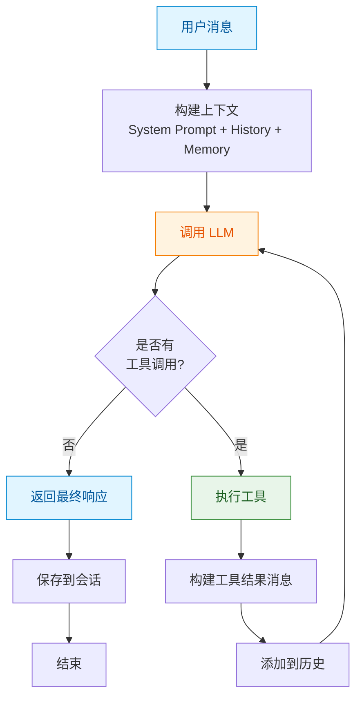
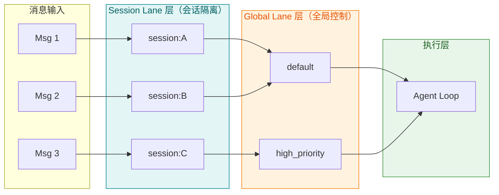
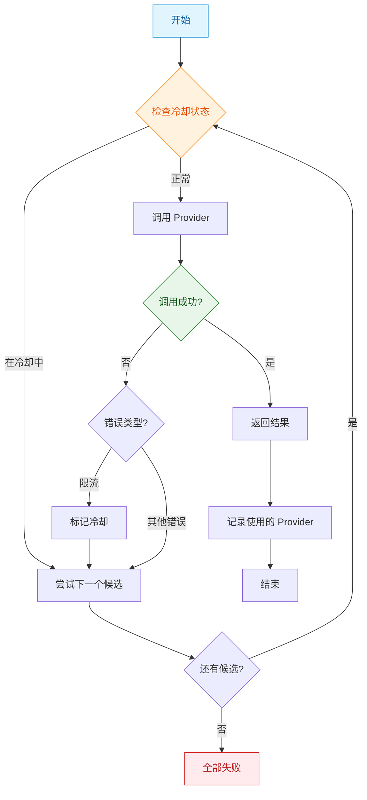
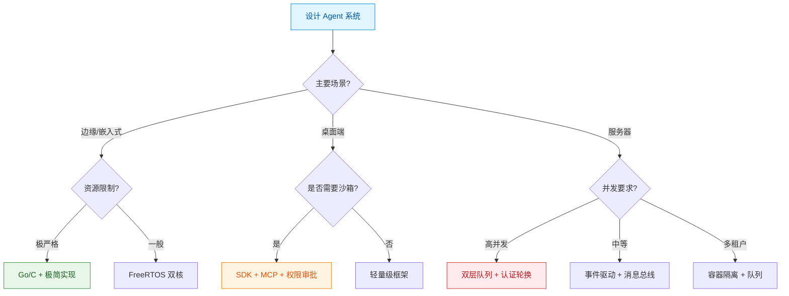

## 引言

在上一篇文章中，我们探讨了智能体架构与编排的基本模式：FanOut、Sequential、MapReduce 三种编排范式，以及 ReAct、Plan、Reflection 等单 Agent 思考模式。这些框架为我们理解多智能体系统提供了理论基础。

然而，理论需要实践的检验。本文选取了九大具有代表性的开源 Agent 项目进行深度分析，每个项目都代表了不同的技术选型和设计理念。通过分析这些项目的核心设计，我们希望提炼出可复用的设计模式，为智能体架构设计提供实践参考。

## 参评项目概览

| 项目 | 技术栈 | 核心定位 | 代码规模 |
|------|--------|---------|---------|
| **OpenClaw** | TypeScript | 商业级多通道 Agent 平台 | ~430K 行 |
| **PicoClaw** | Go | 超轻量级嵌入式 Agent | ~50K 行 |
| **Nanobot** | Python | 超轻量级个人 AI 助手 | ~4K 行 |
| **ZeroClaw** | Rust | 高性能安全 Agent 运行时 | ~50K 行 |
| **MimiClaw** | C / FreeRTOS | 嵌入式 ESP32-S3 Agent | ~8K 行 |
| **LobsterAI** | Electron / React | 桌面端 AI 助手 + 沙箱 | ~50K 行 |
| **TinyClaw** | TypeScript | 多通道 Agent 服务器 + 团队协作 | ~30K 行 |
| **NanoClaw** | TypeScript | 容器化 Agent + Skills 引擎 | ~20K 行 |
| **IronClaw** | Rust | 企业级 Agent + WASM 工具 | ~100K 行 |

## 一、Agent 核心循环：九种实现路径

Agent 循环是智能体的核心引擎，决定了单 Agent 如何与 LLM 交互、如何执行工具调用。九大项目采用了不同的实现策略，展现出丰富的设计多样性。

### 1.1 核心设计对比

| 项目 | 循环类型 | 最大迭代 | 并发模型 | 容错机制 | 核心特色 |
|------|---------|---------|---------|---------|---------|
| **OpenClaw** | ReAct + 流式 | 可配置 | 双层队列隔离 | 认证轮换 | 商业级并发控制 |
| **PicoClaw** | ReAct | 可配置 | sync.WaitGroup | Fallback Chain | 资源极简优化 |
| **Nanobot** | ReAct | 20 | asyncio.Queue | 消息总线 | 事件驱动解耦 |
| **ZeroClaw** | ReAct | 可配置 | 串行 | Provider 能力声明 | 类型安全 |
| **MimiClaw** | ReAct | 10 | FreeRTOS 双核 | 编译时配置 | 嵌入式资源管理 |
| **LobsterAI** | Claude SDK | SDK 控制 | MCP 协议 | 权限审批 | SDK 复用 + 安全 |
| **TinyClaw** | ReAct | 可配置 | 事件驱动 | 团队路由 | 多 Agent 协作 |
| **NanoClaw** | ReAct | 可配置 | 容器隔离 | 消息队列 | 容器化隔离 |
| **IronClaw** | ReAct | 可配置 | Job 并发池 | Cost Guard | WASM 沙箱 + 成本控制 |

从上表可以看出，虽然所有项目都基于 ReAct 循环，但在**并发模型**和**容错机制**上展现了显著的多样性：

- **并发模型**：从最简单的串行执行到复杂的多层队列隔离，体现了不同场景下的性能权衡
- **容错机制**：从冷却重试到认证轮换，体现了不同系统对可靠性的要求差异

### 1.2 ReAct 循环的通用模式

尽管实现各异，所有项目的 ReAct 循环都遵循相同的核心逻辑：



### 1.3 并发模型设计模式

九大项目的并发模型可以归纳为四种设计模式：

| 模式 | 代表项目 | 适用场景 | 优势 | 劣势 |
|------|---------|---------|------|------|
| **串行执行** | ZeroClaw | 简单场景、单用户 | 实现简单、无并发问题 | 吞吐量低 |
| **同步原语** | PicoClaw | 中小规模应用 | 简单可靠 | 灵活性有限 |
| **事件驱动** | Nanobot, TinyClaw | 高并发、多通道 | 响应式、高吞吐 | 复杂度较高 |
| **多层队列** | OpenClaw | 商业级、多租户 | 会话隔离 + 全局控制 | 实现复杂 |

**双层队列隔离**（OpenClaw）是一种值得深入分析的架构模式：



这种设计巧妙地解决了多租户场景下的两个核心问题：
1. **会话隔离**：同一会话内串行执行，保证状态一致性
2. **全局控制**：跨会话的并发控制，防止资源竞争

### 1.4 容错机制设计模式

九大项目的容错机制同样展现出丰富的多样性：

| 模式 | 代表项目 | 触发条件 | 恢复策略 | 适用场景 |
|------|---------|---------|---------|---------|
| **Fallback Chain** | PicoClaw | 调用失败 | 尝试下一个候选 | 多 Provider 场景 |
| **认证轮换** | OpenClaw | 限流/认证失败 | 切换 API Key | 高频调用、限流 |
| **错误隔离** | 多个项目 | 工具执行失败 | 隔离到单个子任务 | 防止级联失败 |
| **权限审批** | LobsterAI | 危险操作 | 用户确认 | 桌面端、安全敏感 |
| **Cost Guard** | IronClaw | Token 超限 | 拒绝/降级 | 成本敏感场景 |

**Fallback Chain** 机制（PicoClaw）的完整流程：



### 1.5 资源消耗对比

不同技术栈对资源的需求差异巨大：

| 指标 | OpenClaw | PicoClaw | Nanobot | 典型比例 |
|------|----------|----------|---------|---------|
| **语言** | TypeScript | Go | Python | - |
| **内存** | >1GB | <10MB | >100MB | 100:1:10 |
| **启动** | >500s | <1s | >30s | 500:1:30 |
| **硬件成本** | Mac Mini $599 | $10 硬件 | ~$50 | 60:1:5 |

这个对比揭示了一个关键洞察：**技术栈的选择对资源消耗有数量级的影响**。对于边缘计算或成本敏感的场景，Go 和 Rust 的轻量级实现具有明显优势。

## 二、上下文管理：从溢出到压缩

长程任务的上下文管理是所有智能体系统面临的共同挑战。九大项目采用了不同的策略来应对这个问题。

### 2.1 上下文压缩策略

| 项目 | 触发条件 | 压缩策略 | 存储位置 |
|------|---------|---------|---------|
| **PicoClaw** | 检测到 context_length_exceeded | 强制压缩 + 重试 | 会话存储 |
| **Nanobot** | 达到 Token 阈值 | 摘要化历史 | 消息总线 |
| **OpenClaw** | 自动检测 | 渐进式摘要 | 编排器 |
| **IronClaw** | 用户配置 | 可配置压缩策略 | 混合存储 |

**PicoClaw 的自动检测与恢复机制**是一个精妙的设计：当 LLM 返回 context_length_exceeded 错误时，系统自动触发压缩并重试，对上层完全透明。

### 2.2 上下文压缩对比

| 压缩策略 | 代表项目 | 适用场景 | 优势 | 劣势 |
|---------|---------|---------|------|------|
| **摘要压缩** | 多个项目 | 信息密集型任务 | 保留关键信息 | 可能丢失细节 |
| **滑动窗口** | Nanobot | 长对话 | 简单可靠 | 丢失早期上下文 |
| **分层存储** | OpenClaw | 复杂任务 | 按需加载 | 实现复杂 |
| **分类提取** | 部分 Agent | 结构化信息 | 可检索 | 需要预定义类别 |

### 2.3 存储架构设计

存储架构的选择直接影响系统的性能和可扩展性：

| 项目 | 存储策略 | 检索方式 | 适用场景 |
|------|---------|---------|---------|
| **OpenClaw** | 双层分离（AGFS + Vector） | 语义检索 | 大规模知识库 |
| **IronClaw** | 混合搜索（全文 + 向量） | RRF 融合 | 多模态检索 |
| **Nanobot** | 文件系统优先 | 文件路径 | 轻量级应用 |
| **NanoClaw** | 容器卷 | 本地文件系统 | 隔离执行 |

**双层存储架构**（OpenClaw）的核心理念是：将文件内容（AGFS）和向量索引分离存储，既保证了检索效率，又避免了向量数据库存储大文件的性能问题。

## 三、工具系统：从基础到沙箱

工具系统是 Agent 与外部世界交互的桥梁。九大项目在工具系统的设计上展现了从简单到复杂的演进路径。

### 3.1 工具定义格式对比

| 项目 | 工具格式 | 解析方式 | 安全特性 |
|------|---------|---------|---------|
| **Nanobot** | OpenAI 标准 | Pydantic 验证 | 基础验证 |
| **ZeroClaw** | 多格式支持（6种） | 优先级解析 | 拒绝降级解析 |
| **LobsterAI** | MCP 协议 | SDK 处理 | 权限审批 |
| **IronClaw** | WASM 模块 | 沙箱执行 | 能力限制 |

**ZeroClaw 的六种工具调用格式解析**是一个独特的安全设计：

| 优先级 | 格式类型 | 示例 |
|--------|---------|------|
| 1 | OpenAI 风格 JSON | `{"tool_calls": [{"function": {"name": "shell", "arguments": {...}}}]}` |
| 2 | MiniMax XML 风格 | `<invoke name="shell">...</invoke>` |
| 3 | XML 标签风格 | `<tool_call>{"name": "shell"...} ` |
| 4 | Markdown 代码块 | ` ```tool_call {...} ``` ` |
| 5 | XML 属性风格 | `<invoke name="shell"><parameter name="command">ls</parameter></invoke>` |
| 6 | GLM 行格式 | `shell/command>ls` |

关键安全设计：代码明确拒绝"任意 JSON 降级解析"，只有明确标记的格式才会被解析，防止提示词注入攻击。

### 3.2 沙箱与隔离机制

| 项目 | 隔离机制 | 隔离粒度 | 适用场景 |
|------|---------|---------|---------|
| **IronClaw** | WASM 沙箱 | 单工具级别 | 不可信工具 |
| **NanoClaw** | 容器隔离 | Agent 级别 | 多租户环境 |
| **LobsterAI** | 桌面沙箱 | 应用级别 | 桌面端应用 |
| **OpenClaw** | 无（信任内部） | - | 受控环境 |

**WASM 沙箱**（IronClaw）提供了最细粒度的隔离：每个工具在独立的 WASM 实例中运行，通过 capability-based permissions 控制其访问权限，即使工具被攻破也无法影响宿主系统。

### 3.3 权限与安全

| 项目 | 权限机制 | 控制粒度 | 适用场景 |
|------|---------|---------|---------|
| **LobsterAI** | 用户审批 | 单次操作 | 桌面端、交互式 |
| **IronClaw** | 能力声明 | 工具级别 | 自动化场景 |
| **OpenClaw** | 认证轮换 | 会话级别 | API 限流场景 |

## 四、扩展机制：从插件到 MCP

Agent 系统的可扩展性决定了其生命周期。九大项目采用了不同的扩展机制设计。

### 4.1 扩展机制对比

| 项目 | 扩展机制 | 定义方式 | 热加载 | 适用场景 |
|------|---------|---------|--------|---------|
| **Nanobot** | Skills | Markdown | 是 | 快速迭代 |
| **TinyClaw** | Skills 引擎 | TypeScript | 部分支持 | 生产环境 |
| **LobsterAI** | MCP 协议 | 标准 JSON | 是 | 跨语言集成 |
| **IronClaw** | WASM 插件 | WAT/WASM | 是 | 高性能工具 |

### 4.2 MCP 协议集成

**MCP（Model Context Protocol）** 是一个新兴的工具调用标准化协议，LobsterAI 是早期采用者之一。

MCP 的优势：
- **标准化**：统一的工具定义和调用格式
- **跨语言**：不绑定特定编程语言
- **可组合**：多个 MCP 服务可以组合使用
- **安全**：内置权限控制机制

## 五、性能与成本优化

在资源受限的场景下，性能和成本优化至关重要。

### 5.1 资源优化策略

| 项目 | 优化维度 | 具体措施 | 效果 |
|------|---------|---------|------|
| **PicoClaw** | 内存 | Go 零分配、预分配缓冲 | <10MB |
| **MimiClaw** | CPU | 双核分工（I/O vs 计算） | 实时响应 |
| **Nanobot** | 上下文 | 滑动窗口限制 | 稳定内存 |
| **IronClaw** | 成本 | Cost Guard 预估 | 可控成本 |

### 5.2 成本控制机制

| 机制 | 实现方式 | 控制粒度 | 效果 |
|------|---------|---------|------|
| **Cost Guard** | 预估 + 阈值 | 任务级别 | 防止超额 |
| **认证轮换** | 冷却 + 轮换 | API Key 级别 | 避免限流 |
| **容器超时** | 空闲回收 | 容器级别 | 资源释放 |

## 六、设计模式提炼

通过分析九大项目，我们提炼出以下可复用的设计模式：

### 6.1 核心设计模式

| 模式 | 问题 | 解决方案 | 代表项目 |
|------|------|---------|---------|
| **双层队列隔离** | 多租户并发控制 | Session Lane + Global Lane | OpenClaw |
| **Fallback Chain** | 服务可靠性 | 冷却 + 轮换 | PicoClaw |
| **消息总线解耦** | 通道扩展性 | asyncio.Queue | Nanobot |
| **WASM 沙箱** | 工具安全 | 能力限制 + 隔离执行 | IronClaw |
| **MCP 协议** | 工具标准化 | 统一接口 | LobsterAI |

### 6.2 架构选型决策树



## 七、总结

通过对九大开源 Agent 项目的分析，我们可以梳理出一些共性认知。

所有项目都基于 ReAct 循环，尽管实现各异——这说明 ReAct 已经成为当前最成熟的 Agent 思考模式。但并发模型和容错机制的选择高度场景化：从串行执行到多层队列隔离，从简单的 Fallback Chain 到复杂的认证轮换，没有"最好"的方案，只有"最适合"的选择。

几个值得注意的趋势：MCP 协议的兴起表明工具调用正在走向标准化；WASM 沙箱从实验性特性逐渐变为生产必需；Go 和 Rust 的轻量级实现开始在边缘场景占据优势。

从设计实践来看，几个原则值得参考：从简单开始逐步增加复杂度（Nanobot 的 4000 行实现证明了这一点）；根据场景选择技术栈（PicoClaw 选择 Go 换来了数量级的资源优化）；容错机制应该作为基础设施而非附加功能考虑。

---

**智能体设计思考系列**，下一篇将继续探讨 Agent 系统的其他核心主题。

**参考资料**：

- [OpenClaw - GitHub](https://github.com/Anthropic/claude-code)
- [PicoClaw - GitHub](https://github.com/TxnStyle/picoclaw)
- [Nanobot - GitHub](https://github.com/HKUDS/nanobot)
- [IronClaw - GitHub](https://github.com/nearai/ironclaw)
- [MCP Protocol - Spec](https://modelcontextprotocol.io/)

本文内容基于对九大开源 Agent 项目的源码分析和架构总结。
