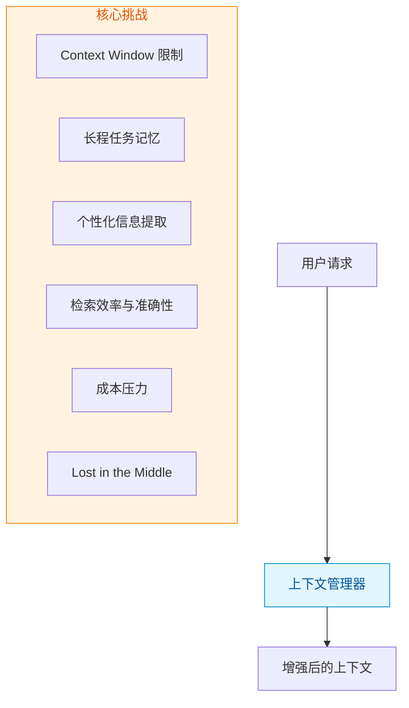
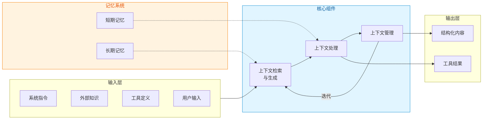
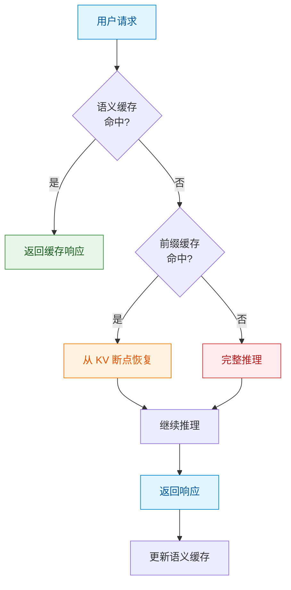
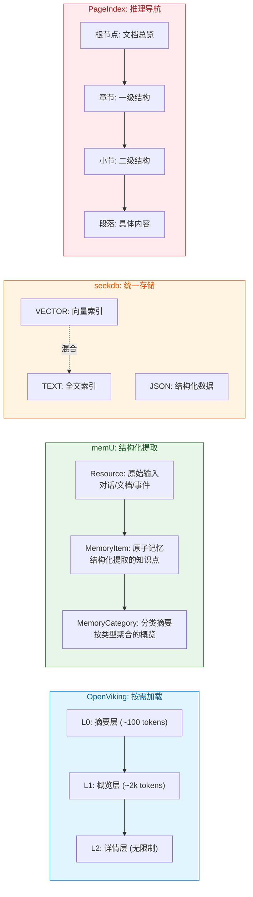
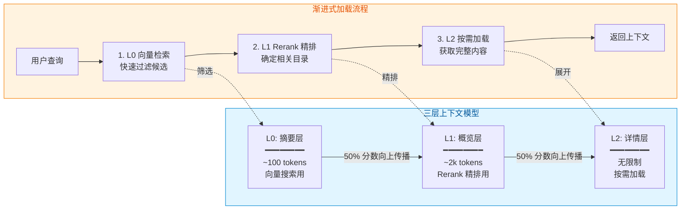
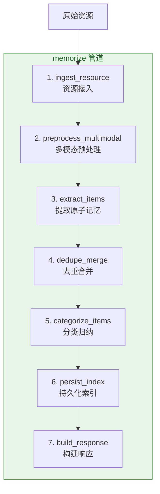
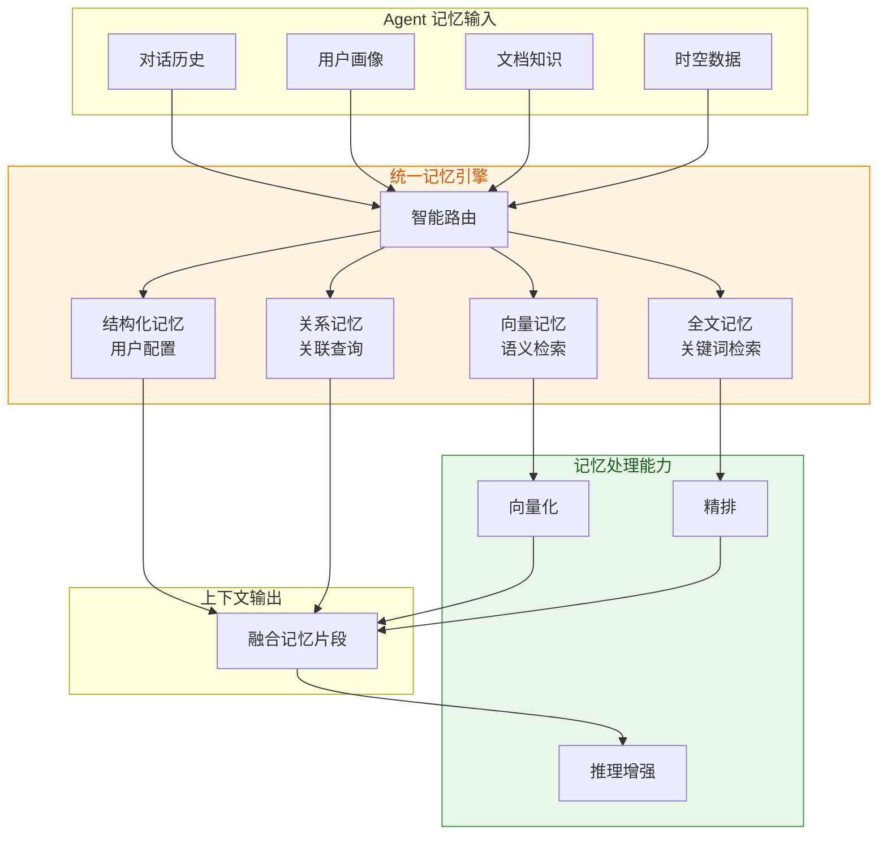
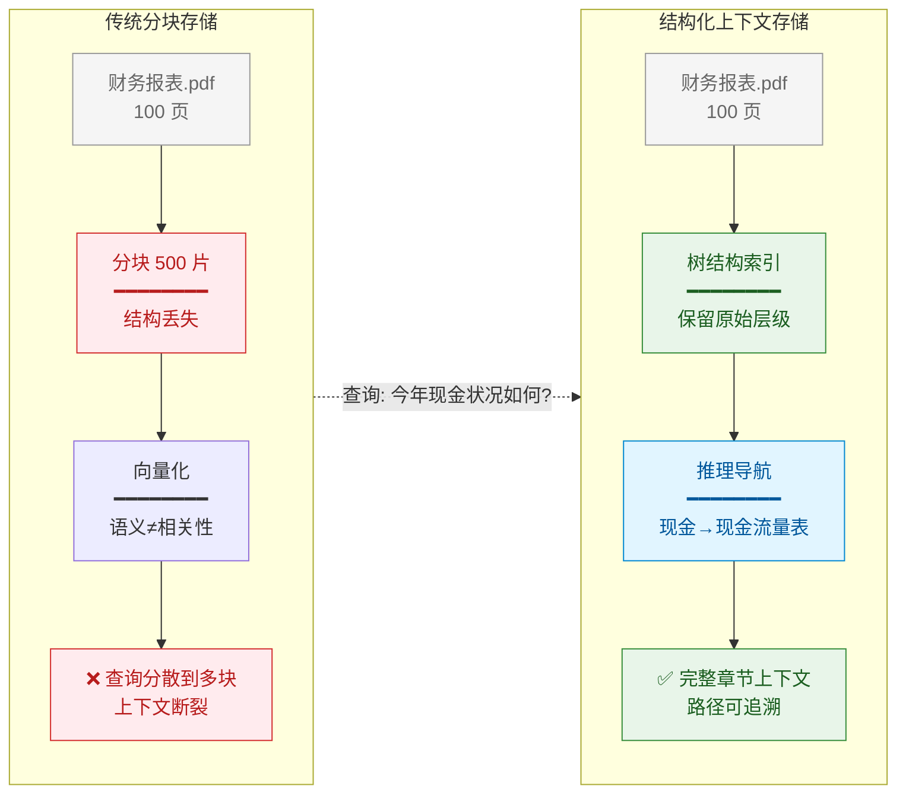

## 引言

在智能体系统中，如何让 Agent 记住"上下文"是长程任务的核心挑战。无论是多轮对话、复杂任务规划，还是个性化服务，都离不开上下文管理的支持。

本文首先介绍 AWS 提出的上下文工程框架，然后深入分析四个专注于上下文管理的开源项目：**OpenViking**、**memU**、**seekdb** 和 **PageIndex**。通过对这些项目的对比分析，我们希望提炼出可复用的设计模式。

## 一、核心挑战

在智能体系统中，上下文管理面临几个核心挑战：

**Token 限制**是根本问题。随着对话轮次增加，上下文会迅速膨胀，最终超出 LLM 的 Context Window 限制。

**成本压力**同样严峻。大模型定价与 token 数量成正比，过长的上下文会大幅增加每次调用成本。

**长程任务**需要 Agent 记住任务目标、已完成的步骤、遇到的问题等。这些信息无法仅靠当前对话轮次来维护。

**"Lost in the Middle"** 问题容易被忽视：过长的上下文不仅会降低模型响应速度，还可能导致模型在大量信息中迷失方向，无法准确捕捉关键信息。

## 二、业界框架：AWS 上下文工程

AWS 在其 Agentic AI 实践经验系列中提出了系统的**上下文工程**框架，将上下文管理分为三个核心组件：

### 2.1 对话管理模式

AWS 提供了三种对话管理模式：

| 模式 | 策略 | 适用场景 |
|------|------|---------|
| **NullConversationManager** | 完全保留 | 短期交互、调试环境 |
| **SlidingWindow** | 时间优先，保持最近 N 轮 | 客服机器人、问答系统 |
| **Summarizing** | 智能压缩，保留摘要 | 代码助手、项目管理 |

### 2.2 提示词缓存：从 Prefix 到 Semantic

提示词缓存是降低 LLM 调用成本和延迟的关键技术，主要分为两类：

**前缀缓存（Prefix Caching）**：利用 LLM 推理过程中 KV Cache 的复用机制。当多个请求共享相同的前缀（如系统提示、工具定义）时，模型可以跳过重复计算，直接使用缓存的注意力状态。

**语义缓存（Semantic Caching）**：针对相似的查询直接返回缓存响应，跳过推理过程。统计数据表明，约 31% 的 LLM 查询在语义上是相似的，这意味着大量请求可以通过缓存直接响应。

**服务厂商的实现对比**：

| 厂商 | 缓存类型 | 成本降低 | 延迟降低 | 特点 |
|------|---------|---------|---------|------|
| **Anthropic Claude** | 自动 Prefix | 90% | 85% | 手动标记缓存边界 |
| **OpenAI** | 自动 Prefix | 50% | - | 自动检测重复前缀 |
| **Google Gemini** | 自动 Prefix | - | - | 系统提示自动缓存 |
| **AWS Bedrock** | 手动 Prefix | 90% | - | 明确的缓存控制 |

**开源方案**：对于自部署场景，vLLM 提供了自动前缀缓存功能，基于 PagedAttention 算法实现 KV Cache 的精细化管理。GPTCache 则提供了完整的语义缓存解决方案，实测可减少 68.8% 的 API 调用。

**应用模式**：

- **对话应用**：缓存系统提示和对话规则，每次仅需处理新增的用户消息
- **RAG 应用**：检索到的文档片段可以缓存，相同问题的后续调用直接返回
- **Agent 工作流**：工具定义和 Agent 角色描述天然适合前缀缓存

**适合缓存的内容**：
- 系统提示（Agent 角色定义）
- 工具定义和描述
- 对话历史摘要
- RAG 检索到的知识上下文

## 三、四个项目的核心思路对比

| 项目 | 核心理念 | 分层策略 | 检索方式 | 适用场景 |
|------|---------|---------|---------|---------|
| **OpenViking** | 按需加载 | L0/L1/L2 三级上下文 | 意图分析 + 层级检索 | Agent 对话上下文 |
| **memU** | 结构化提取 | Resource/Item/Category | 分类召回 + 充足性检查 | 用户长期记忆 |
| **seekdb** | 统一记忆存储 | 向量/全文/结构化 | SQL 混合查询 | 多模态记忆管理 |
| **PageIndex** | 结构化上下文 | Tree Index 文档树 | LLM 推理导航 | 专业文档知识库 |

### 3.1 分层策略对比

### 3.2 OpenViking：渐进式加载

OpenViking 的核心创新是 **L0/L1/L2 三层信息模型**，每层有不同的 Token 限制和用途：

| 层级 | Token 限制 | 用途 | 生成方式 |
|------|-----------|------|---------|
| **L0** | ~100 tokens | 向量搜索、快速相关性判断 | LLM 自动生成 |
| **L1** | ~2k tokens | Rerank 精排、内容导航 | LLM 自动生成 |
| **L2** | 无限制 | 完整内容、按需加载 | 原始内容 |

**分数传播机制**：子目录的分数会向父目录传播（50% embedding 分数 + 50% 父目录分数），利用目录层级关系实现渐进式细化。这使得即使 L0 的摘要不够精确，也能通过 L1 的概览信息进行校正。

### 3.3 memU：结构化记忆提取

memU 提出"**Memory as File System**"的理念，通过 memorize 管道将原始资源转化为结构化的记忆：

memU 支持多种记忆类型：用户画像、用户偏好、知识要点、技能经验、关键事件、行为模式、工具使用等。

### 3.4 seekdb：多模态记忆的统一存储

Agent 的长期记忆往往是多模态的：对话历史需要向量检索，用户配置是结构化数据，文档知识需要全文索引。传统方案需要多个存储系统，seekdb 提供了**统一存储引擎**的思路。

**多模型统一存储**的价值在于：同一份记忆可以用不同方式检索。比如用户的问题既可以通过语义相似度匹配（向量），也可以通过关键词匹配（全文），在单次查询中融合多种检索方式。

**数据库内处理记忆**：embedding、reranking 等记忆处理操作在存储引擎内部完成，减少了数据搬运，提升了上下文构建效率。

### 3.5 PageIndex：专业文档的上下文组织

Agent 处理长文档（财务报表、法律文书、技术手册）时，面临一个根本问题：**如何组织文档的上下文结构，使其支持精确检索？**

传统 RAG 方案将文档分块后向量化，但**分块 = 结构丢失**。PageIndex 提供了另一种思路：**保留文档的原始层级结构，用推理来导航上下文**。

**上下文组织方式对比**：

| 维度 | 向量分块 | PageIndex |
|-----|---------|----------|
| **记忆结构** | 扁平向量列表 | 保留原始层级 |
| **信息损失** | 分块导致上下文断裂 | 完整章节上下文 |
| **检索方式** | 语义相似度 | 推理导航 |
| **可追溯性** | 难以定位来源 | 路径清晰可追溯 |
| **专业文档效果** | 一般 | 优秀（98.7% 准确率） |

PageIndex 支撑的 Mafin 2.5 金融文档分析系统在 FinanceBench 基准上达到 **98.7% 准确率**，证明保留文档结构对于专业长文档的记忆检索至关重要。

## 四、检索策略横向对比

| 维度 | OpenViking | memU | seekdb | PageIndex |
|------|-----------|------------|---------|----------|
| **第一阶段** | 意图分析 | 分类召回 | 向量+全文混合 | Tree 导航 |
| **检索方式** | 层级递归 + 分数传播 | 向量相似度 / LLM 评估 | SQL 组合查询 | LLM 推理 |
| **精排机制** | Rerank 可选 | 充足性检查 | Rerank 函数 | 推理验证 |

## 五、场景选型建议

| 场景 | 推荐方案 | 理由 |
|------|---------|------|
| **Agent 对话上下文** | OpenViking | 分层加载控制 Token，按需扩展上下文 |
| **用户长期记忆** | memU | 结构化提取对话/行为，自动分类管理 |
| **多模态记忆存储** | seekdb | 统一存储向量、全文、结构化记忆 |
| **专业文档知识库** | PageIndex | 保留文档结构，推理式检索 |
| **对话历史 + 长期记忆** | OpenViking + memU | 前者管理即时上下文，后者持久化关键信息 |
| **个性化服务** | memU | 多维度记忆分类（画像、偏好、行为模式） |

## 六、核心设计洞察

通过 AWS 框架和四个开源项目的分析，我们可以提炼出几个核心洞察。

**上下文是"认知带宽"的竞争**

LLM 的上下文窗口就像人类的短期记忆——容量有限，且**注意力是稀缺资源**。当我们向 LLM 输入更多信息时，不仅增加了计算成本，更重要的是**分散了注意力**。

上下文管理的本质不是"塞更多信息"，而是**在有限带宽内最大化有效信息密度**。

**按需加载 vs 预加载的权衡**

| 策略 | 理念 | 代价 | 适用场景 |
|------|------|------|---------|
| **按需加载** | 需要时再获取 | 首次调用延迟 | Agent 上下文 |
| **预加载** | 提前准备 | 存储成本 | 长期记忆 |

现代 Agent 还可以有第三种选择——**渐进式加载**：先加载高层摘要，根据需要逐层深入。

**语义相似度 ≠ 相关性**

PageIndex 的出现给我们的重要启示：向量相似度不等于相关性。选择检索方式本质上是选择**让谁做判断**——向量检索让数学模型判断，推理式检索让 LLM 判断。在成本允许的情况下，**混合检索**往往是最优解。

**未来的方向**

从当前的趋势看，上下文管理正在向以下方向发展：

1. **模型化**：用 LLM 本身来做上下文优化决策（而非规则）
2. **持久化**：从临时缓存到真正的长期记忆
3. **多模态**：不仅处理文本，还处理图像、视频、代码
4. **一体化**：存储、检索、推理在统一引擎内完成

## 总结

上下文管理是智能体系统的核心挑战之一。通过对 OpenViking、memU、seekdb 和 PageIndex 的分析，我们观察到四种不同的设计思路：

**OpenViking** 采用"按需加载"策略，通过 L0/L1/L2 三层信息模型实现高效的上下文检索。**memU** 采用"结构化提取"策略，通过 memorize 管道将原始资源转化为结构化的记忆。**seekdb** 采用"一体化引擎"策略，在数据库内部完成向量、全文、关系数据的统一管理。**PageIndex** 采用"推理式检索"策略，用文档结构 + LLM 推理替代向量检索，在专业文档理解场景表现出色。

四种思路各有适用场景，实际上可以结合使用：用 seekdb 做统一存储，用 memU 做持久化和结构化，用 OpenViking 做按需检索，用 PageIndex 处理专业长文档。

---

**参考资料**：

- [上下文工程 - AWS 官方博客](https://aws.amazon.com/cn/blogs/china/agentic-ai-infrastructure-practice-series-nine-context-engineering/)
- [OpenViking](https://github.com/bytebase/openviking)
- [memU](https://github.com/memu-ai/memu)
- [seekdb](https://github.com/oceanbase/seekdb)
- [PageIndex](https://github.com/VectifyAI/PageIndex)
