## 引言

在智能体系统中，如何让 Agent 记住"上下文"是长程任务的核心挑战。无论是多轮对话、复杂任务规划，还是个性化服务，都离不开上下文管理的支持。

本文首先介绍业界主流的**上下文工程框架**，包括 AWS 提出的三层架构（检索与生成 → 处理 → 管理），以及对话管理模式和 Prompt Cache 等实践技术。随后深入分析四个专注于上下文管理的开源项目：**OpenViking**、**memU**、**seekdb** 和 **PageIndex**。通过对这四个项目的深度解析，我们希望提炼出上下文管理的最佳实践。

## 一、上下文管理的核心挑战

在智能体系统中，上下文管理面临几个核心挑战：

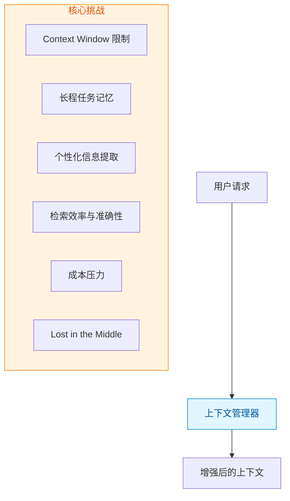

**Token 限制**是根本问题。随着对话轮次增加，上下文会迅速膨胀，最终超出 LLM 的 Context Window 限制。传统的做法是简单地截断历史，但这种方法会丢失重要的上下文信息。

**成本压力**同样严峻。大模型定价与 token 数量成正比，过长的上下文会大幅增加每次调用成本。在高频交互场景下，这种成本累积会变得不可忽视。

**长程任务**需要 Agent 记住任务目标、已完成的步骤、遇到的问题等。这些信息无法仅靠当前对话轮次来维护。

**个性化信息**如用户偏好、历史交互等，需要长期记忆，并在合适的时机被检索出来。

**"Lost in the Middle"** 问题容易被忽视：过长的上下文不仅会降低模型响应速度，还可能导致模型在大量信息中迷失方向，无法准确捕捉关键信息。

## 二、上下文工程框架

AWS 在其 Agentic AI 实践经验系列中提出了系统的**上下文工程**框架，将上下文管理分为三个核心组件。

### 2.1 框架概览

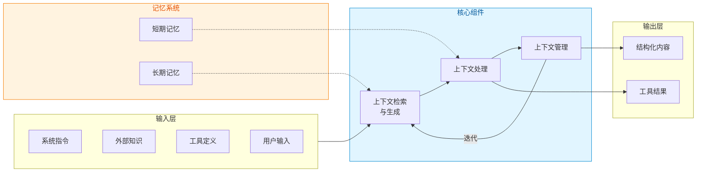

### 2.2 上下文检索与生成

对应 RAG 系统的核心功能，解决"**信息源适配**"的问题：

- **提示词工程**：基于 CLEAR 原则（简练性、逻辑性、明确性、适应性、反思性）构建结构化指令
- **外部知识检索**：动态连接知识图谱、数据库等外部信源
- **动态上下文组装**：从多源信息中筛选相关内容

**Self-RAG 机制**：智能决策检索时机，按需触发外部知识获取。

### 2.3 上下文处理

对应记忆系统和工具集成推理，解决"**信息精炼**"的问题：

- **长序列优化**：状态空间模型（SSM）维持线性复杂度，位置插值技术（如 LongRoPE）扩展上下文窗口
- **自优化机制**：Self-Refine 框架实现闭环修正，长思维链（LongCoT）扩展推理深度
- **多模态融合**：视觉提示生成器（VPG）将图像映射至文本空间
- **结构化集成**：注入逻辑验证框架，输出可验证的上下文

### 2.4 上下文管理

对应多智能体系统，解决"**信息组织与调度**"的问题：

- **分层记忆设计**：借鉴虚拟内存概念，分层存储
- **动态记忆机制**：基于艾宾浩斯遗忘曲线，智能调整信息留存强度
- **压缩技术**：先进压缩算法将长文本提炼为四分之一的精华内容
- **记忆容量约束**：解决 Transformer 平方级计算开销问题

### 2.5 对话管理模式

AWS Strands Agents 提供了三种对话管理模式：

| 模式 | 策略 | 适用场景 |
|------|------|---------|
| **NullConversationManager** | 完全保留 | 短期交互、调试环境、研究 |
| **SlidingWindowConversationManager** | 时间优先，保持最近 N 轮 | 客服机器人、问答系统 |
| **SummarizingConversationManager** | 智能压缩，保留摘要 | 代码助手、项目管理 |

```python
# SlidingWindow 模式示例
from strands.agent.conversation_manager import SlidingWindowConversationManager

conversation_manager = SlidingWindowConversationManager(
    window_size=20,  # 保持最近20轮对话
    should_truncate_results=True
)
```

### 2.6 Prompt Cache 技术

AWS Bedrock 的 Prompt Cache 通过缓存重复使用的提示内容显著降低成本：

- **缓存 token 收费比标准输入 token 低 90%**
- **Agent 任务中输入输出比例 100:1 场景下，成本节省尤为突出**
- **共享计算优化整体系统性能**

```python
# 设置缓存检查点
system=[
    {"text": "你是一个专业的代码助手..."},
    {"cachePoint": {"type": "default"}}  # 永久缓存
]
```

**适合缓存的内容**：
- 系统提示（Agent 角色定义）
- 工具定义
- 对话历史摘要
- RAG 检索到的知识上下文

## 三、OpenViking：上下文数据库

### 2.1 核心理念

OpenViking 创新性地将上下文管理抽象为数据库，采用分层加载策略。其核心思想是：**不是把所有信息都塞进 Context Window，而是按需加载最相关的信息**。

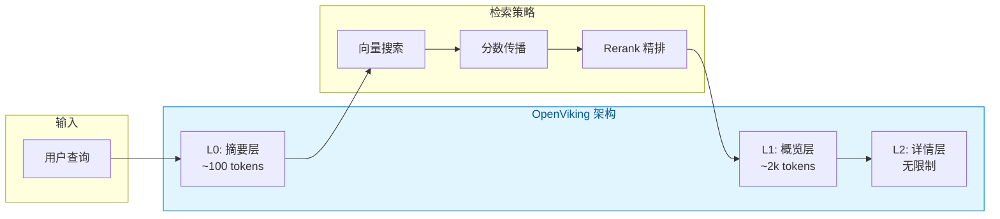

### 2.2 L0/L1/L2 三层信息模型

| 层级 | Token 限制 | 用途 | 生成方式 |
|------|-----------|------|---------|
| **L0** | ~100 tokens | 向量搜索、快速相关性判断 | LLM 自动生成 |
| **L1** | ~2k tokens | Rerank 精排、内容导航 | LLM 自动生成 |
| **L2** | 无限制 | 完整内容、按需加载 | 原始内容 |

**关键设计**：子目录的 L0 会被自动聚合到父目录的 L1 中，形成自底向上的信息汇总。

```python
# 信息层级结构示例
viking://resources/docs/
├── .abstract.md          # L0: ~100 tokens
├── .overview.md          # L1: ~1k tokens  
├── .relations.json       # 关联关系
├── oauth.md              # L2: 完整内容
├── jwt.md                # L2: 完整内容
└── api-keys.md           # L2: 完整内容
```

### 2.3 两阶段检索架构

OpenViking 的检索分为两个阶段：

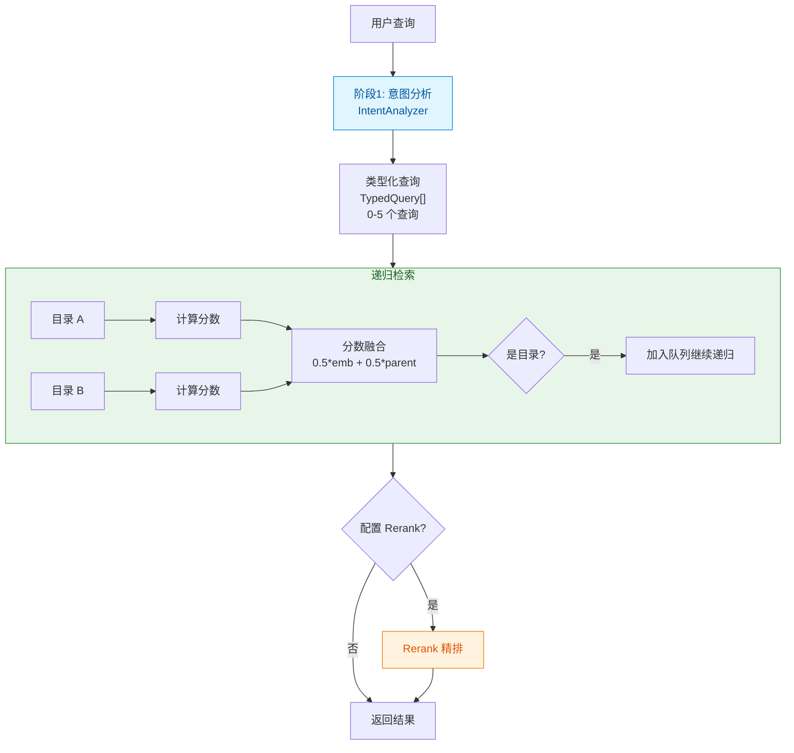

### 2.4 分数传播机制

这是 OpenViking 最独特的设计：**利用目录结构信息进行分数传播**。

```python
# 核心算法：子目录分数向父目录传播
for r in results:
    # 50% embedding 分数 + 50% 父目录分数
    final_score = 0.5 * embedding_score + 0.5 * parent_score
    
    if final_score > threshold:
        collected.append(r)
        
        # 目录节点继续递归搜索
        if not r.is_leaf:
            heapq.heappush(dir_queue, (r.uri, final_score))
```

这种设计的优势：
- **利用结构信息**：目录层级关系本身就是一种语义组织
- **渐进式细化**：从粗粒度到细粒度，逐层深入
- **效率与准确性的平衡**：L0 快速过滤，L1 导航，L2 按需加载

## 四、memU：Memory as File System

### 3.1 核心理念

memU 提出了"**Memory as File System**"的理念，将记忆系统抽象为文件系统结构。与 OpenViking 不同，memU 更注重记忆的持久化和结构化提取。

**四层持久化架构**：

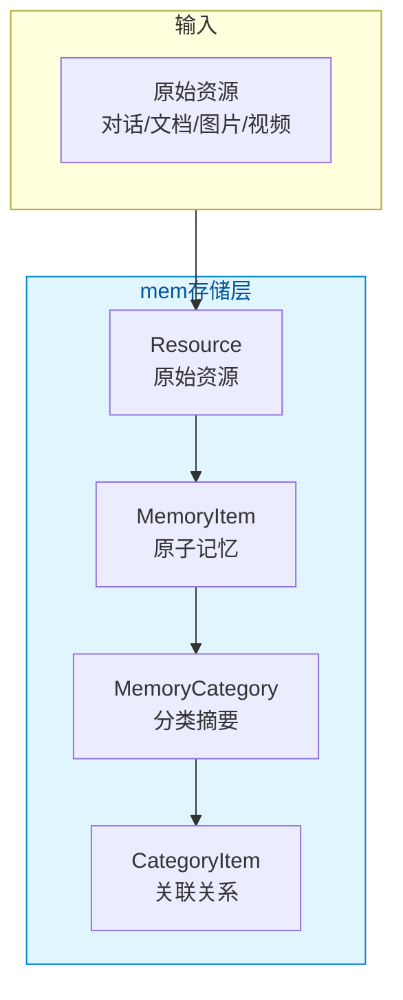

| 层级 | 说明 | 示例 |
|------|------|------|
| **Resource** | 原始资源 | 对话记录、文档、图片、视频 |
| **MemoryItem** | 提取的原子记忆 | 用户偏好、关键事件、知识要点 |
| **MemoryCategory** | 分类主题摘要 | "用户画像"、"技术栈"、"项目经验" |
| **CategoryItem** | 记忆-分类关联 | 某条记忆属于哪个分类 |

### 3.2 memorize 管道：记忆提取流程

memU 的核心是 **memorize** 管道，将原始资源转化为结构化的记忆：

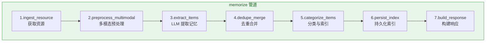

**每个步骤的详细职责**：

| 步骤 | 功能 | 关键能力 |
|------|------|---------|
| ingest_resource | 获取本地/远程资源 | IO |
| preprocess_multimodal | 文本/图片/视频/音频预处理 | LLM + Vision |
| extract_items | LLM 提取结构化记忆 | LLM |
| dedupe_merge | 去重合并（当前为占位） | - |
| categorize_items | 分类 + 向量化 | DB + Vector |
| persist_index | 更新分类摘要 | DB + LLM |
| build_response | 构建返回结果 | - |

**代码实现**（`src/memu/app/memorize.py`）：

```python
def _build_memorize_workflow(self) -> list[WorkflowStep]:
    steps = [
        WorkflowStep(
            step_id="ingest_resource",
            role="ingest",
            handler=self._memorize_ingest_resource,
            requires={"resource_url", "modality"},
            produces={"local_path", "raw_text"},
            capabilities={"io"},
        ),
        WorkflowStep(
            step_id="preprocess_multimodal",
            role="preprocess",
            handler=self._memorize_preprocess_multimodal,
            requires={"local_path", "modality", "raw_text"},
            produces={"preprocessed_resources"},
            capabilities={"llm"},
        ),
        WorkflowStep(
            step_id="extract_items",
            role="extract",
            handler=self._memorize_extract_items,
            requires={"preprocessed_resources", "memory_types", ...},
            produces={"resource_plans"},
            capabilities={"llm"},
        ),
        # ... more steps
    ]
    return steps
```

### 3.3 记忆类型与提取

memU 支持多种记忆类型，每种类型都有专门的提取 Prompt：

```python
# 支持的记忆类型
DEFAULT_MEMORY_TYPES = [
    "profile",      # 用户画像
    "preferences",  # 用户偏好
    "knowledge",    # 知识要点
    "skills",       # 技能经验
    "events",       # 关键事件
    "behavior",     # 行为模式
    "tool",         # 工具使用
]
```

**提取过程**：

```python
async def _generate_text_entries(self, *, resource_text: str, ...):
    # 并行调用 LLM 提取不同类型的记忆
    prompts = [
        self._build_memory_type_prompt(mtype, resource_text, categories_str)
        for mtype in memory_types
    ]
    
    # 并行执行
    tasks = [client.chat(prompt_text) for prompt_text in valid_prompts]
    responses = await asyncio.gather(*tasks)
    
    # 解析结构化输出
    return self._parse_structured_entries(memory_types, responses)
```

### 3.4 retrieve 管道：记忆检索流程

memU 提供两种检索模式：

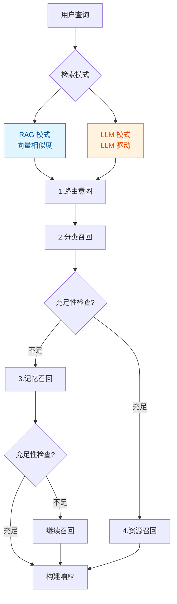

| 模式 | 原理 | 适用场景 |
|------|------|---------|
| **RAG** | 向量相似度召回 | 结构化记忆、快速匹配 |
| **LLM** | LLM 评估相关性 | 复杂推理、需要理解语义 |

**关键特性**：
- **充足性检查**：每个阶段可以提前终止，避免过度检索
- **分层召回**：分类 → 记忆 → 资源，层层递进

### 3.5 Workflow 引擎与拦截器

memU 的另一个亮点是 **Workflow 引擎**，支持灵活的工作流编排：

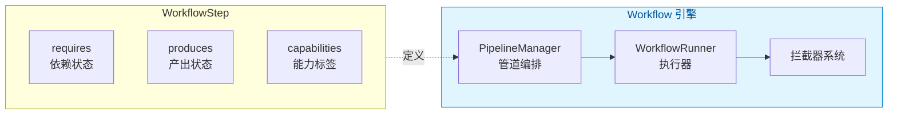

**拦截器系统**：

```python
# 两类拦截器
class InterceptorSystem:
    # 1. 工作流步骤拦截器
    workflow_step_interceptors: Before/After/OnError
    
    # 2. LLM 调用拦截器
    llm_call_interceptors: Before/After/OnError
```

### 3.6 存储后端选择

memU 支持多种存储后端：

| 后端 | 向量搜索 | 特点 |
|------|---------|------|
| **InMemory** | 内存 | 开发测试用 |
| **SQLite** | 暴力搜索 | 轻量便携 |
| **PostgreSQL** | pgvector | 生产环境首选 |

```python
def build_database(database_config):
    match database_config.metadata_store.provider:
        case "inmemory":
            return InMemoryDatabase()
        case "sqlite":
            return SQLiteDatabase()
        case "postgres":
            return PostgresDatabase()
```

## 五、seekdb：AI 原生搜索数据库

### 4.1 核心理念

seekdb 是 OceanBase 团队推出的 **AI 原生搜索数据库**，其核心理念是：**在数据库内部完成 AI 工作流**，而非将 AI 能力作为外部组件叠加。

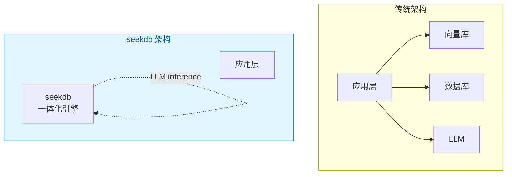

### 4.2 多模型统一存储

seekdb 的最大特点是 **多模型统一**：关系型、向量、文本、JSON、GIS 都存储在同一个引擎中。

| 数据类型 | 存储方式 | 索引方式 |
|---------|---------|---------|
| **向量** | `VECTOR(dimension)` | HNSW / VSAG |
| **全文** | `TEXT` + FULLTEXT INDEX | IK 分词器 |
| **结构化** | 标准 SQL 类型 | B+Tree |
| **JSON** | JSON 类型 | 原生支持 |
| **GIS** | GEO 类型 | R-Tree |

```sql
-- 创建支持多种索引的表
CREATE TABLE articles (
    id INT PRIMARY KEY,
    title TEXT,
    content TEXT,
    embedding VECTOR(384),
    metadata JSON,
    location GEO,
    FULLTEXT INDEX idx_fts(content) WITH PARSER ik,
    VECTOR INDEX idx_vec (embedding) WITH(DISTANCE=l2, TYPE=hnsw, LIB=vsag)
) ORGANIZATION = HEAP;
```

### 4.3 混合检索能力

seekdb 支持在单条 SQL 中组合向量搜索、全文搜索和关系查询：

```sql
-- 混合检索示例
SELECT 
    title,
    content,
    l2_distance(embedding, '[query_embedding]') AS vector_distance,
    MATCH(content) AGAINST('keywords' IN NATURAL LANGUAGE MODE) AS text_score
FROM articles
WHERE MATCH(content) AGAINST('keywords' IN NATURAL LANGUAGE MODE)
ORDER BY vector_distance APPROXIMATE
LIMIT 10;
```

这种设计对 Agent 的意义：
- **减少数据流转**：无需在多个系统间同步数据
- **一致性保证**：ACID 事务支持
- **降低延迟**：一体化执行计划优化

### 4.4 数据库内 AI 能力

seekdb 另一个亮点是 **AI Inside**——在数据库内部完成 embedding、reranking、LLM 推理：

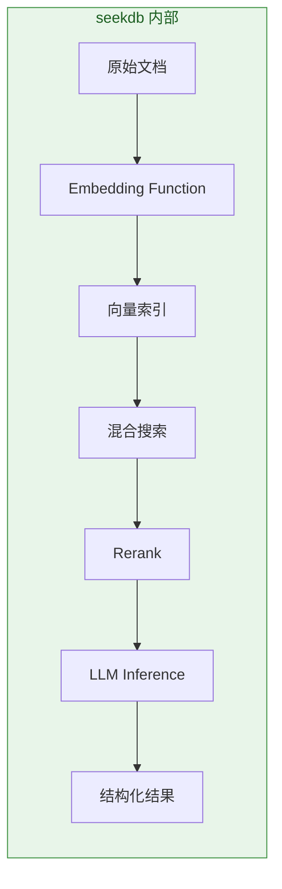

**Python SDK 示例**：

```python
import pyseekdb
from pyseekdb import DefaultEmbeddingFunction

# 创建 Collection（自动生成 embedding）
collection = client.create_collection(
    name="my_collection",
    embedding_function=DefaultEmbeddingFunction()
)

# 添加文档（自动 embedding）
collection.add(
    ids=["id1", "id2"],
    documents=["文档内容1", "文档内容2"],
    metadatas=[{"category": "tech"}, {"category": "finance"}]
)

# 查询（自动向量化 + 检索）
results = collection.query(
    query_texts="人工智能技术",
    n_results=3
)
```

### 4.5 对 Agent 上下文管理的价值

seekdb 为 Agent 提供的上下文管理能力：

| 能力 | 说明 | 优势 |
|-----|------|-----|
| **统一存储** | 向量 + 文本 + 关系一体化 | 简化架构 |
| **混合检索** | 向量 + 全文 + 关系组合查询 | 更精准的检索 |
| **内嵌 AI** | embedding/rerank 在 DB 内完成 | 降低延迟 |
| **嵌入式部署** | 单节点、嵌入式模式 | 适合边缘 Agent |

## 六、PageIndex：无向量推理式 RAG

### 5.1 核心理念

PageIndex 提出了一个根本性的问题：**为什么检索一定要用向量相似度？**

传统 RAG 依赖向量相似度，但 **相似度 ≠ 相关性**。对于专业文档（财务报表、法律文书、技术手册），需要的是**推理能力**，而非简单的语义相似。

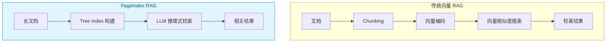

PageIndex 的核心创新：
1. **无需向量数据库**：用文档结构 + LLM 推理替代向量检索
2. **无需 Chunking**：保留文档自然章节结构
3. **推理式检索**：模拟人类专家阅读文档的方式

### 5.2 Tree Index 结构

PageIndex 将文档转化为类似"目录"的树结构：

```jsonc
{
  "title": "Financial Report 2024",
  "node_id": "0001",
  "start_index": 1,
  "end_index": 50,
  "summary": "2024年度财务报告...",
  "nodes": [
    {
      "title": "Executive Summary",
      "node_id": "0002",
      "start_index": 1,
      "end_index": 5,
      "summary": "高管摘要..."
    },
    {
      "title": "Financial Stability",
      "node_id": "0006",
      "start_index": 21,
      "end_index": 22,
      "summary": "美联储金融稳定性分析...",
      "nodes": [
        {
          "title": "Monitoring Financial Vulnerabilities",
          "node_id": "0007",
          "start_index": 22,
          "end_index": 28,
          "summary": "金融脆弱性监控..."
        }
      ]
    }
  ]
}
```

### 5.3 推理式检索流程

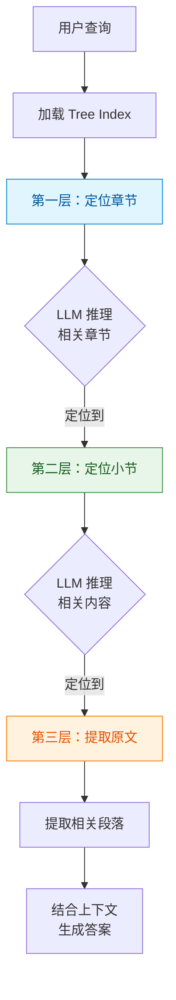

**与传统向量检索的关键区别**：

| 维度 | 向量 RAG | PageIndex |
|-----|---------|----------|
| **检索方式** | 相似度匹配 | 推理导航 |
| **索引结构** | 向量列表 | 树结构 |
| **Chunking** | 需要（信息损失） | 不需要（保留原结构） |
| **可解释性** | 低（近似匹配） | 高（推理路径可追溯） |
| **专业文档效果** | 一般 | 优秀 |

### 5.4 Mafin 2.5 案例

PageIndex 支撑的 **Mafin 2.5** 金融文档分析系统，在 FinanceBench 基准上达到 **98.7% 准确率**，显著超越传统向量 RAG。

### 5.5 对 Agent 上下文管理的价值

PageIndex 为 Agent 提供的独特价值：

| 能力 | 说明 | 适用场景 |
|-----|------|---------|
| **专业文档理解** | 推理式检索适合财务报表、法律文书 | 金融分析、法律顾问 |
| **无需向量库** | 降低部署复杂度 | 轻量级 Agent |
| **保留原文结构** | 不损失上下文信息 | 长文档理解 |
| **可解释性强** | 检索路径清晰 | 需要引用来源的场景 |

## 七、设计模式提炼

### 6.1 分层策略对比

| 项目 | 分层策略 | 加载方式 | 适用场景 |
|------|---------|---------|---------|
| **OpenViking** | L0/L1/L2 | 按需加载 | Agent 上下文检索 |
| **memU** | Resource/Item/Category | 管道提取 | 长期记忆存储 |
| **seekdb** | 向量/全文/关系统一 | 混合检索 | 多模态数据管理 |
| **PageIndex** | Tree Index | 推理导航 | 专业长文档理解 |

### 6.2 检索策略对比

| 维度 | OpenViking | memU | seekdb | PageIndex |
|------|-----------|------------|---------|----------|
| **第一阶段** | 意图分析 | 分类召回 | 向量+全文混合 | Tree 导航 |
| **检索方式** | 层级递归 + 分数传播 | 向量相似度 / LLM 评估 | SQL 组合查询 | LLM 推理 |
| **精排** | Rerank 可选 | 充足性检查 | Rerank 函数 | 推理验证 |

### 6.3 存储架构对比

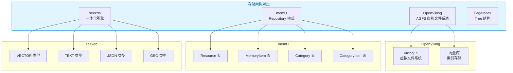

## 八、实践建议

### 7.1 场景选型

| 场景 | 推荐方案 | 理由 |
|------|---------|------|
| **Agent 上下文** | OpenViking | 分层加载控制 Token 消耗 |
| **长期记忆存储** | memU | 结构化提取、分类管理 |
| **多模态数据管理** | seekdb | 向量+全文+关系一体化 |
| **专业长文档理解** | PageIndex | 推理式检索、无需向量 |
| **对话历史管理** | 两者结合 | OpenViking 检索 + memU 持久化 |
| **个性化服务** | memU | 六分类记忆、用户画像 |

### 7.2 工程实践

1. **分层加载的临界点**：建议在 Context 达到 50% 时开始考虑加载外部记忆
2. **记忆提取的时机**：对话结束后提取 vs 定期批量提取
3. **分类的设计**：根据业务场景设计分类体系，避免过多过细
4. **向量化策略**：选择合适的 embedding 模型，平衡效果与成本

### 7.3 注意事项

1. **提取质量依赖 LLM**：记忆提取的效果高度依赖 LLM 能力
2. **分类需要维护**：随着时间推移，分类体系需要迭代优化
3. **存储成本**：向量存储有成本，需要考虑保留策略
4. **隐私合规**：用户记忆涉及隐私，需要做好数据保护

## 九、相关项目分析

在之前的架构横评文章中，我们还分析了其他几个项目与上下文管理相关的特性：

| 项目 | 上下文管理策略 | 适用场景 |
|------|---------------|---------|
| **OpenClaw** | 双层压缩（截断 + LLM 摘要） | 多轮对话 |
| **Nanobot** | 环式缓冲 + JSONL 持久化 | 轻量级助手 |
| **PicoClaw** | 自动上下文压缩触发 | 超轻量部署 |
| **LobsterAI** | 六分类记忆系统 | 桌面应用 |
| **seekdb** | 向量+全文+关系混合存储 | 多模态数据管理 |
| **PageIndex** | Tree Index + 推理式检索 | 专业长文档 |

### 9.1 设计思考：上下文管理的本质

通过 AWS 框架和四个开源项目的分析，我们提炼出上下文管理的核心思考：

**思考一：上下文是"认知带宽"的竞争**

LLM 的上下文窗口就像人类的短期记忆——容量有限，且**注意力是稀缺资源**。当我们向 LLM 输入更多信息时，不仅增加了计算成本，更重要的是**分散了注意力**。

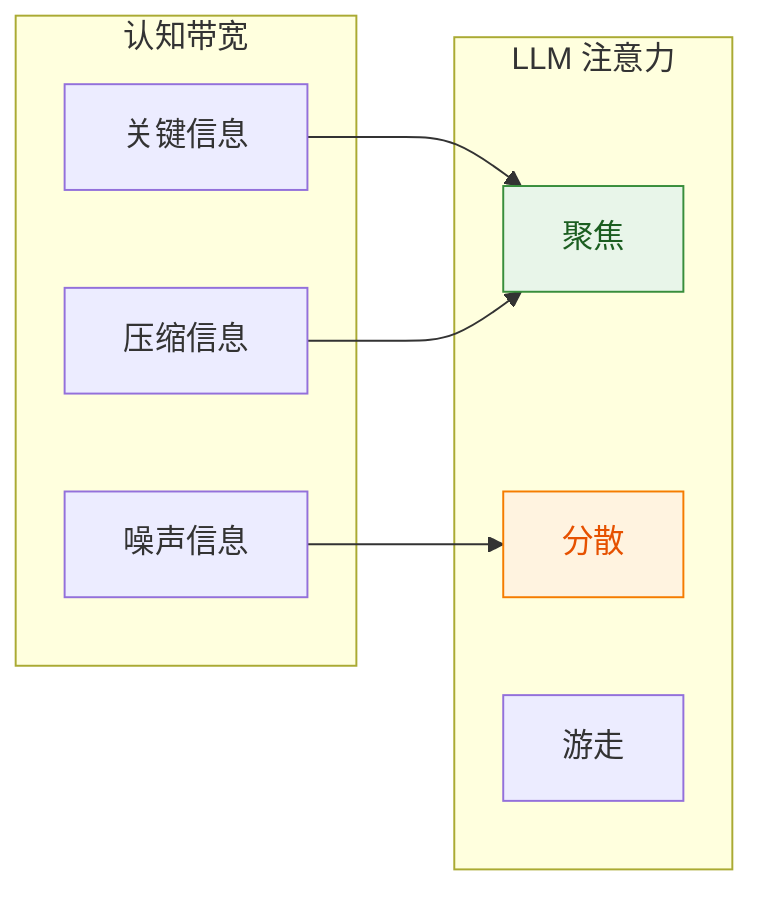

**核心洞察**：上下文管理的本质不是"塞更多信息"，而是**在有限带宽内最大化有效信息密度**。这是 AWS 强调"精准填充"的原因。

**思考二：按需加载 vs 预加载的哲学**

两种截然不同的策略：

| 策略 | 理念 | 代表项目 | 代价 |
|------|------|---------|------|
| **按需加载** | 需要时再获取 | OpenViking | 首次调用延迟 |
| **预加载** | 提前准备 | memU | 存储成本 |

**更深层的思考**：这反映了**时间空间权衡**的经典问题。但现代 Agent 还可以有第三种选择——**渐进式加载**：先加载高层摘要，根据需要逐层深入。

**思考三：记忆的层次结构**

借鉴计算机体系结构和认知心理学，上下文管理呈现清晰的层次结构：

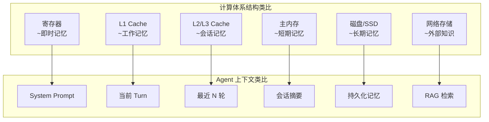

**核心洞察**：这种层次结构不是巧合，而是**信息访问频率与成本的必然映射**。越常用的信息，访问成本越低，但存储成本越高。

**思考四：为什么向量不是唯一答案？**

PageIndex 的出现给我们的重要启示：**语义相似度 ≠ 相关性**。

| 检索方式 | 原理 | 适用场景 |
|---------|------|---------|
| **向量检索** | 语义相似度匹配 | 开放域、模糊匹配 |
| **结构化检索** | 精确条件筛选 | 规则明确、数据结构化 |
| **推理式检索** | LLM 推理判断 | 专业文档、需要理解 |

**更深层的思考**：选择检索方式本质上是选择**让谁做判断**——向量检索让数学模型判断，推理式检索让 LLM 判断。在成本允许的情况下，**混合检索**往往是最优解。

**思考五：上下文工程的终极问题**

回到 AWS 提出的框架，我们认为上下文工程要回答的终极问题是：

> **"在每一次推理时，如何让 LLM 获得它真正需要的信息，同时不浪费任何注意力在无关内容上？"**

这个问题没有标准答案，但有一些指导原则：

1. **分层原则**：不是所有信息都需要在同一层
2. **按需原则**：只加载当前任务需要的
3. **压缩原则**：能用摘要就不用原文
4. **结构原则**：信息越结构化，检索越精准
5. **成本原则**：权衡计算成本和信息价值

**思考六：未来的方向**

从当前的趋势看，上下文管理正在向以下方向发展：

1. **模型化**：用 LLM 本身来做上下文优化决策（而非规则）
2. **Agent 化**：上下文优化本身变成一个 Agent
3. **持久化**：从临时缓存到真正的长期记忆
4. **多模态**：不仅处理文本，还处理图像、视频、代码

## 总结

上下文管理是智能体系统的核心挑战之一。通过对 OpenViking、memU、seekdb 和 PageIndex 的深度分析，我们观察到四种不同的设计思路：

**OpenViking** 采用"**按需加载**"的策略，通过 L0/L1/L2 三层信息模型和分数传播机制，实现高效的上下文检索。这种设计特别适合 Agent 场景，需要什么信息时再加载什么。

**memU** 采用"**结构化提取**"的策略，通过 memorize 管道将原始资源转化为结构化的记忆，再通过 retrieve 管道实现精准检索。这种设计更适合需要长期记忆积累的场景。

**seekdb** 采用"**一体化引擎**"的策略，在数据库内部完成向量、全文、关系数据的统一管理和混合检索。这种设计简化了 Agent 的数据层架构，降低了系统复杂度。

**PageIndex** 采用"**推理式检索**"的策略，用文档结构替代向量、用 LLM 推理替代相似度匹配。这种设计在专业文档理解场景表现出色，98.7% 的金融问答准确率印证了其有效性。

四种思路各有适用场景，实际上可以结合使用：用 seekdb 做统一存储，用 memU 做持久化和结构化，用 OpenViking 做按需检索，用 PageIndex 处理专业长文档。

---

**参考资料**：

- [上下文工程 - AWS 官方博客](https://aws.amazon.com/cn/blogs/china/agentic-ai-infrastructure-practice-series-nine-context-engineering/)
- [OpenViking](https://github.com/bytebase/openviking)
- [memU](https://github.com/memu-ai/memu)
- [seekdb](https://github.com/oceanbase/seekdb)
- [PageIndex](https://github.com/VectifyAI/PageIndex)
- [Building Effective Agents - Anthropic](https://www.anthropic.com/engineering/building-effective-agents)
- [How we built our multi-agent research system - Anthropic](https://www.anthropic.com/engineering/multi-agent-research-system)
