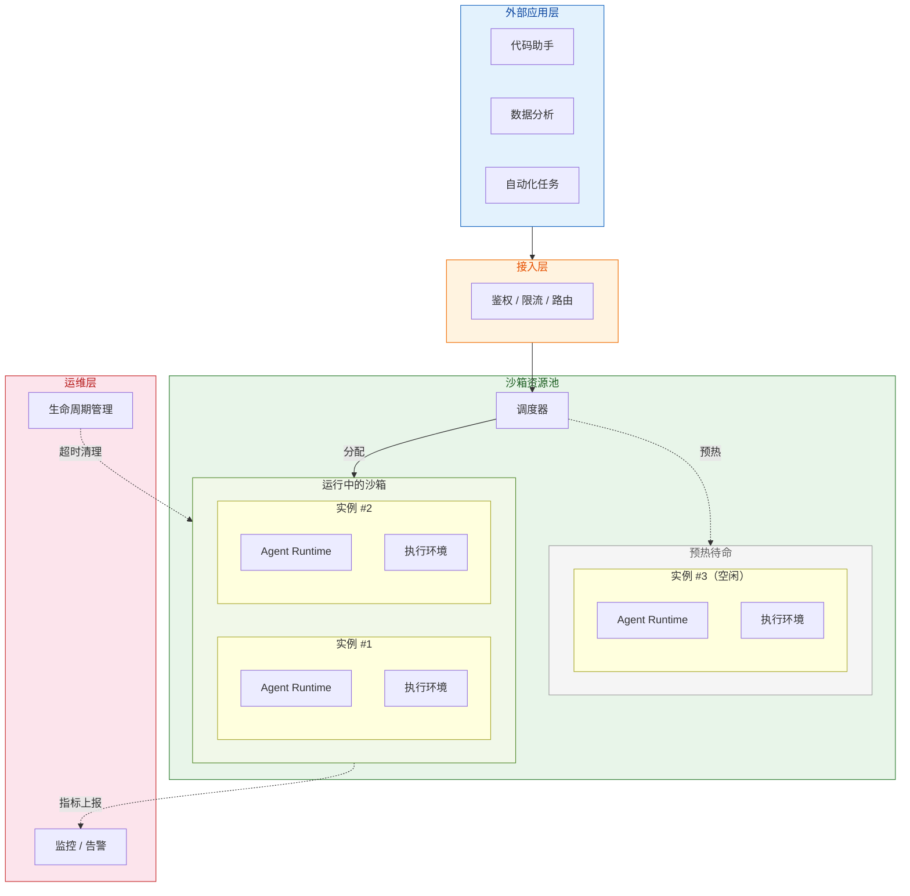
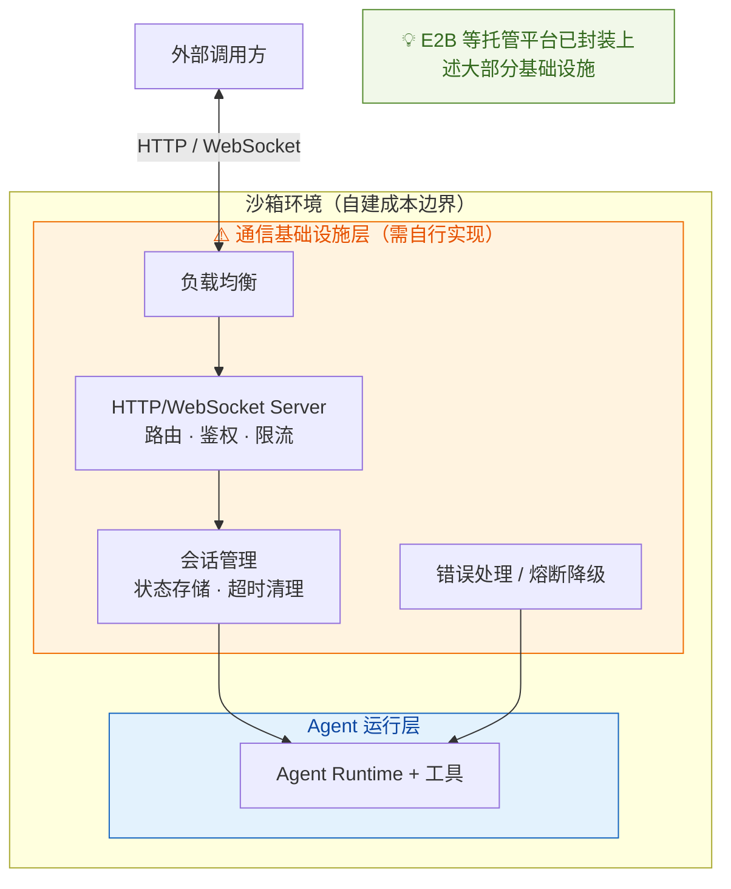
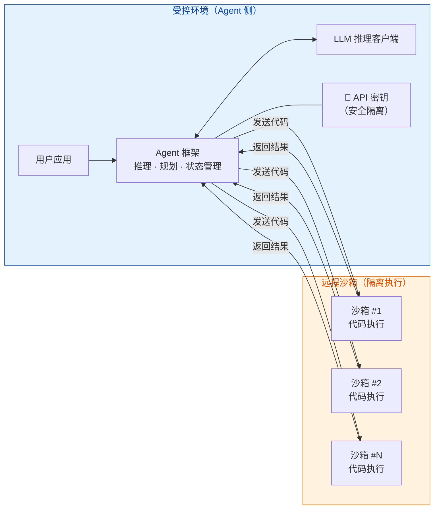
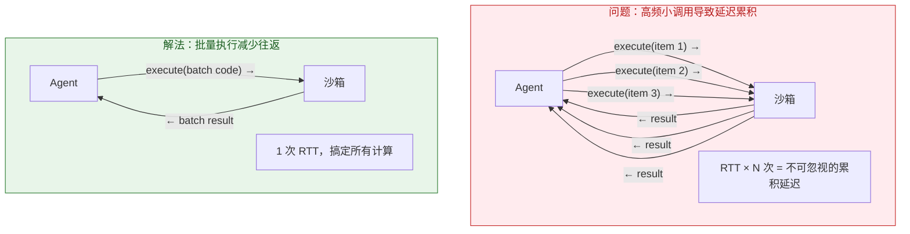
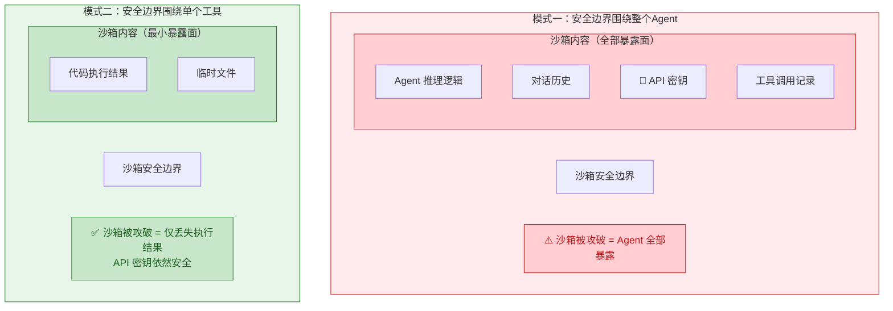
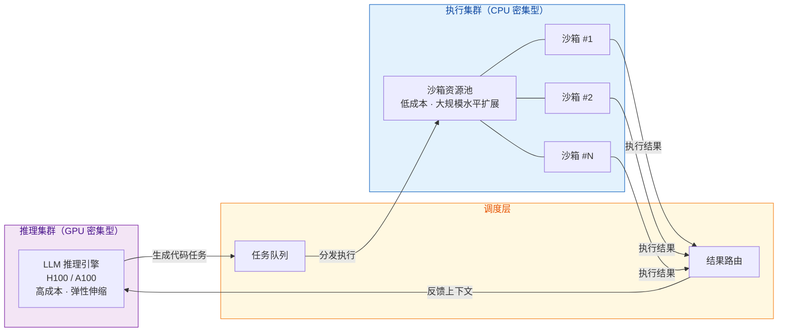
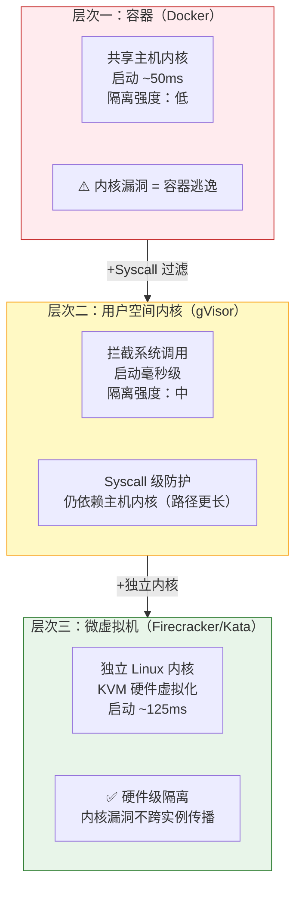
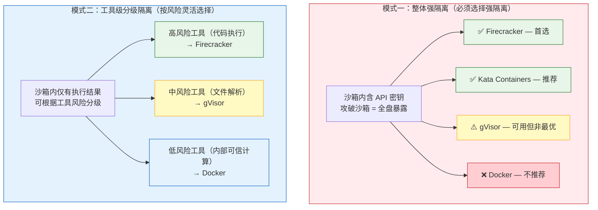
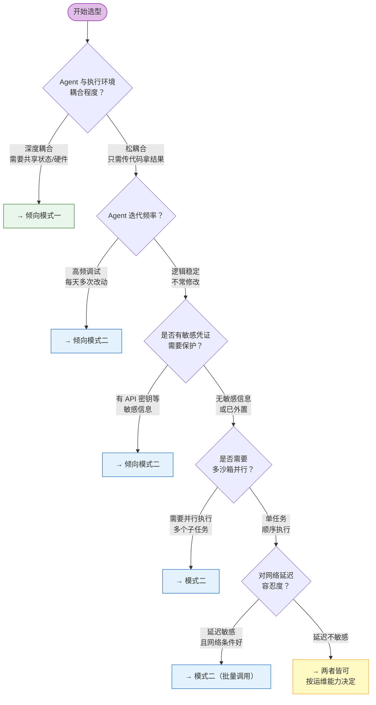

# Agent 与 Sandbox：一个被低估的架构决策

> **核心问题**：Agent 该运行在沙箱"里面"，还是把沙箱当作一个"工具"来调用？
>
> 这不是简单的技术选型，而是影响安全边界、迭代效率、运维成本的根本性架构决策。

---

## 为什么这个问题很重要

当 AI Agent 开始执行代码、操作文件系统、调用外部 API 时，架构师必须回答一个根本问题。

LangChain 创始人 Harrison Chase 将其清晰地归纳为两种模式，引发了社区的广泛讨论。本文将剖析这两种模式的本质差异、适用边界，以及背后的安全原理。

---

## 模式一：Agent IN Sandbox（Agent 运行在沙箱内部）

### 核心架构

整个 Agent 框架——包括代码、Prompt、依赖库——被打包进容器镜像，**在沙箱内部启动运行**。外部应用通过 HTTP 或 WebSocket 与沙箱内的 Agent 通信。



### 优势一：开发与生产环境完全一致

"在我机器上能跑"——这句话在 Agent IN Sandbox 模式下彻底消失。本地调试好的完整环境（依赖链、库版本、系统配置）直接打包成镜像部署到生产。

```dockerfile
FROM python:3.11

# Agent 框架与业务代码一体打包
RUN pip install langchain langchain-anthropic pandas numpy
COPY agent/ /app/agent/

EXPOSE 8080
CMD ["python", "/app/agent/server.py"]
```

### 优势二：适合"环境耦合型" Agent

有些 Agent 天然需要与执行环境深度绑定：

- **数据分析 Agent**：需要在同一进程内维护大型数据集的中间状态
- **科学计算 Agent**：需要直接访问 GPU 硬件加速
- **IDE 类 Agent**：需要持久化文件系统和长生命周期服务进程

对这类场景，Agent 与执行环境的边界本就模糊，**放在一起反而是更自然的设计**。

### 代价一：通信基础设施成本

沙箱内的 Agent 需要对外暴露 API，这意味着你必须自行构建并维护：



> E2B 等托管平台的核心价值正在于此——它们替你吸收了这层复杂度。如果自建，这些基础设施投入是真实且持续的。

### 代价二：API 密钥的安全困境（最棘手的问题）

这是模式一最本质的安全风险：**Agent 在沙箱内进行 LLM 推理，意味着 API 密钥必须注入沙箱。**

一旦沙箱被攻破，API 密钥随之暴露。

```python
# ❌ 风险场景：密钥注入沙箱，一旦逃逸即全盘暴露
ANTHROPIC_API_KEY = "sk-ant-xxx"  # 沙箱内可见

# ✅ 缓解方案：Agent 调用沙箱外部的推理代理服务
class LLMProxyClient:
    def call(self, prompt: str) -> str:
        # 推理服务运行在沙箱外的受控环境
        # 沙箱内只持有低权限的访问 Token，而非原始 API Key
        return requests.post(
            "https://internal-llm-proxy.company.com/v1/infer",
            json={"prompt": prompt},
            headers={"Authorization": f"Bearer {SHORT_LIVED_TOKEN}"}
        ).json()["completion"]
```

> 缓解手段：使用密钥库服务（E2B / Runloop 均在开发中）、短期临时凭证、或让推理调用经由沙箱外部的代理服务完成。

### 代价三：迭代周期变长

每次修改 Agent 逻辑，必须走完完整的镜像构建流程：

```
修改代码 → 重建镜像 → 推送仓库 → 重新部署 → 验证结果
```

在 Agent Prompt 工程高频调试阶段，这个流程会显著拖慢节奏。

---

## 模式二：Sandbox as Tool（沙箱作为工具）

### 核心架构

Agent 运行在本地或受控服务器。**沙箱只是 Agent 工具箱中的一个工具**——当需要执行不可信代码时，通过 API 调用远程沙箱，拿回结果，继续推理。



### 优势一：快速迭代，改完即生效

修改 Agent 逻辑无需任何镜像构建步骤：

```python
from langchain_anthropic import ChatAnthropic
from langchain_e2b import E2BSandbox
from langchain.agents import create_tool_calling_agent

# 沙箱只是工具列表中的一项
sandbox = E2BSandbox()
model = ChatAnthropic(model="claude-sonnet-4-20250514")
agent = create_tool_calling_agent(model, [sandbox], prompt)

# Agent 的 Prompt、逻辑、工具配置随时可改，直接生效
# 无需重建任何镜像
```

### 优势二：API 密钥天然隔离

这是模式二最核心的安全优势。密钥永远留在 Agent 侧（受控环境），远程沙箱中**只有代码和执行结果，零敏感凭证**。

```python
class Agent:
    def __init__(self):
        # API 密钥在受控环境中，从未离开这里
        self.client = Anthropic(api_key=os.getenv("ANTHROPIC_API_KEY"))
        self.sandbox = RemoteSandbox()

    def process(self, user_input: str):
        response = self.client.messages.create(...)  # LLM 推理在本地完成

        if self.needs_code_execution(response):
            code = self.extract_code(response)
            # 发给沙箱的只有"代码"，没有任何密钥
            result = self.sandbox.execute(code)
            return self.synthesize(result)
```

### 优势三：清晰的关注点分离

| 组件 | 职责 | 存储位置 |
|------|------|----------|
| 对话历史 | 用户交互记录 | Agent 侧 |
| 推理链 | Agent 思考过程 | Agent 侧 |
| 执行结果 | 代码运行输出 | 沙箱侧（临时） |
| 临时文件 | 中间数据 | 沙箱侧（临时） |

这种分离的实际价值：沙箱崩溃不会丢失 Agent 对话上下文；可以随时更换沙箱后端（E2B → Modal → 自建）而不影响核心逻辑。

### 优势四：原生支持多沙箱并行

```python
async def parallel_analysis(tasks: list[str]):
    # 为每个子任务独立分配沙箱，真正并行执行
    sandboxes = [E2BSandbox() for _ in tasks]
    results = await asyncio.gather(*[
        agent.analyze(task, sb) for task, sb in zip(tasks, sandboxes)
    ])
    for sb in sandboxes:
        sb.kill()
    return results
```

### 代价：网络延迟与有状态会话的复杂性

每次代码执行都需要跨越网络边界。这在高频、小粒度执行场景下会累积成显著延迟。



```python
# ❌ 低效：N 次网络往返
for i in range(100):
    result = sandbox.execute(f"process_item({i})")

# ✅ 高效：1 次网络往返
result = sandbox.execute("""
for i in range(100):
    process_item(i)
""")
```

对于有状态会话（Session），E2B、Modal 等平台支持在同一会话中共享变量、文件和已安装的依赖——但这同时引入了会话生命周期管理、超时策略、并发竞争等新的复杂性，需要仔细权衡。

---

## 安全边界：两种模式的本质差异

Witan Labs 的 Nuno Campos 提出了一个关键洞察：

> **在模式一下，Agent 的任何部分都不应拥有比 Bash 工具更多的权限。**

这句话揭示了两种模式安全设计的根本差异：



**模式二还能实现工具级的细粒度权限控制**，这是模式一做不到的：

```python
# 模式二：每个工具有独立的权限边界
class BashTool:
    def execute(self, command: str):
        # Bash 工具：禁止网络访问
        return self.sandbox.run(command, network_enabled=False)

class WebFetchTool:
    ALLOWED_DOMAINS = ["api.trusted.com"]

    def fetch(self, url: str):
        # Web 工具：仅允许白名单域名
        if not any(url.startswith(d) for d in self.ALLOWED_DOMAINS):
            raise PermissionError(f"域名未授权：{url}")
        return requests.get(url)

# Agent 同时持有两个工具，但权限完全隔离
tools = [BashTool(sandbox), WebFetchTool()]
```

---

## 前瞻：推理与执行的基础设施分化

Zo Computer 的 Ben Guo 提出了一个重要的前瞻观点：

> **未来 Agent 的推理过程可能需要运行在昂贵的 GPU 机器上，而代码执行的沙箱环境则完全不同。**

这种资源需求的天然差异，将推动基础设施的进一步分化：



**模式二天然适配这种分化**：GPU 集群负责推理，CPU 沙箱集群负责执行，两者通过 API 解耦，独立扩缩容。模式一则需要将推理和执行绑定在同一节点，资源配比必然产生浪费。

---

## 沙箱技术栈：隔离强度的三个层次

选对架构模式后，还需要选对底层沙箱技术。理解隔离强度的本质差异至关重要：



### 为什么 AI Agent 场景不能只用 Docker？

Docker 容器共享主机内核。LLM 生成的代码是完全不可预测的——一旦代码触发内核漏洞，整个宿主机暴露。这在 AI Agent 场景是不可接受的风险。

### 两种模式的技术选型差异



### 主流平台技术栈一览

| 平台 | 底层技术 | 适配模式 | 核心特点 |
|------|---------|---------|---------|
| **E2B** | Firecracker | 两种均支持 | 每个 Agent 独立微虚拟机，SDK 封装完善 |
| **Modal** | Firecracker | 模式二为主 | 专注函数执行，冷启动极快 |
| **Daytona** | 可配置 | 模式二 | 启动 <90ms，适合高频工具调用 |
| **Runloop** | 未公开 | 模式二 | 有状态会话，减少网络往返 |
| **AWS Lambda** | Firecracker | 模式二（Serverless） | 生态最成熟 |
| **Google Cloud Run** | gVisor | 模式二（容器化） | 容器接口，中等隔离 |

> 主流平台清一色选择 Firecracker 或 gVisor——这是 AI Agent 对安全强度要求的直接体现。

---

## 决策框架：如何选型



### 快速对照表

| 决策因素 | 倾向模式一 | 倾向模式二 |
|---------|-----------|-----------|
| **环境耦合** | 需要深度耦合、复杂共享状态 | 松耦合，只需代码执行结果 |
| **迭代速度** | 逻辑稳定，少量修改 | 高频迭代，频繁调试 Prompt |
| **安全敏感度** | 无 API 密钥等敏感信息 | 有敏感凭证，必须隔离 |
| **并发需求** | 单任务顺序执行 | 需要多沙箱并行处理 |
| **基础设施偏好** | 有团队自建运维通信层 | 希望最小化运维复杂度 |
| **未来演进** | 推理与执行保持同构 | 预期推理/执行资源解耦 |

---

## 代码实战：模式二的完整示例

```python
from langchain_anthropic import ChatAnthropic
from langchain_e2b import E2BSandbox
from langchain.agents import create_tool_calling_agent
from langchain import hub

# Step 1：沙箱作为工具实例化
sandbox = E2BSandbox()

# Step 2：Agent 在沙箱外部构建，完整保留推理控制权
model = ChatAnthropic(model="claude-sonnet-4-20250514")
prompt = hub.pull("hwchase17/openai-tools-agent")
agent = create_tool_calling_agent(model, [sandbox], prompt)

# Step 3：执行任务
result = agent.invoke({
    "messages": [{
        "role": "user",
        "content": "读取 /data/sales.csv，分析过去一年的销售趋势"
    }]
})

# 执行流程：
# 1. Agent 在本地规划任务（LLM 推理，密钥安全）
# 2. Agent 生成 Python 分析代码
# 3. 调用 E2B API，代码在远程沙箱执行
# 4. 沙箱返回执行结果
# 5. Agent 在本地基于结果继续推理，生成最终报告

# Step 4：用完即销毁
sandbox.stop()
```

---

## 结语：没有银弹，只有权衡

两种模式本质上是在不同维度间寻找平衡：

- **安全性 vs 开发敏捷性**
- **环境一致性 vs 关注点分离**
- **低延迟 vs 强隔离**
- **架构简单 vs 资源灵活**

对大多数团队的建议：

**① 从模式二开始**：更低的初始复杂度，更快速的验证周期，更安全的凭证隔离。

**② 观察瓶颈再决策**：如果网络延迟成为真实瓶颈，或者环境耦合需求明确出现，再考虑模式一。

**③ 选择支持两种模式的平台**（如 E2B），保留未来切换的灵活性。

> 不要过早优化，但也不要忽视架构选择的长远影响。在 AI Agent 快速演进的今天，保持架构的可调整性，往往比一开始就"选对"更重要。

---

## 参考资料

- [LangChain Founder Harrison Chase Explains Two Sandbox Architectures for AI Agents](https://medium.com/ai-engineering-trend/langchain-founder-harrison-chase-explains-two-sandbox-architectures-for-ai-agents-63de0d7dc42d)
- [How Manus Uses E2B to Provide Agents With Virtual Computers](https://e2b.dev/blog/how-manus-uses-e2b-to-provide-agents-with-virtual-computers)
- [E2B Documentation](https://e2b.dev/docs)
- [Agentic AI 基础设施实践 —— AWS 官方博客](https://aws.amazon.com/cn/blogs/china/)