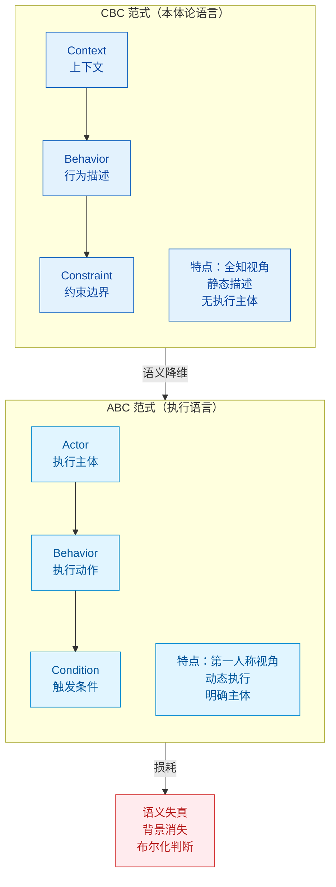
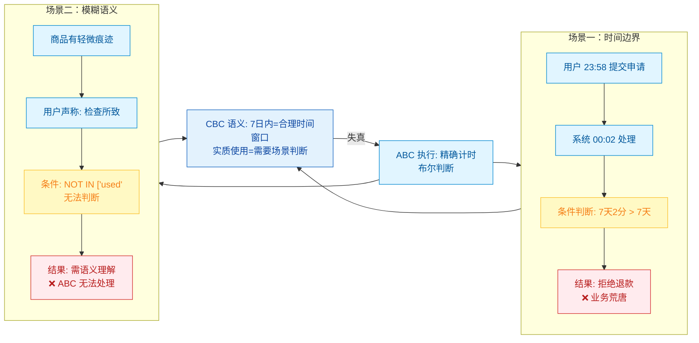
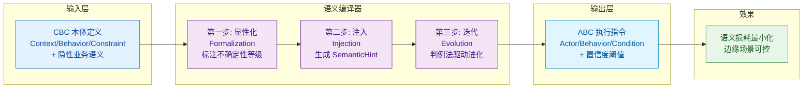
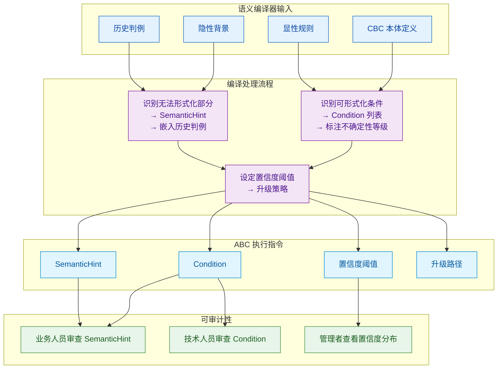
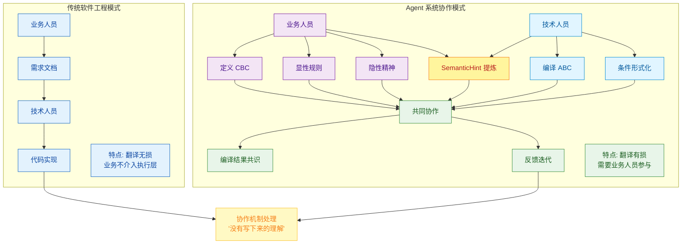

## 序：一个没人注意到的错误

在讨论 Agent 与领域本体的结合时，经常会默认一个前提：
如果系统已经拥有一套清晰的领域本体，那么 Agent 的行为就会更稳定、更符合业务语义。

*这个前提看起来是合理的。*

领域本体确实可以提供一套结构化描述：实体、关系以及业务约束，都可以通过明确的语义表达出来。从知识建模的角度看，它能够减少歧义，并为系统提供稳定的概念基础。

但在 Agent 系统中，这里存在一个容易被忽略的转换步骤。

本体论的语言，原本用于描述**领域结构**。
而 Agent 在运行时需要的是一种能够组织**行动决策**的语言。

如果直接把前者当作后者使用，就会产生一个问题：
描述结构的语义体系，被用来驱动行动。

**两种语言的目标不同。**

本体论关注的是“**世界由什么构成**”；
而 Agent 的执行过程需要表达的是“**下一步应该做什么**”。

当这两种语言被直接合并时，语义层很容易发生失真。系统在逻辑上仍然保持一致，但在具体行为上可能出现偏差。

这篇文章要讨论的，就是这种语义失真产生的原因。

---

## 一、本体论的语言是"描述上帝视角"的

先问一个问题：本体论（Ontology）在描述什么？

它在描述**世界应该是什么样的**。

CBC 范式——Context（上下文）、Behavior（行为）、Constraint（约束）——是这种描述的精华表达。

以电商退款场景为例：

```
Context：用户购买后 7 日内，商品未被实质使用
Behavior：可发起退款，可申请换货，可要求原路退回
Constraint：退款金额不超过原始订单金额，同一订单仅限一次
```

注意这套语言的特点：**它是全知视角的，静止的，无主体的。**

"可发起退款"——谁来发起？什么时机发起？失败了怎么办？CBC 不关心这些。它只是在陈述一个业务事实：在这个上下文下，这个行为是被允许的，这是它的边界。

这种语言非常适合人类理解，因为人类本来就是在"理解世界规则"之后，再决定如何行动的。

但 Agent 不是。

---

## 二、Agent 需要的语言，是"触发→执行→反馈"的循环

Agent 在这里充当的是一个执行体，不是一个思考者。

它需要知道的不是"世界是什么样的"，而是：

> **我是谁？我应该在什么时候做什么？做完了如何知道成功？**

这就是 ABC 范式存在的理由：Actor（谁来执行）、Behavior（执行什么）、Condition（什么条件下执行）。

同样的退款场景，ABC 的表达是：

```yaml
# 定义一个负责处理退款流程的 Agent
Actor: RefundAgent
# Agent 执行的行为：发起退款
Behavior: InitiateRefund(order_id, refund_type)
# 退款触发条件
Condition:
  # 购买时间必须在 7 天以内
  - days_since_purchase(order_id) <= 7
  # 商品状态不能是已使用或损坏
  - product_condition NOT IN ["used", "damaged"]
  # 该订单此前没有发生过退款
  - refund_count(order_id) == 0
```

你会注意到，这里发生了一件表面上看起来很小、实际上意义深远的事：

**"用户购买后 7 日内"变成了 `days_since_purchase(order_id) <= 7`。**

这不是翻译。这是一次**语义降维**。

原来的表达里，"7 日内"背后是一整套业务语义：消费者权益保护的法律框架、公司的品牌承诺、客服团队的执行文化……这些都隐含在这个短语里，是它的"语义背景"。

到了 ABC，变成了一个布尔判断。背景消失了。

**这个消失，就是语义失真的起点。**



---

## 三、失真的代价，发生在边缘

大多数情况下，这种失真是无害的。

订单在第 3 天申请退款，条件成立，执行退款，结束。没有问题。

但在边缘场景里，失真的代价就会显现：

**场景一**：用户在第 6 天 23:58 提交退款申请，系统处理延迟到第 7 天 00:02，条件 `days_since_purchase <= 7` 此时返回 `false`，退款被拒绝。

按 ABC，这是正确的。按业务语义，这是荒唐的——因为"7 日内"的真实含义是"给消费者合理的时间窗口"，而不是"精确到秒的计时器"。

**场景二**：商品有轻微使用痕迹，但用户声称是检查时产生的，并非实质使用。条件 `product_condition NOT IN ["used"]` 怎么判断？



ABC 没有答案，因为"实质使用"是一个需要语义理解的概念，不是一个布尔值。

这两个场景，都是因为 **CBC 的语义没有被正确地转化进 ABC**，导致 Agent 在边缘情况下做出"技术正确、业务错误"的决策。

---

## 四、语义编译器：一个被拆解的转化过程

我们现在知道问题了：CBC 和 ABC 之间存在语义损耗，损耗发生在"全知描述"向"执行指令"的转化过程中。



那么，问题变成：**如何构建一个转化机制，让语义损耗最小化？**

先澄清一个误解：语义编译器不是一个软件，不是一个服务，也不是一个你可以 `npm install` 的包。

它是一个**转化过程**，而这个过程，恰好可以被分解为三个有序的步骤。

### 第一步：显性化（Formalization）——标注而非消除模糊

CBC 里有大量"人类默认懂"的表达。

"7 日内"——人类知道这是模糊的善意承诺，不是精确计时。

"实质使用"——人类知道这需要结合场景判断，不是布尔值。

"大额订单"——人类知道这是相对概念，依赖品类和客户等级。

显性化的工作，就是把这些**隐性共识翻译成可被计算的边界**。

但注意：翻译不等于精确化。这一步的产物不是 `order_amount > 10000`，而是：

```yaml
Formalized:
  large_order:
    definition: "单笔金额超过该品类历史均值的 3 倍"
    rationale: "非绝对值，避免因品类差异导致的误判"
    uncertainty: HIGH  # 标记这是一个高不确定性条件
```

注意 `uncertainty` 字段。**显性化的结果不是消除模糊，而是把模糊标注出来**，让后续步骤知道哪里需要特殊处理。

### 第二步：注入（Injection）——写给 LLM 的"判断上下文"

标注了不确定性之后，语义编译器做的第二件事是：**把无法形式化的部分，以自然语言的形式注入到执行指令里**。

这就是 `SemanticHint` （语义提示）字段存在的理由——但它不只是备注，它是给 Agent 的 LLM 推理核心准备的"判断上下文"。

这里有一个微妙但关键的设计决策：

**`SemanticHint` 写给谁看的？**

它不是写给执行代码的，是写给 LLM 的。当 Agent 遇到 `uncertainty: HIGH` 的条件判断时，它不应该直接返回 true/false，而应该把当前场景连同 `SemanticHint` 一起交给 LLM 推理，让 LLM 给出一个带置信度的判断：

```
输入：
  - 当前条件：product_condition = "有轻微痕迹，用户声称检查所致"
  - SemanticHint：product_condition 的判断应考虑正常检查造成的轻微痕迹，
                  判断标准是"实质性损耗"而非"完好如初"
  - 历史参考：同类申请中，87% 的"检查痕迹"描述最终被判定为通过

输出：
  - 判断：通过
  - 置信度：0.79
  - 理由：用户描述与历史通过案例高度吻合，痕迹描述符合正常检查特征
```

这个输出，才是 Agent 真正拿来决策的东西。0.79 低于置信度阈值 0.85，所以不自动执行，升级人工——但这个升级附带了 LLM 的分析，人工审核员不是从零开始判断，而是在一个有上下文的推荐结果上做确认。

**这是语义编译器真正的价值：它没有消灭不确定性，而是把不确定性变成了可管理的、有迹可循的输入。**

### 第三步：迭代（Evolution）——判例法驱动的本体进化

语义编译器不是一次性工作。

每一次 Agent 的执行，都是对编译结果的一次检验。每一次人工介入，都是一次隐性反馈——它在说："这个场景，当前的 ABC 指令处理得不够好。"

成熟的语义编译器，会把这些反馈结构化地收集回来，形成一个**本体进化循环**：


注意这个循环里最重要的一步：**人工决策被记录为"业务判例"**。

这不是普通的日志，这是法律意义上的"判例法"逻辑——每一次边缘决策，都在扩充本体的"隐性知识库"，让下一次同类场景的 `SemanticHint` 更丰富、置信度更高、需要人工介入的概率更低。

随着判例积累，语义编译器的产物质量会持续提升。Agent 处理边缘情况的能力不是靠模型升级来的，而是靠**业务判例的沉淀**来的。这才是企业 AI 系统真正的护城河。

### 三步之后，语义编译器长什么样



把三步合在一起，语义编译器的完整形态是：

```
输入：CBC 本体定义（包含显性规则 + 隐性背景 + 历史判例）

处理：
  1. 识别所有可形式化的条件 → 生成 Condition 列表，标注不确定性等级
  2. 识别所有无法形式化的部分 → 生成 SemanticHint，嵌入历史判例
  3. 根据不确定性等级 → 设定置信度阈值和升级策略

输出：ABC 执行指令（Condition + SemanticHint + 置信度阈值 + 升级路径）
```

它不是一个黑盒，它是一个**有明确输入输出、可审计、可迭代的转化机制**。

业务人员可以审查它的 `SemanticHint` 是否准确表达了自己的意图；技术人员可以审查它的 `Condition` 是否正确形式化了业务规则；管理者可以通过置信度分布和升级频率，判断系统整体的成熟度。

**这就是语义编译器凭什么成立的答案：它不是靠魔法，靠的是把"翻译"这件事拆解成可操作、可验证、可进化的三步。**

---

## 五、这不只是技术问题，这是组织问题



到这里，有人可能会问：语义编译器，是一个工具吗？还是一套方法论？

都不完全是。

它首先是一个**组织共识**的产物。

在传统软件工程里，业务人员提需求，技术人员实现——两者之间的"翻译"由技术人员完成，业务人员不介入执行层。这种分工在确定性系统里是合理的，因为技术翻译不会改变业务结果。

但在 Agent 系统里，翻译是有损的。技术人员在把 CBC 翻译成 ABC 的过程中，**必然要做业务判断**——而他们往往没有足够的业务上下文来做出正确判断。

真正的语义编译器，需要业务人员和技术人员**共同参与**：

业务人员负责定义 CBC——包括显性的规则，也包括隐性的"精神"；技术人员负责把 CBC 编译成 ABC——包括条件的形式化，也包括 SemanticHint 的提炼。两者在编译结果上达成共识，并在 Agent 运行后的反馈中持续迭代。

这个协作机制，比任何工具都重要。因为工具处理的是"写下来的规则"，而协作机制处理的是"没有写下来的理解"。

---

## 六、范式转移的真正含义

让我们回到最开始那个困境：为什么花了三个月建本体，Agent 还是乱跑？

现在答案很清晰了：因为他们把两件事混淆了。

**CBC 是业务世界的宪法，用来定义"什么是对的"。**

**ABC 是 Agent 世界的法规，用来规定"怎么做才对"。**

宪法写得再完美，也不能直接当操作手册用。从宪法到法规，需要一个立法过程——这个过程本身，是专业的、有损的、需要持续维护的。

语义编译器，就是这个立法机制的技术实现。

而从"CBC 直接驱动 Agent"到"CBC 通过语义编译器生成 ABC 再驱动 Agent"的转变，是 Agent 工程走向成熟的必经之路。

这不是一个工具升级，这是一次思维方式的迁移：

**从"让 Agent 理解我的业务语言"，到"为 Agent 建造一套它能理解的业务语言"。**

后者，才是真正的智能体软件工程。

---

*下一篇，我们聊语义编译器的具体实现路径——包括如何用 LLM 自动化完成部分编译工作，以及如何设计置信度阈值和升级机制。*

---

**参考资料**：

- CBC-ABC 结构推演
