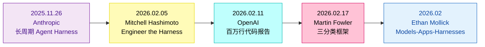
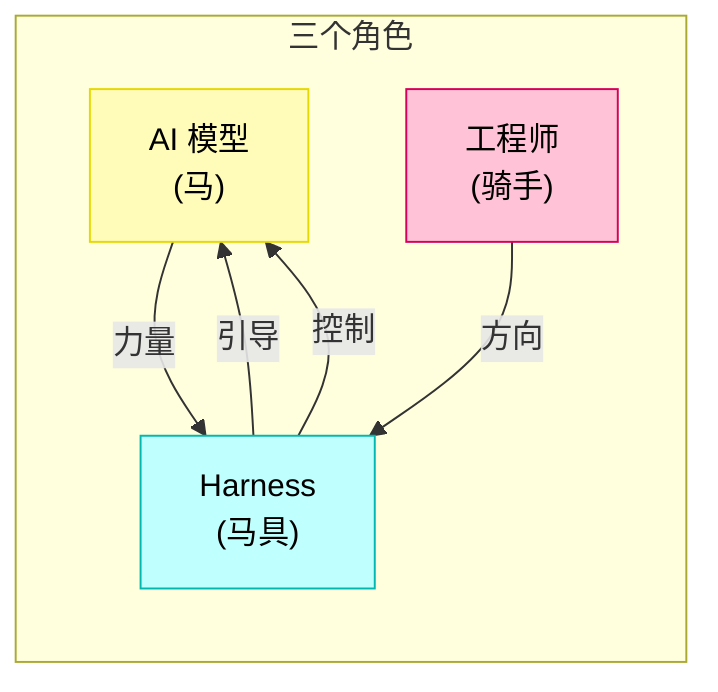
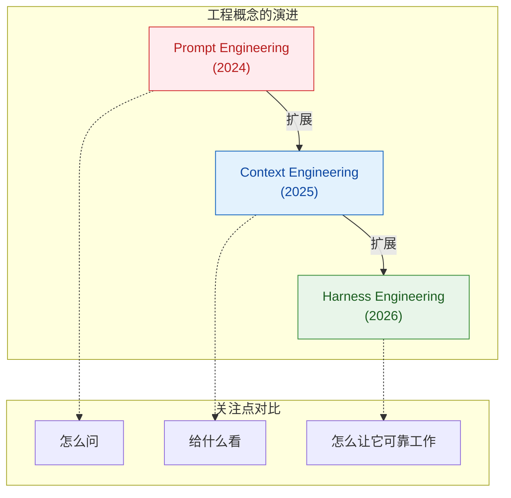
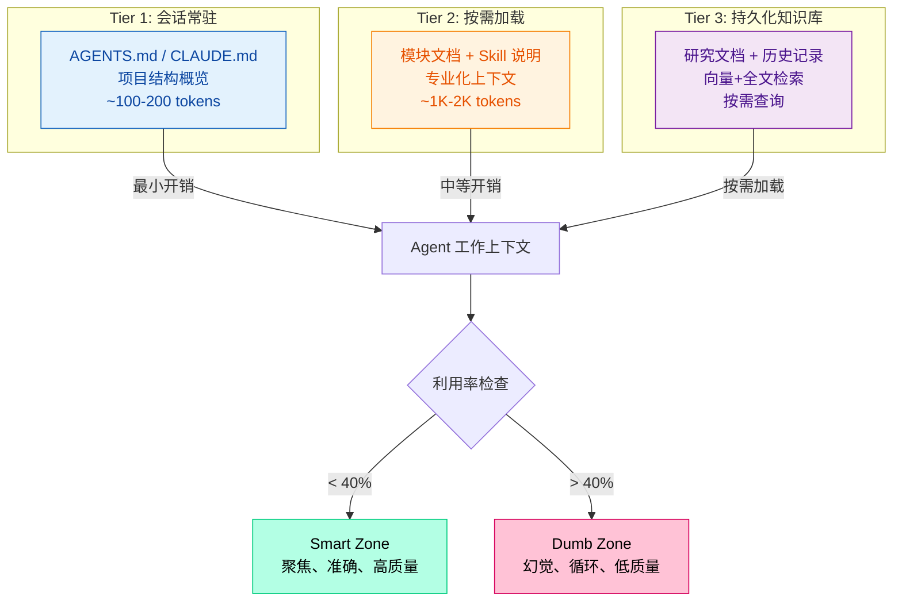
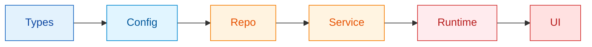
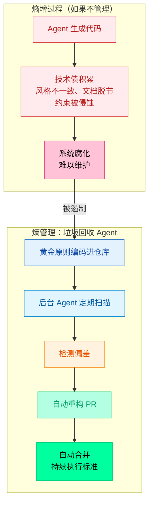
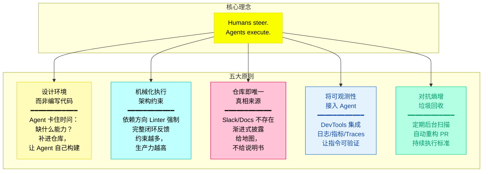
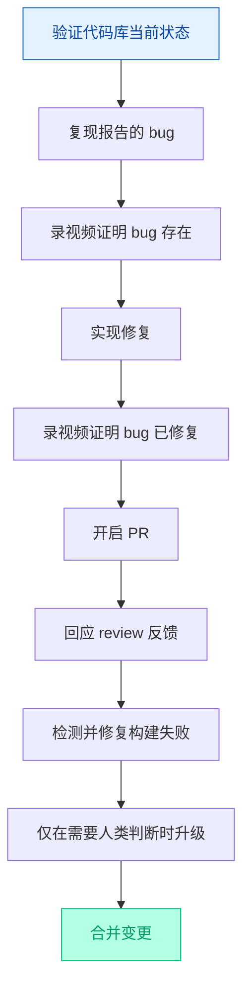
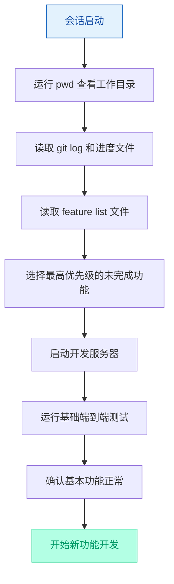
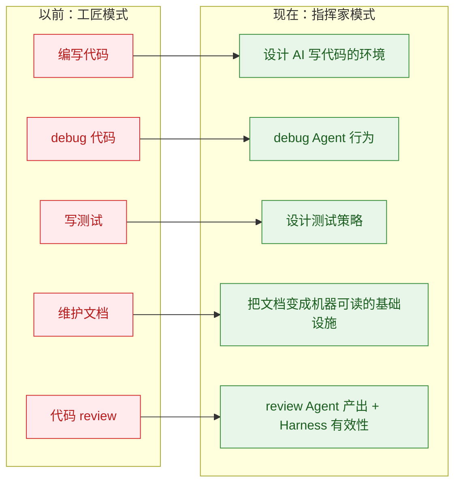

## 引言


2026 年 2 月，AI 工程领域出现了一个新术语：Harness Engineering。从 HashiCorp 创始人 Mitchell Hashimoto 的博客，到 OpenAI 发布的百万行代码实验报告，再到 Martin Fowler 的深度分析，这个概念在几周内成为了讨论 AI Agent 开发绕不开的话题。

这个概念的兴起源于业界对 AI 辅助开发的实践反思。LangChain 的编码 Agent 在 Terminal Bench 2.0 基准测试上，仅通过优化 Agent 运行的外部环境，排名就从全球第 30 位跃升至第 5 位，得分从 52.8% 飙升到 66.5%。底层模型一个参数都没改。

OpenAI 的实验记录了另一个工程事实：3 名工程师，5 个月时间，零行手写代码，通过 Codex Agent 协作交付了超过 100 万行代码的生产级软件产品。

这些案例指向同一个结论：决定 Agent 产出质量的最大变量，往往不是模型有多聪明，而是模型被放在了一个什么样的环境里。

<!-- more -->

### 概念汇聚时间线

Harness Engineering 的概念在 2025 年末开始形成，2026 年 2 月，多个团队独立发表了相关成果，概念框架成型：



## 什么是 Harness Engineering

### 马具的比喻

"Harness" 本意是马具——缰绳、马鞍、马嚼子——这是一整套用于引导强大但不可预测的动物走向正确方向的设备。



- **马** = AI 模型：强大、快速、精力充沛，但不知道该往哪跑
- **马具** = 基础设施：约束、护栏、反馈循环，引导力量往正确方向走
- **骑手** = 人类工程师：提供方向、做判断，但不亲自跑

Phil Schmid 用另一个类比："模型是引擎，Harness 是整辆车。再强大的引擎，没有方向盘和刹车，哪儿也去不了。模型负责生成响应，Harness 负责其他所有事情——人类审批、子 Agent 协调、文件系统访问、生命周期钩子、规划与执行。"

一匹没有马具的马，骑上去大概率被甩下来。马本身没问题，是没有控制它的手段。一个没有 Harness 的 AI Agent 也一样——模型能力再强，没有约束和反馈，就是一匹脱缰野马。

### 正式定义

**Harness Engineering** 指设计和实施四类系统：

1. **约束** Agent 可执行的操作（架构边界、依赖规则）
2. **告知** Agent 要做什么（上下文工程、文档）
3. **验证** Agent 是否完成任务（测试、Linting、CI 校验）
4. **纠正** Agent 出错时的修复（反馈回路、自修复机制）

Martin Fowler 将其描述为"约束 AI Agent 的工具和实践"。好的 Harness 不仅让 Agent 受控，也让 Agent 更有生产力。

### 从 Prompt 到 Harness 的演进

理解 Harness Engineering，需要先理解它的前身概念。



**Prompt Engineering** 解决怎么跟 AI 说话——few-shot、Chain-of-Thought、角色设定、格式约束。这些技术让单次对话输出质量更高，但 prompt 再好也只是一次性的便利贴，模型不记得上次对话，也不知道代码库长什么样。

**Context Engineering** 关注给模型看什么——管理上下文窗口里的信息。RAG 从外部知识库拉取相关内容，上下文压缩把长对话摘要，Progressive Disclosure 按需加载。

Context Engineering 管模型看到什么，管不了模型能做什么。模型看到完整代码上下文后，生成代码谁来验证、改了架构谁来检查、犯了错谁来纠正？

**Harness Engineering** 提供完整的环境：上下文架构让 Agent 看到该看的，架构约束让 Agent 不做该做的，垃圾回收让系统不腐烂，反馈循环让错误自动修复。

### 简明判断准则

| 维度 | Prompt Engineering | Context Engineering | Harness Engineering |
|------|-------------------|---------------------|---------------------|
| **优化目标** | 单次推理的输入质量 | 上下文窗口的信息质量 | 整个系统的持续质量 |
| **核心问题** | 怎么问 | 给模型看什么 | 防止什么、测量什么、控制什么、修复什么 |
| **时间尺度** | 单次对话 | 一个 session | 整个项目生命周期 |
| **失败模式** | 单次输出不准确 | 上下文不足或过载 | 质量随时间退化 |
| **典型实现** | few-shot/CoT/角色设定 | RAG/Memory/压缩 | Linters/CI/任务拆分/自动清理 |

## 三大核心支柱与五大原则

综合 OpenAI、Anthropic、Stripe 等团队的实践，Martin Fowler 将 Harness Engineering 拆解为三个维度，OpenAI 总结出五大原则。


### 支柱一：上下文工程

确保 Agent 在正确时机获得正确信息。核心原则是：Agent 应当恰好获得当前任务所需的上下文——不多不少。

**关键发现**：Dex Horthy 在一个 30 万行的 Rust 代码库上验证了一个现象——**上下文窗口利用率超过约 40% 后，模型性能开始明显下降**。他提出了 Smart Zone 和 Dumb Zone 的概念，40% 以下模型聪明，超过 40% 模型变笨。

#### 分层上下文体系

每个团队都独立发现，将所有指令塞进一个文件无法扩展。解决方案是**分层上下文与渐进式披露**：



OpenAI 团队早期犯了一个经典错误：把所有信息塞进一个庞大的 AGENTS.md 文件。结果 Agent 被信息淹没，性能反而下降。

他们最终演化出的方案是一个渐进式披露模型。AGENTS.md 被精简为约 100 行的"目录"角色，指向一个结构化的 docs/ 目录：

```
项目根目录/
├── AGENTS.md                ← 精简目录（~100行），指向 docs/
└── docs/
    ├── AGENTS.override.md   ← 子目录级覆盖规则
    ├── ARCHITECTURE.md      ← 分层架构与依赖流向
    ├── DESIGN.md            ← 设计原则与模式
    ├── PLANS.md             ← 执行计划
    └── PRODUCT_SENSE.md     ← 产品意图与用户旅程
```

#### Smart Zone vs Dumb Zone

Dex Horthy 在一个 30 万行的 Rust 代码库上验证了一个现象：上下文窗口利用率超过大约 40% 后，模型性能开始明显下降。

他提出了 Smart Zone 和 Dumb Zone 的概念——40% 以下模型聪明，超过 40% 模型变笨。200K token 的窗口塞了 180K，模型就像被书淹没的实习生，每本翻两页但一本都没看完。

这意味着给 Agent 塞一堆 MCP 工具、冗长文档和累积的对话历史，不会让它更聪明，反而会让它变笨。

### 支柱二：架构约束

通过机械化手段强制执行架构边界。核心原则是：约束必须机械化执行，不能靠文档记录。

#### 分层架构依赖

OpenAI 团队定义了严格的分层架构依赖流向：



每一层只能从其左侧的层导入。这不仅是一个建议——它是由结构化测试和 CI 校验强制执行的。

#### 自定义 Linter 的巧妙设计

拦截机制有两种。一是确定性 Linter。工程师花了数小时重写 Linter 的错误输出格式。目的只有一个，让 Agent 能"读懂"出了什么问题，并据此自动修复。

一个完整的闭环：Agent 写代码 → Linter 检查 → 发现违规 → 错误消息包含修复指引 → Agent 读取指引 → 修复代码 → 再次检查 → 通过。

Linter 输出的受众从人类变成了 AI——这件事本身就是 Harness Engineering 思维的典型体现。

#### 约束即增效

限制解决方案空间会让 Agent 生产力更高。当 Agent 可以生成任何东西时，它会浪费 Token 探索死路。当 Harness 定义清晰边界时，Agent 更快收敛到正确解决方案。

### 支柱三：熵管理

Agent 生成的代码以不同于人类编写的方式积累"技术债"。代码风格不一致、文档和实现脱节、架构约束被渐渐侵蚀——OpenAI 的报告称之为"熵"。



**核心理念**：技术债像高息贷款，小额持续还比积累后一次性处理更好。人类的审美和判断标准定义一次后，在每行代码上持续自动执行。

#### 垃圾回收 Agent

解决方案是：让 Agent 自己清理。

他们把黄金原则编码进仓库——不是靠人记住该怎么做，而是写成可检查的规则。然后用后台 Codex 任务定期扫描偏差、更新质量分数、开重构 PR。大部分 PR 一分钟内就能 review 完，自动合并。

他们举了两个具体的原则例子：

1. 优先用共享 utility 包，别手写 helper——这样不变量集中维护
2. 不要 YOLO 式地探测数据结构，要么 validate boundary，要么用 typed SDK——这样 Agent 不会在猜测的数据结构上建代码

### OpenAI 的五大 Harness 原则

基于百万行代码实验，OpenAI 团队总结出了五条核心原则：



#### 原则一：设计环境，而非编写代码

每次 Agent 卡住时，工程师的反应不是换个 prompt 试试或人工替它做，而是退一步问：这次卡住是因为缺了什么能力？缺工具？缺文档？缺约束？

然后把缺的东西补进仓库——**永远让 Agent 来写修复代码，不自己动手**。

这种工作方式标志着工程师角色的转变：人类提供方向和判断，Agent 提供执行力。人类设计环境，Agent 在环境里工作。从"实现者"转向"赋能者"。

#### 原则二：机械化执行架构约束

依赖方向必须机械化执行。OpenAI 定义了严格的依赖流向：Types → Config → Repo → Service → Runtime → UI。这些规则通过自定义 Linters 和结构测试自动检测违规。

完整的闭环：Agent 写代码 → Linter 检查 → 发现违规 → 错误消息包含修复指引 → Agent 读取指引 → 修复代码 → 再次检查 → 通过。

OpenAI 的原话："如果它不能被机械化地强制执行，agents will deviate." 矛盾的是，约束越多，Agent 生产力越高——限制解决方案空间让 Agent 更快收敛到正确答案。

#### 原则三：仓库即唯一真相来源

从 Agent 的角度看，任何它无法在上下文中访问的内容都不存在。Slack 讨论里的决策、Google Docs 里的规范、人们头脑中的经验——对 Agent 来说统统不存在。

OpenAI 团队一开始把所有信息塞进一个庞大的 AGENTS.md 文件，结果失败了。最终方案是渐进式披露：AGENTS.md 精简为约 100 行的"目录"，指向 docs/ 目录下的具体文档。

需要什么加载什么，永远不预加载。给 Agent 一张地图，别给一本一千页的说明书。

#### 原则四：将可观测性接入 Agent

Agent 如何知道自己有没有达成目标？OpenAI 团队通过 Chrome DevTools Protocol 接入浏览器，让 Agent 能获取 DOM 快照、截图、直接看到 UI 长什么样。

他们还搭建了本地可观测性栈——日志、指标、traces 全部暴露给 Agent。Agent 可以用 LogQL 查日志，用 PromQL 查指标。每个 worktree 的可观测性数据是独立的，任务完成后自动销毁。

效果是："确保服务启动在 800ms 以内"这样的指令变得可执行——Agent 能查到真实数据来验证。单次 Codex 运行经常能持续工作 6 小时以上。

#### 原则五：对抗熵增

Agent 大量生成代码时，系统的熵会持续增加——代码风格不一致、文档和实现脱节、架构约束被渐渐侵蚀。Agent 会复制仓库里已有的模式，包括那些不够好的模式。

解法：让 Agent 自己清理。把黄金原则编码进仓库——写成可检查的规则。然后用后台 Codex 任务定期扫描偏差、更新质量分数、开重构 PR。大部分 PR 一分钟内就能 review 完，自动合并。

核心理念：技术债像高息贷款，小额持续还比积累到一次性暴力更好。人类的审美和判断标准只需要定义一次，然后在每一行代码上持续自动执行。

**核心理念**："Humans steer. Agents execute."（人类掌舵，Agent 执行）

## 实践案例与数据

### LangChain：干净的对照实验

回到开头的那组数据。LangChain 的编码 Agent 在 Terminal Bench 2.0 上，通过仅优化 Harness 而不修改底层模型，得分从 52.8% 提升至 66.5%，排名从第 30 跃升至第 5。

具体改了什么？

| 变更项 | 采取的行动 | 影响 |
|--------|-----------|------|
| 自验证循环 | 增加了完成前的检查清单中间件 | 在提交前捕获错误 |
| 上下文工程 | 在启动时映射目录结构 | Agent 从一开始就理解代码库 |
| 循环检测 | 追踪重复的文件编辑 | 防止"死循环" |
| 推理三明治结构 | 高推理用于规划/验证，中等推理用于实现 | 在时间预算内获得更好的质量 |

**相同的模型，不同的 Harness，截然不同的结果。**

### Can.ac 实验：仅改变 Harness 工具格式

另一个独立的量化验证来自 Can.ac 实验——仅改变 Harness 的工具格式（编辑接口），在 16 个测试模型上普遍提升了编码基准分数：

- **Grok Code Fast 1**：从 6.7% 跃升至 68.3%（**10 倍提升**）
- 输出 token 减少约 20%（个别模型高达 61%）
- **未修改任何模型权重**

### OpenAI：百万行代码的实证

OpenAI 的实验是最有力的证据：

| 指标 | 数值 |
|------|------|
| 团队规模 | 3 名工程师起步，扩展至 7 人 |
| 持续时间 | 5 个月（2025 年 8 月起） |
| 代码规模 | 约 100 万行 |
| 手写代码 | 0 行（设计约束） |
| 合并 PR 数 | 约 1,500 个 |
| 日均 PR/人 | 3.5 个 |
| 效率提升 | 约为手写的 10 倍 |

工程师的工作是什么？设计 Harness。指定意图。提供反馈。而不是写代码。

### Anthropic：C 编译器项目

Carlini 的 C 编译器项目是目前最硬核的 Agent 自主开发压力测试：

| 指标 | 数值 |
|------|------|
| 持续时间 | 约 2 周 |
| 并行 Agent 数 | 16 个 Claude Opus 4.6 实例 |
| 产出 Rust 代码量 | 100,000 行 |
| GCC torture test 通过率 | 99% |
| 可编译的真实项目 | 150+（PostgreSQL、Redis、FFmpeg、CPython、Linux 6.9 Kernel 等） |
| 总 API 成本 | 约 $20,000 |

Carlini 自己的总结："我必须不断提醒自己，我是在为 Claude 写这个测试框架，不是为自己写。"

### Stripe：千级 PR 的 Minions 系统

Stripe 的 Minions 是目前最成熟的无人值守并行化实践：开发者在 Slack 里发任务，Agent 从写代码到跑通 CI 再到提 PR 全程包办，人只在最后审查环节介入。

**关键架构要素**：

- **Toolshed MCP 服务器**：Minions 连接到 Stripe 的集中式 MCP 服务器，提供近 500 个工具
- **隔离的预热 Devbox**：与人类工程师使用相同的开发环境，但与生产和互联网隔离
- **周吞吐量**：超过 1,300 个由 AI 完全编写的 Pull Request

### 一个关键等式：自主权 = f(背压)

Huntley 在 Ralph Wiggum Loop 实践中总结出的等式：

**自主权 = f(背压)**

背压（Backpressure）指的是系统中的约束和反馈机制：上游有确定性的设置、一致的上下文、代码模式引导；下游有测试、类型检查、lint、构建、安全扫描。

> "The more you capture the backpressure, the more autonomy you can grant."

这意味着不是模型越强就能放手，是约束和反馈越完善才能放手。没有背压的 Agent 就像没有刹车的跑车，速度越快越危险。

### Agent 端到端工作流程

后期，OpenAI 的 Codex Agent 能够端到端驱动一个新功能的完整开发流程：



这个能力高度依赖仓库特定的结构和工具，至少目前还不能假设换个仓库也能做到同样水平。

## 工程最佳实践


基于 OpenAI、Anthropic、Stripe、NxCode 等团队的实践，以下是在实际项目中验证过的做法：

### 1. 代码库必须是唯一的真理来源

从 Agent 的角度看，无法在上下文中访问的内容不存在。Google Docs、Slack 频道或人们头脑中的知识对系统不可见。

**实践**：
- 每个架构决策、命名约定和部署流程都在代码库中
- Slack 或 Google Docs 中不留存信息
- 规范、API 契约、风格指南全部版本化

### 2. Agent 卡住时问"缺了什么"

OpenAI 团队的工作方式：每次 Agent 卡住时，问——这次卡住是因为缺了什么？缺工具？缺文档？缺约束？然后把缺的东西补进仓库。

**永远让 Agent 写修复代码，不自己动手。**

### 3. 约束必须机械化执行

如果不能用 Linter、CI、结构测试强制执行，Agent 就会偏离。OpenAI 的原话：

> "如果它不能被机械化地强制执行，agents will deviate."

**实践**：
- 依赖方向由结构化测试强制
- 命名规范由 Linter 强制
- 文档一致性由自动化检查验证

### 4. 增量式构建约束

从基础 Linting 开始，随着模式的出现增加架构约束。不要试图预先设计完美的 Harness。

**实践**：
- Agent 犯错时问自己：这是模型的问题还是环境的问题？
- 环境的问题写进约束文件
- 每多一条约束，系统多一层保险

### 5. Agent 特定的评审清单

AI 生成的代码与人工代码有不同的失败模式。评审流程需要考虑常见的 Agent 模式：

| 常见 Agent 模式 | 评审关注点 |
|----------------|-----------|
| 过度抽象 | 是否为未来不需要的灵活性而复杂化？ |
| 不必要的错误处理 | 是否添加了永远不会触发的错误处理？ |
| 文档漂移 | 代码变化时文档是否同步更新？ |
| 模式复制 | 是否复制了仓库中不够好的模式？ |

### 6. 多供应商 Harness 设计

Harness 兼容 Claude、GPT 和 Gemini 等多种模型。供应商无关的设计意味着可以切换模型而无需重建整个系统。

**实践**：
- 避免依赖特定模型的独有特性
- 抽象工具层，不同模型使用相同接口
- 版本控制 Harness 配置，便于 A/B 测试

### 7. 文档是活的反馈循环

AGENTS.md 的每一行都应对应一个历史 Agent 失败案例。Hashimoto 的 Ghostty 项目就是最好的例证——文件的每一行都对应着一个过去的 Agent 失败，现在被永久预防。

**实践**：
- 简单的错误通过更新 AGENTS.md 解决
- 复杂的问题构建工具层面的解决方案
- 文档变成反馈循环而非静态制品

## 核心组件与工具


### AGENTS.md：Agent 的活文档

AGENTS.md 是一个新兴的开放约定——本质上是给 AI Agent 的 README。它是代码仓库根目录下的 Markdown 文件，编码 Agent 在每次会话开始时自动读取。

关键特性：
- 不是一次性编写后遗忘的静态文档
- 每当 Agent 犯错时都要更新——文档变成反馈循环而非静态制品
- 不应超过 200 行，作为"地图"指向具体文档

Mitchell Hashimoto 的理念："每当发现 Agent 犯了错误，花时间设计一个解决方案，让 Agent 永远不再犯同样的错误。"Ghostty 项目中 AGENTS.md 的每一行都对应一个过去的 Agent 失败案例——现在被永久预防。

### 可观测性集成

OpenAI 团队将可观测性连接到 Agent 工作流：

- **浏览器自动化**：通过 Puppeteer MCP 让 Agent 像人类用户一样进行端到端测试
- **Chrome DevTools 集成**：Agent 能捕获 DOM 快照和截图
- **日志和指标查询**：使性能目标（如"启动时间低于 800ms"）变得可度量
- **遥测驱动的 bug 修复**：Agent 利用日志、指标和 Span 来自主重现 bug 和验证修复

### 进度持久化

Anthropic 解决长时间运行 Agent 跨会话连续性的方案：

**初始化 Agent**：首次会话使用专门的 prompt，要求模型建立初始环境——init.sh 脚本、claude-progress.txt 进度文件和初始 git 提交。

**编码 Agent**：后续每次会话要求模型在做出增量进展的同时，留下结构化更新。

每个编码 Agent 的典型会话启动流程：



关键发现：使用 JSON 格式追踪 feature 状态比 Markdown 更有效，Agent 不太可能修改或覆盖结构化数据。

## 工程师角色的转变

OpenAI 和 Anthropic 的实践指向同一个结论：工程师的工作在变化。从"工匠模式"转向"指挥家模式"，核心活动从编写代码转向设计 AI 写代码的环境。



**六个维度的深层转变**：

| 维度 | 传统模式 | Harness Engineering 模式 |
|------|---------|-------------------------|
| **核心活动** | 编写代码（90%）+ 架构思考（10%） | 架构思考（20%）+ 代码审查（30%）+ 与 Agent 对话（50%） |
| **价值来源** | 代码行数、功能实现 | 环境设计、意图规约、反馈循环构建 |
| **工作节奏** | 写几行 → 编译 → 看结果（快速反馈） | 设计规范 → 调教 Agent → 1-3 个月后看到大规模提效（延迟反馈） |
| **技能重心** | 语言/框架熟练度、算法、Debug | 系统思维、抽象能力、文档工程、影响力工程 |
| **类比** | 工匠 / 乐器演奏者 | 导演 / 乐队指挥 |
| **衡量标准** | 代码质量、Bug 修复速度 | Agent 产出的可靠性、团队乘数效应 |

**适应之路的四个阶段**：

| 阶段 | 特征 | 典型想法 | 应对策略/标志 |
|------|------|----------|--------------|
| **初始兴奋期** | 新鲜感和尝试热情，蜜月期 | "这东西太强大了，我可以完成以前想都不敢想的项目" | 风险：过度乐观，未建立适当约束和验证机制 |
| **谷底期** | 新鲜感褪去，现实问题浮现，大多数人放弃的阶段 | "我是不是不适合了？"、"要不回业务线写代码吧" | 找同行交流、保留手写代码时间、降低期望、接受不适感是成长的一部分 |
| **杠杆效应初现** | 看到自己设计的系统在发挥乘数效应 | "这开始有意义了" | 用数据和故事向业务方展示成果，提升认同感 |
| **新身份稳态** | 焦虑转化为进取心，"这才是高阶的工程乐趣" | "怎么让系统再上一层楼" | 不再因少写代码而不安、更享受设计约束系统、能快速诊断 Agent 问题、积累可复用模式 |

**两条核心工作原则**：

1. **"10 倍错误"需要"10 倍自律"**：错误随生产力等比例放大。一条措辞不当的指令可能导致 Agent 重构半个代码库。疲劳时不做重大决策；重要操作前休息；建立"沙箱"文化；定期审查和调整。

2. **思考与执行必须分离**：不要让 Agent 在审查和批准书面计划之前写代码。审查规格的成本是小时级，审查错误实现的成本是天级。

## 需要注意的问题

Harness Engineering 不是银弹，有几个现实问题需要正视：

| 问题 | 核心挑战 | 应对思路 |
|------|----------|----------|
| **高度定制，难以迁移** | OpenAI 明言："这套能力高度依赖仓库的特定结构和工具，换一个项目基本得重建" | 接受投入不可复用，聚焦当前项目价值 |
| **模型进化的双刃剑** | 今天需要的约束，明年的模型可能天然就不再犯 | 驾驭层需要随模型一起迭代，而非一劳永逸 |
| **成本问题** | Carlini 编译器花费 $2 万 API 费，16 个并行 Claude 跑两周可能比请实习生还贵 | 根据团队规模和预算调整并行度 |
| **不能替代领域知识** | 不懂编译器的人，没法给编译器 Agent 建好反馈循环 | 杠杆放大的支点仍是领域专业性 |
| **棕地项目改造** | 在十年历史的代码库上引入 Harness，会被警报淹没 | 增量式引入，从最关键的架构约束开始 |
| **功能验证缺失** | 目前擅长"约束 Agent 不做错事"，但"验证 Agent 做对了事"远未解决 | 结合 E2E 测试、人工验收，功能验证仍是开放问题 |

## 核心要点

**技术层面**：
- 模型是商品，Harness 是护城河——LangChain 仅通过改变 Harness 就让基准测试排名从前 30 跃升至前 5
- 上下文不是越多越好——利用率超过约 40% 后进入 Dumb Zone，模型性能下降
- 约束必须机械化执行——如果不能用 Linter、CI、结构测试强制执行，Agent 会偏离
- 思考与执行必须分离——审查规格的成本是小时级，审查错误实现的成本是天级

**心理与适应层面**：
- 接纳身份转变——从"代码生产者"到"系统放大器"，新的成就感在更高抽象层级出现
- 谷底期的痛苦是正常的——适应曲线包含初始兴奋、谷底期、杠杆效应初现、新身份稳态四个阶段
- "10 倍错误"需要"10 倍自律"——疲劳时不做重大决策、重要操作前休息、建立"沙箱"文化

**参考资料**：
- [OpenAI — Harness engineering: leveraging Codex in an agent-first world](https://openai.com/research/)
- [Martin Fowler — Harness Engineering](https://martinfowler.com/articles/harness-engineering.html)
- [Anthropic — Effective harnesses for long-running agents](https://anthropic.com/research/)
- [Charlie Guo — The Emerging "Harness Engineering" Playbook](https://artificialignorance.com/)
- [Mitchell Hashimoto — My AI Adoption Journey](https://mitchellh.com/blog/my-ai-adoption-journey/)
- [SmartScope — What Is Harness Engineering](https://smartscope.dev/)
- [Marius Anderie — The Psychology of Coding With AI Agents](https://mariusanderie.com/)
