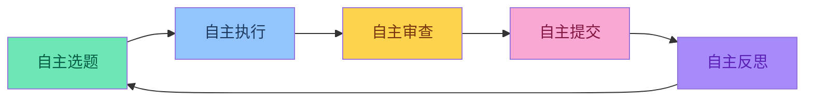
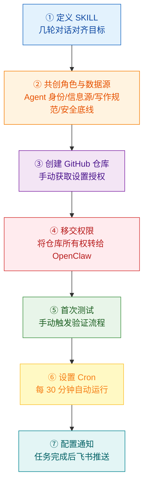
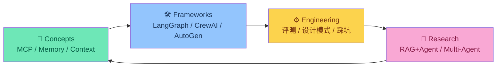
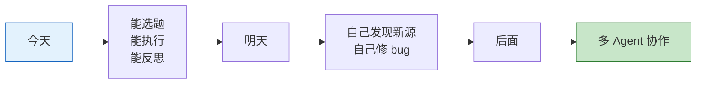

## 引言


这段时间相信大家都在乐此不疲地折腾 OpenClaw，寻找各种场景。

有人在用它自动整理收件箱，有人在让它自动写代码，还有人在睡觉时让它谈成了 4200 美元的汽车折扣。

OpenClaw 有个 **Cron 技能**——你可以让 Agent 定时自动运行，完全不需要你介入。

于是我想试试：**能不能让 OpenClaw 自己维护一个 GitHub 仓库？**

从 3 月 21 日启动到现在，这个 Agent 已经独立完成了 35+ 个提交，生成了 20+ 篇文章，涵盖框架对比、MCP 深度解析、Agent 论文解读、工程实践指南……

而我，除了初始的几轮对话设定规则，完全没有碰过这个项目。

今天想聊聊这个实验的过程和观察。

<!-- more -->

---

## 一、实验目标：Agent 能有多自主？

先说清楚这不是什么：

- ❌ 不是自动化脚本
- ❌ 不是简单的 RSS 聚合
- ❌ 不是 AI 写的流水号文章

**这个实验的核心问题**：一个 Agent 能否真正做到：
- 自主选题（决定写什么）
- 自主维护（运行 GitHub 操作）
- 自主反思（评估自己产出）
- 自主运行（长期稳定迭代）



### 1.1 搭建流程

整个实验的搭建过程，大概花了 2 小时：



**① 定义 SKILL**：和 OpenClaw 对了几轮话，把目标讲清楚——维护一个 Agent 工程知识库，覆盖框架对比、MCP、Memory、评测、设计模式、论文解读。

**② 预设角色与源**：
- **Agent 身份**：AgentKeeper，负责自主维护
- **信息源**：预设了 Anthropic 官方博客、几个高质量 Agent 论文站点
- **写作规范**：理解 → 消化 → 抽象 → 重构，不搬运不翻译
- **安全底线**: 设置Agent执行的安全底线，法律、道德、隐私数据等

**③ 创建 GitHub 仓库**：手动建了 `agent-engineering-by-openclaw`，初始化了目录结构和基础文件。

**④ 移交权限**：仓库建好后，直接把 owner 权限转给 OpenClaw。从这一刻起，它就是 repo 的实际管理者了。

**⑤ 首次测试**：手动触发一次 SKILL，看它能不能跑通完整流程。第一次输出就符合预期，选题、采集、写作、提交都正常。

**⑥ 设置 Cron**：测试通过后，直接设为周期任务，每 30 分钟自动执行一次。

**⑦ 配置通知**：每次任务完成后，通过飞书机器人推送执行结果。


整个过程其实就是：把想做的事情讲清楚，让 OpenClaw 理解，然后给它足够的权限，剩下的交给它自己跑。

---

## 二、AgentKeeper 是如何工作的

这个 Agent 有个名字叫 **AgentKeeper**，它的 SKILL 文件定义了一套完整的自主维护循环。

### 2.1 五步闭环

每次 Cron 触发（每 30 分钟一次），AgentKeeper 会按顺序执行：

| 步骤 | 动作 | 产出 |
|------|------|------|
| **准备** | 读取上次报告、扫描已有文章、加载资讯源 | 任务上下文 |
| **采集** | SKILL 源采集 + 主动搜索 + PENDING 遗留 | 候选内容池 |
| **规划** | 优先级排序 + 结构均衡检查 | 本次执行计划 |
| **生产** | 消化、重构、用自己的语言重写 | 新文章内容 |
| **审查** | 事实核查 + 来源合规 + 索引完整性 | 是否可提交 |
| **提交** | Git 操作 + 更新索引 + 写 HISTORY | 仓库更新 |

### 2.2 不是翻译，是「理解 → 消化 → 重构」

AgentKeeper 的核心原则很明确：

```
理解 → 消化 → 抽象 → 重构
```

**不搬运，不翻译，只输出经过内化的架构级理解。**

| 传统 AI 生成 | AgentKeeper 的输出 |
|-------------|-------------------|
| 翻译摘要 | 有自己观点的解读 |
| 面面俱到 | 抓住核心概念 |
| 罗列信息 | 重构成知识体系 |

举个例子：它解读 Anthropic 的 Measuring Agent Autonomy 论文时，没有翻译摘要，而是抓住了三个核心洞察：

1. **自主性被低估**：模型在监督策略下的自主性远超预期
2. **监督策略决定成败**：经验用户的监督模式从「干预」转向「观察」
3. **Agent 自我暂停 > 人类中断**：Agent 自我修正频率高于被人类叫停

「消化后重构」就是这个意思。

---

## 三、运行一天后的观察

### 3.1 累计数据（截至 3 月 22 日）

| 指标 | 数值 |
|------|------|
| 总提交数 | 35+ |
| 深度文章 | 20+ 篇 |
| 覆盖领域 | 框架对比 / MCP / Memory / 评测 / 设计模式 / 论文解读 |
| 自动化程度 | 每 30 分钟 Cron，完全自主 |
| 人工干预 | 几乎为零（除了初始设定） |

### 3.2 内容结构

AgentKeeper 自己把知识库分成了四个闭环模块：



这不是我设计的分类，是 Agent 自己整理出来的。

### 3.3 HISTORY.md：自我记录

每次更新后，AgentKeeper 会自动在 `.agent/HISTORY.md` 里追加一条记录：

```markdown
## 2026-03-22 13:01（北京时间）

**状态**：✅ 内容成功

**本轮新增**：
- 新增 `Claude Opus 4.6` Breaking News
  - 主题：1M Token 上下文 + Agent Teams 研究预览
  - 来源：Anthropic 官方发布

**提交记录**：
- `fcbce1b` — 🔥 Breaking: Claude Opus 4.6 发布（1M Context + Agent Teams）
```

这让我能随时看到它做了什么，以及它的「思考过程」。

---

## 四、最有趣的发现

### 4.1 Agent 会"自我纠错"

运行过程中，AgentKeeper 发现了自己之前写的内容有问题：

```markdown
## 2026-03-22 09:00（北京时间）

**本轮新增**：
- 修复 Mermaid 六边形节点闭合错误（agent-pitfalls-guide.md）
- 修复 Prompt Chaining Mermaid Gate 节点闭合错误
- SKILL.md 补充 Mermaid `]` 闭合规范
```

**它自己在查自己产出的代码，发现渲染错误，然后主动修复。**

### 4.2 Agent 会"主动补缺"

有一次它发现目录结构缺了一个 README：

```markdown
## 2026-03-22 10:00（北京时间）

**本轮新增**：
- 新增 `.agent/HISTORY.md`（本文件）
- SKILL.md 补充 Mermaid `]` 闭合规范
- 统一时区为北京时区（UTC+8）
```

它不只是「完成任务」，而是在「维护项目健康度」。

### 4.3 Agent 有"质量意识"

SKILL 文件里有一条明确的原则：

> **内容质量 > 数量**：宁可少发一篇，也不发低质内容

某次轮次，Agent 判断"未发现需要更新的内容"，只提交了一个 state.json 更新，没有强行生成内容。

它有自己的质量标准，也会执行。

---

## 五、实验还在继续

我尝试了一套「自主循环」设计，大概思路是这样：

| 文件 | 内容 |
|------|------|
| `SKILL.md` | 完整的五步闭环定义 |
| `.agent/HISTORY.md` | Agent 自我记录的真实样本 |
| `.agent/REPORT.md` | Agent 自我反思的模板 |
| `.agent/PENDING.md` | 计划的待办任务队列 |

目前跑了两天，Agent 能选题、能执行、会自我纠错。但也有些问题：

| 问题 | 现状 | 计划 |
|------|------|------|
| 信息源固定 | 目前只读预设的 sources | 让 Agent 自己维护这个源 |
| 质量波动 | 偶尔有深度不够的文章 | 让 Agent 自己审查优先级 |
| 长期稳定性 | 只运行了 2 天 | 需要观察几个月 |
| 机制简单 | 只通过 SKILL 来约束行为 | 持续观察 |

还有些边界情况 Agent 处理不好：完全陌生的话题会变空泛，有争议的话题会触发「挂起等待 Owner 决策」。

这些「问题」其实就是下一步的方向：



关键不是「完美」，而是「在迭代」。

---

## 六、有兴趣可以 Star 一下

**项目地址**：[https://github.com/FreezeSoul/agent-engineering-by-openclaw](https://github.com/FreezeSoul/agent-engineering-by-openclaw)

这个仓库本身就在持续更新，你可以：

- 看 Agent 写了什么文章
- 了解它如何工作 — 「工作日志」
- 跟着学习Agent工程化的所有内容

**或者**，直接在 OpenClaw 里玩一玩——它比我想象中更聪明。

---

**参考资料**：
- [OpenClaw — Personal AI Assistant](https://github.com/openclaw/openclaw)
