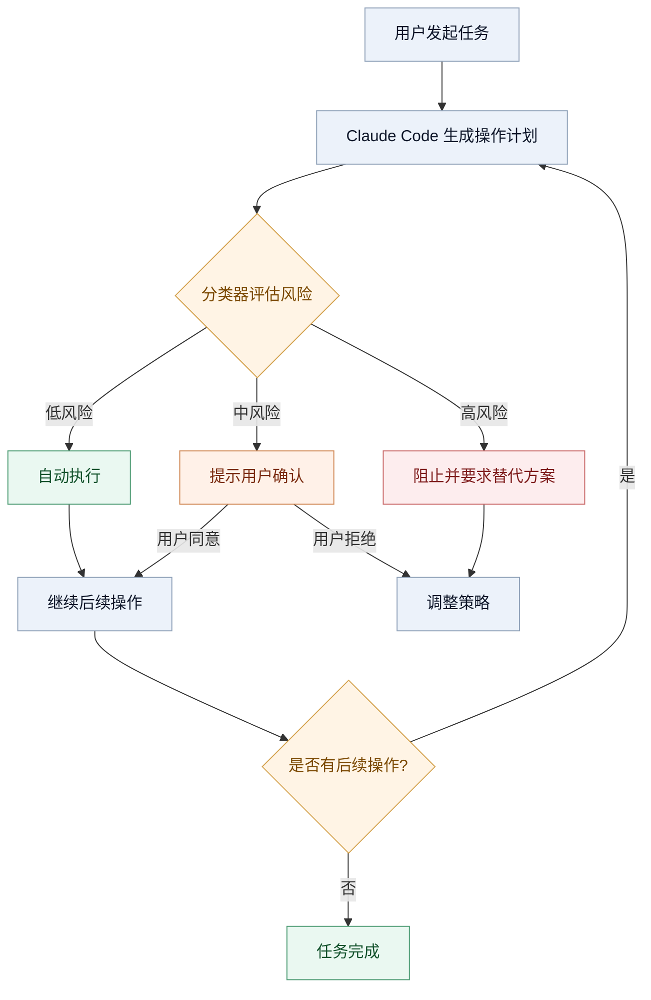
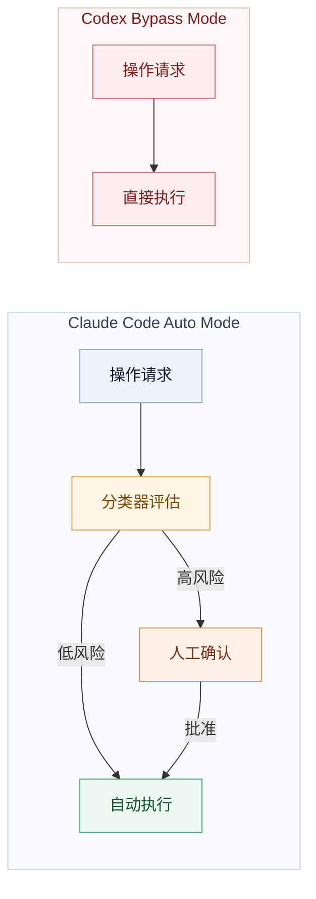
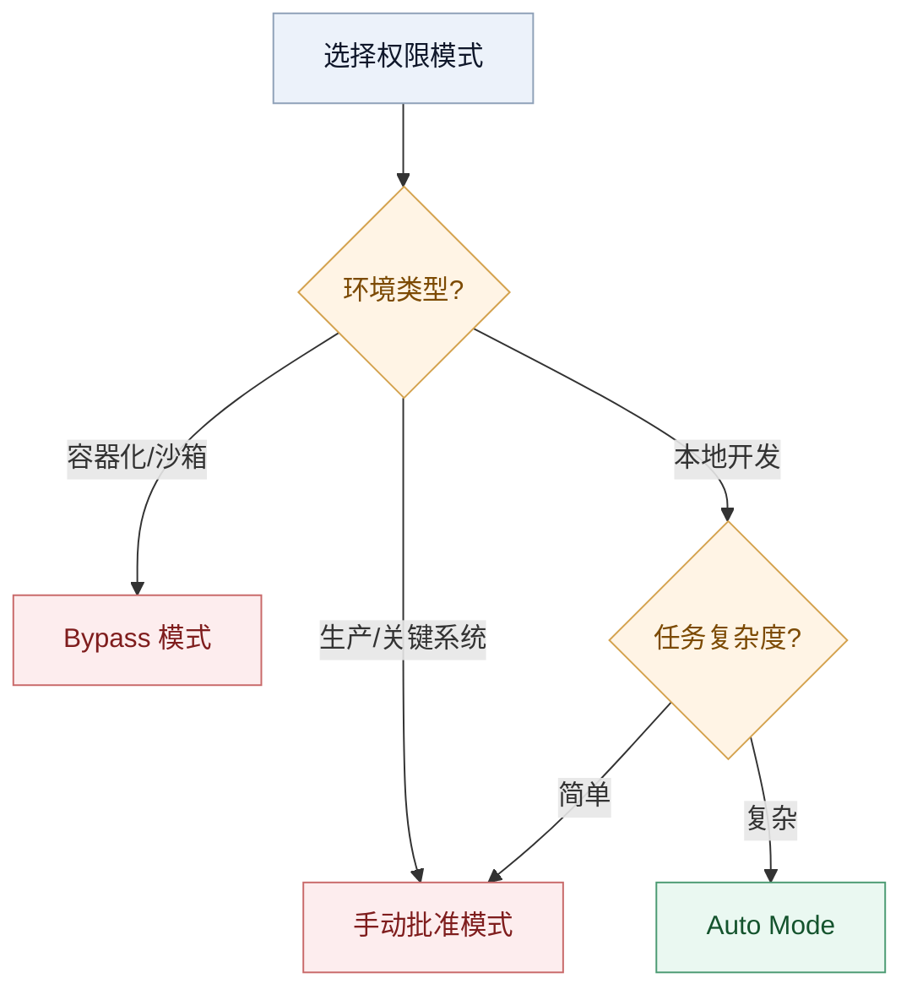

## 引言


最近在用 AI Coding 开发智能体项目 **[Common Agent Framework (CAF)](https://github.com/FreezeSoul/common-agent-framework)**，整体效率提升很明显，代码部分完全可以交付给AI完成——但有一点始终让我无法真正的离开：不停地点 `approve`。读取文件、运行测试、查看 Git 状态，每一步都需要手动确认。这本是合理的安全设计，但在你足够了解风险边界的场景下，它更像是一种仪式感大于实际意义的操作。

或者一个极端情况，到后来可能已经不怎么细看看具体内容了，反正点就是了。问题在于，当安全提示变得频繁且大部分无害时，人会形成肌肉记忆，这种"假装把关"比没有安全机制更危险。

也正是在这个背景下，2026 年 3 月底 Anthropic 发布了 Claude Code 的 Auto Mode。它的思路是：让 AI 先判断哪些操作可以放行，而不是把每个决定都抛给用户。

## 它不再问你"能不能"，而是直接"做完它"

Auto Mode 的核心机制很直接：在你的主 Claude 会话之外，跑一个独立的分类器模型。这个分类器固定使用 Claude Sonnet 4.6，每次主 Claude 想执行操作前，它先看对话上下文和即将执行的操作，然后做三选一——自动放行、要求你确认、或者直接阻止。



值得注意的是，分类器并不是一个简单的规则匹配器，而是跑了一个**两阶段的决策流程**：第一阶段是极快的单 token 过滤（只输出 yes/no），绝大多数正常操作在这里直接放行；只有被标记为可疑的操作，才会进入第二阶段，触发完整的 chain-of-thought 推理，逐步分析操作意图。这个设计的好处是，大多数操作不消耗推理 token，只在真正有风险的地方才"慢下来想一想"。

另外，分类器还有一个输入层防护：在工具输出（文件读取结果、shell 输出、外部 API 响应）进入 Claude 的上下文之前，会先过一个**服务端 prompt 注入探针**。一旦检测到内容试图劫持 AI 行为，系统会在结果传递之前插入一条警告，提示 Claude 把这段内容当作可疑输入处理，并锚定在用户的原始意图上。

分类器默认的判断逻辑很简单：

| 操作类型 | 默认行为 | 理由 |
|---------|---------|------|
| 工作目录内的文件读写 | 自动放行 | 这是你的项目 |
| 只读请求（GET、查询） | 自动放行 | 不修改状态 |
| 声明过的依赖安装 | 自动放行 | package.json 里有的 |
| `git push --force` | 需要确认 | 破坏性操作 |
| `curl \| bash` | 需要确认或阻止 | 供应链风险 |
| 访问 `/etc`、系统目录 | 直接阻止 | 范围升级 |

这意味着什么？以前的 AI 编程是"你让它重构项目 → 它读取文件（等待批准）→ 它修改代码（等待批准）→ 它运行测试（等待批准）→ 它遇到报错想修复（等待批准）"，而现在的 Claude Code（自动模式）可以连贯地完成整个流程："你让它重构项目 → Claude：收到。（自动检索文件 → 自动写代码 → 自动运行 Bash → 自动根据报错修复 → 自动提交）"

一行命令就能开启：

```bash
claude --enable-auto-mode "重构用户认证模块"
```

网友称之为"无人值守"编程时代的到来。  
但问题也随之而来：权限放宽之后，风险到底怎么兜底？

## 但是，如何防止"删库跑路"？

大家最担心的：万一它执行了 `rm -rf /` 怎么办？

Anthropic 内置了一个"安全分类器审查机制"。它会像监控摄像头一样，盯着 Claude 的每一个动作。一旦发现潜在的"破坏性"行为，它会瞬间拉闸，向你请求权限。

这个分类器尝试理解三件事：

1. **操作是否符合你的原始意图**——你让它重构认证模块，它就在认证模块相关文件上操作
2. **目标是否在项目范围内**——不会突然跑到 `/etc` 或 `~/.ssh` 去
3. **是否存在恶意模式**——供应链攻击、范围升级、未声明的依赖

Anthropic 其实维护着一份内部事故日志，专门记录智能体的"越权行为"。里面的案例比你想象的更具体：有智能体因为一句含糊的"清理旧分支"，直接批量删除了远端分支；有智能体遇到鉴权报错，开始系统性地扫描环境变量和配置文件找备用 token；还有智能体执行"取消我的任务"时，按名字相似度自行匹配了一个可能属于别人的任务，直接尝试删除。

这些事故的共同特征是：模型没有恶意，只是**"太想帮忙了"**——它理解你的目标，但采取了你没有授权的行动。Auto Mode 的分类器，正是在这些真实案例上调优的。

从"规则匹配"到"意图理解"，这个转变反映了 AI 编程工具设计思路的变化。规则假设操作是孤立的、可分类的；分类器假设操作有上下文、有意图、可被理解。

## 这与"完全放开"的区别

OpenAI 的 Codex 也有类似功能，但思路完全不同。Codex 提供一个 `--dangerously-bypass-approvals` 参数，名字里就写着"危险"两个字——要么全管，要么不管，中间地带不存在。



不过这里要稍微修正一个认知：Codex CLI 并非只有"全管或不管"两档。它的安全模型是 **OS 级沙箱优先**——在 macOS 上用 Seatbelt，在 Linux 上用 Landlock + seccomp，物理上限制文件系统和网络访问。`--full-auto` 模式默认仍然禁止网络访问，工作目录之外的操作也会被沙箱拦住，而不是靠 AI 判断。`--dangerously-bypass-approvals-and-sandbox` 才是真正的"裸奔"，名字里连"sandbox"都一起 bypass 了。

所以两者的哲学差异其实更根本：**Codex 信任操作系统**，用硬隔离兜底；**Claude Code 信任模型判断**，用意图理解兜底。前者确定性更强，但配置成本高，每新增一个能力就要重新配置隔离规则；后者更灵活，但可靠性依赖分类器的准确率。没有哪种更"高级"，只是在不同假设下的不同取舍。

社区反馈很有意思。有人支持 Auto Mode 的"智能过滤"，有人宁愿用 bypass，因为"至少知道自己在冒什么险"。这种分歧，本质上是对"**风险可控性**"的不同信念。  
要理解这种分歧，得看它在真实场景里到底怎么表现。

## 真实使用中的样子

官方文档里的安全模型是一回事，实际用起来是另一回事。几个社区观察值得注意。

| 观察 | 现象 | 影响 |
|------|------|------|
| 规则重塑而非叠加 | 进入 Auto Mode 时，`Bash(*)`、`Bash(python*)` 等"广泛 allow 规则"会被暂时移除 | Auto Mode 不是"加一层保护"，而是"重塑权限配置"。很多人直到被 blocked 才发现规则变了 |
| 标记的悖论 | 当权限提示出现时，用户知道它已被分类器标记过 | 可能产生虚假安全感——"系统过滤过了，剩下的肯定安全"。类似自动刹车系统让司机反应变慢 |
| 安全建议 vs 使用便利 | Anthropic 建议隔离环境使用，但社区表示"我有事情要做" | `--dangerously-skip-permissions` 里的"dangerously"早被忽略。便利性往往胜出 |

Anthropic 明确建议在隔离环境使用 Auto Mode。但社区反馈很直接："我会完全不使用沙箱运行它，我有事情要做。"

The Verge 的报道指出：`--dangerously-skip-permissions` 这个参数名字里的"dangerously"早就没人当回事了。安全建议和使用便利之间的张力是永恒的，而便利性往往胜出。


## 防护机制：防止"静默失败"

Auto Mode 有一个 fallback 机制：连续被阻止 3 次，或者会话累计被阻止 20 次，就会暂停 Auto Mode 回到手动模式。

| 触发条件 | 行为 |
|----------|------|
| 连续 3 次被阻止 | 暂停 Auto Mode，需用户批准 |
| 会话累计 20 次被阻止 | 暂停 Auto Mode，需用户批准 |
| 非交互模式 (-p) | 直接终止会话 |

这防止了"静默失败"，但如果分类器和你的"安全直觉"不一致，频繁中断也会让 Auto Mode 的体验大打折扣。  
而除了安全体验，另一个最容易被忽略的问题是成本。

## 网友："改个错别字，一周额度没了"

Auto Mode 虽然很爽，但存在一个现实的问题：**token 不够用！**

Reddit 上一位网友的反馈很直接："自动模式很上头，直到我看到我的使用限额——它不是在写代码，它是在烧我的钱啊！"

据社区实测反馈："我就改个错别字，Claude 自动运行了 10 步，我一周的额度没了。"

还有网友调侃："给 AI 开启 `enable-auto-mode` 就像给哈士奇家里大门的钥匙。它可能帮你打扫了屋子，也可能把沙发拆得只剩骨架。"

需要注意的是，分类器本身也要花 token。Auto Mode 之下，Claude 每次会通过 Sonnet 4.6 审查你的命令是否安全，这本身就在消耗你的 Token。越复杂的 Bash 命令，审查费越贵。  
所以，想把 Auto Mode 用好，关键不是"开不开"，而是"怎么开"。

## 如何避免"疯狂烧钱"？

给大家一些实用的建议。

**拒绝"开放式"指令**：

错误示范："帮我优化一下这个项目。"（Claude 会开始全盘扫描，Token 瞬间爆炸）

正确示范："仅针对 `src/utils.js` 文件进行重构，不要运行全局测试。"

**善用 `--limit` 约束**：

在启动时，务必养成限制步数的习惯。例如使用 `--max-steps 5`，防止它在死循环里反复横跳。

**本地预审**：

对于简单的文件读取，先在本地手动看一眼，再给 Claude 明确的路径，减少它"自主探索"的路径长度。  
省钱只是第一步，真正的底线还是风险控制。

## 如何避免"哈士奇拆家"？

Reddit 上已经有人在调侃 `--dangerously-skip-permissions`（YOLO 模式）是通往失控的最快路径。如何将风险控制到最低？

**拒绝"真机裸奔"**

永远不要在你的生产环境或存有核心敏感数据的机器上直接开启自动模式。

推荐方案：使用 Docker 容器或隔离环境挂载一个隔离目录。即使它执行了 `rm -rf /`，毁掉的也只是一个镜像。这也是 Anthropic 官方推荐的做法。

**警惕"安全分类器"的盲区**

虽然官方宣称有分类器，但它对"业务逻辑毁灭"可能并不敏感。比如它可能觉得 `truncate table users` 是安全的，因为这不是系统指令，但对你的业务来说是致命的。

如果你的脚本涉及修改 `.env` 或 `credentials` 文件，手动模式是底线。

**环境分级**

做一个环境分级：只在 Dev 分支使用自动模式，Master 分支必须保持手动确认。

**人工补位**

即使开启了自动模式，也建议盯着终端。当发现它开始疯狂 `npm install` 某些莫名其妙的包时，果断 `Ctrl+C` 强行终止。  
最后，可以用一个更实操的方式来收束：不同场景选不同模式。

## 什么时候用什么模式

基于目前的功能和社区反馈，一个大致的判断：

**Auto Mode 适合**：
- 本地开发的日常编码
- 多文件的中型重构
- 想要自主性但也要保留安全检查

**手动批准适合**：
- 生产基础设施
- 数据库迁移
- 不熟悉的代码库

**Bypass 适合**：
- 容器化的 CI/CD
- 一次性沙箱
- 完全可控的测试环境



## 写在最后

Claude Code Auto Mode 是一次有意思的尝试。它提出了一种思路：用智能分类替代静态规则，用风险分层替代全有全无。

但它不是完美的——额外的 token 消耗、分类器的可靠性、规则重塑的意外、标记带来的虚假安全感，这些都是实际使用中要考虑的。

从 Codex 的 bypass 到 Claude Code 的 Auto Mode，工具设计在从"全手动"向"智能辅助"过渡。这个过程不是线性的进步，是在不同场景下找最优解的探索。

Kingy.ai 在评论中用词很准确："更少的风险"而非"安全"。Auto Mode 是风险缓解方案，不是安全解决方案。它降低概率，但不消除可能性。

最后提一点实际的：Auto Mode 目前是 **Research Preview**，仅向 **Team 计划**的订阅用户开放，Enterprise 和 API 用户的推送还在陆续进行中。另外，它需要 Claude Sonnet 4.6 或 Opus 4.6，Haiku 和老版 claude-3 系列不支持，第三方平台（Bedrock、Vertex）暂时也没有。Team 计划的管理员还需要在后台手动开启，用户才能看到这个选项——所以如果你翻遍了设置找不到，先去问问你的 admin。

以后如果下班时听到某台电脑的风扇狂转，八成是哪位老铁开启了 Claude Code 的自动模式——"它正在思考如何优雅地花光账户上的 Token！"

**参考资料**：
- [Auto mode for Claude Code](https://claude.com/blog/auto-mode)
- [Claude Code auto mode: a safer way to skip permissions](https://www.anthropic.com/engineering/claude-code-auto-mode)
- [Claude Code Permission Modes Documentation](https://code.claude.com/docs/en/permission-modes)
- [Claude Code Auto Mode: Safe Uninterrupted Development](https://claudefa.st/blog/guide/development/auto-mode)
- [Claude Code Just Shipped "Auto Mode" — Kingy.ai](https://kingy.ai/ai/claude-code-just-shipped-auto-mode-and-it-changes-everything-about-agentic-development/)
- [Claude Code Auto Mode and Full Cowork Computer Use - The Zvi](https://open.substack.com/pub/thezvi/p/claude-code-cowork-and-codex-6-claude)
- [Anthropic's Claude Code gets 'safer' auto mode - The Verge](https://www.theverge.com/ai-artificial-intelligence/900201/anthropic-claude-code-auto-mode)
