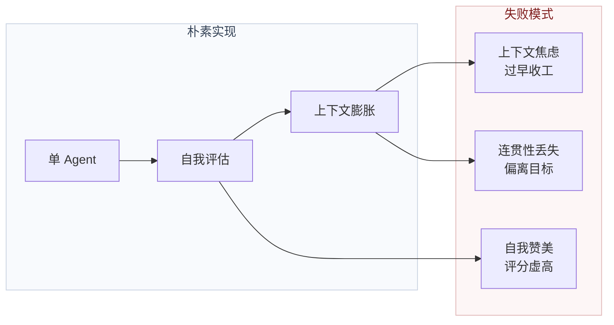
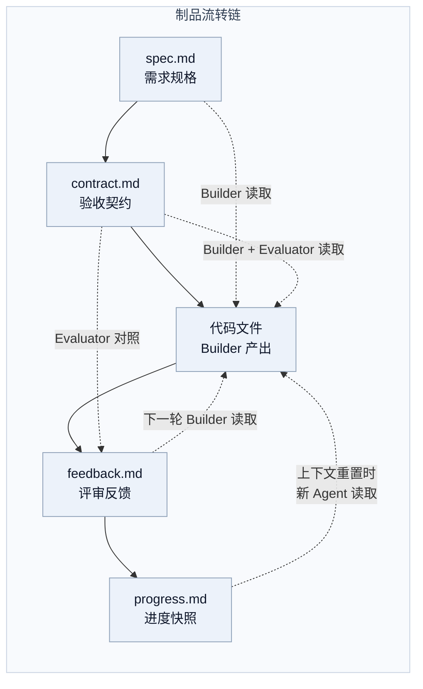
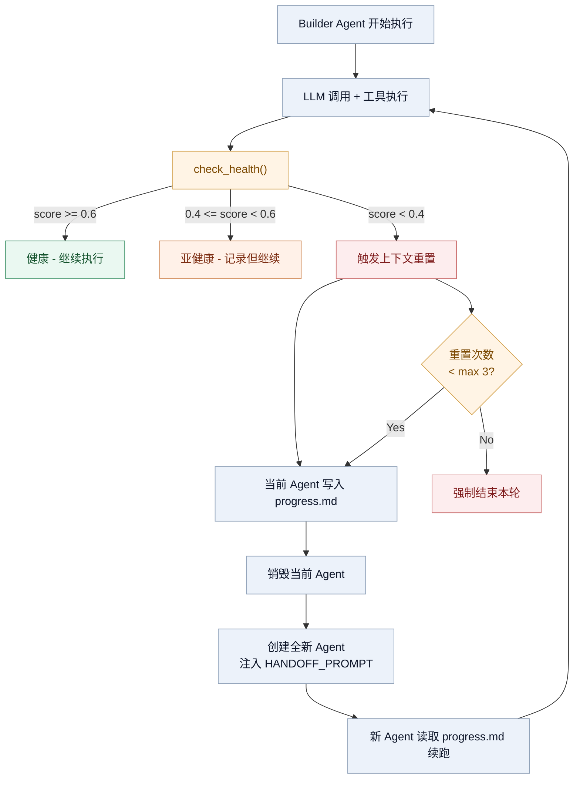
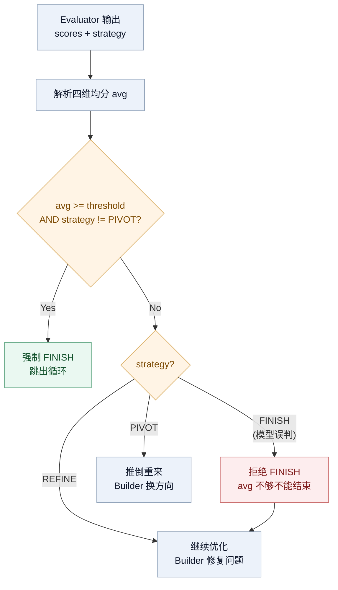

## 引言


在 [上一篇关于 Harness Engineering 的文章](/agent-harness-engineering) 中，我们梳理了 Harness 的概念框架——约束、告知、验证、纠正四个支柱，以及从 Prompt Engineering 到 Context Engineering 再到 Harness Engineering 的演进路径。那篇文章回答了"Harness 是什么"和"为什么需要 Harness"的问题。

本文要回答的是更深一层的问题：**一个具体的 Harness 内部是怎么运转的**。

2026 年 3 月，Anthropic Labs 团队的 Prithvi Rajasekaran 发表了一篇关于长时间运行应用开发 Harness 的深度文章。文章描述了一个受 GAN（生成对抗网络）启发的多 Agent 架构：**生成器**构建代码，**评估器**评审质量，两者形成对抗式反馈循环。这个架构在长达数小时的自主编码会话中，成功输出了包含 16 个功能的完整全栈应用。

下面我们结合 Anthropic 的设计思路和我们自研框架 [CAF](https://github.com/freezesoul/common-agent-framework) 的实际代码，对 Plan→Contract→Build→Evaluate 迭代循环做逐层拆解，重点看循环控制的工程细节：Agent 隔离、上下文健康管理、制品流转、评分解析的防御性设计。

<!-- more -->

## 设计动机：为什么朴素实现会失败

Anthropic 的实验揭示了两个核心失败模式：

**问题一：上下文退化**。随着上下文窗口被填满，模型在冗长任务中容易失去连贯性。部分模型还表现出"上下文焦虑"——接近自认为的上下文限制时就开始过早收尾。压缩（compaction）可以缓解窗口压力，但压缩后的 Agent 仍带着历史包袱，焦虑信号可能持续存在。

**问题二：自我评估偏差**。当被要求评估自己产出的工作时，Agent 倾向于自信地赞美作品——即使对人类观察者来说质量明显平庸。在设计等主观任务中尤为突出，因为不存在二值校验。



这两个问题的解决方案指向同一个架构选择：**分离关注点**。将构建与评估分配给不同的 Agent，通过结构化制品在它们之间传递状态，并在必要时进行完全的上下文重置而非就地压缩。

## 全局架构：三 Agent 协作模型

Harness 的核心是一个受 GAN 启发的三 Agent 系统，外加一个可选的契约生成环节：


在 `CAF` 的实现中，这四个角色由 `HarnessManager` 统一编排。每个角色都是独立的 `PrincipalAgent` 实例，通过文件系统传递制品：

```python
# backend/apps/harness/manager.py — run_session 核心流程
async def run_session(self, session_id, goal, config):
    # 1. Planning
    if config.enable_planner:
        spec = await self._run_phase(session_id, "PLANNING", PLANNER_SYSTEM, goal, config)
        write(os.path.join(ws_dir, "spec.md"), spec)

    # 2. Contract
    if config.enable_contract:
        await self._run_negotiation(session_id, spec, config)

    # 3. 迭代循环
    for round_idx in range(config.max_rounds):
        await self._run_build_with_health(session_id, config, round_idx)
        feedback = await self._run_phase(session_id, "EVALUATING", ...)
        result = self._parse_evaluation(round_idx, feedback, config.score_threshold)

        if result.strategy == "FINISH" or result.score_avg >= config.score_threshold:
            break
```

## 阶段一：Planning — 将模糊需求工程化

Planner 的职责是将用户的一句话需求转化为详尽的技术规格说明书。这个阶段的关键设计决策是**约束规划器关注产品上下文和高层次技术设计，而非细粒度的实现细节**。

原因很实际：如果规划器试图预先指定过于细粒度的技术细节并出了差错，规格中的错误会级联传递到下游实现中。约束 Agent 关注"要交付什么产品"，让后续 Agent 在工作过程中自行摸索"怎么实现"，是更稳健的策略。

```python
# backend/apps/harness/prompts.py — PLANNER_SYSTEM 硬性约束片段
PLANNER_SYSTEM = """
你的唯一合法产出是 spec.md 文件，除此之外不允许产出任何其他文件
绝对禁止编写任何源代码，那是 Builder 的职责
绝对禁止编写验收契约或测试用例，那是 Proposer/Evaluator 的职责
"""
```

Planner 在 `CAF` 中配备了 `web_search` 和 `fetch.text` 工具，使其能够在规格生成前进行技术调研。每轮 Agent 都通过 `_run_phase` 创建全新的 `PrincipalAgent` 实例，使用 `loop` 范式执行（最大 40 步迭代），确保每个阶段的执行隔离。

## 阶段二：Negotiating — 可验证的验收标准

契约协商阶段在 Planner 和 Builder 之间加了一个缓冲。spec.md 有意保持高层次，需要一个步骤把用户故事翻译成可测试的检查项。

Proposer 读取 spec.md，生成包含三个部分的 contract.md：

1. **功能模块与验收标准**：每条标准必须具体、可测试、有预期结果
2. **设计验收标准**：视觉一致性、交互反馈、响应式适配
3. **技术约束**：性能基线、错误处理、数据完整性



在 Anthropic 的原始设计中，契约是通过 Generator 和 Evaluator 双向协商达成的。`CAF` 当前实现为单向 Proposer 生成（`REVIEWER_SYSTEM` 已定义但未启用），这是一个务实的简化——在早期阶段，单向契约生成已足够有效，双向协商的成本尚未证明其价值。

## 阶段三：Build — 带健康监控的构建循环

Build 阶段是整个循环里最复杂的部分。除了代码生成，它还内嵌了一个上下文健康监控子循环，把 Anthropic 文章里的"上下文重置"想法变成了可执行的代码。

### Agent 创建与技能绑定

每轮 Build 都会创建全新的 Agent 实例，并绑定 `frontend-design` 技能：

```python
# backend/apps/harness/manager.py — _run_phase 中的 Agent 配置
if phase == "BUILDING":
    skills = ["frontend-design"]
    skip_skill_routing = False

agent_config = AgentConfig(
    id=f"harness_{phase.lower()}_{uuid.uuid4().hex[:8]}",
    paradigm="loop",
    max_loops=config.max_iterations_per_agent,  # 默认 40
    workspace=config.workspace,
    skills=skills,
    ...
)
```

每次调用 `_run_phase` 都产生独立的 `PrincipalAgent`，意味着每轮 Build 和 Evaluate 的 Agent 是完全隔离的——没有共享内存，没有对话历史泄漏。

### 三层信号：ContextHealthMonitor

这是 `CAF` 对"上下文焦虑"问题的工程化解决方案。通过订阅 EventBus 实时追踪 Agent 的上下文健康状态，使用三层确定性信号判断是否需要重置：

```python
# backend/apps/harness/context_health.py — 三层信号
class ContextHealthMonitor:
    def __init__(self,
        max_context_tokens = 128_000,
        token_warning_ratio = 0.65,    # 信号1: Token 用量到 65% 警告
        token_critical_ratio = 0.80,   #          到 80% 临界
        compression_penalty = 0.20,    # 信号2: 每次压缩扣 0.20 健康分
        shrink_window = 5,             # 信号3: 检测窗口
        shrink_threshold = 0.4,        #          衰减超过 40% 异常
    ):
```

健康分的计算公式为 `score = 1.0 - Σ(各项惩罚)`，三层信号的惩罚逻辑如下：

| 信号       | 检测方式                         | 惩罚计算                    | 阈值                   |
| ---------- | -------------------------------- | --------------------------- | ---------------------- |
| Token 预算 | 最近一次 `input_tokens / 128K` | 线性递增，最高 0.5          | ≥65% 警告，≥80% 临界 |
| 压缩事件   | 框架触发的压缩回调               | 每次 0.20，封顶 0.4         | 每次压缩               |
| 输出衰减   | 最近 5 次均长 vs 前 5 次均长     | `衰减比 × 0.5`，封顶 0.3 | 衰减 >40%              |



上下文重置成败取决于 `progress.md` 的质量。Builder 的 System Prompt 要求在几个关键节点写入进度快照：完成功能模块后、运行测试前、大规模重构前、准备结束时。文件内容覆盖已完成项、进行中工作、未完成项、已知问题和下一步计划。新 Agent 靠这份文件接续工作，写不好就等于白重置。

### 与压缩的本质区别

压缩（compaction）和重置（reset）解决的是不同层面的问题：

| 维度       | 压缩 (Compaction)         | 重置 (Reset)              |
| ---------- | ------------------------- | ------------------------- |
| 上下文状态 | 就地摘要，保留 Agent 身份 | 完全清除，新 Agent 接续   |
| 焦虑缓解   | 不彻底，历史痕迹仍在      | 干净起点，焦虑归零        |
| 信息保留   | 自动摘要（有损）          | 结构化制品（无遗漏）      |
| 编排成本   | 低（同一进程）            | 高（需销毁+创建+handoff） |
| 适用模型   | 上下文焦虑弱的模型        | 上下文焦虑强的模型        |

Anthropic 在使用 Opus 4.6 时能够完全去掉上下文重置，依靠自动压缩处理上下文增长，说明模型能力的提升直接影响了 Harness 的复杂度需求。但 `CAF` 同时支持 DeepSeek 等模型，保留重置机制是一个面向兼容性的务实选择。

## 阶段四：Evaluate — 对抗式评分

Evaluator 是 Harness 中调优成本最高的组件。Anthropic 的经验是："开箱即用时，Claude 是一个糟糕的 QA Agent。它会识别出合法问题，然后说服自己这些问题不是什么大事，最终还是批准了工作。"

### 四维评分体系

评分标准的设计蕴含了一个非对称权重策略：

| 维度     | 英文          | 关注点                         | 权重倾向 |
| -------- | ------------- | ------------------------------ | -------- |
| 设计质量 | Design        | 整体设计感、色彩排版统一性     | 高权重   |
| 原创性   | Originality   | 是否摆脱 AI 默认样式模板       | 高权重   |
| 纯熟度   | Craft         | 技术工艺、间距一致性、细节打磨 | 低权重   |
| 功能性   | Functionality | 核心功能是否可用               | 低权重   |

Claude 在纯熟度和功能性方面默认就得分很高，所需技术能力往往自然具备。但在设计质量和原创性上经常产出乏味的结果。评分标准明确惩罚高度通用的"AI 废话"模式，通过对设计和原创性赋予更高权重，推动模型在审美上更大胆地冒险。

### 结构化评分输出与防御性解析

Evaluator 的输出格式有一个硬性约束：要求在最终回复文本中包含结构化 JSON，不能只在 `feedback.md` 里写评分。

```python
# backend/apps/harness/prompts.py — Evaluator 输出约束
"""
你的最终回复文本中必须包含以下 JSON 代码块:
```json
{
  "scores": {"设计质量": 8.0, "原创性": 7.5, "纯熟度": 8.0, "功能性": 9.0},
  "strategy": "REFINE"
}
```

strategy 仅允许: FINISH | REFINE | PIVOT
"""

```

解析侧采用了三层防御策略：

```python
# backend/apps/harness/manager.py — _parse_evaluation
def _parse_evaluation(self, round_idx, feedback, score_threshold):
    # 第一层: 结构化 JSON 提取
    data = extract_json(feedback)
    if data and isinstance(data, dict):
        scores = data.get("scores", {})
        # key 归一化: design→设计质量, craft→纯熟度...
        strategy = data.get("strategy", "").upper()

    # 第二层: 正则回退
    if not scores:
        scores = self._fallback_parse_scores(feedback)

    # 第三层: 综合得分兜底
    if avg == 0.0:
        match = re.search(r"(综合得分|总分|平均分)\s*[:：]\s*(\d+\.?\d*)", feedback)

    # 终极保障: 分数够就强制 FINISH
    if strategy != "PIVOT" and avg >= score_threshold:
        strategy = "FINISH"
```

这个设计基于一个工程判断：LLM 的输出格式不可能 100% 稳定，与其在 Prompt 端要求完美遵循，不如在解析端多做几层兜底。

### 策略决策逻辑

三个策略值对应不同的迭代行为：



`PIVOT` 有一条特殊规则：即使分数达标，如果策略是 `PIVOT`，系统不会强制 `FINISH`。这是安全阀——当 Evaluator 判断方向完全错误时，某个维度的偶然高分不应成为提前终止的理由。


## Agent 隔离：每次都是全新起点

Harness 最核心的架构决策是**每轮 Agent 都是全新实例**。`_run_phase` 每次调用都创建一个带独立 UUID 的 `PrincipalAgent`：

```python
agent_id = f"harness_{phase.lower()}_{uuid.uuid4().hex[:8]}"
agent: PrincipalAgent = self.factory.create_agent(agent_config)
result = await agent.run(task, context=context, event_bus=self.event_bus)
```

这意味着：

- **无状态泄漏**：Agent 之间没有共享内存或对话历史
- **身份隔离**：每个 Agent 有独立的日志目录和产物追踪
- **上下文干净**：新 Agent 从零开始，只有 system prompt 和文件系统中的制品作为输入

Anthropic 把这种模式叫作"结构化制品传递上下文"。spec.md、contract.md、feedback.md、progress.md 这些文件是 Agent 之间唯一的通信通道。

## 控制参数与调优空间

Harness 的行为由一组可配置参数控制，每个参数背后都有一个关于模型能力的隐含假设：

| 参数                         | 默认值 | 作用                        | 调优考量                       |
| ---------------------------- | ------ | --------------------------- | ------------------------------ |
| `max_rounds`               | 5      | Build-Evaluate 最大迭代次数 | 任务复杂度越高，需要的轮次越多 |
| `score_threshold`          | 8.5    | 四维均分达标线              | 过高导致浪费，过低质量不足     |
| `max_iterations_per_agent` | 40     | 单 Agent 内部循环上限       | 防止单轮 Agent 无限执行        |
| `max_continuations`        | 3      | 单轮 Build 上下文重置上限   | 防止健康监控导致无限重置循环   |
| `enable_planner`           | true   | 是否自动生成 spec           | 简单任务可跳过                 |
| `enable_contract`          | true   | 是否生成验收契约            | 小改动可跳过                   |
| `enable_anxiety_detection` | true   | 是否启用上下文健康监控      | 强模型可关闭                   |

这些参数的合理值取决于底层模型的能力。Anthropic 的经验是：随着模型改进，脚手架可以逐步剥离。从 Opus 4.5 到 Opus 4.6，他们成功移除了冲刺结构和上下文重置。这个参数化设计让同一套 Harness 能够适配不同能力的模型。

## 实现与原始设计的差异

`CAF` 的实现并非对 Anthropic 设计的简单复刻，而是基于实际约束的工程调整：

| 方面        | Anthropic 原始设计                 | CAF 实现                                               |
| ----------- | ---------------------------------- | ------------------------------------------------------ |
| 上下文管理  | Opus 4.6 靠自动压缩，不需重置      | ContextHealthMonitor 三层信号 + 手动重置（适配多模型） |
| Sprint 结构 | V2 已移除冲刺分解                  | 无冲刺，单轮连续 Build，依据 progress.md 跟进          |
| 契约协商    | 双向协商（Generator ↔ Evaluator） | 单向 Proposer 生成（双向预留未启用）                   |
| 评分标准    | 设计质量/原创性/工艺/功能性        | 相同四维，非对称权重                                   |
| 执行框架    | Claude Agent SDK                   | 自研框架（loop 范式 + PrincipalAgent）                 |
| 持久化      | 文件系统                           | 文件系统                                               |

最大的差异在上下文健康管理。Anthropic 用 Opus 4.6 可以依赖自动压缩，`CAF` 要支持 DeepSeek 等上下文焦虑更明显的模型，所以把 ContextHealthMonitor 做成了一等公民。三层信号组合检测比单一阈值判断更稳：Token 预算反映物理约束，压缩事件反映框架行为，输出衰减反映模型心理状态，三者交叉验证降低了误判。

## 循环的本质：对抗即质量

回到 GAN 的比喻。生成器天然倾向走捷径、做桩实现、用模板化设计。评估器被调教成持怀疑态度的 QA，专门找这些毛病。两者形成的对抗压力，就是 Harness 循环推进质量的驱动力。

我们在 CAF 中进行了一次 Roguelike 游戏开发的实际测试，以"创建一个完整的 Roguelike 地牢探索游戏"为目标，整个会话持续了约 90 分钟，历经 4 轮 Build-Evaluate 迭代：

| 轮次    | Agent     | 时长    | 关键发现                           |
| ------- | --------- | ------- | ---------------------------------- |
| 规划    | Planner   | 5 分钟  | 一句话需求 → 完整游戏设计规格     |
| 第 1 轮 | Builder   | 28 分钟 | 搭建项目结构 + 基础战斗与地图系统 |
| 第 1 轮 | Evaluator | 3 分钟  | "地图生成过于简单，缺乏随机性"    |
| 第 2 轮 | Builder   | 22 分钟 | 过程化地图生成 + 物品与装备系统   |
| 第 2 轮 | Evaluator | 3 分钟  | "敌人 AI 行为单一，缺乏战术深度"  |
| 第 3 轮 | Builder   | 16 分钟 | AI 行为树 + 迷雾系统 + UI 重构    |
| 第 3 轮 | Evaluator | 3 分钟  | "存档与难度递进机制缺失"          |
| 第 4 轮 | Builder   | 8 分钟  | 存档系统 + 难度曲线 + 最终打磨    |
| 第 4 轮 | Evaluator | 3 分钟  | 验收通过                           |

第 1 轮 Builder 用 28 分钟搭建了项目骨架和基础系统，Evaluator 仅 3 分钟就精准点出"地图生成缺乏随机性"——这正是 Roguelike 的核心特征。后续每轮迭代都沿着"构建→暴露短板→针对修复"的路径推进：地图从硬编码演进为过程化算法，敌人从简单巡逻升级为战术行为树，最终在第 4 轮补齐存档与难度系统后通过验收。看起来能工作和真正能工作之间的差距，就这样一轮一轮被磨掉。

回看 [Harness Engineering](/agent-harness-engineering) 一文提出的四个支柱——约束、告知、验证、纠正，Plan→Contract→Build→Evaluate 循环是这四个支柱的一次完整闭合：Contract 把模糊需求翻译成可测试标准（告知），Builder 的 System Prompt 划定职责边界（约束），Evaluator 独立对照契约逐条校验（验证），REFINE/PIVOT 反馈驱动下一轮修复（纠正）。

前文说"决定 Agent 产出质量的最大变量，往往不是模型有多聪明，而是模型被放在了一个什么样的环境里"。这篇拆解展示的就是这个"环境"的具体构造：三层信号监控器、Agent 隔离实例、制品流转链、防御性评分解析。每个组件的背后都是朴素实现踩过的坑。

**参考资料**：

- [Harness design for long-running application development — Anthropic](https://www.anthropic.com/engineering/harness-design-for-long-running-application-development)
- [Effective harnesses for long-running agents — Anthropic](https://www.anthropic.com/engineering/effective-harnesses-for-long-running-agents)
- [Common-Agent-Framework — GitHub](https://github.com/freezesoul/common-agent-framework)
- [Harness Engineering：构建让 AI Agent 可靠工作的系统工程](/agent-harness-engineering)
