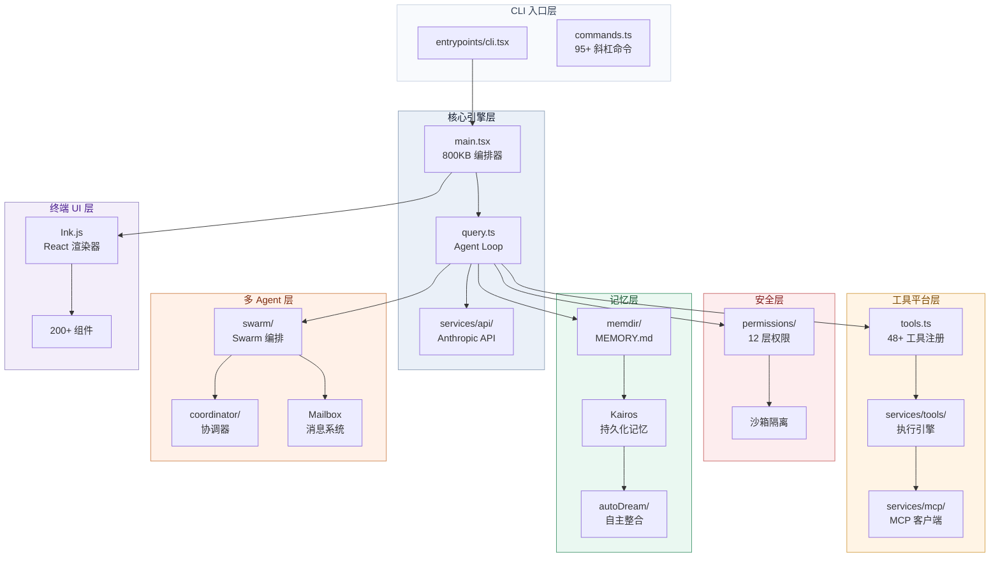
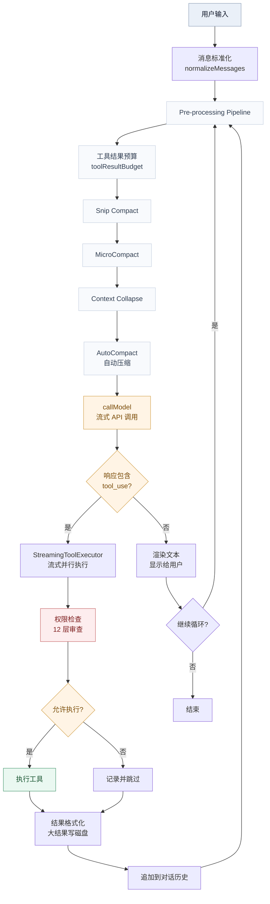
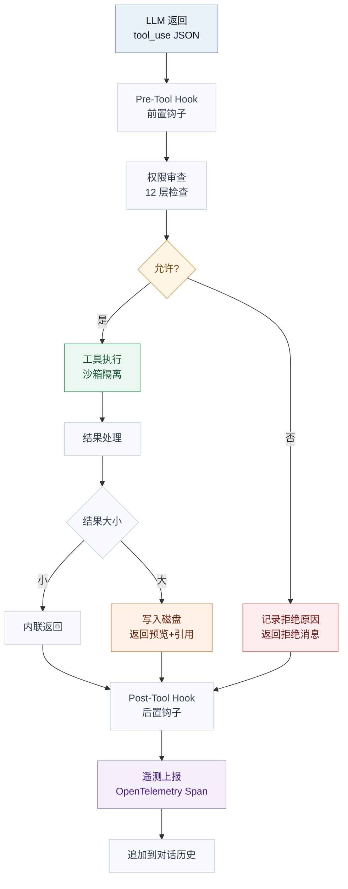
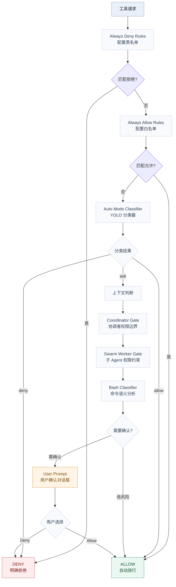
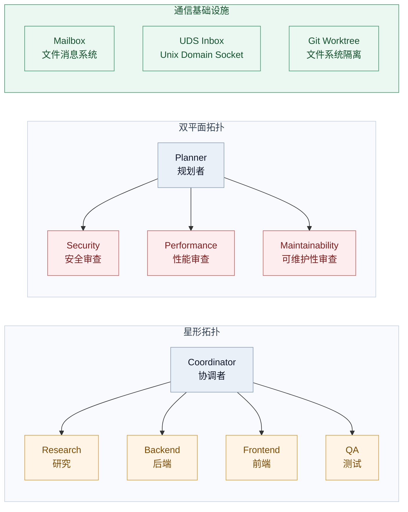
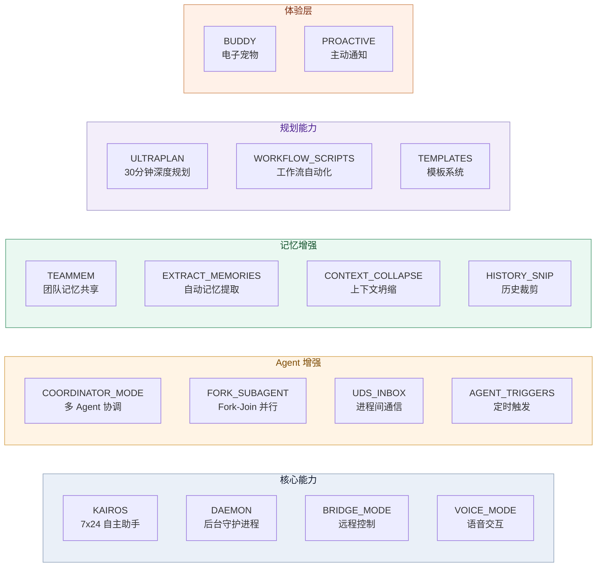
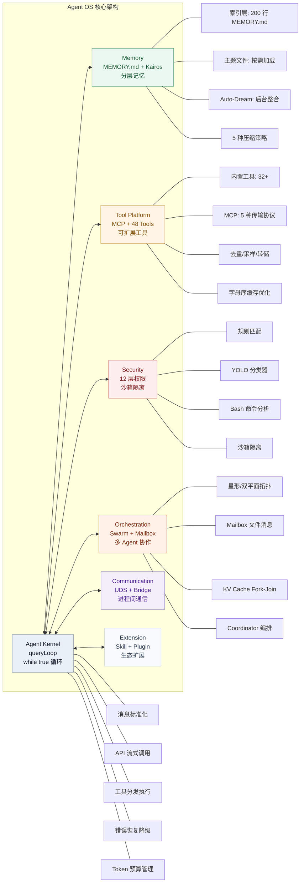

## 引言


2026 年 3 月 31 日，Anthropic 在发布 Claude Code v2.1.88 时，因构建配置错误将一个 59.8MB 的 JavaScript Source Map 文件一同打包到了 npm 仓库。这个 `cli.js.map` 未经任何混淆，包含了完整的 TypeScript 源码——512,000 行代码，1,900 个文件。安全研究员 Chaofan Shou 最先发现了这个问题，消息传出后，GitHub 上迅速出现了多个镜像仓库，其中 instructkr/claude-code 在数小时内积累了数万颗星。Anthropic 随即发送 DMCA 删除请求，但代码早已四处传播。

事件经过就这些，不再赘述。本文关注的是另一个问题：**这 51 万行代码到底揭示了什么工程真相？**

本文逐层拆解一个生产级 AI Agent 的内部构造：代码怎么组织的，核心循环怎么运转的，48 把工具怎么调度的，权限怎么设防的，记忆怎么设计的，多 Agent 怎么编排的，Feature Flag 背后藏着什么。

所有引用都来自实际源码文件、函数签名和行号。

<!-- more -->

## 代码解剖学：51 万行代码的组织方式

### 数字背后的工程规模

先看一组直接从源码中统计出来的数字：

| 维度          | Claude Code                 | 典型开源 Agent 框架 |
| ------------- | --------------------------- | ------------------- |
| 代码行数      | ~512,000 LOC                | 5,000 - 50,000 LOC  |
| 源文件数      | 1,900+                      | 50 - 200            |
| 主入口文件    | `main.tsx` 800KB+         | 通常单文件 < 100KB  |
| 内置工具      | 48+（含 16+ Feature Gated） | 5 - 15              |
| 斜杠命令      | 95+                         | 0 - 10              |
| React Hooks   | 100+                        | N/A                 |
| UI 组件       | 200+                        | N/A                 |
| Feature Flags | 44+（编译时门控）           | 0 - 5               |
| 构建产物      | 59.8MB Source Map           | N/A                 |

Claude Code 的工程复杂度与一个中型 Web 应用相当，远非"调 API + 拼工具"的简单包装。Sebastian Raschka 的评价直指要害："Claude Code 相比网页版 Claude 的优势不在于更好的模型，而在于围绕模型构建的软件基础设施。"

### 目录结构与模块划分

从泄露源码的顶层目录来看，系统被组织为以下几个核心区域：

```
src/
├── main.tsx              # 主入口（800KB+），编排所有子系统
├── query.ts              # Agent 核心循环（1730 行）
├── QueryEngine.ts        # 查询引擎（48KB）
├── tools.ts              # 工具注册表
├── Tool.ts               # 工具类型定义
├── commands.ts           # 95+ 斜杠命令注册
├── entrypoints/          # CLI、MCP、Agent SDK 入口
├── components/           # 200+ 终端 UI 组件（React/Ink）
├── hooks/                # 100+ React Hooks
├── services/             # 核心服务层
│   ├── api/              # Anthropic API 通信
│   ├── compact/          # 上下文压缩（62KB 核心逻辑）
│   ├── tools/            # 工具执行引擎（62KB）
│   ├── mcp/              # MCP 客户端（122KB）
│   ├── analytics/        # 遥测与 GrowthBook A/B 测试
│   ├── autoDream/        # 自主记忆整合
│   ├── voice/            # 语音模式
│   └── plugins/          # 插件系统
├── utils/
│   ├── permissions/      # 权限系统（permissions.ts 54KB）
│   ├── swarm/            # Swarm 编排（inProcessRunner 55KB）
│   ├── memory/           # 记忆工具
│   └── hooks.ts          # 生命周期 Hook 系统（165KB）
├── memdir/               # 记忆持久化（MEMORY.md + Kairos）
├── buddy/                # Buddy 电子宠物系统
├── coordinator/          # 多 Agent 协调器
├── bridge/               # 远程控制/会话桥接
├── voice/                # 语音输入
├── skills/               # Skill 加载系统
├── state/                # 应用状态管理（React）
├── tools/                # 各工具独立实现
│   ├── AgentTool/        # 子 Agent 工具
│   └── ...
├── migrations/           # 模型迁移（如 fennec → opus）
└── types/                # TypeScript 类型定义
```

几个值得注意的点：

- `services/compact/` 有 10 个文件，总计 146KB，光上下文压缩就比很多 Agent 框架的完整代码量还大
- `services/mcp/client.ts` 单文件 122KB，说明 MCP 集成的复杂度远超"连个 MCP 服务器"
- `utils/hooks.ts` 165KB，覆盖了 30+ 种生命周期事件
- `buddy/` 目录有独立的类型系统、生成算法、精灵渲染和 React 动画组件

### 构建系统：Feature Gate 机制

Claude Code 的构建系统揭示了它管理复杂度的核心手段——**编译时 Feature Gate**。

构建流程分四个阶段（`scripts/build.mjs`）：

1. **复制**：`src/` → `build-src/`
2. **转换**：将 `feature('X')` 调用替换为 `false`，将 `MACRO.VERSION` 替换为字面量 `'2.1.88'`
3. **入口包装**：创建 entry wrapper
4. **esbuild 打包**：最多 5 轮迭代，自动为缺失模块创建 stub

关键在于第 2 步。当 `feature('KAIROS')` 被替换为 `false` 时，Bun 的 dead code elimination 会把整个 `if (feature('KAIROS')) { ... }` 分支从编译产物中移除。这意味着：

- 公开版本中，44+ 个实验性功能的代码**根本不存在**
- 外部构建中的 `bashClassifier.ts` 是一个空壳，所有函数都是 no-op
- 模型代号（capybara、fennec、numbat）通过 `scripts/excluded-strings.txt` 在编译时被过滤

这也是为什么泄露的 Source Map 如此有价值——它包含了被 dead code elimination 移除之前的**完整源码**。

### 全局架构一览

将所有子系统组合起来，Claude Code 的整体架构可以用一张图概括：



Claude Code 是分层的，但不是简单的垂直分层。Query Engine 是唯一的中心节点，同时驱动工具调度、权限检查、记忆访问和多 Agent 编排。核心循环因此保持简洁，复杂度分散到各子系统。

接下来，我们深入每个子系统的内部实现。

## 心脏解剖：QueryEngine 的实现真相

### queryLoop()——一个 while(true) 驱动的世界

Claude Code 的心脏在 `src/query.ts`。这个文件 1730 行，导出了两个关键函数：

- `query()`（第 219 行）：公开入口，一个 `AsyncGenerator`，对外 yield 每一轮迭代的结果
- `queryLoop()`（第 241 行）：内部循环，包含那个决定一切的 `while(true)`（第 307 行）

整个 Agent Loop 的核心理念：LLM 决定做什么，程序决定是否允许做，然后程序去执行，执行结果喂回 LLM 继续循环。

本质上是受约束的 ReAct 模式。Claude Code 岼得拆解的是实现精度和工程完成度。

### 完整执行路径

一次完整的 queryLoop 迭代经历以下阶段：



这条路径中有几处设计值得展开。

### Pre-processing Pipeline：五道压缩关卡

每次 API 调用之前，queryLoop 并不是直接把全部对话历史丢给模型。它会依次经过五道压缩关卡（`src/query.ts` 第 365-448 行）：

1. **Tool Result Budget**：为工具结果设定 token 预算，防止单次工具调用返回过多内容
2. **Snip Compact**（`HISTORY_SNIP` feature gate）：对历史消息做轻量裁剪
3. **MicroCompact**（`CACHED_MICROCOMPACT` feature gate）：对单个工具结果做精细压缩
4. **Context Collapse**（`CONTEXT_COLLAPSE` feature gate）：上下文坍缩，一种更激进的压缩策略
5. **AutoCompact**：当 token 用量接近阈值时自动触发完整压缩

每道关卡都有独立的 Feature Gate 控制，意味着 Anthropic 可以在不发版的情况下，通过 GrowthBook A/B 测试不同的压缩策略组合。

### 流式工具执行：不等全部返回就开始干活

`src/query.ts` 第 562-563 行揭示了一个关键优化：**StreamingToolExecutor**。

传统 Agent 实现是等 LLM 的完整响应返回后，再依次执行所有工具调用。Claude Code 不是这样做的——它在 LLM 流式返回 `tool_use` 块时，就开始并行执行已经到达的工具。这意味着：

- LLM 还在生成后续的 tool_use 时，前面的工具已经在执行了
- 多个工具调用之间如果是独立的，可以真正并行运行
- 总延迟约等于"最慢的那个工具"而非"所有工具之和"

### 错误恢复：三层降级策略

queryLoop 的错误处理（第 1062-1355 行）揭示了一个生产系统才需要的**三层降级策略**：

**第一层：max_output_tokens 溢出恢复**

当模型输出被截断（token 用完）时：

- 自动将 `max_output_tokens` 从 8k 提升到 64k
- 最多重试 3 次（`MAX_OUTPUT_TOKENS_RECOVERY_LIMIT = 3`，第 164 行）
- 通过 `yieldMissingToolResultBlocks` 生成器（第 123 行）补齐缺失的工具结果

**第二层：prompt_too_long 降级**

当上下文超出模型窗口时：

- 触发 Reactive Compact（`REACTIVE_COMPACT` feature gate）
- 压缩后再重试
- 如果压缩后仍然过长，报错退出

**第三层：流式回退到备选模型**

当主力模型不可用时：

- 自动切换到备选模型继续流式响应
- 比如从 capybara 切换到 opus（`src/query.ts` 第 925 行会返回 400 错误，提示不允许跨模型切换）

这三层降级策略确保了在异常情况下，Agent 不会直接崩溃，而是尝试降级恢复。

### Token 预算管理

`TOKEN_BUDGET` feature gate（第 280 行）控制着一个精细的 token 预算系统。系统会：

1. 计算当前上下文已用 token 数
2. 减去保留给系统提示和工具结果的空间
3. 得到可用的 token 预算
4. 如果预算不足，按优先级压缩：先压缩工具结果，再压缩历史消息，最后压缩系统提示

`autoCompact.ts` 中的关键常量（第 62 行）：`AUTOCOMPACT_BUFFER_TOKENS = 13_000`。这意味着当剩余空间低于 13k token 时，自动压缩就会被触发。这个值不是拍脑袋定的——13k token 大约是 8000-10000 个英文单词，足够模型完成一轮完整的推理和工具调用。

### 缓存策略：静态与动态的边界线

Sebastian Raschka 特别提到的一个优化点——**激进的 Prompt 缓存复用**——在源码中有明确的实现。系统提示被一个边界标记分为静态和动态两部分：

- **静态部分**：系统角色定义、工具描述、安全规则。这些内容在会话间不变，可以全局缓存，不需要每次重新处理
- **动态部分**：当前文件内容、对话历史、工具结果。这些随会话变化，需要每次重新计算

这种分离使得 API 调用的前缀（prefix）在多轮对话中保持稳定，最大化了 Anthropic 的 Prompt Caching 命中率。在 `src/tools.ts` 第 362 行甚至有一个明确的要求：工具列表必须按字母序排列（`assembleToolPool` 函数），因为工具定义是系统提示的一部分，排序保证了缓存前缀的一致性。

## 工具平台：48 把手术刀的设计哲学

### 工具注册表：代码中的事实来源

`src/tools.ts` 是工具系统的"事实来源"。`getAllBaseTools()` 函数（第 193 行）返回所有可用工具实例的数组。这个函数使用条件注册模式——不同的工具根据环境和 Feature Flag 被有条件地包含。

完整的 48+ 工具可以归为 8 个类别：

| 类别                   | 工具                                                                                                                                                               | 状态               |
| ---------------------- | ------------------------------------------------------------------------------------------------------------------------------------------------------------------ | ------------------ |
| **文件操作**     | FileReadTool, FileEditTool, FileWriteTool, GlobTool, GrepTool, NotebookEditTool                                                                                    | 始终启用           |
| **命令执行**     | BashTool, PowerShellTool                                                                                                                                           | 始终启用           |
| **Web 操作**     | WebFetchTool, WebSearchTool, WebBrowserTool                                                                                                                        | WebBrowser 受 Gate |
| **Agent 与任务** | AgentTool, SendMessageTool, TaskCreateTool, TaskUpdateTool, TaskListTool, TaskGetTool, TaskOutputTool, TaskStopTool, TeamCreateTool, TeamDeleteTool, ListPeersTool | 部分受 Gate        |
| **规划与隔离**   | EnterPlanModeTool, ExitPlanModeTool, EnterWorktreeTool, ExitWorktreeTool, VerifyPlanExecutionTool                                                                  | 部分受 Gate        |
| **MCP 集成**     | MCPTool, ListMcpResourcesTool, ReadMcpResourceTool, McpAuthTool                                                                                                    | 始终启用           |
| **系统辅助**     | AskUserQuestionTool, TodoWriteTool, SkillTool, ConfigTool, CronCreateTool, CronDeleteTool, CronListTool, SnipTool, WorkflowTool, TerminalCaptureTool               | 部分受 Gate        |
| **实验性**       | SleepTool, PushNotificationTool, SubscribePRTool, SendUserFileTool, LSPTool, ToolSearchTool                                                                        | 全部受 Gate        |

"受 Gate"意味着这些工具被 Feature Flag 控制，在公开构建中不包含或行为不同。比如 `SleepTool` 只在 `PROACTIVE` 或 `KAIROS` 启用时才存在——它让 Agent 可以在任务间暂停，这是后台自主运行模式才需要的能力。

### 工具执行 Pipeline

一个工具从被 LLM 选中到结果返回，经历六个阶段：



`src/services/tools/toolExecution.ts`（62KB）是这个 Pipeline 的实现所在。几个关键细节：

**Hook 阶段**（第 134、137 行定义的阈值）：

- `HOOK_TIMING_DISPLAY_THRESHOLD_MS = 500`：Hook 执行超过 500ms 时才在 UI 显示耗时
- `SLOW_PHASE_LOG_THRESHOLD_MS = 2000`：超过 2 秒的慢查询会记录到日志

**遥测**：每个工具执行都会生成 OpenTelemetry Span，包括权限来源映射（`ruleSourceToOTelSource`，第 181 行）：

- `session` → `user_temporary`（会话级允许）或 `user_reject`（会话级拒绝）
- `localSettings`/`userSettings` → `user_permanent`（持久配置）
- 其他 → `config`

### 三个关键优化

**优化一：文件读取去重**

当多个工具调用需要读取同一个文件时，系统只读取一次，然后在所有工具调用间共享结果。这在 Agent 同时执行 grep + glob + fileread 的场景下特别有效——避免了对同一文件的重复 I/O 和重复 token 消耗。

**优化二：工具结果采样**

对于 grep、glob 等可能返回大量匹配结果的工具，系统不会将全部结果都塞进上下文。它做智能采样——返回足够让 LLM 理解当前状态的信息量，而非穷举。这是一个关键的工程决策：LLM 不需要看到全部 500 个搜索结果才能做出正确决策，20 个代表性结果通常就够了。

**优化三：大结果磁盘转储**

当工具结果超过一定大小时（`src/utils/toolResultStorage.ts` 39KB 的实现），系统会将完整结果写入磁盘文件，只在上下文中保留一个预览摘要和文件引用。LLM 如果需要查看完整内容，可以再次发起 FileRead 调用。这种"按需加载"的设计避免了上下文被单个工具结果撑爆。

### MCP 集成：122KB 的客户端意味着什么

`src/services/mcp/client.ts` 单文件 122KB。MCP 集成不是一个简单的 JSON-RPC 包装器。

这个客户端支持五种传输协议：

1. **Stdio**：标准输入/输出子进程
2. **SSE**：Server-Sent Events HTTP
3. **Streamable HTTP**：更新的 HTTP 传输
4. **WebSocket**：自定义实现（`src/utils/mcpWebSocketTransport.ts`）
5. **SDK Control**：编程式 SDK 控制（`SdkControlClientTransport`）

除了传输层，客户端还处理：OAuth 认证（`ClaudeAuthProvider`）、代理配置、TLS/mTLS 双向认证、内容截断。`McpAuthError`（第 149 行）专门处理认证失败（如 OAuth 401 过期），`McpToolCallError` 处理工具调用失败。

`MCP_SKILLS` feature gate（第 117 行）控制着一个更高级的功能——MCP 服务器可以注册为 Skill，提供专业知识和工作流指导，而不仅仅是工具调用。

## 安全护城河：渐进式权限体系

### 从"6 层"到更完整的图景

之前的社区分析普遍将 Claude Code 的权限系统描述为"6 层检查"。源码揭示的实际结构比这更复杂——它是一个**渐进式权限体系（Progressive Harness）**，包含多个维度的检查机制，每个维度解决不同类型的安全问题。

权限系统的核心代码分布在 `src/utils/permissions/` 目录下：

| 文件                        | 大小  | 职责                             |
| --------------------------- | ----- | -------------------------------- |
| `permissions.ts`          | 54KB  | 权限规则收集与决策               |
| `filesystem.ts`           | 64KB  | 文件操作权限验证                 |
| `yoloClassifier.ts`       | 54KB  | 自动执行模式分类器               |
| `bashClassifier.ts`       | 62 行 | Bash 命令分类（外部构建为 stub） |
| `pathValidation.ts`       | 17KB  | 路径安全验证                     |
| `dangerousPatterns.ts`    | -     | 危险模式检测                     |
| `permissionRuleParser.ts` | -     | 规则解析器                       |
| `permissionSetup.ts`      | 54KB  | 权限初始化                       |

### 权限决策流程

当一个工具请求执行时，权限系统的决策流程如下：



每一层解决不同类型的安全问题，任何单层失效都不会导致系统整体失效——这是经典的纵深防御。

### YOLO Classifier：用 LLM 判断能不能自动执行

`src/utils/permissions/yoloClassifier.ts`（54KB）是最有趣的安全组件。它的名字就说明了一切——YOLO（You Only Live Once），一种激进的自动执行策略。

这个分类器的工作方式是：**用一个独立的 LLM 调用来判断另一个 LLM 的工具调用是否安全。** 它有两套 Prompt 模板：

- `permissions_external.txt`：给外部用户（通过 `TRANSCRIPT_CLASSIFIER` feature gate 控制）
- `permissions_anthropic.txt`：给 Anthropic 内部用户（`USER_TYPE === 'ant'`）

分类器返回三种结果：

- `allow`：自动放行（如只读操作、查看 git status）
- `deny`：直接拒绝（危险操作）
- `ask`：交给用户确认

为了防止分类器本身成为性能瓶颈，它有 30 分钟的缓存（`CLASSIFIER_FAIL_CLOSED_REFRESH_MS = 30 * 60 * 1000`，第 107 行）。缓存失效时，分类器默认"fail closed"——宁可多问用户，也不冒险自动执行。

### Bash Classifier：为什么外部构建里是个空壳

`src/utils/permissions/bashClassifier.ts` 只有 62 行，所有函数都是 no-op——返回空数组或 `false`。文件第一行的注释解释了原因："Stub for external builds - classifier permissions feature is ANT-ONLY"。

这意味着真正的 Bash 命令分类逻辑是 Anthropic 内部专有的，在公开构建中被完全移除。外部构建中的 Bash 命令权限完全依赖规则匹配和用户确认。

这是一个有趣的工程选择：Anthropic 认为命令分类器本身是竞争优势的一部分，不愿意让它在公开版本中可用。

### Undercover Mode：一个自相矛盾的安全特性

`src/utils/undercover.ts` 是泄露源码中最具争议的功能之一。这个模式的设计目的是"让 Claude 假装是人类开发者"：

激活规则：

- `CLAUDE_CODE_UNDERCOVER=1` 强制开启
- 否则自动判断：如果仓库 remote 不在 `INTERNAL_MODEL_REPOS` 白名单中，默认开启
- **无法强制关闭**——不在内部仓库中就是开启状态

开启后，它会注入一个严格的系统提示，禁止暴露：

- 模型代号（动物名称如 Capybara、Tengu）
- 未发布的版本号
- 内部仓库和项目名称
- 任何提及"Claude Code"或 AI 归属的内容
- Co-Authored-By 行

讽刺的是，这个试图隐藏内部代号的功能本身也被泄露了。所有代码路径都通过 `process.env.USER_TYPE === 'ant'` 进行门控——只有 Anthropic 员工才能使用这个功能。

### 权限规则来源

`permissions.ts` 第 109-114 行定义了所有权限规则的来源：

- `SETTING_SOURCES`：包括项目级配置（`.claude/settings.json`）和用户级配置（`~/.claude/settings.json`）
- `cliArg`：命令行参数指定的权限模式
- `command`：斜杠命令（如 `/permissions`）设定的临时规则
- `session`：当前会话中用户通过确认对话框建立的临时允许/拒绝

拒绝行为还有节流机制（第 95-101 行）：`DENIAL_LIMITS` 控制连续拒绝后的回退策略——如果用户连续拒绝同一类型的操作，系统会自动切换到更严格的模式。

## 记忆系统：从 MEMORY.md 到自主梦境

### 三层会话记忆的代码实现

Claude Code 的记忆系统不是什么都存，它是一个受限的、结构化的记忆机制，具备自愈能力。核心实现在 `src/memdir/` 目录下。

**第一层：MEMORY.md 索引目录**

`src/memdir/memdir.ts` 第 34-35 行定义了关键约束：

- `ENTRYPOINT_NAME = 'MEMORY.md'`
- `MAX_ENTRYPOINT_LINES = 200`（最多 200 行）
- `MAX_ENTRYPOINT_BYTES = 25,000`（最大 25KB）

MEMORY.md 不是一个传统的"记忆文件"，而是一个**索引目录**——它只包含指向其他知识文件的引用。这种设计实现了**懒加载**：LLM 只需要知道"我有哪些知识可以访问"，需要时再加载具体内容。

`truncateEntrypointContent` 函数（第 57 行）负责强制执行这些约束——如果 MEMORY.md 超过 200 行或 25KB，它会被自动截断。这是一种防御性设计：防止记忆无限膨胀。

**第二层：按需加载的主题文件**

当 LLM 决定需要某个主题的知识时，系统从 `.claude/` 目录加载对应的主题文件。这些文件包含 frontmatter 元数据，使 LLM 能快速判断文件相关性。

**第三层：完整会话转录**

第三层是会话本身的完整记录。压缩（Compaction）机制在这里发挥作用——系统周期性地将长对话压缩为摘要，控制上下文增长。

### 记忆类型系统：四类与"绝对不记"清单

`src/memdir/memoryTypes.ts` 定义了四种记忆类型：

| 类型          | 用途                 | 可见性                 |
| ------------- | -------------------- | ---------------------- |
| `user`      | 用户画像、偏好、知识 | 始终私有               |
| `feedback`  | 纠正、验证过的方法   | 默认私有，团队共享惯例 |
| `project`   | 进行中的工作、决策   | 偏向团队共享           |
| `reference` | 指向外部系统的指针   | 通常团队共享           |

但更有设计感的是**"绝对不记"清单**（第 183 行 `WHAT_NOT_TO_SAVE_SECTION`）。这个清单明确列出了**不应该占用记忆空间的内容**：

- 代码模式和约定——从代码本身就能推导
- Git 历史和最近变更——`git log` / `git blame` 是权威来源
- 调试解决方案——修复已经在代码中，上下文在 commit message 里
- 已在 CLAUDE.md 中记录的内容——避免重复
- 临时任务细节——当前对话上下文，不需要持久化

这个清单的逻辑：记忆空间有限，只存那些无法从其他来源推导的信息。代码模式能从代码读到，Git 历史用命令查到——不值得浪费记忆容量。

### 记忆防护三道防线

记忆系统有三道防线防止记忆退化：

**防线一：漂移防护**

记忆可能过时。在使用记忆前，系统会验证引用的文件是否还存在、描述的状态是否仍然有效。`MEMORY_DRIFT_CAVEAT`（第 201 行）明确警告 LLM："记忆可能变得过时。在使用记忆前，验证它仍然正确。"

**防线二：膨胀检查**

单个记忆文件超过 5KB 时会被自动瘦身。结合 MEMORY.md 的 200 行上限，整个记忆系统的总量被严格控制在可控范围内。

**防线三：写入过滤**

写入记忆前，系统会问一个问题："这条信息 6 个月后还有用吗？"如果答案是"否"，就不写。这过滤掉了大量临时性、情境性的信息。

### Kairos：四阶段记忆巩固 Pipeline

`KAIROS` feature gate 控制着最深层的记忆系统——一个模仿人类记忆巩固过程的四阶段 Pipeline：

1. **Orient（定向）**：扫描当前上下文，识别什么内容是重要的
2. **Collect（收集）**：从会话中提取事实、决策和模式
3. **Consolidate（整合）**：将新记忆与长期存储合并
4. **Prune（修剪）**：丢弃过时或低价值的记忆

Kairos 不仅是个人记忆系统，还支持**团队记忆路径**——一个团队的所有 Claude Code 实例可以共享记忆。`TEAMMEM` feature gate 控制着这个功能，团队记忆存储在 `~/.claude/teams/{team_name}/memory/` 目录下。

### Auto-Dream：会话间的自主记忆整理

`src/services/autoDream/` 是 Kairos 的后台执行引擎。它的设计灵感来自人类睡眠中的记忆巩固——在你不用 Claude Code 的时候，它在后台整理"学到"的东西。

Auto-Dream 的门控系统展示了多层成本控制：

1. **时间门控**：距离上次整合至少 24 小时（`minHours: 24`）
2. **会话门控**：时间门控通过后，还需要至少 5 个会话被触及（`minSessions: 5`）
3. **文件锁**：`consolidationLock.ts` 确保没有其他进程正在整合

Auto-Dream 使用 `runForkedAgent()` 创建一个受限的子 Agent，只拥有只读 Bash 权限，在 `.claude/` 目录中执行四阶段整理操作。整个执行过程由 `tengu_onyx_plover` GrowthBook flag 控制。

### 五种 Compaction 策略

`src/services/compact/` 目录（10 个文件，146KB）实现了五种上下文压缩策略：

| 文件                        | 大小 | 策略                                             |
| --------------------------- | ---- | ------------------------------------------------ |
| `compact.ts`              | 62KB | 完整对话压缩，`compactConversation()` 生成摘要 |
| `microCompact.ts`         | 20KB | 单个工具结果的精细压缩                           |
| `sessionMemoryCompact.ts` | 21KB | 会话记忆压缩                                     |
| `apiMicrocompact.ts`      | 5KB  | API 驱动的微压缩                                 |
| `autoCompact.ts`          | 13KB | 自动压缩触发逻辑                                 |

`autoCompact.ts` 中的关键参数（第 62 行）：`AUTOCOMPACT_BUFFER_TOKENS = 13,000`——当剩余 token 低于 13k 时触发压缩。同时有一个熔断器（第 70 行）：`MAX_CONSECUTIVE_AUTOCOMPACT_FAILURES = 3`——如果压缩连续失败 3 次，就停止尝试，避免陷入"压缩→失败→再压缩"的死循环。

## 多 Agent 编排：Swarm、Mailbox 与 Fork-Join

### Agent 拓扑：星形与双平面

泄露代码中的 Swarm 系统支持两种主要拓扑：

**星形拓扑（Manager + N Specialists）**：一个协调者 Agent 管理多个专业 Worker。每个 Worker 可以是不同类型的专家——研究专家、后端专家、前端专家、测试专家。协调者负责任务分解、Worker 调度和结果综合。

**双平面拓扑（Plan + Parallel Review）**：一个规划 Agent 生成方案，然后多个评审 Agent 并行审查。这种模式特别适合代码审查场景——多个审查者从不同角度（安全性、性能、可维护性）并行评审。



### Mailbox 消息机制

`src/utils/teammateMailbox.ts` 实现了 Agent 间的消息传递。这不是一个复杂的消息队列，而是一个基于文件系统的简洁设计：

**收件箱路径**：`~/.claude/teams/{team_name}/inboxes/{agent_name}.json`

**消息类型**覆盖了多 Agent 协作的全部场景：

| 消息类型                               | 方向             | 用途                                         |
| -------------------------------------- | ---------------- | -------------------------------------------- |
| `TeammateMessage`                    | 双向             | 基本消息传递                                 |
| `idle_notification`                  | Worker → Leader | 通知空闲状态（available/interrupted/failed） |
| `permission_request/response`        | Worker → Leader | 权限请求代理                                 |
| `plan_approval_request/response`     | Worker → Leader | 计划审批                                     |
| `shutdown_request/approved/rejected` | Leader → Worker | 优雅关闭                                     |
| `task_assignment`                    | Leader → Worker | 任务委派                                     |
| `team_permission_update`             | Leader → 全体   | 广播权限变更                                 |

并发控制使用 `proper-lockfile` 进行文件锁，带重试机制：10 次重试，5ms 最小超时，100ms 最大超时。这种选择说明 Anthropic 优先考虑的是**简单可靠**而非高性能——对于 CLI 工具的 Agent 通信来说，文件锁足够了。

### KV Cache Fork-Join：最精致的技术优化

`src/tools/AgentTool/forkSubagent.ts` 揭示了 Claude Code 多 Agent 系统中最精致的技术优化——**利用 Prompt Caching 的 Fork-Join 并行模型**。

传统的并行 Agent 系统中，每个子 Agent 都需要独立加载完整的上下文——相同的上下文要被复制 N 份。Claude Code 的创新在于利用 Anthropic API 的 KV Cache 共享机制。

代码第 98-106 行描述了核心约束："所有 fork 子 Agent 必须生成字节级相同的 API 请求前缀。"实现方法：

1. **保留完整的父 Assistant 消息**（所有 tool_use blocks）
2. **为所有 tool_use blocks 构建相同的占位符 tool_results**
3. **仅每个子 Agent 的末尾指令文本块有所不同**

这意味着所有 fork 出来的子 Agent 共享相同的 API 请求前缀，Anthropic 的 Prompt Caching 只需要计算一次这个前缀的 KV Cache，后续所有子 Agent 的请求都能命中缓存。

`isInForkChild()` 函数（第 78-89 行）通过检测对话历史中的 `<fork-boilerplate>` 标签来防止递归 fork——一个 fork 出来的子 Agent 不能再 fork。

`buildWorktreeNotice()`（第 205-210 行）为在隔离 Git Worktree 中运行的 fork 子 Agent 注入路径转换指令，确保文件操作路径正确映射。

### Coordinator Mode：指挥官手册

`src/coordinator/coordinatorMode.ts` 包含 Coordinator 的完整系统提示。这个提示体现了 Anthropic 对多 Agent 编排的设计哲学：

**核心规则：禁止"懒委托"**

Coordinator 不能写"基于你的发现，修复这个 bug"这种模糊指令。每条指令必须包含明确的文件路径、行号和完成标准。Worker 看不到 Coordinator 的对话上下文——每条指令必须自包含。

**草稿本机制**

Coordinator 维护一个草稿本目录（scratch directory），用于在 Agent 间持久化共享知识。这个目录的内容不进入版本控制，但对所有 Worker 可见——是一种临时的"团队工作记忆"。

**验证工作流**

Coordinator 不是在最后才验证，而是在每个 Worker 完成后立即验证。验证使用独立的 Agent——和执行的 Agent 不同——确保没有"自己审自己"的问题。

## 终端 UI：用 React 构建终端应用

### Ink.js Fork：为什么不直接用原版

Claude Code 的终端 UI 基于 **Ink.js**——一个用 React 组件模型构建终端应用的框架。但 Anthropic 没有直接使用原版 Ink，而是维护了一个定制 Fork。

这个 Fork 做了几个关键修改：

**同步输出防闪烁**（`src/ink/terminal.ts` 第 70-118 行）：终端应用最怕的就是输出闪烁——每次组件重渲染都清屏重绘，会造成肉眼可见的闪烁。Claude Code 的解决方案是批量更新：将多次状态变更合并为一次渲染，只在最终状态稳定后才刷新屏幕。

**Word-level Diff 高亮**（`src/components/StructuredDiff/Fallback.tsx`）：当 Claude Code 修改文件时，它不是简单地显示"改了哪些行"，而是做到单词级别的 Diff 高亮——在一行内部精确标出哪些单词被修改了。这在终端环境下需要精心控制 ANSI 转义码。

### 200+ 组件的终端渲染架构

Claude Code 的 UI 层有 200+ 个 React 组件，其中一些体量惊人：

| 组件                         | 大小  | 职责                 |
| ---------------------------- | ----- | -------------------- |
| `FullscreenLayout.tsx`     | 86KB  | 主布局，管理所有面板 |
| `Messages.tsx`             | 149KB | 消息渲染与交互       |
| `MessageSelector.tsx`      | 116KB | 消息选择与导航       |
| `Spinner.tsx`              | 89KB  | 加载动画             |
| `Feedback.tsx`             | 89KB  | 反馈收集 UI          |
| `AutoUpdater.tsx`          | 81KB  | 自动更新流程         |
| `ContextVisualization.tsx` | 81KB  | 上下文可视化         |

`Messages.tsx` 149KB 意味着"在终端里显示消息"这件事远比想象中复杂——它需要处理 Markdown 渲染、代码高亮、Diff 显示、工具调用结果折叠、内联图片（通过 base64）、Mermaid 图表预览等。

### 这个设计选择的启示

用 React 构建终端 UI 是个技术赌注。好处是组件化使复杂的终端界面变得可管理，状态管理复用 React 生态。代价是 Node.js 运行时开销不小。

但从工程效率看，这个选择合理——Anthropic 需要在终端中构建一个与 Web 应用复杂度相当的 UI，React 组件模型比手写 ANSI 转义码高效太多。

## 隐藏的彩蛋与未发布功能

### Feature Flags：44 把锁背后的路线图

泄露源码中的 44+ Feature Flags 揭示了 Anthropic 对 Claude Code 的完整规划。这些 Flag 通过 `feature('X')` 在编译时门控，运行时通过 GrowthBook A/B 测试框架动态控制。

按功能层次分类：



### Buddy System：用 FNV-1a 哈希生成确定性宠物

Buddy 系统是泄露源码中工程完成度最高的"非功能"特性——不是一个简单的彩蛋，而是一个精心设计的系统。

`src/buddy/companion.ts` 中的生成算法：

**确定性生成**：使用 FNV-1a 哈希（初始值 `2166136261`，质数 `16777619`）加 Mulberry32 PRNG，以 `userId + 'friend-2026-401'`（第 84 行）为盐值。这意味着同一个账户永远生成同一个 Buddy——不能重新掷骰子。

**Bones vs Soul 架构**：

- **Bones**（骨骼）：物种、稀有度、shiny 状态、眼睛、帽子、属性。每次启动都从 userId 重新计算，从不持久化到磁盘。无法编辑。
- **Soul**（灵魂）：名字、个性、孵化日期。由 LLM 生成一次，存储在全局配置中。是唯一持久化的数据。
- 合并顺序：`{ ...stored, ...bones }`——重新计算的 bones 始终覆盖存储值。

这是一个反作弊架构：你无法通过编辑配置文件来伪造一个传说级 Buddy，因为骨骼数据永远从你的 userId 重新计算。

**稀有度概率**：

| 稀有度    | 概率 | 属性底线 |
| --------- | ---- | -------- |
| Common    | 60%  | 5        |
| Uncommon  | 25%  | 15       |
| Rare      | 10%  | 25       |
| Epic      | 4%   | 35       |
| Legendary | 1%   | 50       |

Shiny 变体独立 1% 概率。一个 Shiny Legendary 的出现概率是 0.01%（约万分之一）。

**物种名称混淆**：所有 18 个物种名都用 `String.fromCharCode()` 十六进制编码（如 `c(0x63,0x61,0x70,0x79,0x62,0x61,0x72,0x61)` 代表 capybara）。原因是 Anthropic 的构建系统有一个 `scripts/excluded-strings.txt` 扫描器，会标记特定字符串。Capybara 同时是一个内部模型代号，统一编码所有物种名可以避免被扫描器发现。

### 模型代号：Capybara、Fennec、Numbat

泄露源码揭示了 Anthropic 的模型命名惯例——用动物名称作为模型代号：

**Capybara**：Claude 4.6 变体（也被称为"Mythos"）。在源码中大量出现——模型脱敏逻辑（`src/utils/model/model.ts:388`）会将 `capybara-v2-fast` 脱敏为 `cap*****-v2-fast`。`src/utils/messages.ts:2141` 的注释提到 capybara 模型有约 10% 的概率采样到停止序列。

**Fennec**：已退役的模型代号。`src/migrations/migrateFennecToOpus.ts` 负责将 `fennec-latest` 迁移到 `opus`。这是 Anthropic 内部专用的迁移逻辑。

**Numbat**：即将发布的模型代号。`src/constants/prompts.ts:402` 有一行注释：`// @[MODEL LAUNCH]: Remove this section when we launch numbat.` 紧接着是一个关于输出效率的门控段落。

`src/utils/undercover.ts:48` 总结了这个命名惯例："动物名称如 Capybara、Tengu 等。"所有代号都通过 `scripts/excluded-strings.txt` 在编译时被过滤，确保不会泄露到公开构建中——至少在 Source Map 泄露之前是这样。

### Daemon、Bridge 与 UltraPlan：后台运行与远程控制

**Daemon 模式**（`src/entrypoints/cli.tsx:100,165`）：Claude Code 可以作为守护进程在后台运行，支持 `--daemon-worker` 参数。这意味着它可以脱离终端，在没有用户交互的情况下持续运行——为 Auto-Dream 和主动通知提供了基础。

**Bridge 模式**（`src/bridge/bridgeEnabled.ts`）：一个 Claude Code 实例可以被另一个进程远程控制。它需要 claude.ai 订阅 + OAuth token，有 v1（基于环境变量）和 v2（无环境变量）两种路径。这个功能使得 IDE 插件、Web 界面、甚至手机 App 都可以控制本地运行的 Claude Code。

**UltraPlan**（`src/commands.ts:104`）：深度任务规划模式，可以在单个任务上运行长达 30 分钟。它使用远程 Agent 执行——重型推理发生在服务端而非用户终端。这预示了一种计算分布模式：简单任务本地快速响应，复杂推理交给云端算力。

## 工程启示：从源码中学到的 Agent 设计方法论

### Sebastian Raschka 的六大技术杀手锏

AI 研究者 Sebastian Raschka 在深入分析泄露代码后，总结了 Claude Code 超越网页版的六个核心技术优势。源码为每一个点都提供了具体的实现证据：

**1. 实时仓库上下文加载**

Claude Code 启动时自动读取 Git 分支信息、最近提交记录和 CLAUDE.md 文件，构建动态的项目全景。这不是网页版上传几个文件能比拟的——它是对整个代码仓库的实时感知。`src/context.ts` 中的 `getSystemContext()` 函数负责收集所有上下文信息。

**2. 激进的 Prompt 缓存复用**

系统提示被分为静态（角色定义、工具描述）和动态（对话历史、工具结果）两部分。`src/tools.ts` 第 362 行的工具字母序排序不是随意的选择——它确保了 API 请求前缀在多轮对话中保持一致，最大化 Anthropic 的 Prompt Caching 命中率。

**3. 专用工具链**

Claude Code 有专用的 Grep 工具（不是在 Bash 里跑 grep，而是有独立权限控制的实现）、专用的 Glob 工具做文件发现、以及 LSP 集成做语义代码分析。网页版把代码当静态文本看，Claude Code 把代码当活的项目看。

**4. 极致压缩上下文膨胀**

五道压缩关卡（工具结果预算、Snip Compact、MicroCompact、Context Collapse、AutoCompact），加上文件读取去重、工具结果采样和大结果磁盘转储。`src/services/compact/` 目录 146KB 的压缩逻辑确保了即使在长时间复杂任务中，上下文窗口也不会被撑爆。

**5. 结构化会话记忆**

三层记忆（MEMORY.md 索引、主题文件、会话转录）加四种记忆类型（user/feedback/project/reference）加"绝对不记"清单。这不是无脑地什么都存，而是一种受限的、结构化的记忆机制。

**6. Fork 和子 Agent 并行**

利用 KV Cache Fork-Join 模型，子 Agent 可以共享父 Agent 的上下文缓存，实现真正高效的并行执行。`forkSubagent.ts` 第 98-106 行的"字节级相同 API 请求前缀"约束是这个优化的关键。

### huo0 的八个 Skill 模式与代码映射

开发者 huo0 从泄露源码中提炼出八个可复用的 Agent 设计模式。这些模式不是凭空想象，而是 Claude Code 源码中实际存在的工程实践：

| 模式                                 | 源码映射                               | 核心原则                                       |
| ------------------------------------ | -------------------------------------- | ---------------------------------------------- |
| **Coordinator Orchestrator**   | `src/coordinator/`                   | 禁止懒委托，指令必须精确到文件路径和行号       |
| **Task Concurrency**           | `src/utils/swarm/inProcessRunner.ts` | 只读并行、同区域写串行、AsyncLocalStorage 隔离 |
| **Adversarial Verification**   | `src/coordinator/coordinatorMode.ts` | "你的目标是打破实现"，不接受"看起来正确"       |
| **Self-Rationalization Guard** | 权限系统中的 `DENIAL_LIMITS`         | 对抗 AI 自我合理化倾向：说"看起来正确"就运行它 |
| **Worker Prompt Craft**        | `forkSubagent.ts` 的指令构建         | Worker 看不到上下文，每条指令必须自包含        |
| **Memory Type System**         | `src/memdir/memoryTypes.ts`          | 四类记忆 + "绝对不记"清单 + 三道防线           |
| **Smart Memory Guard**         | `memdir.ts:57` 的 truncation         | 漂移防护 + 膨胀检查 + 写入过滤                 |
| **Lightweight Explorer**       | Grep/Glob/LSP 工具实现                 | 只读、快速、低成本，独立搜索必须并行           |

这八个模式覆盖了从任务调度到记忆管理、从并发控制到质量验证的完整工程维度。它们不是理论框架，而是可以直接应用到 Agent 开发中的实践指南。

### 80/20 法则：Agent 工程的真实比例

Claude Code 的 512,000 行代码揭示了一个残酷的比例：**80% 以上的代码在处理 LLM 调用之外的事情**。

粗略估算各模块的代码占比：

- **安全与权限**：permissions/ 约 280KB、hooks 165KB、sandbox 相关
- **上下文管理**：compact/ 146KB、memory 约 100KB
- **工具系统**：tools 约 200KB、MCP 客户端 122KB
- **终端 UI**：components 约 800KB+、hooks 约 400KB
- **Agent 编排**：swarm 约 150KB、coordinator 约 100KB
- **API 通信**：约 200KB
- **构建与基础设施**：约 100KB

真正与 LLM 交互的核心代码（query.ts 46KB + API 层约 50KB）只占总代码量的不到 20%。这个比例说明了一个事实：**构建一个生产级 Agent 系统的能力，更多是软件工程能力而非机器学习能力。**

### Agent OS 的类比

从 Claude Code 的架构中可以提炼出一个与操作系统的高度类比：

| 操作系统概念 | Claude Code 对应           | 源码位置                                 |
| ------------ | -------------------------- | ---------------------------------------- |
| 系统调用     | 工具系统 + 权限门控        | `src/tools.ts` + `permissions/`      |
| 进程 Fork    | Subagent 生成 + 受限工具集 | `src/tools/AgentTool/forkSubagent.ts`  |
| 能力安全     | 按工具权限执行             | `useCanUseTool.tsx`                    |
| 后台守护进程 | KAIROS + Auto-Dream        | `src/services/autoDream/`              |
| 编译时特性宏 | 44+ Feature Flags          | `feature('X')` + `scripts/build.mjs` |
| 进程间通信   | UDS Inbox + Mailbox        | `src/utils/teammateMailbox.ts`         |
| 内存管理/ GC | 5 种 Compaction + 记忆修剪 | `src/services/compact/`                |
| 虚拟文件系统 | Git Worktree 隔离          | `src/utils/worktree.ts` 52KB           |

Claude Code 在实现操作系统级别的抽象：进程隔离、权限管理、IPC、后台任务、内存回收。代码量级也能说明问题：一个 Agent OS 需要的代码量与一个嵌入式操作系统相当。

### 可直接借鉴的工程实践

从 Claude Code 的源码中，有几个可以立即应用到 Agent 开发中的工程实践：

**实践一：受约束的 Agent Loop**

不要给 LLM 完全的执行自由。让 LLM 做策略层（决定做什么），让程序做执行层（决定是否允许做、怎么安全地做）。`while(true)` 循环中每一轮都经过权限审查，这是最基本的工程纪律。

**实践二：分层记忆与懒加载**

不要在一次调用中塞入所有信息。MEMORY.md 的索引设计——只告诉你"有什么知识"，需要时再加载具体内容——是上下文管理的经典模式。加上"绝对不记"清单的约束，确保记忆空间只存储无法从其他来源推导的信息。

**实践三：工具结果的大小控制**

文件读取去重、结果采样、大结果磁盘转储——这三个优化组合确保了上下文不会被单个工具结果撑爆。任何在上下文中保存工具结果的 Agent 系统都应该考虑这些优化。

**实践四：Fork-Join 共享缓存**

如果底层的 LLM API 支持缓存前缀，子 Agent 应该共享父 Agent 的缓存状态。这个优化的效果是数量级的——N 个子 Agent 不需要 N 次加载相同的上下文。

**实践五：Feature Gate 驱动的迭代**

44+ Feature Flags 使得 Anthropic 可以在不发版的情况下灰度发布新功能。A/B 测试不同的压缩策略、不同的分类器模型、不同的工具组合。这种迭代模式在 Agent 开发中特别有价值——因为 Agent 的行为很难在开发环境中完全模拟，需要在真实用户使用中迭代。

**需要根据实际调整的设计**：

1. **KV Cache Fork-Join**：需要底层 API 支持 Prompt Caching，不是所有 LLM 服务都提供
2. **12 层权限体系**：对于个人项目可能过于复杂，但企业级应用应该借鉴纵深防御思想
3. **Kairos 永久记忆**：需要额外的存储基础设施和个人数据管理策略



---

## 结语

Claude Code 泄露事件最有意思的发现，在 Raschka 那句分析里：优势不在模型，在于围绕模型构建的软件基础设施。

512,000 行代码、1,900 个文件、48+ 工具、44+ Feature Flags——这些数字说明一件事：构建一个生产级 Agent 的工程复杂度远超大多数人想象。核心 LLM 交互逻辑只占代码总量不到 20%，剩下 80% 以上是安全、记忆、工具调度、上下文压缩、终端 UI、多 Agent 编排——全是"LLM 之外"的工程。

社区迅速 Fork 了代码，但没有人能仅凭源码构建出竞争产品。壁垒在代码之外：

1. **模型能力**：Claude Opus/Sonnet 的推理能力，源码复制不走
2. **数据飞轮**：百万级用户的真实使用数据，持续优化产品决策
3. **工程迭代**：512K 行代码背后是持续数年的工程迭代和线上验证
4. **生态绑定**：Skill 生态、MCP 服务器网络、用户工作流习惯

然而，这次泄露确实让外界第一次完整看到了生产级 AI Agent 的工程实现。不是用 LangChain 拼凑几个 API 的周末项目，而是需要 12 层权限体系、三层记忆架构、五道压缩关卡、KV Cache Fork-Join 优化的系统工程。51 万行代码给了社区一份蓝图。起点清晰了，但从蓝图到产品的距离，靠的是工程时间和生产验证。

---

**参考资料**

- [ccunpacked.dev - Claude Code 源码交互式解读](https://ccunpacked.dev/)
- [DeepWiki - ChinaSiro/claude-code-sourcemap](https://deepwiki.com/ChinaSiro/claude-code-sourcemap)
- [Claude Buddy Gallery](https://claude-buddy.vercel.app/)
- [Sebastian Raschka 的六项技术分析](https://x.com/rasbt/status/2038980345316413862)
- [instructkr/claw-code - Python 净室重写](https://github.com/instructkr/claw-code)
- [ChinaSiro/claude-code-sourcemap - 8 个 Skill 模式](https://github.com/ChinaSiro/claude-code-sourcemap)
- [Bun Source Map 漏洞 Issue](https://github.com/oven-sh/bun/issues/28001)
- [The New Stack: Inside Claude Code Source Leak](https://thenewstack.io/claude-code-source-leak/)
- [Medium: Everyone Analyzed Features, Nobody Analyzed Architecture](https://medium.com/data-science-collective/everyone-analyzed-claude-codes-features-nobody-analyzed-its-architecture-1173470ab622)

---

*本文基于 2026 年 3 月 31 日泄露的 Claude Code v2.1.88 源码分析撰写，聚焦技术架构解读，不关注事件本身的商业影响。所有引用的文件路径、行号和函数签名均来自实际源码。*
