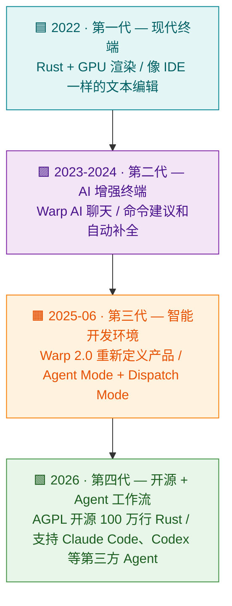
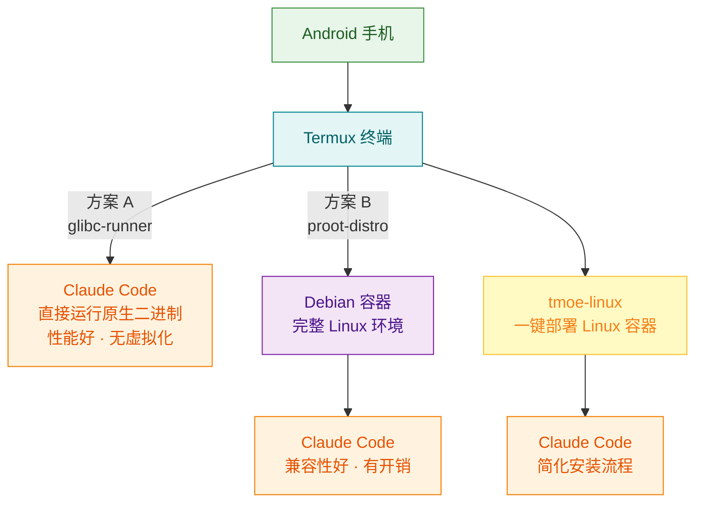
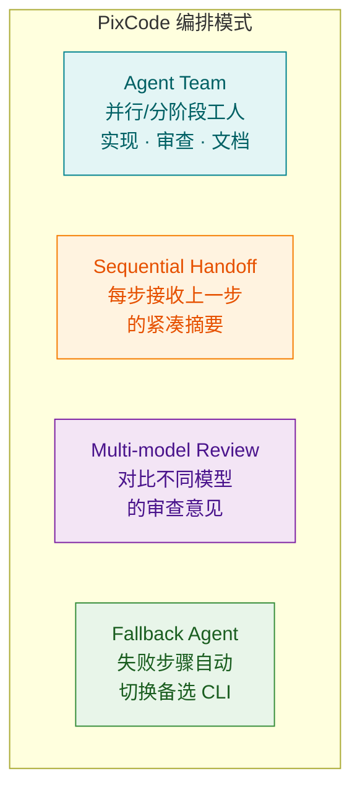
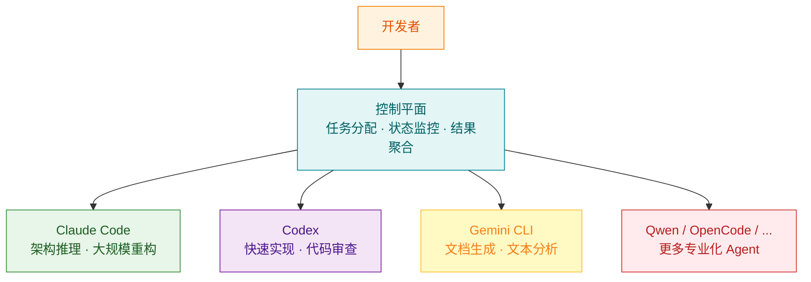
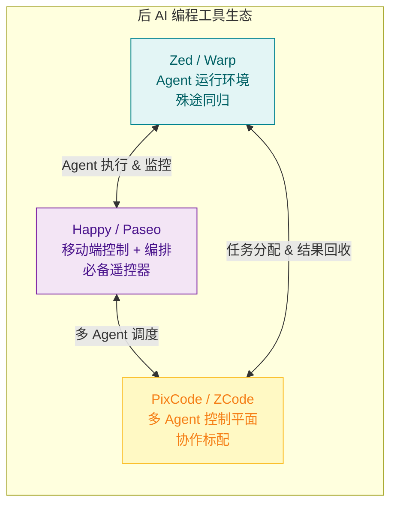

## 引言

2026 年 4 月，Warp 在 GitHub 开源了其 100 万行 Rust 代码库，一个终端模拟器获得了近 6 万颗星。5 月，OpenAI 把 Codex 直接塞进了 ChatGPT 移动端 App——手机变成了 Agent 的随身控制台。同月，OpenAI 为竞品 Claude Code 发布了官方插件，让 Codex 直接给 Claude Code 打下手。

这三件事放在一起，指向一个正在发生的变化：**编程工具不再围绕"人怎么写代码"设计，而是围绕"Agent 怎么写代码、人怎么管 Agent"设计。**

上一篇文章讨论了 AI 编程范式的演进——从 Vibe Coding 到 Agent 模式，关注的是"人怎么用 AI"。这篇文章关注另一个维度：**AI 成为编程主体之后，围绕 AI 的工具生态正在经历怎样的进化？**

这不是一个AI工具的罗列。这是对后 AI 编程时代工具走向的一次梳理——编辑器和终端正在殊途同归，移动端正在从噱头变成必备品，多 Agent 协作正在从社区 Hack 变成基础设施。每一股力量都在指向同一个方向。

<!-- more -->

---

## 一、殊途同归：编辑器与终端的 Agent 化

这个时代最有趣的现象之一：**从编辑器出发的 Zed 和从终端出发的 Warp，正在收敛到同一个终点——Agent 开发环境。**

一个是 Atom 创始人的第二次革命，一个是红杉押注的终端新物种。起点不同，方向一致。


### Zed：编辑器的 Agent 化

| 维度 | 数据 |
|------|------|
| 仓库 | [zed-industries/zed](https://github.com/zed-industries/zed) |
| 语言 | Rust（200+ Crates） |
| Stars | 58,000+ |
| 创建者 | Atom 和 Tree-sitter 的作者 |
| 许可证 | 开源（GPUI 框架 + AGPL） |
| 平台 | macOS, Linux, Windows |

Zed 的创始团队来自 Atom 编辑器。Atom 曾经是"可 hack 的编辑器"的代名词，但最终因为 Electron 的性能瓶颈输给了 VS Code。Zed 是他们的第二次尝试，底层完全重写——自研 GPUI（GPU 加速 UI 框架，不用 Electron），200+ Rust Crates，协作作为架构基础。

这些技术选择在 2024 年之前看起来像是"追求极致性能的极客项目"。但在 Agent 编程时代，它们的意义变了——Agent 产生的操作频率远高于人类操作，GPU 加速不是为了丝滑滚动，而是为了让 Agent 的大批量文件操作不卡顿。

Zed 对 AI 的集成方式与 VS Code + Copilot 有根本区别：

| 维度 | VS Code + Copilot | Zed AI |
|------|-------------------|--------|
| AI 架构 | Copilot 深度绑定 | Provider-Agnostic（多模型注册表） |
| 模型支持 | OpenAI/Copilot 为主 | Anthropic、OpenAI、Google AI、Ollama、DeepSeek、Copilot 等 13+ |
| Agent 模式 | Copilot Chat | Agent Panel（一等公民面板） |
| 配置粒度 | 统一模型 | 4 个独立模型槽位 |
| 本地模型 | 有限支持 | Ollama/LMStudio 原生集成 |

Zed 的 `LanguageModelRegistry` 维护了四个独立的模型槽位：

| 槽位 | 用途 |
|------|------|
| `default_model` | 主助手模型（Assistant Panel、Agent） |
| `inline_assistant_model` | 内联补全（Copilot 风格） |
| `commit_message_model` | Git 提交信息生成 |
| `thread_summary_model` | 对话线程摘要 |

这个设计反映了一个认知：**不同任务需要不同模型**。Agent 模式用 Claude Opus 做推理，内联补全用本地 Ollama 做快速建议，提交信息用便宜模型生成——每个环节各司其职。

2025 年，Zed 做了一个意味深长的 UI 决策：引入面板布局切换器，在"经典模式"和"Agent 模式"之间切换。这不是加了个侧边栏——这是承认 **AI 优先的工作流是一种独立的操作模式**。Agent 可以读写代码（Unified Diff）、并行运行、内置 Skills 系统、支持计划模式。

### Warp：终端的 Agent 化

| 维度 | 数据 |
|------|------|
| 仓库 | [warpdotdev/warp](https://github.com/warpdotdev/warp) |
| 语言 | Rust（98.2%，100 万+ 行） |
| Stars | 58,500+ |
| 融资 | 7,300 万美元（红杉领投） |
| 许可证 | AGPL-3.0（2026 年 4 月开源） |
| 平台 | macOS, Linux, Windows |

Warp 的创始人 Zach Lloyd 说："它不是终端，也不是 IDE。它是智能开发环境（Agentic Development Environment, ADE）。"这句话定义了一个新品类。

Warp 不是"AI 增强的终端"，它经历了四代进化：



Warp 的 AI 能力是分层的——这是它区别于所有其他终端的核心设计：

- **Active AI（始终在线）**：Next Command 预览下一个命令，Tab 接受；命令失败自动建议修复；编译器错误和合并冲突自动生成修复代码
- **Agent Mode（多轮对话）**：AI 自主执行命令、读取文件、编写代码。Dispatch Mode 让 AI 自主运行无需逐一授权，Planning Mode 用推理模型先对齐人类意图再行动
- **MCP 集成**：通过 Model Context Protocol 连接 Brave、GitHub、Postgres 等外部工具

Warp 还做了一个关键设计：**Block 架构**。每个命令及其输出是一个可导航、可共享、可过滤的独立单元——AI 能"理解你在做什么"，是因为每个 Block 都是结构化的上下文单元。

| 维度 | 传统终端 | Warp Block |
|------|----------|------------|
| 输出组织 | 连续文本流 | 离散块（命令+输出成组） |
| 导航 | 滚动查找 | 块级跳转、过滤 |
| 共享 | 复制粘贴 | Block Permalink（可共享链接） |
| AI 理解 | 无结构 | 每个 Block 都是 AI 的上下文单元 |

2026 年开源后，Warp 最引人注目的特性是**在同一个终端中原生运行 Claude Code、Codex、Gemini CLI 等第三方 Agent**——终端变成了 Agent 平台。

### 收敛点

把 Zed 和 Warp 放在一起看，会发现它们在做同一件事：

| 维度 | Zed | Warp |
|------|-----|------|
| 起点 | 编辑器 | 终端 |
| 终点 | Agent 运行环境 | Agent 开发环境 (ADE) |
| 多模型 | 13+ LLM Provider | 多模型切换 |
| Agent 支持 | Agent Panel + 并行 Agent | Agent Mode + 第三方 Agent |
| 核心理念 | 让 Agent 在编辑器里高效工作 | 让 Agent 在终端里高效工作 |

**它们的终点很可能是同一个东西**——一个 Agent 原生的开发环境，同时具备代码编辑、命令执行、Agent 调度、多模型管理的能力。区别只是从编辑器还是从终端出发。这个收敛不是偶然的——当 Agent 成为编程的主体，无论你从哪个入口进来，最终都需要一个让 Agent 高效工作、让人保持控制的环境。

---

## 二、移动端：从噱头到必备

### Agent 编程为什么让移动端变成必需品

在 AI Agent 出现之前，"从手机控制开发环境"是一个伪需求——开发活动本身就需要坐在电脑前。但 Agent 改变了一切：

- Agent 是**长时间运行的**：一个任务可能跑 30 分钟到数小时
- Agent 需要**人类决策**：权限确认、方案选择、错误处理
- Agent 产出**需要审核**：代码审查、架构验证

这意味着开发者需要一种能力：**离开键盘但保持连接**。就像 CI/CD 有 PagerDuty 做告警，Agent 编程需要移动端做监控和决策。**这不是锦上添花，是必需品。**


### 官方方案：Codex 移动端

2026 年 5 月，OpenAI 把 Codex 直接塞进了 ChatGPT 移动端 App——不是第三方 Hook，不是社区插件，而是**官方的一体化移动体验**。iOS 和 Android 同步上线，所有套餐（包括 Free）可用。

Codex 移动端的设计逻辑很清晰：**手机不是执行环境，而是随身控制台**。任务仍然在 laptop、devbox 或远程环境里跑，手机只负责判断和决策：

- **实时回传**：截图、终端输出、diff、测试结果、审批请求实时浮出，过程不是黑箱
- **全线程管理**：查看所有 active threads，哪些在 Working、哪些在 Needs input、哪些 Completed
- **原地操作**：补充上下文、批准命令、切换模型、调整方向，甚至直接开新 thread
- **安全边界**：文件、凭证、权限始终留在运行 Codex 的机器上，secure relay 只同步状态和操作

Codex 移动端的意义在于它**定义了移动端 Agent 控制的正统形态**——不是把开发环境搬到手机上，不是通过第三方中继间接控制，而是 Agent 原生内置的移动控制能力。之前这只能通过社区方案实现，现在官方直接给了答案。

配套的企业级能力也在同步推进：Remote SSH 已经 GA（Codex desktop 直接识别 SSH 配置里的 hosts）、Hooks GA（接入 secrets 扫描、validators、对话记录等流程）、programmatic access tokens 面向 Enterprise/Business。

### 第三方方案：Happy + Paseo

Codex 移动端目前只服务 Codex 自己。但开发者的 Agent 生态不止一个——Claude Code、Gemini CLI、OpenCode 等都是日常工具。针对这些 Agent，社区方案填补了官方移动支持的空白。

**Happy — Agent 的移动监控面板**

| 维度 | 数据 |
|------|------|
| 仓库 | [slopus/happy](https://github.com/slopus/happy) |
| Stars | 20,700+ / Google Play 4.9 分 |
| 许可证 | MIT / 平台：iOS, Android, Web |

Happy 的架构是三层加密中继——CLI 封装 Claude Code/Codex → 中继服务器只传加密 Blob → 移动端解密显示：

```bash
npm install -g happy
happy claude     # 替代 "claude"
```

它针对 Agent 工作流做了专门设计：并行会话监控、推送通知（Agent 需要许可时即时提醒）、端到端加密、实时语音控制（口述命令直接让 Agent 执行）、全终端功能对等。Happy 不是移动 SSH，它是 Agent 的**专属移动客户端**——但接入方式是通过 CLI 包装，而非 Agent 原生内置。

**Paseo — 多 Agent 移动编排平台**

| 维度 | 数据 |
|------|------|
| 仓库 | [getpaseo/paseo](https://github.com/getpaseo/paseo) |
| Stars | 6,100+ / 93 个版本 |
| 许可证 | AGPL-3.0 / 平台：iOS, Android, Desktop, Web, CLI |

Paseo 比 Happy 更进一步——不只是监控单个 Agent，而是**从手机编排多个 Agent 协作**。它运行一个本地守护进程，管理 31+ 个编码 Agent（Claude Code、Codex、OpenCode、Copilot、Gemini 等），并提供跨设备功能完全对等。

内置五种编排技能：

| 技能 | 描述 |
|------|------|
| `/paseo-handoff` | 任务从一个 Agent 交接给另一个（Claude 规划 → Codex 实现） |
| `/paseo-loop` | Worker/Validator 循环迭代，直到满足退出条件 |
| `/paseo-committee` | 两个高推理 Agent 做根因分析（只分析不动手） |
| `/paseo-advisor` | 启动一个 Agent 做第二意见 |
| `/paseo-epic` | 重型仪式：研究→规划→对抗性审查→实现→审计→交付 |

```bash
paseo run --provider claude/opus-4.6 "implement user auth"
paseo ls                    # 列出运行中的 Agent
paseo attach abc123         # 实时流式输出
```

Paseo 的守护进程始终运行在开发者自己的机器上，语音技术栈（STT + TTS）完全本地运行，无遥测、无跟踪——**数据主权**是核心设计原则。

### 本地运行：Termux 方案

社区里还有一个更激进的路线：**直接在 Android 手机上跑完整版 Claude Code**。



社区发展出三种路径——glibc-runner 直接执行原生二进制（性能最好）、proot-distro 跑完整 Debian 容器（兼容性好但有开销）、tmoe-linux 一键脚本简化整个流程。移动端还可以通过 [Claude Code Router](https://github.com/musistudio/claude-code-router) 按任务类型切换模型。

### 三种路线的定位

| 维度 | Codex 移动端（官方） | Happy / Paseo（第三方） | Termux（本地） |
|------|---------------------|------------------------|----------------|
| 接入方式 | Agent 原生内置 | CLI 包装 / 守护进程 | 直接在手机运行 |
| 覆盖范围 | 仅 Codex | Claude Code / Codex / Gemini 等 31+ Agent | 单个 Agent |
| 实时回传 | 截图、终端、diff、测试结果 | 文本输出 + 推送通知 | 直接在终端看 |
| 安全模型 | secure relay，文件凭证留在本地 | E2E 加密中继，数据主权 | 完全本地 |
| 多 Agent | 不支持 | Paseo 支持多 Agent 编排 | 不支持 |
| 适用场景 | **Codex 用户的日常移动控制** | 多 Agent 生态用户 / 隐私敏感 | 旧设备复用 / 应急 |

**结论**：Codex 移动端定义了"正统"形态——Agent 原生内置移动控制，而非通过第三方间接接入。但它的局限也很明显：只覆盖 Codex 自己。当你同时用 Claude Code 和 Codex（甚至更多 Agent）时，Happy/Paseo 的多 Agent 移动编排反而更实用。Termux 的真正价值在于**旧设备复用**——闲置的 Android 手机可以变成 24/7 运行的 Agent 工作节点。

### 还缺一环：云端基础设施

三条路线共同指向一个结论：**Agent 编程正在打破"开发必须在电脑前"的空间限制**。但移动端真正成熟，还缺一环——**云端代码服务的深度集成**。

目前的移动端工具（包括 Codex 移动端）更多是"终端/桌面的延伸"，而不是原生的云端开发体验。当 GitHub/GitLab 提供了 Agent 原生的 API——不只是 Git 操作，而是让 Agent 直接在云端仓库中工作、审查、部署——移动端才会真正成为独立的开发工具，而不仅仅是遥控器。这个基础设施的缺位，可能是移动端下一步进化的方向。

---

## 三、多 Agent 协作：不是选配而是标配

### 一个真实的痛点

如果你同时用过 Claude Code 和 Codex，很快会发现它们各有所长：

| Agent | 擅长 | 弱项 |
|-------|------|------|
| Claude Code | 大规模重构、复杂架构推理、长上下文理解 | 有时过度设计、响应稍慢 |
| Codex | 快速定向编辑、代码审查、简洁实现 | 复杂推理和长链规划偏弱 |
| Gemini CLI | 文档生成、长文本分析、多语言支持 | 代码质量不稳定 |

痛点来了：**为什么不能让 Claude Code 做规划、Codex 做实现、Gemini CLI 写文档？** 让每个 Agent 干最擅长的事，而不是被迫用一个 Agent 干所有事。

这不是"如果"的问题，而是"什么时候"的问题。**多 Agent 协作是必然趋势。**


### 开放的态度：Codex Plugin for Claude Code

2026 年 3 月，OpenAI 发布了一个意味深长的项目：[Codex Plugin for Claude Code](https://github.com/openai/codex-plugin-cc)。它让 Claude Code 可以直接调用 Codex 完成三种任务：

1. **标准审查**：让 Codex 审查 Claude Code 刚写的代码
2. **对抗性审查**：让 Codex 以"找茬"模式审查，发现 Claude Code 的盲点
3. **任务交接**：Claude Code 做完规划后，把实现工作交给 Codex

```bash
# 在 Claude Code 中通过斜杠命令调用 Codex
/codex review          # 标准审查
/codex adversarial     # 对抗性审查
/codex implement ...   # 交接任务给 Codex
```

这个插件的意义不在于技术本身——**OpenAI 专门为竞品（Claude Code）写了插件**。这代表了一种态度：在 Agent 时代，封闭生态不如开放协作。"多 Agent 协作"的需求已经强烈到厂商无法忽视，即使这意味着帮助用户使用竞品。

### 控制平面：让各路 Agent 各司其职

当多 Agent 协作成为常态，自然需要一个"控制平面"来调度。

**PixCode — 自托管的 Agent 控制室**

[PixCode](https://alicomert.github.io/pixcode/landing.html) 的定位很清晰：终端只能展示 Agent 的文字输出，但 Agent 的实际工作涉及文件变更、Git 操作、Shell 执行、任务规划——这些需要一个真正的可视化工作区。

```bash
npx @pixelbyte-software/pixcode
open http://localhost:3001
```

| 能力 | 描述 |
|------|------|
| 多 Agent 对话 | 同一个界面切换 Claude Code、Codex、Gemini CLI、Qwen Code、OpenCode |
| 变更追踪 | 实时显示 Git 和本地文件变更，高亮编辑位置 |
| 分屏面板 | 主聊天 + 文件查看 + Shell + 源码控制，同时可见 |
| Agent 编排 | 并行团队、顺序交接、多模型评审、Fallback Agent |
| TaskMaster | PRD 解析 → 任务拆分 → Agent 执行 |
| 外部自动化 | REST API、WebSocket、`px_` API Key，可接入 CI/Telegram |
| 远程工作 | 安装在工作站上，浏览器或 Telegram 远程控制 |



PixCode 是自托管的——所有数据留在你自己的机器或服务器上，支持 daemon 模式常驻后台。

**ZCode — 多 Agent 桌面 IDE**

[ZCode](https://zcode-ai.com) 走了另一条路——不是一个控制面板，而是一个**完整的桌面 IDE**，原生支持多 Agent 协作。核心体验是"任务视图"——左侧任务列表（`⌘N` 新建），右侧终端 + Agent 对话 + 文件变更面板。每个任务可以指定不同的 Agent 执行，任务之间有时间线追踪，你能看到每个 Agent 花了多长时间、改了什么文件。

主要能力：全局代码理解（跨仓库追踪上下文）、自动化代码审查、多 Agent 任务分配、集成现有工具链。ZCode 的定位更偏向"团队级"——整个开发团队的多 Agent 协作平台。

### 控制平面的架构共性

无论是 Codex Plugin（插件级）、PixCode（控制面板级）还是 ZCode（IDE 级），它们都指向同一个架构：



核心思想：**开发者不再直接操作 Agent，而是通过控制平面来调度 Agent**。控制平面负责任务拆分、Agent 路由、结果聚合和冲突解决。开发者只需要定义"做什么"，控制平面决定"谁来做"和"怎么做"。

### 未来：更兼容的标准

目前每个控制平面都在做自己的 Agent 接入和调度逻辑——PixCode 用自己的 CLI 封装，ZCode 用自己的 IDE 集成，Paseo 用自己的编排 Skills。这是一种早期市场的正常状态。

但随着 MCP（Model Context Protocol）等协议的成熟，未来可能出现 **Agent 间通信的标准化协议**——让任何 Agent 都能被任何控制平面调度，就像 USB 标准让任何设备都能接入任何电脑。到那时，控制平面会更丝滑，开发者只需要选择调度策略，而不需要关心 Agent 的接入方式。开放的态度已经确立（OpenAI 给 Claude Code 写插件就是信号），接下来只是时间和标准的问题。

---

## 四、开发者的新坐标

### 从驾驶到车队管理

传统软件开发像**驾驶**：你握着方向盘，脚踩油门，每一个操作都是你亲自执行。

Agent 编程像**管理一支车队**：每辆车（Agent）有自己的司机，你需要做的是规划路线（任务拆解）、处理突发情况（权限决策）、审核交付（代码审查）。

对应到工具：
- **驾驶时**你需要的是好方向盘和好引擎（传统编辑器和终端）
- **管理车队时**你需要的是调度中心（PixCode/ZCode）、监控仪表盘（Happy）、车辆维护车间（Zed/Warp）、编排系统（Paseo）


### 技能树的重组

| 传统技能 | 重要度变化 | 新兴技能 |
|----------|-----------|----------|
| 编写代码 | ↓ 降低 | Agent 任务拆解与描述 |
| 调试代码 | ↓ 降低 | Agent 输出审核与校验 |
| 熟悉 IDE 快捷键 | ↓ 降低 | 多 Agent 编排与控制平面操作 |
| 架构设计 | → 不变 | Agent Provider 选择与模型路由 |
| 代码审查 | ↑ 升高 | Agent 权限与安全策略管理 |

这不是说写代码不再重要，而是说**写代码这件事正在被 Agent 大规模替代**，开发者的核心竞争力正在向"怎么用 Agent"和"怎么管理 Agent"迁移。

### 后 AI 编程的工具全景

把所有线索串起来，后 AI 编程时代的工具生态长这样：



三条线——Agent 环境（编辑器/终端收敛）、移动控制（从噱头到必备）、多 Agent 编排（从选配到标配）——互相咬合，形成闭环。开发者在这个闭环中的角色不再是"操作工具的人"，而是"编排 Agent 的人"。


---

## 参考资料

- [Zed Editor - GitHub](https://github.com/zed-industries/zed)
- [Zed AI Overview](https://zed.dev/docs/ai/overview)
- [Zed vs VS Code - Zread](https://zread.ai/zed-industries/zed/6-zed-vs-vs-code)
- [Is Zed Ready for AI Power Users in 2026? - Builder.io](https://www.builder.io/blog/zed-ai-2026)
- [Warp Terminal - GitHub](https://github.com/warpdotdev/warp)
- [Introducing Warp 2.0: The Agentic Development Environment](https://www.warp.dev/blog/reimagining-coding-agentic-development-environment)
- [Happy Coder - GitHub](https://github.com/slopus/happy)
- [Happy Engineering - Official Site](https://happy.engineering/)
- [Paseo - GitHub](https://github.com/getpaseo/paseo)
- [Paseo - Official Site](https://paseo.sh/)
- [Paseo Orchestration Skills Docs](https://paseo.sh/docs/skills)
- [tmoe-linux - GitHub](https://github.com/longzheng268/tmoe-linux)
- [tmoe-linux 参考手册](https://doc.tmoe.me/zh/android.html)
- [如何在手机上跑完整版的 Claude Code - LINUX DO](https://linux.do/t/topic/1755579)
- [Android Termux 安装最新版 Claude Code 的两种方案 - LINUX DO](https://linux.do/t/topic/1993843)
- [在 Termux 中运行 Claude Code 并设置 Claude Code Router - CloseX](https://blog.closex.org/cn/posts/8e3fd37d/)
- [Claude Code 在 Termux 上安装很简单 - Reddit](https://www.reddit.com/r/termux/comments/1jd4y4y/claude_code_is_easy_to_install_on_termux/)
- [Work with Codex from anywhere - OpenAI](https://openai.com/index/work-with-codex-from-anywhere/)
- [OpenAI says Codex is coming to your phone - TechCrunch](https://techcrunch.com/2026/05/14/openai-says-codex-is-coming-to-your-phone/)
- [Codex Plugin for Claude Code - GitHub](https://github.com/openai/codex-plugin-cc)
- [PixCode - Official Site](https://alicomert.github.io/pixcode/landing.html)
- [PixCode - GitHub](https://github.com/pixelbyte-software/pixcode)
- [ZCode - Official Site](https://zcode-ai.com)
